- [导学](#导学)
  - [00 | 开篇词](#00--开篇词)
    - [什么是浏览器？](#什么是浏览器)
    - [浏览器进化路线](#浏览器进化路线)
    - [为什么需要学习浏览器工作原理？](#为什么需要学习浏览器工作原理)
    - [应该如何学习前端呢？](#应该如何学习前端呢)
    - [前端技术的演进](#前端技术的演进)
- [宏观视角下的浏览器](#宏观视角下的浏览器)
  - [01丨Chrome架构：仅仅打开了1个页面，为什么有4个进程？](#01丨chrome架构仅仅打开了1个页面为什么有4个进程)
    - [进程和线程](#进程和线程)
      - [什么是并行处理](#什么是并行处理)
      - [线程 VS 进程](#线程-vs-进程)
      - [线程跟进程的关系](#线程跟进程的关系)
    - [单进程浏览器时代](#单进程浏览器时代)
    - [多进程浏览器时代](#多进程浏览器时代)
      - [早期多进程架构](#早期多进程架构)
      - [目前多进程架构](#目前多进程架构)
    - [未来面向服务的架构](#未来面向服务的架构)
    - [总结](#总结)
  - [02丨TCP协议：如何保证页面文件能被完整送达浏览器？](#02丨tcp协议如何保证页面文件能被完整送达浏览器)
    - [IP：把数据包送达目的主机](#ip把数据包送达目的主机)
    - [UDP：把数据包送达应用程序](#udp把数据包送达应用程序)
    - [TCP：把数据完整地送达应用程序](#tcp把数据完整地送达应用程序)
    - [总结](#总结-1)
  - [03丨HTTP请求流程：为什么很多站点第二次打开速度会很快？](#03丨http请求流程为什么很多站点第二次打开速度会很快)
    - [浏览器端发起 HTTP 请求流程](#浏览器端发起-http-请求流程)
      - [1 构建请求](#1-构建请求)
      - [2 查找缓存](#2-查找缓存)
      - [准备 IP 地址和端口](#准备-ip-地址和端口)
      - [等待 TCP 队列](#等待-tcp-队列)
      - [建立 TCP 连接](#建立-tcp-连接)
      - [发送 HTTP 请求](#发送-http-请求)
    - [服务器端处理 HTTP 请求流程](#服务器端处理-http-请求流程)
      - [返回请求](#返回请求)
      - [断开连接](#断开连接)
    - [问题解答](#问题解答)
      - [为什么很多站点第二次打开速度会很快？](#为什么很多站点第二次打开速度会很快)
      - [登录状态是如何保持的？](#登录状态是如何保持的)
    - [总结](#总结-2)
    - [学习技巧](#学习技巧)
  - [04丨导航流程：从输入URL到页面展示，这中间发生了什么？](#04丨导航流程从输入url到页面展示这中间发生了什么)
    - [1. 用户输入](#1-用户输入)
    - [2. URL 请求过程](#2-url-请求过程)
      - [重定向](#重定向)
      - [响应数据类型处理](#响应数据类型处理)
    - [3. 准备渲染进程](#3-准备渲染进程)
    - [4. 提交文档](#4-提交文档)
    - [5. 渲染阶段](#5-渲染阶段)
  - [05丨渲染流程（上）：HTML、CSS和JavaScript，是如何变成页面的？](#05丨渲染流程上htmlcss和javascript是如何变成页面的)
    - [构建 DOM 树](#构建-dom-树)
    - [样式计算](#样式计算)
      - [1. 把 CSS 转换为浏览器能够理解的结构](#1-把-css-转换为浏览器能够理解的结构)
      - [2. 转换样式表中的属性值，使其标准化](#2-转换样式表中的属性值使其标准化)
      - [3. 计算出 DOM 树中每个节点的具体样式](#3-计算出-dom-树中每个节点的具体样式)
    - [布局阶段](#布局阶段)
      - [1. 创建布局树](#1-创建布局树)
      - [2. 布局计算](#2-布局计算)
    - [总结](#总结-3)
  - [06丨渲染流程（下）：HTML、CSS和JavaScript，是如何变成页面的？](#06丨渲染流程下htmlcss和javascript是如何变成页面的)
    - [分层](#分层)
    - [图层绘制](#图层绘制)
    - [栅格化（raster）操作](#栅格化raster操作)
    - [合成和显示](#合成和显示)
    - [渲染流水线大总结](#渲染流水线大总结)
    - [相关概念](#相关概念)
      - [1. 更新了元素的几何属性（重排）](#1-更新了元素的几何属性重排)
      - [2. 更新元素的绘制属性（重绘）](#2-更新元素的绘制属性重绘)
      - [3. 直接合成阶段](#3-直接合成阶段)
  - [渲染小结](#渲染小结)
- [浏览器中的JavaScript执行机制](#浏览器中的javascript执行机制)
  - [07丨变量提升：JavaScript代码是按顺序执行的吗？](#07丨变量提升javascript代码是按顺序执行的吗)
    - [变量提升](#变量提升)
    - [JavaScript 代码的执行流程](#javascript-代码的执行流程)
      - [1. 编译阶段](#1-编译阶段)
      - [2. 执行阶段](#2-执行阶段)
    - [代码中出现相同的变量或者函数怎么办？](#代码中出现相同的变量或者函数怎么办)
    - [总结](#总结-4)
  - [08丨调用栈：为什么JavaScript代码会出现栈溢出？](#08丨调用栈为什么javascript代码会出现栈溢出)
    - [函数调用](#函数调用)
    - [JavaScript 的调用栈](#javascript-的调用栈)
    - [在开发中，如何利用好调用栈](#在开发中如何利用好调用栈)
      - [1. 如何利用浏览器查看调用栈的信息](#1-如何利用浏览器查看调用栈的信息)
      - [2. 栈溢出（Stack Overflow）](#2-栈溢出stack-overflow)
  - [09丨块级作用域：var缺陷以及为什么要引入let和const？](#09丨块级作用域var缺陷以及为什么要引入let和const)
    - [作用域（scope）](#作用域scope)
    - [变量提升所带来的问题](#变量提升所带来的问题)
      - [1. 变量容易在不被察觉的情况下被覆盖掉](#1-变量容易在不被察觉的情况下被覆盖掉)
      - [2. 本应销毁的变量没有被销毁](#2-本应销毁的变量没有被销毁)
    - [ES6 是如何解决变量提升带来的缺陷](#es6-是如何解决变量提升带来的缺陷)
    - [JavaScript 是如何支持块级作用域的](#javascript-是如何支持块级作用域的)
  - [10丨作用域链和闭包：代码中出现相同的变量，JavaScript引擎是如何选择的？](#10丨作用域链和闭包代码中出现相同的变量javascript引擎是如何选择的)
    - [作用域链](#作用域链)
    - [词法作用域](#词法作用域)
    - [闭包](#闭包)
  - [11丨this：从JavaScript执行上下文的视角讲清楚this](#11丨this从javascript执行上下文的视角讲清楚this)
    - [JavaScript 中的 this 是什么](#javascript-中的-this-是什么)
    - [全局执行上下文中的 this](#全局执行上下文中的-this)
    - [函数执行上下文中的 this](#函数执行上下文中的-this)
    - [this 的设计缺陷以及应对方案](#this-的设计缺陷以及应对方案)
- [V8工作原理](#v8工作原理)
  - [12丨栈空间和堆空间：数据是如何存储的？](#12丨栈空间和堆空间数据是如何存储的)
    - [JavaScript 是什么类型的语言](#javascript-是什么类型的语言)
    - [JavaScript 的数据类型](#javascript-的数据类型)
    - [内存空间](#内存空间)
      - [栈空间和堆空间](#栈空间和堆空间)
    - [再谈闭包](#再谈闭包)
  - [13丨垃圾回收：垃圾数据是如何自动回收的？](#13丨垃圾回收垃圾数据是如何自动回收的)
    - [不同语言的垃圾回收策略](#不同语言的垃圾回收策略)
    - [调用栈中的数据是如何回收的](#调用栈中的数据是如何回收的)
    - [堆中的数据是如何回收的](#堆中的数据是如何回收的)
      - [代际假说和分代收集](#代际假说和分代收集)
      - [垃圾回收器的工作流程](#垃圾回收器的工作流程)
      - [副垃圾回收器](#副垃圾回收器)
      - [主垃圾回收器](#主垃圾回收器)
      - [全停顿](#全停顿)
  - [14丨编译器和解释器：V8是如何执行一段JavaScript代码的？](#14丨编译器和解释器v8是如何执行一段javascript代码的)
    - [编译器和解释器](#编译器和解释器)
    - [V8 是如何执行一段 JavaScript 代码的](#v8-是如何执行一段-javascript-代码的)
      - [1. 生成抽象语法树（AST）和执行上下文](#1-生成抽象语法树ast和执行上下文)
      - [2. 生成字节码](#2-生成字节码)
      - [3. 执行代码](#3-执行代码)
    - [JavaScript 的性能优化](#javascript-的性能优化)
- [浏览器中的页面循环系统](#浏览器中的页面循环系统)
  - [15丨消息队列和事件循环：页面是怎么“活”起来的？](#15丨消息队列和事件循环页面是怎么活起来的)
    - [第一版线程模型](#第一版线程模型)
    - [第二版线程模型](#第二版线程模型)
    - [第三版线程模型](#第三版线程模型)
    - [处理其他进程发送过来的任务](#处理其他进程发送过来的任务)
    - [页面使用单线程的缺点](#页面使用单线程的缺点)
  - [16丨WebAPI：setTimeout是如何实现的？](#16丨webapisettimeout是如何实现的)
    - [浏览器怎么实现 setTimeout](#浏览器怎么实现-settimeout)
    - [使用 setTimeout 的一些注意事项](#使用-settimeout-的一些注意事项)
    - [总结](#总结-5)
  - [17丨WebAPI：XMLHttpRequest是怎么实现的？](#17丨webapixmlhttprequest是怎么实现的)
  - [18丨宏任务和微任务：不是所有任务都是一个待遇](#18丨宏任务和微任务不是所有任务都是一个待遇)
  - [19丨Promise：使用Promise，告别回调函数](#19丨promise使用promise告别回调函数)
    - [异步编程的问题：代码逻辑不连续](#异步编程的问题代码逻辑不连续)
    - [封装异步代码，让处理流程变得线性](#封装异步代码让处理流程变得线性)
    - [新的问题：回调地狱](#新的问题回调地狱)
    - [Promise：消灭嵌套调用和多次错误处理](#promise消灭嵌套调用和多次错误处理)
    - [Promise 与微任务](#promise-与微任务)
  - [20丨async-await：使用同步的方式去写异步代码](#20丨async-await使用同步的方式去写异步代码)
- [浏览器中的页面](#浏览器中的页面)
  - [21丨Chrome开发者工具：利用网络面板做性能分析](#21丨chrome开发者工具利用网络面板做性能分析)
  - [22丨DOM树：JavaScript是如何影响DOM树构建的？](#22丨dom树javascript是如何影响dom树构建的)
  - [23丨渲染流水线：CSS如何影响首次加载时的白屏时间？](#23丨渲染流水线css如何影响首次加载时的白屏时间)
  - [24丨分层和合成机制：为什么CSS动画比JavaScript高效？](#24丨分层和合成机制为什么css动画比javascript高效)
  - [25丨页面性能：如何系统地优化页面？](#25丨页面性能如何系统地优化页面)
  - [26丨虚拟DOM：虚拟DOM和实际的DOM有何不同？](#26丨虚拟dom虚拟dom和实际的dom有何不同)
  - [27丨渐进式网页应用（PWA）：它究竟解决了Web应用的哪些问题？](#27丨渐进式网页应用pwa它究竟解决了web应用的哪些问题)
  - [28丨WebComponent：像搭积木一样构建Web应用](#28丨webcomponent像搭积木一样构建web应用)
- [浏览器中的网络](#浏览器中的网络)
  - [29丨HTTP-1：HTTP性能优化](#29丨http-1http性能优化)
  - [30｜HTTP-2：如何提升网络速度？](#30｜http-2如何提升网络速度)
  - [31｜HTTP-3：甩掉TCP、TLS的包袱，构建高效网络](#31｜http-3甩掉tcptls的包袱构建高效网络)
- [浏览器安全](#浏览器安全)
  - [32丨同源策略：为什么XMLHttpRequest不能跨域请求资源？](#32丨同源策略为什么xmlhttprequest不能跨域请求资源)
  - [33丨跨站脚本攻击（XSS）：为什么Cookie中有HttpOnly属性？](#33丨跨站脚本攻击xss为什么cookie中有httponly属性)
  - [34丨CSRF攻击：陌生链接不要随便点](#34丨csrf攻击陌生链接不要随便点)
  - [35丨安全沙箱：页面和系统之间的隔离墙](#35丨安全沙箱页面和系统之间的隔离墙)
  - [36丨HTTPS：让数据传输更安全](#36丨https让数据传输更安全)

<!-- /TOC -->
# 导学
## 00 | 开篇词

### 什么是浏览器？

浏览器背后是标准，标准的背后是共识。

浏览器是基于一套套标准的实现。外壳是浏览器，本质是标准的实现。

<br/>
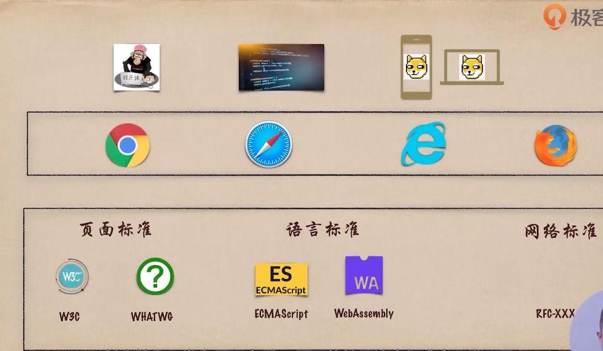
<br/>

### 浏览器进化路线

未来的浏览器，有三个大的进化路线：

1. 应用程序 Web 化

视频、音频、游戏几大核心场景也都在往 Web 的使用场景切换

2. Web 应用移动化

Google 推出了 PWA 方案来整合 Web 和本地程序各自的优势

3. Web 操作系统化

一是利用 Web 技术构建一个纯粹的操作系统，如 ChromeOS；

二是浏览器的底层结构往操作系统架构方向发展

也就是说，浏览器是披着应用外衣的小型操作系统，浏览器已经逐步演化成了操作系统之上的“操作系统”。


### 为什么需要学习浏览器工作原理？

1. 准确评估 Web 开发项目的可行性
2. 从更高维度审视页面
3. 在快节奏的技术迭代中把握本质

> 一、关于从更高纬度审视页面
>
> 如果你把浏览器当成黑盒处理，也可以写前端代码，也可以使用很多最佳实践的策略来优化代码，这就如同不了解操作系统的工作原理同样可以在操作系统上写应用一样。
>
> 但如果你理解了这个黑盒子是如何工作的，那情况就不同了。你可以站在更高的维度审视你的项目，通过全视野快速定位项目中不合理的地方。比如，首屏的显示就涉及了 > DNS、HTTP、DOM 解析、CSS 阻塞、JavaScript 阻塞等技术因素，其中一项没处理好就可能导致整个页面的延时。
>
> 而如果你了解了浏览器的工作原理，更加可以把这些知识点串成线，连成网，最终形成自己的知识体系，练就像专家一样思考问题、解决问题的能力。
>
> 二、在快节奏的技术迭代中把握本质
>
> 前端技术的发展，很大程度是依赖于浏览器的发展。
>
> 现阶段，浏览器功能以及整个前端的开发环境，不足以支撑日益增长的需求：脚本执行效率、页面渲染性能和开发工具链都有待完善。
>
> 谁能快速抓住变化，谁就能收获这波变化带来的红利。
>
> 了解浏览器的工作机制，可以更好梳理出来前端技术的发展脉络，更加深刻地理解当前的技术，同时清楚其不足之处，以及演化方向。

### 应该如何学习前端呢？

通过学习浏览器，搭建自己的知识体系

浏览器可以分为 5 个核心部分。

1. 浏览器架构设计
2. JS 引擎工作原理
3. 页面工作原理（事件循环系统、构建页面的核心流程）
4. 浏览器网络
5. 浏览器安全

> 不安全的地方，主要有三：
> 1. 网络传输过程中，数据可能会被串改或者被窃取
> 2. 操作系统层面，恶意web应用可以通过浏览器的漏洞来攻击操作系统
> 3. 浏览器层面，恶意程序获取浏览器页面的一些隐私信息

### 前端技术的演进

前端技术是如何针对这些核心诉求做演进的？

1. 脚本执行速度
2. 前端模块化
3. 渲染效率

> 一、首先是脚本执行速度问题。
>
> 比如针对 JavaScript 设计缺陷和执行效率的问题，可以从以下两个途径去解决：
>
> - 不断修订和更新语言本身：ES6、ES7、ES8，或者 TypeScript
> - 颠覆性地使用新的语言： WebAssembly。WebAssembly 需要经过编译器编译，所以体积小、执行速度快，使用它能大幅提升语言的执行效率，但是语言本身的完善，和> 生态的构建都是需要花很长时间来打造的。
>
> 二、其次是前端模块化开发。
>
> 比如，随着 Web 应用在各个领域的深入，Web 工程的复杂程度也越来越高，这就产生了模块化开发的需求，于是相应出现了 WebComponents 标准。我们所熟悉的 > React 和 Vue 都在渐进地适应 WebComponents 标准，同时各种前端框架的最佳实践也会反过来影响 WebComponents 标准的制定。
>
> 如果理解了浏览器工作原理，那么你会对 WebComponents 中涉及的 Shawdow DOM、HTML Templates 等技术有更深刻的理解。
>
> 三、最后是渲染效率问题。
>
> 同样，如果理解浏览器的渲染流程，那么你应该知道目前页面的渲染依然存在很大缺陷，然后你就清楚如何避开这些问题，从而开发出更加高效的 Web 应用。
>
> 与此同时，Chrome 团队也在着手改善这些缺陷，比如正在开发的下一代布局方案 LayoutNG，还有渲染瘦身方案 Slim Paint，其目的都是让渲染变得更加简单和高效。
>
> 综上可以看出，触发这些改变的背后因素是当前技术制约了现实的需求，所以了解浏览器是如何工作的，能让你站在更高维度去理解前端。

# 宏观视角下的浏览器

## 01丨Chrome架构：仅仅打开了1个页面，为什么有4个进程？

浏览器有5个核心部分：

1. 浏览器架构设计
2. JS 引擎工作原理
3. 页面工作原理（事件循环系统、构建页面的核心流程）
4. 浏览器网络
5. 浏览器安全

而其中浏览器架构学习是关键，通过浏览器的多进程架构的学习，你就可以把这些分散的知识点串起来，组成一张网，从而让自己能站在更高的维度去理解 Web 应用。

打开一个页面，Chrome 启动了 4 个进程。为什么要启动这么多进程呢？在解答这个问题之前，我们需要了解一下进程的概念。

<br/>
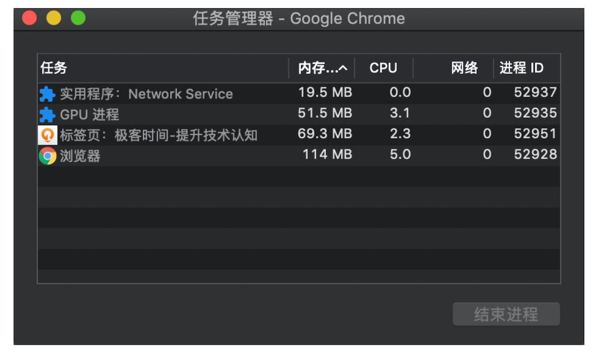
<br/>

### 进程和线程

#### 什么是并行处理

计算机中的并行处理就是同一时刻处理多个任务，比如我们要计算下面这三个表达式的值，并显示出结果。

```
A = 1+2
B = 20/5
C = 7*8
```

单线程来处理，要分四步按照顺序分别执行这四个任务：三个计算任务，一个显示任务。

如果采用多线程，我们只需分“两步走”：第一步，使用三个线程同时执行前三个任务；第二步，再执行第四个显示任务。

通过对比分析，你会发现用单线程执行需要四步，而使用多线程只需要两步。因此，使用并行处理能大大提升性能。

#### 线程 VS 进程

首先，进程是线程的运行环境。

当启动一个程序的时候，操作系统会为该程序创建一块内存，用来存放代码、运行中的数据和一个执行任务的主线程，我们把这样的一个运行环境叫**进程**。

其次，线程不能单独存在，它需要进程来启动和管理。

进程中，可以使用单线程，也可以使用多线程。多线程并行处理能提升运算效率。

#### 线程跟进程的关系

1. 进程中的任意一线程执行出错，都会导致整个进程的崩溃。
2. 线程之间共享进程中的数据。
3. 当一个进程关闭之后，操作系统会回收进程所占用的内存。
4. 进程之间的内容相互隔离，进程间通信依赖IPC机制

### 单进程浏览器时代

单进程浏览器是指浏览器的所有功能模块都是运行在同一个进程里，这些模块包含了网络、插件、JavaScript 运行环境、渲染引擎和页面等。

其实早在 2007 年之前，市面上浏览器都是单进程的。

单进程浏览器的架构如下图所示：

<br/>

<br/>

由于进程中的任意一线程执行出错，都会导致整个进程的崩溃。

如此多的功能模块运行在一个进程里，是导致单进程浏览器不稳定、不流畅和不安全的一个主要因素。

1. 不稳定

任一线程崩溃，都会导致整个浏览器崩溃。最典型的例子就是浏览器插件。

2. 不流畅

所有页面的渲染模块、JavaScript 执行环境以及插件都是运行在同一个页面线程，

这就意味着，某一个页面的模块运行时间过长，会导致整个浏览器失去响应，变卡顿。

3. 不安全

插件是 C/C++ 等代码编写，通过插件可以获取到操作系统的任意资源，当你在页面运行一个插件时也就意味着这个插件能完全操作你的电脑。如果是个恶意插件，那么它就可以释放病毒、窃取你的账号密码，引发安全性问题。

页面脚本，可以通过浏览器的漏洞来获取系统权限，这些脚本获取系统权限之后也可以对你的电脑做一些恶意的事情，同样也会引发安全问题。

### 多进程浏览器时代

#### 早期多进程架构

2008 年 Chrome 发布时的进程架构

<br/>

<br/>

渲染进程、插件进程独立出来，进程之间是通过 IPC 机制进行通信（如图中虚线部分）。

单进程浏览器时代最大的问题是，整个浏览器所有功能模块都是运行在同一个进程里，所以任一线程出了问题，直接影响到整个浏览器。

而多进程架构不存在这个问题，任一页面出了问题，只影响当前页面，不会影响整个浏览器。我们具体看看：

1. 解决不稳定的问题。由于进程是相互隔离的，所以当一个页面或者插件崩溃时，影响到的仅仅是当前的页面进程或者插件进程，并不会影响到浏览器和其他页面。

2. 解决不流畅的问题。JavaScript 运行在渲染进程中的，所以即使 JavaScript 阻塞了渲染进程，影响到的也只是当前的渲染页面，而并不会影响浏览器和其他页面。

3. 解决不安全的问题。安全沙箱可以看成是操作系统给进程上了一把锁，沙箱里面的程序可以运行，但是不能在你的硬盘上写入任何数据，也不能在敏感位置读取任何数据，例如你的文档和桌面。Chrome 把插件进程和渲染进程锁在沙箱里面，这样即使在渲染进程或者插件进程里面执行了恶意程序，恶意程序也无法突破沙箱去获取系统权限。

#### 目前多进程架构

最新的 Chrome 进程架构：

<br/>

<br/>


从图中可以看出，最新的 Chrome 浏览器包括：1 个浏览器（Browser）主进程、1 个 GPU 进程、1 个网络（NetWork）进程、多个渲染进程和多个插件进程。

目前多进程架构，对早期架构做了优化，增加了GPU 进程、网络进程。

下面我们来逐个分析下这几个进程的功能。

- 浏览器进程。主要负责界面显示、用户交互、子进程管理，同时提供存储等功能。
- 渲染进程。核心任务是将 HTML、CSS 和 JavaScript 转换为用户可以与之交互的网页，排版引擎 Blink 和 JavaScript 引擎 V8 都是运行在该进程中，默认情况下，Chrome 会为每个 Tab 标签创建一个渲染进程。出于安全考虑，渲染进程都是运行在沙箱模式下。
- GPU 进程。早期 GPU 的使用初衷是为了实现 3D CSS 的效果，只是随后网页、Chrome 的 UI 界面都选择采用 GPU 来绘制，这使得 GPU 成为浏览器普遍的需求。最后，Chrome 在其多进程架构上也引入了 GPU 进程。
- 网络进程。主要负责页面的网络资源加载，之前是作为一个模块运行在浏览器进程里面的，直至最近才独立出来，成为一个单独的进程。
- 插件进程。主要是负责插件的运行，因插件易崩溃，所以需要通过插件进程来隔离，以保证插件进程崩溃不会对浏览器和页面造成影响。

讲到这里，现在你应该就可以回答文章开头提到的问题了：仅仅打开了 1 个页面，为什么有 4 个进程？因为打开 1 个页面至少需要 1 个网络进程、1 个浏览器进程、1 个 GPU 进程以及 1 个渲染进程，共 4 个；如果打开的页面有运行插件的话，还需要再加上 1 个插件进程。

不过凡事都有两面性，虽然多进程模型提升了浏览器的稳定性、流畅性和安全性，但同样不可避免地带来了一些问题：

- 更高的资源占用。因为每个进程都会包含公共基础结构的副本（如 JavaScript 运行环境），这就意味着浏览器会消耗更多的内存资源。
- 更复杂的体系架构。浏览器各模块之间耦合性高、扩展性差等问题，会导致现在的架构已经很难适应新的需求了。

对于上面这两个问题，Chrome 团队一直在寻求一种弹性方案，既可以解决资源占用高的问题，也可以解决复杂的体系架构的问题。

### 未来面向服务的架构

为了解决这些问题，在 2016 年，Chrome 官方团队使用“面向服务的架构”（简称SOA）的思想设计了新的 Chrome 架构。

也就是说 Chrome 整体架构会朝向现代操作系统所采用的“面向服务的架构” 方向发展，原来的各种模块会被重构成独立的服务。每个服务都可以在独立的进程中运行。

Chrome 最终要把 UI、数据库、文件、设备、网络等模块重构为基础服务，类似操作系统底层服务，下面是 Chrome“面向服务的架构”的进程模型图：

<br/>

<br/>

目前 Chrome 正处在老的架构向服务化架构过渡阶段，这将是一个漫长的迭代过程。

Chrome 正在逐步构建 Chrome 基础服务，如果你认为 Chrome 是“便携式操作系统”，那么 Chrome 基础服务便可以被视为该操作系统的“基础”系统服务层。

同时 Chrome 还提供灵活的弹性架构，在强大性能设备上会以多进程的方式运行基础服务，但是如果在资源受限的设备上（如下图），Chrome 会将很多服务整合到一个进程中，从而节省内存占用。

<br/>
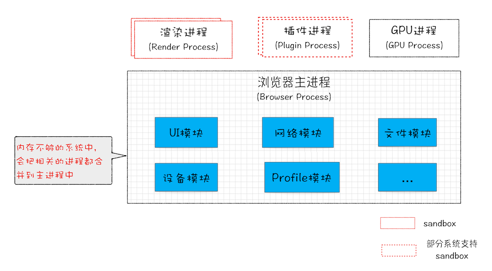
<br/>

### 总结

本文我主要是从 Chrome 进程架构的视角，分析了浏览器的进化史。

最初的浏览器都是单进程的，它们不稳定、不流畅且不安全，之后出现了 Chrome，创造性地引入了多进程架构，并解决了这些遗留问题。

随后 Chrome 试图应用到更多业务场景，如移动设备、VR、视频等，为了支持这些场景，Chrome 的架构体系变得越来越复杂，这种架构的复杂性倒逼 Chrome 开发团队必须进行架构的重构，最终 Chrome 团队选择了面向服务架构（SOA）形式，这也是 Chrome 团队现阶段的一个主要任务。

<br>

## 02丨TCP协议：如何保证页面文件能被完整送达浏览器？

互联网中的数据是通过数据包来传输的。如果发送的数据很大，那么该数据就会被拆分为很多小数据包来传输,并不是一个大的文件一次传输过来的。

数据包在传输过程中又有很大概率丢失或者出错。那么如何保证页面文件能被完整地送达浏览器呢？

这个问题，可以拆分成三个子问题：

1. 数据包如何送达主机
2. 主机如何将数据包转交给应用
3. 数据是如何被完整地送达应用程序

### IP：把数据包送达目的主机

数据包要在互联网上进行传输，就要符合网际协议（简称IP）标准。

互联网上不同的在线设备都有唯一的地址，这个地址称为 IP 地址。

如果要想把一个数据包从主机 A 发送给主机 B，那么在传输之前，数据包上会被附加上主机 B 的 IP 地址信息，这样在传输过程中才能正确寻址。

额外地，数据包上还会附加上主机 A 本身的 IP 地址，有了这些信息主机 B 才可以回复信息给主机 A。

这些附加的信息会被装进一个叫 IP 头的数据结构里。

IP 头是 IP 数据包开头的信息，包含 IP 版本、源 IP 地址、目标 IP 地址、生存时间等信息。

为了方便理解，我先把网络简单分为三层结构，如下图：

<br/>
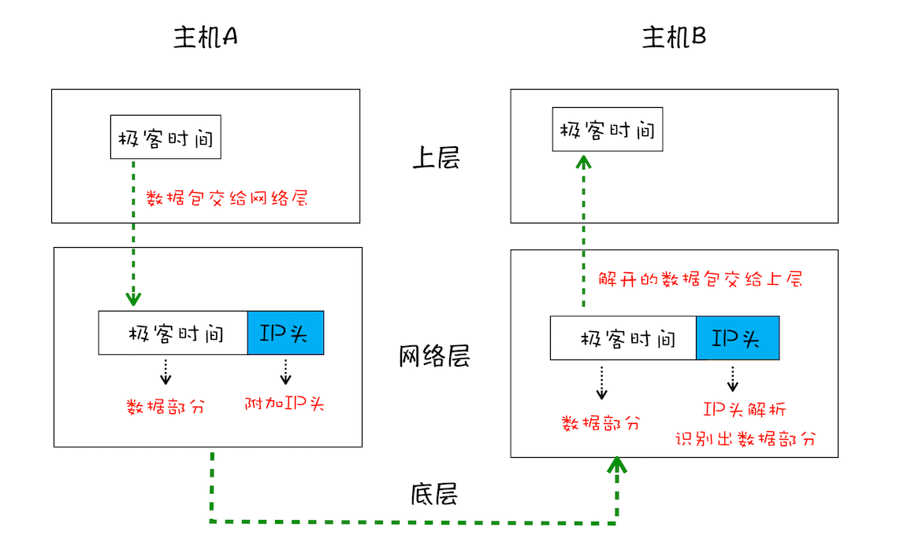
<br/>

### UDP：把数据包送达应用程序

IP 是非常底层的协议，只负责把数据包传送给对方电脑，但对方电脑不知道把数据包交给哪个程序，因此，需要基于IP之上，开发能和应用打交道的协议，最常见的是“用户数据包协议”，简称UDP。

UDP 中一个最重要的信息是端口号，端口号其实就是一个数字，每个想访问网络的程序都需要绑定一个端口号。

通过端口号 UDP 就能把指定的数据包发送给指定的程序了，所以IP 通过 IP 地址信息把数据包发送给指定的电脑，而 UDP 通过端口号把数据包分发给正确的程序。

和 IP 头一样，端口号会被装进 UDP 头里面，UDP 头再和原始数据包合并组成新的 UDP 数据包。UDP 头中除了目的端口，还有源端口号等信息。

为了支持 UDP 协议，我把前面的三层结构扩充为四层结构，在网络层和上层之间增加了传输层，如下图所示：

<br/>
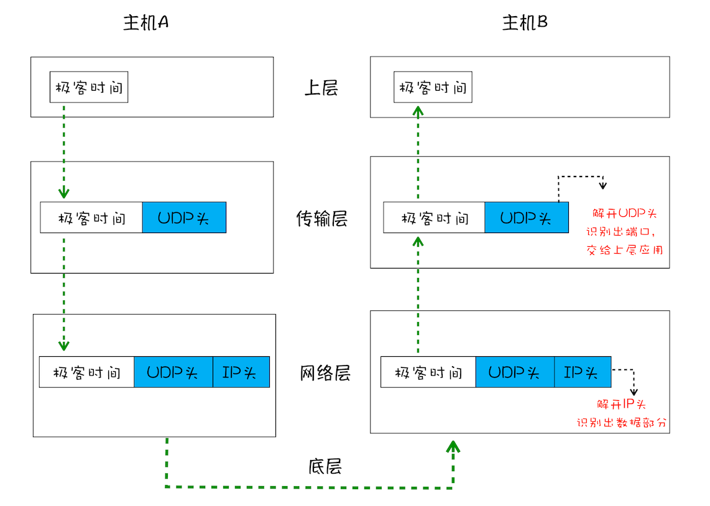
<br/>

在使用 UDP 发送数据时，有各种因素会导致数据包出错，虽然 UDP 可以校验数据是否正确，但是对于错误的数据包，UDP 并不提供重发机制，只是丢弃当前的包，而且 UDP 在发送之后也无法知道是否能达到目的地。

虽说UDP 不能保证数据可靠性，但是传输速度却非常快，所以 UDP 会应用在一些关注速度、但不那么严格要求数据完整性的领域，如在线视频、互动游戏等。

### TCP：把数据完整地送达应用程序

UDP 来传输会存在两个问题：

- 数据包在传输过程中容易丢失；
- 大文件会被拆分成很多小的数据包来传输，这些小的数据包会经过不同的路由，并在不同的时间到达接收端，而 UDP 协议并不知道如何组装这些数据包，从而把这些数据包还原成完整的文件。

基于这两个问题，我们引入 TCP 了。TCP（传输控制协议）是一种面向连接的、可靠的、基于字节流的传输层通信协议。相对于 UDP，TCP 有下面两个特点:

- 对于数据包丢失的情况，TCP 提供重传机制；
- TCP 引入了数据包排序机制，用来保证把乱序的数据包组合成一个完整的文件。

和 UDP 头一样，TCP 头除了包含了目标端口和本机端口号外，还提供了用于排序的序列号，以便接收端通过序号来重排数据包。

下面看看 TCP 下的单个数据包的传输流程：

<br/>
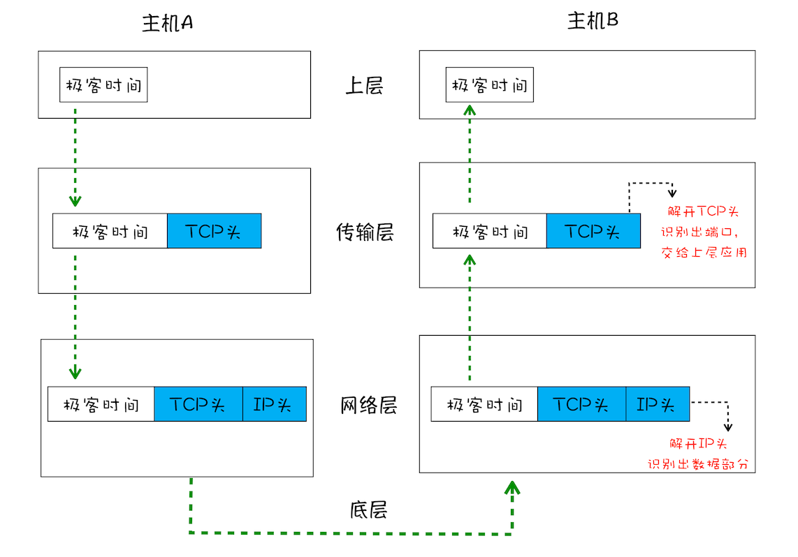
<br/>

通过上图你应该可以了解一个数据包是如何通过 TCP 来传输的。TCP 单个数据包的传输流程和 UDP 流程差不多，不同的地方在于，通过 TCP 头的信息保证了一块大的数据传输的完整性。

下面我们再看下完整的 TCP 连接过程，通过这个过程你可以明白 TCP 是如何保证重传机制和数据包的排序功能的。

从下图可以看出，一个完整的 TCP 连接的生命周期包括了“建立连接”“传输数据”和“断开连接”三个阶段。


<br/>

<br/>

- 首先，建立连接阶段。这个阶段是通过“三次握手”来建立客户端和服务器之间的连接。TCP 提供面向连接的通信传输。面向连接是指在数据通信开始之前先做好两端之间的准备工作。所谓三次握手，是指在建立一个 TCP 连接时，客户端和服务器总共要发送三个数据包以确认连接的建立。
- 其次，传输数据阶段。在该阶段，接收端需要对每个数据包进行确认操作，也就是接收端在接收到数据包之后，需要发送确认数据包给发送端。所以当发送端发送了一个数据包之后，在规定时间内没有接收到接收端反馈的确认消息，则判断为数据包丢失，并触发发送端的重发机制。同样，一个大的文件在传输过程中会被拆分成很多小的数据包，这些数据包到达接收端后，接收端会按照 TCP 头中的序号为其排序，从而保证组成完整的数据。
- 最后，断开连接阶段。数据传输完毕之后，就要终止连接了，涉及到最后一个阶段“四次挥手”来保证双方都能断开连接。

到这里你应该就明白了，TCP 为了保证数据传输的可靠性，牺牲了数据包的传输速度，因为“三次握手”和“数据包校验机制”等把传输过程中的数据包的数量提高了一倍。

### 总结

- 互联网中的数据是通过数据包来传输的，数据包在传输过程中容易丢失或出错。
- IP 负责把数据包送达目的主机。
- UDP 负责把数据包送达具体应用。
- 而 TCP 保证了数据完整地传输，它的连接可分为三个阶段：建立连接、传输数据和断开连接。

其实了解 TCP 协议，是为了全方位了解 HTTP，包括其实际功能和局限性，之后才会更加深刻地理解为什么要推出 HTTP/2，以及为什么要推出 QUIC 协议，也就是未来的 HTTP/3。这是一个由浅入深、循序渐进的过程，我希望你能稳扎稳打，学好这每一步、每一个协议，后面“水到自然渠成”。

<br/>

## 03丨HTTP请求流程：为什么很多站点第二次打开速度会很快？

HTTP 协议，是建立在 TCP 连接基础之上的。HTTP 是一种允许浏览器向服务器获取资源的协议

这篇文章，我将通过分析一个 HTTP 请求过程中每一步的状态来带你了解完整的 HTTP 请求过程。

### 浏览器端发起 HTTP 请求流程

#### 1 构建请求

首先，浏览器构建请求行信息（如下所示），构建好后，浏览器准备发起网络请求。

```http
GET /index.html HTTP1.1
```

#### 2 查找缓存

在真正发起网络请求之前，浏览器会先在浏览器缓存中查询是否有要请求的文件。

其中，浏览器缓存是一种在本地保存资源副本，以供下次请求时直接使用的技术。

当浏览器发现请求的资源已经在浏览器缓存中存有副本，它会拦截请求，返回该资源的副本，并直接结束请求，而不会再去源服务器重新下载。这样做的好处有：

- 缓解服务器端压力，提升性能（获取资源的耗时更短了）；
- 对于网站来说，缓存是实现快速资源加载的重要组成部分。

当然，如果缓存查找失败，就会进入网络请求过程了。

#### 准备 IP 地址和端口

在了解网络请求之前，我们需要先看看 HTTP 和 TCP 的关系。

因为浏览器使用 HTTP 协议作为应用层协议，用来封装请求的文本信息；

并使用 TCP/IP 作传输层协议将它发到网络上

所以在 HTTP 工作开始之前，浏览器需要通过 TCP 与服务器建立连接。也就是说 HTTP 的内容是通过 TCP 的传输数据阶段来实现的，你可以结合下图更好地理解这二者的关系。

<br/>

<br/>

这里我们需要思考几个问题：

- HTTP网络请求的第一步做什么？和服务器建立TCP连接
- 那建立连接的信息都有了吗？需要IP地址和端口号
- 如何获取IP地址和端口号呢？URL+DNS（DNS可以做缓存），端口号默认80

#### 等待 TCP 队列

Chrome 有个机制，同一个域名同时最多只能建立 6 个 TCP 连接，如果在同一个域名下同时有 10 个请求发生，那么其中 4 个请求会进入排队等待状态，直至进行中的请求完成。

当然，如果当前请求数量少于 6，会直接进入下一步，建立 TCP 连接。

#### 建立 TCP 连接

#### 发送 HTTP 请求

一旦建立了 TCP 连接，浏览器就可以和服务器进行通信了。而 HTTP 中的数据正是在这个通信过程中传输的。

你可以结合下图来理解，浏览器是如何发送请求信息给服务器的。234

<br/>

<br/>

首先浏览器会向服务器发送请求行，它包括了请求方法、请求 URI 和 HTTP 版本协议。

发送请求行，就是告诉服务器浏览器需要什么资源

在浏览器发送请求行命令之后，还要以请求头形式发送其他一些信息，把浏览器的一些基础信息告诉服务器。比如包含了浏览器所使用的操作系统、浏览器内核等信息，以及当前请求的域名信息、浏览器端的 Cookie 信息，等等。

### 服务器端处理 HTTP 请求流程

历经千辛万苦，HTTP 的请求信息终于被送达了服务器。接下来，服务器会根据浏览器的请求信息来准备相应的内容。

#### 返回请求

一旦服务器处理结束，便可以返回数据给浏览器了。

<br/>

<br/>

首先服务器会返回响应行，包括协议版本和状态码。

并不是所有的请求都可以被服务器处理的，那么一些无法处理或者处理出错的信息，怎么办呢？服务器会通过请求行的状态码来告诉浏览器它的处理结果

随后，正如浏览器会随同请求发送请求头一样，服务器也会随同响应向浏览器发送响应头。响应头包含了服务器自身的一些信息，比如服务器生成返回数据的时间、返回的数据类型（JSON、HTML、流媒体等类型），以及服务器要在客户端保存的 Cookie 等信息。

发送完响应头后，服务器就可以继续发送响应体的数据，通常，响应体就包含了 HTML 的实际内容。

以上这些就是服务器响应浏览器的具体过程。

#### 断开连接

通常情况下，一旦服务器向客户端返回了请求数据，它就要关闭 TCP 连接。不过如果浏览器或者服务器在其头信息中加入了：

```http
Connection:Keep-Alive
```

保持 TCP 连接可以省去下次请求时需要建立连接的时间，提升资源加载速度。

### 问题解答

#### 为什么很多站点第二次打开速度会很快？

DNS 缓存和页面资源缓存

<br/>
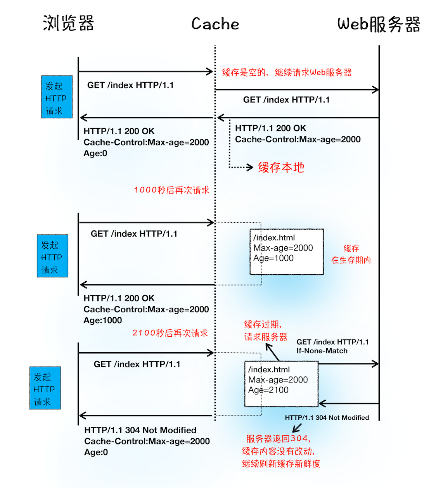
<br/>

#### 登录状态是如何保持的？

简单地说，如果服务器端发送的响应头内有 Set-Cookie 的字段，那么浏览器就会将该字段的内容保持到本地。

当下次客户端再往该服务器发送请求时，客户端会自动在请求头中加入 Cookie 值后再发送出去。

服务器端发现客户端发送过来的 Cookie 后，会去检查究竟是从哪一个客户端发来的连接请求，然后对比服务器上的记录，最后得到该用户的状态信息。

### 总结

HTTP 请求所经历的各个阶段:

<br/>

<br/>

从图中可以看到，浏览器中的 HTTP 请求从发起到结束一共经历了如下八个阶段：

- 构建请求
- 查找缓存
- 准备 IP 和端口
- 等待 TCP 队列
- 建立 TCP 连接
- 发起 HTTP 请求
- 服务器处理请求
- 服务器返回请求和断开连接

### 学习技巧

在学习过程中，你也要学会提问，通过最终要做什么和现在有什么，去一步步分析并提出一些问题，让疑问带领着你去学习，抓住几个本质的问题就可以学透相关知识点，让你能站在更高维度去查看整体框架。希望它能成为你的一个学习技巧吧！

<br>

## 04丨导航流程：从输入URL到页面展示，这中间发生了什么？

从输入 URL 到页面展示完整流程示意图

<br/>

<br/>

这个过程需要浏览器进程、渲染进程和网络进程的配合，先回顾下它们的主要职责：

- 浏览器进程：主要负责用户交互、子进程管理和文件储存等功能
- 网络进程：网络下载
- 渲染进程：解析页面

结合上图，整个流程的核心节点是：

- 首先，用户从浏览器进程里输入请求信息；
- 然后，网络进程发起 URL 请求；
- 服务器响应 URL 请求之后，浏览器进程就又要开始准备渲染进程了；
- 渲染进程准备好之后，需要先向渲染进程提交页面数据，我们称之为提交文档阶段；
- 渲染进程接收完文档信息之后，便开始解析页面和加载子资源，完成页面的渲染。

这其中，用户发出 URL 请求到页面开始解析的这个过程，就叫做导航。

### 1. 用户输入

当用户在地址栏中输入一个查询关键字时，地址栏会判断输入的关键字是搜索内容，还是请求的 URL。

- 如果是搜索内容，地址栏会使用浏览器默认的搜索引擎，来合成新的带搜索关键字的 URL。
- 如果判断输入内容符合 URL 规则，比如输入的是 time.geekbang.org，那么地址栏会根据规则，把这段内容加上协议，合成为完整的 URL，如 https://time.geekbang.org。

当浏览器刚开始加载一个地址之后，标签页上的图标便进入了加载状态。但此时图中页面显示的依然是之前打开的页面内容。因为需要等待提交文档阶段，页面内容才会被替换。

### 2. URL 请求过程

接下来，便进入了页面资源请求过程。

这时，浏览器进程会通过进程间通信（IPC）把 URL 请求发送至网络进程，网络进程接收到 URL 请求后，会在这里发起真正的 URL 请求流程。

那具体流程是怎样的呢？

首先，网络进程会查找本地缓存是否缓存了该资源。

如果有缓存资源，那么直接返回资源给浏览器进程；

如果在缓存中没有查找到资源，那么直接进入网络请求流程。

这请求前的第一步是要进行 DNS 解析，以获取请求域名的服务器 IP 地址。如果请求协议是 HTTPS，那么还需要建立 TLS 连接。

接下来就是利用 IP 地址和服务器建立 TCP 连接。

连接建立之后，浏览器端会构建请求行、请求头等信息，并把和该域名相关的 Cookie 等数据附加到请求头中，然后向服务器发送构建的请求信息。

服务器接收到请求信息后，会根据请求信息生成响应数据（包括响应行、响应头和响应体等信息），并发给网络进程。

等网络进程接收了响应行和响应头之后，就开始解析响应头的内容了。

#### 重定向

在导航过程中，如果服务器响应行的状态码包含了 301、302 一类的跳转信息，浏览器会跳转到新的地址继续导航；

如果响应行是 200，那么表示浏览器可以继续处理该请求。

#### 响应数据类型处理

服务器通过 Content-Type 告诉浏览器服务器返回的响应体数据是什么类型，然后浏览器会根据 Content-Type 的值来决定如何显示响应体的内容。

不同 Content-Type 的后续处理流程也截然不同。

如果 Content-Type 字段的值被浏览器判断为下载类型，那么该请求会被提交给浏览器的下载管理器，同时该 URL 请求的导航流程就此结束。

但如果是HTML，那么浏览器则会继续进行导航流程。由于 Chrome 的页面渲染是运行在渲染进程中的，所以接下来就需要准备渲染进程了。

### 3. 准备渲染进程

默认情况下，Chrome 会为每个页面分配一个渲染进程，也就是说，每打开一个新页面就会配套创建一个新的渲染进程。

总结来说，打开一个新页面采用的渲染进程策略就是：

- 通常情况下，打开新的页面都会使用单独的渲染进程；
- 如果从 A 页面打开 B 页面，且 A 和 B 都属于同一站点的话，那么 B 页面复用 A 页面的渲染进程；如果是其他情况，浏览器进程则会为 B 创建一个新的渲染进程。

渲染进程准备好之后，还不能立即进入文档解析状态，因为此时的文档数据还在网络进程中，并没有提交给渲染进程，所以下一步就进入了提交文档阶段。

### 4. 提交文档

首先要明确一点，这里的“文档”是指 URL 请求的响应体数据。

- “提交文档”的消息是由浏览器进程发出的，渲染进程接收到“提交文档”的消息后，会和网络进程建立传输数据的“管道”。
- 等文档数据传输完成之后，渲染进程会返回“确认提交”的消息给浏览器进程。
- 浏览器进程在收到“确认提交”的消息后，会更新浏览器界面状态，包括了安全状态、地址栏的 URL、前进后退的历史状态，并更新 Web 页面。

<br/>
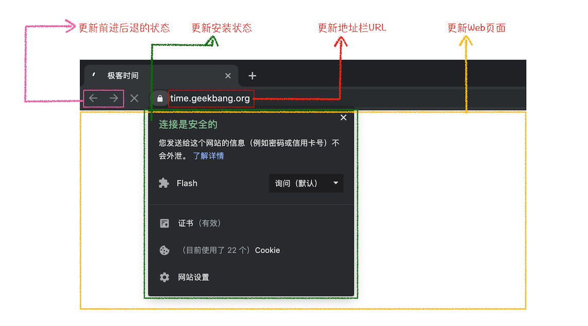
<br/>

这也就解释了为什么在浏览器的地址栏里面输入了一个地址后，之前的页面没有立马消失，而是要加载一会儿才会更新页面。

到这里，一个完整的导航流程就“走”完了，这之后就要进入渲染阶段了。

### 5. 渲染阶段

一旦文档被提交，渲染进程便开始页面解析和子资源加载了

一旦页面生成完成，渲染进程会发送一个消息给浏览器进程，浏览器接收到消息后，会停止标签图标上的加载动画。

<br/>

<br/>

至此，一个完整的页面就生成了。那文章开头的“从输入 URL 到页面展示，这中间发生了什么？”这个过程极其“串联”的问题也就解决了。

<br>

## 05丨渲染流程（上）：HTML、CSS和JavaScript，是如何变成页面的？

由于渲染机制过于复杂，所以渲染模块在执行过程中会被划分为很多子阶段，输入的 HTML 经过这些子阶段，最后输出像素。

我们把这样的一个处理流程叫做渲染流水线，其大致流程如下图所示：

<br/>

<br/>

按照渲染的时间顺序，流水线可分为如下几个子阶段：构建 DOM 树、样式计算、布局阶段、分层、绘制、分块、栅格化和合成。

在介绍每个阶段的过程中，你应该重点关注以下三点内容：

- 开始每个子阶段都有其输入的内容；
- 然后每个子阶段有其处理过程；
- 最终每个子阶段会生成输出内容。

理解了这三部分内容，能让你更加清晰地理解每个子阶段。

### 构建 DOM 树

浏览器无法直接理解和使用 HTML，所以需要将 HTML 转换为浏览器能够理解的结构——DOM 树。

<br/>

<br/>

现在我们已经生成 DOM 树了，但是 DOM 节点的样式我们依然不知道，要让 DOM 节点拥有正确的样式，这就需要样式计算了。

### 样式计算

样式计算的目的是为了计算出 DOM 节点中每个元素的具体样式，这个阶段大体可分为三步来完成。

#### 1. 把 CSS 转换为浏览器能够理解的结构

CSS 样式来源主要有三种：

- 通过 link 引用的外部 CSS 文件
- `<style>`标记内的 CSS
- 元素的 style 属性内嵌的 CSS

和 HTML 文件一样，浏览器也是无法直接理解这些纯文本的 CSS 样式，所以当渲染引擎接收到 CSS 文本时，会执行一个转换操作，将 CSS 文本转换为浏览器可以理解的结构——styleSheets。

<br/>
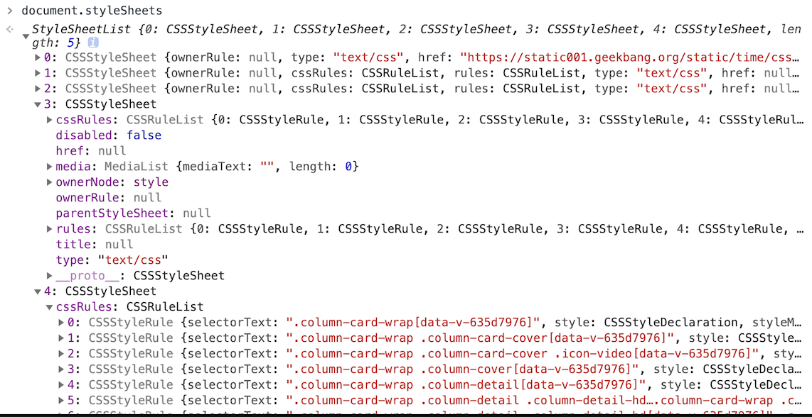
<br/>

#### 2. 转换样式表中的属性值，使其标准化

现在我们已经把现有的 CSS 文本转化为浏览器可以理解的结构了，那么接下来就要对其进行属性值的标准化操作。

em、blue、bold，这些类型数值不容易被渲染引擎理解，所以需要将所有值转换为渲染引擎容易理解的、标准化的计算值，这个过程就是属性值标准化。

<br/>

<br/>

#### 3. 计算出 DOM 树中每个节点的具体样式

现在样式的属性已被标准化了，接下来就需要计算 DOM 树中每个节点的样式属性了，如何计算呢？

这就涉及到 CSS 的继承规则和层叠规则了。

首先是 CSS 继承。CSS 继承就是每个 DOM 节点都包含有父节点的样式。

<br/>

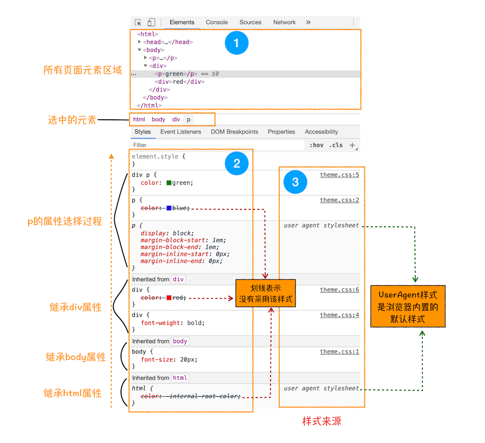
<br/>

然后，是CSS 样式层叠。层叠是 CSS 的一个基本特征，它是一个定义了如何合并来自多个源的属性值的算法。它在 CSS 处于核心地位，CSS 的全称“层叠样式表”正是强调了这一点。

总之，样式计算阶段的目的是为了计算出 DOM 节点中每个元素的具体样式，在计算过程中需要遵守 CSS 的继承和层叠两个规则。这个阶段最终输出的内容是每个 DOM 节点的样式，并被保存在 ComputedStyle 的结构内。

<br/>
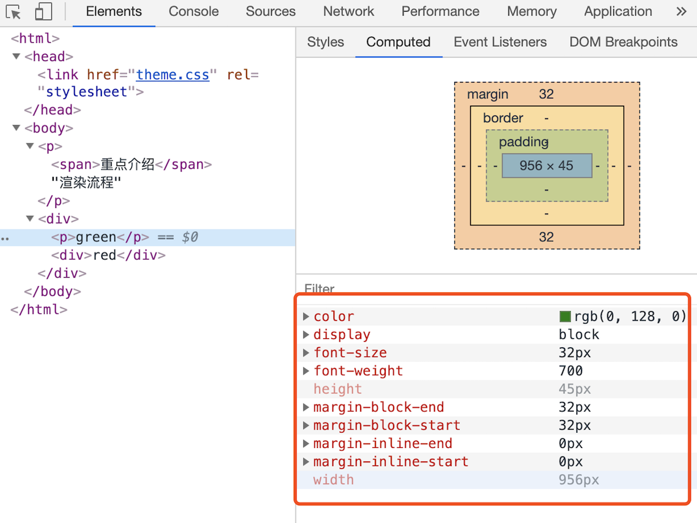
<br/>

### 布局阶段

现在，我们有 DOM 树和 DOM 树中元素的样式，但这还不足以显示页面，因为我们还不知道 DOM 元素的几何位置信息。

那么接下来就需要计算出 DOM 树中可见元素的几何位置，我们把这个计算过程叫做布局。

Chrome 在布局阶段需要完成两个任务：创建布局树和布局计算。

#### 1. 创建布局树

你可能注意到了 DOM 树还含有很多不可见的元素，比如 head 标签，还有使用了 display:none 属性的元素。

所以在显示之前，我们还要额外地构建一棵只包含可见元素布局树。

<br/>

<br/>

从上图可以看出，DOM 树中所有不可见的节点都没有包含到布局树中。

为了构建布局树，浏览器大体上完成了下面这些工作：

- 遍历 DOM 树中的所有可见节点，并把这些节点加到布局中；
- 而不可见的节点会被布局树忽略掉，如 head 标签下面的全部内容，再比如 body.p.span 这个元素，因为它的属性包含 dispaly:none，所以这个元素也没有被包进布局树。

#### 2. 布局计算

现在我们有了一棵完整的布局树。那么接下来，就要计算布局树节点的坐标位置了。

后面章节中我再做详细的介绍。

在执行布局操作的时候，会把布局运算的结果重新写回布局树中，所以布局树既是输入内容也是输出内容，这是布局阶段一个不合理的地方，因为在布局阶段并没有清晰地将输入内容和输出内容区分开来。

针对这个问题，Chrome 团队正在重构布局代码，下一代布局系统叫 LayoutNG，试图更清晰地分离输入和输出，从而让新设计的布局算法更加简单。

### 总结

<br/>
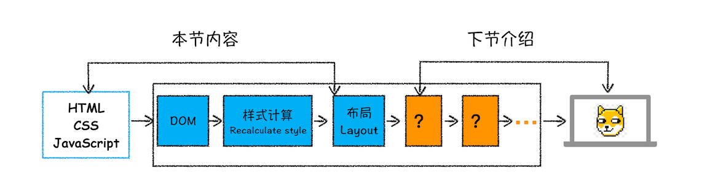
<br/>

从图中可以看出，本节内容我们介绍了渲染流程的前三个阶段：DOM 生成、样式计算和布局。要点可大致总结为如下：

- 浏览器不能直接理解 HTML 数据，所以第一步需要将其转换为浏览器能够理解的 DOM 树结构；
- 生成 DOM 树后，还需要根据 CSS 样式表，来计算出 DOM 树所有节点的样式；
- 最后计算 DOM 元素的布局信息，使其都保存在布局树中。

到这里我们的每个节点都拥有了自己的样式和布局信息，那么后面几个阶段就要利用这些信息去展示页面了，由于篇幅限制，剩下的这些阶段我会在下一篇文章中介绍。

<br>

## 06丨渲染流程（下）：HTML、CSS和JavaScript，是如何变成页面的？

前三个阶段的主要内容：

- 在 HTML 页面内容被提交给渲染引擎之后，渲染引擎首先将 HTML 解析为浏览器可以理解的 DOM；
- 然后根据 CSS 样式表，计算出 DOM 树所有节点的样式；
- 接着又计算每个元素的几何坐标位置，并将这些信息保存在布局树中。

这篇文章接着讲解渲染流水线后面的阶段。

### 分层

我们有了布局树，而且每个元素的具体位置信息都计算出来了，那么接下来是不是就要开始着手绘制页面了？

答案依然是否定的。

因为页面中有很多复杂的效果，如一些复杂的 3D 变换、页面滚动，或者使用 z-indexing 做 z 轴排序等，为了更加方便地实现这些效果，渲染引擎还需要为特定的节点生成专用的图层，并生成一棵对应的图层树。

如果你熟悉 PS，相信你会很容易理解图层的概念，正是这些图层叠加在一起构成了最终的页面图像。

要想直观地理解什么是图层，你可以打开 Chrome 的“开发者工具”，选择“Layers”标签，就可以可视化页面的分层情况，如下图所示：

<br/>

<br/>

浏览器的页面实际上被分成了很多图层，这些图层叠加后合成了最终的页面。

下面我们再来看看这些图层和布局树节点之间的关系，如文中图所示：

<br/>

<br/>

通常情况下，并不是布局树的每个节点都包含一个图层，如果一个节点没有对应的层，那么这个节点就从属于父节点的图层。

如上图中的 span 标签没有专属图层，那么它们就从属于它们的父节点图层。但不管怎样，最终每一个节点都会直接或者间接地从属于一个层。

那么需要满足什么条件，渲染引擎才会为特定的节点创建新的层呢？通常满足下面两点中任意一点的元素就可以被提升为单独的一个图层。

第一点，拥有层叠上下文属性的元素会被提升为单独的一层。

明确定位属性的元素、定义透明属性的元素、使用 CSS 滤镜的元素等，都拥有层叠上下文属性。

若你想要了解更多层叠上下文的知识，你可以[参考这篇文章](https://developer.mozilla.org/zh-CN/docs/Web/Guide/CSS/Understanding_z_index/The_stacking_context)。

第二点，需要剪裁（clip）的地方也会被创建为图层

出现这种裁剪情况的时候，渲染引擎会为文字部分单独创建一个层，如果出现滚动条，滚动条也会被提升为单独的层。你可以参考下图：

<br/>

<br/>

所以说，元素有了层叠上下文的属性或者需要被剪裁，满足这任意一点，就会被提升成为单独一层。

### 图层绘制

在完成图层树的构建之后，渲染引擎会对图层树中的每个图层进行绘制。

渲染引擎会把一个图层的绘制拆分成很多小的绘制指令，然后再把这些指令按照顺序组成一个待绘制列表，如下图所示：

<br/>

<br/>

从图中可以看出，绘制列表中的指令其实非常简单，就是让其执行一个简单的绘制操作

而绘制一个元素通常需要好几条绘制指令，因为每个元素的背景、前景、边框都需要单独的指令去绘制。

所以在图层绘制阶段，输出的内容就是这些待绘制列表。

### 栅格化（raster）操作

绘制列表只是用来记录绘制顺序和绘制指令的列表，而实际上绘制操作是由渲染引擎中的合成线程来完成的。

你可以结合下图来看下渲染主线程和合成线程之间的关系：

<br/>
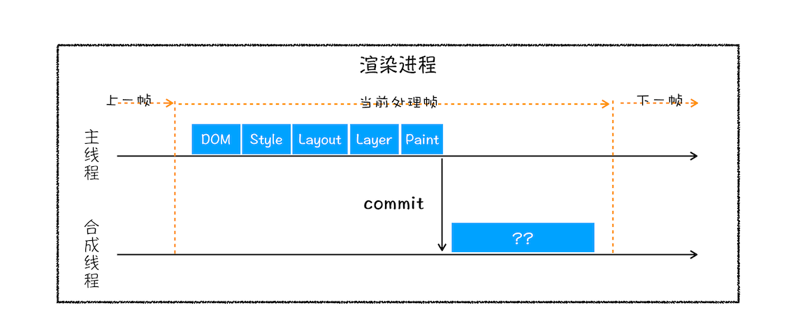
<br/>

当图层的绘制列表准备好之后，主线程会把该绘制列表提交（commit）给合成线程，那么接下来合成线程是怎么工作的呢？

那我们得先来看看什么是视口，你可以参看下图：

<br/>
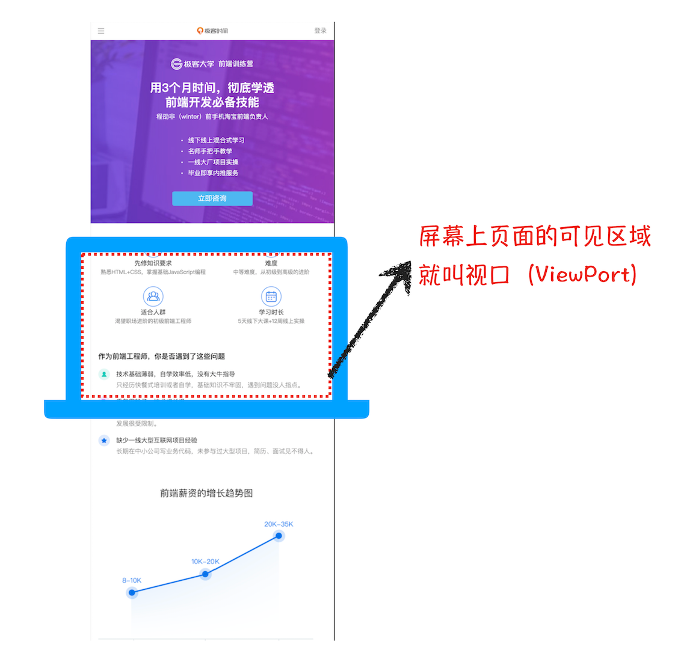
<br/>

通常一个页面可能很大，但是用户只能看到其中的一部分，我们把用户可以看到的这个部分叫做视口（viewport）。

在有些情况下，有的图层可以很大，比如有的页面你使用滚动条要滚动好久才能滚动到底部，但是通过视口，用户只能看到页面的很小一部分，所以在这种情况下，要绘制出所有图层内容的话，就会产生太大的开销，而且也没有必要。

基于这个原因，合成线程会将图层划分为图块（tile），这些图块的大小通常是 256x256 或者 512x512，如下图所示：

<br/>
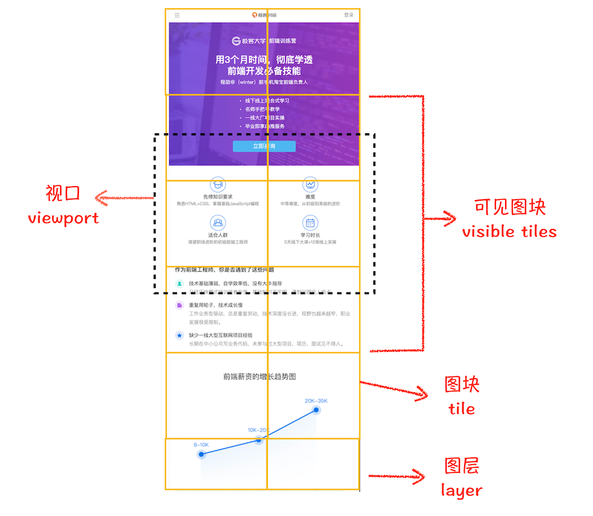
<br/>

然后合成线程会按照视口附近的图块来优先生成位图，实际生成位图的操作是由栅格化来执行的。

所谓栅格化，是指将图块转换为位图。

而图块是栅格化执行的最小单位。

渲染进程维护了一个栅格化的线程池，所有的图块栅格化都是在线程池内执行的，运行方式如下图所示：

<br/>

<br/>

通常，栅格化过程都会使用 GPU 来加速生成，使用 GPU 生成位图的过程叫快速栅格化，或者 GPU 栅格化，生成的位图被保存在 GPU 内存中。

相信你还记得，GPU 操作是运行在 GPU 进程中，如果栅格化操作使用了 GPU，那么最终生成位图的操作是在 GPU 中完成的，这就涉及到了跨进程操作。具体形式你可以参考下图：

<br/>

<br/>

从图中可以看出，渲染进程把生成图块的指令发送给 GPU，然后在 GPU 中执行生成图块的位图，并保存在 GPU 的内存中。

### 合成和显示

一旦所有图块都被光栅化，合成线程就会生成一个绘制图块的命令——“DrawQuad”，然后将该命令提交给浏览器进程。

浏览器进程里面有一个叫 viz 的组件，用来接收合成线程发过来的 DrawQuad 命令，然后根据 DrawQuad 命令，将其页面内容绘制到内存中，最后再将内存显示在屏幕上。

到这里，经过这一系列的阶段，编写好的 HTML、CSS、JavaScript 等文件，经过浏览器就会显示出漂亮的页面了。

### 渲染流水线大总结

现在已经分析完了整个渲染流程，从 HTML 到 DOM、样式计算、布局、图层、绘制、光栅化、合成和显示。下面我用一张图来总结下这整个渲染流程：

<br/>
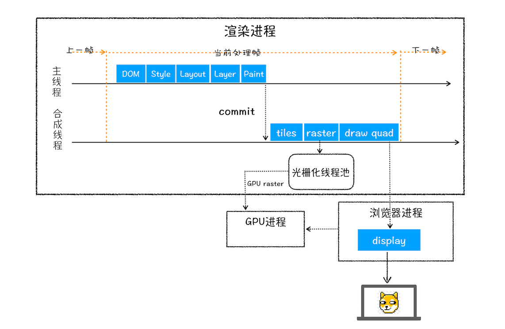
<br/>

- 渲染进程将 HTML 内容转换为能够读懂的 DOM 树结构。
- 渲染引擎将 CSS 样式表转化为浏览器可以理解的styleSheets，计算出 DOM 节点的样式。
- 创建布局树，并计算元素的布局信息。
- 对布局树进行分层，并生成分层树。
- 为每个图层生成绘制列表，并将其提交到合成线程。
- 合成线程将图层分成图块，并在光栅化线程池中将图块转换成位图。
- 合成线程发送绘制图块命令DrawQuad给浏览器进程。
- 浏览器进程根据 DrawQuad 消息生成页面，并显示到显示器上。

### 相关概念

有了上面介绍渲染流水线的基础，我们再来看看三个和渲染流水线相关的概念——“重排”“重绘”和“合成”。理解了这三个概念对于你后续 Web 的性能优化会有很大帮助。

#### 1. 更新了元素的几何属性（重排）

<br/>
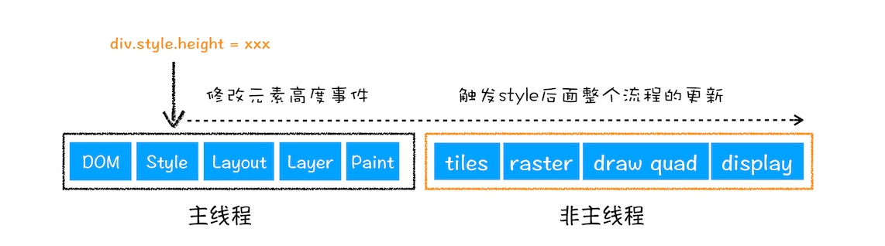
<br/>

从上图可以看出，如果你通过 JavaScript 或者 CSS 修改元素的几何位置属性，例如改变元素的宽度、高度等，那么浏览器会触发重新布局，解析之后的一系列子阶段，这个过程就叫重排。

无疑，重排需要更新完整的渲染流水线，所以开销也是最大的。

#### 2. 更新元素的绘制属性（重绘）

比如通过 JavaScript 更改某些元素的背景颜色，渲染流水线会怎样调整呢？你可以参考下图：

<br/>
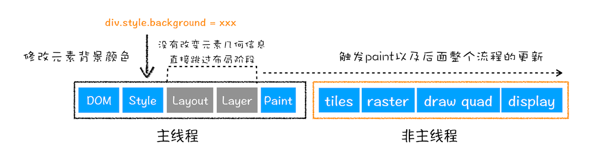
<br/>

从图中可以看出，如果修改了元素的背景颜色，那么布局阶段将不会被执行，因为并没有引起几何位置的变换，所以就直接进入了绘制阶段，然后执行之后的一系列子阶段，这个过程就叫重绘。

相较于重排操作，重绘省去了布局和分层阶段，所以执行效率会比重排操作要高一些。

#### 3. 直接合成阶段

那如果你更改一个既不要布局也不要绘制的属性，会发生什么变化呢？渲染引擎将跳过布局和绘制，只执行后续的合成操作，我们把这个过程叫做合成。具体流程参考下图：

<br/>
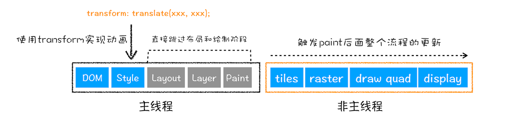
<br/>

在上图中，我们使用了 CSS 的 transform 来实现动画效果，这可以避开重排和重绘阶段，直接在非主线程上执行合成动画操作。这样的效率是最高的，因为是在非主线程上合成，并没有占用主线程的资源，另外也避开了布局和绘制两个子阶段，所以相对于重绘和重排，合成能大大提升绘制效率。


- 渲染进程将 HTML 内容转换为能够读懂的 DOM 树结构。
- 渲染引擎将 CSS 样式表转化为浏览器可以理解的styleSheets，计算出 DOM 节点的样式。
- 创建布局树，并计算元素的布局信息。
- 对布局树进行分层，并生成分层树。
- 为每个图层生成绘制列表，并将其提交到合成线程。
- 合成线程将图层分成图块，并在光栅化线程池中将图块转换成位图。
- 合成线程发送绘制图块命令DrawQuad给浏览器进程。
- 浏览器进程根据 DrawQuad 消息生成页面，并显示到显示器上。


HTML、CSS => 渲染进程 => 布局树

布局树 => 分层 => 分层树

图层 => 合成 => 绘制列表

图层 => 栅格化 => 位图

位图 => 浏览器进程 => 页面


## 渲染小结

<br/>

<br/>

从图中可以看出，左边输入的是 HTML、CSS、JavaScript 数据，这些数据经过中间渲染模块的处理，最终输出为屏幕上的像素。

渲染模块是个流水线，一共经历八个阶段。

- 构建 DOM 树
- 样式计算
- 布局阶段
- 分层
- 绘制
- 分块
- 光栅化
- 合成和显示

每个阶段重点关注以下三点内容：

- 开始每个子阶段都有其输入的内容；
- 然后每个子阶段有其处理过程；
- 最终每个子阶段会生成输出内容。

一、构建 DOM 树

- 输入：HTML
- 处理：HTML 解析器解析
- 输出：生成 DOM 树

<br/>

<br/>

二、样式计算

- 输入：CSS
- 处理：生成 styleSheets，进行属性值的标准化操作，计算出 DOM 树中每个节点的具体样式（涉及到 CSS 的继承规则和层叠规则）
- 输出：每个元素的具体样式

<br/>

<br/>

三、布局阶段

- 输入：DOM 树和 DOM 树中元素的样式
- 处理：创建一棵只包含可见元素的布局树，计算可见元素的几何位置
- 输出：布局树

<br/>

<br/>

四、分层

- 输入：布局树
- 处理：渲染引擎为特定的节点生成专用的图层，并生成一棵对应的图层树
- 输出：图层树

<br/>

<br/>

五、绘制

- 输入：图层树
- 处理：渲染引擎把每一个图层的绘制拆分成很多小的绘制指令
- 输出：待绘制指令列表

<br/>

<br/>

六、分块

- 输入：图层的绘制列表
- 处理：优先绘制视口，合成线程会将图层划分为图块
- 输出：图块，这些图块的大小通常是 256x256 或者 512x512
- 位置：渲染进程的合成线程中

<br/>

<br/>

七、栅格化

- 输入：图块
- 处理：合成线程会按照视口附近的图块来优先生成位图，实际生成位图的操作是由栅格化来执行的
- 输出：位图
- 位置：渲染进程栅格化的线程池，通常，栅格化过程都会使用 GPU 来加速生成，使用 GPU 生成位图的过程叫快速栅格化，或者 GPU 栅格化，生成的位图被保存在 GPU 内存中。

<br/>

<br/>

八、合成和显示

- 输入：位图
- 处理：合成线程发送绘制图块命令DrawQuad给浏览器进程，浏览器进程根据 DrawQuad 消息生成页面，并显示到显示器上。
- 输出：显示页面


一个完整的渲染流程大致可总结为如下：

<br/>

<br/>

- 渲染进程将 HTML 内容转换为能够读懂的DOM 树结构。
- 渲染引擎将 CSS 样式表转化为浏览器可以理解的styleSheets，计算出 DOM 节点的样式。
- 创建布局树，并计算元素的布局信息。
- 对布局树进行分层，并生成分层树。
- 为每个图层生成绘制列表，并将其提交到合成线程。
- 合成线程将图层分成图块，并在光栅化线程池中将图块转换成位图。
- 合成线程发送绘制图块命令DrawQuad给浏览器进程。
- 浏览器进程根据 DrawQuad 消息生成页面，并显示到显示器上。

<br>

# 浏览器中的JavaScript执行机制
## 07丨变量提升：JavaScript代码是按顺序执行的吗？

### 变量提升

所谓的变量提升，是指在 JavaScript 代码执行过程中，JavaScript 引擎把变量的声明部分和函数的声明部分提升到代码开头的“行为”。变量被提升后，会给变量设置默认值，这个默认值就是我们熟悉的 undefined。

<br/>

<br/>

### JavaScript 代码的执行流程

从概念的字面意义上来看，“变量提升”意味着变量和函数的声明会在物理层面移动到代码的最前面，正如我们所模拟的那样。

但，这并不准确。实际上变量和函数声明在代码里的位置是不会改变的，而且是在编译阶段被 JavaScript 引擎放入内存中。

一段 JavaScript 代码在执行之前需要被 JavaScript 引擎编译，编译完成之后，才会进入执行阶段。大致流程你可以参考下图：

<br/>
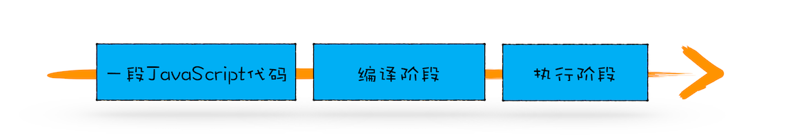
<br/>

#### 1. 编译阶段

<br/>
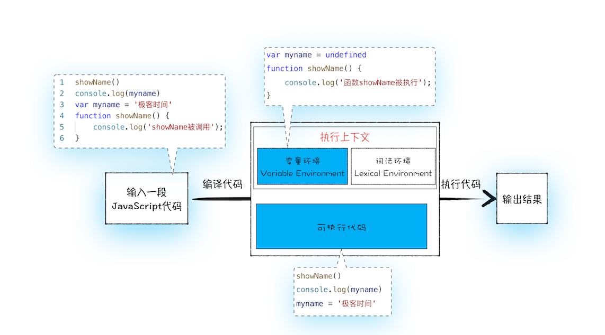
<br/>

输入一段代码，经过编译后，会生成两部分内容：执行上下文（Execution context）和可执行代码。

执行上下文是 JavaScript 执行一段代码时的运行环境

在执行上下文中存在一个变量环境的对象，该对象中保存了变量提升的内容，比如上面代码中的变量 myname 和函数 showName，都保存在该对象中。

你可以简单地把变量环境对象看成是如下结构：

```
VariableEnvironment:
     myname -> undefined,
     showName ->function : {console.log(myname)
```

#### 2. 执行阶段

JavaScript 引擎开始执行“可执行代码”，按照顺序一行一行地执行。下面我们就来一行一行分析下这个执行过程：

- 当执行到 showName 函数时，JavaScript 引擎便开始在变量环境对象中查找该函数，由于变量环境对象中存在该函数的引用，所以 JavaScript 引擎便开始执行该函数，并输出“函数 showName 被执行”结果。
- 接下来打印“myname”信息，JavaScript 引擎继续在变量环境对象中查找该对象，由于变量环境存在 myname 变量，并且其值为 undefined，所以这时候就输出 undefined。
- 接下来执行第 3 行，把“极客时间”赋给 myname 变量，赋值后变量环境中的 myname 属性值改变为“极客时间”，变量环境如下所示：

以上就是一段代码的编译和执行流程。

实际上，编译阶段和执行阶段都是非常复杂的，包括了词法分析、语法解析、代码优化、代码生成等，后续详细介绍

### 代码中出现相同的变量或者函数怎么办？

```js
function showName() {
    console.log('极客邦');
}
showName();
function showName() {
    console.log('极客时间');
}
showName();
```

- 首先是编译阶段。遇到了第一个 showName 函数，会将该函数体存放到变量环境中。接下来是第二个 showName 函数，继续存放至变量环境中，但是变量环境中已经存在一个 showName 函数了，此时，第二个 showName 函数会将第一个 showName 函数覆盖掉。这样变量环境中就只存在第二个 showName 函数了。
- 接下来是执行阶段。先执行第一个 showName 函数，但由于是从变量环境中查找 showName 函数，而变量环境中只保存了第二个 showName 函数，所以最终调用的是第二个函数，打印的内容是“极客时间”。第二次执行 showName 函数也是走同样的流程，所以输出的结果也是“极客时间”。

综上所述，一段代码如果定义了两个相同名字的函数，那么最终生效的是最后一个函数。

### 总结

- JavaScript 代码执行过程中，需要先做变量提升，而之所以需要实现变量提升，是因为 JavaScript 代码在执行之前需要先编译。
- 在编译阶段，变量和函数会被存放到变量环境中，变量的默认值会被设置为 undefined；在代码执行阶段，JavaScript 引擎会从变量环境中去查找自定义的变量和函数。
- 如果在编译阶段，存在两个相同的函数，那么最终存放在变量环境中的是最后定义的那个，这是因为后定义的会覆盖掉之前定义的。

综上，JavaScript 的执行机制：先编译，再执行。

<br>

## 08丨调用栈：为什么JavaScript代码会出现栈溢出？

### 函数调用

```js
var a = 2
function add(){
  var b = 10
  return  a+b
}
add()
```

在执行到函数 add() 之前，JavaScript 引擎会为上面这段代码创建全局执行上下文，包含了声明的函数和变量，你可以参考下图：

<br/>
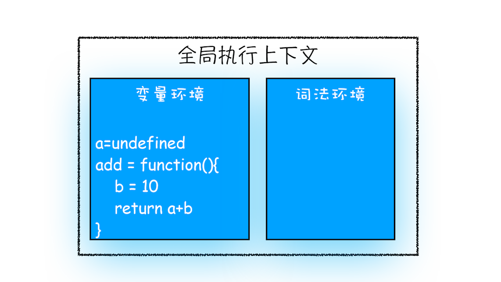
<br/>

代码中全局变量和函数都保存在全局上下文的变量环境中。

执行上下文准备好之后，便开始执行全局代码，当执行到 add 这儿时，JavaScript 判断这是一个函数调用，那么将执行以下操作：

- 首先，从全局执行上下文中，取出 add 函数代码。
- 其次，对 add 函数的这段代码进行编译，并创建该函数的执行上下文和可执行代码。
- 最后，执行代码，输出结果。

<br/>
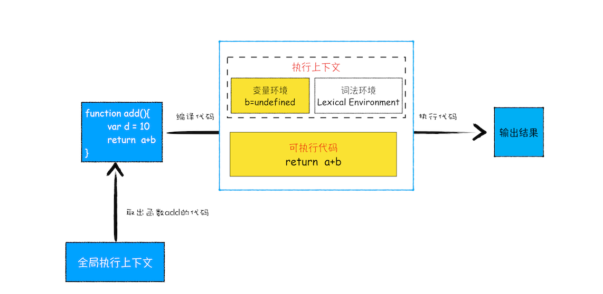
<br/>

就这样，当执行到 add 函数的时候，我们就有了两个执行上下文了——全局执行上下文和 add 函数的执行上下文。

也就是说在执行 JavaScript 时，可能会存在多个执行上下文， JavaScript 引擎使用栈管理这些执行上下文

### JavaScript 的调用栈

在执行上下文创建好后，JavaScript 引擎会将执行上下文压入栈中，通常把这种用来管理执行上下文的栈称为执行上下文栈，又称调用栈。

下面我们再来看段稍微复杂点的示例代码：

```js
var a = 2
function add(b, c){
  return b + c
}
function addAll(b, c){
  var d = 10
  result = add(b, c)
  return  a + result + d
}
addAll(3,6)
```

第一步，创建全局上下文，并将其压入栈底。如下图所示：

<br/>
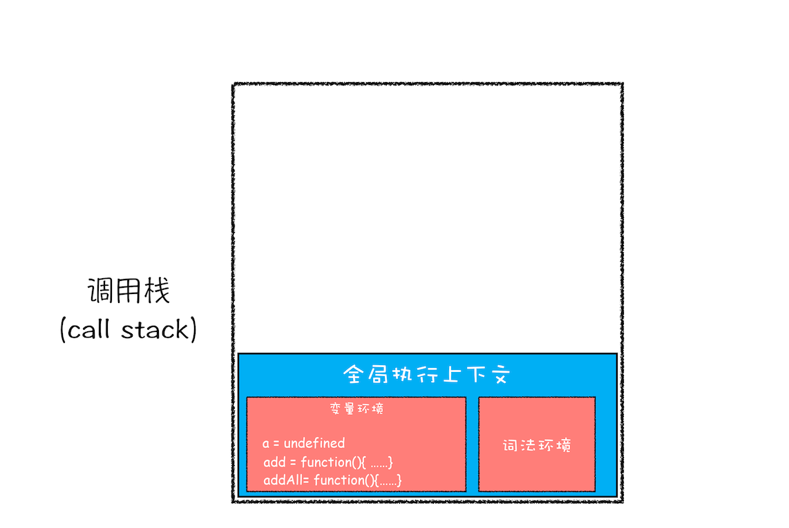
<br/>

全局执行上下文压入到调用栈后，JavaScript 引擎便开始执行全局代码了。首先会执行 a=2 的赋值操作，执行该语句会将全局上下文变量环境中 a 的值设置为 2。

接下来，第二步是调用 addAll 函数。

当调用该函数时，JavaScript 引擎会编译该函数，并为其创建一个执行上下文，最后还将该函数的执行上下文压入栈中，如下图所示：

<br/>
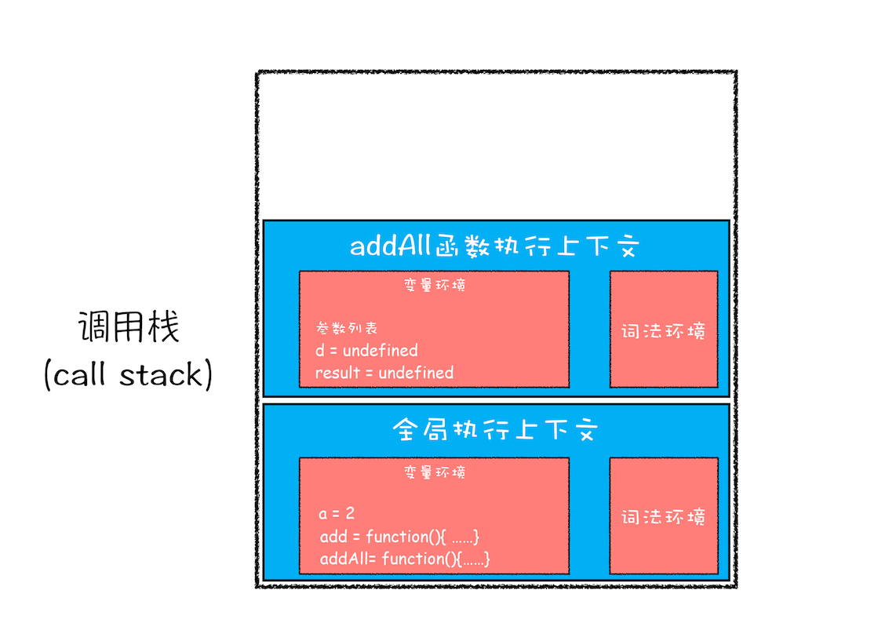
<br/>

addAll 函数的执行上下文创建好之后，便进入了函数代码的执行阶段了，这里先执行的是 d=10 的赋值操作，执行语句会将 addAll 函数执行上下文中的 d 由 undefined 变成了 10。

然后接着往下执行，第三步，当执行到 add 函数调用语句时，同样会为其创建执行上下文，并将其压入调用栈，如下图所示：

<br/>

<br/>

当 add 函数返回时，该函数的执行上下文就会从栈顶弹出，并将 result 的值设置为 add 函数的返回值，也就是 9。如下图所示：

<br/>
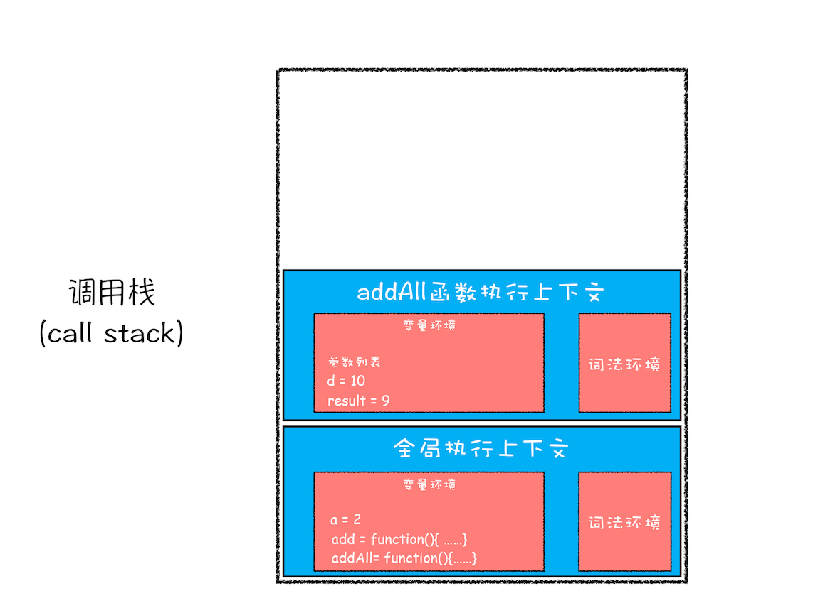
<br/>

紧接着 addAll 执行最后一个相加操作后并返回，addAll 的执行上下文也会从栈顶部弹出，此时调用栈中就只剩下全局上下文了。最终如下图所示：

<br/>
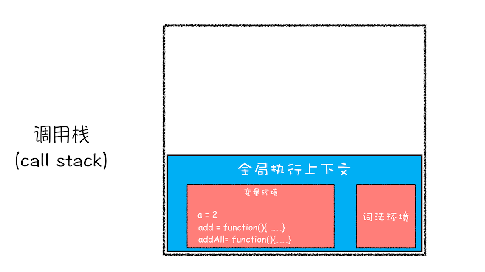
<br/>

至此，整个 JavaScript 流程执行结束了。

好了，现在你应该知道了调用栈是 JavaScript 引擎追踪函数执行的一个机制，当一次有多个函数被调用时，通过调用栈就能够追踪到哪个函数正在被执行以及各函数之间的调用关系。

### 在开发中，如何利用好调用栈

#### 1. 如何利用浏览器查看调用栈的信息

<br/>
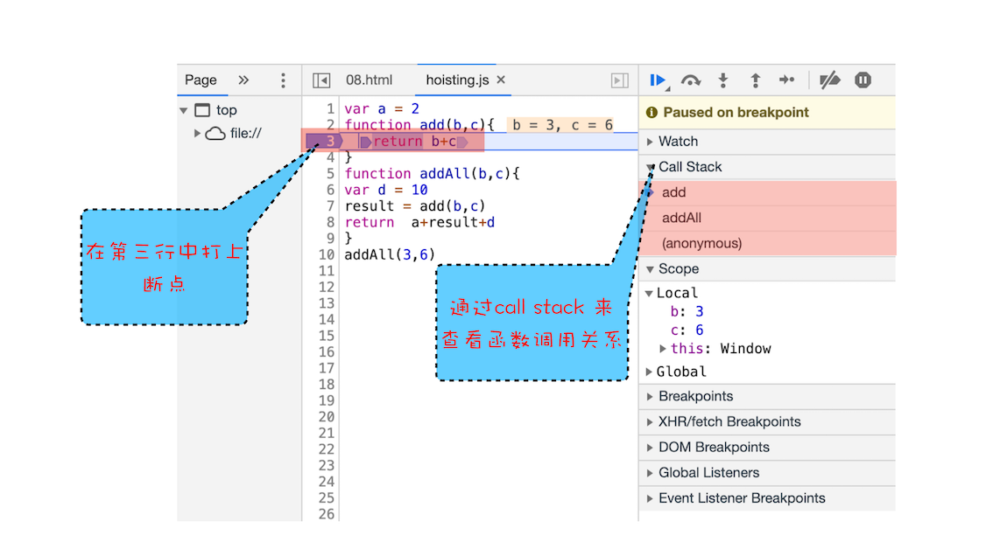
<br/>

除了通过断点来查看调用栈，你还可以使用 console.trace() 来输出当前的函数调用关系，比如在示例代码中的 add 函数里面加上了 console.trace()，你就可以看到控制台输出的结果，如下图：

<br/>
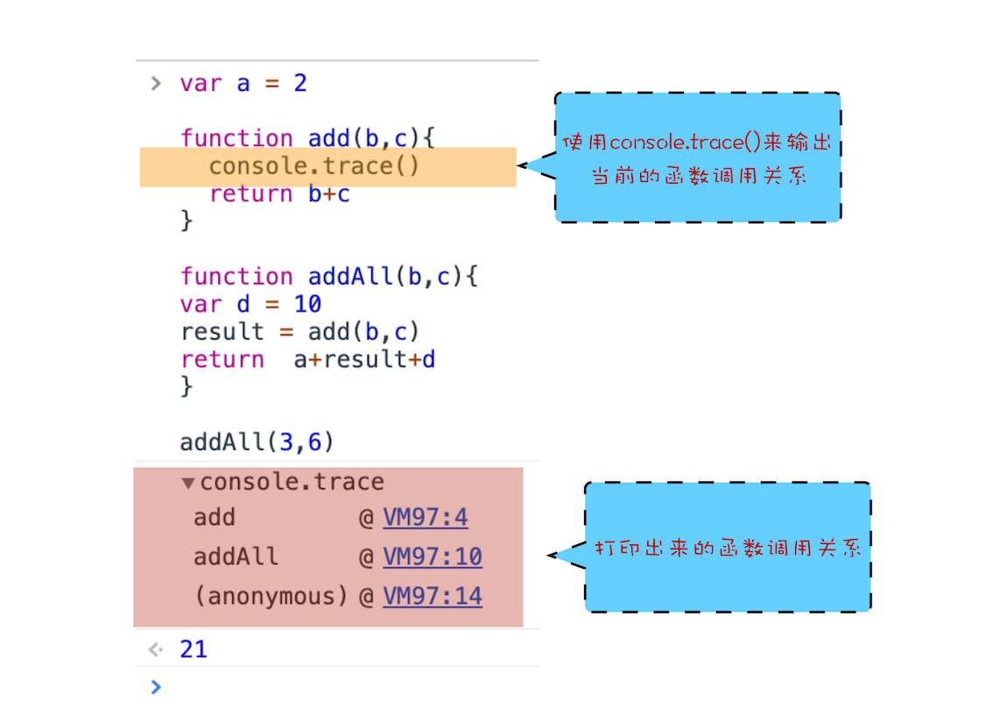
<br/>

#### 2. 栈溢出（Stack Overflow）

调用栈是有大小的，当入栈的执行上下文超过一定数目，JavaScript 引擎就会报错，我们把这种错误叫做栈溢出。

特别是在你写递归代码的时候，就很容易出现栈溢出的情况。

理解了栈溢出原因后，你就可以使用一些方法来避免或者解决栈溢出的问题，比如把递归调用的形式改造成其他形式，或者使用加入定时器的方法来把当前任务拆分为其他很多小任务。

<br>

## 09丨块级作用域：var缺陷以及为什么要引入let和const？

变量提升是JS设计缺陷，虽然ES6引入块级作用域并配合let、const关键字来避开这个缺陷，但因为JS需要向下兼容，所以变量提升还会长时间存在。

本文，先“探病因”——分析为什么在 JavaScript 中会存在变量提升，以及变量提升所带来的问题；

然后再来“开药方”——介绍如何通过块级作用域并配合 let 和 const 关键字来修复这种缺陷。

### 作用域（scope）

作用域是指在程序中定义变量的区域，该位置决定了变量的生命周期。

通俗地理解，作用域就是变量与函数的可访问范围，即作用域控制着变量和函数的可见性和生命周期。

在 ES6 之前，ES 的作用域只有两种：全局作用域和函数作用域。

ES6 之前是不支持块级作用域的，因为当初设计这门语言的时候，并没有想到 JavaScript 会火起来，所以只是按照最简单的方式来设计。

没有了块级作用域，再把作用域内部的变量统一提升无疑是最快速、最简单的设计

不过这也直接导致了函数中的变量无论是在哪里声明的，在编译阶段都会被提取到执行上下文的变量环境中，所以这些变量在整个函数体内部的任何地方都是能被访问的，这也就是 JavaScript 中的变量提升。

### 变量提升所带来的问题

于变量提升作用，使用 JavaScript 来编写和其他语言相同逻辑的代码，都有可能会导致不一样的执行结果。

那为什么会出现这种情况呢？主要有以下两种原因。

#### 1. 变量容易在不被察觉的情况下被覆盖掉

```js
var myname = " 极客时间 "
function showName(){
  console.log(myname);
  if(0){
   var myname = " 极客邦 "
  }
  console.log(myname);
}
showName()
```

执行上面这段代码，打印出来的是 undefined，而并不是“极客时间”

#### 2. 本应销毁的变量没有被销毁

```js
function foo(){
  for (var i = 0; i < 7; i++) {
  }
  console.log(i);
}
foo()
```

果你使用 C 语言或者其他的大部分语言实现类似代码，在 for 循环结束之后，i 就已经被销毁了，但是在 JavaScript 代码中，i 的值并未被销毁，所以最后打印出来的是 7。

这同样也是由变量提升而导致的，在创建执行上下文阶段，变量 i 就已经被提升了，所以当 for 循环结束之后，变量 i 并没有被销毁。

### ES6 是如何解决变量提升带来的缺陷

上面我们介绍了变量提升而带来的一系列问题，为了解决这些问题，ES6 引入了 let 和 const 关键字，从而使 JavaScript 也能像其他语言一样拥有了块级作用域。

块级作用块内声明的变量不影响块外面的变量。

### JavaScript 是如何支持块级作用域的

在同一段代码中，ES6 是如何做到既要支持变量提升的特性，又要支持块级作用域的呢？

那么接下来，我们就要站在执行上下文的角度来揭开答案。

你已经知道 JavaScript 引擎是通过变量环境实现函数级作用域的，那么 ES6 又是如何在函数级作用域的基础之上，实现对块级作用域的支持呢？你可以先看下面这段代码：

```js
function foo(){
    var a = 1
    let b = 2
    {
      let b = 3
      var c = 4
      let d = 5
      console.log(a)
      console.log(b)
    }
    console.log(b)
    console.log(c)
    console.log(d)
}
foo()
```

第一步是编译并创建执行上下文，下面是我画出来的执行上下文示意图，你可以参考下：

<br/>
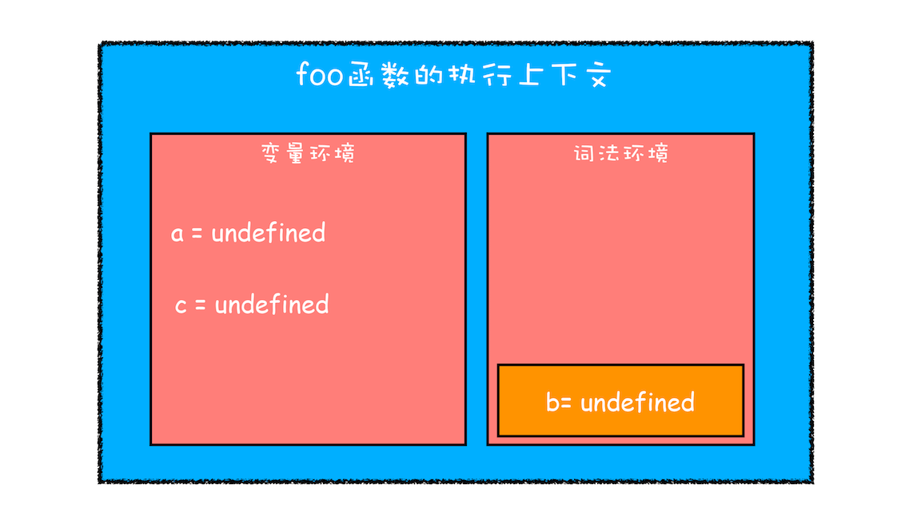
<br/>

通过上图，我们可以得出以下结论：

- 函数内部通过 var 声明的变量，在编译阶段全都被存放到变量环境里面了。
- 通过 let 声明的变量，在编译阶段会被存放到词法环境（Lexical Environment）中。
- 在函数的作用域内部，通过 let 声明的变量并没有被存放到词法环境中。

接下来，第二步继续执行代码，当执行到代码块里面时，变量环境中 a 的值已经被设置成了 1，词法环境中 b 的值已经被设置成了 2，这时候函数的执行上下文就如下图所示：

<br/>
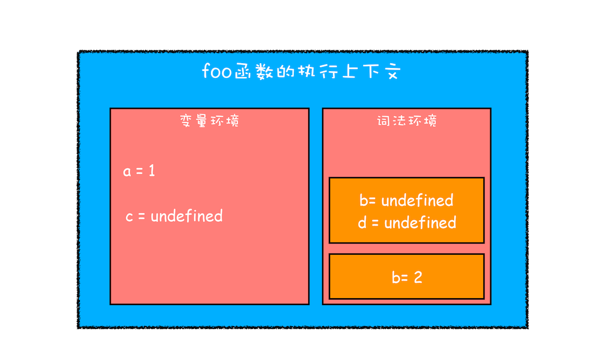
<br/>

从图中可以看出，当进入函数的作用域块时，作用域块中通过 let 声明的变量，会被存放在词法环境的一个单独的区域中，这个区域中的变量并不影响作用域块外面的变量，比如在作用域外面声明了变量 b，在该作用域块内部也声明了变量 b，当执行到作用域内部时，它们都是独立的存在。

其实，在词法环境内部，维护了一个小型栈结构，栈底是函数最外层的变量，进入一个作用域块后，就会把该作用域块内部的变量压到栈顶；当作用域执行完成之后，该作用域的信息就会从栈顶弹出，这就是词法环境的结构。需要注意下，我这里所讲的变量是指通过 let 或者 const 声明的变量。

再接下来，当执行到作用域块中的console.log(a)这行代码时，就需要在词法环境和变量环境中查找变量 a 的值了，具体查找方式是：沿着词法环境的栈顶向下查询，如果在词法环境中的某个块中查找到了，就直接返回给 JavaScript 引擎，如果没有查找到，那么继续在变量环境中查找。

<br/>
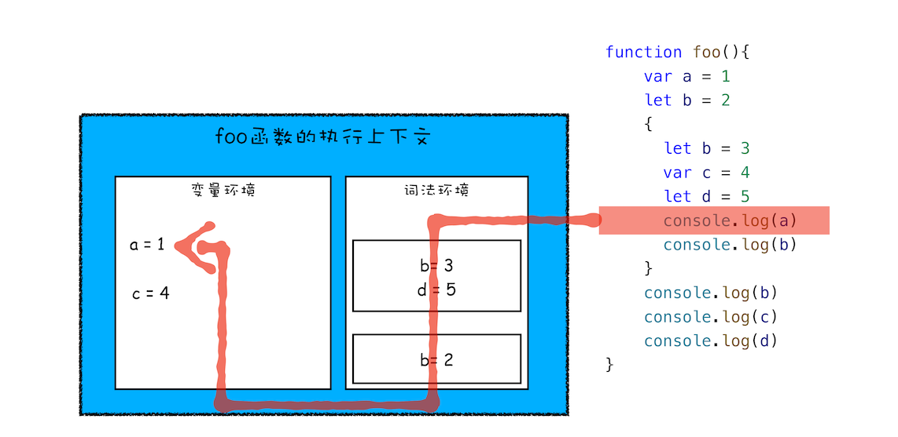
<br/>

当作用域块执行结束之后，其内部定义的变量就会从词法环境的栈顶弹出，最终执行上下文如下图所示：

<br/>
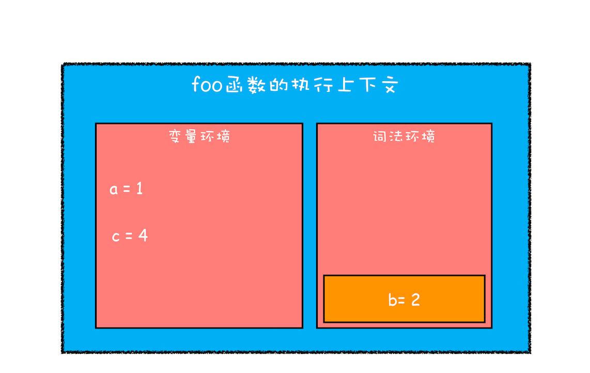
<br/>

想必你已经理解了词法环境的结构和工作机制，块级作用域就是通过词法环境的栈结构来实现的，而变量提升是通过变量环境来实现，通过这两者的结合，JavaScript 引擎也就同时支持了变量提升和块级作用域了。

<br>

## 10丨作用域链和闭包：代码中出现相同的变量，JavaScript引擎是如何选择的？

我们了解了作用域，了解了ES6 是如何通过变量环境和词法环境来同时支持变量提升和块级作用域

接下来，还了解了如何通过词法环境和变量环境来查找变量，这其中，涉及到了作用域链

理解作用域链是理解闭包的基础，而闭包在 JavaScript 中几乎无处不在，同时作用域和作用域链还是所有编程语言的基础。所以，如果你想学透一门语言，作用域和作用域链一定是绕不开的。

本文先聊聊什么是作用域链，并通过作用域链再来讲讲什么是闭包。

### 作用域链

其实在每个执行上下文的变量环境中，都包含了一个外部引用，用来指向外部的执行上下文，我们把这个外部引用称为outer。

当一段代码使用了一个变量时，JavaScript 引擎首先会在“当前的执行上下文”中查找该变量

比如上面那段代码在查找 myName 变量时，如果在当前的变量环境中没有查找到，那么 JavaScript 引擎会继续在 outer 所指向的执行上下文中查找。

为了直观理解，你可以看下面这张图：

<br/>
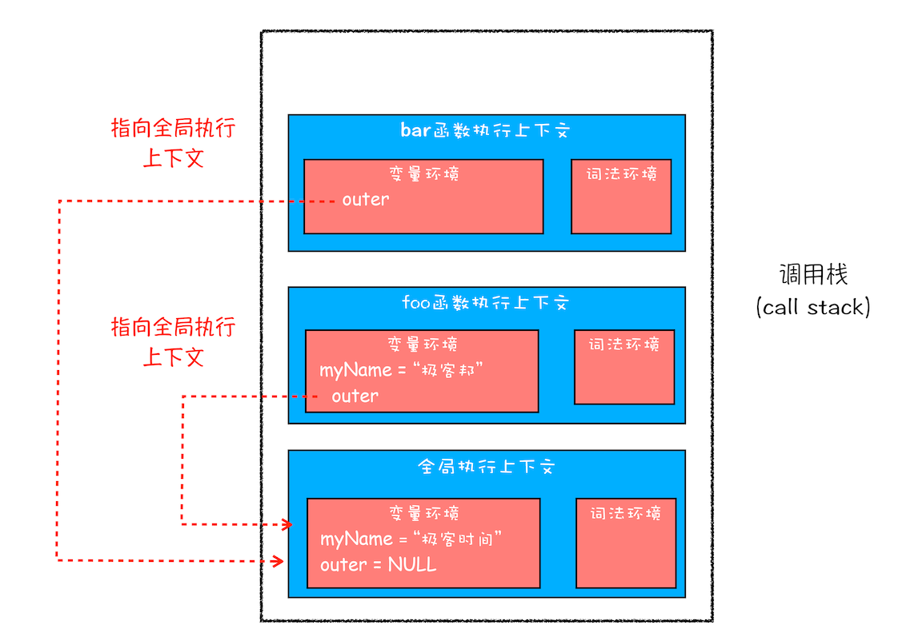
<br/>

从图中可以看出，bar 函数和 foo 函数的 outer 都是指向全局上下文的，这也就意味着如果在 bar 函数或者 foo 函数中使用了外部变量，那么 JavaScript 引擎会去全局执行上下文中查找。

我们把这个查找的链条就称为作用域链。

为什么 bar 函数的外部引用是全局执行上下文，而不是 foo 函数的执行上下文？

要回答这个问题，你还需要知道什么是词法作用域。

这是因为在 JavaScript 执行过程中，其作用域链是由词法作用域决定的。

### 词法作用域

词法作用域就是指作用域是由代码中函数声明的位置来决定的，所以词法作用域是静态的作用域，通过它就能够预测代码在执行过程中如何查找标识符。

<br/>
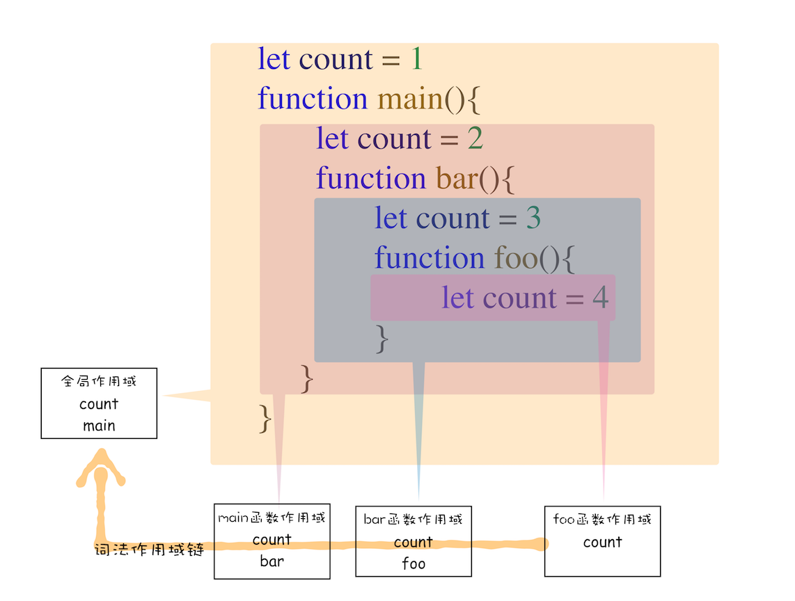
<br/>

从图中可以看出，词法作用域就是根据代码的位置来决定的，其中 main 函数包含了 bar 函数，bar 函数中包含了 foo 函数，因为 JavaScript 作用域链是由词法作用域决定的，所以整个词法作用域链的顺序是：foo 函数作用域—>bar 函数作用域—>main 函数作用域—> 全局作用域。

了解了词法作用域以及 JavaScript 中的作用域链，我们再回过头来看看上面的那个问题：在开头那段代码中，foo 函数调用了 bar 函数，那为什么 bar 函数的外部引用是全局执行上下文，而不是 foo 函数的执行上下文?

这是因为根据词法作用域，foo 和 bar 的上级作用域都是全局作用域，所以如果 foo 或者 bar 函数使用了一个它们没有定义的变量，那么它们会到全局作用域去查找。也就是说，词法作用域是代码阶段就决定好的，和函数是怎么调用的没有关系。

### 闭包

```js
function foo() {
    var myName = " 极客时间 "
    let test1 = 1
    const test2 = 2
    var innerBar = {
        getName:function(){
            console.log(test1)
            return myName
        },
        setName:function(newName){
            myName = newName
        }
    }
    return innerBar
}
var bar = foo()
bar.setName(" 极客邦 ")
bar.getName()
console.log(bar.getName())
```

<br/>
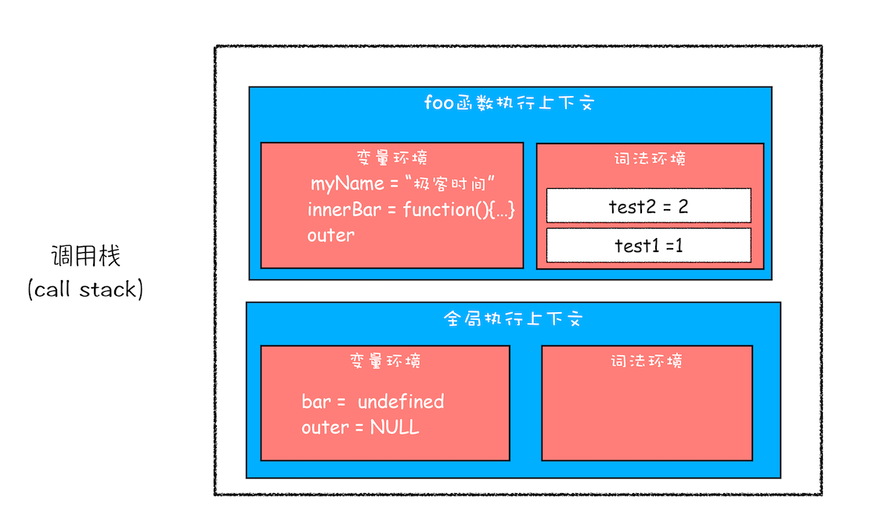
<br/>

innerBar 是一个对象，包含了 getName 和 setName 的两个方法

你可以看到，这两个方法都是在 foo 函数内部定义的，并且这两个方法内部都使用了 myName 和 test1 两个变量。

根据词法作用域的规则，内部函数 getName 和 setName 总是可以访问它们的外部函数 foo 中的变量

所以当 innerBar 对象返回给全局变量 bar 时，虽然 foo 函数已经执行结束，但是 getName 和 setName 函数依然可以使用 foo 函数中的变量 myName 和 test1

所以当 foo 函数执行完成之后，其整个调用栈的状态如下图所示：

<br/>
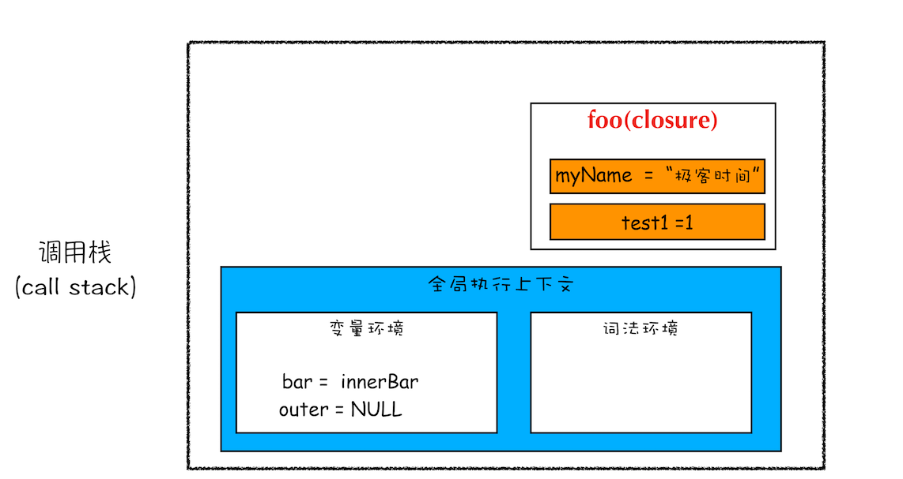
<br/>

从上图可以看出，foo 函数执行完成之后，其执行上下文从栈顶弹出了，但是由于返回的 setName 和 getName 方法中使用了 foo 函数内部的变量 myName 和 test1，所以这两个变量依然保存在内存中。

这像极了 setName 和 getName 方法背的一个专属背包，无论在哪里调用了 setName 和 getName 方法，它们都会背着这个 foo 函数的专属背包。

之所以是专属背包，是因为除了 setName 和 getName 函数之外，其他任何地方都是无法访问该背包的，我们就可以把这个背包称为 foo 函数的闭包。

好了，现在我们终于可以给闭包一个正式的定义了。在 JavaScript 中，根据词法作用域的规则，内部函数总是可以访问其外部函数中声明的变量，当通过调用一个外部函数返回一个内部函数后，即使该外部函数已经执行结束了，但是内部函数引用外部函数的变量依然保存在内存中，我们就把这些变量的集合称为闭包。比如外部函数是 foo，那么这些变量的集合就称为 foo 函数的闭包。

那这些闭包是如何使用的呢？当执行到 bar.setName 方法中的myName = "极客邦"这句代码时，JavaScript 引擎会沿着“当前执行上下文–>foo 函数闭包–> 全局执行上下文”的顺序来查找 myName 变量，你可以参考下面的调用栈状态图：

<br/>
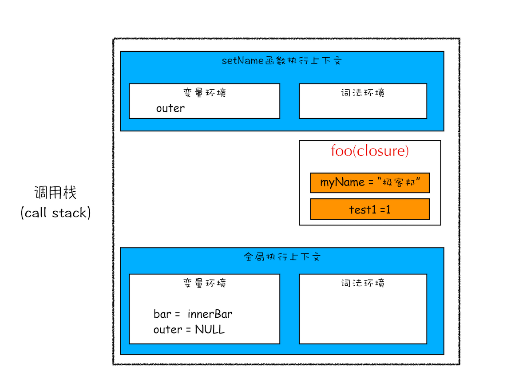
<br/>

从图中可以看出，setName 的执行上下文中没有 myName 变量，foo 函数的闭包中包含了变量 myName，所以调用 setName 时，会修改 foo 闭包中的 myName 变量的值。

可以通过“开发者工具”来看看闭包的情况

<br/>
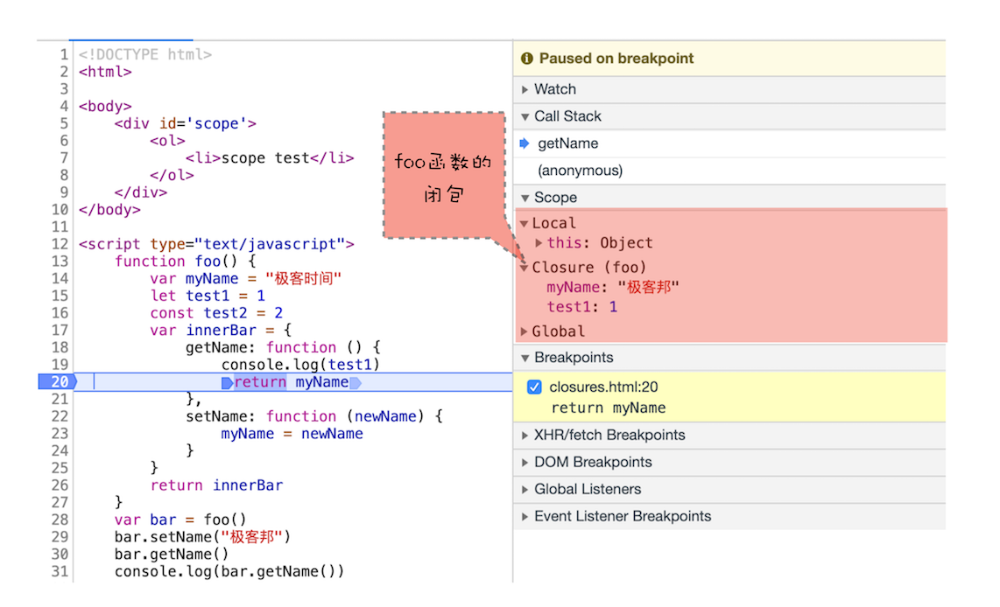
<br/>

## 11丨this：从JavaScript执行上下文的视角讲清楚this

JavaScript 语言的作用域链是由词法作用域决定的，而词法作用域是由代码结构来确定的。

这就出现了一些比较难理解的现象

```js
var bar = {
    myName:"time.geekbang.com",
    printName: function () {
        console.log(myName)
    }
}
function foo() {
    let myName = " 极客时间 "
    return bar.printName
}
let myName = " 极客邦 "
let _printName = foo()
_printName()
bar.printName()
```

按照常理来说，调用bar.printName方法时，该方法内部的变量 myName 应该使用 bar 对象中的，因为它们是一个整体，大多数面向对象语言都是这样设计的

实际上，在 printName 函数里面使用的变量 myName 是属于全局作用域下面的，所以最终打印出来的值都是“极客邦”

**在对象内部的方法中使用对象内部的属性是一个非常普遍的需求。**

但是 JavaScript 的作用域机制并不支持这一点，基于这个需求，JavaScript 又搞出来另外一套this 机制。

作用域链和this是两套不同的系统，它们之间基本没太多联系。

### JavaScript 中的 this 是什么

我们提到执行上下文中包含了变量环境、词法环境、外部环境，但其实还有一个 this 没有提及，具体你可以参考下图：

<br/>
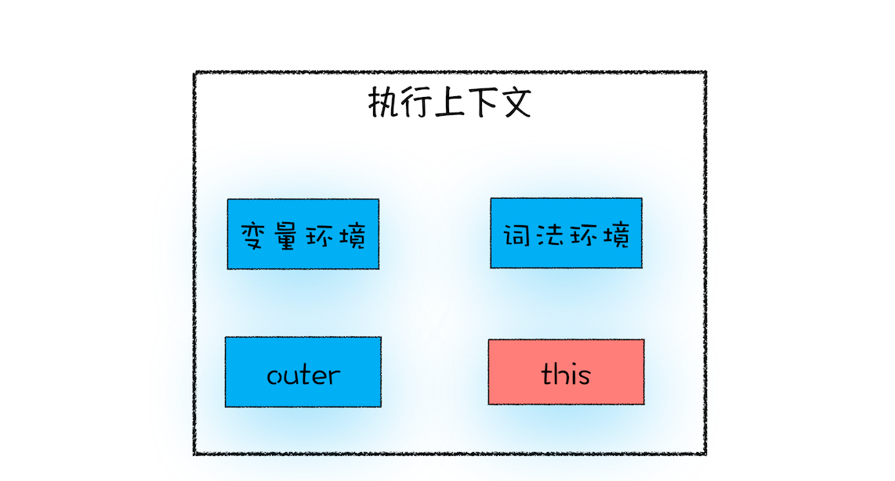
<br/>

this 是和执行上下文绑定的，也就是说每个执行上下文中都有一个 this。

执行上下文主要分为三种——全局执行上下文、函数执行上下文和 eval 执行上下文，所以对应的 this 也只有这三种——全局执行上下文中的 this、函数中的 this 和 eval 中的 this。

### 全局执行上下文中的 this

全局执行上下文中的 this 是指向 window 对象的。

这也是 this 和作用域链的唯一交点，作用域链的最底端包含了 window 对象，全局执行上下文中的 this 也是指向 window 对象。

### 函数执行上下文中的 this

默认情况下调用一个函数，其执行上下文中的 this 也是指向 window 对象的。

有下面三种方式来设置函数执行上下文中的 this 值。

1. 通过函数的 call 方法设置
2. 通过对象调用方法设置
3. 通过构造函数中设置

### this 的设计缺陷以及应对方案

1. 嵌套函数中的 this 不会从外层函数中继承

```js
var myObj = {
  name : " 极客时间 ",
  showThis: function(){
    console.log(this)
    function bar(){console.log(this)}
    bar()
  }
}
myObj.showThis()
```

函数 bar 中的 this 指向的是全局 window 对象，而函数 showThis 中的 this 指向的是 myObj 对象。

解决方案可以使用箭头函数，也声明一个变量 self 用来保存 this

2. 普通函数中的 this 默认指向全局对象 window

在实际工作中，我们并不希望函数执行上下文中的 this 默认指向全局对象，因为这样会打破数据的边界，造成一些误操作。如果要让函数执行上下文中的 this 指向某个对象，最好的方式是通过 call 方法来显示调用。

这个问题可以通过设置 JavaScript 的“严格模式”来解决。在严格模式下，默认执行一个函数，其函数的执行上下文中的 this 值是 undefined，这就解决上面的问题了。

<br>

# V8工作原理

## 12丨栈空间和堆空间：数据是如何存储的？

### JavaScript 是什么类型的语言

静态语言 VS 动态语言

C 语言在定义变量之前，就需要确定变量的类型,我们把这种在使用之前就需要确认其变量数据类型的称为静态语言

相反地，我们把在运行过程中需要检查数据类型的语言称为动态语言。JavaScript 就是动态语言

强类型语言 VS 弱类型语言

支持隐式类型转换的语言称为弱类型语言，不支持隐式类型转换的语言称为强类型语言

<br/>
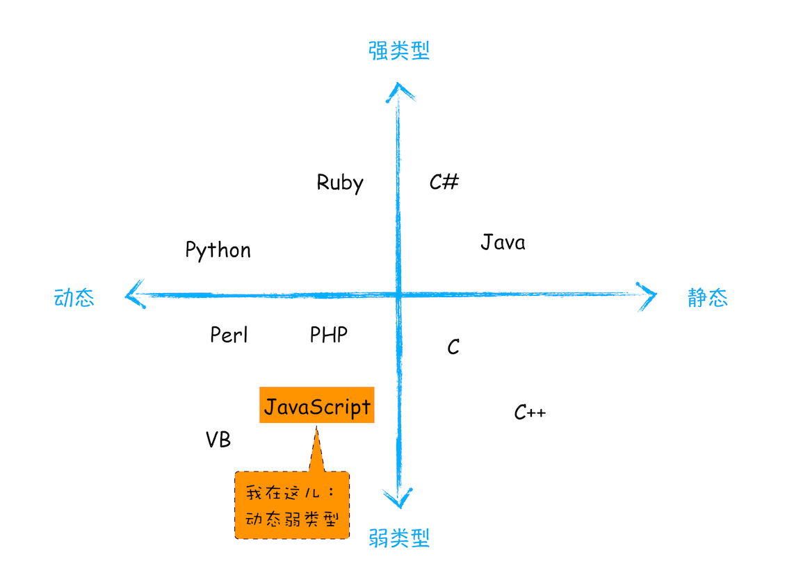
<br/>

### JavaScript 的数据类型

JavaScript 是一种弱类型的、动态的语言。那这些特点意味着什么呢？

- 弱类型，意味着你不需要告诉 JavaScript 引擎这个或那个变量是什么数据类型，JavaScript 引擎在运行代码的时候自己会计算出来。
- 动态，意味着你可以使用同一个变量保存不同类型的数据。

JavaScript 中的数据类型一种有 8 种，它们分别是：

<br/>
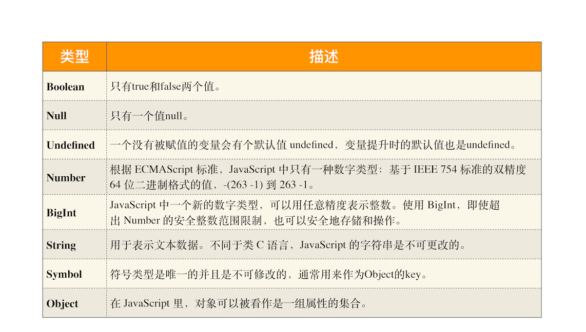
<br/>

我们把前面的 7 种数据类型称为原始类型，把最后一个对象类型称为引用类型

### 内存空间

要理解 JavaScript 在运行过程中数据是如何存储的，你就得先搞清楚其存储空间的种类。下面是我画的 JavaScript 的内存模型，你可以参考下：

<br/>
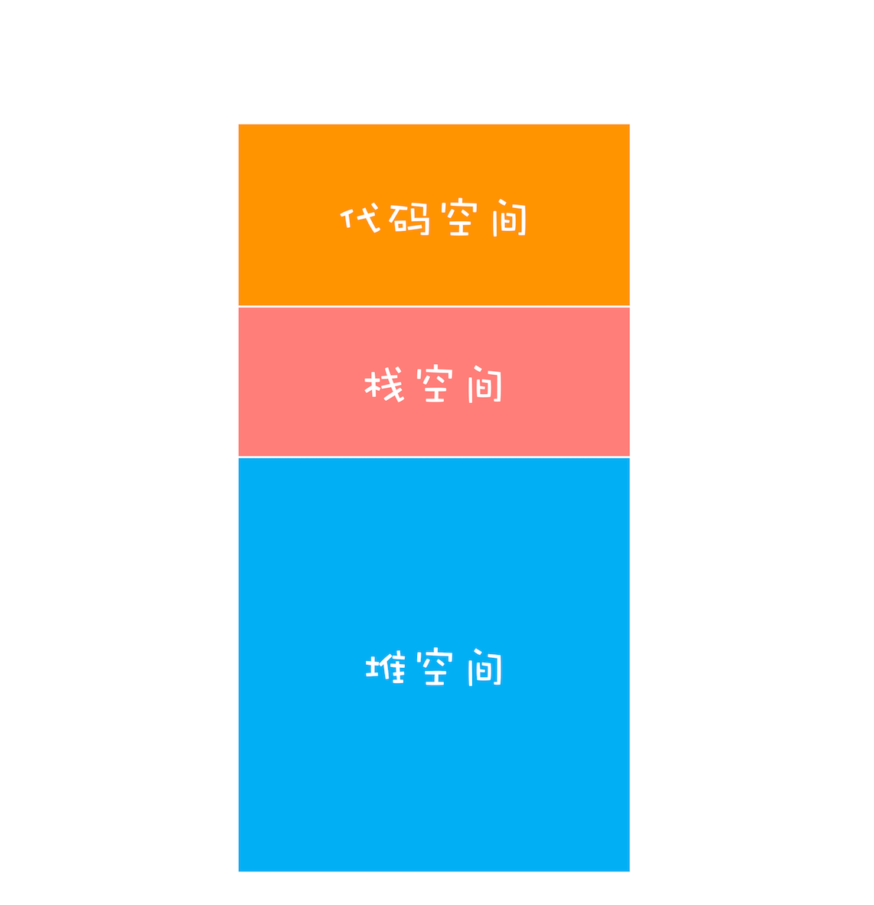
<br/>

从图中可以看出， 在 JavaScript 的执行过程中， 主要有三种类型内存空间，分别是代码空间、栈空间和堆空间。

其中的代码空间主要是存储可执行代码的，这个我们后面再做介绍，今天主要来说说栈空间和堆空间。

#### 栈空间和堆空间

这里的栈空间就是我们之前反复提及的调用栈，是用来存储执行上下文的。

为了搞清楚栈空间是如何存储数据的，我们还是先看下面这段代码：

```js
function foo(){
    var a = " 极客时间 "
    var b = a
    var c = {name:" 极客时间 "}
    var d = c
}
foo()
```

<br/>
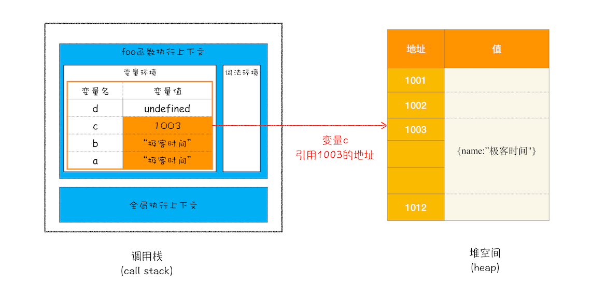
<br/>

原始类型的数据值都是直接保存在“栈”中的，引用类型的值是存放在“堆”中的。

不过你也许会好奇，为什么一定要分“堆”和“栈”两个存储空间呢？所有数据直接存放在“栈”中不就可以了吗？

答案是不可以的。

这是因为 JavaScript 引擎需要用栈来维护程序执行期间上下文的状态，如果栈空间大了话，所有的数据都存放在栈空间里面，那么会影响到上下文切换的效率，进而又影响到整个程序的执行效率。

比如文中的 foo 函数执行结束了，JavaScript 引擎需要离开当前的执行上下文，只需要将指针下移到上个执行上下文的地址就可以了，foo 函数执行上下文栈区空间全部回收，具体过程你可以参考下图：

<br/>
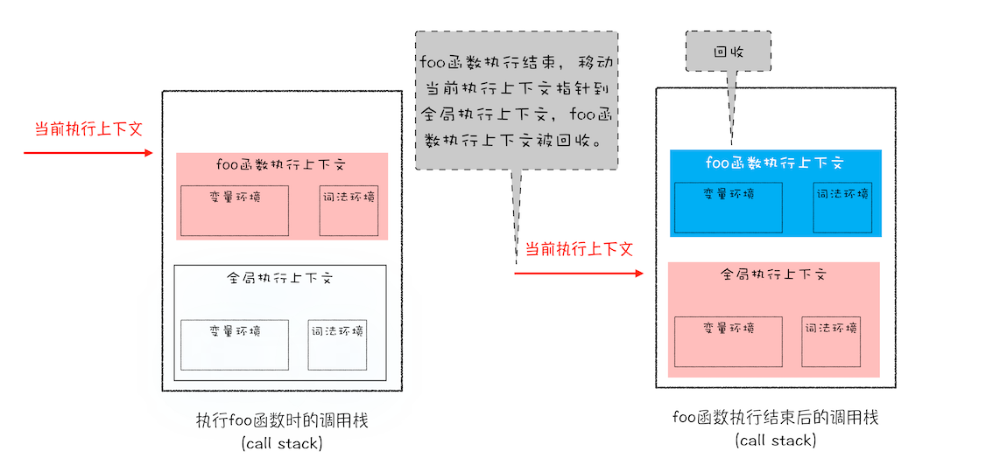
<br/>

所以通常情况下，栈空间都不会设置太大，主要用来存放一些原始类型的小数据。

而引用类型的数据占用的空间都比较大，所以这一类数据会被存放到堆中，堆空间很大，能存放很多大的数据，不过缺点是分配内存和回收内存都会占用一定的时间。

解释了程序在执行过程中为什么需要堆和栈两种数据结构后，我们还是回到示例代码那里，看看它最后一步将变量 c 赋值给变量 d 是怎么执行的？

在 JavaScript 中，赋值操作和其他语言有很大的不同，原始类型的赋值会完整复制变量值，而引用类型的赋值是复制引用地址。

所以d=c的操作就是把 c 的引用地址赋值给 d，你可以参考下图：

<br/>

<br/>

从图中你可以看到，变量 c 和变量 d 都指向了同一个堆中的对象，所以这就很好地解释了文章开头的那个问题，通过 c 修改 name 的值，变量 d 的值也跟着改变，归根结底它们是同一个对象。

### 再谈闭包

现在你知道了作用域内的原始类型数据会被存储到栈空间，引用类型会被存储到堆空间，基于这两点的认知，我们再深入一步，探讨下闭包的内存模型。

以一段代码为例：

```js
function foo() {
    var myName = " 极客时间 "
    let test1 = 1
    const test2 = 2
    var innerBar = {
        setName:function(newName){
            myName = newName
        },
        getName:function(){
            console.log(test1)
            return myName
        }
    }
    return innerBar
}
var bar = foo()
bar.setName(" 极客邦 ")
bar.getName()
console.log(bar.getName())
```

当执行这段代码的时候，你应该有过这样的分析：由于变量 myName、test1、test2 都是原始类型数据，所以在执行 foo 函数的时候，它们会被压入到调用栈中；当 foo 函数执行结束之后，调用栈中 foo 函数的执行上下文会被销毁，其内部变量 myName、test1、test2 也应该一同被销毁。

但是当 foo 函数的执行上下文销毁时，由于 foo 函数产生了闭包，所以变量 myName 和 test1 并没有被销毁，而是保存在内存中，那么应该如何解释这个现象呢？

要解释这个现象，我们就得站在内存模型的角度来分析这段代码的执行流程。

- 当 JavaScript 引擎执行到 foo 函数时，首先会编译，并创建一个空执行上下文。
- 在编译过程中，遇到内部函数 setName，JavaScript 引擎还要对内部函数做一次快速的词法扫描，发现该内部函数引用了 foo 函数中的 myName 变量，由于是内部函数引用了外部函数的变量，所以 JavaScript 引擎判断这是一个闭包，于是在堆空间创建换一个“closure(foo)”的对象（这是一个内部对象，JavaScript 是无法访问的），用来保存 myName 变量。
- 接着继续扫描到 getName 方法时，发现该函数内部还引用变量 test1，于是 JavaScript 引擎又将 test1 添加到“closure(foo)”对象中。这时候堆中的“closure(foo)”对象中就包含了 myName 和 test1 两个变量了。
- 由于 test2 并没有被内部函数引用，所以 test2 依然保存在调用栈中。

通过上面的分析，我们可以画出执行到 foo 函数中“return innerBar”语句时的调用栈状态，如下图所示：

<br/>
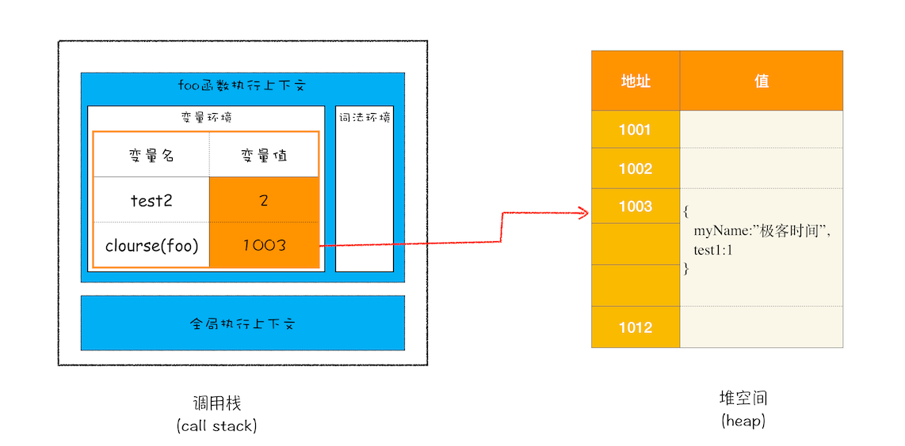
<br/>

从上图你可以清晰地看出，当执行到 foo 函数时，闭包就产生了；

当 foo 函数执行结束之后，返回的 getName 和 setName 方法都引用“clourse(foo)”对象，所以即使 foo 函数退出了，“clourse(foo)”依然被其内部的 getName 和 setName 方法引用。

所以在下次调用bar.setName或者bar.getName时，创建的执行上下文中就包含了“clourse(foo)”。

总的来说，产生闭包的核心有两步：第一步是需要预扫描内部函数；第二步是把内部函数引用的外部变量保存到堆中。

<br>

## 13丨垃圾回收：垃圾数据是如何自动回收的？

我们知道了，原始数据类型是存储在栈空间中的，引用类型的数据是存储在堆空间中的。

通过这种分配方式，我们解决了数据的内存分配的问题。

不过有些数据被使用之后，可能就不再需要了，我们把这种数据称为垃圾数据。

如果这些垃圾数据一直保存在内存中，那么内存会越用越多，所以我们需要对这些垃圾数据进行回收，以释放有限的内存空间。

### 不同语言的垃圾回收策略

通常情况下，垃圾数据回收分为手动回收和自动回收两种策略。

C/C++是手动回收，JS是自动回收，产生的垃圾数据是由垃圾回收器来释放的

我们知道了JS有栈数据跟堆数据，接下来就来分别介绍“栈中的垃圾数据”和“堆中的垃圾数据”是如何回收的

### 调用栈中的数据是如何回收的

```js
function foo(){
    var a = 1
    var b = {name:" 极客邦 "}
    function showName(){
      var c = " 极客时间 "
      var d = {name:" 极客时间 "}
    }
    showName()
}
foo()
```

<br/>
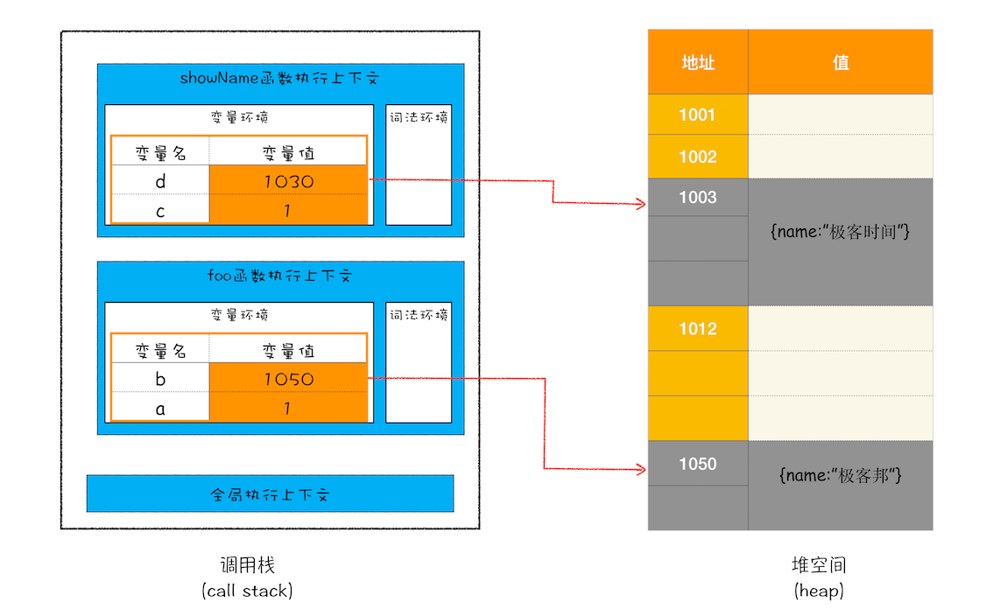
<br/>

执行到 showName 函数时，那么 JavaScript 引擎会创建 showName 函数的执行上下文，并将 showName 函数的执行上下文压入到调用栈中，最终执行到 showName 函数时，其调用栈就如上图所示。

与此同时，还有一个记录当前执行状态的指针（称为 ESP），指向调用栈中 showName 函数的执行上下文，表示当前正在执行 showName 函数。

接着，当 showName 函数执行完成之后，函数执行流程就进入了 foo 函数，那这时就需要销毁 showName 函数的执行上下文了。

ESP 这时候就帮上忙了，JavaScript 会将 ESP 下移到 foo 函数的执行上下文，这个下移操作就是销毁 showName 函数执行上下文的过程。

<br/>

<br/>

从图中可以看出，当 showName 函数执行结束之后，ESP 向下移动到 foo 函数的执行上下文中，上面 showName 的执行上下文虽然保存在栈内存中，但是已经是无效内存了。

比如当 foo 函数再次调用另外一个函数时，这块内容会被直接覆盖掉，用来存放另外一个函数的执行上下文。

所以说，当一个函数执行结束之后，JavaScript 引擎会通过向下移动 ESP 来销毁该函数保存在栈中的执行上下文。

### 堆中的数据是如何回收的

当上面那段代码的 foo 函数执行结束之后，ESP 应该是指向全局执行上下文的，那这样的话，showName 函数和 foo 函数的执行上下文就处于无效状态了，不过保存在堆中的两个对象依然占用着空间，如下图所示：

<br/>
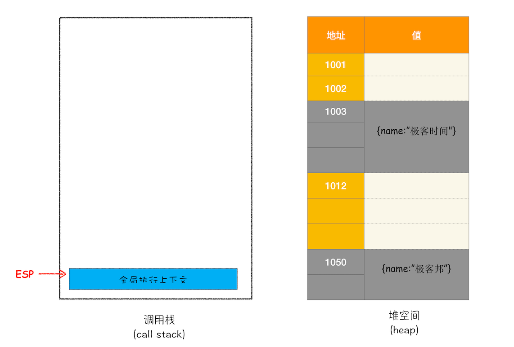
<br/>

要回收堆中的垃圾数据，就需要用到 JavaScript 中的垃圾回收器了。

所以，接下来我们就来通过 Chrome 的 JavaScript 引擎 V8 来分析下堆中的垃圾数据是如何回收的。

#### 代际假说和分代收集

代际假说有以下两个特点：

- 第一个是大部分对象在内存中存在的时间很短，简单来说，就是很多对象一经分配内存，很快就变得不可访问；
- 第二个是不死的对象，会活得更久。

有了代际假说的基础，我们就可以来探讨 V8 是如何实现垃圾回收的了。

通常，垃圾回收算法有很多种，但是并没有哪一种能胜任所有的场景，你需要权衡各种场景，根据对象的生存周期的不同而使用不同的算法，以便达到最好的效果。

所以，在 V8 中会把堆分为新生代和老生代两个区域，新生代中存放的是生存时间短的对象，老生代中存放的生存时间久的对象。

新生区通常只支持 1～8M 的容量，而老生区支持的容量就大很多了。对于这两块区域，V8 分别使用两个不同的垃圾回收器，以便更高效地实施垃圾回收。

- 副垃圾回收器，主要负责新生代的垃圾回收。
- 主垃圾回收器，主要负责老生代的垃圾回收。

#### 垃圾回收器的工作流程

V8 把堆分成两个区域——新生代和老生代，并分别使用两个不同的垃圾回收器。

其实不论什么类型的垃圾回收器，它们都有一套共同的执行流程。

第一步是标记空间中活动对象和非活动对象。所谓活动对象就是还在使用的对象，非活动对象就是可以进行垃圾回收的对象。

第二步是回收非活动对象所占据的内存。其实就是在所有的标记完成之后，统一清理内存中所有被标记为可回收的对象。

第三步是做内存整理。

那么接下来，我们就按照这个流程来分析新生代垃圾回收器（副垃圾回收器）和老生代垃圾回收器（主垃圾回收器）是如何处理垃圾回收的。

#### 副垃圾回收器

副垃圾回收器主要负责新生区的垃圾回收。而通常情况下，大多数小的对象都会被分配到新生区，所以说这个区域虽然不大，但是垃圾回收还是比较频繁的。

新生代中用Scavenge 算法来处理。所谓 Scavenge 算法，是把新生代空间对半划分为两个区域，一半是对象区域，一半是空闲区域，如下图所示：

<br/>
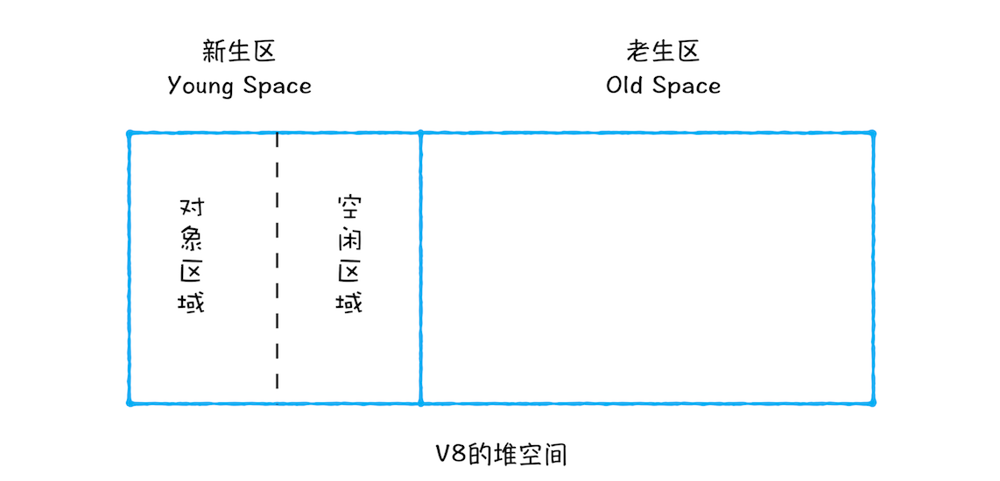
<br/>

新加入的对象都会存放到对象区域，当对象区域快被写满时，就需要执行一次垃圾清理操作。

在垃圾回收过程中，首先要对对象区域中的垃圾做标记；标记完成之后，就进入垃圾清理阶段，副垃圾回收器会把这些存活的对象复制到空闲区域中，同时它还会把这些对象有序地排列起来，所以这个复制过程，也就相当于完成了内存整理操作，复制后空闲区域就没有内存碎片了。

完成复制后，对象区域与空闲区域进行角色翻转，也就是原来的对象区域变成空闲区域，原来的空闲区域变成了对象区域。这样就完成了垃圾对象的回收操作，同时这种角色翻转的操作还能让新生代中的这两块区域无限重复使用下去。

由于新生代中采用的 Scavenge 算法，所以每次执行清理操作时，都需要将存活的对象从对象区域复制到空闲区域。但复制操作需要时间成本，如果新生区空间设置得太大了，那么每次清理的时间就会过久，所以为了执行效率，一般新生区的空间会被设置得比较小。

也正是因为新生区的空间不大，所以很容易被存活的对象装满整个区域。为了解决这个问题，JavaScript 引擎采用了对象晋升策略，也就是经过两次垃圾回收依然还存活的对象，会被移动到老生区中。

#### 主垃圾回收器

主垃圾回收器主要负责老生区中的垃圾回收。除了新生区中晋升的对象，一些大的对象会直接被分配到老生区。因此老生区中的对象有两个特点，一个是对象占用空间大，另一个是对象存活时间长。

由于老生区的对象比较大，若要在老生区中使用 Scavenge 算法进行垃圾回收，复制这些大的对象将会花费比较多的时间，从而导致回收执行效率不高，同时还会浪费一半的空间。因而，主垃圾回收器是采用标记 - 清除（Mark-Sweep）的算法进行垃圾回收的。下面我们来看看该算法是如何工作的。

首先是标记过程阶段。标记阶段就是从一组根元素开始，递归遍历这组根元素，在这个遍历过程中，能到达的元素称为活动对象，没有到达的元素就可以判断为垃圾数据。

比如最开始的那段代码，当 showName 函数执行退出之后，这段代码的调用栈和堆空间如下图所示：

<br/>
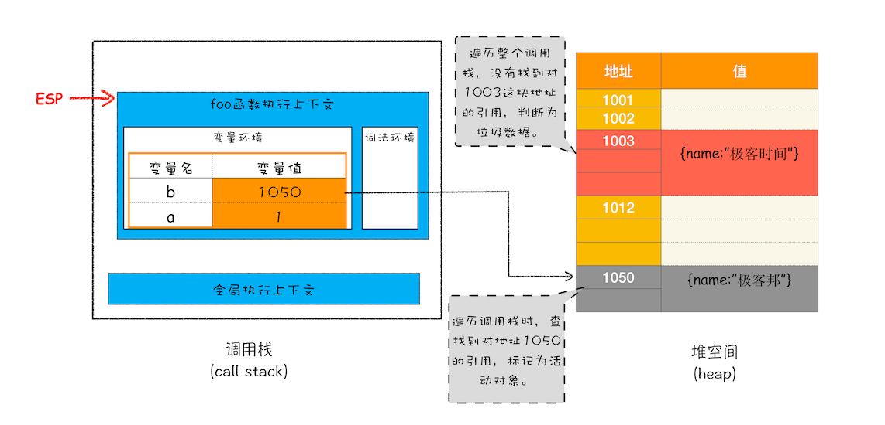
<br/>

从上图你可以大致看到垃圾数据的标记过程，当 showName 函数执行结束之后，ESP 向下移动，指向了 foo 函数的执行上下文，这时候如果遍历调用栈，是不会找到引用 1003 地址的变量，也就意味着 1003 这块数据为垃圾数据，被标记为红色。由于 1050 这块数据被变量 b 引用了，所以这块数据会被标记为活动对象。这就是大致的标记过程。

接下来就是垃圾的清除过程。它和副垃圾回收器的垃圾清除过程完全不同，你可以理解这个过程是清除掉红色标记数据的过程，可参考下图大致理解下其清除过程：

<br/>
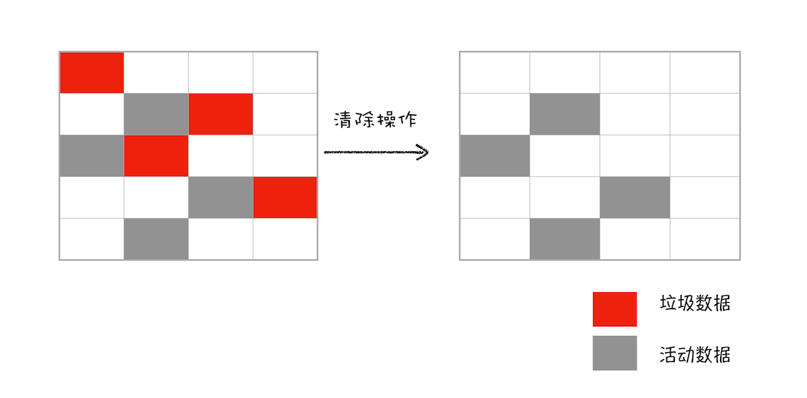
<br/>

上面的标记过程和清除过程就是标记 - 清除算法，不过对一块内存多次执行标记 - 清除算法后，会产生大量不连续的内存碎片。

而碎片过多会导致大对象无法分配到足够的连续内存，于是又产生了另外一种算法——标记 - 整理（Mark-Compact），这个标记过程仍然与标记 - 清除算法里的是一样的，但后续步骤不是直接对可回收对象进行清理，而是让所有存活的对象都向一端移动，然后直接清理掉端边界以外的内存。你可以参考下图：

<br/>

<br/>

#### 全停顿

现在你知道了 V8 是使用副垃圾回收器和主垃圾回收器处理垃圾回收的，不过由于 JavaScript 是运行在主线程之上的，一旦执行垃圾回收算法，都需要将正在执行的 JavaScript 脚本暂停下来，待垃圾回收完毕后再恢复脚本执行。我们把这种行为叫做全停顿（Stop-The-World）。

比如堆中的数据有 1.5GB，V8 实现一次完整的垃圾回收需要 1 秒以上的时间，这也是由于垃圾回收而引起 JavaScript 线程暂停执行的时间，若是这样的时间花销，那么应用的性能和响应能力都会直线下降。主垃圾回收器执行一次完整的垃圾回收流程如下图所示：

<br/>
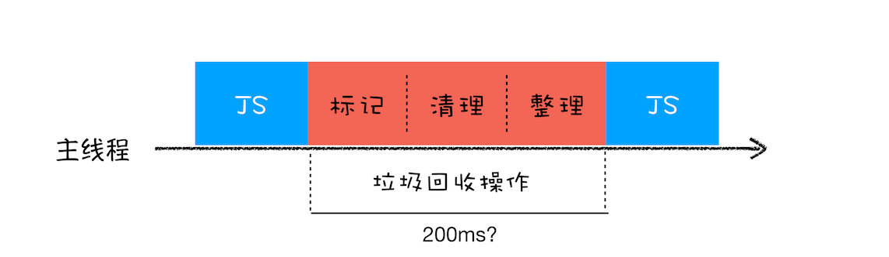
<br/>

在 V8 新生代的垃圾回收中，因其空间较小，且存活对象较少，所以全停顿的影响不大，但老生代就不一样了。如果在执行垃圾回收的过程中，占用主线程时间过久，就像上面图片展示的那样，花费了 200 毫秒，在这 200 毫秒内，主线程是不能做其他事情的。比如页面正在执行一个 JavaScript 动画，因为垃圾回收器在工作，就会导致这个动画在这 200 毫秒内无法执行的，这将会造成页面的卡顿现象。

为了降低老生代的垃圾回收而造成的卡顿，V8 将标记过程分为一个个的子标记过程，同时让垃圾回收标记和 JavaScript 应用逻辑交替进行，直到标记阶段完成，我们把这个算法称为增量标记（Incremental Marking）算法。如下图所示：

<br/>
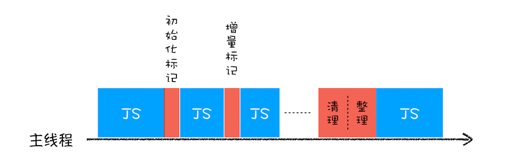
<br/>

使用增量标记算法，可以把一个完整的垃圾回收任务拆分为很多小的任务，这些小的任务执行时间比较短，可以穿插在其他的 JavaScript 任务中间执行，这样当执行上述动画效果时，就不会让用户因为垃圾回收任务而感受到页面的卡顿了。

<br>

## 14丨编译器和解释器：V8是如何执行一段JavaScript代码的？

V8 执行机制，能帮助你从底层了解 JavaScript，也能帮助你深入理解语言转换器 Babel、语法检查工具 ESLint、前端框架 Vue 和 React 的一些底层实现机制。

因此，了解 V8 的编译流程能让你对语言以及相关工具有更加充分的认识。

要深入理解 V8 的工作原理，你需要搞清楚一些概念和原理，比如接下来我们要详细讲解的编译器（Compiler）、解释器（Interpreter）、抽象语法树（AST）、字节码（Bytecode）、即时编译器（JIT）等概念，都是你需要重点关注的。

### 编译器和解释器

之所以存在编译器和解释器，是因为机器不能直接理解我们所写的代码，所以在执行程序之前，需要将我们所写的代码“翻译”成机器能读懂的机器语言。

按语言的执行流程，可以把语言划分为编译型语言和解释型语言。

编译型语言在程序执行之前，需要经过编译器的编译过程，并且编译之后会直接保留机器能读懂的二进制文件，这样每次运行程序时，都可以直接运行该二进制文件，而不需要再次重新编译了。比如 C/C++、GO 等都是编译型语言。

而由解释型语言编写的程序，在每次运行时都需要通过解释器对程序进行动态解释和执行。比如 Python、JavaScript 等都属于解释型语言。

<br/>
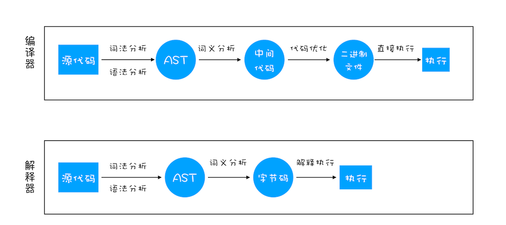
<br/>

从图中你可以看出这二者的执行流程，大致可阐述为如下：

- 在编译型语言的编译过程中，编译器首先会依次对源代码进行词法分析、语法分析，生成抽象语法树（AST），然后是优化代码，最后再生成处理器能够理解的机器码。如果编译成功，将会生成一个可执行的文件。但如果编译过程发生了语法或者其他的错误，那么编译器就会抛出异常，最后的二进制文件也不会生成成功。
- 在解释型语言的解释过程中，同样解释器也会对源代码进行词法分析、语法分析，并生成抽象语法树（AST），不过它会再基于抽象语法树生成字节码，最后再根据字节码来执行程序、输出结果。

### V8 是如何执行一段 JavaScript 代码的

通过上面的介绍，相信你已经了解编译器和解释器了。那接下来，我们就重点分析下 V8 是如何执行一段 JavaScript 代码的。你可以先来“一览全局”，参考下图：

<br/>
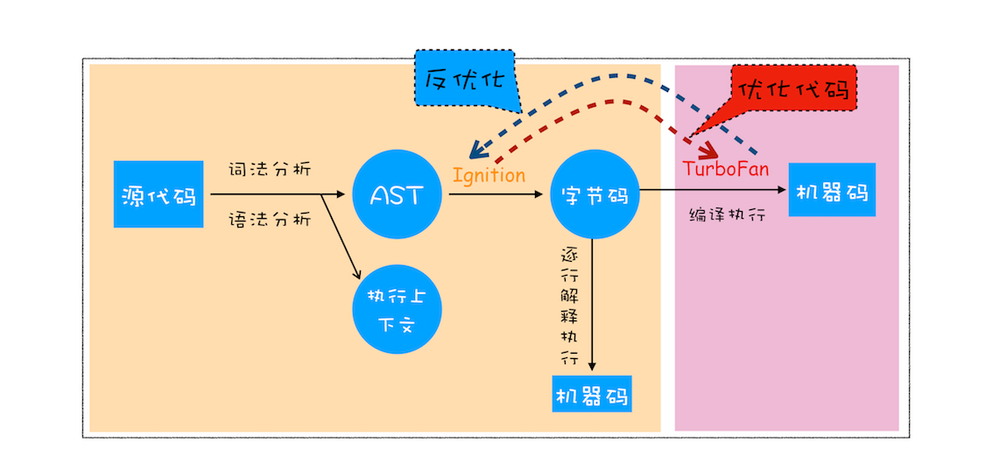
<br/>

从图中可以清楚地看到，V8 在执行过程中既有解释器 Ignition，又有编译器 TurboFan，那么它们是如何配合去执行一段 JavaScript 代码的呢?

下面我们就按照上图来一一分解其执行流程。

#### 1. 生成抽象语法树（AST）和执行上下文

重点讲解下抽象语法树

高级语言是开发者可以理解的语言，但是让编译器或者解释器来理解就非常困难了。

对于编译器或者解释器来说，它们可以理解的就是 AST 了。

所以无论你使用的是解释型语言还是编译型语言，在编译过程中，它们都会生成一个 AST。

你可以结合下面这段代码来直观地感受下什么是 AST：

```js
var myName = " 极客时间 "
function foo(){
  return 23;
}
myName = "geektime"
foo()
```

这段代码经过[javascript-ast](https://resources.jointjs.com/demos/javascript-ast)站点处理后，生成的 AST 结构如下：

<br/>
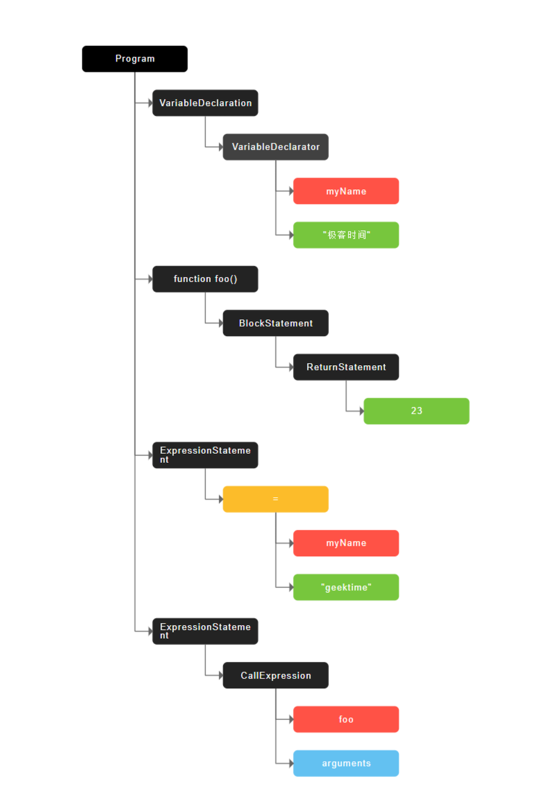
<br/>

从图中可以看出，AST 的结构和代码的结构非常相似，其实你也可以把 AST 看成代码的结构化的表示，编译器或者解释器后续的工作都需要依赖于 AST，而不是源代码。

AST 是非常重要的一种数据结构，在很多项目中有着广泛的应用。

其中最著名的一个项目是 Babel。

Babel 是一个被广泛使用的代码转码器，可以将 ES6 代码转为 ES5 代码，这意味着你可以现在就用 ES6 编写程序，而不用担心现有环境是否支持 ES6。

Babel 的工作原理就是先将 ES6 源码转换为 AST，然后再将 ES6 语法的 AST 转换为 ES5 语法的 AST，最后利用 ES5 的 AST 生成 JavaScript 源代码。

除了 Babel 外，还有 ESLint 也使用 AST。

ESLint 是一个用来检查 JavaScript 编写规范的插件，其检测流程也是需要将源码转换为 AST，然后再利用 AST 来检查代码规范化的问题。

现在你知道了什么是 AST 以及它的一些应用，那接下来我们再来看下 AST 是如何生成的。通常，生成 AST 需要经过两个阶段。

第一阶段是分词（tokenize），又称为词法分析，其作用是将一行行的源码拆解成一个个 token。所谓token，指的是语法上不可能再分的、最小的单个字符或字符串。你可以参考下图来更好地理解什么 token。

<br/>

<br/>

从图中可以看出，通过var myName = “极客时间”简单地定义了一个变量，其中关键字“var”、标识符“myName” 、赋值运算符“=”、字符串“极客时间”四个都是 token，而且它们代表的属性还不一样。

第二阶段是解析（parse），又称为语法分析，其作用是将上一步生成的 token 数据，根据语法规则转为 AST。如果源码符合语法规则，这一步就会顺利完成。但如果源码存在语法错误，这一步就会终止，并抛出一个“语法错误”。

这就是 AST 的生成过程，先分词，再解析。

有了 AST 后，那接下来 V8 就会生成该段代码的执行上下文。至于执行上下文的具体内容，你可以参考前面几篇文章的讲解。

#### 2. 生成字节码

有了 AST 和执行上下文后，那接下来的第二步，解释器 Ignition 就登场了，它会根据 AST 生成字节码，并解释执行字节码。

其实一开始 V8 并没有字节码，而是直接将 AST 转换为机器码，由于执行机器码的效率是非常高效的，所以这种方式在发布后的一段时间内运行效果是非常好的。

但是随着 Chrome 在手机上的广泛普及，特别是运行在 512M 内存的手机上，内存占用问题也暴露出来了，因为 V8 需要消耗大量的内存来存放转换后的机器码。

为了解决内存占用问题，V8 团队大幅重构了引擎架构，引入字节码，并且抛弃了之前的编译器，最终花了将进四年的时间，实现了现在的这套架构。

那什么是字节码呢？为什么引入字节码就能解决内存占用问题呢？

字节码就是介于 AST 和机器码之间的一种代码。

但是与特定类型的机器码无关，字节码需要通过解释器将其转换为机器码后才能执行。

理解了什么是字节码，我们再来对比下高级代码、字节码和机器码，你可以参考下图：

<br/>
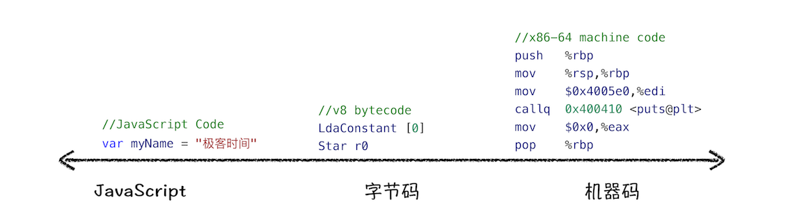
<br/>

从图中可以看出，机器码所占用的空间远远超过了字节码，所以使用字节码可以减少系统的内存使用。

#### 3. 执行代码

生成字节码之后，接下来就要进入执行阶段了。

通常，如果有一段第一次执行的字节码，解释器 Ignition 会逐条解释执行。

在执行字节码的过程中，如果发现有热点代码（HotSpot），比如一段代码被重复执行多次，这种就称为热点代码，那么后台的编译器 TurboFan 就会把该段热点的字节码编译为高效的机器码，然后当再次执行这段被优化的代码时，只需要执行编译后的机器码就可以了，这样就大大提升了代码的执行效率。

V8 的解释器和编译器的取名也很有意思。

解释器 Ignition 是点火器的意思，编译器 TurboFan 是涡轮增压的意思，寓意着代码启动时通过点火器慢慢发动，一旦启动，涡轮增压介入，其执行效率随着执行时间越来越高效率，因为热点代码都被编译器 TurboFan 转换了机器码，直接执行机器码就省去了字节码“翻译”为机器码的过程。

其实字节码配合解释器和编译器是最近一段时间很火的技术，比如 Java 和 Python 的虚拟机也都是基于这种技术实现的，我们把这种技术称为即时编译（JIT）。

具体到 V8，就是指解释器 Ignition 在解释执行字节码的同时，收集代码信息，当它发现某一部分代码变热了之后，TurboFan 编译器便闪亮登场，把热点的字节码转换为机器码，并把转换后的机器码保存起来，以备下次使用。

对于 JavaScript 工作引擎，除了 V8 使用了“字节码 +JIT”技术之外，苹果的 SquirrelFish Extreme 和 Mozilla 的 SpiderMonkey 也都使用了该技术。

这么多语言的工作引擎都使用了“字节码 +JIT”技术，因此理解 JIT 这套工作机制还是很有必要的。你可以结合下图看看 JIT 的工作过程：

<br/>
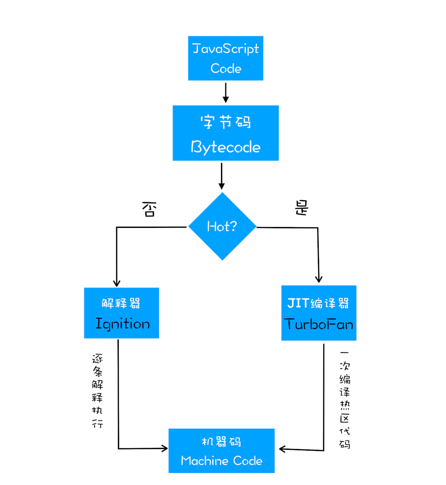
<br/>

### JavaScript 的性能优化

到这里相信你现在已经了解 V8 是如何执行一段 JavaScript 代码的了。在过去几年中，JavaScript 的性能得到了大幅提升，这得益于 V8 团队对解释器和编译器的不断改进和优化。

虽然在 V8 诞生之初，也出现过一系列针对 V8 而专门优化 JavaScript 性能的方案，比如隐藏类、内联缓存等概念都是那时候提出来的。不过随着 V8 的架构调整，你越来越不需要这些微优化策略了，相反，对于优化 JavaScript 执行效率，你应该将优化的中心聚焦在单次脚本的执行时间和脚本的网络下载上，主要关注以下三点内容：

- 提升单次脚本的执行速度，避免 JavaScript 的长任务霸占主线程，这样可以使得页面快速响应交互；
- 避免大的内联脚本，因为在解析 HTML 的过程中，解析和编译也会占用主线程；
- 减少 JavaScript 文件的容量，因为更小的文件会提升下载速度，并且占用更低的内存。

<br>

# 浏览器中的页面循环系统

## 15丨消息队列和事件循环：页面是怎么“活”起来的？

每个渲染进程都有一个主线程，并且主线程非常繁忙，既要处理 DOM，又要计算样式，还要处理布局，同时还需要处理 JavaScript 任务以及各种输入事件。

要让这么多不同类型的任务在主线程中有条不紊地执行，这就需要一个系统来统筹调度这些任务，这个统筹调度系统就是我们今天要讲的**消息队列和事件循环系统**。

为了能让你更加深刻地理解事件循环机制，我们就从最简单的场景来分析，然后带你一步步了解浏览器页面主线程是如何运作的。

### 第一版线程模型

如果有一些确定好的任务，可以使用一个单线程来按照顺序处理这些任务，这是第一版线程模型。

```c
void MainThread(){
  int num1 = 1+2; // 任务 1
  int num2 = 20/5; // 任务 2
  int num3 = 7*8; // 任务 3
  print(" 最终计算的值为:%d,%d,%d",num,num2,num3)； // 任务 4
}
```

<br/>
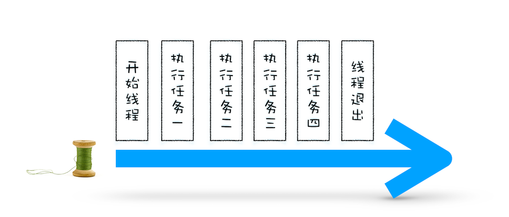
<br/>

### 第二版线程模型

要在线程执行过程中接收并处理新的任务，就需要采用事件循环机制，也就是要引入循环语句和事件系统，这是第二版线程模型。

```c
//GetInput
// 等待用户从键盘输入一个数字，并返回该输入的数字
int GetInput(){
  int input_number = 0;
  cout<<" 请输入一个数:";
  cin>>input_number;
  return input_number;
}

// 主线程 (Main Thread)
void MainThread(){
  for(;;){
    int first_num = GetInput()；
    int second_num = GetInput()；
    result_num = first_num + second_num;
    print(" 最终计算的值为:%d",result_num)；
  }
}
```

相较于第一版的线程，这一版的线程做了两点改进。

- 第一点引入了循环机制，具体实现方式是在线程语句最后添加了一个for 循环语句，线程会一直循环执行。
- 第二点是引入了事件，可以在线程运行过程中，等待用户输入的数字，等待过程中线程处于暂停状态，一旦接收到用户输入的信息，那么线程会被激活，然后执行相加运算，最后输出结果。

<br/>

<br/>

### 第三版线程模型

如果要接收其他线程发送过来的任务，就需要引入消息队列，这是第三版线程模型。

<br/>
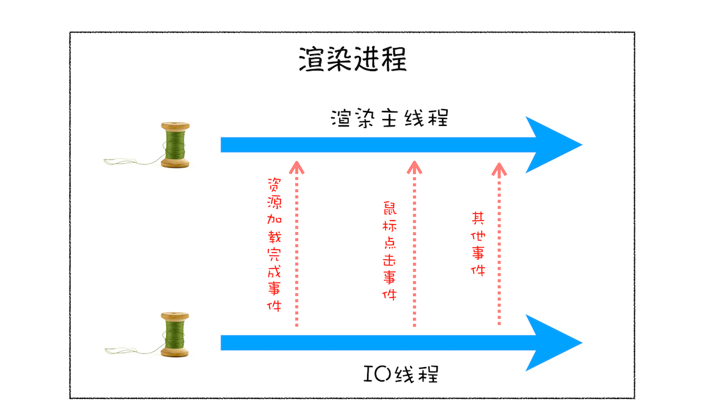
<br/>

从上图可以看出，渲染主线程会频繁接收到来自于 IO 线程的一些任务，接收到这些任务之后，渲染进程就需要着手处理，比如接收到资源加载完成的消息后，渲染进程就要着手进行 DOM 解析了；接收到鼠标点击的消息后，渲染主线程就要开始执行相应的 JavaScript 脚本来处理该点击事件。

那么如何设计好一个线程模型，能让其能够接收其他线程发送的消息呢？

一个通用模式是使用消息队列。在解释如何实现之前，我们先说说什么是消息队列，可以参考下图：

<br/>
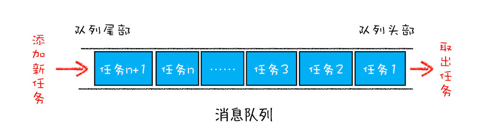
<br/>

从图中可以看出，消息队列是一种数据结构，可以存放要执行的任务。它符合队列“先进先出”的特点，也就是说要添加任务的话，添加到队列的尾部；要取出任务的话，从队列头部去取。

有了队列之后，我们就可以继续改造线程模型了，改造方案如下图所示：

<br/>
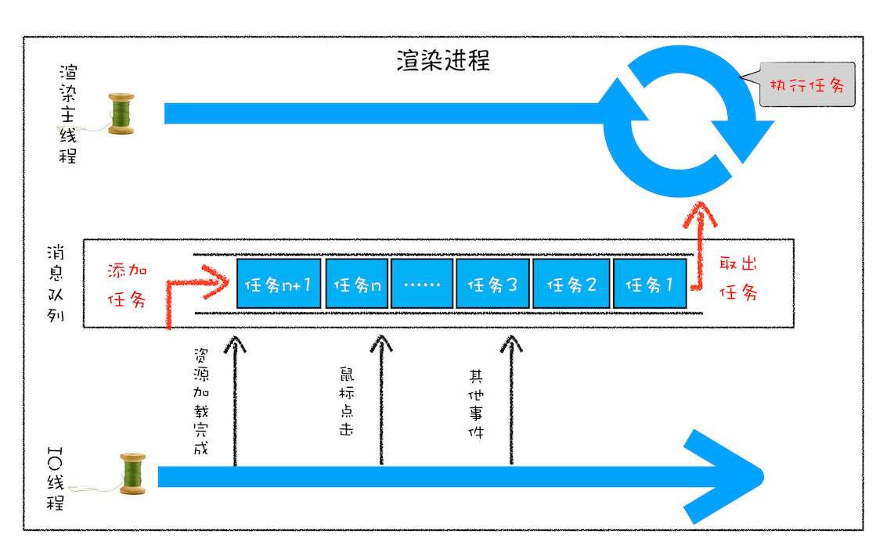
<br/>

从上图可以看出，我们的改造可以分为下面三个步骤：

- 添加一个消息队列；
- IO 线程中产生的新任务添加进消息队列尾部；
- 渲染主线程会循环地从消息队列头部中读取任务，执行任务。

### 处理其他进程发送过来的任务

如果其他进程想要发送任务给页面主线程，那么先通过 IPC 把任务发送给渲染进程的 IO 线程，IO 线程再把任务发送给页面主线程。

<br/>
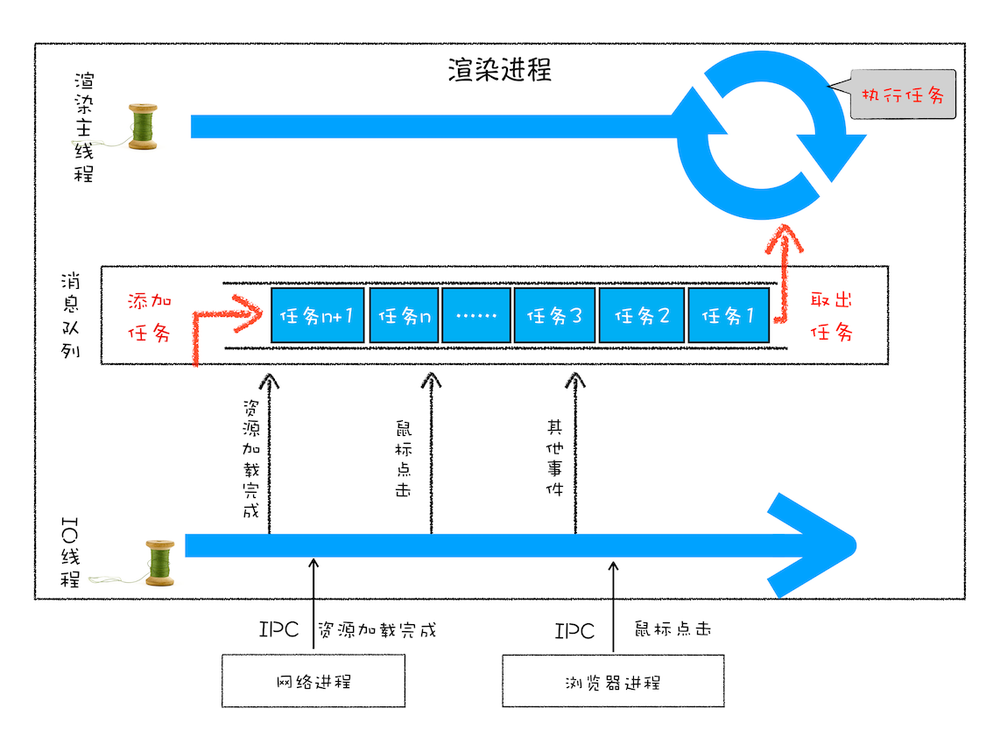
<br/>

### 页面使用单线程的缺点

页面线程所有执行的任务都来自于消息队列。消息队列是“先进先出”的属性，也就是说放入队列中的任务，需要等待前面的任务被执行完，才会被执行。鉴于这个属性，就有如下两个问题需要解决。

**第一个问题是如何处理高优先级的任务。**

比如监控 DOM 节点的变化情况。

如果每次发生变化的时候，都直接调用相应的 JavaScript 接口，那么这个当前的任务执行时间会被拉长，从而导致执行效率的下降。

如果将这些 DOM 变化做成异步的消息事件，添加到消息队列的尾部，那么又会影响到监控的实时性，因为在添加到消息队列的过程中，可能前面就有很多任务在排队了。

这也就是说，如果 DOM 发生变化，采用同步通知的方式，会影响当前任务的执行效率；如果采用异步方式，又会影响到监控的实时性。

那该如何权衡效率和实时性呢？

针对这种情况，微任务就应用而生了，下面我们来看看微任务是如何权衡效率和实时性的。

通常我们把消息队列中的任务称为宏任务，每个宏任务中都包含了一个微任务队列，在执行宏任务的过程中，如果 DOM 有变化，那么就会将该变化添加到微任务列表中，这样就不会影响到宏任务的继续执行，因此也就解决了执行效率的问题。

等宏任务中的主要功能都直接完成之后，这时候，渲染引擎并不着急去执行下一个宏任务，而是执行当前宏任务中的微任务，因为 DOM 变化的事件都保存在这些微任务队列中，这样也就解决了实时性问题。

**第二个是如何解决单个任务执行时长过久的问题。**

<br/>
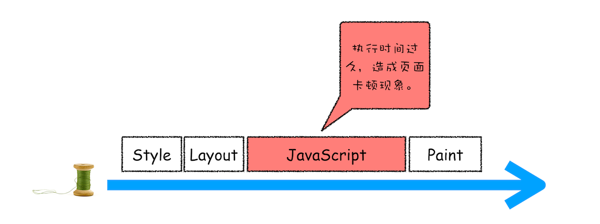
<br/>

从图中你可以看到，如果在执行动画过程中，其中有个 JavaScript 任务因执行时间过久，占用了动画单帧的时间，这样会给用户制造了卡顿的感觉，这当然是极不好的用户体验。

针对这种情况，JavaScript 可以通过回调功能来规避这种问题，也就是让要执行的 JavaScript 任务滞后执行。至于浏览器是如何实现回调功能的，我们在后面的章节中再详细介绍。

<br>

## 16丨WebAPI：setTimeout是如何实现的？

### 浏览器怎么实现 setTimeout

渲染进程中所有运行在主线程上的任务都需要先添加到消息队列，然后事件循环系统再按照顺序执行消息队列中的任务。

所以说要执行一段异步任务，需要先将任务添加到消息队列中。

不过通过定时器设置回调函数有点特别，它们需要在指定的时间间隔内被调用，但消息队列中的任务是按照顺序执行的，所以为了保证回调函数能在指定时间内执行，你不能将定时器的回调函数直接添加到消息队列中。

在 Chrome 中除了正常使用的消息队列之外，还有另外一个消息队列，这个队列中维护了需要延迟执行的任务列表，包括了定时器和 Chromium 内部一些需要延迟执行的任务。

所以当通过 JavaScript 创建一个定时器时，渲染进程会将该定时器的回调任务添加到延迟队列中。

Chrome 源码中有一个ProcessDelayTask 函数，该函数是专门用来处理延迟执行任务的。

处理完消息队列中的一个任务之后，就开始执行 ProcessDelayTask 函数。

ProcessDelayTask 函数会根据发起时间和延迟时间计算出到期的任务，然后依次执行这些到期的任务。等到期的任务执行完成之后，再继续下一个循环过程。

通过这样的方式，一个完整的定时器就实现了。

设置一个定时器，JavaScript 引擎会返回一个定时器的 ID。那通常情况下，当一个定时器的任务还没有被执行的时候，也是可以取消的，具体方法是调用clearTimeout 函数

其实浏览器内部实现取消定时器的操作也是非常简单的，就是直接从延迟队列中，通过 ID 查找到对应的任务，然后再将其从队列中删除掉就可以了。

### 使用 setTimeout 的一些注意事项

1. 如果当前任务执行时间过久，会影延迟到期定时器任务的执行

2. 如果 setTimeout 存在嵌套调用，那么系统会设置最短时间间隔为 4 毫秒

```js
function cb() { setTimeout(cb, 0); }
setTimeout(cb, 0);
```

在 Chrome 中，定时器被嵌套调用 5 次以上，系统会判断该函数方法被阻塞了，如果定时器的调用时间间隔小于 4 毫秒，那么浏览器会将每次调用的时间间隔设置为 4 毫秒。

3. 未激活的页面，setTimeout 执行最小间隔是 1000 毫秒

也就是说，如果标签不是当前的激活标签，那么定时器最小的时间间隔是 1000 毫秒，目的是为了优化后台页面的加载损耗以及降低耗电量。这一点你在使用定时器的时候要注意。

4. 延时执行时间有最大值

Chrome、Safari、Firefox 都是以 32 个 bit 来存储延时值的，32bit 最大只能存放的数字是 2147483647 毫秒

这就意味着，如果 setTimeout 设置的延迟值大于 2147483647 毫秒（大约 24.8 天）时就会溢出，这导致定时器会被立即执行。

你可以运行下面这段代码：

```js
function showName(){
  console.log(" 极客时间 ")
}
var timerID = setTimeout(showName,2147483648);// 会被理解调用执行
```

5. 使用 setTimeout 设置的回调函数中的 this 不符合直觉

### 总结
好了，今天我们就介绍到这里，下面我来总结下今天的内容。

- 首先，为了支持定时器的实现，浏览器增加了延时队列。
- 其次，由于消息队列排队和一些系统级别的限制，通过 setTimeout 设置的回调任务并非总是可以实时地被执行，这样就不能满足一些实时性要求较高的需求了。
- 最后，在定时器中使用过程中，还存在一些陷阱，需要你多加注意。

<br>

## 17丨WebAPI：XMLHttpRequest是怎么实现的？

### 同步回调和异步回调

回调函数  是在主函数  返回之前执行的，我们把这个回调过程称为同步回调。

相对的，我们称之为异步回调，比如：

```js
let callback = function(){
    console.log('i am do homework')
}
function doWork(cb) {
    console.log('start do work')
    setTimeout(cb,1000)
    console.log('end do work')
}
doWork(callback)
```

站在消息循环的视角来看看同步回调和异步回调的区别。

我们已经知道浏览器页面是通过事件循环机制来驱动的，每个渲染进程都有一个消息队列，页面主线程按照顺序来执行消息队列中的事件，如执行 JavaScript 事件、解析 DOM 事件、计算布局事件、用户输入事件等等，如果页面有新的事件产生，那新的事件将会追加到事件队列的尾部。

所以可以说是消息队列和主线程循环机制保证了页面有条不紊地运行。

这里还需要补充一点，那就是当循环系统在执行一个任务的时候，都要为这个任务维护一个系统调用栈。

每个任务在执行过程中都有自己的调用栈，那么同步回调就是在当前主函数的上下文中执行回调函数，这个没有太多可讲的。

下面我们主要来看看异步回调过程，异步回调是指回调函数在主函数之外执行，一般有两种方式：

- 第一种是把异步函数做成一个任务，添加到信息队列尾部；
- 第二种是把异步函数添加到微任务队列中，这样就可以在当前任务的末尾处执行微任务了。

### XMLHttpRequest 运作机制

理解了什么是同步回调和异步回调，接下来我们就来分析 XMLHttpRequest 背后的实现机制，具体工作过程你可以参考下图：

<br/>
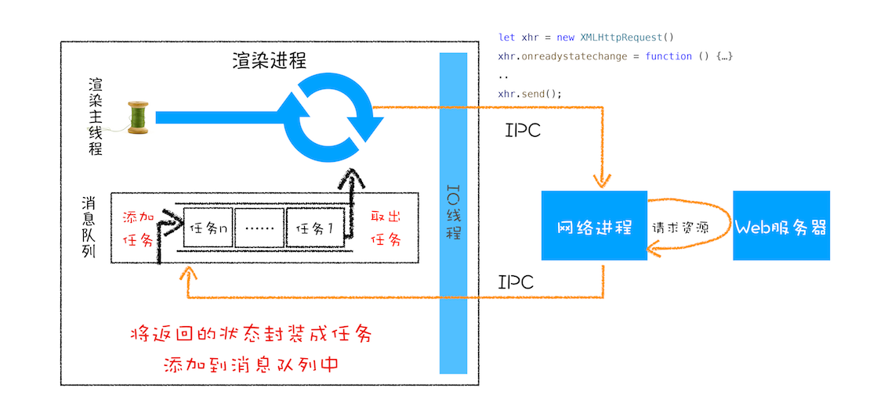
<br/>

对比上一篇文章，setTimeout 是直接将延迟任务添加到延迟队列中，而 XMLHttpRequest 发起请求，是由浏览器的其他进程或者线程去执行，然后再将执行结果利用 IPC 的方式通知渲染进程，之后渲染进程再将对应的消息添加到消息队列中。如果你搞懂了 setTimeout 和 XMLHttpRequest 的工作机制后，再来理解其他 WebAPI 就会轻松很多了，因为大部分 WebAPI 的工作逻辑都是类似的。

<br>

## 18丨宏任务和微任务：不是所有任务都是一个待遇

消息队列中这种粗时间颗粒度的任务已经不能胜任部分领域的需求，所以又出现了一种新的技术——微任务。微任务可以在实时性和效率之间做一个有效的权衡。

### 宏任务

页面中的大部分任务都是在主线程上执行的，这些任务包括了：

- 渲染事件（如解析 DOM、计算布局、绘制）；
- 用户交互事件（如鼠标点击、滚动页面、放大缩小等）；
- JavaScript 脚本执行事件；
- 网络请求完成、文件读写完成事件。

为了协调这些任务有条不紊地在主线程上执行，页面进程引入了消息队列和事件循环机制，渲染进程内部会维护多个消息队列，比如延迟执行队列和普通的消息队列。

然后主线程采用一个 for 循环，不断地从这些任务队列中取出任务并执行任务。

我们把这些消息队列中的任务称为宏任务。

宏任务可以满足我们大部分的日常需求，不过如果有对时间精度要求较高的需求，宏任务就难以胜任了，下面我们就来分析下为什么宏任务难以满足对时间精度要求较高的任务。

前面我们说过，页面的渲染事件、各种 IO 的完成事件、执行 JavaScript 脚本的事件、用户交互的事件等都随时有可能被添加到消息队列中，而且添加事件是由系统操作的，JavaScript 代码不能准确掌控任务要添加到队列中的位置，控制不了任务在消息队列中的位置，所以很难控制开始执行任务的时间。

为了直观理解，你可以看下面这段代码：

```html
<!DOCTYPE html>
<html>
    <body>
        <div id='demo'>
            <ol>
                <li>test</li>
            </ol>
        </div>
    </body>
    <script type="text/javascript">
        function timerCallback2(){
          console.log(2)
        }
        function timerCallback(){
            console.log(1)
            setTimeout(timerCallback2,0)
        }
        setTimeout(timerCallback,0)
    </script>
</html>
```

在这段代码中，我的目的是想通过 setTimeout 来设置两个回调任务，并让它们按照前后顺序来执行，中间也不要再插入其他的任务，因为如果这两个任务的中间插入了其他的任务，就很有可能会影响到第二个定时器的执行时间了。

但实际情况是我们不能控制的，比如在你调用 setTimeout 来设置回调任务的间隙，消息队列中就有可能被插入很多系统级的任务。你可以打开 Performance 工具，来记录下这段任务的执行过程，也可参考文中我记录的图片：

<br/>
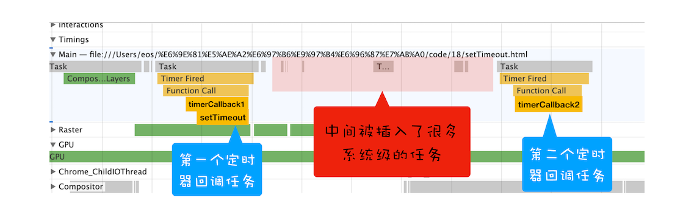
<br/>

所以说宏任务的时间粒度比较大，执行的时间间隔是不能精确控制的，对一些高实时性的需求就不太符合了，比如后面要介绍的监听 DOM 变化的需求。

### 微任务

在上一篇文章中，我们介绍过异步回调的概念，其主要有两种方式。

第一种是把异步回调函数封装成一个宏任务，添加到消息队列尾部，当循环系统执行到该任务的时候执行回调函数。这种比较好理解，我们前面介绍的 setTimeout 和 XMLHttpRequest 的回调函数都是通过这种方式来实现的。

第二种方式的执行时机是在主函数执行结束之后、当前宏任务结束之前执行回调函数，这通常都是以微任务形式体现的。

那这里说的微任务到底是什么呢？

微任务就是一个需要异步执行的函数，执行时机是在主函数执行结束之后、当前宏任务结束之前。

不过要搞清楚微任务系统是怎么运转起来的，就得站在 V8 引擎的层面来分析下。

我们知道当 JavaScript 执行一段脚本的时候，V8 会为其创建一个全局执行上下文，在创建全局执行上下文的同时，V8 引擎也会在内部创建一个微任务队列。顾名思义，这个微任务队列就是用来存放微任务的，因为在当前宏任务执行的过程中，有时候会产生多个微任务，这时候就需要使用这个微任务队列来保存这些微任务了。不过这个微任务队列是给 V8 引擎内部使用的，所以你是无法通过 JavaScript 直接访问的。

也就是说每个宏任务都关联了一个微任务队列。那么接下来，我们就需要分析两个重要的时间点——微任务产生的时机和执行微任务队列的时机。

我们先来看看微任务是怎么产生的？在现代浏览器里面，产生微任务有两种方式。

第一种方式是使用 MutationObserver 监控某个 DOM 节点，然后再通过 JavaScript 来修改这个节点，或者为这个节点添加、删除部分子节点，当 DOM 节点发生变化时，就会产生 DOM 变化记录的微任务。

第二种方式是使用 Promise，当调用 Promise.resolve() 或者 Promise.reject() 的时候，也会产生微任务。

通过 DOM 节点变化产生的微任务或者使用 Promise 产生的微任务都会被 JavaScript 引擎按照顺序保存到微任务队列中。

好了，现在微任务队列中有了微任务了，那接下来就要看看微任务队列是何时被执行的。

通常情况下，在当前宏任务中的 JavaScript 快执行完成时，也就在 JavaScript 引擎准备退出全局执行上下文并清空调用栈的时候，JavaScript 引擎会检查全局执行上下文中的微任务队列，然后按照顺序执行队列中的微任务。WHATWG 把执行微任务的时间点称为检查点。当然除了在退出全局执行上下文式这个检查点之外，还有其他的检查点，不过不是太重要，这里就不做介绍了。

如果在执行微任务的过程中，产生了新的微任务，同样会将该微任务添加到微任务队列中，V8 引擎一直循环执行微任务队列中的任务，直到队列为空才算执行结束。也就是说在执行微任务过程中产生的新的微任务并不会推迟到下个宏任务中执行，而是在当前的宏任务中继续执行。

为了直观地理解什么是微任务，你可以参考下面我画的示意图（由于内容比较多，我将其分为了两张）：

<br/>
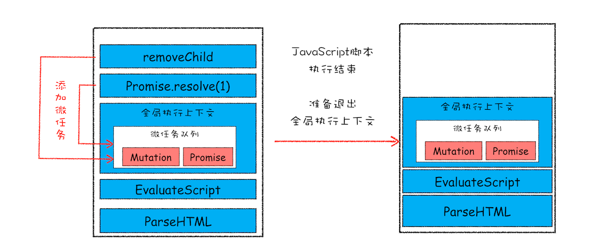
<br/>
<br/>
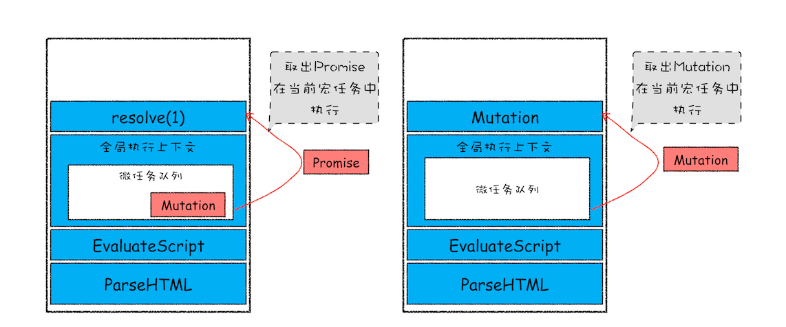
<br/>

该示意图是在执行一个 ParseHTML 的宏任务，在执行过程中，遇到了 JavaScript 脚本，那么就暂停解析流程，进入到 JavaScript 的执行环境。从图中可以看到，全局上下文中包含了微任务列表。

在 JavaScript 脚本的后续执行过程中，分别通过 Promise 和 removeChild 创建了两个微任务，并被添加到微任务列表中。接着 JavaScript 执行结束，准备退出全局执行上下文，这时候就到了检查点了，JavaScript 引擎会检查微任务列表，发现微任务列表中有微任务，那么接下来，依次执行这两个微任务。等微任务队列清空之后，就退出全局执行上下文。

以上就是微任务的工作流程，从上面分析我们可以得出如下几个结论：

- 微任务和宏任务是绑定的，每个宏任务在执行时，会创建自己的微任务队列。
- 微任务的执行时长会影响到当前宏任务的时长。比如一个宏任务在执行过程中，产生了 100 个微任务，执行每个微任务的时间是 10 毫秒，那么执行这 100 个微任务的时间就是 1000 毫秒，也可以说这 100 个微任务让宏任务的执行时间延长了 1000 毫秒。所以你在写代码的时候一定要注意控制微任务的执行时长。
- 在一个宏任务中，分别创建一个用于回调的宏任务和微任务，无论什么情况下，微任务都早于宏任务执行。

注：
MutationObserver 采用了“异步 + 微任务”的策略。

- 通过异步操作解决了同步操作的性能问题；
- 通过微任务解决了实时性的问题。

<br>

## 19丨Promise：使用Promise，告别回调函数

Promise 到底解决了什么问题呢？—— Promise 解决的是异步编码风格的问题

### 异步编程的问题：代码逻辑不连续

页面中任务都是执行在主线程之上，在执行一项耗时的任务时，比如下载网络文件任务、获取摄像头等设备信息任务，这些任务都会放到页面主线程之外的进程或者线程中去执行，这样就避免了耗时任务“霸占”页面主线程的情况。

你可以结合下图来看看这个处理过程：

<br/>
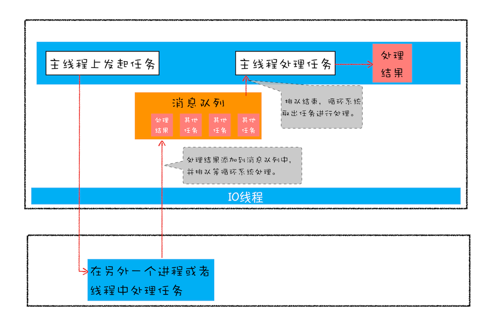
<br/>

上图展示的是一个标准的异步编程模型，页面主线程发起了一个耗时的任务，并将任务交给另外一个进程去处理，这时页面主线程会继续执行消息队列中的任务。等该进程处理完这个任务后，会将该任务添加到渲染进程的消息队列中，并排队等待循环系统的处理。排队结束之后，循环系统会取出消息队列中的任务进行处理，并触发相关的回调操作。

这就是页面编程的一大特点：异步回调。

Web 页面的单线程架构决定了异步回调，而异步回调影响到了我们的编码方式，到底是如何影响的呢？

假设有一个下载的需求，使用 XMLHttpRequest 来实现，具体的实现方式你可以参考下面这段代码：

```js
// 执行状态
function onResolve(response){console.log(response) }
function onReject(error){console.log(error) }

let xhr = new XMLHttpRequest()
xhr.ontimeout = function(e) { onReject(e)}
xhr.onerror = function(e) { onReject(e) }
xhr.onreadystatechange = function () { onResolve(xhr.response) }

// 设置请求类型，请求 URL，是否同步信息
let URL = 'https://time.geekbang.com'
xhr.open('Get', URL, true);

// 设置参数
xhr.timeout = 3000 // 设置 xhr 请求的超时时间
xhr.responseType = "text" // 设置响应返回的数据格式
xhr.setRequestHeader("X_TEST","time.geekbang")

// 发出请求
xhr.send();
```

我们执行上面这段代码，可以正常输出结果的。但是，这短短的一段代码里面竟然出现了五次回调，这么多的回调会导致代码的逻辑不连贯、不线性，非常不符合人的直觉，这就是异步回调影响到我们的编码方式。

那有什么方法可以解决这个问题吗？当然有，我们可以封装这堆凌乱的代码，降低处理异步回调的次数。

### 封装异步代码，让处理流程变得线性

由于我们重点关注的是输入内容（请求信息）和输出内容（回复信息），至于中间的异步请求过程，我们不想在代码里面体现太多，因为这会干扰核心的代码逻辑。整体思路如下图所示：

<br/>
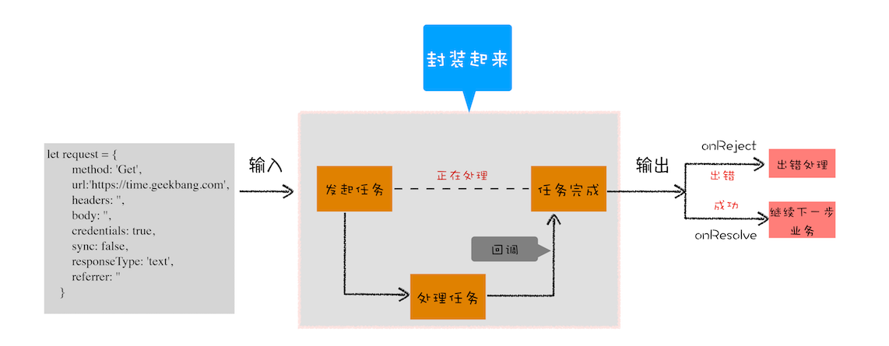
<br/>

从图中你可以看到，我们将 XMLHttpRequest 请求过程的代码封装起来了，重点关注输入数据和输出结果。

那我们就按照这个思路来改造代码。首先，我们把输入的 HTTP 请求信息全部保存到一个 request 的结构中，包括请求地址、请求头、请求方式、引用地址、同步请求还是异步请求、安全设置等信息。request 结构如下所示：

```js
//makeRequest 用来构造 request 对象
function makeRequest(request_url) {
    let request = {
        method: 'Get',
        url: request_url,
        headers: '',
        body: '',
        credentials: false,
        sync: true,
        responseType: 'text',
        referrer: ''
    }
    return request
}
```

然后就可以封装请求过程了，这里我们将所有的请求细节封装进 XFetch 函数，XFetch 代码如下所示：

```js
//[in] request，请求信息，请求头，延时值，返回类型等
//[out] resolve, 执行成功，回调该函数
//[out] reject  执行失败，回调该函数
function XFetch(request, resolve, reject) {
    let xhr = new XMLHttpRequest()
    xhr.ontimeout = function (e) { reject(e) }
    xhr.onerror = function (e) { reject(e) }
    xhr.onreadystatechange = function () {
        if (xhr.status = 200)
            resolve(xhr.response)
    }
    xhr.open(request.method, URL, request.sync);
    xhr.timeout = request.timeout;
    xhr.responseType = request.responseType;
    // 补充其他请求信息
    //...
    xhr.send();
}
```

这个 XFetch 函数需要一个 request 作为输入，然后还需要两个回调函数 resolve 和 reject，当请求成功时回调 resolve 函数，当请求出现问题时回调 reject 函数。

有了这些后，我们就可以来实现业务代码了，具体的实现方式如下所示：

```js
XFetch(makeRequest('https://time.geekbang.org'),
    function resolve(data) {
        console.log(data)
    }, function reject(e) {
        console.log(e)
    })
```

### 新的问题：回调地狱

如果嵌套了太多的回调函数就很容易使得自己陷入了回调地狱，不能自拔。你可以参考下面这段让人凌乱的代码：

```js
XFetch(makeRequest('https://time.geekbang.org/?category'),
      function resolve(response) {
          console.log(response)
          XFetch(makeRequest('https://time.geekbang.org/column'),
              function resolve(response) {
                  console.log(response)
                  XFetch(makeRequest('https://time.geekbang.org')
                      function resolve(response) {
                          console.log(response)
                      }, function reject(e) {
                          console.log(e)
                      })
              }, function reject(e) {
                  console.log(e)
              })
      }, function reject(e) {
          console.log(e)
      })
```

这段代码之所以看上去很乱，归结其原因有两点：

- 第一是嵌套调用，下面的任务依赖上个任务的请求结果，并在上个任务的回调函数内部执行新的业务逻辑，这样当嵌套层次多了之后，代码的可读性就变得非常差了。
- 第二是任务的不确定性，执行每个任务都有两种可能的结果（成功或者失败），所以体现在代码中就需要对每个任务的执行结果做两次判断，这种对每个任务都要进行一次额外的错误处理的方式，明显增加了代码的混乱程度。

原因分析出来后，那么问题的解决思路就很清晰了：

- 第一是消灭嵌套调用；
- 第二是合并多个任务的错误处理。

Promise 已经帮助我们解决了这两个问题。

### Promise：消灭嵌套调用和多次错误处理

首先，我们使用 Promise 来重构 XFetch 的代码，示例代码如下所示：

```js
function XFetch(request) {
  function executor(resolve, reject) {
      let xhr = new XMLHttpRequest()
      xhr.open('GET', request.url, true)
      xhr.ontimeout = function (e) { reject(e) }
      xhr.onerror = function (e) { reject(e) }
      xhr.onreadystatechange = function () {
          if (this.readyState === 4) {
              if (this.status === 200) {
                  resolve(this.responseText, this)
              } else {
                  let error = {
                      code: this.status,
                      response: this.response
                  }
                  reject(error, this)
              }
          }
      }
      xhr.send()
  }
  return new Promise(executor)
}
```

接下来，我们再利用 XFetch 来构造请求流程，代码如下：

```js
var x1 = XFetch(makeRequest('https://time.geekbang.org/?category'))
var x2 = x1.then(value => {
    console.log(value)
    return XFetch(makeRequest('https://www.geekbang.org/column'))
})
var x3 = x2.then(value => {
    console.log(value)
    return XFetch(makeRequest('https://time.geekbang.org'))
})
x3.catch(error => {
    console.log(error)
})
```

你可以观察上面这两段代码，重点关注下 Promise 的使用方式。

- 首先我们引入了 Promise，在调用 XFetch 时，会返回一个 Promise 对象。
- 构建 Promise 对象时，需要传入一个executor 函数，XFetch 的主要业务流程都在 executor 函数中执行。
- 如果运行在 excutor 函数中的业务执行成功了，会调用 resolve 函数；如果执行失败了，则调用 reject 函数。
- 在 excutor 函数中调用 resolve 函数时，会触发 promise.then 设置的回调函数；而调用 reject 函数时，会触发 promise.catch 设置的回调函数。

我们先来看看 Promise 是怎么消灭嵌套回调的。产生嵌套函数的一个主要原因是在发起任务请求时会带上回调函数，这样当任务处理结束之后，下个任务就只能在回调函数中来处理了。

Promise 主要通过下面两步解决嵌套回调问题的。

首先，Promise 实现了回调函数的延时绑定。回调函数的延时绑定在代码上体现就是先创建 Promise 对象 x1，通过 Promise 的构造函数 executor 来执行业务逻辑；创建好 Promise 对象 x1 之后，再使用 x1.then 来设置回调函数。示范代码如下：

```js
// 创建 Promise 对象 x1，并在 executor 函数中执行业务逻辑
function executor(resolve, reject){
    resolve(100)
}
let x1 = new Promise(executor)


//x1 延迟绑定回调函数 onResolve
function onResolve(value){
    console.log(value)
}
x1.then(onResolve)
```

其次，需要将回调函数 onResolve 的返回值穿透到最外层。

<br/>
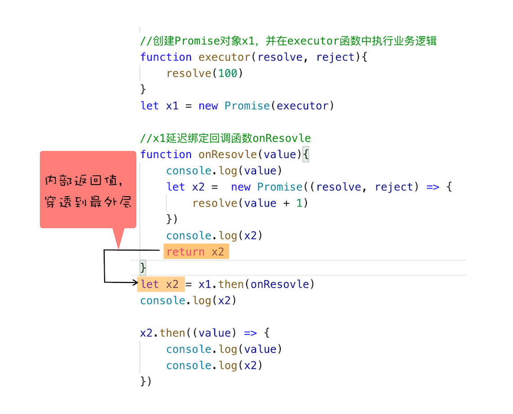
<br/>

现在我们知道了 Promise 通过回调函数延迟绑定和回调函数返回值穿透的技术，解决了循环嵌套。

那接下来我们再来看看 Promise 是怎么处理异常的

```js
function executor(resolve, reject) {
    let rand = Math.random();
    console.log(1)
    console.log(rand)
    if (rand > 0.5)
        resolve()
    else
        reject()
}
var p0 = new Promise(executor);

var p1 = p0.then((value) => {
    console.log("succeed-1")
    return new Promise(executor)
})

var p3 = p1.then((value) => {
    console.log("succeed-2")
    return new Promise(executor)
})

var p4 = p3.then((value) => {
    console.log("succeed-3")
    return new Promise(executor)
})

p4.catch((error) => {
    console.log("error")
})
console.log(2)
```

这段代码有四个 Promise 对象：p0～p4。无论哪个对象里面抛出异常，都可以通过最后一个对象 p4.catch 来捕获异常，通过这种方式可以将所有 Promise 对象的错误合并到一个函数来处理，这样就解决了每个任务都需要单独处理异常的问题。

之所以可以使用最后一个对象来捕获所有异常，是因为 Promise 对象的错误具有“冒泡”性质，会一直向后传递，直到被 onReject 函数处理或 catch 语句捕获为止。具备了这样“冒泡”的特性后，就不需要在每个 Promise 对象中单独捕获异常了。

### Promise 与微任务

我们可以结合下面这个简单的 Promise 代码来回答这个问题：

```js
function executor(resolve, reject) {
    resolve(100)
}
let demo = new Promise(executor)

function onResolve(value){
    console.log(value)
}
demo.then(onResolve)
```


## 20丨async-await：使用同步的方式去写异步代码

# 浏览器中的页面
## 21丨Chrome开发者工具：利用网络面板做性能分析
## 22丨DOM树：JavaScript是如何影响DOM树构建的？
## 23丨渲染流水线：CSS如何影响首次加载时的白屏时间？
## 24丨分层和合成机制：为什么CSS动画比JavaScript高效？
## 25丨页面性能：如何系统地优化页面？
## 26丨虚拟DOM：虚拟DOM和实际的DOM有何不同？
## 27丨渐进式网页应用（PWA）：它究竟解决了Web应用的哪些问题？
## 28丨WebComponent：像搭积木一样构建Web应用

# 浏览器中的网络
## 29丨HTTP-1：HTTP性能优化
## 30｜HTTP-2：如何提升网络速度？
## 31｜HTTP-3：甩掉TCP、TLS的包袱，构建高效网络

# 浏览器安全
## 32丨同源策略：为什么XMLHttpRequest不能跨域请求资源？
## 33丨跨站脚本攻击（XSS）：为什么Cookie中有HttpOnly属性？
## 34丨CSRF攻击：陌生链接不要随便点
## 35丨安全沙箱：页面和系统之间的隔离墙
## 36丨HTTPS：让数据传输更安全

