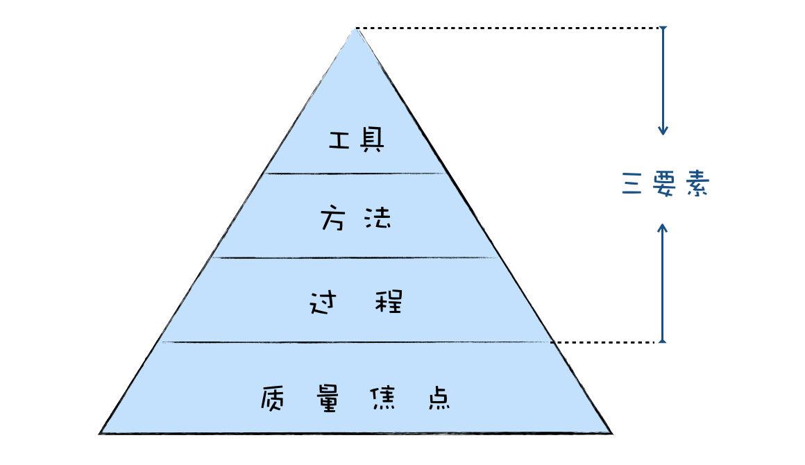
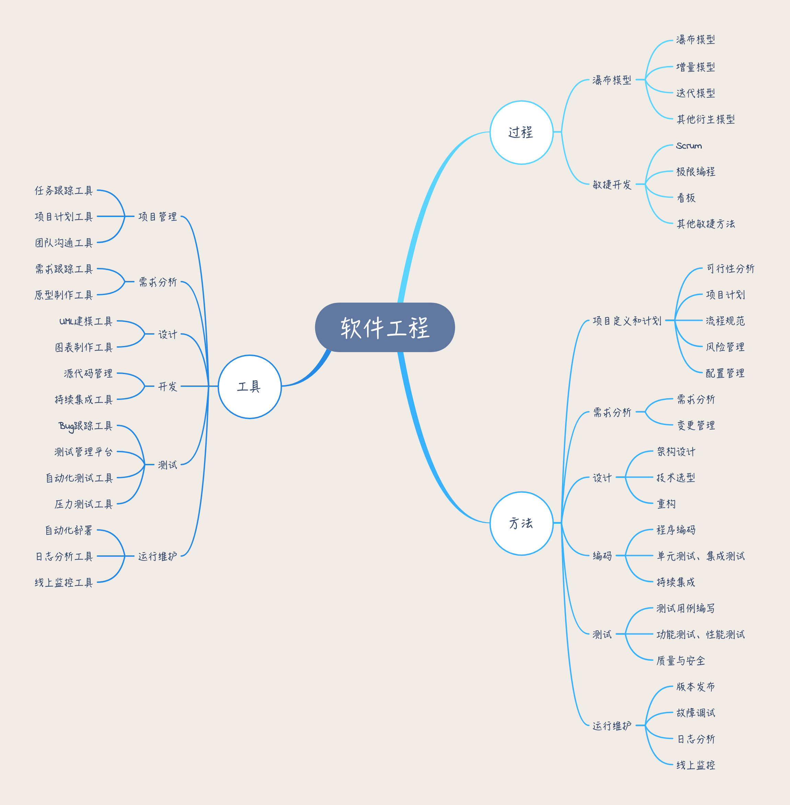
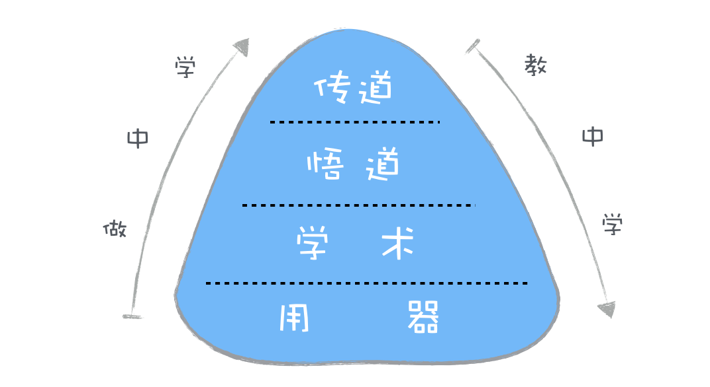
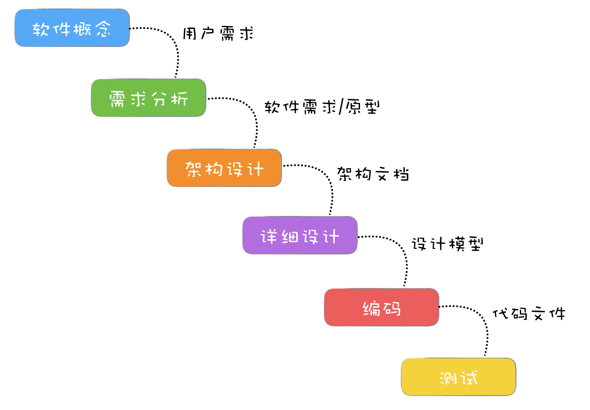
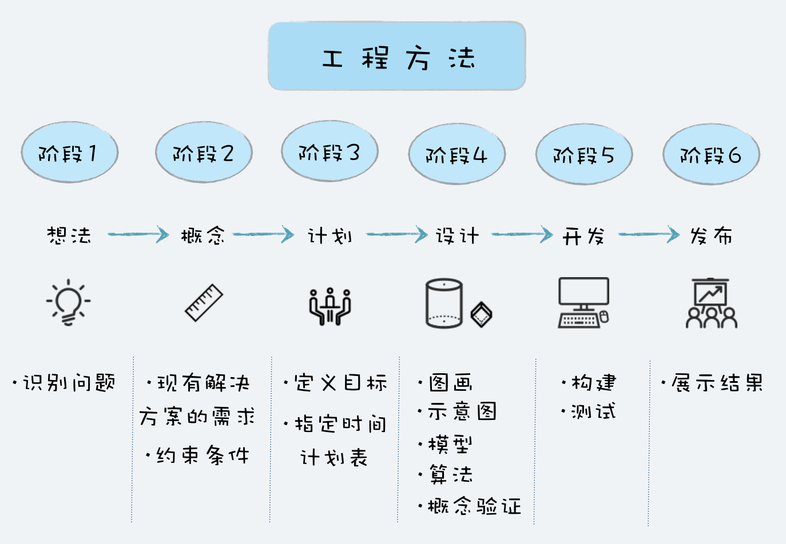
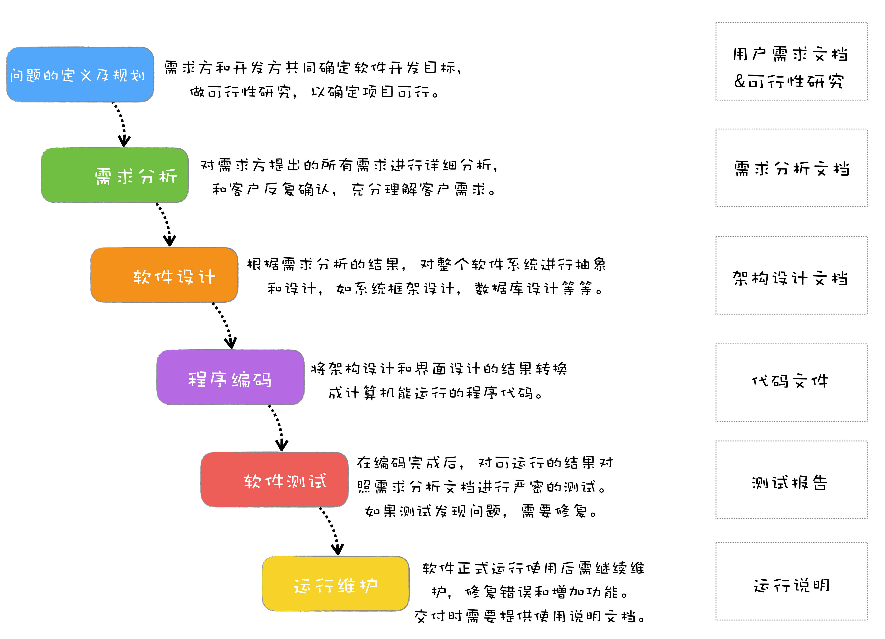
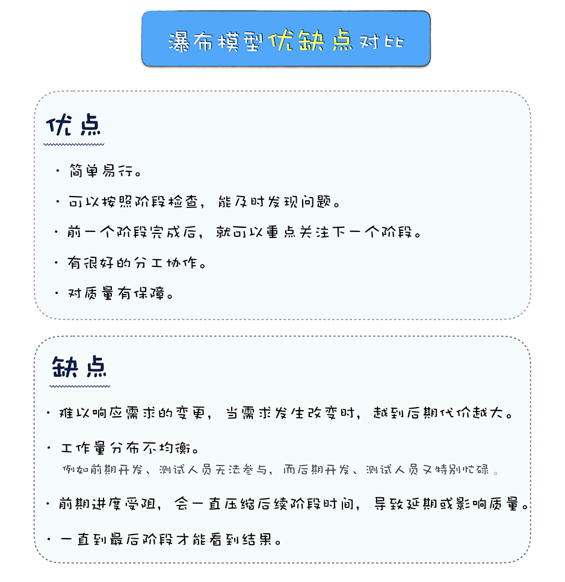
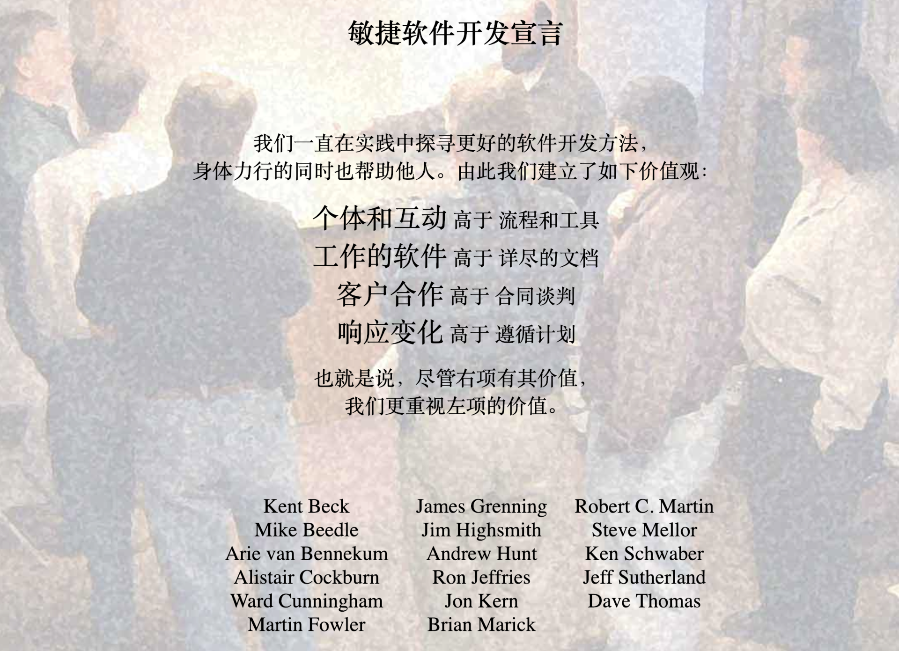

# 《软件工程之美》学习笔记

## 导学

### 你为什么应该学好软件工程？

#### 你为什么应该学好软件工程？

1. 软件开发的各个阶段都有成熟的最佳实践跟工具，可以帮助我们高效完成任务
2. 软件工程可以帮助我们去思考软件项目中各种问题背后的原因，以及各种方法后面的理论指导。可以说，软件工程是道，编程方法是术。
3. 长期来看，数据结构、算法、面向对象思想、设计模式、软件工程这些学科都是经久不衰的，任何岗位，只要你从事软件开发相关领域，都绕不开“软件工程”
4. 技术更新迭代速度确实很快，但是软件开发背后的逻辑却万变不离其宗。掌握软件工程，才能步步为营，不被快速发展的软件开发行业所淘汰。

#### 如何学习软件工程？

从三个维度、三个部分来学习软件工程。

三个维度：“道、术、器”

1. “器”就是软件工程中的各种工具。
2. “术”就是软件工程中的各种方法。例如如何做需求分析？如何对需求变更做变更管理？
3. “道”就是软件工程知识的核心思想、本质规律。例如为什么要有需求分析？需求变更产生的深层次原因是什么？项目中决策的依据是什么？

三个部分

1. 基础理论：展现软件工程学的全景图
2. 项目过程：了解软件生命周期六个阶段：规划、需求分析、设计、编码、测试、运行维护这六个阶段
3. 案例分析

 

### 怎样学好软件工程？

#### 软件工程知识架构全景图

 

 

1. 质量：软件工程的基石
2. 过程：软件从诞生到结束期间，要遵循的步骤，目前有两种过程模型：瀑布模型和敏捷开发
3. 方法：构建系统的方法学。比如说，如何分析用户需求；如何对产品进行测试验收；如何进行系统架构设计等。
4. 工具：利用工具来辅助方法的执行，提高效率。通过工具，可以把一些手动的工作自动化，比如自动化测试工具，自动构建部署工具；通过工具，可以帮助把一些流程规范起来，比如Bug跟踪、源代码管理；还可以通过工具，帮助提高编码效率，比如各种编辑器IDE、各种高级语言。

综上，软件工程的核心知识点，**就是围绕软件开发过程，产生的方法学和工具**

用一个简单的公式来理解软件工程，那就是：**软件工程=工具+方法+过程**

根据这个公式，软件工程的知识结构可以做成如下的思维导图：

 

 

#### 如何学习软件工程？

一、学习软件工程的四重境界

1. 第一重：用器，使用工具，比如，原型设计工具可以帮助你确定需求，持续集成工具可以帮助你简化测试和部署的流程。
2. 第二重：学术，学会方法，你就能应用方法去完成一个任务，例如用需求分析的方法，你去搞清楚用户想要什么，用Scrum去组织项目开发过程。掌握了术，甚至是可以脱离器的，例如你没用原型设计工具，你用纸和笔，用白板，一样可以去沟通确认需求。
3. 第三重：悟道，掌握软件工程知识的核心思想和本质规律
4. 第四重： 传道

二、做中学和教中学

 

 

1. “做中学”，是一种自下而上的学习方法，通过实践，从使用工具到学习方法，再从方法中提炼出道。
2. “教中学”，是一种自上而下的学习方法，通过教学，去进一步深入领会别人总结出来的道，去模仿推导方法，去学习如何使用工具。

 

## 理解软件工程

### 01 | 到底应该怎样理解软件工程？

#### 什么是软件工程？

软件工程就是用工程化的方法来开发维护软件。

简言之，软件工程就是用一定的过程，采用科学的方法，借助工具来开发软件。

如果用一个简单的公式表达，那就是：软件工程 = 过程 + 方法 + 工具。

#### 为什么会有软件工程？

软件工程，它是为研究和克服软件危机而生。

在计算机刚发明出来的时候，计算机的能力非常有限，只能接收简单的指令和运算，不需要软件工程也可以开发出简单的软件。

但是，当软件的规模越来越大，复杂度不断增加，软件项目开发维护过程中的问题就逐步暴露出来：软件产品质量低劣、软件维护工作量大、成本不断上升、进度不可控、程序人员无限度地增加。所以在60年代，“软件危机”的概念被提出来。

从此诞生了一门新兴的工程学科：软件工程，它是为研究和克服软件危机而生。

#### 软件工程的演化史

建一座房子：首先要先立项、设定预算，然后画设计图，再是施工，施工完成后，有专业人士进行质量检查，质检合格后入住。

参考建筑工程，整个软件开发过程也被分成了几个阶段：需求定义与分析、设计、实现、测试、交付和维护，这也就是我们常说的软件项目生命周期。

同时，也很自然就衍生出一套最基础的过程模型：瀑布模型。

 

 

瀑布模型的诞生，在当时是有非常重大的意义的，让软件开发从无序到有序，让大家更好的分工协作，同时每个阶段又衍生出各自的方法学和工具，例如需求分析、软件测试等等。

然而瀑布的特性决定了它只能从上往下流，而且从上到下走完整个周期很长，所以一旦出现了需求的变更，将会非常痛苦，很多事情需要重头再来。

于是基于瀑布模型，又衍生出V模型、原型设计、增量模型、螺旋模型等模型，试图改善瀑布模型存在的一些缺陷。这些改进模型的发展趋势上就是缩短项目周期，快速迭代。

这样到了90年代，各种轻量级开发方法例如Scrum、极限编程等也不断被提出。到了2001年，这些轻量级开发方法一起组成了敏捷联盟，其后敏捷开发如同星星之火，逐渐形成燎原之势。

近些年，云计算、微服务这些新技术的产生，也对软件工程产生了影响。云服务让分工更细，很多企业可以将运维、服务器维护、DBA、甚至某些独立服务交给云服务商；微服务让大团队变成小团队，每个小团队可以更专注于细分领域，减少相互之间的依赖。 ​

 

### 02 | 工程思维：把每件事都当作一个项目来推进

#### 什么是工程方法？

工程方法：有目的、有计划、有步骤地解决问题的方法就是工程方法。

 

 

#### 站在整体而非局部去看问题

为什么需要工程方法？

- 有一个被有效论证过的方法论指导你，可以帮助你提高成功概率，也可以提高效率。
- 当你用工程方法去思考的时候，你会更多的站在整体而非局部去思考，更有大局观。

我们在日常处理事务时，天然地会选择自己感兴趣的、擅长的那部分，而容易无视整体和其他部分。

**所以问题的核心并不在于是不是用工程方法，而是有没有把这件事当作一个项目，是不是能看到这件事的全貌，而不是只看到局部。**

在工作分工越来越细致的今天，分工有助于技能的专业化，提高工作效率。但如果只站在自己的立场去考虑问题，没有人关注整体价值，就容易相互误解，产生矛盾、增加成本。

如果能站在项目整体来看问题，你就会去关注项目的质量、项目的进度、项目的成本、项目的最终用户。每个项目成员，如果能多站在项目的角度去考虑，那么这样不仅对项目有利，更对自己有好处。

我把这种思维方式称为“工程思维”。如果给一个定义的话，**工程思维，本质上是一种思考问题的方式，在解决日常遇到的问题时，尝试从一个项目的角度去看待问题、尝试用工程方法去解决问题、站在一个整体而不是局部的角度去看问题。**

 

### 03 | 瀑布模型：像工厂流水线一样把软件开发分层化

#### 瀑布模型的诞生

为了解决软件危机中的这些问题，在1970年，Winston Royce博士提出了瀑布开发模型。

 

 

瀑布模型在提出后，因为其简单可行，切实有效，马上就在很多软件项目中应用起来，一直到2000年前后，都是最主流的软件开发模型，即使到现在，你也能在很多软件项目中看到它的影子。

也是从那时开始，有了“软件生命周期”的概念。

虽然现在瀑布模型已经不是最主流的开发模式，那为什么我们现在还要学习瀑布模型呢？

**因为不管什么软件项目，不管采用什么开发模式，有四种活动是必不可少的，那就是需求、设计、编码和测试。而这四项活动，都是起源自瀑布模型，也是瀑布模型中核心的部分。**

#### 瀑布模型的优缺点

 

 

瀑布模型最大的问题就是不能及时响应需求变更，越到后期变更代价越大。

鉴于瀑布模型存在的这些问题，后来又有很多人提出了其他的软件生命周期模型，比如快速原型开发模型、增量模型、迭代模型，以期保留瀑布模型的这些优点，克服瀑布模型中存在的问题。

瀑布模型，似乎已经成了落后的代名词，但在当时是有划时代意义的。他的出现，也解决了软件项目开发中的几个重要问题。

- **让软件开发过程有序可控**。瀑布模型的每个阶段都有明确的任务，每个阶段都有明确的交付产物，都有相应的里程碑。这些让整个过程更可控，而且能及早发现问题。
- **让分工协作变成可能**。瀑布模型的六个阶段，也让软件开发产生相应的基础分工：项目经理、产品经理、架构师、软件工程师、测试工程师、运维工程师。
- **质量有保障**。瀑布模型每个阶段都需要交付相应的文档，而文档的撰写和评审，可以帮助在动手之前把问题沟通清楚，想清楚。瀑布模型在编码结束后，会有严密的测试，只有测试验收通过后，才能上线发布。这些措施都让软件的质量更有保障。

 

### 04 | 瀑布模型之外，还有哪些开发模型？

#### 快速开发快速改

一、快速原型模型

**快速原型模型，就是为了要解决客户的需求不明确和需求多变的问题**。

先迅速建造一个可以运行的软件原型，然后收集用户反馈，再反复修改确认，使开发出的软件能真正反映用户需求，这种开发模型就叫快速原型模型，也叫原型模型。

#### 大瀑布拆小瀑布

瀑布模型的很多问题，根源都是周期太长。如果能将周期变短，那么很多问题就迎刃而解了。

基于这种思路，产生了很多开发模型，比较典型的主要是：增量模型 和 迭代模型。

**一、增量模型——按模块分批次交付**

1.特点

增量模型是把待开发的软件系统模块化，然后在每个小模块的开发过程中，应用一个小瀑布模型，对这个模块进行需求分析、设计、编码和测试。

2.缺点

- 增量模型的根基是模块化，如果系统不能模块化，那么将很难采用增量模型的模式来开发。
- 对模块的划分很抽象，这本身对于系统架构的水平是要求很高的。

3.适用场景

需求比较清楚，能模块化的软件系统，并且可以按模块分批次交付。

4.举例

如果拿盖房子来比喻的话，就是先盖卫生间，然后盖厨房，再是卧室。

**二、迭代模型——每次迭代都有一个可用的版本**

1.特点

迭代模型每次只设计和实现产品的一部分，然后逐步完成更多功能。每次设计和实现一个阶段叫做一个迭代。通常一个迭代的时间都是固定的，不会太长，例如2-4周。在一个迭代中都会包括需求分析、设计、实现和测试，类似于一个小瀑布模型。迭代结束时要完成一个可以运行的交付版本。

2.缺点

- 规划每次迭代的内容和要达到的目标，这个比较困难
- 只清楚当前迭代的需求，而不知道后续需求，设计可能会考虑不周全。这样的话，迭代一多，系统会有不少冗余，一段时间后就需要对系统进行重构。
- 每次迭代，用户可能会增加新的需求和对现有需求进行更改，因此开发时间上可能会比预期要长。如果你做的是小项目的话，并不建议使用迭代模型来开发。

3.举例

如果用迭代模型的方式盖房子，第一个迭代要先盖一个茅草屋，快速满足客户对房子的核心需求；第二个迭代再盖一个小木屋，比茅草房更大更舒适；第三个迭代再盖成一个豪华别墅，满足客户所有需求。

**三、增量模型 VS 迭代模型**

增量模型是按照功能模块来拆分；而迭代模型则是按照时间来拆分，看单位时间内能完成多少功能。

还是用盖房子来理解，增量模型则是先盖厨房，再是卧室，这样一个个模块来完成。而迭代模型则是先盖一个简单的茅草房，有简易的土灶和土床，然后再升级成小木屋，有更好的灶和更好的卧室，这样一步步迭代成最终的房子。

 

### 05 | 敏捷开发到底是想解决什么问题？

#### 什么是敏捷开发？

 

 

敏捷不是一种方法论，也不是一种软件开发的具体方法，更不是一个框架或过程，而是一套价值观和原则。

各种敏捷框架、方法论和工具，就像是“术”，告诉你敏捷开发的方式，而敏捷则是“道”，是一套价值观和原则，指导你在软件项目开发中做决策。

当你开发做决策的时候，遵守了敏捷开发的价值观和原则，不管你是不是用Scrum或者极限编程，那么都可以算是敏捷开发。

> 举个例子：敏捷开发中流行的站立会议，主要目的是为了保证团队成员充分的沟通，遇到困难可以及时寻求帮助。但是如果每天的站立会议流于形式，并不能起到有效的目的，则应该减少频度，甚至取消换成其他方式。要不要在你的项目开发中使用站立会议，判断的依据就在于这样做是不是符合敏捷的价值观和原则。

#### 敏捷开发想解决什么问题？

如果你读仔细读了敏捷宣言，你会发现，宣言中右边的内容其实都是瀑布模型核心的内容：流程和工具、详尽的文档、合同谈判、遵循计划。

虽然敏捷开发并未对瀑布模型的价值进行否定，但也表明了瀑布模型做的还不够好，同时提出了一套自己的价值观。

敏捷开发想解决瀑布模型开发方法中存在的问题，用一种轻量的、敏捷的方法来改善甚至是替代它。

这些年敏捷开发也是一直这么做的。瀑布模型的典型问题就是周期长、发布烦、变更难，敏捷开发就是快速迭代、持续集成、拥抱变化。

> 举例子：我们开始做一个新项目，需要从客户那里收集整理需求，如果按照传统的软件开发模式，我们需要在开发前获得所有需求，然后和客户签订合同，在发布前都不会轻易修改需求。
> 但是如果我们采用敏捷开发模式来开发项目，那这样做显然违背敏捷的价值观：“客户合作高于合同谈判”。
> 所以如果是敏捷开发，在每个迭代后，都应该向客户收集反馈，然后在后面的迭代中，酌情加入客户反馈修改的内容。

#### 敏捷开发和瀑布模型的差异

这些年敏捷开发，已经逐步发展出一套 “Scrum + 极限编程 + 看板” 的最佳实践，Scrum主要用来管理项目过程，极限编程重点在工程实践，而看板将工作流可视化。

我将基于Scrum和极限编程的实践，来对比一下敏捷开发模型和瀑布模型的差异。

1.敏捷开发是怎么做需求分析的？

瀑布模型的一个重要阶段就是需求分析，要有严谨的需求分析，产生详尽的需求分析文档。而敏捷开发的需求，主要是来源于一个个小的用户故事，用户故事通常是写在卡片上的一句话，在Sprint的开发中，再去确认需求的细节。

比如一个用户登录网站的需求，在用户故事里面就是一句话：

> 作为用户，我想登录网站，这样可以方便浏览。

好处是减少了大量需求文档的撰写，可以早些进入开发。但这个对开发人员在需求理解和沟通的能力上要求更高了。

2.敏捷开发是怎么做架构设计的？

瀑布模型在需求分析完了以后，就需要根据需求做架构设计。而在敏捷开发中，并不是基于完整的用户需求开发，每个Sprint只做一部分需求，所以是一种渐进式的架构设计，当前Sprint只做适合当前需求的架构设计。

这种渐进式的架构设计，迭代次数一多，就会出现架构满足不了需求的现象，产生不少冗余代码，通常我们叫它技术债务，需要定期对系统架构进行重构。

3.敏捷开发怎么保证项目质量的？

瀑布模型在编码完成后，会有专门的阶段进行测试，以保证质量。在敏捷开发的Sprint中，并没有专门的测试阶段，这就依赖于开发功能的同时，要编写单元测试和集成测试代码，用自动化的方式辅助完成测试。

相对来说，这种以自动化测试为主的方式，质量确实是要有些影响的。

4.敏捷开发是怎么发布部署的？

瀑布模型通常在编码结束后，开始部署测试环境，然后在测试阶段定期部署测试环境。测试验收通过后，发布部署到生产环境。

在敏捷开发中，这种持续构建、持续发布的概念叫持续集成，因为整个过程都是全自动化的，每次完成一个任务，提交代码后都可以触发一次构建部署操作，脚本会拿最新的代码做一次全新的构建，然后运行所有的单元测试和集成测试代码，测试通过后部署到测试环境。

持续集成是一个非常好的实践，极大的缩短和简化了部署的流程，而且自动化测试的加入也很好的保证了部署产品的质量。前期搭建整个持续集成环境需要一定技术要求。

#### 该不该选择敏捷开发？

这些年，软件工程中一些好的实践，像持续集成、测试驱动开发、结对编程、看板等都来自于敏捷开发。可以肯定，敏捷开发是一种非常好的软件开发模式。

但在应用上，也确实需要一些满足一些条件才能用好，例如：

- 团队要小，人数超过一定规模就要分拆；
- 团队成员之间要紧密协作，客户也要自始至终深度配合；
- 领导们得支持。敏捷需要扁平化的组织结构，更少的控制，更多的发挥项目组成员的主动性；
- 写代码时要有一定比例的自动化测试代码，要花时间搭建好源码管理和持续集成环境。

因为敏捷开发对项目成员综合素质要求更高，做计划要相对难一些。如果团队大、客户不配合、领导不支持，再好的敏捷方法也很难有效实践起来。

如果你要实践敏捷开发，建议先找个小项目进行试点，能证明可行了，再进一步推广。有条件的话，可以和一些顾问公司合作，请人做专门的培训和指导。

如果不具备条件，应该考虑先把其中一些好的实践用起来，比如说持续集成、每日站会、自动化测试等。

 

### 06 | 大厂都在用哪些敏捷方法？（上）
