<!-- @import "[TOC]" {cmd="toc" depthFrom=1 depthTo=6 orderedList=false} -->

# 《软件工程之美》学习笔记

## 导学

### 你为什么应该学好软件工程？

#### 你为什么应该学好软件工程？

1. 软件开发的各个阶段都有成熟的最佳实践跟工具，可以帮助我们高效完成任务
2. 软件工程可以帮助我们去思考软件项目中各种问题背后的原因，以及各种方法后面的理论指导。可以说，软件工程是道，编程方法是术。
3. 长期来看，数据结构、算法、面向对象思想、设计模式、软件工程这些学科都是经久不衰的，任何岗位，只要你从事软件开发相关领域，都绕不开“软件工程”
4. 技术更新迭代速度确实很快，但是软件开发背后的逻辑却万变不离其宗。掌握软件工程，才能步步为营，不被快速发展的软件开发行业所淘汰。

#### 如何学习软件工程？

从三个维度、三个部分来学习软件工程。

三个维度：“道、术、器”

1. “器”就是软件工程中的各种工具。
2. “术”就是软件工程中的各种方法。例如如何做需求分析？如何对需求变更做变更管理？
3. “道”就是软件工程知识的核心思想、本质规律。例如为什么要有需求分析？需求变更产生的深层次原因是什么？项目中决策的依据是什么？

三个部分

1. 基础理论：展现软件工程学的全景图
2. 项目过程：了解软件生命周期六个阶段：规划、需求分析、设计、编码、测试、运行维护这六个阶段
3. 案例分析

 

### 怎样学好软件工程？

#### 软件工程知识架构全景图

 

 

1. 质量：软件工程的基石
2. 过程：软件从诞生到结束期间，要遵循的步骤，目前有两种过程模型：瀑布模型和敏捷开发
3. 方法：构建系统的方法学。比如说，如何分析用户需求；如何对产品进行测试验收；如何进行系统架构设计等。
4. 工具：利用工具来辅助方法的执行，提高效率。通过工具，可以把一些手动的工作自动化，比如自动化测试工具，自动构建部署工具；通过工具，可以帮助把一些流程规范起来，比如Bug跟踪、源代码管理；还可以通过工具，帮助提高编码效率，比如各种编辑器IDE、各种高级语言。

综上，软件工程的核心知识点，**就是围绕软件开发过程，产生的方法学和工具**

用一个简单的公式来理解软件工程，那就是：**软件工程=工具+方法+过程**

根据这个公式，软件工程的知识结构可以做成如下的思维导图：

 

 

#### 如何学习软件工程？

一、学习软件工程的四重境界

1. 第一重：用器，使用工具，比如，原型设计工具可以帮助你确定需求，持续集成工具可以帮助你简化测试和部署的流程。
2. 第二重：学术，学会方法，你就能应用方法去完成一个任务，例如用需求分析的方法，你去搞清楚用户想要什么，用Scrum去组织项目开发过程。掌握了术，甚至是可以脱离器的，例如你没用原型设计工具，你用纸和笔，用白板，一样可以去沟通确认需求。
3. 第三重：悟道，掌握软件工程知识的核心思想和本质规律
4. 第四重： 传道

二、做中学和教中学

 

 

1. “做中学”，是一种自下而上的学习方法，通过实践，从使用工具到学习方法，再从方法中提炼出道。
2. “教中学”，是一种自上而下的学习方法，通过教学，去进一步深入领会别人总结出来的道，去模仿推导方法，去学习如何使用工具。

 

#### 总结

今天，我带你浏览了软件工程的全景图，也为你讲解了学习软件工程的四重境界。同时，我也介绍了“做中学”和“教中学”这两套行之有效，并且特别适合软件工程学科的学习方法，所以希望你在后面的学习中，可以付诸行动。

- 分享你学到的知识。将你从专栏学习到的知识写成微博或博客等，分享给大家。写作是一种特别好的总结和学习方式，在你写的过程中，很多不清楚的问题就想明白了。
- 做几次内部分享或培训。如果你从来没做过公司内部的分享或培训，不妨迈出第一步，把你学到的知识，写成PPT，小范围地讲给你的同事或朋友。如果你已经做过类似的分享，那么就再做几次软件工程相关的。准备PPT的过程，就是你最好的学习过程。
- 把你学习的知识应用起来。学到的知识只有用起来才能变成你自己的经验，尝试着把在专栏中学到的知识应用到你的项目中去。多问多思考。有疑问就提出来；看到其他人问的问题，也可以去思考为什么，一起探讨问题的答案。

## 理解软件工程

### 01 | 到底应该怎样理解软件工程？

#### 什么是软件工程？

软件工程就是用工程化的方法来开发维护软件。

简言之，软件工程就是用一定的过程，采用科学的方法，借助工具来开发软件。

如果用一个简单的公式表达，那就是：软件工程 = 过程 + 方法 + 工具。

#### 为什么会有软件工程？

软件工程，它是为研究和克服软件危机而生。

在计算机刚发明出来的时候，计算机的能力非常有限，只能接收简单的指令和运算，不需要软件工程也可以开发出简单的软件。

但是，当软件的规模越来越大，复杂度不断增加，软件项目开发维护过程中的问题就逐步暴露出来：软件产品质量低劣、软件维护工作量大、成本不断上升、进度不可控、程序人员无限度地增加。所以在60年代，“软件危机”的概念被提出来。

从此诞生了一门新兴的工程学科：软件工程，它是为研究和克服软件危机而生。

#### 软件工程的演化史

建一座房子：首先要先立项、设定预算，然后画设计图，再是施工，施工完成后，有专业人士进行质量检查，质检合格后入住。

参考建筑工程，整个软件开发过程也被分成了几个阶段：需求定义与分析、设计、实现、测试、交付和维护，这也就是我们常说的软件项目生命周期。

同时，也很自然就衍生出一套最基础的过程模型：瀑布模型。

 

 

瀑布模型的诞生，在当时是有非常重大的意义的，让软件开发从无序到有序，让大家更好的分工协作，同时每个阶段又衍生出各自的方法学和工具，例如需求分析、软件测试等等。

然而瀑布的特性决定了它只能从上往下流，而且从上到下走完整个周期很长，所以一旦出现了需求的变更，将会非常痛苦，很多事情需要重头再来。

于是基于瀑布模型，又衍生出V模型、原型设计、增量模型、螺旋模型等模型，试图改善瀑布模型存在的一些缺陷。这些改进模型的发展趋势上就是缩短项目周期，快速迭代。

这样到了90年代，各种轻量级开发方法例如Scrum、极限编程等也不断被提出。到了2001年，这些轻量级开发方法一起组成了敏捷联盟，其后敏捷开发如同星星之火，逐渐形成燎原之势。

近些年，云计算、微服务这些新技术的产生，也对软件工程产生了影响。云服务让分工更细，很多企业可以将运维、服务器维护、DBA、甚至某些独立服务交给云服务商；微服务让大团队变成小团队，每个小团队可以更专注于细分领域，减少相互之间的依赖。 ​

 

#### 总结
今天，我和你一起追溯了一下软件工程的起源，你知道了软件工程学科的产生，就是为了解决软件危机。也见证了整个软件工程的演变历史，从瀑布模型到敏捷开发。

从1968年提出软件工程到现在，正好是50年。在2002年，我最开始学软件工程专业的时候，还只有瀑布模型、需求分析、系统设计等这些传统软件工程内容，但是经过十几年的发展，在软件项目中，敏捷开发、持续集成、微服务等这些新兴内容已经开始在软件项目中占据越来越重要的位置。

可以预见，未来软件工程领域还会有新的概念、新的知识诞生。但是万变不离其宗，只要你抓住软件工程的本质，无论将来如何变化，你总能很快掌握新的知识内容。

而软件工程的核心，就是围绕软件项目开发，对开发过程的组织，对方法的运用，对工具的使用。

### 02 | 工程思维：把每件事都当作一个项目来推进

#### 什么是工程方法？

工程方法：有目的、有计划、有步骤地解决问题的方法就是工程方法。

 

 

#### 站在整体而非局部去看问题

为什么需要工程方法？

- 有一个被有效论证过的方法论指导你，可以帮助你提高成功概率，也可以提高效率。
- 当你用工程方法去思考的时候，你会更多的站在整体而非局部去思考，更有大局观。

我们在日常处理事务时，天然地会选择自己感兴趣的、擅长的那部分，而容易无视整体和其他部分。

**所以问题的核心并不在于是不是用工程方法，而是有没有把这件事当作一个项目，是不是能看到这件事的全貌，而不是只看到局部。**

在工作分工越来越细致的今天，分工有助于技能的专业化，提高工作效率。但如果只站在自己的立场去考虑问题，没有人关注整体价值，就容易相互误解，产生矛盾、增加成本。

如果能站在项目整体来看问题，你就会去关注项目的质量、项目的进度、项目的成本、项目的最终用户。每个项目成员，如果能多站在项目的角度去考虑，那么这样不仅对项目有利，更对自己有好处。

我把这种思维方式称为“工程思维”。如果给一个定义的话，**工程思维，本质上是一种思考问题的方式，在解决日常遇到的问题时，尝试从一个项目的角度去看待问题、尝试用工程方法去解决问题、站在一个整体而不是局部的角度去看问题。**

 

#### 总结
改变，最有效的是方式是改变思想，这往往也是最难的部分。

当你开始学习这个软件工程专栏，我希望你不仅仅学到软件工程的理论知识，更希望你能用“工程思维”来思考你遇到的各类问题。

你不需要现在是一个项目经理或者管理者，也一样可以在日常生活中应用“工程思维”。比如学习这个专栏，你会制订一个什么样的计划？每个阶段达到一个什么样的成果？比如你今年有没有去旅行的计划？你会怎么制订你的旅行计划？

如果有兴趣的话，你还可以看看我以前写过的一篇文章“记录下两个孩子在MineCraft里面还原公寓的经历”。

这也是一个很有意思的工程思维实践，帮助孩子们在游戏里面还原公寓。这本质上也是一个项目，需要制订计划，需要设计、实现。我希望他们从小就有工程思维，能在未来有目的、有计划、有步骤地去解决日常生活的问题。

### 03 | 瀑布模型：像工厂流水线一样把软件开发分层化

#### 瀑布模型的诞生

为了解决软件危机中的这些问题，在1970年，Winston Royce博士提出了瀑布开发模型。

 

 

瀑布模型在提出后，因为其简单可行，切实有效，马上就在很多软件项目中应用起来，一直到2000年前后，都是最主流的软件开发模型，即使到现在，你也能在很多软件项目中看到它的影子。

也是从那时开始，有了“软件生命周期”的概念。

虽然现在瀑布模型已经不是最主流的开发模式，那为什么我们现在还要学习瀑布模型呢？

**因为不管什么软件项目，不管采用什么开发模式，有四种活动是必不可少的，那就是需求、设计、编码和测试。而这四项活动，都是起源自瀑布模型，也是瀑布模型中核心的部分。**

#### 瀑布模型的优缺点

 

 

瀑布模型最大的问题就是不能及时响应需求变更，越到后期变更代价越大。

鉴于瀑布模型存在的这些问题，后来又有很多人提出了其他的软件生命周期模型，比如快速原型开发模型、增量模型、迭代模型，以期保留瀑布模型的这些优点，克服瀑布模型中存在的问题。

瀑布模型，似乎已经成了落后的代名词，但在当时是有划时代意义的。他的出现，也解决了软件项目开发中的几个重要问题。

- **让软件开发过程有序可控**。瀑布模型的每个阶段都有明确的任务，每个阶段都有明确的交付产物，都有相应的里程碑。这些让整个过程更可控，而且能及早发现问题。
- **让分工协作变成可能**。瀑布模型的六个阶段，也让软件开发产生相应的基础分工：项目经理、产品经理、架构师、软件工程师、测试工程师、运维工程师。
- **质量有保障**。瀑布模型每个阶段都需要交付相应的文档，而文档的撰写和评审，可以帮助在动手之前把问题沟通清楚，想清楚。瀑布模型在编码结束后，会有严密的测试，只有测试验收通过后，才能上线发布。这些措施都让软件的质量更有保障。

 

#### 总结

从瀑布模型提出将近50年过去了，虽然现在大家一提起瀑布模型，似乎已经成了落后的代名词，但在当时是有划时代意义的。如果类比一下，我觉得瀑布模型的价值相当于工业界第一次提出流水线作业。

> 1769年，英国人乔赛亚·韦奇伍德开办埃特鲁利亚陶瓷工厂。以前制作陶瓷只有“制陶工”一个工种，一个人从挖泥、制胚到最后烧制，要求很高。但是乔赛亚把原本的制陶流程从开始到结束分成了若干阶段，每个阶段可以由不同的人完成，从单一的制陶工分成了挖泥工、运泥工、扮土工、制坯工等，这样就大大提高了生产效率，也降低对工人的要求。

同理，瀑布模型的出现，也解决了软件项目开发中的几个重要问题。

- 让软件开发过程有序可控。瀑布模型的每个阶段都有明确的任务，每个阶段都有明确的交付产物，都有相应的里程碑。这些让整个过程更可控，而且能及早发现问题。
- 让分工协作变成可能。瀑布模型的六个阶段，也让软件开发产生相应的基础分工：项目经理、产品经理、架构师、软件工程师、测试工程师、运维工程师。
- 质量有保障。瀑布模型每个阶段都需要交付相应的文档，而文档的撰写和评审，可以帮助在动手之前把问题沟通清楚，想清楚。瀑布模型在编码结束后，会有严密的测试，只有测试验收通过后，才能上线发布。这些措施都让软件的质量更有保障。

### 04 | 瀑布模型之外，还有哪些开发模型？

#### 快速开发快速改

一、快速原型模型

**快速原型模型，就是为了要解决客户的需求不明确和需求多变的问题**。

先迅速建造一个可以运行的软件原型，然后收集用户反馈，再反复修改确认，使开发出的软件能真正反映用户需求，这种开发模型就叫快速原型模型，也叫原型模型。

#### 大瀑布拆小瀑布

瀑布模型的很多问题，根源都是周期太长。如果能将周期变短，那么很多问题就迎刃而解了。

基于这种思路，产生了很多开发模型，比较典型的主要是：增量模型 和 迭代模型。

**一、增量模型——按模块分批次交付**

1.特点

增量模型是把待开发的软件系统模块化，然后在每个小模块的开发过程中，应用一个小瀑布模型，对这个模块进行需求分析、设计、编码和测试。

2.缺点

- 增量模型的根基是模块化，如果系统不能模块化，那么将很难采用增量模型的模式来开发。
- 对模块的划分很抽象，这本身对于系统架构的水平是要求很高的。

3.适用场景

需求比较清楚，能模块化的软件系统，并且可以按模块分批次交付。

4.举例

如果拿盖房子来比喻的话，就是先盖卫生间，然后盖厨房，再是卧室。

**二、迭代模型——每次迭代都有一个可用的版本**

1.特点

迭代模型每次只设计和实现产品的一部分，然后逐步完成更多功能。每次设计和实现一个阶段叫做一个迭代。通常一个迭代的时间都是固定的，不会太长，例如2-4周。在一个迭代中都会包括需求分析、设计、实现和测试，类似于一个小瀑布模型。迭代结束时要完成一个可以运行的交付版本。

2.缺点

- 规划每次迭代的内容和要达到的目标，这个比较困难
- 只清楚当前迭代的需求，而不知道后续需求，设计可能会考虑不周全。这样的话，迭代一多，系统会有不少冗余，一段时间后就需要对系统进行重构。
- 每次迭代，用户可能会增加新的需求和对现有需求进行更改，因此开发时间上可能会比预期要长。如果你做的是小项目的话，并不建议使用迭代模型来开发。

3.举例

如果用迭代模型的方式盖房子，第一个迭代要先盖一个茅草屋，快速满足客户对房子的核心需求；第二个迭代再盖一个小木屋，比茅草房更大更舒适；第三个迭代再盖成一个豪华别墅，满足客户所有需求。

**三、增量模型 VS 迭代模型**

增量模型是按照功能模块来拆分；而迭代模型则是按照时间来拆分，看单位时间内能完成多少功能。

还是用盖房子来理解，增量模型则是先盖厨房，再是卧室，这样一个个模块来完成。而迭代模型则是先盖一个简单的茅草房，有简易的土灶和土床，然后再升级成小木屋，有更好的灶和更好的卧室，这样一步步迭代成最终的房子。

 

#### 总结

现在的软件项目，各种类型都有，根据项目特点，选择好合适的开发模型，可以让你事半功倍，降低项目风险，提高项目开发效率，控制项目成本。比如说：

- 一个以确认需求为主要目的的项目，就可以不用花太多时间在代码质量上面，低成本、高效做出来才是最重要的；
- 一个高风险的项目，则可以采用螺旋模型，出现问题及时止损；
- 一个很长时间加班加点，却一直没法上线，导致士气低落的项目，可以改成增量模型，先上线一个小模块，让大家看到成绩提升士气，然后再迭代，逐步上线其他模块。

同时，你也不必拘泥于这几种开发模型，还可以借鉴其他模型做的好的地方，甚至创造自己的开发模型，比如说你觉得敏捷的“站立会议”适合你的项目，那也可以借鉴过来。

### 05 | 敏捷开发到底是想解决什么问题？

#### 什么是敏捷开发？

 

 

敏捷不是一种方法论，也不是一种软件开发的具体方法，更不是一个框架或过程，而是一套价值观和原则。

各种敏捷框架、方法论和工具，就像是“术”，告诉你敏捷开发的方式，而敏捷则是“道”，是一套价值观和原则，指导你在软件项目开发中做决策。

当你开发做决策的时候，遵守了敏捷开发的价值观和原则，不管你是不是用Scrum或者极限编程，那么都可以算是敏捷开发。

> 举个例子：敏捷开发中流行的站立会议，主要目的是为了保证团队成员充分的沟通，遇到困难可以及时寻求帮助。但是如果每天的站立会议流于形式，并不能起到有效的目的，则应该减少频度，甚至取消换成其他方式。要不要在你的项目开发中使用站立会议，判断的依据就在于这样做是不是符合敏捷的价值观和原则。

#### 敏捷开发想解决什么问题？

如果你读仔细读了敏捷宣言，你会发现，宣言中右边的内容其实都是瀑布模型核心的内容：流程和工具、详尽的文档、合同谈判、遵循计划。

虽然敏捷开发并未对瀑布模型的价值进行否定，但也表明了瀑布模型做的还不够好，同时提出了一套自己的价值观。

敏捷开发想解决瀑布模型开发方法中存在的问题，用一种轻量的、敏捷的方法来改善甚至是替代它。

这些年敏捷开发也是一直这么做的。瀑布模型的典型问题就是周期长、发布烦、变更难，敏捷开发就是快速迭代、持续集成、拥抱变化。

> 举例子：我们开始做一个新项目，需要从客户那里收集整理需求，如果按照传统的软件开发模式，我们需要在开发前获得所有需求，然后和客户签订合同，在发布前都不会轻易修改需求。
> 但是如果我们采用敏捷开发模式来开发项目，那这样做显然违背敏捷的价值观：“客户合作高于合同谈判”。
> 所以如果是敏捷开发，在每个迭代后，都应该向客户收集反馈，然后在后面的迭代中，酌情加入客户反馈修改的内容。

#### 敏捷开发和瀑布模型的差异

这些年敏捷开发，已经逐步发展出一套 “Scrum + 极限编程 + 看板” 的最佳实践，Scrum主要用来管理项目过程，极限编程重点在工程实践，而看板将工作流可视化。

我将基于Scrum和极限编程的实践，来对比一下敏捷开发模型和瀑布模型的差异。

1.敏捷开发是怎么做需求分析的？

瀑布模型的一个重要阶段就是需求分析，要有严谨的需求分析，产生详尽的需求分析文档。而敏捷开发的需求，主要是来源于一个个小的用户故事，用户故事通常是写在卡片上的一句话，在Sprint的开发中，再去确认需求的细节。

比如一个用户登录网站的需求，在用户故事里面就是一句话：

> 作为用户，我想登录网站，这样可以方便浏览。

好处是减少了大量需求文档的撰写，可以早些进入开发。但这个对开发人员在需求理解和沟通的能力上要求更高了。

2.敏捷开发是怎么做架构设计的？

瀑布模型在需求分析完了以后，就需要根据需求做架构设计。而在敏捷开发中，并不是基于完整的用户需求开发，每个Sprint只做一部分需求，所以是一种渐进式的架构设计，当前Sprint只做适合当前需求的架构设计。

这种渐进式的架构设计，迭代次数一多，就会出现架构满足不了需求的现象，产生不少冗余代码，通常我们叫它技术债务，需要定期对系统架构进行重构。

3.敏捷开发怎么保证项目质量的？

瀑布模型在编码完成后，会有专门的阶段进行测试，以保证质量。在敏捷开发的Sprint中，并没有专门的测试阶段，这就依赖于开发功能的同时，要编写单元测试和集成测试代码，用自动化的方式辅助完成测试。

相对来说，这种以自动化测试为主的方式，质量确实是要有些影响的。

4.敏捷开发是怎么发布部署的？

瀑布模型通常在编码结束后，开始部署测试环境，然后在测试阶段定期部署测试环境。测试验收通过后，发布部署到生产环境。

在敏捷开发中，这种持续构建、持续发布的概念叫持续集成，因为整个过程都是全自动化的，每次完成一个任务，提交代码后都可以触发一次构建部署操作，脚本会拿最新的代码做一次全新的构建，然后运行所有的单元测试和集成测试代码，测试通过后部署到测试环境。

持续集成是一个非常好的实践，极大的缩短和简化了部署的流程，而且自动化测试的加入也很好的保证了部署产品的质量。前期搭建整个持续集成环境需要一定技术要求。

#### 该不该选择敏捷开发？

这些年，软件工程中一些好的实践，像持续集成、测试驱动开发、结对编程、看板等都来自于敏捷开发。可以肯定，敏捷开发是一种非常好的软件开发模式。

但在应用上，也确实需要一些满足一些条件才能用好，例如：

- 团队要小，人数超过一定规模就要分拆；
- 团队成员之间要紧密协作，客户也要自始至终深度配合；
- 领导们得支持。敏捷需要扁平化的组织结构，更少的控制，更多的发挥项目组成员的主动性；
- 写代码时要有一定比例的自动化测试代码，要花时间搭建好源码管理和持续集成环境。

因为敏捷开发对项目成员综合素质要求更高，做计划要相对难一些。如果团队大、客户不配合、领导不支持，再好的敏捷方法也很难有效实践起来。

如果你要实践敏捷开发，建议先找个小项目进行试点，能证明可行了，再进一步推广。有条件的话，可以和一些顾问公司合作，请人做专门的培训和指导。

如果不具备条件，应该考虑先把其中一些好的实践用起来，比如说持续集成、每日站会、自动化测试等。

 

#### 总结
我们今天一起学习了什么是敏捷开发，也就是敏捷开发是一套价值观和原则。也对比了瀑布模型和敏捷开发，其中的差异还是很大的。

瀑布模型面向的是过程，而敏捷开发面向的是人。敏捷开发要解决的，恰恰是瀑布模型中存在的一些问题。

最后，在要不要用敏捷开发这个问题上，不用过于纠结，看好敏捷开发，那就放心去用，觉得时机还不成熟、还不够了解，就先试点或者只是先借鉴其好的实践。

软件开发，最核心的是人，而不是用什么方法，以前没有敏捷开发只有瀑布模型的时候，也一样诞生了大量伟大的软件，像Windows、Office。现在有敏捷开发，更多的是让我们多了一些选择。

在下一篇文章，还会再从大厂如何应用敏捷开发的角度，继续讲一讲敏捷开发的应用。

另外，敏捷开发涉及内容还是比较多，如果想有更多了解，可以阅读一些书籍作为专栏的补充。

### 06 | 大厂都在用哪些敏捷方法？（上）

#### 和敏捷开发相关的主要流程规范

**一切工作任务围绕Ticket开展**

 
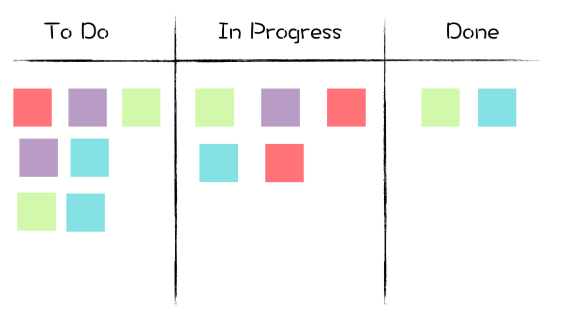
 

看板这种基于Ticket来管理跟踪任务的方式，看起来繁琐，但确实是很高效的一种方式。

- 每一个任务的状态都可以被跟踪起来：什么时候开始做的，谁在做，做完没有。
- 整个团队在做什么一目了然。
- Ticket和敏捷开发中的Backlog（任务清单）正好结合起来，通过Ticket可以收集管理整个项目的Backlog和当前Sprint（迭代）的Backlog。

**基于Git和CI的开发流程**

应用瀑布模型来开发，大概会有两大烦恼：代码不稳定和部署太麻烦。

基于Git的开发流程结合CI的自动测试部署，很完美的解决了这两大问题。

假设现在 master 的代码是稳定的，往master加入代码，需要代码审查和自动化测试。具体来说，代码审查需要提交一个PR，让别人审查。而自动化测试，就该CI（持续集成）出场。它会监听你的每次commit，然后创建一个干净的运行环境，测试你的代码，最后把测试报告给你。

至于自动部署测试环境，反倒是简单，就是CI这个机器人，在你代码合并到master的时候，再次运行自动化测试代码，测试通过后直接运行自动部署的脚本，把master代码部署到开发环境或测试环境上。

 
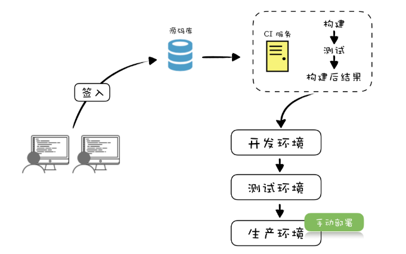
 

**部署上线流程**

以前是运维人员按照文档部署，现在已经变成了DevOps写自动化部署工具，然后开发人员自己去部署生产环境。

#### 每日站立会议

每日站立会议，主要有三个话题：

- 成员轮流发言：每个人轮流介绍一下，昨天干了什么事情，今天计划做什么事情，工作上有没有障碍无法推进。
- 检查最新的Ticket：检查一下新增的Ticket，并且要甄别一下优先级，然后决定是放到当前Sprint，还是放到Backlog
- 停车场问题：针对之前来不及讨论的问题进行讨论，能在会议时间内解决的问题，就马上解决，不能解决的会后再私下讨论或者再组织会议。

> 相关文章 \
> [Git 工作流程](http://www.ruanyifeng.com/blog/2015/12/git-workflow.html) \
> [持续集成是什么？](http://www.ruanyifeng.com/blog/2015/09/continuous-integration.html)

 

#### 总结
我们知道，在敏捷开发中有很多概念，像Backlog、持续交付、每日站会等，这些概念最终要变成实践的话，就必须要通过一定的流程规范来保障这些概念的实施。

这就是为什么很多公司写代码要求你写自动化测试代码，为什么要用一些像Jira、禅道这样的项目管理软件来管理任务，为什么要每天开站立会议，为什么要有代码审查。这些都不过是为了保障敏捷的实施。

如果你在实施敏捷开发的项目工作，就可以多去观察平时工作中这些和敏捷有关的流程规范，再结合敏捷开发中的知识点，就能很好的帮助你理解敏捷开发，理解这些流程规范背后的理论依据。

如果你工作中不是用的敏捷开发，也可以参考本文中提到的一些实践，尝试着试用起来。

在下一篇里，我还会以一个具体的项目小组对敏捷的应用为例，继续给你讲讲大厂都在用的那些敏捷方法。

### 07 | 大厂都在用哪些敏捷方法？（下）

#### 一个应用敏捷开发的小组日常

一、如何完成需求和修复Bug？

围绕Ticket。所有的需求、Bug、任务都作为Ticket提交到项目的Backlog，每个Sprint的任务都以看板的形式展现出来。

二、每周一部署生产环境

三、每周二开迭代回顾会议，总结上个Sprint

四、每周四迭代规划会，计划下周工作

五、每周五分支切割

#### 一些问题解答

一周一个迭代怎么保证质量？

- 有足够比例的自动化测试代码，可以很好地保证质量。当用户的主要功能都通过自动化测试覆盖时，基本可以保证主要功能流程不会出问题。
- 一个Sprint开发完成后，并不马上部署生产环境，而是先部署到测试环境，会有1周时间测试。
- 有专业的测试人员进行测试，并非完全依赖自动化测试。有时候一些大的功能更新，甚至会组织全组成员一起测试，以弥补测试人员不足的情况。

基于敏捷开发如何做计划？

- 大厂里面通常会在上一年底确定第二年整年的大的开发计划，并确定上线的时间范围，每个季度再根据情况做一些调整。
- 这些大的计划最终会变成具体的开发任务，一个大的开发任务，会分拆到各个部门，各部门再将任务分拆到各个项目组。基于敏捷开发的话，主要就是看把这些开发任务放到哪几个Sprint去做，并且确保在规定的时间范围内完成。
- 至于工期的估算，在迭代规划会上会对每个Ticket进行打分，根据分数可以预估有多少工作量，要花多少时间。

 

#### 总结

上一篇文章我们讲了大厂里和敏捷相关的一些流程规范，这一篇又讲了一个小组是怎么应用敏捷开发来开发项目的。

现在看上一篇文章中我留的思考题：如果每周一个Sprint，怎么保证每周都有交付，还能保证产品质量？想必你已经有了答案。

要保障质量，还是离不开充分的测试，不仅要有自动化测试，还要辅助一定量的人工测试。敏捷开发虽然求快，但是不代表应该牺牲质量。

其实，大厂的敏捷实践并不神秘，关键是分而治之，最终团队小，项目小，所以才可以敏捷起来。大厂会注重流程和工具的应用，通过Ticket的方式来管理和跟踪开发任务，通过自动化的方式来部署。

大厂的敏捷实践，一般是基于Scrum、极限编程和看板，针对各自项目组的特点，会有所侧重有所调整，在遵循敏捷的价值观和原则的前提下，做到高效使用。

希望上面介绍的敏捷应用，能对你理解敏捷开发有所启发，帮助你优化改进日常项目流程。还有要注意的一点就是，没有万能的开发模式，只有适合项目的开发模式，最重要的还是要摸索出一套适合你自己项目特色的开发模式。

### 08 | 怎样平衡软件质量与时间成本范围的关系？

#### 什么是软件项目管理金三角？

 
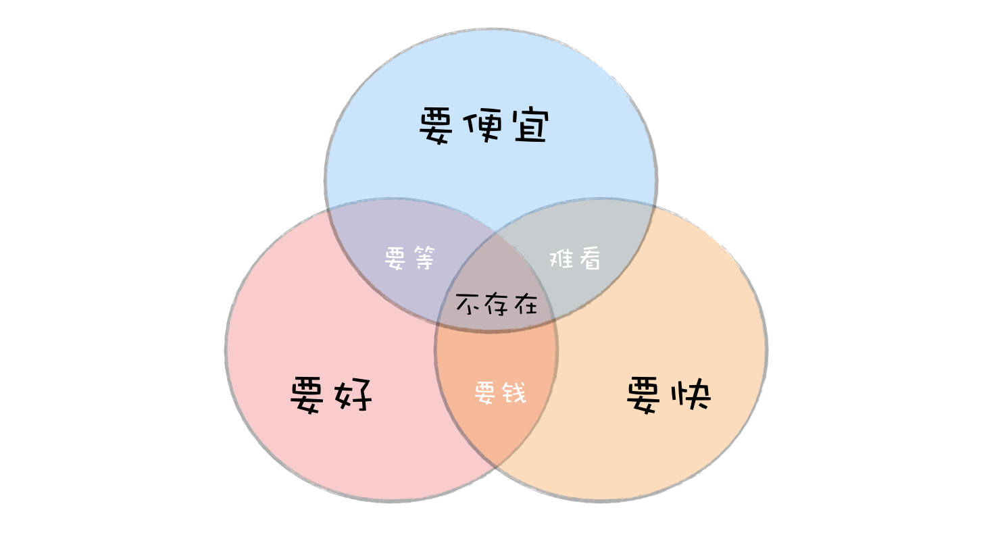
 
 

 

做产品想“多、快、好、省”都占着，是不可能的，最多只能选两样。软件项目中，也有一个类似的平衡关系，就是软件质量（产品的质量，客户的满意度）与范围（需要实现多少功能）、时间（多久可以完成）、成本（花多少钱）四个要素之间的平衡。

“质量”这个因素一般不会妥协，因此把“质量”放在三角形中间，然后在时间、成本、范围这三条边之间寻求平衡。

质量往往也是其他三个因素平衡后结果的体现，想要做的快、成本低、功能多，最后一定是个质量很差的产品。

#### 如何应用“管理金三角”做决策？

“金三角”是软件工程“道”级别的知识点

项目管理其实就是项目中一系列问题的平衡和妥协，而“金三角”理论则为我们的平衡提供了理论指导，了解这三个因素分别对项目其他方面产生的影响，可以帮助你在做决策时进行权衡取舍。

当你接手一个项目，项目的进度、成本和范围指标很容易可以跟踪到。有了这些信息，你就可以及时发现问题，调整“金三角”的边，及时解决，以防止这些小问题发展成大问题。

> 举例子 \
> **一、老板要压缩项目时间怎么办？** \
> 先用“金三角”知识分析了一下：老板希望时间是1个月，也就是说时间这条边被缩短了，那么结果就是会影响到另两条边：范围和成本，如果另外两条边可以调整，也不是不可以。\
> 再遇到这种问题，换了一种方式跟老板沟通：“一个月也不是不行，就是我们得需求调整一下，第一个版本只能做一些核心功能，剩下的后面版本再加上（调整范围）。另外还得给我加两人，不然真做不完！（增加成本）” \
>
> **二、产品经理要临时加需求怎么办？** \
> 增加需求，也就是范围这条边要增加，那就必然对成本和时间这两条边造成影响，要么延期，要么增加成本。

#### 瀑布模型和敏捷开发如何平衡时间成本范围的关系？

除了可以将“金三角”的知识应用在软件项目中，还可以应用它来理解和应用软件工程中的开发模式，尤其是瀑布模型和敏捷开发这两种典型的开发模式。

瀑布模型有严格的阶段划分，有需求分析、系统设计、开发和测试等阶段，通常在开发过程中不接受需求变更，也就是说，我们可以认为瀑布模型的范围是固定的，其他两条边时间和成本是变量。所以使用瀑布模型开发，如果中间发现不能如期完成进度，通常选择的方案就是延期（加班），或者往项目中加人。

在敏捷开发中，时间和成本两条边是固定，就只有范围这条边是变量。这就是为什么在敏捷开发中，每个Sprint开始前都要开Sprint计划会，大家一起选择下个Sprint能做完的任务，甚至于在Sprint结束时，没能完成的任务会放到下个Sprint再做。

 
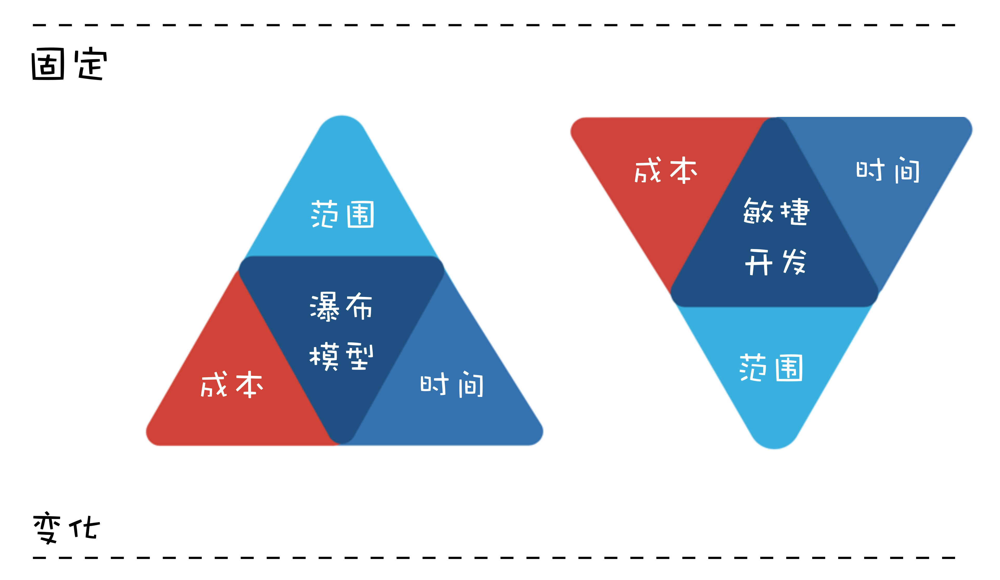
 

#### 如何平衡好软件质量与时间成本范围的关系？

从时间、成本和范围这三条边中找出来固定的一条或者两条边，再去调整另一条边。

一、淘宝网站第一个版本是怎么做到一个月上线的？

第一件事当然是先应用“金三角”分析一下：时间这条边被固定了，只能一个月；功能也不能少，范围这条边也限制住了，那就只能在成本上想办法了。要么一下子雇很多牛人，要么直接买一个现成的电子商务网站，然后修改。

显然，直接买一个网站，再雇一堆牛人的方案最好，所以淘宝网站就这样在一个买来的网站基础上，由一堆牛人快速搭建起来了。

二、极限编程是怎么做到“极限”的？

在一个Sprint中，计划好了当前Sprint要做的工作内容后，那么极限编程怎么帮助我们提高代码质量呢？

一个Sprint要做的内容是确定的，相当于成本和范围这两条边都固定了，时间这条边就成为变量了。要么通过加班延长工作时间，要么通过提升效率、减少浪费帮助我们提升时间利用率。

极限编程，就是通过帮助我们提升效率和减少浪费这方面来做的。比如说：

- 持续集成，通过自动化的方式帮助我们部署，节约了大量需要人去手动部署的时间；
- 自动化测试，通过自动化测试，节约测试时间，另外，有了自动化测试，可以避免后面修改代码产生Bug，减少了大量的浪费；
- 只做刚好的设计，避免设计时考虑了太多不必要的可能，造成浪费。

其实我们在项目中也有很多地方可以借鉴这种思路，比如说写代码的时候，少自己造轮子，多使用成熟的开源或者商业组件，可以提升效率；比如把需求想清楚搞清楚再去开发，可以减少很多返工的时间成本！

三、MVP模式是怎么诞生的？

这些年流行的MVP（minimum viable product，最小化的可行性产品）模式，是一种快速推出产品的模式：一开始只推出最核心的功能，满足用户最核心的需求，然后在用户的使用过程中收集反馈，进一步升级迭代。

这种模式怎么诞生的呢？还是应用“金三角”理论，要快速推出产品，还想成本不用太高，那就意味着时间和成本这两条边是固定的，剩下范围这个变量。

所以最简单有效的办法就是砍掉一些重要性不那么高的功能需求，只保留最核心的需求。通过缩小范围的方式，达到快速推出高质量产品的效果。

类似的道理，我们程序员，在遇到很多功能忙不过来的时候，可以主动的去和项目经理协商，砍掉一些不那么重要的需求，把精力放在核心需求上，保证项目可以如期上线。

 

#### 总结

其实，要平衡好软件质量与时间成本范围的关系并不难，你只需要记住，最重要的是根据“金三角”的三条边，找出来固定的一条或两条边，然后去调整剩下的边，达到平衡。

软件项目的“金三角”很多人都知道，主要是不知道如何应用到实际的项目中，希望这篇文章能为你提供一些思路，帮助你在项目中真正应用好这个非常实用的知识。

## 项目规划篇

### 09 | 可行性研究： 一个从一开始就注定失败的跨平台项目

可行性研究很重要。软件工程教材的第一章，仅次于“绪论”

#### 为什么软件项目很少做可行性研究？

**软件项目很抽象**
立项之前对于问题的描述（需求）和解决方案（技术方案）通常都是模糊不清的，得先立项才能慢慢搞明白需求是什么，然后才能有解决方案；而你只有搞明白需求是什么，以及解决方案是什么，才能去做可行性研究。但这不是借口，**等到项目有了一定的进展，需求逐步明确后，要继续对可行性做研究**

**老板拍板的项目**
第一种情况，多半是由于老板或者项目负责人控制决策权，且对于不同意见容忍度较低。底下人不敢提不同意见，明知道不对也只能执行。
第二种情况，老板或者项目负责人能接触到的信息更多、更全面，同时还有战略上的一些考虑，所以下面执行的人觉得不靠谱，并不代表真的不靠谱。

**可行性研究会阻碍创新**
实际上可行性研究和创新从来就不是矛盾的，它反而可以帮助你提前过滤掉那些不靠谱的创新想法，提前发现可能的风险。

#### 如何做好可行性研究？

- 经济可行性。从成本和收益角度分析，看投入产出比。不仅要分析短期利益，还要分析长期利益，看是不是值得做。
- 技术可行性。软件项目最终是需要人通过技术来实现的，所以要分析技术上是不是可行，如果有技术上解决不了的问题又能否规避。
- 社会可行性。社会可行性涉及法律、道德、社会影响等社会因素。比如，触犯国家法律的事情肯定不能做；产品如若不符合道德标准，可能带来较大的社会负面影响，那么也要慎重考虑。

 

#### 总结

可行性研究是项目启动前很关键的一步，可能最早帮你发现风险，甚至避免损失，千万要重视起来。

### 10 | 如果你想技术转管理，先来试试管好一个项目

#### 技术人员转型管理的障碍是什么？

管理，最重要的一点就是大局观，要能从整个项目的角度，从整个团队的角度去思考，去确定方向，去发现问题，对问题及时解决及时调整。

但是当你把注意力都放在技术细节上，就容易忽视其他事情，例如和其他人之间的沟通、不关心当前项目进展。

就像有人说的：

> 关注细节的，是工程师；\
> 关注过程的，是项目经理；\
> 关注结果的，是老板。

#### 怎么样去管理一个软件项目？

就软件项目管理来说，“道”就是**管好人、管好事**。

一、怎样管好软件项目中的人？

项目管理中的人，主要涉及两类：客户和项目成员。

1 管理好客户的预期

想要满足客户预期，通常来说，就是你能在项目的质量、范围、时间和成本上达到要求。

- 质量达标：交付产品是高质量的，满足客户需要的。
- 完整交付：按照约定的功能范围交付最终产品。
- 按时交付：项目按照客户认可的进度完成。
- 预算之内：在预算内完成项目。

这四个要素，并不是说必须都要满足，其实很多时候是可以协商的，重点是要达到一个平衡

2 用流程和规范让项目成员一起紧密协作

好的项目管理，不需要直接去管人，而是管理好流程规范；项目成员不需要按照项目经理的指令做事，而是遵循流程规范。

二、怎样管好软件项目中的事？

1 选择适合项目的开发模式

选择好开发模式，才好确定后续的一系列问题，例如流程规范、使用什么工具，如何制定项目计划等。

所以对软件项目过程的管理，首先就是要根据项目特点选取合适的开发模式，是敏捷开发还是瀑布模型或者瀑布模型的衍生模型？是一步到位还是逐步迭代？

开发模式选好了后，还需要配套的流程规范，以及合适的工具，以保障开发模式的执行。

2 制定好项目计划

凡事预则立不预则废，在选择好开发模式后，紧接着就是要做好项目计划，有了项目计划，才能有计划有目的地去推动项目进展，出现问题也能及时发现、及时调整。

3 对计划进行跟踪和控制，同时做好风险管理

计划制定后，并不是说事情就会完全按照我们设想的进行，实际执行难免会和计划有些出入，所以还需要对计划进行跟踪和控制。当项目的推进过程中，如果计划有出入时，需要分析原因，对计划做出调整。

同时，也不能盲目乐观，对于项目过程中可能存在的风险要进行识别，做好B计划，这样一旦风险发生变成问题，可以及时应对，减少风险导致的损失。

 
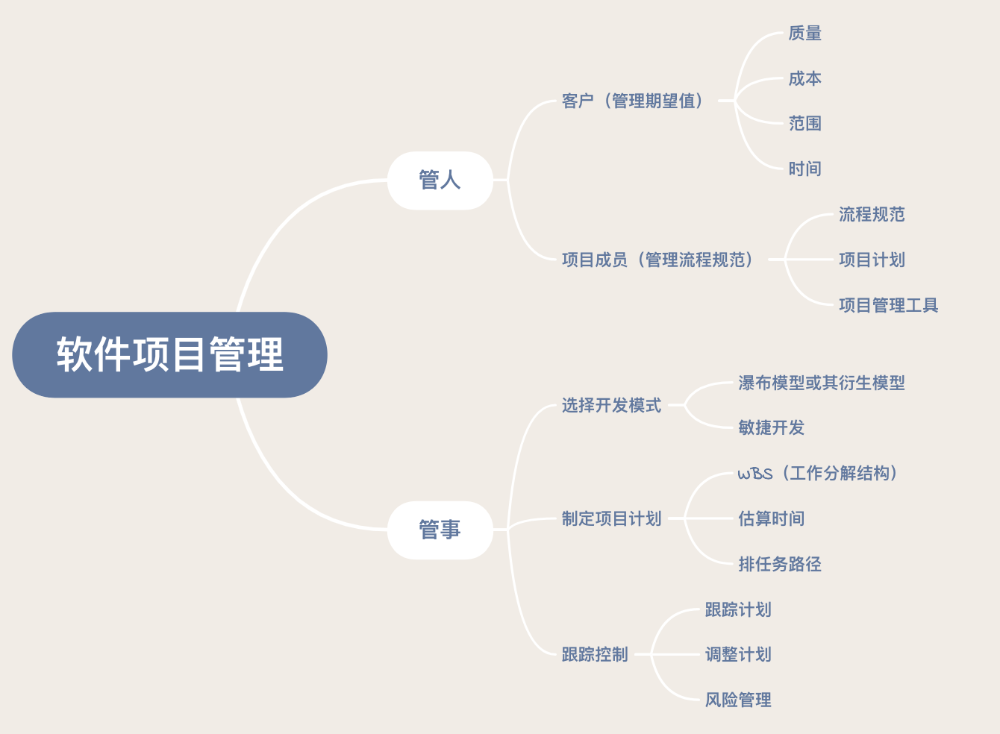
 

#### 技术转管理的一些经验教训分享

1 控制你想写代码的冲动

作为一个项目管理者，你的第一要务是管理好项目，而不是去写代码。当你控制住不去写代码以后，你才能把注意力放到团队和项目上去，去领导团队。团队出现问题时，你能及时解决、及时调整。

2 团队的成功，才是你的成功

3 形成自己的管理风格

4 坚持就是胜利

 

#### 总结

想要技术转型管理，首先从转变思维方式开始，从技术思维到管理思维，从关注细节到关注整体。然后去改变习惯，控制自己想写代码的冲动，多去从其他角度想办法。

要管理好一个项目，关键是要管理好项目中的人和事。对客户要管理好期望，对项目成员则通过合理的流程规范更好的一起协作；对于项目中事的管理就是对软件开发过程的管理，选择好开发模型很重要，然后就是制定好计划，按照计划推进，过程中不断的调整，并且管理好项目中的风险。

### 11 | 项目计划：代码未动，计划先行

#### 做技术的就不用关心计划吗？

参与做计划的过程，可以让你对项目的各种事情了然于胸，这就相当于扩大了你的上下文，让你有更高的视角看待当前工作遇到的问题。

光有目标还不够的，必须得要付诸行动。而要行动，就需要对目标进行分解，进而变成可以执行的计划。

#### 如何制定计划？

制定项目计划，通常有三个基本步骤：

- 第一步：任务分解；
- 第二步：估算时间；
- 第三步：排任务路径。

**第一步：任务分解**

把要做的事情，按照一个树形结构去组织，逐级分解，分割成小而具体的可交付结果，直到不能再拆分为止。

在制定计划时，除了要拆分任务，还需要反复思考各种可能存在的问题。

如果项目经理对技术细节不熟悉，可以邀请架构师或者技术负责人协助进行任务的分解。

 
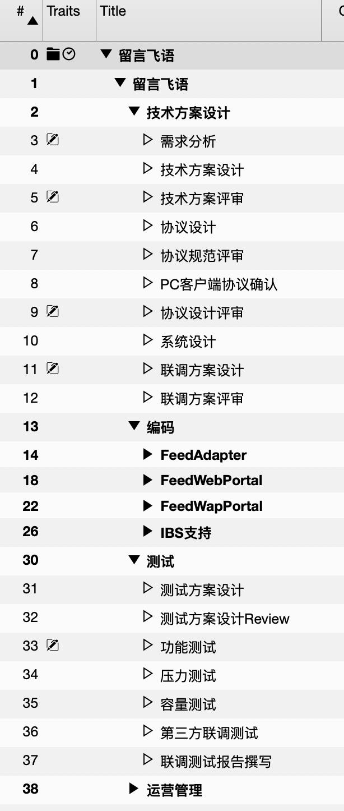
 

**第二步：估算时间；**

要想估算准确，需要从两个方面入手：

- 任务拆分的越细致，想的越清楚，就能估算的越准确。
- 要让负责这个任务的人员参与估算，消除偏差。

对于估算的结果，通常还要考虑增加一些余量，因为实际项目执行过程中，并没办法保证是100%投入，有可能并行还有其他事情，或者一些突发事情、事先没有考虑到的任务都有可能影响进度。至于加多少余量，还是要根据项目的情况和经验来判断。

关于沟通

不要采用质问的方式：“这么简单一个模块居然要5天？”这只会让听者产生逆反心理，无法有效的沟通。

沟通最好的方式就是倾听和恰当的提问。

- “能不能把你这个任务再细化一下？”
- “能不能简单介绍一下这个模块你是打算如何实现的？”

提问可以帮助双方搞清楚真实的情况是什么样的，而且也不会招致反感。同时项目经理还可以给予一些建议和支持。

 
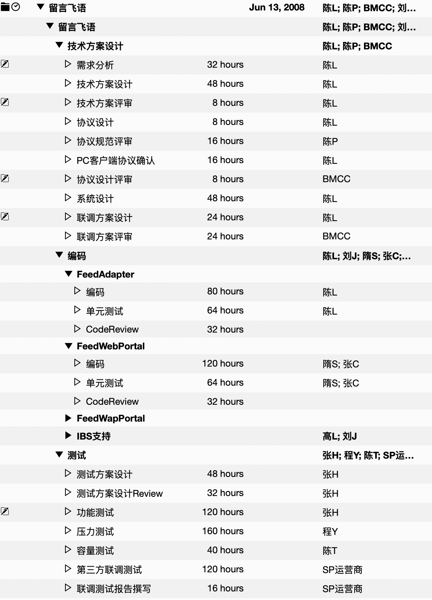
 

第三步：排任务路径。

排路径就是要根据任务之间的关系，资源的占用情况，排出合适的顺序。

排路径是一个相对比较复杂的任务，比如要注意任务的依赖关系，要注意路径的长度，尽可能让几个任务可以并行的进行，避免相互等待。如果借助像Project这种工具会让这个过程相对容易些，可以直观的看出来哪些任务是相互依赖的，哪些是同时进行的。没有MS Project这类软件，也可以用一些替代手段，例如Excel上画表格。

制定计划时不要担心不够准确，先有一个基本的计划，可以粒度比较粗，不那么准确，让事情先推进起来。

 
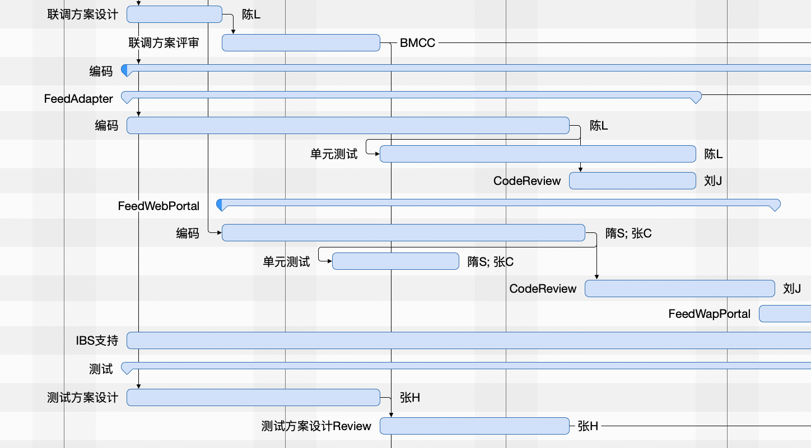
 

#### 设置里程碑

根据制订好的初步计划，确定几个关键的里程碑。

里程碑的时间点确定后，计划可以灵活调整，但里程碑一般不会轻易改变，因为里程碑代表着一份承诺。这对于项目成员来说，有两个重要的影响，一方面，成员会有很明显的来自DeadLine的进度压力，自古DeadLine就是第一生产力；另一方面，就是在里程碑完成后，大家会获得一种正面激励。

#### 计划需要跟踪和调整

项目管理中，并不是计划制定好了就完事了，还需要跟踪和调整。就好比你要开车去什么地方，设置好导航还不够，还需要沿着导航前进，如果遇到障碍或者走错路了，得要及时调整。

跟踪进度的方式主要有两种：

- 项目经理定期收集跟踪。需要沟通确认的过程，对进度会了解的更准确；
- 项目成员主动汇报。可以减少项目经理的收集工作，但有可能不准确。

敏捷开发的两个实践值得借鉴和推广

- 每日站立会议：了解每个人的任务进展情况，同时对于成员遇到的困难，其他人也可以及时给予支持。
- 看板：直观的看到每个人在干什么，进展如何。

 

#### 总结

项目计划是保障软件项目成功非常重要的手段，制定计划的过程，可以让你对项目有全面的了解，跟踪计划让你知道项目进展情况，出现问题也可以及时调整。

将任务分解、估算时间、排路径，三步就可以制定出一个项目计划，制定计划不要追求完美，制定好一个初步计划后，就可以先按照计划推进起来，进行过程中还可以继续调整细化。设置里程碑可以有效的保证项目的按时交付。

最后，并不需要当项目经理才能去制定计划，生活中每件事都可以当作一个项目，都可以去制定计划来帮助你实现目标。

### 12 | 流程和规范：红绿灯不是约束，而是用来提高效率

#### 为什么要有流程规范？

一、提升团队效率

从个体来看，因为流程规范的存在，确实可能存在效率降低的情况，但从团队的角度来看，好的流程规范反而是提升效率的。

这其实很像我们生活中的红绿灯，用一个简单的规则：红灯停绿灯行，来约束车辆行人按照指示灯行进。

从单个车辆来看，看似是因为红绿灯的存在而影响了效率，但是从整体来看，因为红绿灯的存在，有效避免了拥堵，反而是提升了大家出行的效率。

其实红绿灯除了能提高效率，还有其他好处：

- 红绿灯这样好的管理交通的经验，形成流程规范后，就可以全世界共享这种先进的经验；
- 红绿灯不再到处依赖于人指挥交通，而变成了让红绿灯的规则来指挥交通。

软件项目中的流程规范也是如此，以代码审查的规范为例，对于技术高的程序员来说，代码审查可能会耽误一点时间，但对整个团队来讲：

- 即使是水平高的程序员，也可能会被发现有错误，代码审查可以降低出错的概率，保障质量；
- 对于水平低的程序员，可以通过代码审查学习和成长，代码被高水平程序员审查后，可以有效提高质量。

管理就是管人和管事，而管人，就要借助流程规范来管理。

好的项目管理，不需要直接管人管事，而是管理好计划和流程规范；项目成员不需要按照项目经理的指令做事，而是遵循计划和流程规范。

#### 如何制定好流程规范？

制定流程规范的四个步骤
- 第一步：明确要解决的问题
- 第二步：提出解决方案
- 第三步：达成共识，推广执行
- 第四步： 持续优化，不断改进

**第一步：明确要解决的问题**

项目中很多问题，都可以思考是不是能通过流程解决。

比如说有程序员在生产环境操作，误删了数据表，造成了严重问题。如果只是对程序员进行处罚，寄希望于小心谨慎避免类似问题，那么下一次还有可能会有类似的事情发生。

如果说在流程上规范起来，例如：数据库操作之前先备份数据库，事先写好SQL语句，需要有人审查，测试环境先测试通过，最后再生产环境执行，那么就可以避免以后再出现不小心删除数据表的事情发生。

**第二步：提出解决方案**

对于问题，也不用着急马上就想着用流程规范，可以先思考解决的方法，有了方法后再进一步思考是否能提炼流程规范。

相对来说，方法更有针对性，可能只适用于特定场景或者特定人，而要将方法上升到流程规范，则需要有一定的普适性，能变成具体的步骤或者标准，让每个人都能执行。

在提出解决方案，制定开发流程时，可以参考借鉴软件工程中，大家公认的好的实践。比如说：
- 敏捷开发的流程：看板、站立会议、持续集成
- 代码规范
- 源代码管理流程
- 部署流程

**第三步：达成共识，推广执行**

在流程规范提出后，还需要得到大家认可，只有大家认可，达成共识，才能共同遵守，保障制度的执行。

对于大家都认可、很重要的流程规范，一定要让大家严格遵守，必要的时候需要配合一些奖惩制度，以保障其执行。

**第四步： 持续优化，不断改进**

流程制定后，在实际执行的时候，难免发现一些不合理或者不科学的地方，这时候就需要对其进行调整。

还有一些流程规范，随着时间推移，可能已经不能适合要求了，也需要考虑改进甚至抛弃，不然反而会成为一种阻碍。

比如说以前采用瀑布模型开发时，项目经理因为需要了解进度，所以每个项目成员要写日报，如果有站立会议了，日报这种形式就可以完全被站立会议替代，没有再存在的必要。

#### 将流程规范工具化

应该尽可能借助技术手段来推动甚至替代流程规范。

代码规范：借助VSCode这种强大的IDE，以及ESLint这种代码检查工具，可以方便的检测出不符合规范的代码，甚至于可以帮你直接格式化成满足代码规范的格式。

保证代码质量的问题，早些年必须依赖测试人员大量手工的测试，而现在借助CI（Continuous Integration，持续集成）、自动化测试和Git，可以保证代码必须在通过测试以后，才会合并到主分支，从而很好的保证了代码的质量。

 

#### 总结

流程和规范，就像红绿灯一样，不是一种约束，而是牺牲一点个体利益，提高团队效率；流程和规范将好的实践标准化流程化，让大家可以共享经验；流程和规范，让项目管理从人治变成“法治”。

要制定好项目规范，先明确要解决的问题，然后提出解决方案，看是否可以通过流程规范来解决，有了方案后需要团队成员一起达成一致，最后再推广执行。在执行过程中需要持续的优化，不断改进。

对于需要手动操作的流程，可以思考是不是能采用技术手段自动化，通过技术手段去解决。

### 13 | 白天开会，加班写代码的节奏怎么破？

#### 开会是有价值的

- 像评审会议，通过会议，可以让产品设计或架构设计在确定前，收集大家的意见，及时发现问题。
- 像每日站立会议，可以及时了解项目的进展，了解当前的困难和瓶颈，及时调整计划，解决问题。另外在会议上，每个人都要当众讲一下做过的事情和计划要做的事情，这也是一种无形的监督和约束。
- 像项目立项会议，可以创建一种仪式感，让每个人都知道项目的关键信息：项目目标、项目里程碑、角色分工、流程规范

#### 开会是有成本的

开会其实是有成本的，而且还不低。

#### 什么样的会议是有效率的？

会议是不是有效率，取决于它创造的价值是不是高于其成本。

你是砍柴的，他是放羊的，你和他聊了一天，他的羊吃饱了，你的柴呢？

#### 如何提高开会效率？

前提：那就是要让大家意识到开会是有成本的，如果开会创造的价值不能大于其成本，就是浪费。

两个角度：减少开会的成本，增加开会创造的价值！

**减少开会的成本**

- 砍掉一些没价值的会议（很多问题并不是非要通过“会议”的方式解决。）
- 减少参与会议的人
- 缩短开会时间
- 提升会议所创造的价值

会议的成本和两个因素相关：一个是人数，一个是时间。如果减少人数，就能减少成本。

每个会议要有明确的目的和主题，所有的讨论都要围绕会议目的展开。

开会后，要有明确的结论，有后续的待办事项，落实到个人，对待办事项有跟踪。

有时候一些没什么价值的会议，又必须要参加，我一般会参会前，用一个本子把一个技术难题、或者一篇博
客主题，写下来。

 

#### 总结

今天带你一起学习了解了开会的“道”，那就是开会是有价值的，开会是有成本，会议是不是高效，就看它创造的价值是不是高于其成本。

如果你想破除白天开会，加班写代码的节奏，就需要从缩减开会成本和提升开会价值的方向上去想办法，还需要让你的老板、项目经理都有“会议是有很高成本”的意识。

砍掉一些没价值的会议，减少开会的人数，缩短会议的时间，提高会议创造的价值。

### 14 | 项目管理工具：一切管理问题，都应思考能否通过工具解决

#### 项目管理工具软件发展史

一、在没有项目管理工具的年代

劣势：制订一个项目计划非常之不容易，需要专业人士花大量时间，而且每次修改调整，都要再花费大量时间精力。

二、最初的项目管理软件：项目计划工具

优势：解决了计划制订的问题

劣势：不方便跟踪任务进度，进度不直观等。

三、基于Ticket的任务跟踪系统

优势
基于Ticket去跟踪任务，不再需要通过日报、一对一会议的方式来收集任务执行情况，负责Ticket的项目成员在完成任务后，会直接修改Ticket的状态，这样其他人就可以看到Ticket是否已经完成。

Ticket通过各种不同状态，例如未开始、开发中、完成等，可以很直观的了解任务的进展，这就避免了任务难以量化的问题。

Ticket跟踪系统和敏捷开发也是很好的搭档。在敏捷开发中，产品Backlog（产品待办任务列表）是一个用来放所有产品的待办任务的清单，在每个Sprint开始前的迭代计划会议上，从产品待办任务清单里面选取一部分任务到Sprint的待办任务清单（Sprint Backlog）中。

当使用Ticket跟踪系统后，就可以把所有产品的待办任务用Ticket都记录起来，当我们在迭代计划会议上选取好任务后，就标记为要在当前Sprint完成，这样后面就可以方便的筛选出属于当前Sprint的所有Ticket，这样大家就可以从Ticket跟踪系统知道我们这个Sprint有哪些Ticket需要完成、进展如何。

劣势
整体的Ticket状态还不是很直观，例如不能清楚的看到哪些任务在进行中，哪些任务待领取。

四、基于看板的可视化任务管理

现在的Ticket任务跟踪系统几乎都会有看板视图，通过看板可以很直观的看到当前任务进展情况。

 
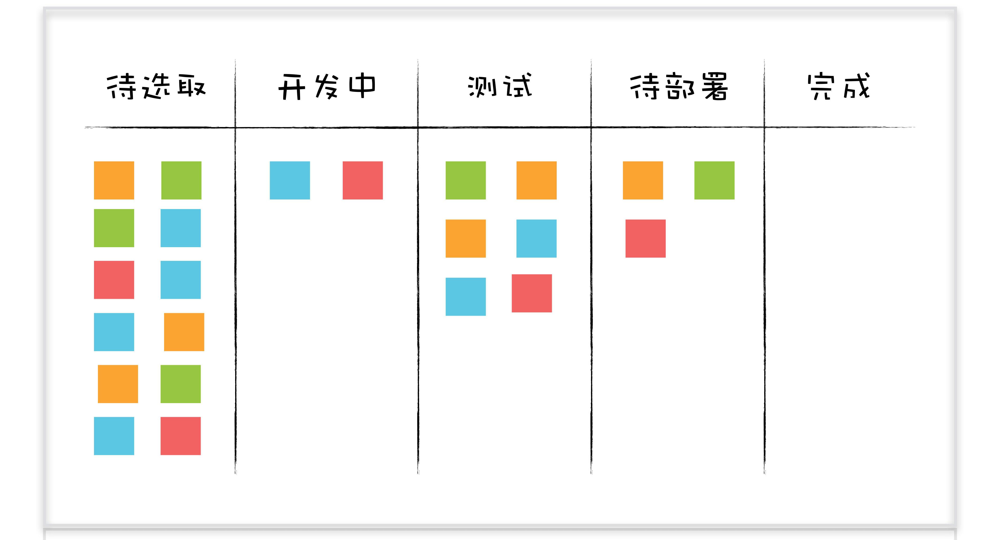
 

#### 有哪些项目管理软件可以选择的？

如果单纯是项目计划工具，功能最好、最全的应该是微软的MS Project，但遗憾的是只能运行在Window上，不支持Mac平台。如果要在Mac上使用项目计划工具，可选的有OmniPlan和Merlin Project。

基于Ticket的任务跟踪系统，最有名的应该是Atlassian公司出品的Jira软件，功能全面，体验很好。Jira主要是在海外比较流行，因为访问速度和使用习惯等原因，国内用户要相对少一些。

同类产品也很多，微软的Azure DevOps （以前叫TFS, Team Foundation Server），和微软系的产品如Visual Studio、Azure可以很好的整合。

代码托管平台GitHub本身也集成了一套Issue跟踪管理系统，虽然没有Jira那么强大，但是对于普通项目来说，足够用了。尤其是对于开源项目，完全可以基于GitHub的Issue进行日常的项目管理。

 

#### 总结

今天我带你一起了解了软件项目管理工具的发展历史：从完全手工方式管理项目，到借助计划工具分解安排计划，到基于Ticket跟踪管理任务，再到基于看板的任务可视化。每一次工具的升级，都是对项目管理工作的一次简化。

合理的使用项目管理工具，可以帮你极大提高管理效率，起到事半功倍的效果。我也列举了一些目前国内外主流的项目管理工具，希望可以帮助你做出选择。

最后，对于日常项目管理的问题，你也可以多思考是不是可以由工具或者技术手段来解决的。

### 15 | 风险管理：不能盲目乐观，凡事都应该有B计划

#### 什么是风险管理？

风险是指不确定的事件，一旦发生，将会造成消极的影响。

**风险包含两个方面的内容：风险 = 损失 x 发生概率。**

风险管理就是指在项目进行过程中，识别可能的风险，对风险进行评估，并加以监控，从而减少风险对项目的负面影响

#### 风险管理重要吗？

对软件项目风险的管理，才是体现项目管理水平的地方。

应对风险的层次：
- 被动应对：风险已经发生，造成了问题才被动应对；
- 有备无患：事先制定好风险发生后的补救方案，但没有任何防范措施；
- 防患未然：对可能的风险做出防范，并把风险防范作为项目任务的一部分。

> 案例：拼多多被“薅羊毛”事件 \
> 2019年1月20日凌晨，拼多多平台出现系统漏洞，用户可以领取100元无门槛券。因此开始出现大批用户借此“薅羊毛”，利用无门槛券下单虚拟商品，例如充话费或Q币等等，并一度有消息传出，拼多多将因此损失200亿元。

这个事件追究原因的话，当然可以说是开发代码没写好，可以说是测试没测好，也可以说运维没有监控好。

但另一个角度讲，如果这个项目的负责人有一点风险意识，做了风险管理，即使出现这样的问题，损失也一定不会这么大。

#### 如何做好风险管理？

**培养风险意识**

项目中的任务，不能盲目乐观，都思考一下它最坏的结果是什么，如果最坏的结果不能接受，就说明要有个B计划，考虑风险管理了。

**如何对风险进行管理？**

第一步：风险识别，识别可能的风险

软件项目的风险主要分成以下几类：

- 项目风险：项目预算、进度、用户和需求等方面的问题；
- 人员风险：人员离职、人手不足等问题；
- 技术风险：采用的技术所可能带来的风险；
- 商业风险：与市场、产品策略等有关的商业风险。

第二步：风险量化，对风险进行评估量化

在风险识别出来以后，需要从两个方面去评估：
- 发生的概率多大？
- 发生后，后果多严重？

对于概率大，后果严重的风险，需要高优先级重点考虑；对于概率不高但后果严重的问题也要考虑，不过优先级略低；对于概率高但后果不严重的风险事件，可以优先级很低或者不考虑；对于概率低后果不严重的，则可以不予考虑。

第三步：应对计划，对风险制定应对策略

针对风险，主要分成以下几个策略。

 
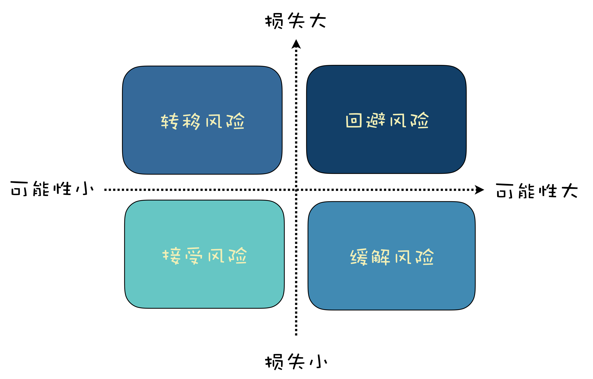
 

- 回避风险——更改导致风险的方案
- 转移风险——将损失转嫁出去
- 缓解风险——降低风险发生概率或减少可能造成的损失
- 接受风险——明知山有虎偏向虎山行

第四步：风险监控，对风险进行监控预警

要做好监控，第一要能对监控的内容量化，第二要设置阈值，第三就是要有后续的报警和处理机制。

很多公司都已经建立了自己的监控系统，将关键数值量化，并设置阈值，超过阈值后自动触发报警机制。

一个简单的例子就是服务器宕机了，监控系统发现机器没响应了，自动通过邮件、短信、电话等方式通知正在值班的人员。

 
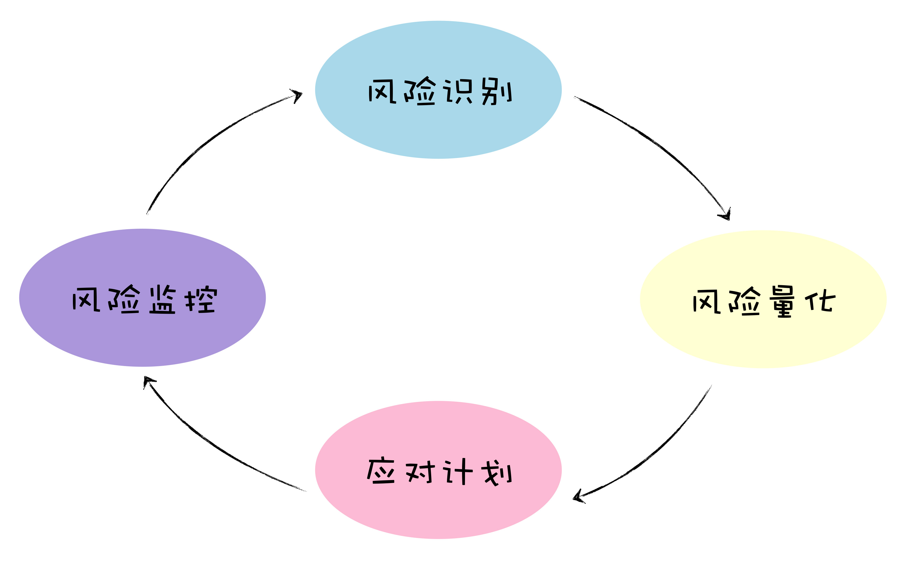
 

#### 总结

今天带你一起学习了软件项目管理中的风险管理知识。软件项目中的风险就是指那些不确定的但是可能会造成消极影响的事件，通过对风险的管理，可以有效降低风险发生的概率，减少风险发生后的损失。

软件项目风险管理包括风险识别、风险量化、应对计划和风险监控四个过程，这四个过程是一个循环的过程，需要在项目中持续进行。

希望你在学习后，能提高风险意识，不能盲目乐观，凡事都应该有B计划。并且能将学到的风险管理知识应用到项目中，做到对可能的风险了然于胸，未雨绸缪，运筹帷幄。

### 16 | 为什么你不爱写项目文档？

#### 为什么要写文档？

- 帮助写文档的人理清楚思路
- 先写文档，就会抛开代码细节，去站在全局思考
- 便于未来的维护和交接
- 团队更好的协作沟通

#### 如何写好文档？

1. 从模仿开始。不妨去找一个类似的文档，模仿着写试试。
2. 从小文档开始
3. 从粗到细，迭代更新
一开始不用写很细的文档，一方面太难写，另一方面写得越细则无用功越多，最后，你甚至会因为不想改文档而抵触不同的意见。
4. 一些基本的画图的技巧
写文档的时候，主要有几种图比较常用：线框图、流程图、时序图、各种格式的截图。

线框图

 
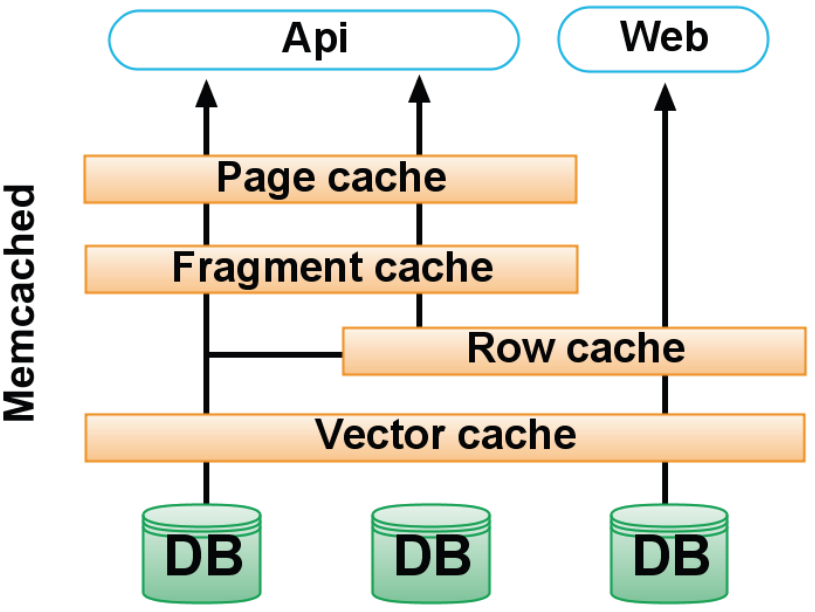
 

流程图

 
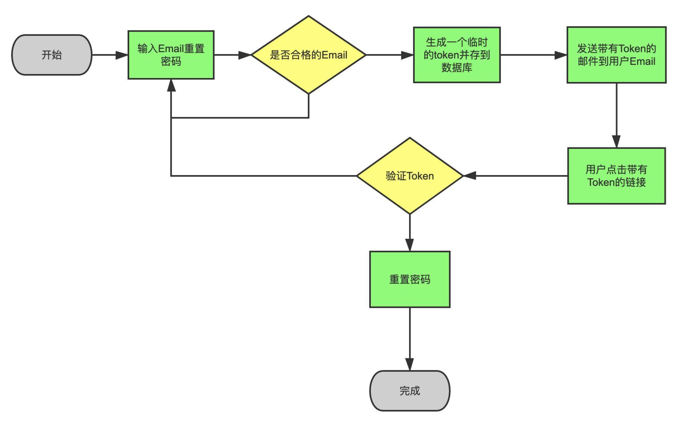
 

时序图

 
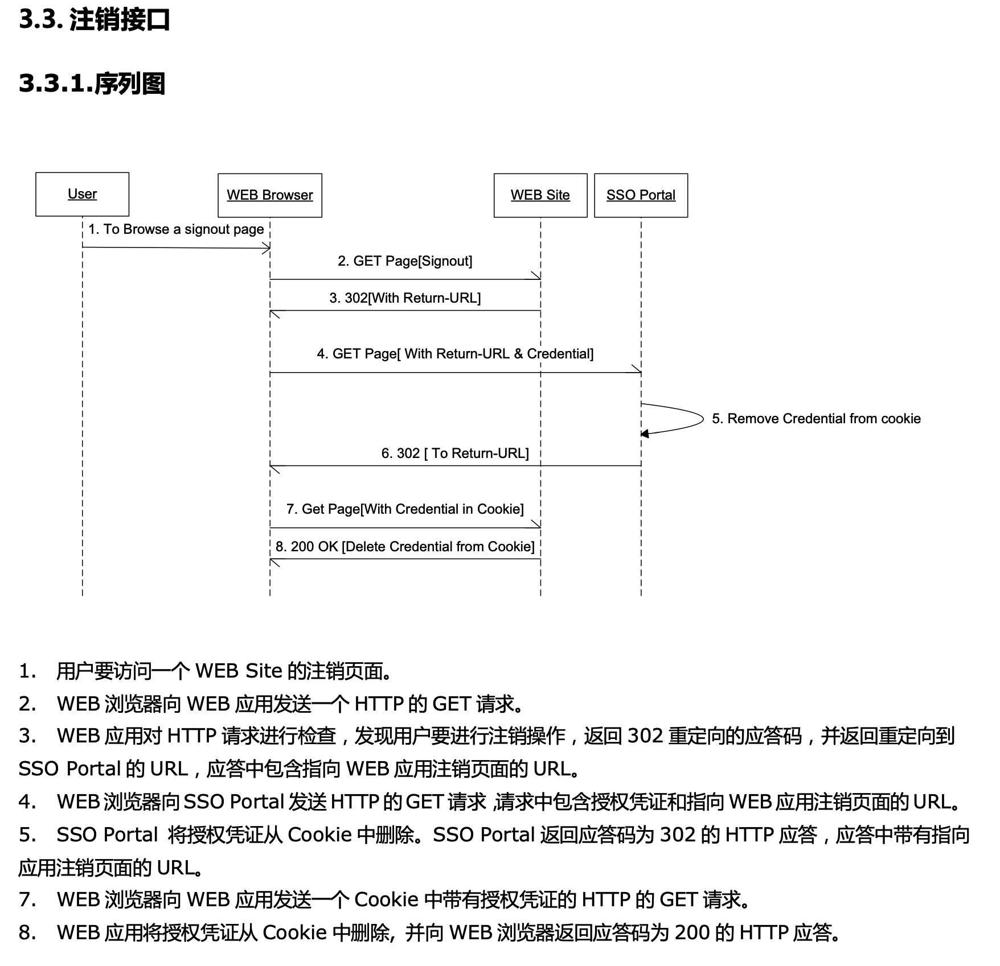
 

各种格式截图

把软件的UI、交互设计的效果、数据趋势图、数据统计图等直接截图，必要的话配上一些箭头、文字，也可以很好的说明清楚问题。尤其是产品设计文档，经常用到。

#### 一些关于文档的其他建议

不需要为代码写很多文档，好的代码格式，良好的注释、完善的单元测试可以很大程度上代替针对代码而写的文档。

Markdown是一种非常好的文档格式，可以让你更专注于内容上，而不是文档格式上面。

在线文档工具优于离线文档工具，在线文档有很好的版本管理，也更方便多人协作。像Github WIKI、石墨文档、Google Docs、Evernote等都是非常好的在线文档工具。

对于文档的撰写，要作为一个正规的项目任务进行，安排人、安排时间，放到项目计划中去。就像前面说的“懒得写”文档的情况，一旦把文档当成一个与开发同等重要的任务去执行，就没有借口去犯懒了。

重要的是，文档的写作一样需要多练习，写的越多，就越熟练。

 

#### 总结

今天，带你一起分析了为什么不爱写项目文档的原因，也解释了为什么写文档很重要。

没时间写或者懒，不能成为不写文档的理由。对于重要的项目文档，就应该加入到日常的开发任务中，把写文档，摆在和设计、开发同等重要的位置。从某种角度来说，写不好文档，代码也很难写好。

针对程序员不爱写项目文档的情况，我也提出了切实可行的写文档的方法。比如说不会写，就可以从模仿别人写的文档开始，然后从粗到细，不断迭代，配合一些图表，就可以写出不错的项目文档。

## 需求分析篇

### 17 | 需求分析到底要分析什么？怎么分析？

#### 什么是需求？

用户需求是由用户提出来的，期望满足自身一定需要的要求，例如用户说：“想要一个给三个孩子玩的秋千。”这种原始的用户需求通常是不能直接做成产品的，需要对其进行分析提炼，最终形成产品需求。

产品需求就是在分析提炼用户真实需求后，提出的符合产品定位的解决方案。就像上面“在树上栓两绳子，再吊一块板子”，就是产品经理针对用户需求提出的解决方案。

#### 需求分析是要分析什么？

用户需求的分析，主要经过三个步骤：

- 第一步：挖掘真实需求；
- 第二步：提出解决方案；
- 第三步：筛选和验证方案。

第一步：挖掘真实需求

要分析用户的真实需求，可以从三个角度入手。

- 目标用户：用户不同，诉求也不一样；
- 使用场景：使用场景不一样，解决方案也会有所不同；
- 想要解决的问题：用户背后想要解决的问题是什么。

福特汽车创始人亨利福特说过的：如果我最初是问消费者他们想要什么，他们应该是会告诉我，“要一辆更快的马车！”想要更快的马车只是用户自己能想到的解决方案，而他想解决的问题是“更快更舒适的出行方式”。

第二步：提出解决方案

我们知道了目标用户，其使用场景和想要解决的问题，就可以结合产品定位，提出相应的解决方案。

比如针对想要“更快更舒适的出行方式”日常出行的乘客，我们就可以提出汽车的解决方案，而不一定要局限于马车，汽车能更好的满足用户需求。

针对三个孩子想有一个在户外一起玩的娱乐设施这个需求，我们可以提供一个轮胎式的秋千，就可以很好的满足他们的需求，我们甚至可以建一个小型游乐园。

第三步：筛选和验证方案

在选好方案后，还需要对方案进行验证，以确保方案能解决用户需求。

在传统瀑布模型中，选定方案后，会写成产品设计文档，走相应的评审流程，评审完成后再进行设计、开发和测试，测试完成后会让客户再进行验收。

而敏捷开发，在整个开发过程中，每个迭代或者关键的里程碑，也一样需要客户进行验收。

#### 怎样做需求分析？

而软件项目的用户需求，从来就不是单一的，而是一系列需求，所以对于软件项目的需求分析，还需要增加收集整理的步骤。整个过程是迭代进行的，如下所示：

- 收集需求：对用户需求进行收集整理
- 分析需求：对需求进行分析，挖掘用户真实需求
- 需求评估：筛选过滤掉不可行的需求
- 需求设计：针对用户需求提出解决方案，设计成产品方案
- 验证需求：验证方案是否可行

 
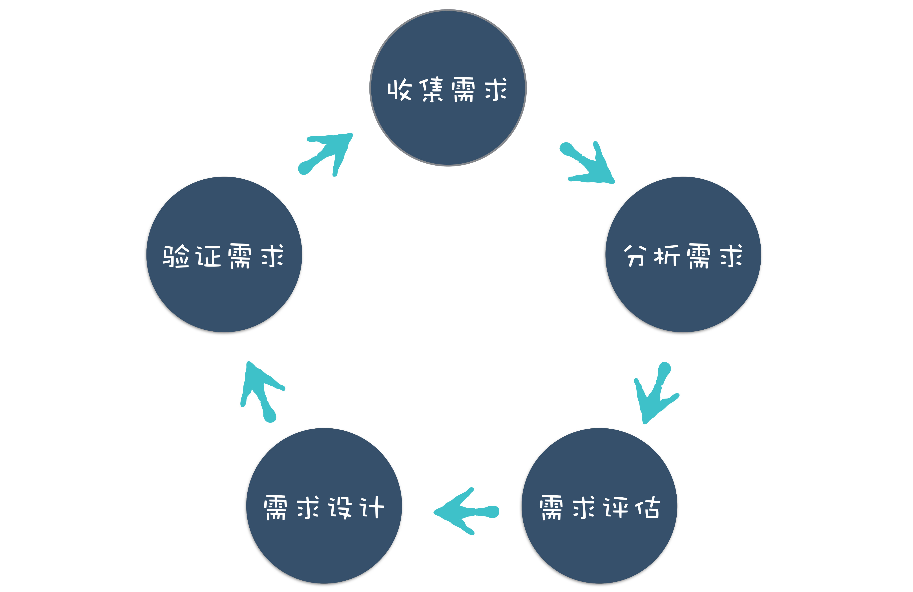
 

1.收集需求

收集用户需求有很多方法，这里列举部分：

- 头脑风暴：就是大家一起开会头脑风暴讨论；
- 用户调研：通过调查问卷或者访谈，通过问用户一些问题收集反馈；
- 竞品分析：通过分析其他同类产品的功能获得需求；
- 快速原型：通过原型来收集反馈，收集确认需求。

2.分析需求

用户需求背后的真实需求有三个层次：

- 表层需求：用户对解决问题的期望，例如马车更快；
- 深层需求：用户的深层次动机，诉求产生的原因，例如乘客对出行速度的要求；
- 底层需求：人性本能的需求，例如对安全感对舒适的追求。

3.需求评估

需求评估考虑的因素有：

- 可行性：技术能否实现；
- 成本：人力成本、时间成本；
- 商业风险和收益：有没有商业上的风险，收益是否合理；
- 紧急性与重要性：是不是用户迫切的需求。

 
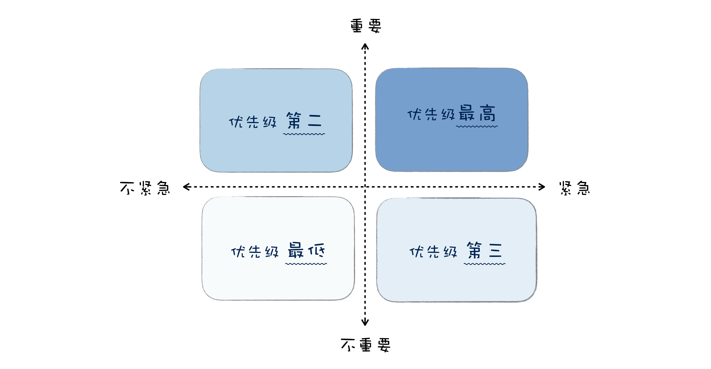
 

4.需求设计

在分析和评估完需求后，还需要提出解决方案，也就是对需求进行设计，做出来有效的产品设计方案。最终的产品设计，会落实到人机交互上面，用户可以通过软件界面交互。

现在产品设计方面，各个平台都有一套比较成熟的界面标准控件，大部分产品设计都可以基于标准界面控件，组合成满足需求的用户界面，在满足功能的前提尽可能做的易用和美观。

在需求设计的时候，可以用草图、原型设计工具、界面设计工具进行设计。

5.验证需求

在需求设计好后，还需要进行验证，看解决方案是否能满足用户的需求。

对需求的验证方式其实是贯穿整个软件项目生命周期的，在需求分析阶段，会反复验证确认设计好的需求是否满足用户的真实需求，例如各种设计评审。

在产品开发完成后，也需要有需求的验收，以确保开发出来的软件产品是客户想要的，满足客户需求的。

 

#### 总结
今天带你一起学习了软件工程中一个非常重要的知识点：需求分析。

需求分析，就是一个将用户需求变成产品需求的过程。要做好用户需求的分析，需要找出来隐藏在用户需求背后的真实需求，还要针对用户的真实需求提出解决方案，最终验证方案是不是能满足好用户需求。

需求是整个产品的源头，很多软件项目失败的原因就在于没有做好需求分析，软件中很多浪费也来源于需求没想清楚导致的返工。做好需求分析对于软件项目来说非常的重要。

要做好软件项目的需求分析，需要做好需求的收集整理工作，然后对收集好的需求进行科学的分析，评估是不是可行以及划分优先级，对可行的需求项进行设计，最后还要验证设计出来的结果是不是满足需求。

希望你通过这节课的学习，能科学地运用好需求分析的知识，对项目的需求分析把好关，保证最终产品能满足用户需求，超出用户预期。

### 18 | 原型设计：如何用最小的代价完成产品特性？

#### 原型设计的发展历史

快速原型模型
快速原型模型就是，第一阶段确认界面布局和内容，第二阶段确认交互，第三阶段实现。

低保真原型设计
画线框图

中等保真原型设计
使用Axure这样专业的原型设计软件

高保真原型设计
先用低保真原型快速确认清楚需求，再用高保真原型确认最终的交互和UI设计。

就这样，原型设计从最开始的一种快速开发模式，逐步演进成了今天的原型设计工具。让产品经理不需要会编程知识，也可以做出很酷的软件原型，从而可以低成本、高效率的确认清楚产品需求。

#### 怎么做好原型设计？

第一步：分析

在原型设计时，通常属于需求的最初阶段，需求还是很模糊、不具体的。所以这个阶段首先要做的，就是要对用户的需求有个初步的了解，分析清楚原型设计的目标是什么。

第二步：设计

在对需求进行初步分析后，需要开始对原型进行整体设计。在设计阶段，主要从两个维度来考虑：

- 从信息架构的维度，考虑清楚整个产品的信息架构，划分出模块；
- 从使用流程的维度，考虑清楚界面之间的流程。

第三步：实施

在设计好整体的信息架构和使用流程图后，就可以开始对每个界面画流程图了。

在具体到界面时，要优先考虑满足产品需求，然后是让界面好看好用。

第四步：验证

原型设计完成后，还需要一个很重要的环节就是验证，产品经理自己反复验证几遍，如果发现有流程上走不通或者使用不方便的地方先自己调整。调整好了交给其他人去体验，让他们提出反馈意见。

一般在正式的项目中，针对原型设计，需要有相应的评审会议，让大家提出反馈，根据反馈再作出调整。

#### 如何选择合适的原型设计工具？

原型设计工具，选择非常多。我建议你选择的时候，可以从几个维度考虑：

- 面向的平台：Web、桌面、手机；
- 保真度：中等保真度还是高保真度；
- 功能：是否满足你的要求；
- 成本：价钱是否可以接受。

 

#### 总结

今天带你一起了解了原型开发的演变历史。原型开发，从一个软件开发模型，逐步演变成了一个需求设计工具，让产品经理不用依赖程序员就可以作出逼真的产品原型，也大大降低了项目成员了解需求的难度。

原型设计，让产品经理可以用最小的代价完成产品特性，逐步成为产品经理确认需求、设计产品最重要的沟通工具。原型设计工具有很多可以选择的，建议从面向的平台、保真度、功能和价格等多方面因素综合考虑。

要做好原型设计，可以结合工程方法，分成四个阶段：分析、设计、实施和验证。

- 分析阶段，搞清楚用户的需求，原型设计的目标；
- 设计阶段，划分好产品的信息架构，设计好产品操作的流程；
- 实施阶段，按照设计的结果，对每个界面制作原型，并做好界面之间的链接；
- 验证阶段，和项目成员、客户进行确认，收集意见反馈，根据反馈进行修改。

如果你的项目还没有把原型设计作为确认需求、设计产品的沟通工具，可以考虑推广应用起来，不仅上手容易，而且可以帮你降低确认清楚需求的成本。

如果你打算做自己的产品，先不要着急动手写代码，不妨先做一个原型出来。

### 19 | 作为程序员，你应该有产品意识

#### 程序员的价值

第一，你的价值体现在你所做的产品之上。

你所做的产品越有价值，你的价值就越大，相应的工资就也会高。

这也解释了为什么同一个公司内，负责热门产品的部门，奖金都能多分一点；在效益好的公司，不但不担心裁员，反而钱也拿的多。这些年程序员的待遇相对于其他行业要高，也主要是因为软件和互联网行业的产品估值高。

所以说，程序员的价值，并不完全是体现在技术上的，而在于用技术做成了产品，产品创造了价值，再回过头来成就了程序员的价值。

第二，你的价值体现在团队中的稀缺性。

那些价值高的程序员通常在技术上或者技术之外都有一技之长：

- 有的程序员能搞定别人搞不定的技术难题；
- 有的程序员擅长培训新人；
- 有的程序员擅长和业务部门沟通；
- 有的程序员能高质量地完成功能模块；
- 有的程序员能按照需求设计好的架构，可以让团队高效率低成本地完成需求。

那怎样来提升价值呢？努力提升自己技术水平，让自己成为技术大牛，这肯定是每个程序员都坚持在做的事。但技术水平提升到一定程度后，会有瓶颈的，进展会非常缓慢。

这时如果也在其他领域同步发展，就会起到事半功倍的效果。比如说有的程序员会发展写作能力，写很多好的技术文章，在业界具有影响力；有的培养产品意识，让自己在技术之外，还能更好理解产品需求，能很好地和产品经理沟通，根据业务需求做出好的设计，写出高质量代码，帮助团队在项目过程上做的更好。

写作固然是提升个人价值很好的方式，但要在写作上有成就，需要建立在长时间不断练习的基础上。而产品意识，是程序员的固有思维中比较欠缺、正好可以互补的，相对比较容易掌握，也能取得明显的效果。

#### 什么是产品意识

商业意识

所谓商业意识，就是所做的产品是要有商业价值的。

比如说程序员热衷于做个Github客户端、博客系统，虽然说确实有用，但是却没什么商业价值，没有用户愿意付钱，导致难以持续。

商业意识的另一方面其实是成本，成本意识也是程序员容易忽视的

比如说：

- 有时候为了炫技，采用了更难更酷的技术方案，而忽视了所采用的方案会导致很高的开发成本；
- 花了太长时间去开会而忽略了开会的成本；
- 有时候又为了省钱，舍不得买一些成熟的商业组件或服务，反而是浪费了更多成本。

如果程序员有商业意识，就可以在项目中有更好的成本意识，为项目节约时间、经济等成本，帮助团队打造更有价值的产品。

用户意识

所谓用户意识，就是说做产品时，你要能挖掘出用户的真实需求，让产品有好的用户体验。这需要你要有同理心，能站在用户的角度去思考和体验产品。

如果程序员能跳出纯技术的局限，多一点用户意识，想到的问题将会多了很多维度，比如说：

- 能让自己的负责的模块有更好的体验；
- 让自己的技术方案更好地满足用户需求，用户更满意；
- 让自己设计的接口、API更好用，与同事愉快合作。

数据意识

所谓数据意识，就是在产品设计、产品运营时，通过数据来发现问题、证实结果。

典型的有A/B测试，通过数据来发现用户更喜欢哪个功能，哪个功能带来更多的收入。像微博的“时间乱序”功能，虽然很多大v吐槽，但是数据证明了这是一个好的产品设计，最终还是一样上线。上线后新浪根据数据不断优化，到现在反倒是很多人喜欢这个功能。

程序员虽然逻辑很好，但是大多对数据倒是不敏感，对编译警告、测试覆盖率、程序Crash的比例、API错误率、一个函数内上千行代码、性能指标等等这些数据经常选择性忽略。

还有个典型的例子就是语言框架之争，程序员经常为某些语言或者框架争论不休，其实不妨基于数据分析，讨论上会更加客观。

#### 如何培养产品意识？

首先要解放思想

解放思想，其实就是说，对于程序员，不要总是单纯的用技术眼光看问题，也可以从产品的角度看问题。

技术思维会关注用什么技术，关注技术细节，关注功能“如何”实现；产品思维会关注用户体验，关注一个功能所创造的价值，会去思考为什么要或者不要一个功能。

> 举个例子，办公聊天软件Slack可能很多人都知道，是一款在线沟通协作软件。在国内可能知名度要低一些，但是在海外有大量企业用户，非常的火。
>
> 这款软件在刚出来的时候我就知道，不过那时候我觉得这不就是一个聊天室么，我都能写一个！我站在技术角度也做了不少分析：
>
> - 这个软件前端还是用的jQuery，如果用React应该可以做的更好；\
> - 这个软件跨平台是基于HTML5，如果是原生代码也许性能可以更好；\
> - 还是REST API，如果用GraphQL那API请求效率会更好；\
> - 从国内访问的话，速度太慢了，应该架设一些国内的服务器或者CDN。
>
> 而现在，我会同时也从产品角度分析Slack：
>
> - 它的商业价值，在于它把工作的沟通，变得高效又好玩；\
> - 消息都在云端，检索也方便，也不担心像微信一样换设备消息就没了；\
> - 其开放API的设计，让它和很多其他办公软件可以无缝集成，极大提升了效率；\
> - Slack需要付费才能查看到10000条之前的消息，这是个很有意思的设计，当你已经有10000条消息时，说明已经有足够的意愿去付费了。

然后要改变习惯

改变习惯是是指在日常使用产品、开发产品的时候，多站在产品的角度思考，去思考它的商业价值、用户体验、使用场景等等。

比如你学习专栏用的极客时间App，你聊天用的微信。使用一些具体功能时，可以思考一下这些问题：

- 这个产品的商业价值是什么？
- 为什么要有这个功能？是为了满足用户哪方面需求的？
- 这个产品目标用户是谁？
- 这个功能的使用场景是什么？
- 这个功能的体验好不好？有没有更好的方式提升体验？

如果你是程序员，在开发功能、设计架构的时候，也不妨跳出技术之外，从产品角度思考一下：

- 这个功能的需求是什么？我是否完全理解了需求？
- 如果你是这个功能的用户，你觉得还有哪些地方值得改进？
- 哪些技术可以帮助提升用户体验？
- 这个API用起来是不是好用？有没有更好的设计？
- 除了对产品的思考，日常工作中，遇到一些问题，也可以从产品思维的角度去想想。

最后要多实践

不妨在业余时间做个小应用程序，或者设计一个原型，做完了再找你的朋友试用一下，让他们提提意见。在做产品的过程中，你自然会去站在产品的角度去思考，这会让你对产品方面有更多感悟。

其实不用担心没有什么好的想法，可以从日常生活中，自己的需求、家人和朋友的需求中，去找到合适的产品需求。我当初做过很多产品都是这样的来的：

- 给孩子照的照片太多，写了个工具批量生成缩略图；
- 老婆工作上需要经常对网页截取整张图片，设计一个帮助截图的工具；
- 帮父亲建了个家谱应用；
- 给校友们建了一个网上交流的论坛，写过一个论坛系统。

 

#### 总结

今天，我们一起分析了程序员的价值体现，主要体现在两方面：所创造产品的价值和自身的稀缺性。程序员有产品的意识，可以帮助产品和自身提升价值。

产品意识，主要包括商业意识、用户意识和数据意识。要提升产品意识，首先要解放思想，然后要改变习惯，最后要多实践。

当你慢慢培养了产品意识，不仅可以通过技术来打造更高价值的产品，也可以让你在技术之外有一技之长，能在项目中创造更大价值，减少技术快速革新带来的焦虑感。

### 20 | 如何应对让人头疼的需求变更问题？

#### 管理需求变更常见的解决方案

方案一：增强需求变更流程，让需求变更规范起来。

通过严格的流程，来避免一些没有意义的变更，从而达到管理需求变更的目的。

方案二：快速迭代，缩短版本周期。

将大的功能拆分，每个版本周期仅实现一部分功能需求，周期较短，这样需求发生变更时，就可以快速响应。

不要满足现状，思考一下这两个问题：

- 这些方案是否解决了你当前项目的问题？
- 如果换一个项目环境，当前方案是否依然适用？

#### 为什么建筑工程中少有需求变更？

- 原因一：需求的确定性
- 原因二：需求变更的成本

#### 如何解决需求变更问题？

既然需求变更的原因是需求不确定和需求变更成本太低，那么我们就针对性地提出相应的解决方案：

- 提升需求确定性，把需求分析做好，减少需求变更；
- 提高需求变更的成本，让客户或者产品经理不能太容易就变更需求，这样就可以达到减少需求变更的目的。
- 降低响应需求变更的成本，可以方便快捷地响应需求变更。

 

#### 总结

今天我通过对比建筑工程中的需求变更，和你一起分析了软件工程中需求变更产生的原因。需求频繁变更，主要是由于需求不确定和变更成本过低导致的。并由此提出了三种不同的解决方案。

提升需求确定性，来减少需求的变更。这种方案的优势就是对需求理解透彻，后期返工少，缺点是对产品经理的需求分析能力要求很高。

提高需求变更的成本，规范需求变更流程，减少需求变更。这种方案的优势就是可以马上起到效果，缺点就是过于繁琐的流程不利于项目协作。

降低响应需求变更的成本，积极应对需求变更。这种方案的优势在于可以快速响应需求变更，能快速试错尽快调整，缺点在于对软件架构和项目管理要求比较高。

## 系统设计篇

### 21 | 架构设计：普通程序员也能实现复杂系统？

#### 为什么软件项目需要架构设计？

复杂的软件项目，通常有两个特点：需求不确定和技术复杂。

 

 

需求不确定，前面讲了，我们主要来看看技术的复杂性。技术的复杂性，主要体现在四个方面。

1.需求让技术变复杂

做一个个人博客网站，和做一个淘宝这样的网站，技术复杂度是有天壤之别的。

要响应需求的变化，也会让技术变复杂。对于明确的需求，相对来说技术实现是容易的。但是，随着需求地不断变化，新的需求可能会破坏原有的代码架构，导致系统越来越臃肿复杂，维护也越来越难。

2.人员会让技术变复杂

现在软件开发通常不是一个人，而是一个团队。团队成员水平不一样，擅长的技术方向也不一样，让这一群人有效地协作也是很大的考验，简单的技术问题也会变成复杂的技术问题。

3.技术本身也是复杂的

现在软件项目中选择编程语言、框架、技术组件、数据库等技术或工具，还可能需要应用像微服务、大数据、人工智能技术，这些技术本身就是复杂的，普通人都需要通过一定的学习才能掌握。

4.要让软件稳定运行是复杂的

软件在开发完成后，要发布运行，但运行时也充满了各种不确定性。比如说明星发布八卦可能会导致微博宕机；阿里云宕机导致很多基于阿里云的系统也跟着一起无法提供服务。

技术复杂性，导致开发成本很高，而架构设计恰恰可以在这些方面很好地解决技术复杂的问题。

首先，架构设计可以降低满足需求和需求变化的开发成本。

对于复杂的需求，架构设计通过对系统抽象和分解，把复杂系统拆分成若干简单的。就像淘宝这样复杂的网站，最终拆分成一个个小的微服务后，单个微服务开发的难度，其实和个人博客网站的难度已经差不太多了，普通程序员都可以完成，降低了人力成本。

其次，架构设计可以帮助组织人员一起高效协作。

通过对系统抽象，再拆分，可以把复杂的系统分拆。分拆后，开发人员可以各自独立完成功能模块，最后通过约定好的接口协议集成。

再次，架构设计可以帮助组织好各种技术。

架构设计可以用合适的编程语言和协议，把框架、技术组件、数据库等技术或者工具有效的组织起来，一起实现需求目标。

比如说经典的分层架构，UI层通过选择合适的前端框架，例如React/Vue实现复杂的界面逻辑，服务层利用Web框架提供稳定的网络服务，数据访问层通过数据库接口读写数据库，数据库则负责记录数据结果。

最后，架构设计可以保障服务稳定运行。

现在有很多成熟的架构设计方案，可以保障服务的稳定运行。比如说分布式的架构，可以把高访问量分摊到不同的服务器，这样即使流量很大，分流到单台服务器的压力并不大；还有像异地多活这样的架构方案可以保证即使一个机房宕机，还可以继续提供服务。

其实，满足需求和需求变化、满足软件稳定运行是架构的目标，对人员和技术的组织是手段。架构设计，就是要控制这些技术不确定问题。

我们也可以说：架构设计，就是通过组织人员和技术，低成本满足需求以及需求的变化，保障软件稳定高效运行。

#### 什么是架构设计？

架构设计的目标，是用最小的人力成本来满足需求的开发和响应需求的变化，用最小的运行成本来保障软件的运行。

架构设计，已经有很多成熟的方法。比如说：

- 使用微服务这样的架构，把复杂系统拆分成一系列小的服务，服务再拆成功能模块，让人员更好地分工协作；
- 通过前后端分离，让程序员更专注于某个知识领域，降低开发难度；
- 用分层设计来隔离业务逻辑，减少需求变更带来的影响。

这些架构设计的方法，其实都是基于工程领域分而治之的策略，本质上就是将系统分拆，将人员分拆。但是光拆还不够，拆完了还得能拼回来，所以你要清楚架构设计的“道”。

架构设计的道，就是组织人员和技术把系统和团队拆分，并安排好切分后的排列关系，让拆分后的部分能通过约定好的协议相互通信，共同实现最终的结果。

#### 如何做好架构设计？

第一步：分析需求

第二步：选择相似的成熟的架构设计方案

第三步：自顶向下层层细化

第四步：验证和优化架构设计方案

 

#### 总结

今天，我们一起学习了软件工程中一个非常重要的知识，那就是架构设计。

架构设计，是为了控制软件项目中技术复杂的问题。架构设计，通过组织人员和技术，低成本满足需求以及需求的变化，保障软件稳定高效运行。

架构设计可以通过四个基本步骤：

- 第一步：分析需求；
- 第二步：选择相似的成熟的架构设计方案；
- 第三步：自顶向下层层细化；
- 第四步：验证和优化架构设计方案。

通过良好的架构设计，可以有效降低开发难度和成本，让普通程序员也能实现复杂系统。

### 22 | 如何为项目做好技术选型？

架构设计的主要目标，是要能低成本地满足需求和需求变化，低成本地保障软件运行。

然而对技术的个人偏好，很可能让你在技术选型时，忽略架构设计的目标，导致满足需求的成本变高，或者运行成本居高不下。

#### 技术选型就是项目决策

技术选型看起来是个技术的选择，但其实是一个和项目情况密切相关的项目决策。

在项目中，除了技术上的选型，类似的选择也有很多，比如说产品设计中：某个功能该不该加？该选哪种动画效果？比如制定测试方案的时候，选择哪一种压力测试工具？选择哪个测试框架？这些选择，本质上就是一种项目决策。

要做好技术选型，就是要做好项目决策。那么怎样从做项目决策的角度来选择合适的技术选型呢？

一、受制于时间、范围和成本的约束

技术决策作为一种项目决策，也要受制于时间、范围和成本，在决策时不能超出这三者的边界。

比如说在项目时间紧时，决策上就要偏向能提升开发速度的技术；在成本吃紧的情况下，要多用成熟的免费的框架、工具，避免用贵的商业软件或者自己造轮子提升成本；在范围大、需求多的情况下，架构就要考虑如何能简单快速完成需求。

还要注意一个问题就是随着项目的推进，其实制约项目的三个因素一直在动态变化，需要及时根据情况调整技术决策。

> 举个例子来说，2004年飞信PC客户端做第一个版本的时候，那时候主要约束是成本，只有一个C++程序员，这个程序员会用什么技术就用什么技术，谈不上选型。
>
> 到2005年做第二版本时，有了几个人，但是时间上要求快，所以就选择了能提升开发速度的C# Winform技术方案。到2008年做第三版时，人手充裕了，也没有进度上的压力，这时候主要就追求用户体验、性能，所以又选择了C++的技术方案重新开发。

二、要分析可行性和风险

如果在项目决策时，不考虑可行性，不预估风险，就极有可能导致决策失败。

当然，换个角度说，如果在项目中，选择新技术的风险可以接受，也能满足时间、成本和范围的约束，还可以达到丰富团队技术栈的目的，那也是可以的。

三、要考虑利益相关人：用户、产品经理

在做项目的决策时，如果决策时没有人代表利益相关的人，就可能会做出不考虑他们利益的决策。

选择适合的技术选型时，也要考虑到这一点。比如说光顾着选用新酷的技术，而没有考虑客户的利益，导致成本增加，进度延迟；比如在选择UI组件时，只想着哪个调用方便，而不考虑产品经理的利益，导致产品体验不好。

四、项目决策中常见的坑

- 把听到的观点当事实

一个React的粉丝会给你描述React的各种优点，而不会告诉你学习曲线有多陡峭；一个不喜欢微软技术的程序员会把.Net贬低的一文不值；一篇鼓吹Mongodb多好的文章可能是收了钱的软文。

每个人都有自己的观点没有问题，但是不能把观点当成事实，尤其是在做决策之前，至少需要验证一下。

- 先入为主，有了结论再找证据

比如说我特别喜欢React，在做技术选型时，就会拼命寻找对React有利的数据作为证据，这其实可能会导致结论并不客观。

所以当你选择技术选型的时候，要像做项目决策一样思考分析。要想你的决策能正确，就要注意项目中范围、时间和成本的约束，要分析可行性和风险，要考虑利益相关人，最后还得要避开常见的一些坑。

#### 如何做好技术选型？

对于技术选型问题，我们一样也可以考虑借鉴工程方法设计一套流程，基于流程去做技术选型或项目决策，来保证整个过程能科学可行，充分考虑项目决策的特点，避开常见的坑。

对于技术选型包括项目决策类的问题，我们可以分成：问题定义、调研、验证、决策这几个阶段。

一、问题定义

在问题定义阶段，需要搞清楚两个问题：为什么需要技术选型？技术选型的目标是什么？

很多时候为了解决问题引入一个新技术，然而真的需要吗？也许我们可以基于现有技术方案进行优化，根本就不需要引入一个新的技术或新的框架。

还有一个就是技术选型的目标需要明确，你的技术选型目标是为了使用新酷技术呢？还是为了提升开发效率？还是为了降低开发成本？

只有明确了技术选型的目标，才能有一个标准可以来评判该选择哪一个方案。

二、调研

在明确技术选型的目标后，就可以去调研，看有哪些技术选型可以满足目标，包括开源的方案和商业的方案。

在调研时，可以参考前面“项目决策的特点”中的内容，从几个方面去分析：

- 满足技术选型目标吗？
- 满足范围、时间和成本的约束吗？
- 是不是可行？
- 有什么样的风险？风险是不是可控？
- 优缺点是什么？

在调研结束后，可以筛选掉明显不合适的，最终保留2-3种方案留待验证。必要的话，可以一起讨论，最终确认。

三、验证

一个技术是不是合适，如果不够了解，没有应用过的话，实际用一下是很有必要的。可以通过一个小型的快速原型项目，用候选的技术方案快速做一个原型出来，做的过程中才能知道，你选择的技术选型是不是真的能满足技术选型的目标。

四、决策

在调研和验证完成后，就可以召集所有利益相关人一起，就选择的方案有一个调研结果评审的会议，让大家提出自己的意见，做出最终的决策。

必须要承认，对于技术选型来说，是有不确定性的。即使通过上面的流程，也一样可能会做出错误的决策。但有一个科学的流程，至少可以保证提升做出正确决策的概率。

如果遇到很纠结的情况，就需要负责决策的人来拍板了，这时候其实并不一定有对错，重点的就是做出一个选择，然后按照选择去执行。有时候迟迟不选择、不拍板才是最坏的结果。

在项目结束后，也要对之前技术选型和项目决策做总结，不断的完善技术选型和项目决策的机制，帮助未来更好的进行决策。

 

#### 总结

今天，我带你一起探讨了技术选型的问题。技术选型，本质上是项目决策的一种，也符合项目决策的一些特点。也就是说，技术选型的选择要受制于范围、时间和成本的约束，要分析可行性和风险，要考虑利益相关人。还有一些坑要小心避开，比如要避免把听到的观点当事实，要验证；要避免先入为主，不要有了结论再找证据。

要做好技术选项，要有一个科学的流程，首先要明确技术选型的目标，避免没必要的引入新技术；然后要充分调研；还要对备选的方案进行验证；最终和利益相关人一起决策。

技术选型，也不要太过于纠结，要勇于决策，选定了就坚定的去执行。

### 23 | 架构师：不想当架构师的程序员不是好程序员

#### 什么是架构师思维？

架构设计，是要控制技术的复杂性。对于架构师来说，要控制技术复杂性，有几种有效的方式：抽象、分治、复用和迭代。

架构师思维，其实就是这几种思维的集合。

一、抽象思维

抽象思维可以说是整个架构设计的基础。

因为对于架构设计来说，是要为了满足业务需求的，而业务需求都是一些文字性的描述、原型、UI设计图，这些需求要最终变成代码让机器执行，就必须先进行抽象，抽象成计算机能识别的模型

在架构设计中，对需求进行抽象建模后，可以帮助我们隐藏很多无关紧要的细节，我们在高层次的架构设计时，可以关注在几个主要的模型上，而不必关心模型内的细节实现。

二、分治思维

架构设计的一个重点，就是要对复杂系统分而治之，分解成小的、简单的部分。但光分解还是不够的，同时还需要保证分解后的部分能够通过约定好的协议集成在一起。

分治思维在架构设计中有多经典的应用。比如说上一篇介绍的分层架构，把UI 部分与其业务逻辑部分隔离，这样这两部分就既可以各自进行变更，又互不影响。比如说UI交互修改，不需要修改业务逻辑代码，业务逻辑部分对性能进行优化，不需要修改UI界面。而每层之间，可以通过约定好的方法或者API进行交互。

三、复用思维

复用是一种非常简单有效的提升开发效率的方法，通过对相同内容的抽象，让其能复用于不同的场景。

复用思维在日常写程序的时候也很常用，比如有的程序员喜欢复制粘贴代码，所以经常看到很多重复的代码，如果要修改，得修改好几个地方。如果能把这些重复的代码提取成公共的类或者方法，就可以减少很多重复，让代码更简洁和易于维护。

四、迭代思维

好的架构设计，通常不是一步到位，而是先满足好当前业务需求，然后随着业务的变化而逐步演进。

就像淘宝这样的业务，它背后的架构设计也不是一步到位成现在这样，拆分成好多微服务。最开始，它也只是个普通的分层架构，后来随着业务不断扩展，逐步迭代成今天这样复杂的架构。

这种迭代的思维，在写程序时也很重要。因为很多程序员喜欢追求完美，期望能一步到位，然而这样带来的问题是开发成本会大量增加，导致进度延误。另一方面，如果对需求的变化预测不正确，就会有很多冗余的代码，后面难以维护。

#### 好的架构师什么样？

一个好的架构师，不仅技术要好，还要懂业务；能从整体设计架构，也能在局部实现功能。

要成为好的架构师，需要具备几个条件。

- 有架构师思维：具备良好的抽象思维、分治思维、复用思维和迭代思维；
- 懂业务需求：能很好地理解业务需求，能针对业务特点设计好的架构；
- 有丰富的编码经验：像抽象、分治、复用这些能力，都需要大量的编码练习才能掌握；另外保持一定量的编码经验也有助于验证架构设计；
- 良好的沟通能力：架构师需要沟通确认需求，需要让团队理解架构设计。

 
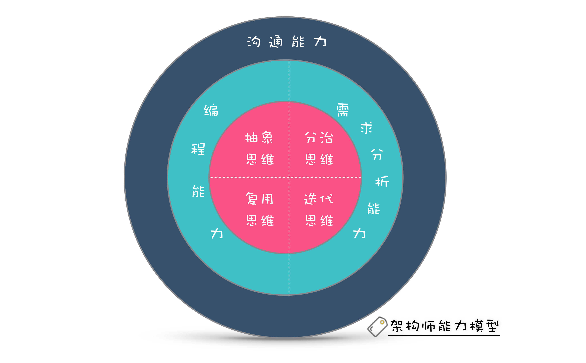
 

具备了这些条件，就可以成为很好的架构师，设计出好的架构，组织好人员和技术，低成本的满足好需求和需求变化，以及系统的运行。

#### 如何成为好的架构师？

想要成为好的架构师，没有什么捷径，需要比普通程序员更多的努力才行。如果你有志向成为架构师的话，我的建议是：

- 要成为一个优秀的程序员
- 多模仿多学习
- 选择好行业和平台

架构师要同时懂业务和技术，而这些行业知识，也不是短时间内能积累起来的。所以如果想当架构师，最好能选择一个合适的行业，能在一个行业里面早点积累足够的行业知识，后面做架构设计的时候，就能更好地设计出符合业务特点的架构。

同时，这些行业领域的业务经验，和技术结合的架构经验，也会成为你个人独特的优势，不容易被替代。

还有平台也很重要，好的平台，能给你更多的实践机会。所以你看极客时间上那些开课讲架构、微服务的，无一例外都是大厂出来的，因为只有大厂，才有机会去实践这种高并发大数据的架构设计。

如果你有志成为架构师，不能光埋头写程序，也要早做打算，选择适合你自己的行业和平台，少走弯路。

 

#### 总结
今天，我们谈了“不想当架构师的程序员不是好程序员”这个话题。其实对于程序员来说，并不代表一定要有一个架构师的头衔，而是心中有大局观，有架构师的思维。从而能理解架构设计，能写出好的程序。

架构师思维，指的是要具备良好的抽象思维、分治思维、复用思维和迭代思维。

另外没有架构师的头衔，也一样可以做架构设计，只要你有架构师的能力就可以了。而好的架构师，需要具备：

- 有架构师思维；
- 懂业务需求；
- 有丰富的编码经验；
- 良好的沟通能力。

要想成为好的架构师，没有什么捷径可以走，首先需要要成为一个优秀的程序员，然后多模仿、多学习好的架构设计，最后还要早点选择好行业和平台，积累好行业的业务知识，借助平台获得大量的实践机会。

### 24 | 技术债务：是继续修修补补凑合着用，还是推翻重来？

#### 什么是技术债务？

项目管理金三角，质量要放在三角形中间，因为质量往往是其他三个因素平衡后结果的体现。

 
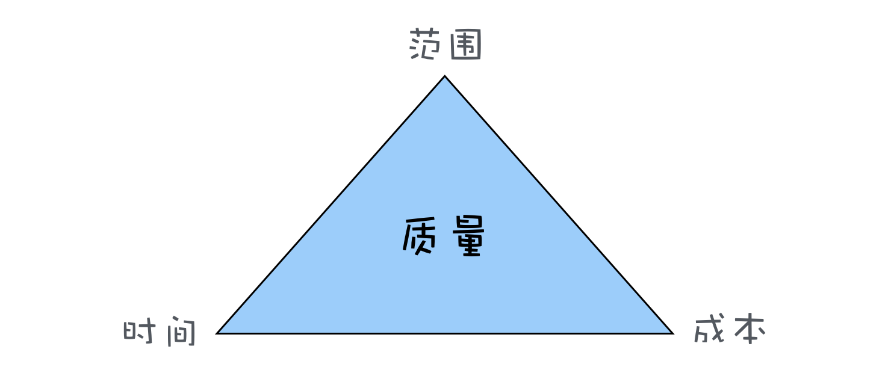
 

范围不减，成本不增加，还想节约时间走捷径，就会影响到质量。这个“质量”，不止是产品质量，还有架构质量和代码质量。这种对质量的透支，就是一种债务。

而技术债务，就是软件项目中对架构质量和代码质量的透支。

一、技术债务是有利息的

债务的“利息”，就是在后面对软件做修改的时候，需要额外的时间成本。

假设我们做一个项目，在刚开始时，架构良好代码整洁，添加一个功能可能需要4天时间。随着项目不断维护，因为走捷径积累了一些技术债务，这时候再开发一个同样复杂度的功能就需要5天时间了。

这多出来的1天，就是技术债务造成的利息。因为你需要时间去梳理现在臃肿的代码，以找到合适的位置添加代码；修改代码后还可能导致原有系统不稳定，需要额外的时间去修复系统不稳定的问题。

二、技术债务不一定都是坏的

债务也可能是良性的

在软件项目中，也经常会刻意的欠一些技术债务，提升短期的开发速度，让软件能尽快推出，从而抢占市场；还有像快速原型开发模型，通过欠技术债务的方式快速开发快速验证，如果验证不可行，甚至这笔技术债务都不需要偿还了。

但技术借债也一样不能是无限制的，因为借债越多，利息越大，当收益抵不过利息时，就会陷入恶性循环，导致开发效率低下，进度难以保障。

所以对于项目中的债务，我们要清楚的知道有哪些技术债务，以及它给项目带来的收益和产生利息，这样才能帮助我们管理好这些债务。

#### 技术债务产生的原因

技术债务产生的原因分成了两个维度：

- 轻率（reckless）还是谨慎（prudent）；
- 有意（deliberate）还是无意（inadvertent）。

 

 

一、轻率/有意的债务

这个象限，反映的是团队因为成本、时间的原因，故意走捷径没有设计、不遵守好的开发实践，对于债务没有后续的改进计划的情况。

例如不做设计直接编码，后期也没有打算重构代码。或者是团队成员以新手程序员为主，没有足够的资深程序员指导和审查代码。

这样产生的债务，短期可能还好，但是因为技术债务会一直积累，会导致利息越来越多，最终带来的负面效果会越来越大。

二、谨慎/有意的债务

这个象限，则反映的是团队清楚知道技术债务的收益和后果，并且也制定了后续的计划去完善架构和提升代码质量的情况。

比如说为了尽快发布产品，先采用“快猛糙”的方式开发，后续再对代码进行重构。

这样产生的债务，因为能及时偿还，所以既可以短期有一定时间上的收益，长期也不会造成负面影响。

三、轻率/无意的债务

这个象限，反映了团队不知道技术债务，也不知道要后续要偿还技术债务的情况。

比如说一些开发团队对于什么是架构设计，什么是好的开发实践一无所知，代码一团糟。

这样产生的债务是最危险的，因为既没得到技术债务的收益，还要偿还其产生的利息。

四、谨慎/无意的债务

这个象限反映了团队其实很重视架构设计和技术债务，但因为业务的变化，或者其他客观因素的原因，造成技术债务的产生。

#### 如何管理技术债务？

既然技术债务有利息也有收益，Martin Fowler画过一张图，来形象的描述了设计、时间和开发速度的关系。没有设计直接写代码，从短期看确实是节约时间的，但是跨过一个临界点后，开发速度会急剧下降。

一、识别技术债务

- 开发速度降低
- 单元测试代码覆盖率低
- 代码规范检查的错误率高
- Bug数量越来越多

二、选择处理技术债务策略

- 重写：推翻重来，一次还清
- 维持：修修补补，只还利息
- 重构：新旧交替，分期付款

三、实施策略

对于重写的策略，要当作一个正式的项目来立项，按照项目流程推进；

对于重构的策略，要把整个重构任务拆分成一个个小任务，放到项目计划中，创建成Ticket，放到任务跟踪系统中跟踪起来；

对于维持的策略，也要把需要做的修补工作作为任务，放到计划中，放到任务跟踪系统中。

四、预防才是最好的方法

预先投资：好的架构设计、高质量代码就像一种技术投资，能有效减少技术债务的发生；

不走捷径：大部分技术债务的来源都是因为走捷径，如果日常能做好代码审查、保障单元测试代码覆盖率，这些行之有效的措施都可以帮助你预防技术债务；

及时还债：有时候项目中，因为进度时间紧等客观原因，导致不得不走捷径，那么就应该把欠下的技术债务记下来，放到任务跟踪系统中，安排在后续的开发任务中，及时还债及时解决，就可以避免债务越来越多。

 

#### 总结

今天，我带你一起了解了软件项目中技术债务的知识。解释了技术债务的概念，技术债务，就是软件项目中架构质量和代码质量的透支。

技术债务，也并不都是坏事，如果合理利用，就可以在短期内缩短时间，但是后期如果不偿还技术债务，也会对项目及个人造成不好的后果。

技术债务产生的原因有四个方面：轻率/有意的债务、谨慎/有意的债务、轻率/无意的债务和谨慎/无意的债务。

可以分三个步骤来管理技术债务：识别技术债务、选择处理策略和实施策略。处理策略有三种：推翻重写、修修补补和重构。

对于技术债务，是继续修修补补凑合着用，还是推翻重来？其实取决于哪一种策略的投入产出比更好，如果推翻重来代价太大，那么就应该谨慎考虑，不如先修修补补或者局部重构；如果修修补补难以维持，就要考虑重写或者重构。

对于技术债务，还是要在日常开发中有好的意识，不走捷径，防患未然，预防技术债务的发生。

## 开发编码篇

### 25 | 有哪些方法可以提高开发效率？

#### 积极主动，行动起来改变自己

成为一个高效程序员，最大的阻力不是来自于不知道方法，而是自己的消极心态。遇到进度延迟、效率低下之类的问题，你就会下意识觉得：

- 时间进度太紧了；
- 我已经尽力了；
- 最近加班太多了没精神；
- 产品经理太不靠谱了，需求没想清楚，害的我瞎忙活。

首先你要知道，无论这些事情的本质责任在于环境还是个人，抱怨排斥的心态对于实际工作的改进是没有任何帮助的。

一、想想再回应

每个人对于外界的刺激都会做出反应，本能的或者习惯性的，遇到事情会本能的觉得都是外部原因。如果一直这样，那就会进入恶性循环，变得更加消极麻木。

但如果在回应之前，给自己一点时间想想，站在积极的方面理性思考一下，就可以去控制你的本能反应。

所以很多次，就在我脱口而出“不可能”或者“不行”的时候，我提醒自己再想想。于是我会改口说：“我试试”、“我再想想”。这样很多次提醒自己以后，会一点点由“不可能”的本能变成“我想想”的习惯。

二、减少关注圈，扩大影响圈

不要总盯着自己无法改变的部分，你需要要多花时间精力在影响圈上。

- 比如说，我不能改变996，至少我可以利用这时间多学习一点，找机会换一个更好的环境；
- 我不能要求每个人都写单元测试，但是我自己的代码写了单元测试，这样项目质量更好了我也更有价值；
- 我不能决定跟什么样的人一起共事，但是我愿意跟他们分享我的经验，他们成长了我也受益。

工作一段时间后，你也可以尝试去扩大自己的影响圈。

比如说，很多程序员像我一样，有过不少因为产品经理需求没想清楚导致返工的经历，后来我就格外关注产品设计相关的知识，业余时间自己学习了不少，这就相当于扩大了我的影响圈。

所以后来产品经理给我一个需求，我不需要在开发完成后才抱怨他不靠谱，而是在给我需求的时候就去跟他讨论，是不是有可能没想清楚。

当你不仅仅局限于程序员的角色思维，扩大了影响圈之后，你就可以试着向产品经理提出很多有价值的建议，比如：

- 这个布局在文字很长的情况下会有什么变化？
- 如果网络很慢，加载数据的时候应该显示什么？加载失败显示什么？
- 如果数据为空的时候这个列表应该显示什么？

接受不能改变的，改变能改变的，尽量扩大可改变项的范围。

#### 以终为始，想清楚再开工

新手程序员跟老手程序员最大的区别是，老手程序员做一件事之前，会先想清楚“终”，然后才知道怎么“始”。所以我先搞清楚需求这个“终”，然后再设计规划出这个从“始”通向“终”的路线，最后从“始”出发写代码，一气呵成，不仅快，而且质量好。这就是“以终为始”。

要做到“以终为始”，就是在做事情的时候注意三点：目标、原则和计划。

一、经常停下来想想目标

隔一段时间要停下来想想：我的原始目标是什么？我正在做的事是我的目标吗？如果不是，那么马上回到自己的原始目标去。

二、制定原则

你可以给自己定一些原则，比如：

- “先运行再优化(Make it Work Make It Right Make It Fast)”——也就是在优化代码之前，先用简单的方法实现，再考虑怎么优化，这样可以保证设计的简单，也可以避免你陷入技术细节中而忽视了原始目标。
- “不复制粘贴代码(Don’t repeat yourself)”——复制粘贴会导致代码臃肿，不便于维护，提取抽象可以保持简洁。
- “每个Pull Request要尽可能小”——这有助于把复杂的任务分解成几个简单的任务，简单的任务更容易高效完成。

三、公开自己的计划

把任务细化，做个简单计划，主动给出一个明确的时间点。有了计划指引和时间点的压力，会倒逼着自己时刻专注于目标是什么，“终”在哪里，还有多少没有完成，这样下来工作效率自然而然就会高起来。

通过在做事时，围绕着目标、原则和计划这三个点，反复地刻意地练习，也可以让你慢慢养成“以终为始”的好习惯。

#### 要事第一，把时间用在刀刃上

把事情分成重要紧急、重要不紧急、紧急不重要、不紧急不重要四个象限，不同的事情有不同的应对策略。

一、重要紧急的事情马上处理

比如说，生产环境出故障了，测试环境部署失败了，这些都是重要并且紧急的事情，只能是马上处理。

二、重要不紧急的要事，要花最多的时间在上面

对代码重构、写自动化测试代码、确认清楚需求文档，这些事情都属于重要不紧急的事情，但是如果不及时处理，就有可能变成重要紧急的事情，比如不偿还技术债务，就可能会变成生产环境故障。

所以这部分事情我会多花时间，重点做。通常我会每段时间只专注做一两件重要的事，其他事情尽可能忽略，比如前一个阶段我主要的工作就是重构前端代码，这个阶段我就在忙排查性能隐患，至于其他事情，就先放一放。

三、紧急不重要的事凑一起集中做

比如我在专注干活时，会全屏幕、关掉所有消息通知，保证没有消息干扰，忙完一段后再去集中处理。

还有如果有人找我时我正在忙，如果他的事情不是重要紧急的，我会礼貌地告诉他我正好手头有点事情，大约多少时间后我主动去找他。相应的我也会尊重别人的时间，找别人的时候会先问一下：“你什么时候有10分钟左右时间，我想请教你一个问题？”

四、不重要不紧急的事情能不做就不做

比如Mac电脑突然提示我要更新系统了

 

#### 总结

积极主动、 以终为始和要事第一，这三个原则以及其衍生出来的方法，正是帮助我逐步变成一个高效程序员的关键所在，希望也能对你有所帮助。

如果你已经学习了很多类似的原则或者方法，而觉得没什么效果，那也许只是因为没有尝试把它们变成习惯。你可以像我一样，把认同的好的原则或方法，通过反复的刻意练习，反复地提醒自己，训练成习惯，然后用习惯指导你的日常开发。

当然，这样的改变不会是一天两天就能完成，但也不用着急，因为习惯的养成需要时间的积累，才能变成条件反射。当你把好的原则或方法变成了直觉反应，自然就会成为一个高效的程序员。

### 26 | 持续交付：如何做到随时发布新版本到生产环境？

持续交付，通过自动化的方式，让你的代码在每一次提交后，都能自动化地走完编译、测试流程，完成后即可随时准备好部署发布。

持续交付如果细分，其实可以分成持续集成、持续交付和持续部署三个概念，这三个概念很相近，但又有所不同。

#### 集成、部署和交付的发展史

一、集成的发展演变

集成指的是把自己的分支代码，合并到主干上

集成的原始阶段

开发阶段一般是不集成，开发结束再一起提交，每次集成都很痛苦，要几天甚至几周才能逐步得到一个相对稳定的版本。

持续集成阶段

持续集成，分支程序自动合并到主干程序。代码集成到主干之前，必须通过自动化测试，只要有一个测试用例失败，就不能集成。

持续集成的好处：

- 配合自动化测试，这样可以保证主干的代码是稳定的；
- 及时获取最新代码，及早暴露问题

持续集成的问题

- 搭建环境稍微麻烦
- 需要配合流程规范来辅助执行，比如自动化测试

二、部署和交付的发展史

部署指的是将代码发布到各种环境，交付是产品验收通过后，具备发布的条件。

1.部署和交付的原始阶段

手动部署，需要手动获取最新源代码、编译、再需要针对环境修改很多配置，容易出现BUG

2.从手动部署到脚本自动化部署

每日构建

早期的自动化部署解决方案

每天下班后，每日构建程序自动从源代码管理器下载最新代码，编译、部署程序到测试环境，便于测试人员第二天修复BUG

问题：代码有问题，导致编译或部署失败，需要手动解决。

3.从脚本部署到持续交付

持续交付，在持续集成的基础上自动部署测试环境。

持续交付本质上也是把部署和交付这件让人痛苦的事情，更加频繁地去做，从而让部署和发布变得不但不痛苦，反而越来越简单。

4.从持续交付到持续部署

持续交付，对于生产环境的部署，依然需要有手动确认的环节。

而持续部署，每次代码从分支合并到主干，在自动化测试通过后，会直接自动部署生产环境，不需要人工确认。

挑战：对自动化测试的覆盖率和稳定性要求非常高

策略：新功能用功能开关隐藏起来，设置特定的Cookie或者Header才打开，到生产环境后人工再测试一遍，通过后再打开，如果没通过，就继续修复继续持续部署。

#### 该不该应用持续交付？

好处

- 尽快暴露问题
- 极大提升效率
- 提升质量
- 降低项目成本

虽然现在持续交付还不够普及，但未来就像源代码管理一样，成为开发团队的标配。

#### 如何搭建持续交付环境？

一、准备工作

持续集成

- 需要有源代码管理工具，比如说git、svn，因为持续集成工具需要从统一的源代码仓库获取代码；
- 需要写自动化测试代码，因为持续集成有一个很重要的条件，就是自动测试必须通过。

持续交付

- 对代码构建的过程可以反复进行，并且每次构建的结果是一致的、稳定的；
- 所有环境的配置都存在于源代码管理工具中，不仅仅是代码；
- 需要自动创建针对于不同环境的发布包；
- 所有环境的部署发布步骤都必须是自动化的。

二、选择合适的持续集成工具

- Jenkins：目前最好的开源持续集成工具，可以自己搭建，插件非常丰富，可以满足绝大部分项目的需要。相对使用难度要高一些，需要花一点时间学习。
- Go CD：ThoughtWorks公司出品的持续集成工具，可以免费使用。
- GitLab CI：是Gitlab推出的持续集成工具，可以自己搭建也可以使用它的在线托管，价钱便宜。

 

#### 总结
今天我带你一起学习了与持续交付相关的一些概念：

- 持续集成，就是持续频繁地将代码从分支集成到主干，并且要保证在合并到主干之前，必须要通过所有的自动化测试。
- 持续交付，则是基于持续集成，在自动化测试完成后，同时构建生成各个环境的发布包，部署到测试环境，但生产环境的部署需要手动确认。
- 持续部署，是在持续交付的基础上，对生产环境的部署也采用自动化。

要搭建持续交付环境，首先需要做好准备工作，例如自动化测试代码和自动部署脚本；然后要选择好持续集成工具；最后按照选择的持续集成工具来实施。

### 27 | 软件工程师的核心竞争力是什么？（上）

#### 软件工程师的核心竞争力

我觉得软件工程师的核心竞争力，不是单一能力的体现，而是几种能力和价值的合集。学习能力、解决问题能力和影响力构成了软件工程师的核心竞争力。

一、学习能力

编程语言、框架、工具，这些都不是软件工程师的核心竞争力，能快速学习掌握编程语言、框架、工具的学习能力才是软件工程师最基础的核心竞争力。

二、解决问题的能力

为什么我说学习能力只能算是基础的核心竞争力呢？因为技术学了是要用才能产生价值的。

我们可以先看看软件工程师的日常工作，有哪些主要工作以及需要什么样的能力去解决：

- 实现功能需求——需要先分析需求，然后抽象设计，最后实现
- 修复Bug——改Bug最大的挑战其实是重现问题，也就是发现问题，然后再分析问题，最后解决问题；
- 重构代码、优化性能——对代码重构，优化性能，最难的地方其实在于发现代码问题在哪，发现性能的瓶颈，后面再去寻找解决方案，最后再解决

软件工程师这些日常开发工作的核心还是在发现问题、分析问题和解决问题，在这里我统称为解决问题的能力。

这几个能力看起来没什么稀奇，但是要仔细分析，其实软件工程师的水平高低，恰恰就体现在解决问题的能力上面。

**发现问题**

> 举例子：若干年前我们要做一个抽奖系统，负责这个任务的程序员设计了技术方案让我审查，他的方案从功能方面是没问题的，但在安全方面却欠考虑。
>
> 我就问他如果有人用个工具模拟用户操作反复点，岂不是可以不停参加抽奖，极大提高中奖概率？于是他说那可以在前端增加限制重复点击。我说如果通过抓包工具反复直接发送数据包，不还是一样可以绕过你前端的检查吗？
>
> 同样一个抽奖系统需求，新手程序员看到的是如何实现功能，而有经验的程序员，会发现可能存在的安全隐患，未雨绸缪，把可能的安全问题消除掉。这就是发现问题的能力体现。

**分析问题**

软件工程师经常遇到的一个问题就是生产环境发生故障，新手程序员通过分析也能把问题修复，但修复完了就觉得没事了。而有经验的程序员，会在恢复后还会进一步分析故障产生的深层次原因，以及以后可以怎么预防类似的故障再次发生。

分析问题，不仅是分析表面的问题，还需要去分析问题深层次的原因，以及思考预防同类问题的机制。

**解决问题**

遇到不知如何解决的问题，可以找到请教。

但是，能通过查文档、搜索找到答案的问题，尽量不要问人。

问人时，要懂得方式方法。

这样的发现问题、分析问题和解决问题的能力，就是软件工程师的进阶核心竞争力。

三、影响力

解决问题的能力，确实是软件工程师很重要的一种能力体现，但是还不能完全体现出软件工程师的核心竞争力。

为什么大部分程序员的技术水平、解决问题能力差不多，而有的升职加薪的机会更多？有的不需要去找工作，总有工作来找他们？这其中的差别，就在于他们的影响力不同。

有些程序员，做事情认真靠谱，做出来的结果让人放心，这样久而久之，就在公司形成了口碑和影响力，大家愿意与之共事。

有些程序员，乐于帮助其他人，分享自己的经验，跟一些新手程序员是亦师亦友的关系，在团队里有很高的威望。

有些程序员，有独特的项目、公司或者行业经历，比如在阿里巴巴这样的大厂有多年架构师经验，在业界有一定知名度。

有些程序员，写自己的技术博客，出去做技术讲座，成了技术大v，在技术圈子里面有一定的名气和影响力。

这样的影响力不是一朝一夕能形成的，但却是一个软件工程师最核心的价值体现。

你需要通过一点点技术成长的积累，需要通过一个个成功项目的积累，需要通过一篇篇技术文章分享的积累，需要通过一次次帮助其他人成长的积累。而一旦形成足够的影响力，就会变成软件工程师职场发展最牢固的护城河。

所以综合来说，软件工程师最核心的竞争力其实分三层：

- 最底层、最基础的就是学习能力，通过学习能力，快速学习掌握新技术；
- 中间一层就是解决问题的能力，充分利用学到的技术，去发现问题、分析问题和解决问题；
- 最上一层就是影响力，是核心竞争力的综合体现。

学习能力、解决问题能力和影响力一起构成了软件工程师的核心竞争力，就像下面这个金字塔图一样，我称之为软件工程师竞争力金字塔。

 
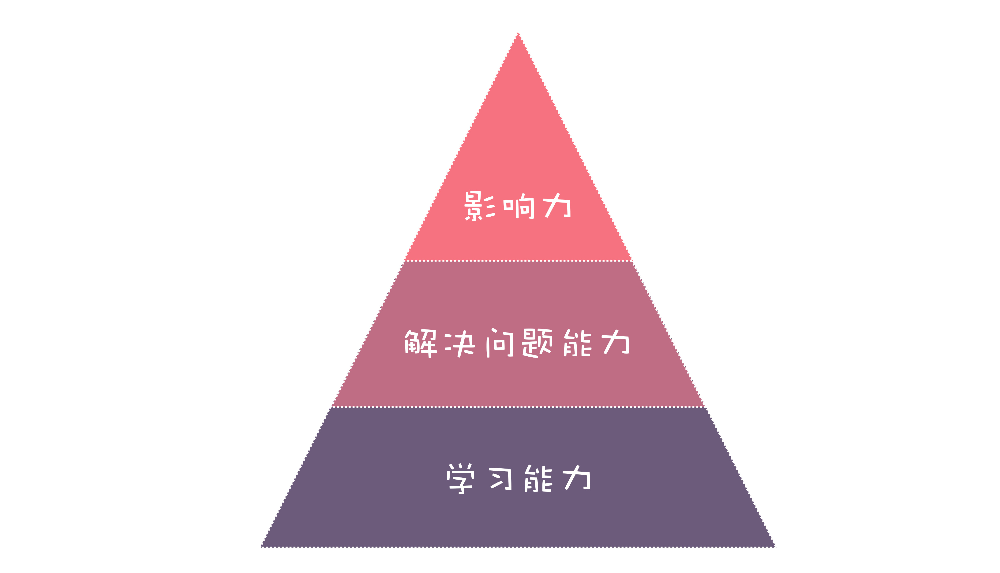
 

#### 软件工程师竞争力金字塔的意义

一、如果你是软件工程师

了解了软件工程师竞争力金字塔，你就可以自下而上，更有针对性地培养、提高软件工程师的核心竞争力。

不是把自己绑死在一门技术或者一个框架上，而是训练自己的学习能力，让自己可以拥有快速学习掌握新技术的能力。

日常工作不仅仅是实现一个个的功能，做一个个的项目，而是在这个过程中，去锻炼和提升你发现问题、分析问题和解决问题的能力。这样才能最大化的你的工作经验，而不是机械重复没有积累。

在工作中，不仅是把事情做成，还要把事情做好；不仅是自己成长，还要帮助其他人成长；最大化的利用好所在平台和行业的经历，转变成你的经验和影响力。工作之外，也多分享，打造自己的品牌。

这样你就可以一点点搭建出来属于你的竞争力金字塔，构建出自己的核心竞争力。

二、如果你是要招聘优秀的软件工程师

了解了软件工程师竞争力金字塔，你可以自上而下，更容易筛选出来优秀的软件工程师。

首先你可以通过内部推荐，优先找那些口碑好，做事情认真靠谱的软件工程师。然后你可以考察他解决问题的能力。比如说你可以问他：

- “项目中遇过的哪些复杂的问题？”
- “是怎么样去解决的？”

通过对问题的答复，再深入问一些细节问题，例如：“你当时是怎么考虑安全性问题的？”“如果访问量增加一倍，会有什么影响？”等等。你就可以对他解决问题的能力有个初步了解了。

最后你还可以考察一下学习能力。比如你可以问他：

- “最喜欢的编程语言是什么？”
- “你是如何学习这门语言的？”
- “如果让你学一门新的语言，你打算怎么学？”

这样你也可以对他的学习能力有一个大致了解。

#### 总结

学习能力，就是你学习并掌握一门技术、框架和工具的能力。好的学习能力，能帮助软件工程师在技术日新月异的今天，快速跟上技术发展的步伐。

解决问题的能力，就是发现问题、分析问题和解决问题的能力。解决问题的能力，是软件工程师非常重要的能力，帮助软件工程师在日常工作中高效完成工作，创造价值。影响力则是软件工程师价值的综合体现。

如果你是软件工程师，那么就需要自下而上，训练自己的学习能力，积累解决问题的经验，工作的过程中形成影响力，一点点去构建自己的核心竞争力。如果你要招聘或筛选优秀的软件工程师，则需要自上而下，选择那些口碑好有影响力的，能帮你解决问题的，有很好学习能力的人。

### 28 | 软件工程师的核心竞争力是什么？（下）

#### 如何提升学习能力？

学习能力是软件工程师最基础的能力，学习能力直接决定了你掌握技术的速度。

想快速掌握新技术，关键是有自己的知识体系。

如何构建自己的知识体系？

**首先需要在一个技术领域深耕**

每个人精力其实很有限的，一开始专注在一个技术领域容易在短时间取得成绩，同时也相当于建立起了最初的知识体系，在未来的知识森林里种下的第一棵大树，这样当你开始学习新的技术的时候，已有的知识就可以直接借用，相当于这棵大树可以帮助新的知识树的成长提供很好的养分，快速培养出新的大树。

如果一开始就同时涉猎多个领域，每个领域的知识又没有掌握好，这样的知识是没法共享的，就相当于你种的只是一片知识的灌木，最终只能收获像灌木丛的知识体系。

只有一个领域的知识你真正吃透，才能有效地共享到其他领域，构成一个知识领域的森林。

知识体系建立之初，确实是痛苦的，感觉什么都不懂，有很多要学习的。

市面上有新技术出来也会觉得焦虑，觉得应该去学新的技术。但如果初期不能够专注在某个领域深入的话，你学了再多技术，结果也没有一门能深入，这就很难构建出有深度的知识树。

要在某一个领域的技术达到一定深度，通常需要三年以上的时间。当你熬过这个阶段，在一个技术领域取得了一定成就，不仅会收获你的知识树，还能收获技术上的自信，让你有信心在其他技术领域也同样取得成就。

**然后往相近的领域逐步横向拓展**

当在一个技术领域达到一定深度后，可以开始横向扩展。最好是往相近的领域扩展，因为这样你之前的知识有很多是可以共享的，容易快速取得成绩。

这也是为什么我后来选择了前端，因为对我来说，前端跟我以前掌握的Asp.Net的经验是有很多重叠的，我只需要去学习框架和工具那部分知识。

当然横向构建知识体系，也一样不是一个轻松的过程，因为以前你在某个领域取得的成就和经验，反过来也会成为一种阻力。因为以前你熟悉的知识，已经变成了你的舒适区，你会天然地不愿意走出舒适区，不愿意到挑战区或恐慌区去学习新的知识。

这其实就是我当初学React时候的感受，我觉得jQuery已经用的很好了，为什么要学这个？我老想着用以前MVC的经验去套用React的编程模式，反而更难理解。

但是，当你迈过去，掌握了新领域的知识，就会感觉整个知识体系一下子扩展了很大一块。相当于让你的知识体系，从一棵树，逐步变成了一个小树林，最终会成为一个森林。

快速掌握新技术的秘籍，就是要构建属于你的知识体系，让你在学习新知识时，能借用已有的知识，加快学习速度。

你可以现在思考一下你的知识体系是什么样子的，是一片灌木丛还是已经有大树了？如果只是一片灌木丛，你打算在哪个技术领域先打造你的知识树呢？

#### 如何提高解决问题的能力？

解决问题的能力是软件工程师进阶的核心竞争力，你看现实中，那些解决问题能力强的程序员，遇到问题总是有办法，都能有条不紊地给解决了。

> 有一次我们组负责的一个网络服务出现异常，大约1%的请求会出现异常导致服务报警，当时值班的同事正好是一个新手程序员，他也试着分析日志，但是没有找到明显的错误日志，完全不知道如何应对，只好让我帮忙。这个问题我以前也从来没遇到过，但我有一套应对这类问题的思维方式和逻辑。
>
> 我第一步就是回滚上一次的部署，看是否恢复正常，结果没效果。于是我再从日志找出所有有问题的请求，寻找规律，从中选取几个有问题的请求，去跟踪它们整个请求过程，结果在某一个路由环节发现指向到了一台错误的服务器，最终定位是某个路由程序出现的问题。
>
> 我们将这个问题反馈到相关组，问题马上就得以解决。然后我建议他在这个路由环节增加监控，这样以后再出问题就能第一时间报警通知。

为什么我有这样解决问题的能力呢？是因为我在多年的开发经验中，形成了一套解决问题的方法论，即使遇到没有解决过的问题，也能借助一套方法论去解决。

这其实很像我在专栏开头就提到的工程思维，遇到一个项目，哪怕不是软件项目，我也可以借鉴瀑布模型，用工程方法去解决。所以你要提高解决问题的能力，就要形成自己的一套解决问题的方法论。

在这里分享我解决问题的一套方法论，其实很简单，只有三步。

**第一步：明确问题**

解决问题，最重要的一步就是要明确问题是什么，这其实就跟做项目需要先需求分析一样，搞清楚目标是什么，才能做到有的放矢。

同时这一步也要透过现象看本质，去明确问题背后是不是还有其他问题。就像我在前一篇文章中举例的抽奖项目，不能光看到功能需求，还需要看到安全上的需求；网络异常的问题，不能光想着应用程序错误，还要看看网络是不是有问题。

**第二步：拆分和定位问题**

一个复杂的问题，只有经过拆分，才好找到本质的问题。

就像上面举的解决网络异常的例子，我首先拆分成程序问题和网络问题，通过回滚观察，我就可以基本上断定不是程序问题，那就说明是网络问题。然后对于网络问题，将整个请求过程拆分，最终就可以定位到有问题的环节。

**第三步：提出解决方案并总结**

发现并分析完问题后，找到解决方案是容易的，但很有必要总结一下。总结要做的就是两点：

- 下次有这种问题怎么解决，是不是可以做的更好？
- 这种问题是不是可以预防？如果可以，应该怎么做？

尤其是在解决完问题后，再想一想如何预防以后类似问题的发生。如果每次解决完问题，你还能提出一个预防问题发生的方案，一定会让大家印象深刻的。

#### 如何提升影响力？

刻意地去提升自己的影响力，是很多软件工程师忽略去做的事情。但影响力，却是程序员核心竞争力的最顶层，也是一个软件工程师能力的综合体现。培养影响力也是我职业生涯中受益良多的一件事。

其实当你意识到影响力是有价值有意义的事，怎么去做反而没那么难，比如这些方面可以去考虑。

**在某个领域做出了足够牛的成绩**

有些程序员能在某一个技术领域做到一定深度，做出了常人难以达到的成绩，比如说PHP开发组核心成员的鸟哥惠新宸，写Vue框架的尤雨溪，前端的Winter。做到他们这样，基本上就不用担心影响力的问题了。

要取得这样的成绩，要实力、要机缘、还要坚持。

**做事情超出预期**

在软件项目中，你作为一个程序员，每个人都会对你有预期，项目经理希望你如期完成项目，产品经理希望你完成需求，其他程序员希望你代码质量好。如果你是初级程序员，则大家期望你代码不要有太多问题就好，如果你是高级程序员，大家不仅期望你要写好程序，还要能带带新人。

如果你做事情的结果能超出预期，就会让人对你刮目相看，进而会形成口碑。就像我前面举的例子，如果你解决完一个问题，还能想到怎么预防问题再次发生的方案，这通常就超出他人对你的预期了。

要让自己的表现超出其他人的预期，除了要付出很多努力外，也要学会管理好其他人的预期，了解别人对你的期望，降低别人对你的期望，最后做出高于期望的事。

**帮助其他人就是在帮助自己**

程序员的经验，很大部分来自于解决问题时积累的经验。你自己在工作中遇到的问题其实是很有限的，但如果帮助其他人解决问题，相当于增加了你解决问题的样本，这些样本能帮助放大你的工作经验。

**分享就是学习和打造影响力**

[《为什么你应该（从现在开始就）写博客》](http://mindhacks.cn/2009/02/15/why-you-should-start-blogging-now/)

#### 总结

最后简单总结一下。软件工程师的核心竞争力，体现在学习能力、解决问题能力和影响力三个方面。

- 要提升学习能力，要构建好自己的知识体系，首先需要在一个技术领域深耕然后往相近的领域逐步横向拓展。
- 要提升解决问题的能力，要形成自己的方法论，去发现问题，分析问题和解决问题。
- 要提升自己的影响力，可以在一个领域深入打造自己独特的有价值的能力，让自己做事情能超出别人的预期，同时乐于分享和帮助他人。

 

### 29 | 自动化测试：如何把Bug杀死在摇篮里？

#### 为什么自动化测试能保障质量？

人是怎么做测试的：首先根据需求写成测试用例，设计好输入值和期望的输出，然后按照测试用例一个个操作，输入一些内容，做一些操作，观察是不是和期望的结果一致，一致就通过，不一致就不通过。

自动化测试，就是把这些操作，用程序脚本来完成的，本质上还是要输入和操作，要检查输出是不是和期望值一致。只要能按照测试用例操作和检查，其实是人来做还是程序来做，结果都是一样的。

自动化测试有一个手工测试没有的优势，那就是可以直接绕过界面，对程序内部的类、函数进行直接测试，如果有一定量的自动化测试代码覆盖，相对来说软件质量是更有保障的。

一旦实现了自动化，每测试一次的成本其实大幅降低了的，几百个测试用例可能几分钟就跑完了。尤其是每次修改完代码，合并到主干之前，把这几百个测试用例跑一遍，可以有效地预防“修复一个Bug而产生新Bug”的情况发生。

现阶段，自动化测试还是不能完全代替手工测试的，有些测试，自动化测试成本比手工测试成本要高，比如说测试界面布局、颜色等，还是需要一定量的手工测试配合。

#### 有哪些类型的自动化测试？

在对自动化测试类型的定义方面，Google的分类方法我觉得比较科学：根据数据做出决策，而不仅仅是依靠直觉或无法衡量和评估的内容。Google将自动化测试分成了三大类：小型测试、中型测试和大型测试。

Google的分类方法我觉得比较科学：根据数据做出决策，而不仅仅是依靠直觉或无法衡量和评估的内容。Google将自动化测试分成了三大类：小型测试、中型测试和大型测试。

> 案例
> 假设我们有一个网站，是基于三层架构（如下图所示），业务逻辑层的类叫UserService类，数据访问层的类叫UserDA，我们将以用户注册的功能来说明几种测试的区别 。

 
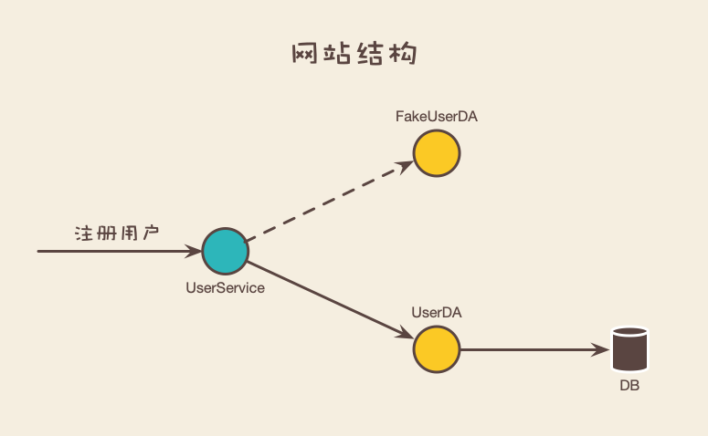
 

小型测试

小型测试是为了验证一个代码单元的功能，例如针对一个函数或者一个类的测试。我们平时说的单元测试就是一个典型的小型测试。

比如说UserService这个类，有一个注册用户的函数，现在要对它写一个单元测试代码，那么看起来就像下面这样：

 

 

通过这样的测试代码，就可以清楚的知道UserService类的create这个函数是不是能正常工作。

小型测试的运行，不需要依赖外部。如果有外部服务（比如文件操作、网络服务、数据库等），必须使用一个模拟的外部服务。比如上面例子中我们就使用了FakeUserDA这个模拟的数据库访问类，实际上它不会访问真实的数据库。这样可以保证小型测试在很短时间内就可以完成。

中型测试

中型测试是验证两个或多个模块应用之间的交互，通常也叫集成测试。

如果说要对用户注册的功能写集成测试，那么就会同时测试业务逻辑层的UserService类和数据访问层的UserDA类。如下所示：

 
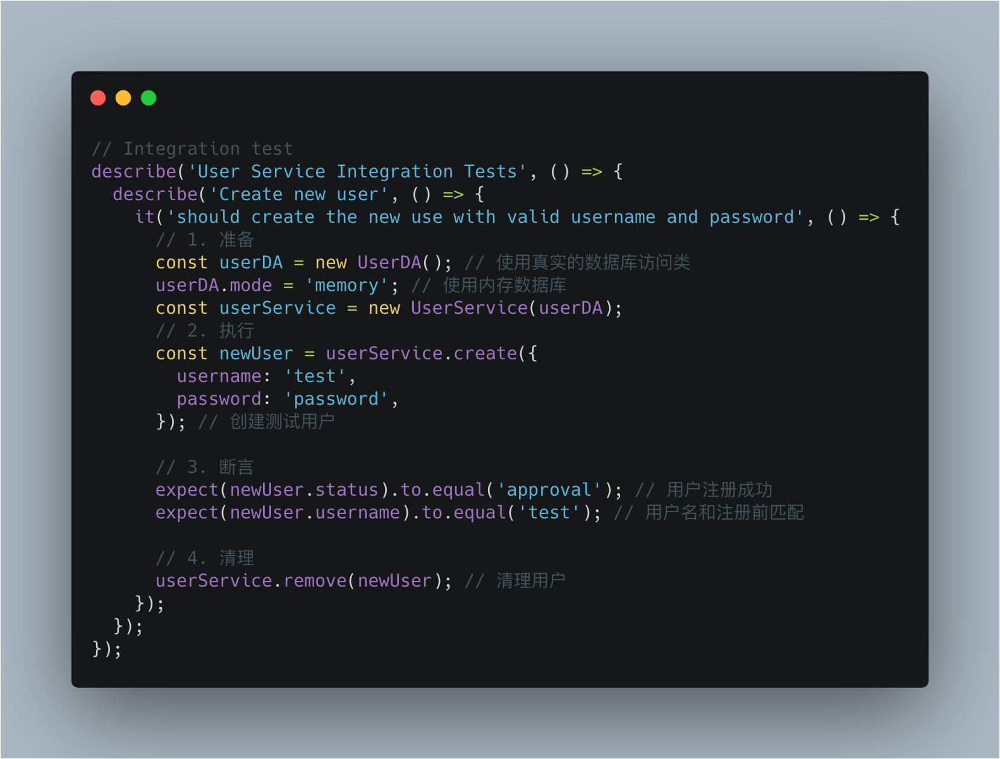
 

对于中型测试，可以使用外部服务（比如文件操作、网络服务、数据库等），可以模拟也可以使用真实的服务。比如上面这个例子，就是真实的数据库访问类，但是用的内存数据库，这样可以提高性能，也可以减少依赖。

至于中型测试要不要使用模拟的服务，有个简单的标准，就是看能不能在单机情况下完成集成测试，如果可以就不需要模拟，如果不能，则要模拟避免外部依赖。

大型测试

大型测试则是从较高的层次运行，把系统作为一个整体验证。会验证系统的一个或者所有子系统，从前端一直到后端数据存储。大型测试也叫系统测试或者端对端测试。

如果说要对用户注册写一个端对端测试的例子，那么看起来会像这样：

 
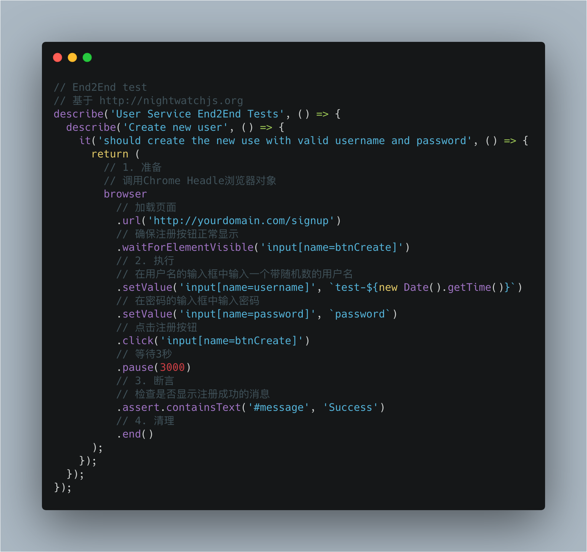
 

对于大型测试，通常会直接使用外部服务（比如文件操作、网络服务、数据库等），而不会去模拟。比如上面这个例子，就是直接访问测试环境的地址，通过测试库提供的API操作浏览器界面，输入测试的用户名密码，点击注册按钮，最后检查输出的结果是不是符合预期。

区分测试类型的依据是什么？

- 小型测试，没有外部服务的依赖，都是要模拟的；
- 中型测试，所有的测试几乎都不需要依赖其他服务器的资源，如果有涉及其他机器的服务，则本地模拟，这样本机就可以完成测试；
- 大型测试，几乎不模拟，直接访问相关的外部服务。

越是小型测试，执行速度越快，越是大型测试，执行速度越慢。

另外越是大型测试，写起来的成本也相应的会更高，所以一般项目中，小型测试最多，中型测试次之，大型测试最少。

怎么写好自动化测试代码？

很多人认为写自动化测试很复杂，其实测试代码其实写起来不难，包含四部分内容即可，也就是：准备、执行、断言和清理，我再把第一段代码示例贴一下：

 

 

第一步就是准备，例如创建实例，创建模拟对象；第二步就是执行要测试的方法，传入要测试的参数；第三步断言就是检查结果对不对，如果不对测试会失败；第四步还要对数据进行清理，这样不影响下一次测试。

上面还有几个测试代码示例，都是这样的四部分内容。

这是针对写一个自动化测试的代码结构。对于同一个功能，通常需要写几个自动化测试才完整。

一个完整的自动化测试要包括三个部分的测试：

- 验证功能是不是正确：例如说输入正确的用户名和密码，要能正常注册账号；
- 覆盖边界条件： 比如说如果用户名或密码为空，应该不允许注册成功；
- 异常和错误处理：比如说使用一个已经用过的用户名，应该提示用户名被使用。

#### 如何为你的项目实施自动化测试？

选择好自动化测试框架

Web前端

- Jest： Facebook的前端测试框架；
- Mocha：历史悠久的一个JS测试框架；
- Nighwatch: 一个API很简单，但是功能很强大，可以直接操作浏览器的自动测试框架。

iOS开发

iOS自动化测试框架对比http://www.jianshu.com/p/047035416095

Android 谈谈自动化测试 http://juejin.im/entry/59ec4a8f6fb9a0450908a5fd

在持续集成环境上跑你的自动化测试

让自动化测试在持续集成上运行非常重要，只有这样才能最大化地发挥自动化测试的作用。

因为持续集成，会强制测试通过才能合并代码，在合并代码之前就能知道测试是不是都通过了，可以帮助程序员获得最直观的反馈，知道哪里可能存在问题，这样才能真正做到防患于未然，把Bug杀死在摇篮里。

下图描述的就是自动测试配合持续集成的一个标准流程：

- 在提交代码前，先本地跑一遍单元测试，这个过程很快的，失败了需要继续修改；
- 单元测试成功后就可以提交到源代码管理中心，提交后持续集成服务会自动运行完整的自动化测试，不仅包括小型测试，还有中型测试；
- 通过所有的测试后，就可以合并到主分支，如果失败，需要本地修改后再次提交，直到通过所有的测试为止。

新项目和老项目的不同策略

如果是新项目，那么可以在一开始就保持一定的自动化测试代码的覆盖率，你甚至还可以试试测试驱动（TDD）的开发模式，也就是先写测试代码，再写实现代码，保证测试通过，最后对代码进行重构。

如果是老项目，短期内要让自动化测试代码有覆盖是有难度的，可以先把主要的功能场景的中型测试写起来，这样可以保证这些主要功能不会轻易出问题。

后面在维护的过程中：

- 增加新功能的时候，同步对新功能增加自动化测试代码；
- 修复Bug的时候，针对Bug补写自动化测试代码。

如果时间紧任务重，来不及写自动化测试怎么办？

确实遇到时间紧的情况，我建议你要优先保证中型测试代码的覆盖，因为这样至少可以保证主要的用户使用场景是正常的。然后把来不及完成的部分，创建一个Ticket，放到任务跟踪系统里面，后面补上。

#### 总结

今天我带你一起学习了关于自动化测试有关的知识。自动化测试，分为三类：

- 小型测试，主要针对函数或者类进行验证，不调用外部服务，执行速度快；
- 中型测试，主要验证两个或多个模块应用之间的交互，可能会调用外部服务，尽可能让所有测试能在本机即可完成，执行速度比较快；
- 大型测试，对服务整体进行验证，执行速度慢。

写好单元测试代码，基本结构就是：准备、执行、断言和清理；基本原则就是：

- 要验证正确性；
- 覆盖边界条件；
- 验证是否有异常和错误的处理。

自动化测试，一定要配合好持续集成，才能最大化发挥其效用。

对于自动化测试的实施，开头是最难的，因为需要花时间选择自动化测试框架，需要针对自动化测试框架搭建环境，甚至要去搭持续集成环境。但搭建持续集成和搭建自动化测试环境，并且保证持续更新维护自动测试代码，这个技术投资，一定是你在项目中最有价值的投资之一。

搭建持续集成环境和集成自动化测试框架的事情，要作为一个正式的项目任务去做，当作一个很重要的任务去推进。

 

### 30 | 用好源代码管理工具，让你的协作更高效

#### 源代码管理工具发展简史

没有源代码管理工具的时代

- 本地版本管理
- 集中式版本管理
- 分布式版本管理

#### 如何选择合适的源代码管理系统

现在源代码管理系统已经有很多的选择，你可以选择网上托管的代码管理服务，或者是自己搭建。

自己搭建的好处就是可以有更多的控制，但是需要有自己的服务器，自己搭建环境，还要后续的维护。用网上的托管平台，可以减少运维成本，功能也很强大，但对平台有一定的依赖。

我的建议是如果项目规模不大，隐私要求不高，完全没必要自己搭建，可以直接选择网上的托管平台。这样可以节约很多时间成本，而且还可以方便和一些第三方服务，例如持续集成等进行整合。

如果希望对源代码管理有更多控制，也能接受运行维护上的投入，就可以选择自己搭建。

自己搭建源代码管理系统

- Git
- Gitlab：Git自带的Server默认是没有Web界面进行管理的，所以可以安装GitLab的社区版本，开源免费的，有Web操作界面，可以像GitHub一样提交Pull Request，并且和CI （持续集成）系统例如GitLab CI、Jenkins都有很好的集成。
- Gerrit

网上的代码托管平台

- GitHub
- Gitlab
- Coding

#### 如何用好源代码管理工具？

原则一：要频繁的提交

频繁提交，这意味着你每次提交的代码变更是比较少的，便于Code Review，同时如果出现问题，也可以迅速定位或者直接回滚。

频繁地提交，也让团队成员可以及时同步最新代码，不至于在最后合并时，产生有大量的合并冲突。

频繁提交，不意味着提交不完整的内容，而是将要提交的内容分拆，并且保证完整性。

原则二：每次提交后要跑自动化测试

原则三：提交的代码要有人审查

通过代码审查，可以发现代码中潜在的问题。通过代码审查，也可以加强团队的技术交流，让水平高的开发人员Review，可以帮助提升整体代码水平；Review高水平的代码也是一种非常有效的学习方法。

#### 怎么做好代码审查呢？

先了解清楚这个提交的代码要解决的是什么问题，想象一下如何是自己来写这个代码会怎么写。这样在审查的时候，就能发现一些和自己不一样的地方，别人好的地方我们可以学习，不对的地方应该指出。

对于审查出来的问题，可以分成三个类型：

- 问题：如果对代码有不清楚的地方，可以作为问题提出，进一步澄清确认；
- 建议：原来的实现没有太大问题，但是可以有不同的或者更好的实现；
- 阻塞：代码有明显问题，必须要修改。

#### 我该选择什么样的开发流程？

现在基于源代码管理有三种主要的开发流程：

- Git flow
- Github flow
- Gitlab flow

GitHub开发流程

GitHub开发流程的关键在于两点：

- 有一个稳定的分支，例如master；
- 每次创建新功能或者修复Bug，必须创建一个分支。最后通过代码审查和自动化测试后，才能合并回稳定分支。

#### 总结
源代码管理工具也叫版本控制系统，是保存文件多个版本的一种机制，可以记录文件的历史版本。

用好源代码管理工具，有三个简单可行的原则：

- 原则一：要频繁的提交；
- 原则二：每次提交后要跑自动化测试；
- 原则三：提交的代码要有人审查。

基于源代码的开发流程，要保证好两点：

- 有一个稳定的代码分支；
- 在合并分支之前，对代码有审查，自动化测试要能通过。

用好源代码管理工具，设计好开发流程，保证好代码质量，你的协作才能更高效。

 

## 软件测试篇

### 31 | 软件测试要为产品质量负责吗？

#### 什么是软件产品质量？

功能质量、代码质量和过程质量这三个方面组合在一起，很好地概括了软件质量。

所有的软件开发都是从一个想法开始的，用户需要一个软件，有人出钱，然后开发团队实施，把想法变成需求，需求变成设计，设计变成代码，代码变成软件。

功能质量

最终用户得到是软件，体验的是软件的功能，功能的质量直接决定了产品的质量。

满足用户需求，是对功能质量最基础的要求。

在这个基础上，Bug数量、性能、UI/UX都是很重要的质量指标。如果你的软件Bug太多、性能差，用户不会满意；界面难看，操作体验也很差，这些因素都决定了你产品的功能质量。

代码质量

构成软件最重要的部分是代码，代码质量指的是实现软件功能的架构和代码的质量。代码的质量主要体现在以下这些方面：

- 代码的可维护性，也就是在不影响稳定性的前提下，是否能方便地添加或者修改现有的代码；
- 代码的可读性，代码是否容易理解，是否能快速上手；
- 代码的执行效率，代码执行效率直接影响了软件性能；
- 代码的安全性，是否有安全漏洞，安全性是代码质量很重要的一个指标；
- 代码的可测试性，代码是否能使用单元测试、集成测试进行测试验证。

过程质量

软件的开发离不开软件工程，离不开项目管理。软件开发过程的质量决定了你的项目是否能如期完成，开发成本是否在预算之内。

过程质量虽然也是用户不能直接感知的，但是过程质量会直接影响代码质量和功能质量，甚至是产品的成败。

#### 谁该为产品质量负责？

既然产品质量是由功能质量、代码质量和过程质量共同决定的，那么对产品质量负责，意味着要对这三方面共同负责。

软件测试，可以对功能质量负责，对软件产品进行测试验收，以确保产品满足功能需求，有好的功能质量。但是通常不能对代码质量和过程质量负责。

开发人员，可以对代码质量负责，也可以写测试代码，通过自动化的方式做功能测试，虽然还不能完全替代手工测试的作用，所以也可以算得上对功能质量负责。但开发人员通常对过程质量影响有限。

项目负责人，可以对过程质量负责，而且过程质量的水平高低，会间接影响代码质量和功能质量。但因为项目负责人不直接编码和测试，所以无法直接影响代码质量和功能质量。

所以综上，我觉得如果要排序的话，软件质量的首要负责人是项目负责人，其次是开发人员，然后才是软件测试。

人人为质量负责，很容易变成一句口号而很难落实。就像三个和尚没水喝的故事里面那样，当质量变成每个人的责任时，就没有人真正为质量负责了。所以我们不止是要学习敏捷开发中的理念，还要学习它一些具体的方法。

#### 如何做到“人人为产品质量负责”？

首先，可以参考敏捷开发中的扁平化管理。在敏捷开发中没有项目经理，只有产品负责人，而产品负责人更多是充当一种服务型的角色。大家都很平等，也就是说每个人都有权力去影响到项目过程，实现权责对等，大家才会为过程质量负责。

其次，可以选择将团队拆小。敏捷开发中的团队规模都不大，大的开发团队拆分成了小的开发小组，每个组人数都不多。人数多的时候容易推诿扯皮，但如果人少，每个人就必须要承担更多的责任，这有助于形成人人重视产品质量的文化。

另外，也可以鼓励工种之间的融合，例如开发人员多写自动化测试代码；测试人员在开发人员写自动化测试时，提供帮助，例如设计测试用例。这样不只是局限于各自负责的质量领域，也同时关注其他质量领域。

最后就是制定相应的制度，鼓励大家重视质量。比如说：

- 每个Sprint都有项目回顾会议，每个人都可以针对质量提出有效的建议，最终将这些建议落到实处；
- 出现质量问题，不是推卸责任，而是分析原因，及时修复，避免以后出现类似问题。

#### 总结

今天我带你一起探讨了一个在软件项目中的常见问题：软件测试要为产品质量负责吗？

保证软件高质量，并非只是测试人员的责任。软件质量体现在功能质量、代码质量和过程质量这三个方面，对产品质量负责，也意味着要对这三方面共同负责。

软件测试，不能影响代码质量和过程质量，所以并不需要为产品质量负责，项目负责人能直接影响过程质量，也能间接影响代码质量和功能质量，应该为产品质量负责。对于开发人员而言，不应只是局限于对代码质量负责，还应该注意功能质量。

对产品质量，最理想的状态还是能做到人人都为产品质量负责，而达到这样的目标，还是需要建立一种重视质量的文化，每个人才会确确实实地对质量负责。

### 32 | 软件测试：什么样的公司需要专职测试？

#### 软件测试的主要工作是什么？

如果说架构设计是对业务需求在技术方面的抽象，那么测试设计更像是对业务需求的具象，把业务需求分解成一个个具体的用户操作步骤，也就是测试用例。然后在开发完成后，按照设计好的测试用例进行逐一的测试验证，将发现的Bug报告给开发人员，并跟踪Bug的修复。

如果对软件测试的工作简单总结一下，就是发现Bug，报告Bug，跟踪Bug。

一、软件测试怎么发现Bug？

这里面最难的就是发现Bug，尤其是如何尽早、尽可能全面地发现Bug。

除了功能性的测试，还需要进行非功能性的测试，也就是像性能、安全性和用户体验等方面的测试。

从测试的角度看，没有必要每一个可能都去测试，可以通过一些科学的方法来通过有限的测试用例，保证尽可能多的测试覆盖。

**等价类划分**

就是把所有用户可能输入的数据分类，如果一类数据对于发现Bug的效果是一样的，那么这类数据就是一个等价类，测试的时候只要从里面任意选取一个值就好了。比如一个输入框要求只能输入1-100之间的整数，那么1到100之间都是等价的，0和任意负数也是等价的，101和之上的整数也是等价的。

因为分类是有限的，这样就可以用有限的测试用例实现尽可能多的测试覆盖。

**边界值分析**

边界值是对等价类的补充，因为输入输出的边界是非常容易出错的一个地方。比如说上面输入框的例子，0，1，100，101都是边界值，可以设计用例来测试是否会有可能出错。

**探索性测试**

探索性测试就是根据前面的测试结果，通过有效的策略进行测试。

关于探索性测试的介绍可以参考这篇文章[《探索性测试揭秘》](https://blogs.msdn.microsoft.com/billliu/2012/05/25/103/)。

除了以上这几个主要的策略，还有很多其他的策略，比如说：

- 场景设计
- 因果图
- 错误推测法

二、软件测试怎么报告Bug？

测试人员要做的就是创建一个新的Ticket，在Ticket的描述中，详细说明Bug是什么，具体的重现步骤，必要的话还要附上截图、日志等辅助信息。这样开发人员在收到Bug后就能快速定位问题，按照优先级对Bug进行修复。

三、软件测试怎么跟踪Bug？

Bug的跟踪，并不仅仅是要跟踪开发人员什么时候修复了这个Bug，通常还包括对Bug修复的验证。

回归测试是指修改了旧代码后重新进行测试，以确认修改没有引入新的错误或导致其他代码产生错误。

#### 什么样的公司需要专职测试？

为什么Facebook可以做到没有专职测试呢？

- 大量优秀的工程师，可以同时兼任开发和测试；
- 有大量的自动化测试代码覆盖；
- 强大的发布和监控系统；
- 时间进度比较宽松；
- 用户对Bug容忍度较高。

对于不能满足上面条件的公司，有专职的测试是更有利于软件项目开发和质量保障的。

大厂不设专职测试的启示

- 首先，用自动化测试代替重复性的手工测试是必然趋势。
- 其次，测试设计是软件测试人员的核心竞争力。
- 最后，开发人员和测试人员的更多融合是一种双赢。

#### 总结

今天我带你一起分析了什么样的公司需要专职测试。同时也学习了软件测试的一些基本知识，简单来说软件测试的工作，就是发现Bug，报告Bug，跟踪Bug。

要能及时发现Bug，需要针对需求进行分析和测试设计，把需求具象成一个个用户操作步骤的测试用例。通过一些科学的测试方法，像等价类划分、边界值分析、探索性测试，能有效提升测试的覆盖率。

公司是否需要专职测试，还是取决于公司的具体情况，例如是否有大量优秀的工程师可以同时兼任开发和测试，有大量的自动化测试代码覆盖，有强大的发布和监控系统，时间进度宽松，用户对Bug容忍度较高。

 

### 33 | 测试工具：为什么不应该通过QQ/微信/邮件报Bug？

#### Bug跟踪工具

通过QQ等方式报告的Bug，都是文字配合图片等信息，很难检索和分类，而Bug跟踪工具，采用结构化的数据来定义Bug，每一个Bug都有一些关键的信息可以对Bug进行分类和检索。

在Bug跟踪工具使用中，一个基本的Bug信息包括：

- 标题；
- 描述（包括期望结果、实际结果和重现步骤等关键信息）；
- 优先级；
- 指派人；
- 状态（New、Open、 Rejected、Fixed等）；
- 其他。

在软件项目中，要把好的实践流程化，把好的流程工具化。Bug跟踪工具则很好的贯彻了这一点，将Bug的解决过程流程化。

一个Bug从创建到最后结束，其实是有一个完整的流程的。

 
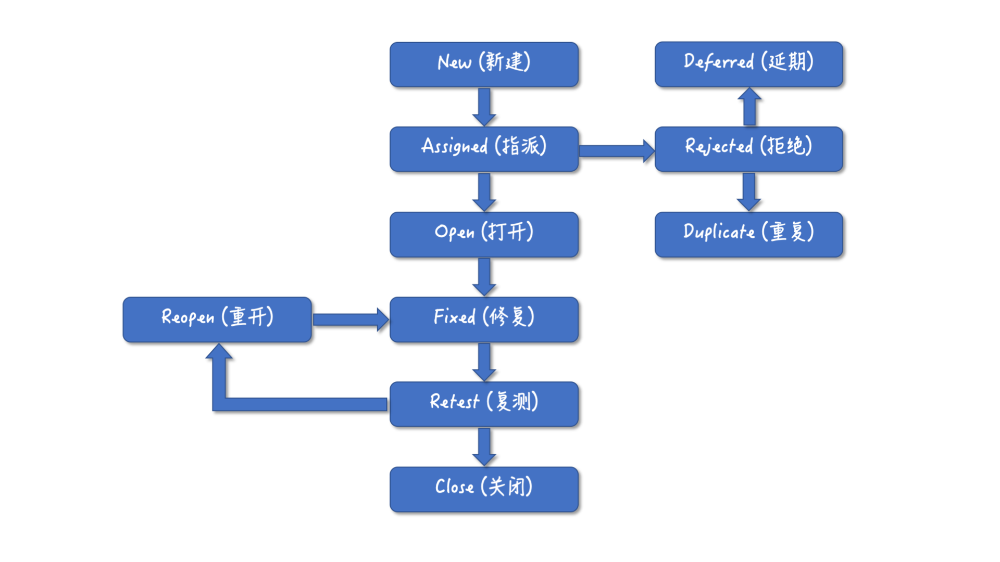
 

通过这样的流程，开发人员就可以集中对Bug进行分配、按照优先级分别解决，而测试人员则可以第一时间知道Bug处理的状态变化，及时验证，方便跟踪整个过程。

使用Bug跟踪工具的注意事项

- 首先，所有的Bug都应该通过Bug跟踪系统管理和跟踪，不应该再通过QQ/微信/邮件的方式跟踪Bug。
- 然后，不能把多条Bug合并成一条，一个Bug创建一个独立的Ticket。
- 再有，描述清楚如何重现Bug非常重要。
- 最后，不要把Bug跟踪系统当成讨论板用。

#### 自动化测试工具

测试人员可以学习一些基本的编程知识，尝试自己实现自动化测试。自动化测试所需要的技术，主要是对API的调用，并不需要复杂的逻辑，其实学习门槛并不高，而且这种技术在工作效率、薪资、个人职业发展等方面的投资回报都是巨大的。

从项目的角度，应该加大对自动化测试的投入，让开发人员参与到自动化测试代码的开发中。增加自动化测试代码的覆盖，对于提升软件质量是有明显好处的，通过自动化测试可以提升测试效率，及时发现软件质量问题。

对于开发人员来说，如果已经有了测试用例，完成自动化测试并不复杂，这个投入其实比做一些重要性不高的功能回报更高。

#### 其他帮助发现Bug的测试工具

软件测试的一个主要工作就是发现Bug，而要发现Bug，就需要对软件的各个领域进行测试，比如说有性能、安全性、兼容性等领域。

这些不同领域的测试，要求也不一样，比如说性能测试要求能测试出软件是否有性能瓶颈，能达到多少用户的访问量，需要模拟大量用户并发访问；安全性测试则要求对软件可能存在的安全漏洞进行扫描、验证；兼容性测试则要针对不用环境不同设备，对软件进行测试，以确保不会因为环境不一致导致功能不正常。

这些测试要么人工很难完成，例如模拟大量用户并发访问；要么需要很深的专业知识，例如安全性测试；要么需要大量的设备和巨大的工作量，比如做兼容性测试。所以这些领域的测试，就需要借助工具的帮助才能进行测试，从而发现问题。

应用这些测试工具其实并不难，毕竟都有很成熟的API，网上也有很多教程，真正需要的是去执行。另外如果想要最大化工具的价值，及时发现问题，还要考虑将测试工具的应用自动化，加入到你的持续集成流程中去。

以压力测试为例，你用Jmeter完成了压力测试脚本后，还可以考虑和CI集成，在每次构建时，运行一遍压力测试代码，可以在构建完成后看到直观的图表，还可以设置性能数据的阈值，如果性能指标低于阈值，会导致构建失败，这样就可以第一时间发现性能问题，缩小问题范围，并及时解决。

#### 附录

Bug跟踪工具

- Bugzilla
- MantisBT
- Redmine

自动化测试工具

- Selenium
- Appium
- Macaca

压力测试工具

- Apache JMeter
- LoadRunner
- 阿里云性能测试 PTS
- WebPageTest

安全性测试工具

- HP Fortify On Demand
- Sqlmap
- IBM Application Security APPScan

浏览器兼容性测试工具

- Browsera
- Browslering

测试用例管理工具

- TestRail
- 飞蛾

 

### 34 | 账号密码泄漏成灾，应该怎样预防？

#### 安全问题本质是技术风险

安全问题，本质上也是一种技术风险，没发生问题的时候一切都好，一旦发生就会有严重的影响。

在做风险管理时，首先要做的就是识别风险和对风险量化，对于安全问题，你也可以先思考一下：软件项目中安全问题的主要来源是什么？搞清楚安全问题的来源，以及造成的后果，你就可以对软件中导致安全问题的情况有一个基本的识别和量化。

软件中的安全问题来源主要可以分为以下三大类。

第一类：恶意输入

像SQL注入，就是黑客把SQL命令输入到软件的输入框或网页的URL查询参数，欺骗服务器，执行恶意的SQL命令。这样可以绕过密码验证，登录管理员账号，或者删除数据库数据，甚至控制服务器。

还有像XSS攻击，将恶意代码通过外部参数或者用户输入的方式植入网页中，获取用户的Cookie等敏感信息、盗用管理员权限，甚至非法转账。

这类问题都是由于恶意输入导致的，应对恶意输入的问题，最简单有效的方式就是对用户输入的数据，做严格的校验，格式化。

第二类：假冒身份

很多程序对于用户身份的校验比较弱，可能会导致黑客假冒用户身份做出超越权限的事情。

比如说，我见过有的网站，把后台入口隐藏起来，而没有做权限控制，导致黑客猜到地址后就可以进入后台操作。

还有的游戏后台不做验证，直接接收传入的数据，导致可以伪造游戏用户发送数据，破坏游戏平衡。

如果对用户的身份不做严格的验证，很可能就会导致假冒身份的安全问题。应对策略就是要对用户的身份做验证，尤其是涉及敏感权限的操作，甚至要做两重验证。

第三类：数据泄露

很多软件都储存了用户的敏感信息，比如用户帐号密码信用卡记录，或者服务器的敏感信息，比如数据库连接字符串、登录帐号密码，而这些数据是有被泄漏风险的。

一些软件会把服务器上的敏感信息打包在程序中，而程序可能会被反编译导致敏感数据泄漏。携程泄漏用户银行卡信息事件中，就是因为把用户信用卡信息记录在日志中，日志泄漏导致用户信用卡信息也被泄漏，造成盗刷等严重问题。

还有CSDN，对用户密码明文存储到数据库中，数据库泄漏后，用户密码也跟着一起泄漏了，而大多数用户习惯于在不同的网站也用相同的密码，导致在其他网站的密码也一起泄漏了。

对于软件来说， 我们不能假设数据存储是安全的，而是要考虑到数据是有泄漏的可能，提前做好预防措施，对敏感数据进行加密。

#### 如何预防软件中的安全问题？

在整个生命周期中都做到重视安全问题，各个阶段都考虑到安全方面的问题，才能真正做到防患于未然，构建出安全的软件。

一、需求阶段

在确定需求，做产品设计的时候，不仅要考虑到功能上的需求，还要同时考虑到安全方面的要求。

- 需求阶段，涉及用户输入的内容，需要考虑到可能的恶意输入，做出针对性预防措施；
- 对于涉及用户权限的，要求有身份的验证，一些对安全要求极高的，可以在需求上就要求做双重验证；
- 对于有敏感数据的，可以在需求上就要求对数据进行加密。

二、设计阶段

在做设计架构时，最重要的事就是要把安全加入到设计目标，有了安全方面的设计目标，自然能找到很多安全相关的解决方案。

为了保障在设计时就考虑好安全方面的问题，在做架构设计方案的评审时，也需要增加安全方面的评审，确保有安全方面的考虑，确保技术方案切实可行。

现在架构设计领域，也有了一些业界公认的好的安全相关的设计原则，比如说攻击面最小化、权限最小化、纵深防御等。

- 攻击面最小化

攻击面就是指程序被用户直接访问到的部分，比如API、网站等，这些暴露给用户的地方也是最可能被黑客攻击的地方。

暴露的面越多则风险越高，攻击面最小化的设计原则，就是说尽量减少暴露黑客可能发现并试图利用的攻击面数量。

举例来说，你的数据库应该关闭外网访问，避免黑客直接攻击数据库导致数据泄漏。还有像对于一些复杂的多网站业务系统，实行单点认证，就可以让所有业务都在一个地方登录，你可以在这一个地方做到做到足够安全，这样所有网站的登录都是相对安全的。

- 权限最小化

权限最小化的设计原则就是对于系统的用户、文件访问、进程运行等，都只给予其能拥有的最小权限，这样可以保证一个应用程序或者网站被攻击、破解，能将损害降到最低。

举例来说，以前在部署Asp.Net程序的时候，运行Asp.Net的程序是单独的一个用户，这个用户所拥有的权限是只能运行程序所在目录，不能超出其目录范围，这样即使用户上传了恶意木马文件，那么也只能控制这一个目录，避免了进一步的损失。

- 纵深防御

纵深防御的设计原则，指的是从不同的维度去实施安全保护措施，从而缓解被攻击的风险。纵深防御并不是同一个安全方案要做两遍或多遍，而是要从不同的层面、不同的角度对系统做出整体的解决方案。

> 国内中小电商，一半以上在早年都犯过这个错误，现在基本都修复了。电商的交易和支付系统之间流程是这样，一个人过来说老板我要买一台冰箱，多少钱？两千。OK，你把钱付给支付系统。因为支付请求也是在用户侧的浏览器里提交的。这个过程对用户是不可见的，但攻击者实际上可以修改这个数据。攻击者可以修改浏览器提交的数据，本来交易系统让他提交2000元，攻击者改为提交1元，然后支付系统就返回OK，说我收到钱了。这个OK到交易系统那里，交易系统一看支付成功了，那就安排发货，1元钱就把冰箱买到了。
>
> 你看，单独从支付系统和交易系统来看，设计上都没有问题，都对数据输入做了校验，但问题是没有站在一个系统的整体角度去考虑，没有考虑到不仅要校验交易有没有成功，还要校验交易的金额是不是匹配。
>
> 当然解决方案其实也很简单：
>
> 不要只反馈是否OK，同时也把支付的金额和OK一起返回过去。是支付2000元OK还是1元OK。这就解决了问题，现在的电商都改成这个设计了。

三、开发阶段

1.编码规范中加入安全相关内容

- 对于用户输入的数据，需要有校验，防止恶意输入；
- 对于涉及权限的操作，要检查用户权限；
- 对于敏感数据要进行加密处理；
- 对于用户的操作，要有日志记录；
- 不能在日志中记录敏感信息等等。

2.要有代码审查

代码审查其实在我们专栏提过很多次，这也是预防安全问题一个行之有效的手段，通过代码审查，及时发现代码中的安全问题。

3.增加安全相关的自动化测试

现在有些安全工具，可以帮助对代码做安全检查，甚至可以和CI集成，如果增加相应的自动化安全测试代码，也可以第一时间对代码中的安全问题进行反馈。

四、测试阶段

在测试阶段，除了功能测试以外，增加对安全性方面的测试。除了增加相应的测试用例，也可以借助一些安全测试工具来进行测试。

五、上线维护

上线部署时，不部署源代码，只对编译后程序部署；删除Debug文件。

对服务器进行安全设置，比如说严格限制端口，只保留必须的端口；只对少数服务器开发外放服务；开启操作日志；对访问目录设置最小的权限。

通过对整个软件生命周期都做好安全方面的考虑，并落实到位，才能真正保证好软件的安全。

#### 如果真的出现安全问题怎么办？

首先，要设立应急的流程。当出现安全问题了，根据流程，知道该找谁，应该怎么去第一时间恢复生产，避免进一步损失。

其次，要分析程序的漏洞在哪里。通过分析日志，找出漏洞在哪里，才能针对性去修补漏洞。

最后，要总结原因。从错误中吸取教训，看问题是在哪个环节导致的，必要的话，就改进开发流程，避免类似的安全问题再次发生。

#### 总结

今天我带你一起学习了如何构建安全的软件，软件的安全问题本质也是一种技术风险，可以借用风险管理的知识来帮助构建高安全性的软件。

软件安全问题主要来源是：恶意输入、假冒身份和数据泄漏，要注意对输入数据的校验、对用户身份的校验和对敏感数据的加密。

构建高安全性软件，最好的方式就是在整个生命周期中都做到重视安全问题，各个阶段都考虑到安全方面的问题，才能真正做到防患于未然，构建出安全的软件。

安全问题就像程序的Bug一样，不能绝对避免，同时也要做好应对措施，在出现安全问题后，将损失降到最低，并且避免以后发生类似问题。

 

## 运行维护篇

### 35 | 版本发布：软件上线只是新的开始

#### 关于软件版本

不同的语境下，版本的含义也有所不同。比如产品经理会对开发人员说：“这个功能我们会放到下个版本中实现”，开发人员会对测试人员说：“这个Bug在昨天的版本中已经修复了”。

这里产品经理说的“版本”是指特定功能集合，开发人员说的“版本”是指某一次程序的构建结果。也就是说对软件版本来说，包含两部分含义，一部分代表特定功能集合，一部分代表某一次特定的代码构建结果。

为了明确标识软件版本，需要对版本进行编号。目前业界在软件版本的命名上，通常会采用以下方式：主版本号 . 子版本号.[.修正版本号.[构建版本号]]，比如说：1.2.1、2.0、3.0.1 build-123。

#### 版本发布前，做好版本发布的规划

要在用户（或客户）的心理预期和你软件的实际情况之间，达到一种平衡，让软件的功能和质量，满足好用户的预期。

要合理管理好用户的预期，达到好的发布效果，就需要在版本发布前先做好版本发布的规划。

那么，版本的发布规划，是指规划哪些内容呢？

首先是规划好要发布的功能。在发布前，搞清楚哪些是用户必须要有的功能，哪些是用户可以没有的功能。对于必须要有的功能，那么要保证软件中有这个功能才能发布，对于不是必需的功能，可以以后再逐步完善。

然后是定义好发布的质量标准。在发布前，搞清楚你的用户对质量的容忍度如何，对哪些功能的质量要求高，对哪些功能的质量要求没那么高。对于那些用户在意的功能，要具有较高的发布标准，反之，则可以有较低的质量标准。

再有就是要设计好发布的策略。考虑好是直接发布给所有用户？还是先让一部分用户试用？比如说可以先让内部用户使用，内部用户对软件质量问题容忍度是很高的，还可以帮助发现很多问题。

让一部分用户使用Beta版也是一个好的发布策略，当用户知道你的软件还是Beta版的时候，要求会比较低一点，可以接受一些不那么严重的Bug。 还有就是采用灰度测试的发布策略，让一小部分用户先用新功能，如果没发现什么问题，再继续扩大使用的用户规模，如果有问题，也只是影响少量用户。

最后，就是有一个综合性的版本发布计划。在确定了要发布的功能、定义好了质量标准、设计好了发布策略，就可以制定一个综合性的版本发布计划了，确定好发布的时间点。

这个发布计划，不止是项目内部成员，还需要和项目之外利益相关方，比如客户、市场运营人员，大家一起确定最终的发布计划。

在对版本的发布做好规划后，就不用再纠结于该不该发布，该什么时候发布的问题。

有功能没完成没关系，关键要看这个功能是不是必须要有；有Bug没有修复完成，是不是影响发布，要看这些Bug是不是影响发布的质量标准；还可以采用一些像Beta版、小规模用户试用的发布策略，降低用户对功能和质量的预期。

#### 规范好发布流程，保障发布质量

在规划好发布的版本后，要发布版本似乎是一件很简单的事，就是将源代码编码、部署。

但发布版本，可能并不是像你想的那么容易，这其中有几个需要注意的问题。

首先是必须保证要编译部署的是正确的版本。虽然一般来说，开发人员不会犯这样的错误，但是如果发布了错误的版本，后果可能很严重，所以要引起足够重视。

然后要保证版本稳定可靠。如果你有开发经验的话，应该知道开发软件，一个常识就是每一次对代码的修改，都可能导致新的Bug产生。如果你的代码库在发布之前还一直在增加新的功能或者是不停地修复Bug，那么质量是难以稳定下来的。

再就是要在发布失败后能回滚。没有谁能保证程序发布后没有严重问题，所以最保险的办法就是要在部署后，如果发现发布的版本出现严重问题，就应该对程序进行回滚操作，恢复到部署之前的状态。即使有些不可逆的升级，也需要事先做好应对措施，比如发布公告，停止服务，尽快修复。

那么一般大厂都是什么样的发布流程呢？下面这个流程可以作为一个参考。

- 在发布之前要做代码冻结。

什么是代码冻结呢？就是在发布之前，对于要发布的版本，在源代码管理工具中，专门创建一个release分支，然后对于这个分支的代码，冻结功能的修改，不接受新功能的增加，甚至重要性不高的Bug都不修改，只修复重要的Bug。

由于严格的控制代码的修改，这样可以让版本的质量逐步趋于稳定。

- 对代码冻结后发现的Bug要分级

在代码冻结后，可能还存在一些Bug，测试的过程中也会新增一些Bug。代码冻结的原则就是尽可能减少代码的修改，避免引起不稳定。所以对于这些Bug，要有一个简单的分级：是否在发布前修改，还是留在发布后再修改。

至于如何对一个Bug分级，这需要项目负责人和产品负责人一起确认。

- 每次修复Bug后，发布新的候选版本

进入代码冻结后，开发人员还需要对一些Bug进行修复，每一次修复完Bug后，就要生成一个新的候选发布版本，比如说1.1 RC1、1.1 RC2。

关于生成发布版本，现在比较流行的做法是和持续集成系统整合，完全自动化。也就是在自动化测试通过之后，会自动构建，生成各个环境的发布版本。这样好处是，可以避免人为失误导致的错误，另外程序的配置管理做好了的话，只要测试环境的版本在测试环境测试没问题，那么就可以认为在生产环境的版本也是正常的。

自动化构建，生成发布版本并不复杂，各个语言都有成熟的方案，如果你还不了解的话，可以通过搜索引擎搜索关键字：“[对应平台] 自动打包”，例如搜索“iOS 自动打包”、“iOS build automation”这样的关键字。

其中稍微有点麻烦的就是如何应用不同环境下的不同配置，比如说测试环境连测试环境服务器，生产环境连生产环境服务器。有关程序配置管理部分，可以参考这篇文章：[《大型项目程序配置管理演化之路》](http://insights.thoughtworkers.org/large-project-configuration-management/)

- 每次部署新的候选发布版本后，要做回归测试

在每次开发人员部署新的候选发布版本到测试环境后，还需要做一次回归测试。也就是说在Bug修复完，对主要流程要重新测试一遍，同时还要对之前确认过的Bug再确认一遍，以确保Bug确实修复了，并且没有引入新的Bug。

如果当前候选发布版本达到版本发布的质量标准后，就可以准备发布了。

- 申请上线发布

上线发布是一件很严谨的事，所以在正式上线发布前，通常还需要有一个申请和审批的流程。审批的主要目的是要有人或者有部门统筹对所有的上线发布有一个全面的了解和控制，避免上线过于随意导致问题，避免和其他部门的上线冲突。

- 部署发布

如果已经实现了自动化，部署发布应该是非常简单的一步。如果还没有自动化部署发布，也需要事先将详细的操作步骤写下来，避免部署发布时发生纰漏，这样在实际部署发布时，按照事先写好的步骤操作就不容易出现错误。

- 上线后的测试

项目上线后，测试人员需要马上对已经上线的版本做一个主要功能的测试，以确保线上运行正常。如果做好了数据监控，还同时要对一些关键数据进行监控，例如服务器CPU利用率、内存占用、服务出错率等数据。

如果万一发现版本上线后出现问题，需要考虑按照事先准备好的回滚方案进行回滚操作，尽量将损失降到最低。通常不到万不得已，不建议马上对问题打补丁进行修复。因为哪怕很小的代码修改，都可能会引入新的Bug。而重新做一遍回归测试，耗时会比较长。

以上就是版本发布的一个常见流程，你也可以基于这个流程制定适合你项目的流程，让你的版本发布更加稳定可靠。

- 软件上线只是新的开始

当你的软件上线后，这不代表你的项目就结束了，可能这才只是新的开始。

用户在使用你的产品的时候，可能会遇到一些Bug或者是有一些建议，所以需要给用户反馈的渠道，让用户可以有途径对于Bug或者功能去反馈。通过收集用户的反馈，可以进一步完善你的软件产品。

只是靠用户主动反馈问题还是不够的，需要主动的对发布的版本进行监控，比如说要收集App Crash的Log、监控服务器资源占用情况、监控API出错的比例、监控网页响应的速度等数据。当发现数据异常时，很可能说明发布的版本是有问题的，需要及时的应对，回滚版本或者发布新的更新补丁。

有关线上监控和报警的内容，将会在后续我们专栏《监控和日志分析：如何借助工具快速发现和定位产品问题 ？》中继续带你一起学习。

不管怎么样，软件成功上线了都是一件值得祝贺的事情，同时也是时候回顾总结一下整个项目过程了，关于这一点，我也会在后续专栏文章《项目总结：做好项目复盘，把经验变成能力》中跟你一起探讨如何做好项目总结复盘，把经验变成能力。

#### 总结

今天带你一起学习了版本发布的相关知识。做好版本发布，关键在于版本发布前做好版本发布的规划，以及采用一个科学的发布流程。

版本规划，其实就是通过合理的规划，尽可能的让软件的功能和质量，满足好用户的预期。所以一方面要尽可能提供应有的功能和保证质量，另一方面也可以通过合理的发布策略，例如beta测试，降低用户预期。

通过规范的发布流程，可以确保要发布的版本正确以及发布质量的稳定。流程的关键在于发布前要对代码冻结，避免发布前频繁修改代码引入新的Bug，同时在每次修复Bug后，要做回归测试保证Bug被修复以及没有引入新的Bug，上线后还要对线上版本再一次测试，确保没有问题。整个流程中一些手工部署发布的操作应该尽可能自动化。

最后，软件上线只是新的开始，还需要收集用户的反馈，对线上服务进行监控和预警，对整个版本的开发过程进行总结回顾。

 

### 36 | DevOps工程师到底要做什么事情？

#### 传统的运维模式以及面临的挑战

传统运维工程师的工作：程序的部署更新、保障线上服务的稳定运行、监控、及时处理与解决

互联网发展对传统运维模式的挑战

第一，服务器规模快速增长和虚拟化技术的高速发展。

第二，高频的部署发布。

为了解决这些挑战，DevOps 出现了，它帮助解决开发和运维之间的沟通协作问题，提升运维开发和自动化能力。

#### 什么是DevOps？

DevOps可以理解为一种开发（Development）和运维（Operations）一起紧密协作的工作方式，从而可以更快更可靠的构建、测试和发布软件。

DevOps并不意味着开发一定要懂运维技术，运维要懂开发技术，而是说两个工种要更紧密的协作，有共同的目标：更快更可靠的构建、测试和发布软件。

那么当你的团队采用DevOps的方式工作的话，会带来哪些好处呢？

- 整个软件的构建、测试和发布过程高度自动化

DevOps一个很重要的基础就是自动化，通过对自动化的应用，是最简单有效的打破开发和运维之间壁垒的方式。

因为应用自动化后，对于运维人员来说，自动化的交付流程，减少了繁重的手工操作，自动化测试可以有效对产品质量提供很好的保障。对于开发人员来说，可以方便高频率地进行部署。

- 信息更加透明和易于测量

在传统的开发和运维合作模式中，开发和运维之间的信息不是那么的透明。对于开发来说，不了解程序在服务器上运行的情况，对于运维来说，程序就是个黑盒子，无法对程序内部进行监控，出现问题只能重启或者回滚。

当采用DevOps的工作方式，信息更加透明，通过日志和工具，数据也可以被更好测量。比如说：

- 可以直观看到开发到部署需要多少时间，哪个环节可以改进？
- 当前服务运行情况如何，每分钟访问数多少，API出错率多少？
- 当前用户数多少，有多少新增用户？

这些数据，不仅可以帮助运维更好地预警，或者是帮助开发更好地优化程序，还可以帮助业务团队更好地了解服务的运营情况。

- 培养跨职能协作的文化

DevOps的核心文化是不同职能工种之间的紧密协作的文化。其实不仅限于开发和运维之间，开发和测试之间也一样离不开紧密的协作。

DevOps原则：自动化、信息透明可测量、构建协作文化。这也意味着：

- 你需要去构建自动化部署的系统，从构建、测试到部署实现高度的自动化；
- 建立数据监控的系统，让信息透明可测量；
- 最后要形成跨职能协作的文化。

#### DevOps工程师到底要做什么事情？

- 首先，DevOps工程师要帮助团队建立基于持续集成和持续交付工作流程。
- 其次，要建立一套基于日志的监控报警的系统，以及故障响应的流程。
- 然后，要构建基于云计算和虚拟化技术的基础设施。
- 最后，要形成DevOps的文化。

#### 总结
今天我带你一起学习了当前热门的DevOps概念，DevOps可以理解为一种开发和运维一起紧密协作的工作方式，从而可以更快更可靠地构建、测试和发布软件。DevOps的主要原则就是自动化、信息透明可测量、构建协作文化。

DevOps工程师，要做的事情就是帮助团队来实践DevOps的工作方式。具体可以帮助团队：

- 建立基于持续集成和持续交付工作流程；
- 建立基于日志的监控报警的系统，以及故障响应的流程；
- 构建基于云计算和虚拟化技术的基础设施；
- 形成DevOps的文化。

DevOps工程师做的事情，就是帮助团队基于DevOps原则来做事，让团队形成紧密协作的工作方式，更快更可靠的构建、测试和发布软件。

 

### 37 | 遇到线上故障，你和高手的差距在哪里？

#### 遇到线上故障，新手和高手的差距在哪里？

一、新手遇到复杂的线上故障，不知道该怎么下手

而对高手来说，会在实践中总结一套自己解决问题的步骤，遇到问题，会按照解决问题的步骤有条不紊地去分析和解决。通常通过下面这样的步骤：

- 第一步，评估影响范围；
- 第二步，试图重现问题；
- 第三步，临时方案和终极方案；
- 第四步，风险评估及持续优化。

二、新手遇到线上故障，会想着马上修复Bug

对于高手来说，会首先对故障进行评级，看对用户的影响范围，如果是核心业务，大面积影响用户，那么当务之急是恢复生产，然后再考虑如何去修复Bug。

恢复生产并不一定需要修复Bug，可以用一些临时性的方案，比如说回滚系统到上一个稳定的版本；重启服务看是否能恢复正常。当然在恢复之前，还要尽可能保留当时的日志、故障场景的截图、内存的Dump（把当前内存数据保存的静态文件）等信息，用来后续查找故障原因使用。

遇到线上故障，新手需要时刻牢记：恢复生产、降低损失是第一要务，修复Bug是其次的。

三、新手遇到线上故障，不知道如何快速定位到Bug在哪

高手快速定位Bug在哪，关键在于通过有效的手段，逐步缩小问题范围，直到找到Bug在哪里。

比如说，重现BUG，分析错误日志，对于不能重现的Bug，则不是那么容易发现，其实也可以按照缩小问题范围的思路来定位。

新手解决完线上故障后，下次可能还会发生类似故障

有些临时方案，比如重启服务，发现恢复了，然后就把这事忘记了，下次再发生类似的故障，甚至比以前还更严重。

高手对于线上故障，会仔细分析Bug产生的原因，从根本上解决，避免类似的故障再次发生。

#### 大厂都是怎么处理线上故障的？

首先，对故障进行评级。

根据故障影响的范围，对故障进行评级，从而决定后续的处理方案。比如说P0是最严重最紧急的，可能是大面积服务瘫痪，影响大量用户，需要紧急处理；如果是P5，可能只是用户体验相关的，晚一点处理也没关系。

其次，要马上恢复生产，避免进一步损失。

使用临时方案，恢复生产减少损失是第一位的。可以采用部署回滚、服务降级等处理手段。

另外，要分析故障原因，修复故障。

最后，记录故障发生处理全过程，分析故障原因，提出后续改进方案。

#### 大厂处理线上故障处理机制有哪些值得借鉴的地方？

- 故障报警和轮值机制

要做到最快速度处理线上故障，关键就是要让正确人的第一时间就可以去响应。正确的人就是对故障服务最熟悉的人，通常就是这个服务的开发人员。

但让所有开发人员7x24小时随时待命也不现实，所以一般大厂会采用轮值的机制，比如说对于每个服务，每周要安排两个人值班，一个是主要的，出现故障第一时间响应；另一个人准备着，以防万一联系不上主要值班人员时可以顶替值班。

大厂都有一个报警系统，值班的那一周，值班人员手机要24小时开机，笔记本要随身携带，如果负责的服务出现故障，那么会在第一时间被报警系统呼叫。如果15分钟没有人响应，就会层层往上传递，值班开发人员没响应就呼叫经理，再是总监，VP，直到CEO。

这套机制虽然被很多开发人员诟病良多，毕竟值班期间要随时待命，但确实是一套非常简单有效的机制，让最熟悉服务的开发人员第一时间去处理，可以帮助线上系统以最快的速度恢复服务。

- 实战演习

最有名的就是Netflix的混乱猴子军团，Netflix在亚马逊云上建立了一个叫做 Chaos Monkey（混乱猴子）的系统，这些猴子会在工作日期间随机杀死一些服务，制造混乱，来测试生产环境下的稳定性。

- 日志记录和分析工具

对于软件来说，线上出现问题，分析日志记录是最简单有效的定位问题方式。这就要求平时在开发的时候，就要注意对关键日志信息的记录，同时还要搭建像ELK或Splunk这样的日志分析系统，方便查询日志。

举个例子：一个API请求，出现了随机无法访问的故障，而这个API可能会经过5-10个服务，怎么快速定位是哪一个服务出现问题？

一个好的实践是这样的：

对于每一个请求，都会分配一个唯一的请求编号（requestId），在经过每一个服务的时候，都带上这个请求编号，每个服务都把这个请求的输入和输出记录下来，输入的url参数是什么？http的header是什么？输出的状态码是什么，输出内容的大小是什么？如果出错，异常信息包括错误堆栈是什么？

当出现故障的时候，找到一个有问题的requestId，根据这个requestId去日志分析系统查询相关的所有服务的日志，这样马上就可以看出来哪一个服务返回的结果是有问题的。

当然还有一些其他好的实践，例如说新功能上线时，灰度发布的策略。通过开关控制，先让一小部分用户使用，如果出现故障，马上关闭开关，避免影响。

大厂的这些线上故障处理预防的实践都是公开的，通过网上的一些文章或者他们技术人员在技术大会上的分享，你也可以从中了解和学习到很多。重要的是看这些实践的好处是什么，哪些是可借鉴到你的项目中的。

#### 总结
今天带你一起学习了线上故障的处理。对于线上故障的处理，基本原则就是要先尽快恢复生产减少损失，然后再去查找原因，最后不要忘记总结复盘。

要做到最快速度处理线上故障，关键就是要让正确人的第一时间就可以去响应。正确的人就是对故障服务最熟悉的人，通常就是这个服务的开发人员。

要让你的故障响应流程在真正遇到故障时能起到作用，需要经常做故障演习，测试你的故障响应流程，测试你的系统在故障下的稳健性。

线上故障的分析，少不了对日志的记录和分析，平时在开发阶段就应该要注意对日志的记录，同时也可以搭建一套适合你项目的日志分析系统，在遇到故障时，能及时的通过日志定位到问题所在。

最后，保持学习大厂对这些线上故障处理的好的实践，应用到你的项目中。

 

### 38 | 日志管理：如何借助工具快速发现和定位产品问题 ？

#### 什么是日志管理？

应用程序越来越复杂，人工收集日志、分析日志变得困难。

日志管理就是指对系统和应用程序产生的日志进行处理的方法，包括对日志进行统一收集，对日志数据进行筛选和解析，统一存储，还要让它们可以方便被检索。

#### 如何快速发现和定位问题？

首先，日志集中式管理后，就可以方便地对所有日志进行统一的检索

然后，对日志进行集中式管理后，可以通过图表直观的看到应用运行情况。

最后，可以根据日志的数值设置规则自动报警。

#### 大厂的日志管理系统的架构是什么样子？

很多大厂是基于ELK搭建的自己的日志管理系统，而ELK的架构也是一套经典的日志管理的架构，所以这里我就以ELK为例来说明日志管理系统的基本架构。

这套架构有几个重要的模块：日志采集和解析、存储和搜索、结果可视化、监控和报警。

一、日志采集和解析

要想对日志进行统一管理，就必须要从各个应用系统收集日志。Logstash就可以帮助实现对日志的采集。

如果日志文件只是一行行带时间戳的文本，那其实是无法有效检索的，必须将其解析成结构化的数据，才能方便地检索。

另外，一套系统可能由不同的应用类型组成，有的是Java写的，有的是Go写的，日志格式可能完全是不一样的，所以还有必要在对日志解析后，提取公共元素，比如时间、IP地址、主机名、应用名称等。

Logstash不仅可以对日志数据进行收集，还能对日志数据进行过滤和解析，解析完成后再将解析好的数据发送给ElasticSearch。

二、存储和搜索

当所有的日志数据都被集中存储后，可以想象这个日志数据库是相当庞大的，直接查询效率是比较低下的，这就意味着还需要对日志数据进行索引和分析，从而让你可以快速地检索出来结果。

ElasticSearch就是一套专业的全文检索和数据存储系统，同时还有一套类似于SQL的查询语句，这样你就可以基于它，方便对收集好的日志数据进行检索了。

但ElasticSearch本身类似于数据库，没有图形化界面。

三、结果可视化

可视化是日志管理的另一项重要功能。通过可视化的图表，可以直观地看到数据的走势，以及方便地和历史数据进行对比。

比如说通过观察交易数据的走势曲线，就能看出来这周的交易数据比上周是增长还是下降；根据API响应速度的走势，可以看得出新版本部署后，性能是提升了还是下降了。

像Kibana就是一套专门针对ElasticSearch的图形化操作工具，可以方便对ElasticSearch数据进行检索，也可以对结果用图表的方式展现。

四、监控和报警

ELK本身只是提供了一套基础的日志管理框架，但是基于它之上还可以有很多扩展，比如说自动报警就是一个非常典型的场景，可以基于已经存储和索引好的日志数据，制定相应的自动报警规则，当线上服务发生异常时，可以自动地触发报警，通知相关值班人员及时处理。

#### 总结
今天我带你一起学习了日志管理工具相关的内容。通过日志管理工具，可以集中的管理所有系统的日志，方便对日志进行检索，图形化的展示结果，还可以做到根据设置的规则进行自动报警。

如果你想搭建属于自己的日志管理系统，可以基于ELK或者Splunk这样的日志管理工具，配合一些插件，实现你自己的日志监控和分析工具。

在搭建好日志管理系统后，如果我们再回头看文章开头那几个问题，你会发现：

- 如果你的网站或者服务出现故障，可以通过你设置好的自动报警规则第一时间通知值班人员，及时解决；
- 假如你的某一个微服务出现异常，你可以从你的日志管理系统中直接对所有微服务的日志进行查询，快速定位到问题所在；
- 在部署系统后，通过对API响应时间等数据指标的图形化显示，你可以直观的看到性能是上升了还是下降了。

总的来说，借助日志管理工具，可以帮助你快速发现和定位产品问题。

 

### 39 | 项目总结：做好项目复盘，把经验变成能力

#### 什么是项目复盘？

软件项目中的复盘，也是通过分析、讨论开发中出现的问题，进而总结成功经验，吸取失败教训，提升团队能力。

一次项目过程，自然会有一些做的好的地方，也会犯一些错误，复盘就是要分辨出哪些是好的实践，继续保持；哪些是做的不够好的，找出原因，针对性改进，避免再犯同样的错误。

常见的存在问题的项目复盘情形：

- 总结不出来有效的结论
- 没做好是客观原因导致的
- 知道什么原因，但不知道该怎么办

#### 如何做好项目复盘？

项目复盘，首先就是知道项目中哪些是做的好的地方，哪些是做的不好的地方，这样才能把做的好的地方继续发扬光大，做的不好的地方进行改进修正。

只要对比一下你当初制定的项目目标和最终的项目结果，就可以发现差异，通过这些差异，就可以清楚地知道哪些地方是变好了、哪些地方变糟了，比如说项目延期了，功能被砍了，软件质量相比以前的项目质量提升了。

但光知道差异还不够，需要思考背后的原因，比如说为什么会导致项目延期？做了什么事情让软件质量提升了？也就是说，要从这些事情中能总结出来规律，从而知道哪些做法是真正有效的，值得继承或者推广？哪些做法是无效的？

最后就是要用这些从经验中学到的理论或原则，指导后续的项目开发，决定要停止做什么，开始做出怎样的改变，以及继续做哪些事。

联想公司对于项目的复盘总结了四个步骤，同样适用于软件项目，我们可以借鉴它的做法，采用四个基本的步骤来进行：

- 回顾项目目标；
- 评估项目结果；
- 分析原因；
- 总结规律，落实行动。

接下来我就这四个步骤来分别讲一下，如何对项目进行复盘。

第一步：回顾项目目标

每个项目在最开始的时候都会确定项目的目标，所以复盘的第一步，就是要回顾最初的项目目标，方便对最终结果进行评估。

在这个环节，需要你描述清楚当初定的项目目标是什么？项目计划中制定的里程碑是什么？其中的关键就在于，对目标的描述要尽可能准确和客观。

因为只有做到准确和客观，在后续你才能对目标的完成情况进行准确地评估。

你需要将这类形容词换成具体可考核的检查项，比如，可以总结出类似于这样的目标：“三个月时间完成一款在线学习网站产品，包括登录、在线学习、留言等主要功能模块，上线后的Bug比例低于上一款产品。”

最后再加上最初定的里程碑，比如说：“两个月开始内部测试，三个月正式上线。”这样，大家就可以对目标的完成情况有清晰地认识。

第二步：评估项目结果

在对项目的目标进行回顾后，就可以来看看项目的实际结果和当初的目标有多少差异了。这里需要列出两方面的差异：好的差异和坏的差异。

比如说项目的结果是：我们花了四个月时间完成整体项目，三个月才开始内部测试。原有功能作出了调整，学生留言老师回复的功能改成了类似于讨论版，大家一起讨论的功能，上线后质量稳定，Bug比例低于上一款产品。

好的差异：

- 上线后质量很稳定，严重Bug很少；
- 没有出现需求遗漏，开发和测试能及时同步需求的变更。

坏的差异：

- 功能发生了变化，中间有比较多的需求变更；
- 项目发生了延期。

可以鼓励团队成员一起列出项目中好的差异和坏的差异。需要注意的是，在这一步，只需要客观描述结果就好了，不需要去分析原因，不然大家很容易思维发散，过早陷入对细节的讨论。

第三步：分析原因

在结果评估完了后，就可以来分析原因了，分析的时候也可以主要从两方面着手：是什么原因导致了好的差异，什么原因导致了坏的差异。

比如说，导致好的差异的原因：

- 增加了自动化测试代码的比例，改进了开发流程，代码合并之前有代码审核，并且要通过自动化测试；
- 增加了工具的使用，比如持续集成系统的搭建，每次提交后可以清楚的看到测试结果；

改进了项目流程，对于所有的需求细分后，都创建成了Ticket，基于任务跟踪系统记录了起来，这样可以及时了解任务进程，有需求变更的情况，相关人员也能及时了解。

比如说，导致坏的差异的原因：

- 老板对于产品干预过多，导致需求变更频繁；
- 项目周期过长，难以响应需求的变化；
- 设计时没有考虑到需求的变更，导致需求变更发生后，很多设计需要修改，最终导致延期。

在分析的时候，可以营造一个宽松的氛围，让团队成员能畅所欲言，讨论时要做到对事不对人，尽可能客观地分析清楚成功和失败的原因。只有分析清楚原因，才能总结出规律。

第四步：总结规律，落实行动

分析出原因后还不够，最重要的是，还需要去总结背后的规律，才能真正把成功或失败的经验变成个人和团队的能力。这里也可以充分运用你在《软件工程之美》专栏中学习到的知识，去帮助你总结规律。

比如说，接着上面的案例你可以继续总结规律：

- 需求变更是导致项目延期的主要源头，需要在后续项目中控制好需求的变更；
- 自动化测试加上代码审查，再配合持续集成工具，可以有效提升产品质量；
- 任务跟踪系统可以方便地跟踪需求的执行情况，也能保证项目成员能及时同步需求的变更。
- 总结出来规律后，还需要落实成行动，才能真正做出有效的改变，帮助你在以后的项目中做的更好。落实行动的关键就是：对于好的实践，继续保持；对于不好的实践，停止并寻求改变。

就上面的案例来说，针对上面总结出来的规律，你可以继续整理出需要在后续项目中落实成行动的事项：

针对需求变更，我们将缩短项目周期，采用快速迭代的开发模式，及时响应需求变更，同时在一个迭代中，没有特殊情况，不做需求上的变更，有变更放到下一个迭代中；

- 继续增加自动化测试代码的比例，代码在合并前要对代码进行审查，用好持续集成工具；
- 继续使用任务跟踪系统，对需求任务进行跟踪，并且可以尝试对于一些临时性的任务也用任务跟踪系统跟踪起来。
- 通过分析目标、评估结果、分析原因和总结规律这四个步骤对项目复盘，能有效帮助你发现项目中做的好的地方和做的不好的地方，找出背后的原因，最终总结出来规律，落实成行动，做出积极的改变，把经验变成个人和团队的能力。

#### 总结

项目复盘，可以帮助你从刚刚经历过的软件项目中，总结成功经验，吸取失败教训。为什么在同样的工作时间内，有的人就是成长的比较快，收获更多的经验能力？其实他们就像优秀的棋手，通过不断地对做过的事情进行总结复盘，来快速提升自己的能力。

项目复盘主要通过四个步骤进行：回顾项目目标、评估项目结果、分析原因、总结规律落实行动。

另外你需要注意的是，对于项目的复盘，并不是说只有项目快结束了才要去做，日常项目中遇到一些特殊的事情，比如线上故障，也可以及时总结复盘，预防类似的事情再次发生；在每一个迭代结束之后，都可以阶段性的复盘，比如说敏捷开发中每个Sprint的项目回顾会议；在整个项目结束的时候进行全面的项目复盘。

在项目复盘的形式上，可以通过团队会议的形式来进行，但是要想做到会议有效率，还需要在会议之前就做好准备工作，事先收集内容；会议进行中要有人组织引导大家积极发言讨论，避免陷入细节的争吵中，更要避免互相甩锅、人身攻击等极端情况发生；会议后，要落实到行动。

关于项目复盘会议，我觉得阿里的这篇文章写的非常好：《开会=浪费时间？阿里技术团队这样开项目复盘会》，你可以作为参考。

希望你也可以不断地对做的过事、参与的项目进行总结复盘，把经验变成能力。

 

## 软件工程应用 - 经典案例解析

### 40 | 最佳实践：小团队如何应用软件工程？

#### 小团队在软件开发中存在的常见问题

1.小团队成本敏感

首先，小团队对成本都很敏感，成本是小团队很多问题的根源，对成本的控制也衍生出一系列大公司可能感受不到的问题。

因为控制成本，所以开不出好的薪水，难招到优秀的程序员；因为控制成本，所以进度都催的紧，毕竟多干一天就要多发一天工资；因为控制成本，舍不得在工具上的投入，都得要尽量用免费的、开源的；因为控制成本，通常几个项目并行，一个人可能要同时在几个项目中切换。

2.小团队人少活多

小团队人一般不会多，但是活不一定少。

从分工上来说，通常在大厂前端后端几个人合作完成的事，在小团队就得一个人从前端写到后端了，可能甚至都不会有专业的产品设计和功能测试人员，都是开发兼任。

从人员构成来说，大厂在组建技术团队时会注意梯队的搭配，整个团队像金字塔的结构，顶部有几个特别资深的开发人员，中间有一些丰富经验的，底部的是有潜力但经验比较少的。而小团队就算是运气好，也可能只有一两个技术大牛，更多的是水平一般、经验比较少的。

这样的分工协作和人员构成，导致的问题就是大家每天都很忙，但是感觉技术上积累有限。对个别技术大牛的依赖性强，他们一旦离职，影响非常大。

3.小团队缺少流程规范

在流程规范方面，恐怕是大家对小团队吐槽最多的地方，也是很多从大厂跳槽到小公司的程序员特别不适应的地方。

项目开发比较随意，拿到需求可能就开始直接写代码了，没有严格的需求分析、架构设计，写完了后简单测试一下就上线了，上线后再修修补补；需求变更是家常便饭；多个项目并行的时候，每个项目的负责人都觉得自己的项目是最重要的，希望你能把他的项目进度往前赶一赶；老板权力很大、想法多变，经常会直接干预项目。

这样不规范的开发流程，导致的结果通常就是开发效率低下，软件产品质量不高，项目计划难以遵守甚至没有计划。

#### 小团队如何应用软件工程？

成本敏感的问题，如果这个是客观存在的，就没有太好的办法去解决，只能说我们在做一些决策、制定流程的时候，需要充分考虑好成本因素，减少浪费。

人少活多，那么我们就相应地提升个人和团队的整体水平和效率。缺少流程规范，那么我们就建立适合小团队特色的流程规范，让开发流程规范起来。

所以接下来，我就从团队建设、流程建设这两个维度来谈谈如何应用软件工程。

1. 团队建设

团队建设，绕不开几件事：招人、培养人、管理人和开除人。

小团队如何招人

小团队招人，难点在于成本有限，开不出很高的工资，品牌也不够吸引人，招人的时候相对选择有限，能否直接招到技术大牛就得看运气了。但这不意味着就要大幅降低标准，比较现实的方法就是招有潜力的程序员培养。

在招人时，也不能一味节约成本，还要注意梯队的建设，中间要有几个有经验的技术骨干帮助把控好代码质量。

小团队如何培养人

在培养人方面，相对来说，小团队不像大公司有完善的培训制度，资源也有限，难以请到外面的人来讲课，所以培养人主要还是要靠内部形成好的学习分享的机制。

在大厂，新人加入，通常会指定一个Mentor，也就是导师或者师傅，可以帮助新人快速融入环境，新人有问题也可以随时请教。这种师傅带新人的机制其实对小团队一样适用，对新人来说可以快速融入，及时获得指导，对于师傅来说，通过带人，也能促进自身的成长。

除了有师傅带，新人的技术成长，更多还是来源于在工作过程中不断实践和总结，在这个过程中，及时准确的反馈很重要。软件工程中，像代码审查、自动化测试、持续集成都可以帮助对工作结果进行及时的反馈。

代码审查，可以帮助团队及时的发现代码问题，也能促进团队相互学习，代码风格统一；自动化测试，可以对代码结果马上有直观的反馈，有问题早发现修正；持续集成也是通过频繁的集成频繁的给出有效反馈，及早发现代码问题。

在小团队推行这样好的开发实践，让团队获得及时准确的反馈，有助于整个团队的成长。

另外，内部的技术分享也是很好的共同提升的方式，对于听的人来说可以学习到一些新鲜的知识，对于分享的人来说，准备一个技术分享，本身就是最好的学习总结方式。我以前在团队会定期组织这样的技术分享，不止我自己，每个团队成员都会去分享，整个团队分享讨论的技术氛围形成的很好。

还有在分工方面，不要因为一两个技术大牛能干，就把大部分工作都让他们做了，这其实对团队整体是不利的，“大牛”的发展也遇到瓶颈，而其他人缺少锻炼。所以最好是让“大牛”一半的精力负责一些重要的像架构设计、框架开发的工作任务，同时还要有一半的精力在代码审查、带新人等方面，帮助其他人一起成长，整个团队的发展才能更健康。

小团队如何管理人

因为小团队人数不多，对人的管理上，可以不需要像大公司一样用复杂的组织结构，用复杂的管理制度。小团队的管理，核心在于营造好的氛围，鼓励成员自我驱动去做事。

要鼓励团队自驱动，具体做法上也可以参考敏捷开发的一些做法，比如说通过任务管理系统和看板，让团队成员自己领取开发任务；在制定一个迭代的计划的时候，让团队成员一起参与对任务的打分，参与计划的制定。

除了这些鼓励成员自驱动，发挥主动性的做法，在营造好的团队氛围上，还要注意的就是遇到线上故障、进度延迟这些不太顺利的情况，更多的是提供帮助，一起总结复盘，而不是甩锅问责。

有关开除人

在应用软件工程的时候，团队中可能有些人会成为障碍，要么是能力不足无法落实，要么是态度有问题抵触软件工程的实施。

在这种情况下，首先对于有问题的成员肯定是要努力挽救，如果是能力不足，就给予帮助，给时间成长，对于态度有问题的，明确指出其问题，限期改正。但如果最终结果还是达不到预期的话，那就必须要果断地将这些成员淘汰。

2. 流程建设

选择适合你的软件开发模型

也许你会认为应该采用敏捷开发。敏捷开发确实是一种非常适合小团队的开发模型，整个开发过程非常有效率。如果能采用敏捷开发是最好的。

但需要注意的是，如果你的团队是以瀑布模型为主，大家都有丰富的瀑布模型开发经验，但是对敏捷开发都没有实践过，对于敏捷开发的各项活动还不熟悉，还没能充分理解敏捷的价值观和原则，那么最好不好贸然直接换成敏捷开发。

因为这样做的话，团队在一段时间内，都需要去摸索如何用敏捷开发，可能反而会降低开发效率。

对于团队只熟悉瀑布模型这种情况，有条件的话，聘请外部的敏捷顾问帮助实施敏捷开发是个不错的选择。如果条件有限，可以先尝试逐步借鉴敏捷开发中好的实践。

敏捷开发中哪些实践是适合小团队借鉴的呢？

首先在开发周期上，应该缩短交付的时间，使用快速迭代的开发模型。因为小团队的一个特点是需求变化快，要求交付的速度快，那么快速迭代或敏捷开发就是一个合适的开发方式。即使团队习惯了瀑布模型开发，切换到快速迭代也会比较容易，只需要把大瀑布拆分变成小瀑布。

具体在实施上，可以缩短并固定开发周期，比如说每2～4周可以发布一个版本。在做迭代的规划时，优先选择当前最核心最重要的功能；在一个版本内，不轻易接受新的需求变更，有需求变更放到下一个迭代中；在迭代时间结束了，无论新功能是否开发完成，都按时发布新版本，没完成的放入下一个迭代。

通过这样的变化，可以保证在一个迭代中整个团队的开发状态是稳定的，不需要受到需求变更的干扰，也可以慢慢形成适合团队的迭代节奏。

另外在会议上，敏捷Scrum的几个会议也可以借鉴，像每日站立会议，可以帮助团队及时了解项目进展，解决进度上的障碍；每个迭代的计划会议，可以让大家一起参与到计划的制定中；每个迭代的验收会议，可以让业务部门、老板及时的验收工作成果，看到大家的工作进展；每个迭代的回顾会议，可以帮助阶段性复盘总结，不断优化开发流程。

还有基于看板的任务可视化，也可以帮助团队直观的看到当前迭代中的任务进度，可以主动选取任务，而不需要去问项目经理下一步该做什么。

构建基于源代码管理工具的开发流程

小型团队完全没有必要自己去从头搭建自己的源代码管理工具、持续集成工具，应该尽可能采用在线托管的服务，这样可以节约大量搭建、维护工具的人力和时间成本。

类似的策略也应体现在技术选型上，小团队应该尽可能使用现成的工具、框架，而避免自己造轮子，把主要精力放在业务功能的开发上面。

建立外部提交需求和任务的流程

小团队在流程规范上混乱的一个体现是，业务部门包括老板对于提交开发任务非常随意，可能直接找某个开发人员私下让改一个需求，增加一个功能，导致开发人员不能专注于任务开发，经常被打断。还有多个项目并行而资源又紧缺的情况下，每个项目负责人都觉得自己的业务是最重要的，希望能尽快完成。

建立外部提交需求和任务的流程，可以参考专栏《14 | 项目管理工具：一切管理问题，都应思考能否通过工具解决》的内容，让所有人都基于任务跟踪系统去提交需求和开发任务，所有任务都先进入Backlog（任务清单），然后在每个开发迭代中，去按照优先级选择当前迭代的任务，如果有优先级的冲突，应该需要事先沟通解决。对于提交需求和任务的人，也能通过任务跟踪系统，及时的了解到任务的进展。

在团队之外推行这样的流程是会有一定阻力的，最好是能事先去找几个关键的业务负责人私下沟通，取得理解和支持，让他们知道这样做对他们的好处，比如说可以更好地跟踪任务的进展，让开发效率更高，更好地为他们完成任务。

以上这几个流程，就是在小团队的软件开发中应用软件工程，需要建立几个最主要的的流程，把这几个基础流程建立起来后，就可以帮助小团队的开发，从无序逐步进入有序。

#### 总结

今天，我带你一起分析了小团队在软件项目开发上的主要问题是：对成本敏感、人少活多和缺少流程规范。相应的，我们就需要从团队建设和流程建设两个地方入手，去解决这些问题。

在团队建设方面，需要从四个方面入手：招人、培养人、管理人和开人。

招人的时候，找一些有潜力的培养，也要注意梯队建设，中间有技术骨干补充；

对团队的人才要悉心培养，通过给新人安排师傅的方式培养新人，日常注意代码审查，内部技术分享是个不错的共同提高的方式，技术高手要注意不只是闷头干活，也要承担一定的带人的工作；

管理人核心在于营造好的氛围，鼓励成员自我驱动去做事；

对于不适合团队的人也不要手软，及时的淘汰。

在流程建设方面，要着重建设好三个方面的流程：

- 选择合适的软件开发模型，建立项目开发流程；
- 构建基于源代码管理工具的开发流程；
- 建立外部提交需求和任务的流程。

团队建设和流程建设是在小团队中应用软件工程的关键，通过团队建设让团队成员有共同的软件工程意识，有实施软件工程的基础，通过流程建设让软件工程好的实践流程化、工具化。

 

### 41 | 为什么程序员的业余项目大多都死了？

#### 为什么程序员的业余项目大多都死了？

1.想法大，时间少

2.过于追求技术，缺少约束

3.缺少产品能力和运营能力

#### 怎样提升业余项目成功的概率？

1. 怎么样让项目不至于半途而废？

项目中很多问题都能应用到金三角的理论。

比如说，想法大，其实就是范围大，按照金三角的理论，你要去固定一条边或者两条边，然后去调整剩下的边。

对于业余项目来讲，其实时间是很难去控制的，也就是你不可能像每天上班那样投入大量的时间在上面，所以这条边要被固定起来。

然后看成本这条边，虽然理论上来说你可以花钱请人帮你，也可以花钱买成熟的商业组件，但作为一个业余项目，一般来说前期不会投入大成本的。你也可以假定它是固定的。

那么最适合调整的边就是范围这条边，毕竟作为一个业余项目，你可以先实现最核心的功能。可以采用 MVP（minimum viable product，最小化的可行性产品）的模式，一开始只推出最核心的功能，满足用户最核心的需求，然后在用户的使用过程中收集反馈，进一步升级迭代。

即使程序员做的是业余项目，还有必要补充的一点就是：在决定做什么项目之前，一样要充分考虑项目的可行性研究。

2. 怎么避免陷入过于追求技术，项目难以交付的困境？

程序员追求技术是天性，这一点其实也不是坏事，重点是要有所约束，毫无约束的结果就是迷失在技术中，而忘记了项目的整体。

当你有了一个可行的计划，有了真正的Dead Line，你的项目交付就有了基本的保障。

在你的业余项目难以交付的时候，记住一句话：Dead Line就是第一生产力。

3. 怎么弥补你的短板？

产品能力和运营能力是大部分程序员的短板。

产品能力的锻炼不是一朝一夕就能炼成的，但日常多模仿，多实践，还是能做出来不错的产品设计

比如说你可以从解决自己的需求，解决家人朋友的需求开始，设定一个小的产品目标，然后借鉴类似的产品，模仿它们的产品设计、交互设计，就能做出来一个基本可用的产品。

像UI设计，其实现在无论是网站的UI设计还是App的UI设计，都趋向于标准化，对于一个业余项目，使用一些标准模板，或者花点钱购买一套漂亮的界面模板，都是不错的选择。

对于产品的运营，这一点很遗憾，软件工程重点是讲如何做项目的，并没有太多运营相关的知识。我个人的一点经验就是，如果你要运营一款产品，你需要想清楚以下几个问题：

- 想清楚你的产品能给用户带来什么样的价值？帮助用户解决什么问题？
- 商业模式是什么？也就是用户是不是会为你的产品付钱？或者你的产品通过什么方式赚钱？
- 如何让用户知道你的产品？如何让用户知道你产品所能带来的价值？

#### 总结

今天带你一起分析了程序员的业余项目失败的原因。想法大，时间少；过于追求技术，缺少约束；缺少产品能力和运营能力。这几点是程序员业余项目失败的主要原因。

针对想法大、时间少的问题，可以借助软件项目金三角的理论，去缩小范围，在做项目时，可以采用MVP的开发模式，先实现核心需求，再逐步增加功能。

针对过于追求技术、缺少约束的问题，应该要对你的项目制定计划，设定里程碑，把时间点告诉你的家人和朋友，让他们监督你执行，通过Dead Line来保障项目的进度。

针对缺少产品能力和运营能力的问题，需要有针对性地去学习相关知识，也可以去组建小团队，弥补这些方面能力的不足。

最后，即使程序员们的业余项目很可能会是以失败告终，我做过很多失败的业余项目，但我还是强烈的建议你多尝试做一做业余项目。因为做业余项目，即使项目失败了，一样可以让你收获很多：

- 通过业余项目，你可以学习和使用工作中不会使用的技术。你工作中做后端开发，你业余项目完全可以体验iOS App开发。
- 通过业余项目，你有机会去按照自己的想法去实现。很多时候在工作中，因为你无法去做决策，无法改变架构的设计或产品的设计，而在自己的业余项目中，你可以完全按照自己的想法去尝试，去证明自己。
- 通过业余项目，可以锻炼你的大局观和工程思维。当你真的去自己负责一个项目时，就会更多地去站在项目的整体去思考一个项目，而不是局限于专业领域。
- 通过业余项目，帮助你更好地在项目中沟通。在做过业余项目后，在工作中，和产品经理、测试沟通，你会更懂他们，因为他们的工作你也体验过了，你会体会到他们的工作其实不像你最初想的那么容易。

 

### 42 | 反面案例：盘点那些失败的软件项目

#### 什么样的软件项目算是失败的项目？

项目管理协会（PMI）认为成功的项目必须满足六个条件：

- 按时交付。
- 成本在预算范围内。
- 能按照当初的设计正常运行。
- 有人使用。
- 满足项目最初的目标。
- 项目出资方对项目满意。

相应的，如果上面有一个或者多个条件没有满足，那么项目就有可能是失败的，比如说：

- 没能按时交付。
- 成本超出预算。
- Bug太多，无法按照当初的设计正常运行。
- 产品没有得到市场认可，没有人使用。
- 产品偏移了最初的目标。
- 项目出资方不满意。

#### 分析失败软件项目的原因

对于一个失败的软件项目案例，要去分析：外部环境、技术管理、项目管理和组织文化，这样才能帮助你找到项目失败的根源。

外部环境

如果你去看看历史上那些有名的失败的项目案例，其中政府主导的项目占大多数，而且通常主要因素不是成本，而是各种政治因素导致的不切实际的项目进度，或者是频繁变更的需求，从而严重的影响了成本和质量。

而对于商业软件项目，很多是由于缩减成本导致的。因为商业竞争的大环境，企业为了节约成本，总是希望用更少的人做更多的事情。

还有一些常见的场景就是在一个项目开始之前，销售为了拿下项目，通常会过度夸大项目的成果，而又会相应的压缩项目预算、时间，并且也可能低估了技术实现的难度，最终项目要开发的时候，开发人员才发现根本无法如期完成当初承诺的项目目标，最终导致项目失败。

技术管理

比如说在项目中使用了不成熟或不熟悉的技术，最终导致技术不可控，或者浪费大量的时间在技术的学习上。

项目的规模也会导致技术复杂度直线上升，想象一下，做一个普通的个人网站和做一个淘宝这样的网站，复杂度不可同日而语。通常越大的项目，技术越复杂，需要考虑各种软件硬件的交互，服务之间的耦合。也就是说，项目规模越大，失败的概率也更大。

项目管理

在一个软件项目中，项目经理掌握了资源的分配，还要制定项目的计划，对任务进行分配，组织分工协作，管理风险，项目成员的日常沟通等等。而这些决策通常很难量化，需要基于当时的情况进行权衡，一旦这些决策出现大的失误，就会导致项目的失败。

组织文化

在软件项目中，一个开放、平等、注重沟通协作的团队或组织更容易及早发现和解决问题。

#### 总结
今天我带你一起学习了如何从软件工程的角度分析失败的软件项目。

通过借鉴航空业对飞机坠毁原因的调查，也可以从四个方面去分析软件项目失败的原因，那就是外部环境、技术管理、项目管理和组织文化。

如果细化一下，还可以总结出一些具体的常见的失败原因：

- 不切实际或者不明确的项目目标；
- 对项目所需要的资源估算不准确；
- 需求不明确或者频繁变更；
- 没有对风险进行有效管理；
- 和客户之间沟通不畅；
- 无法解决项目的复杂性；
- 没有好的开发实践；
- 糟糕的项目管理；
- 上层的政治斗争；
- 商业压力。

其实软件项目失败并不可怕，最重要的还是在失败后，总结原因，吸取教训。就像微软在Vista项目失败后，总结经验，改进了开发流程，加快了发布周期，在Windows 7项目上重新取得了巨大的成功。还有像暴雪，在泰坦项目失败后，基于泰坦项目开发出了大受欢迎的守望先锋游戏。

 

### 43 | 以VS Code为例，看大型开源项目是如何应用软件工程的？

#### 如何从VS Code的开发中学习软件工程？
软件工程的核心，就是围绕软件项目开发，对开发过程的组织，对方法的运用，对工具的使用。所以当我们去观察一个软件项目，我们就可以去看它的开发过程是怎么被组织的？运用了哪些软件工程的方法？使用了哪些工具？

#### VS Code的开发迭代过程

VS Code采用的是快速迭代的开发模式，每四周一个迭代。那么这四周的迭代的工作都是如何进行的呢？

第一周

每个版本的第一周，通常是起着承上启下的作用，一方面要准备新版本，一方面还要对上一个版本的工作进行收尾。

在这一周里，开发团队要去做一些偿还技术债务的事情，比如说重构代码，优化性能。所以如果你的团队抱怨说没有时间做偿还技术债务的事情，不妨也去学习VS Code团队，定期留出专门的时间，做偿还技术债务的事情。

另一个主要工作就是一起讨论下一个迭代要做的功能。其实这有点类似于敏捷开发中，每个Sprint开始之前的项目计划会议。

如果上一个版本开发完成的功能，发现了严重Bug，第一周还要去修复这些紧急Bug。

第二周和第三周

第二周和第三周主要工作就是按照计划去开发，一部分是开发新功能，一部分是修复Bug，所有的Bug都是通过GitHub的Issue来分配和跟踪的。

团队成员每天还要先检查一下分配给自己的Issue，如果遇到线上版本紧急的Bug，要优先修复。

第四周

VS Code团队把最后一周叫End game，你可以理解为测试周，因为这一周只做测试和修复Bug。

这一周要测试所有新的Feature和验证已经修复的Bug，确保被修复。同时还要更新文档和写Release Notes。

测试完成后就发布预发布版本，这个预发布版本会先邀请一部分人使用，比如说微软内部员工、热心网友。

下一个迭代第一周

每个迭代开发测试完成的版本，会放在下一个迭代的第一周发布。如果在预发布版本中发现严重Bug，需要在第一周中修复。

如果没有发现影响发布的Bug，那么第一周的周三左右就会正式发布上一个迭代完成的版本。

#### VS Code团队的角色和分工

VS Code的开发团队现在大约20人左右，一半在苏黎世，一半在西雅图。整个团队基本上都是开发人员，结构很扁平。

从分工上来说，在开发新功能和修复Bug的时候，会有一些侧重，比如有人侧重做Git相关的功能，有人侧重做编辑器部分功能。这样有侧重的分工对于提升开发效率是有好处的。

从角色上来说，除了开发，还有主要有两种角色：Inbox Tracker和Endgame Master。这两种角色在每个迭代的时候是轮值的，每个人都有机会去担任这两个角色。

Inbox Tracker

Inbox Tracker的主要任务就是收集、验证、跟踪Bug。但这个工作对于VS Code团队来说可不轻松，现在Issue的总量已经超过了5000，每天提交的新的Issue的量大概有100左右。所以VS Code团队写了一个机器人叫VSCodeBot，可以帮助对Issue先自动处理，打标签或回复，然后Inbox Tracker再对剩下的Issue进行人工处理。

Inbox Tracker要检查新提交的Issue是不是一个真正的Bug，如果是提问，建议到StackOverflow去问，如果是Bug，打上Bug的标签，并指派给相应模块的负责人。

Endgame Master

VS Code团队是没有专职的测试人员的，所有的测试工作都是开发人员自己完成。在每一个迭代中。Endgame Master在这里就很重要，要组织管理整个迭代的测试和发布工作。

Endgame Master在每个迭代测试之前，根据迭代的开发计划制定相应的测试计划，生成Check List，确保每一个新的功能都有在Check List中列出来。

因为VS Code团队没有专职测试，为了避免开发人员自己测试自己的代码会存在盲区，所以自己写的功能都是让其他人帮忙测试。Endgame Master一个主要工作就是要将这些测试项分配给团队成员。

最后整个测试计划会作为一条GitHub Issue发出来给大家审查。比如说这是某一个月的Endgame计划。

团队的日常沟通是通过Slack，在测试期间，Endgame Master需要每天把当前测试进展同步给所有人，比如说总共有多少需要测试的项，哪些已经验证通过，哪些还没验证。

#### VS Code的各个阶段

接下来，我们来按照整个开发生命周期，从需求收集和版本计划、设计开发、测试到发布，来观察VS Code各个阶段是如何运作的。

1. VS Code的需求收集和版本计划

VS Code的需求，一部分是团队内部产生的；一部分是从社区收集的，比如GitHub、Twitter、StackOverflow的反馈。最终这些收集上的需求，都会通过GitHub的Issue管理起来。如果你在它的GitHub Issue中按照feature-request的标签去搜索，可以看到所有请求的需求列表。

VS Code每半年或一年会对下一个阶段做一个Roadmap，规划下一个半年或一年的计划，并公布在GitHub的WIKI上，这样用户可以及时了解VS Code的发展，还可以根据Roadmap上的内容提出自己的意见。

大的RoadMap确定后，就是基于大的RoadMap制定每个迭代具体的开发计划了。前面已经提到了，在每个迭代的第一周，团队会有专门的会议讨论下一个迭代的开发计划。在VS Code的WIKI上，也同样会公布所有确定了的迭代计划。

那么，有了功能需求和Bug的Issue，也有了迭代的计划，怎么将Issue和迭代关联起来呢？

GitHub的Issue管理有一个Milestone的功能，VS Code有四个主要的Milestone。

- 当前迭代：当前正在开发中的Milestone；
- On Deck：下一个迭代对应的Milestone；
- Backlog：还没开始，表示未来要做的；
- Recovery：已经完成的迭代，但是可能要打一些补丁。

2. VS Code的设计和开发

VS Code的架构设计现在基本上已经定型，你在它的WIKI和博客上还能看到很多VS Code架构和技术实现的分享。

在每个迭代开发的时候，一般小的功能不需要做特别的架构设计，基于现有架构增加功能就好了。如果要做的是大的功能改造，也需要有设计，负责这个模块开发的成员会先写设计文档，然后邀请其他项目成员进行Review，并给出反馈。

VS Code的开发流程也是用的GitHub Flow，要开发一个新功能或者修复一个Bug，都创建一个新的分支，开发完成之后提交PR。PR合并之前，必须要有核心成员的代码审查通过，并且要确保所有的自动化测试通过。

VS Code对自动化测试代码也是非常重视，在实现功能代码的时候，还要加上自动化测试代码。

3. VS Code的测试

前面提到了，迭代的最后一周是End game，这一周就是专门用来测试的，并且有轮值的Endgame Master负责整个测试过程的组织。

具体测试的时候，大家就是遵循Endgame Master制定好的测试计划，各自按照Check List逐一去检查验证，确保所有的新功能都通过了测试，标记为修复的Bug真的被修复了。对于验证通过的Bug，在对应的Issue上打上verified的标签。

在人工测试结束后，Endgame Master就需要跑冒烟测试，确保这个迭代的改动不会导致严重的Bug发生。

如果你的团队也没有专职测试，可以学习VS Code这样的做法：留出专门的测试阶段，事先制定出详细的测试计划，把所有要测试的项都通过测试跟踪工具跟踪起来，开发人员按照测试计划逐一测试。

4. VS Code的发布流程

在Endgame测试后，就要从master创建一个release分支出去，比如说 release/1.10 ，后面的预发布版本和正式版本包括补丁版本都将从这个 release 分支发布。

如果在创建release分支后发现了新的Bug，那么对Bug修复的代码，要同时合并到master和release分支。每一次对Release的代码有任何改动，都需要重新跑冒烟测试。

在Release分支的代码修改后的24小时之内，都不能发布正式版本。每次Release代码修改后，都会发布一个新的预发布版本，邀请大约两万的内部用户进行试用，然后看反馈，试用24小时后没有什么问题就可以准备发布正式版本。

发布正式版本之前，还要做的一件事，就是Endgame master要写Release Notes，也就是你每次升级VS Code后看到的更新说明，详细说明这个版本新增了哪些功能，修复了哪些Bug。

如果版本发布后，发现了严重的线上Bug，那么就要在Release分支进行修复，重新生成补丁版本。

除此之外，VS Code每天都会将最新的代码编译一个最新的版本供内部测试，这个版本跟我们使用的稳定版Logo颜色不一样，是绿色的Logo。VS Code内部有“吃自己狗粮”（eat your own dog food）的传统，也就是团队成员自己会使用每天更新的测试版本VS Code进行开发，这样可以在使用过程中及时发现代码中的问题。

#### VS Code使用的工具

VS Code的源代码管理工具就是基于GitHub，整个开发流程也完全是基于GitHub来进行的。

它的任务跟踪系统是用的GitHub的Issue系统，用来收集需求、跟踪Bug。通过标记不同的Label来区分Issue的类型和状态，比如bug表示Bug，feature-request表示功能请求，debt表示技术债务。通过Issue的Milestone来标注版本。

VS Code的文档一部分是用的GitHub的WIKI系统，一部分是它网站的博客系统。WIKI主要是日常项目开发、维护的操作说明，博客上更多的是一些技术分享。

另外VS Code团队还自己开发了一些小工具，比如说帮助对Issue进行自动处理回复的GitHub机器人VSCodeBot。

通过这些工具的使用，基本上就可以满足像VS Code这样一个项目的日常运作。像这些源代码管理、任务跟踪系统、持续集成工具的使用，在我们专栏也都有相应的文章介绍，你也可以对照着文章的内容和VS Code的使用情况加以印证，从而加深对这些工具的理解，更好把这些工具应用在你的项目中。

#### 总结
当你日常在看一个开源项目的时候，不仅可以去看它的代码，还可以去观察它是怎么应用软件工程的，不仅可以加深你对软件工程知识的理解，还能从中学习到好的实践。

比如观察一个软件项目的开发过程是怎么被组织的，团队如何分工协作的，运用了哪些软件工程的方法，以及使用了哪些工具。

VS Code使用的是快速迭代的开发模式，每四周一个迭代：

- 第一周：偿还技术债务，修复上个版本的Bug，制定下一个版本的计划；
- 第二、三周：按照计划开发和修复Bug；
- 第四周：测试开发完成的版本；
- 下一迭代第一周：发布新版本。

在团队分工上，VS Code的团队很扁平，没有专职测试，通过轮值的Inbox Tracker和Endgame Master来帮助团队处理日常Issue和推动测试和发布工作的进行。

在工具的使用方面，VS Code使用的是GitHub托管代码，基于GitHub Flow的开发流程使用的。还有使用Azure DevOps作为它的持续集成系统。

通过观察对VS Code对软件工程知识点的应用，再对照专栏中相关文章的介绍，可以帮助你更好的理解这些知识点，也可以借鉴它们好的实践到你的项目开发中。

 

### 44 | 微软、谷歌、阿里巴巴等大厂是怎样应用软件工程的？

要学习大厂，你要多去关注大厂们对软件工程实践共通的地方，可以应用在你自己项目的地方，另外还要去看大厂对软件工程实践的变化趋势，在朝什么方向发展。

#### 软件项目开发团队组成
软件项目开发，最终要落实到“人”上面。大厂在招人方面一向舍得投入，不仅花很多人力财力在招聘上面，同样对于员工待遇上也很大方，只为了能招到最优秀的人才。

对于普通的公司和团队来说，很难像大厂那样有一群行业内顶尖的人才，但是它在软件团队的一些管理和实践方面，还是有一些共通的地方，有值得普通公司学习借鉴之处。

1. 软件开发团队规模小
2. 没有专职测试

没有专职测试人员不代表他们不重视质量，只是他们在用更高效的方式来代替人工“点点点”的手工测试。就像专栏文章中介绍的，Facebook能做到没有专职测试人员，是因为他们有大量的自动化测试；另外，Facebook在功能发布之前，先在内部使用，上线之后能做到有效监控，出现问题能随时回滚或者打补丁。

3. DevOps 文化

早些年像微软这样的大厂，工程师团队有三种角色：项目经理，开发人员和测试人员，而运维团队则是工程师团队的另一组人。虽然好处是分工更明确，但是久而久之也造成了不同工种之间的隔离，尤其是各自目标不一致导致的利益冲突。

所以微软也在前些年进行了转型，将运维团队合并到了工程师团队，运维人员和开发人员协作更加紧密了，有效提高了编码效率，质量和产量。

#### 项目开发流程

1. 迭代周期短
2. 严格的开发流程

这些开发流程基本上都是硬性要求：

- 要基于分支进行开发新功能或者修复Bug；
- 要遵守公司或者团队的代码规范；
- 合并之前要有至少一个人Review通过；
- 要写自动化测试代码，并且保证所有测试用例通过

3. 严谨的测试流程

虽然大厂都没有专职测试，但是测试可不含糊，都有一套严谨的，并且行之有效的测试流程。

以谷歌的Chrome浏览器为例，除了自动化测试以外，每个Chrome的版本发布之前，都要经历以下几个版本。

金丝雀版本（Canary Channel）： 过去煤矿工人要下井会带着带着金丝雀，这种鸟对危险气体的敏感度超过人。如果金丝雀死了，矿工便知道井下有危险气体，需要撤离。金丝雀版本会频繁发布，但并不太可靠，就像金丝雀一样用来第一时间发现严重的问题。

开发版本（Dev Channel）：工程师日常使用的版本，一边开发一边使用，让工程师可以第一时间验证自己开发的功能。

测试版本（Test Channel）：给内部员工的版本，就像上一篇VS Code介绍的Eat your own food，自己人先试用。

Beta 版本或发布版本（The Beta Channel or Release Channel）：是给外部用户使用的测试版本，并不保证稳定，但是用户可以提前体验新功能，也能帮助开发团队及时发现Bug。

4. 完善的发布和监控流程

就算经过完整的测试，也不能保证质量就是可靠的。所以大厂们还会配合一套完善的发布和监控流程。

发布前，先评估风险，增加相应的监控数据和设置报警的阈值。制定出现问题的应对方案。

上线后，先推送一小部分用户，并同时进行线上数据的监控，如果没有发现异常，自动加大比例，直到完整覆盖；如果发现异常，自动报警通知相关负责人，上线处理，并直接关闭新功能。

5. 事后总结，不断改进

对于大厂来说，复盘也是整个项目开发过程中很重要的一部分，正是因为有这样一次次的“事后诸葛亮”会议，才让团队成员能从中总结成功经验，吸取失败教训。

 

### 45 | 从软件工程的角度看微服务、云计算、人工智能这些新技术

软件工程中技术架构和组织架构的关系

微服务架构的设计，不仅仅是一个对服务拆分的架构设计，同时也是对组织架构拆分的设计。

新技术改变了软件工程中的分工协作

在软件工程中，技术是工具

对于像微服务、云计算、人工智能这些新技术，如果站在技术角度看，技术人员永远有两种态度：拥抱新技术和抵触新技术。

但如果你站在软件工程的角度去看技术：技术服务于架构设计，架构设计服务于业务，业务服务于商业。也就是本质上来说，技术是为项目服务的工具。
