- [入门](#入门)
  - [冯·诺依曼体系结构：计算机组成的金字塔](#冯·诺依曼体系结构计算机组成的金字塔)
  - [给你一张知识地图，计算机组成原理应该这么学](#给你一张知识地图计算机组成原理应该这么学)
  - [通过你的CPU主频，我们来谈谈“性能”究竟是什么？](#通过你的cpu主频我们来谈谈性能究竟是什么)
  - [穿越功耗墙，我们该从哪些方面提升“性能”？](#穿越功耗墙我们该从哪些方面提升性能)
- [原理篇：指令和运算](#原理篇指令和运算)
  - [计算机指令](#计算机指令)
  - [CPU是如何执行指令的？](#cpu是如何执行指令的)
  - [函数调用](#函数调用)
  - [ELF和静态链接：为什么程序无法同时在Linux和Windows下运行？](#elf和静态链接为什么程序无法同时在linux和windows下运行)
  - [程序装载](#程序装载)
  - [动态链接](#动态链接)
  - [二进制编码](#二进制编码)
  - [理解电路](#理解电路)
  - [加法器](#加法器)
  - [乘法器](#乘法器)
  - [浮点数和定点数（上）：怎么用有限的Bit表示尽可能多的信息？](#浮点数和定点数上怎么用有限的bit表示尽可能多的信息)
  - [浮点数和定点数（下）：深入理解浮点数到底有什么用？](#浮点数和定点数下深入理解浮点数到底有什么用)
- [原理篇：处理器](#原理篇处理器)
  - [建立数据通路（上）：指令+运算=CPU](#建立数据通路上指令运算cpu)
- [原理篇：存储与I/O系统](#原理篇存储与io系统)
  - [存储器层次结构全景](#存储器层次结构全景)
- [应用篇](#应用篇)
  - [设计大型DMP系统](#设计大型dmp系统)

# 入门

## 冯·诺依曼体系结构：计算机组成的金字塔

**计算机的基本硬件组成**

计算机组成的三大件：CPU、内存和主板。

CPU负责计算，内存存储数据，主板提供插槽，CPU和内存要插在主板上。

主板的芯片组和总线解决了CPU和内存之间如何通信的问题。

芯片组控制了数据传输的流转，也就是数据从哪里到哪里的问题。

总线则是实际数据传输的高速公路。因此，总线速度决定了数据能传输得多快。

有了三大件，只要配上电源供电，计算机差不多就可以跑起来了。

当然，我们还需要各自I/O设备，比如鼠标、键盘、显示器。

还有一个很特殊的设备，就是显卡，之所以特殊，是因为显卡里有除了CPU之外的另一个“处理器”，也就是GPU，GPU一样可以做各种“计算”的工作。

主板上的南桥跟北桥，南桥的作用是来连接鼠标、键盘以及硬盘这些外部设备和CPU之间的通信。

北桥的作用，是连接CPU和内存、显卡之间的通信。目前“北桥”芯片的工作，已经被移到了CPU的内部。

**冯·诺依曼体系结构**

任何一台计算机的任何一个部件都可以归到运算器、控制器、存储器、输入设备和输出设备中，而所有的现代计算机也都是基于这个基础架构来设计开发的。

而所有的计算机程序，也都可以抽象为从输入设备读取输入信息，通过运算器和控制器来执行存储在存储器里的程序，最终把结果输出到输出设备中。而我们所有撰写的无论高级还是低级语言的程序，也都是基于这样一个抽象框架来进行运作的。

**总结延伸**

冯·诺依曼体系结构确立了我们现在每天使用的计算机硬件的基础架构。因此，学习计算机组成原理，其实就是学习和拆解冯·诺依曼体系结构。

具体来说，学习组成原理，其实就是学习控制器、运算器的工作原理，也就是CPU是怎么工作的，以及为何这样设计；学习内存的工作原理，从最基本的电路，到上层抽象给到CPU乃至应用程序的接口是怎样的；学习CPU是怎么和输入设备、输出设备打交道的。

学习组成原理，就是在理解从控制器、运算器、存储器、输入设备以及输出设备，从电路这样的硬件，到最终开放给软件的接口，是怎么运作的，为什么要设计成这样，以及在软件开发层面怎么尽可能用好它。

## 给你一张知识地图，计算机组成原理应该这么学

 
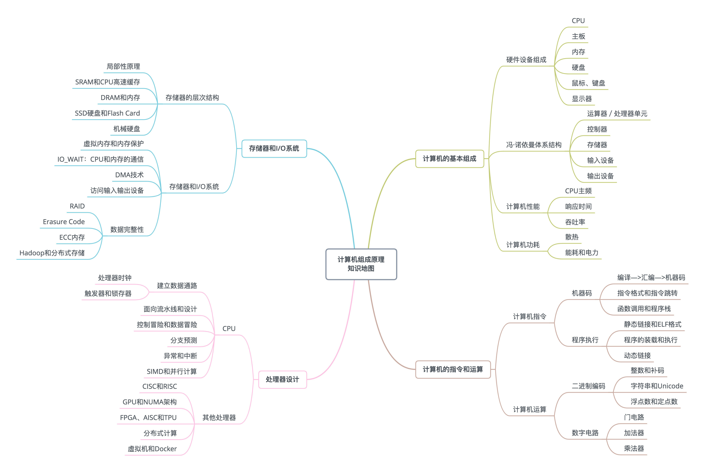
 

## 通过你的CPU主频，我们来谈谈“性能”究竟是什么？

计算机的性能，主要有两个指标。

第一个是响应时间 或者叫执行时间。想要提升响应时间这个性能指标，你可以理解为让计算机“跑得更快”。

第二个是吞吐率或者带宽，想要提升这个指标，你可以理解为让计算机“搬得更多”。

提升吞吐率的办法有很多。大部分时候，我们只要多加一些机器，多堆一些硬件就好了。但是响应时间的提升却没有那么容易。

程序的CPU执行时间 = CPU时钟周期数 × 时钟周期时间

时钟周期时间取决于硬件，软件工程师要重点关注CPU时钟周期数。

对于CPU时钟周期数，我们可以再做一个分解，把它变成`指令数 × 每条指令的平均时钟周期数（简称CPI）`

所以，程序的CPU执行时间 = 指令数 × CPI × 时钟周期时间

要解决性能问题，其实就是要优化这三者。

1. 时钟周期时间，就是计算机主频，这个取决于计算机硬件。
2. 每条指令的平均时钟周期数CPI，就是一条指令到底需要多少CPU Cycle。
3. 指令数，代表执行我们的程序到底需要多少条指令、用哪些指令。

## 穿越功耗墙，我们该从哪些方面提升“性能”？

我们知道CPU的性能，取决于：程序的CPU执行时间 = 指令数 × CPI × 时钟周期时间

1978年到2000年里，提升CPU性能的主要方式是不断提升CPU的时钟频率。

主要是两个措施：增加密度、提升主频。

增加密度，就是同样的面积里面，多放一些晶体管。

提升主频，就是让晶体管“打开”和“关闭”得更快一点。

而这两者，都会增加功耗，带来耗电和散热的问题。这也是限制CPU主频提升的主要原因。

一个CPU的功率，可以用这样一个公式来表示：

`功耗 ~= 1/2 ×负载电容×电压的平方×开关频率×晶体管数量`

为了要提升性能，我们需要不断地增加晶体管数量。同样的面积下，我们想要多放一点晶体管，就要把晶体管造得小一点。这个就是平时我们所说的提升“制程”。

从28nm到7nm，相当于晶体管本身变成了原来的1/4大小。这个就相当于我们在工厂里，同样的活儿，我们要找瘦小一点的工人，这样一个工厂里面就可以多一些人。我们还要提升主频，让开关的频率变快，也就是要找手脚更快的工人。

但是，功耗增加太多，就会导致CPU散热跟不上，这时，我们就需要降低电压。

事实上，从5MHz主频的8086到5GHz主频的Intel i9，CPU的电压已经从5V左右下降到了1V左右。这也是为什么我们CPU的主频提升了1000倍，但是功耗只增长了40倍。

制程的优化和电压的下降，是通过提升主频提升性能。到从奔腾4开始，这个提升已经到了极限。

上一讲，我们知道影响性能有两个指标：响应时间跟吞吐量。

既然响应时间改变不了，就提升吞吐量。

我们现在用的2核、4核，乃至8核的CPU，性能也就成倍提升。

提升响应时间，就好比提升你用的交通工具的速度，比如原本你是开汽车，现在变成了火车乃至飞机。本来开车从上海到北京要20个小时，换成飞机就只要2个小时了，但是，在此之上，再想要提升速度就不太容易了。我们的CPU在奔腾4的年代，就好比已经到了飞机这个速度极限。

那你可能要问了，接下来该怎么办呢？相比于给飞机提速，工程师们又想到了新的办法，可以一次同时开2架、4架乃至8架飞机。虽然从上海到北京的时间没有变，但是一次飞8架飞机能够运的东西自然就变多了，也就是所谓的“吞吐率”变大了。

这也是一个最常见的提升性能的方式，通过并行提高性能。

# 原理篇：指令和运算

## 计算机指令

CPU就是计算机的大脑，中文是中央处理器。

从硬件的角度来看，CPU就是一个超大规模集成电路，通过电路实现了加法、乘法乃至各种各样的处理逻辑。

从软件的角度来讲，CPU就是一个执行各种计算机指令的逻辑机器。我们把计算机指令，叫作机器语言。

高级语言，需要先翻译成汇编语言，最后翻译成机器码。

之所以需要先编译成汇编代码，是因为汇编代码是给人看的。

我们日常用的Intel CPU，有2000条左右的CPU指令，常见的指令可以分成五大类。

 

 

不同的CPU有不同的指令集，也就对应着不同的汇编语言和不同的机器码。

要理解机器码的计算方式，可以参考MIPS指令集，看看机器码是如何生成的。这里不赘述。

## CPU是如何执行指令的？

逻辑上，CPU其实就是由一堆寄存器组成的。而寄存器就是CPU内部，由多个触发器或者锁存器组成的简单电路。

寄存器功能各异，有指令地址寄存器、指令寄存器、条件码寄存器等。

实际上，一个程序执行的时候，CPU会根据PC寄存器里的地址，从内存里面把需要执行的指令读取到指令寄存器里面执行，然后根据指令长度自增，开始顺序读取下一条指令。可以看到，一个程序的一条条指令，在内存里面是连续保存的，也会一条条顺序加载。

而有些特殊指令，比如跳转指令，会修改PC寄存器里面的地址值。这样，下一条要执行的指令就不是从内存里面顺序加载的了。

事实上，这些跳转指令的存在，也是我们可以在写程序的时候，使用if…else条件语句和while/for循环语句的原因。

我们讲打孔卡的时候说到，读取打孔卡的机器会顺序地一段一段地读取指令，然后执行。执行完一条指令，它会自动地顺序读取下一条指令。如果执行的当前指令带有跳转的地址，比如往后跳10个指令，那么机器会自动将卡片带往后移动10个指令的位置，再来执行指令。同样的，机器也能向前移动，去读取之前已经执行过的指令。这也就是我们的while/for循环实现的原理。

虽然我们可以用高级语言，可以用不同的语法，比如 if…else 这样的条件分支，或者 while/for 这样的循环方式，来实现不用的程序运行流程，但是回归到计算机可以识别的机器指令级别，其实都只是一个简单的地址跳转而已，也就是一个类似于goto的语句。

想要在硬件层面实现这个goto语句，除了本身需要用来保存下一条指令地址，以及当前正要执行指令的PC寄存器、指令寄存器外，我们只需要再增加一个条件码寄存器，来保留条件判断的状态。这样简简单单的三个寄存器，就可以实现条件判断和循环重复执行代码的功能。

## 函数调用

函数调用和上一节我们讲的if…else和for/while循环有点像。它们两个都是在原来顺序执行的指令过程里，执行了一个内存地址的跳转指令，让指令从原来顺序执行的过程里跳开，从新的跳转后的位置开始执行。

但是，这两个跳转有个区别，if…else和for/while的跳转，是跳转走了就不再回来了，就在跳转后的新地址开始顺序地执行指令，而函数调用的跳转，在对应函数的指令执行完了之后，还要再回到函数调用的地方，继续执行call之后的指令。

我们在内存里面开辟一段空间，用栈这个后进先出的数据结构。栈就像一个乒乓球桶，每次程序调用函数之前，我们都把调用返回后的地址写在一个乒乓球上，然后塞进这个球桶。这个操作其实就是我们常说的压栈。如果函数执行完了，我们就从球桶里取出最上面的那个乒乓球，很显然，这就是出栈。

拿到出栈的乒乓球，找到上面的地址，把程序跳转过去，就返回到了函数调用后的下一条指令了。如果函数A在执行完成之前又调用了函数B，那么在取出乒乓球之前，我们需要往球桶里塞一个乒乓球。

在真实的程序里，压栈的不只有函数调用完成后的返回地址。

比如函数A在调用B的时候，需要传输一些参数数据，这些参数数据在寄存器不够用的时候也会被压入栈中。整个函数A所占用的所有内存空间，就是函数A的栈帧，放在了栈里面。

让函数A调用自己，并且不设任何终止条件。这样一个无限递归的程序，在不断地压栈过程中，将整个栈空间填满，就会造成 stack overflow。

## ELF和静态链接：为什么程序无法同时在Linux和Windows下运行？

高级语言可以通过编译器编译成汇编代码，然后汇编代码再通过汇编器变成CPU可以理解的机器码，于是CPU就可以执行这些机器码了。

但是这个描述把过程大大简化了。下面，我们一起具体来看，C语言程序是如何变成一个可执行程序的。

实际上，“C语言代码-汇编代码-机器码” 这个过程，在我们的计算机上进行的时候是由两部分组成的。

第一个部分由编译（Compile）、汇编（Assemble）以及链接（Link）三个阶段组成。在这三个阶段完成之后，我们就生成了一个可执行文件。

第二部分，我们通过装载器（Loader）把可执行文件装载（Load）到内存中。CPU从内存中读取指令和数据，来开始真正执行程序。

 

 

在Linux下，可执行文件和目标文件所使用的都是一种叫ELF的文件格式，中文名字叫可执行与可链接文件格式，这里面不仅存放了编译成的汇编指令，还保留了很多别的数据。

链接器会扫描所有输入的目标文件，然后把所有符号表里的信息收集起来，构成一个全局的符号表。

符号表相当于一个地址簿，把函数名称、变量名称和地址关联了起来。

然后再根据重定位表，把所有不确定要跳转地址的代码，根据符号表里面存储的地址，进行一次修正。最后，把所有的目标文件的对应段进行一次合并，变成了最终的可执行代码。

在链接器把程序变成可执行文件之后，要装载器去执行程序就容易多了。装载器不再需要考虑地址跳转的问题，只需要解析 ELF 文件，把对应的指令和数据，加载到内存里面供CPU执行就可以了。

在Linux下可以执行而在Windows下不能执行了。其中一个非常重要的原因就是，两个操作系统下可执行文件的格式不一样。

Linux下的ELF文件格式，而Windows的可执行文件格式是一种叫作PE的文件格式。

Linux下著名的开源项目Wine，就是通过兼容PE格式的装载器，使得我们能直接在Linux下运行Windows程序的。而现在微软的Windows里面也提供了WSL。

我们去写可以用的程序，也不仅仅是把所有代码放在一个文件里来编译执行，而是可以拆分成不同的函数库，最后通过一个静态链接的机制，使得不同的文件之间既有分工，又能通过静态链接来“合作”，变成一个可执行的程序。

对于ELF格式的文件，为了能够实现这样一个静态链接的机制，里面不只是简单罗列了程序所需要执行的指令，还会包括链接所需要的重定位表和符号表。

## 程序装载

程序的执行过程大致是：链接器把多个文件合并成一个最终可执行文件，装载器把可执行文件解析ELF或者PE格式的可执行文件，最后装载器会把对应的指令和数据加载到内存里面来，让CPU去执行。

事实上，装载器把指令装载到内存里面，需要满足两个要求：

1. 可执行程序加载后占用的内存空间应该是连续的。这是因为执行指令的时候，程序计数器是顺序地一条一条指令执行下去。这也就意味着，这一条条指令需要连续地存储在一起。
2. 我们需要同时加载很多个程序，所以程序的内存地址无法由程序自己规定。

要满足这两个基本的要求，我们很容易想到一个办法。那就是我们可以在内存里面，找到一段连续的内存空间，然后分配给装载的程序，然后把这段连续的内存空间地址，和整个程序指令里指定的内存地址做一个映射。

我们把指令里用到的内存地址叫作虚拟内存地址，实际在内存硬件里面的空间地址，我们叫物理内存地址。

程序里有指令和各种内存地址，我们只需要关心虚拟内存地址就行了。程序指令执行的时候，会通过虚拟内存地址，找到对应的物理内存地址，然后执行。因为是连续的内存地址空间，所以我们只需要维护映射关系的起始地址和对应的空间大小就可以了。

这种找出一段连续的物理内存和虚拟内存地址进行映射的方法，我们叫内存分段。

但它也有一些不足之处，第一个就是内存碎片的问题。

如下图所示，由于内存碎片，内存中有256M的空间，却无法装载200M的程序。

 
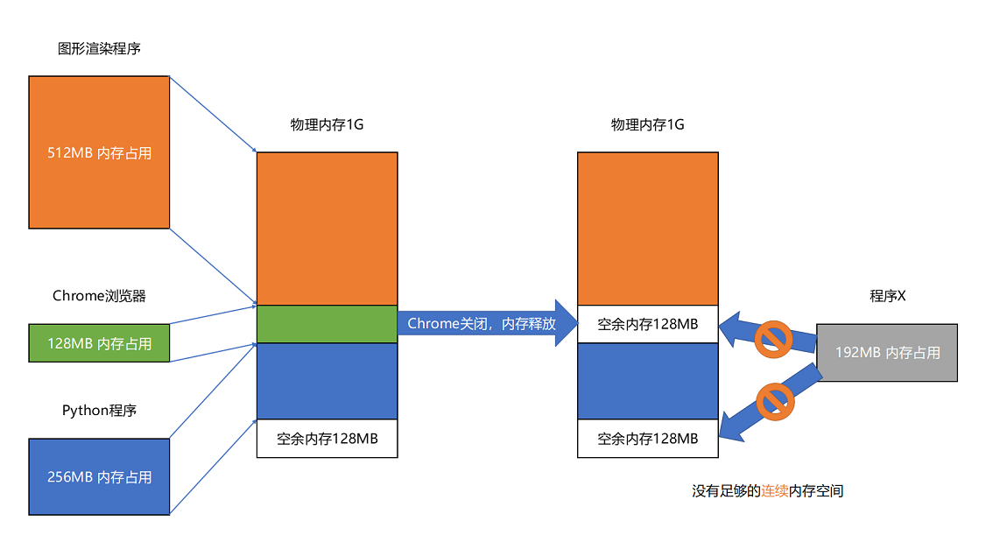
 

解决的办法叫内存交换。如上图，我们可以将256M的内存写到硬盘上，然后再从硬盘上读回来到内存里面。读回来的时候，紧紧跟在那已经被占用了的512MB内存后面。这样，我们就有了连续的256MB内存空间，就可以去加载一个新的200MB的程序。

如果你自己安装过Linux操作系统，你应该遇到过分配一个swap硬盘分区的问题。这块分出来的磁盘空间，其实就是专门给Linux操作系统进行内存交换用的。

虚拟内存、分段，再加上内存交换，可以解决计算机同时装载运行多个程序的问题。不过，这三者的组合仍然会遇到一个性能瓶颈。硬盘的访问速度要比内存慢很多，而每一次内存交换，我们都需要把一大段连续的内存数据写到硬盘上。所以，如果内存交换的时候，交换的是一个很占内存空间的程序，这样整个机器都会显得卡顿。

既然问题出在内存碎片和内存交换的空间太大上，那么解决问题的办法就是，少出现一些内存碎片。另外，当需要进行内存交换的时候，让需要交换写入或者从磁盘装载的数据更少一点，这样就可以解决这个问题。这个办法，在现在计算机的内存管理里面，就叫作内存分页。

和分段这样分配一整段连续的空间给到程序相比，分页是把整个物理内存空间切成一段段固定尺寸的大小。而对应的程序所需要占用的虚拟内存空间，也会同样切成一段段固定尺寸的大小。这样一个连续并且尺寸固定的内存空间，我们叫页。从虚拟内存到物理内存的映射，不再是拿整段连续的内存的物理地址，而是按照一个一个页来的。页的尺寸一般远远小于整个程序的大小。在Linux下，我们通常只设置成4KB。

 
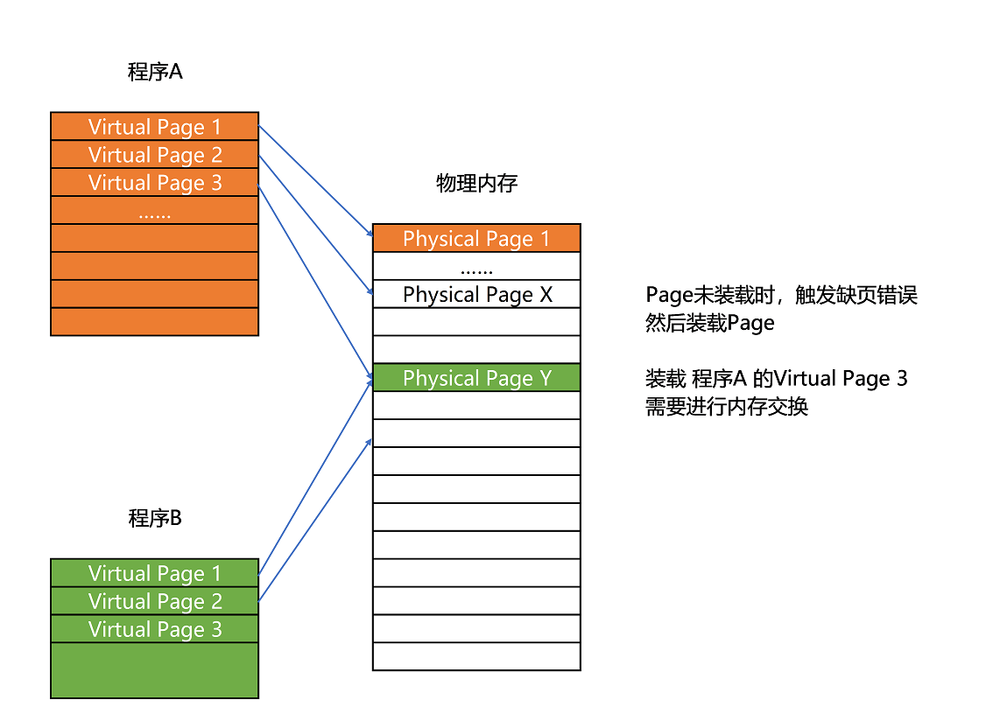
 

分页的方式使得我们在加载程序的时候，不再需要一次性都把程序加载到物理内存中。我们完全可以在进行虚拟内存和物理内存的页之间的映射之后，并不真的把页加载到物理内存里，而是只在程序运行中，需要用到对应虚拟内存页里面的指令和数据时，再加载到物理内存里面去。

实际上，我们的操作系统，的确是这么做的。当要读取特定的页，却发现数据并没有加载到物理内存里的时候，就会触发一个来自于CPU的缺页错误（Page Fault）。我们的操作系统会捕捉到这个错误，然后将对应的页，从存放在硬盘上的虚拟内存里读取出来，加载到物理内存里。这种方式，使得我们可以运行那些远大于我们实际物理内存的程序。同时，这样一来，任何程序都不需要一次性加载完所有指令和数据，只需要加载当前需要用到就行了。

通过虚拟内存、内存交换和内存分页这三个技术的组合，我们最终得到了一个让程序不需要考虑实际的物理内存地址、大小和当前分配空间的解决方案。这些技术和方法，对于我们程序的编写、编译和链接过程都是透明的。这也是我们在计算机的软硬件开发中常用的一种方法，就是加入一个间接层。

通过引入虚拟内存、页映射和内存交换，我们的程序本身，就不再需要考虑对应的真实的内存地址、程序加载、内存管理等问题了。任何一个程序，都只需要把内存当成是一块完整而连续的空间来直接使用。

在虚拟内存、内存交换和内存分页这三者结合之下，运行一个程序，“必需”的内存是很少的。CPU只需要执行当前的指令，极限情况下，内存也只需要加载一页就好了。再大的程序，也可以分成一页。每次，只在需要用到对应的数据和指令的时候，从硬盘上交换到内存里面来就好了。以我们现在4K内存一页的大小，640K内存也能放下足足160页呢，也无怪乎在比尔·盖茨会说出“640K内存对哪个人来说都够用了”这样的话。

不过硬盘的访问速度比内存慢很多，所以现在计算机的内存普遍都很大。

## 动态链接

程序的链接，是把对应的不同文件内的代码段，合并到一起，成为最后的可执行文件。这种方式可以实现复用，我们需要一段代码，就去复制一段过来。

但这种方式会导致内存中有很多冗余代码。

要解决这个问题，就要引入一种新的链接方法，叫作动态链接。相应的，我们之前说的合并代码段的方法，就是静态链接。

在动态链接的过程中，我们想要“链接”的，不是存储在硬盘上的目标文件代码，而是加载到内存中的共享库。

这个加载到内存中的共享库会被很多个程序的指令调用到。在Windows下，这些共享库文件就是.dll文件。在Linux下，这些共享库文件就是.so文件。

不过，要想要在程序运行的时候共享代码，也有一定的要求，就是这些机器码必须是“地址无关”的。换句话说就是，这段代码，无论加载在哪个内存地址，都能够正常执行。如果不是这样的代码，就是地址相关的代码。

之所以这样要求，是因为对于所有动态链接共享库的程序来讲，虽然我们的共享库用的都是同一段物理内存地址，但是在不同的应用程序里，它所在的虚拟内存地址是不同的。我们没办法、也不应该要求动态链接同一个共享库的不同程序，必须把这个共享库所使用的虚拟内存地址变成一致。如果这样的话，我们写的程序就必须明确地知道内部的内存地址分配。

那么，我们应该如何做到地址无关？

只需要使用相对地址就好了。各种指令中使用到的内存地址，给出的不是一个绝对的地址空间，而是一个相对于当前指令偏移量的内存地址。因为整个共享库是放在一段连续的虚拟内存地址中的，无论装载到哪一段地址，不同指令之间的相对地址都是不变的。

在动态链接对应的共享库，我们在共享库的data section里面，保存了一张全局偏移表（GOT），虽然共享库的代码部分的物理内存是共享的，但是数据部分是各个动态链接它的应用程序里面各加载一份的。

所有需要引用当前共享库外部的地址的指令，都会查询GOT，来找到当前运行程序的虚拟内存里的对应位置。而GOT表里的数据，则是在我们加载一个个共享库的时候写进去的。

这样，不同的程序调用的同样的动态库，不需要去修改动态库里面的代码所使用的地址，而是各个程序各自维护好自己的GOT，能够找到对应的动态库就好了。

动态链接把我们的内存利用到了极致。同样功能的代码生成的共享库，我们只要在内存里面保留一份就好了。这样，我们不仅能够做到代码在开发阶段的复用，也能做到代码在运行阶段的复用。

以上五讲，我们已经把程序怎么从源代码变成指令、数据，并装载到内存里面，由CPU一条条执行下去的过程讲完了。

## 二进制编码

现代计算机都是用0和1组成的二进制，来表示所有的信息。

二进制和我们平时用的十进制，其实并没有什么本质区别，只是平时我们是“逢十进一”，这里变成了“逢二进一”而已。

比如十进制的3，对应的二进制数，就是1101。

对于负数来说，二进制的表示方法有两种：原码表示法和补码表示法。

原码表示法，最高位是单独的符号位，0表示正数，1表示负数。比如0011就表示为+3，1011表示-3。这种方式会白白浪费一位，且1000跟0000都代表0。

补码表示法，一样是用最高位来表示正负，在计算整个二进制值的时候，在左侧最高位前面加个负号。

比如，一个4位的二进制补码数值1011，转换成十进制，就是`-1×2^3+0×2^2+1×2^1+1×2^0=-5`。

如果最高位是1，这个数必然是负数；最高位是0，必然是正数。并且，只有0000表示0，1000在这样的情况下表示-8。一个4位的二进制数，可以表示从-8到7这16个整数，不会白白浪费一位。

更重要的一点是，用补码来表示负数，使得我们的整数相加变得很容易，不需要做任何特殊处理，只是把它当成普通的二进制相加，就能得到正确的结果。

以 `-5 + 1 = -4`，`-5 + 6 = 1` 为例

 
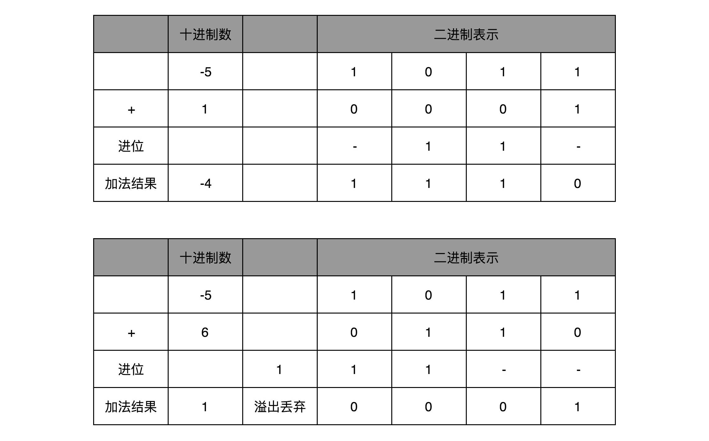
 

不仅数值可以用二进制表示，字符乃至更多的信息都能用二进制表示。最典型的例子就是字符串。

最早计算机只需要使用英文字符，加上数字和一些特殊符号，然后用8位的二进制，就能表示我们日常需要的所有字符了，这个就是我们常常说的ASCII码。

ASCII码就好比一个字典，用8位二进制中的128个不同的数，映射到128个不同的字符里。

在ASCII码里面，数字9不再像整数表示法里一样，用0000 1001来表示，而是用0011 1001 来表示。字符串15也不是用0000 1111 这8位来表示，而是变成两个字符1和5连续放在一起，也就是 0011 0001 和 0011 0101，需要用两个8位来表示。

我们可以看到，最大的32位整数，就是 2147483647 ，计算方法是`Math.pow(2, 31) - 1`，这是由于补码表示法，最高位0表示正数，1表示负数，所以这里是2的31次方，由于是正数，首位必须是0。

可以看到，2147483647 用整数表示法，只需要32位就能表示了。但是如果用字符串来表示，一共有10个字符，每个字符用8位的话，需要整整80位。比起整数表示法，要多占很多空间。

这也是为什么，很多时候我们在存储数据的时候，要采用二进制序列化这样的方式，而不是简单地把数据通过CSV或者JSON，这样的文本格式存储来进行序列化。不管是整数也好，浮点数也好，采用二进制序列化会比存储文本省下不少空间。

ASCII码只表示了128个字符，显然是不太够用的。所以计算机工程师们开始各显神通，给自己国家的语言创建了对应的字符集（Charset）和字符编码（Character Encoding）。

字符集，表示的可以是字符的一个集合。

比如“中文”就是一个字符集，不过这样描述一个字符集并不准确。想要更精确一点，我们可以说，“第一版《新华字典》里面出现的所有汉字”，这是一个字符集。这样，我们才能明确知道，一个字符在不在这个集合里面。比如，我们日常说的Unicode，其实就是一个字符集，包含了150种语言的14万个不同的字符。

而字符编码则是对于字符集里的这些字符，怎么一一用二进制表示出来的一个字典。我们上面说的Unicode，就可以用UTF-8、UTF-16，乃至UTF-32来进行编码，存储成二进制。

同样的文本，采用不同的编码存储下来。如果另外一个程序，用一种不同的编码方式来进行解码和展示，就会出现乱码。这就好像两个军队用密语通信，如果用错了密码本，那看到的消息就会不知所云。在中文世界里，最典型的就是“手持两把锟斤拷，口中疾呼烫烫烫”的典故。

首先，“锟斤拷”的来源是这样的。如果我们想要用Unicode编码记录一些文本，特别是一些遗留的老字符集内的文本，但是这些字符在Unicode中可能并不存在。于是，Unicode会统一把这些字符记录为U+FFFD这个编码。如果用UTF-8的格式存储下来，就是\xef\xbf\xbd。如果连续两个这样的字符放在一起，\xef\xbf\xbd\xef\xbf\xbd，这个时候，如果程序把这个字符，用GB2312的方式进行decode，就会变成“锟斤拷”。这就好比我们用GB2312这本密码本，去解密别人用UTF-8加密的信息，自然没办法读出有用的信息。

而“烫烫烫”，则是因为如果你用了Visual Studio的调试器，默认使用MBCS字符集。“烫”在里面是由0xCCCC来表示的，而0xCC又恰好是未初始化的内存的赋值。于是，在读到没有赋值的内存地址或者变量的时候，电脑就开始大叫“烫烫烫”了。

了解了这些原理，相信你未来在遇到中文的编码问题的时候，可以做到“手中有粮，心中不慌”了。

到这里，我们可以用二进制编码的方式，表示任意的信息。只要建立起字符集和字符编码，并且得到大家的认同，我们就可以在计算机里面表示这样的信息了。

不过，光是明白怎么把数值和字符在逻辑层面用二进制表示是不够的。我们在计算机组成里面，关心的不只是数值和字符的逻辑表示，更要弄明白，在硬件层面，这些数值和我们一直提的晶体管和电路有什么关系。

这是下一讲的主要内容。

## 理解电路

信息需要传递，比起灯塔和烽火台这样的设备，电报信号有明显的优势，速度更快，效率更高。

而制造一台电报机也非常容易。电报机本质上就是一个“蜂鸣器+长长的电线+按钮开关”。蜂鸣器装在接收方手里，开关留在发送方手里。双方用长长的电线连在一起。当按钮开关按下的时候，电线的电路接通了，蜂鸣器就会响。短促地按下，就是一个短促的点信号；按的时间稍微长一些，就是一个稍长的划信号。

我们把“点”当成“1”，把“划”当成“0”。这样一来，我们的电报信号就是另一种特殊的二进制编码了。

有了电报机，只要铺设好电报线路，就可以传输我们需要的讯息了。

但是这里面又出现了一个新的挑战，就是随着电线的线路越长，电线的电阻就越大。当电阻很大，而电压不够的时候，即使你按下开关，蜂鸣器也不会响。

为了解决这个问题，我们可以实现接力传输。在电路里面，工程师们造了一个叫作继电器（Relay）的设备。

我们把原先用来输出声音的蜂鸣器，换成一段环形的螺旋线圈，让电路封闭通上电。因为电磁效应，这段螺旋线圈会产生一个带有磁性的电磁场。我们原本需要输入的按钮开关，就可以用一块磁力稍弱的磁铁把它设在“关”的状态。这样，按下上一个电报站的开关，螺旋线圈通电产生了磁场之后，磁力就会把开关“吸”下来，接通到下一个电报站的电路。

如果我们在中间所有小电报站都用这个“螺旋线圈+磁性开关”的方式，来替代蜂鸣器和普通开关，而只在电报的始发和终点用普通的开关和蜂鸣器，我们就有了一个拆成一段一段的电报线路，接力传输电报信号。

事实上，继电器还有一个名字就叫作电驿，这个“驿”就是驿站的驿，可以说非常形象了。这个接力的策略不仅可以用在电报中，在通信类的科技产品中其实都可以用到。

比如说，你在家里用WiFi，如果你的屋子比较大，可能某些房间的信号就不好。你可以选用支持“中继”的WiFi路由器，在信号衰减的地方，增加一个WiFi设备，接收原来的WiFi信号，再重新从当前节点传输出去。这种中继对应的英文名词和继电器是一样的，也叫Relay。

再比如说，我们现在互联网使用的光缆，是用光信号来传输数据。随着距离的增长、反射次数的增加，信号也会有所衰减，我们同样要每隔一段距离，来增加一个用来重新放大信号的中继。

有了继电器之后，我们不仅有了一个能够接力传输信号的方式，更重要的是，和输入端通过开关的“开”和“关”来表示“1”和“0”一样，我们在输出端也能表示“1”和“0”了。

输出端的作用，不仅仅是通过一个蜂鸣器或者灯泡，提供一个供人观察的输出信号，通过“螺旋线圈 + 磁性开关”，使得我们有“开”和“关”这两种状态，这个“开”和“关”表示的“1”和“0”，还可以作为后续线路的输入信号，让我们开始可以通过最简单的电路，来组合形成我们需要的逻辑。

通过这些线圈和开关，我们也可以很容易地创建出 “与（AND）”“或（OR）”“非（NOT）”这样的逻辑。我们在输入端的电路上，提供串联的两个开关，只有两个开关都打开，电路才接通，输出的开关也才能接通，这其实就是模拟了计算机里面的“与”操作。

我们在输入端的电路，提供两条独立的线路到输出端，两条线路上各有一个开关，那么任何一个开关打开了，到输出端的电路都是接通的，这其实就是模拟了计算机中的“或”操作。

当我们把输出端的“螺旋线圈+磁性开关”的组合，从默认关掉，只有通电有了磁场之后打开，换成默认是打开通电的，只有通电之后才关闭，我们就得到了一个计算机中的“非”操作。输出端开和关正好和输入端相反。这个在数字电路中，也叫作反向器（Inverter）。

与、或、非的电路都非常简单，要想做稍微复杂一点的工作，我们需要很多电路的组合。不过，这也彰显了现代计算机体系中一个重要的思想，就是通过分层和组合，逐步搭建起更加强大的功能。

## 加法器

我们先了解下异或运算，所谓异或运算，参与运算的两个值，如果两个相应位相同，则结果为0，否则为1。即：0^0=0， 1^0=1， 0^1=1， 1^1=0

基础门电路中有一个异或门，它就是操作异或运算。异或门就是一个最简单的整数加法，所需要使用的基本门电路。

算完个位的输出还不算完，输入的两位都是11的时候，我们还需要向更左侧的一位进行进位。那这个就对应一个与门，也就是有且只有在加数和被加数都是1的时候，我们的进位才会是1。

所以，通过一个异或门计算出个位，通过一个与门计算出是否进位，我们就通过电路算出了一个一位数的加法。于是，我们把两个门电路打包，给它取一个名字，就叫作半加器。

半加器可以解决个位的加法问题，但是如果放到二位上来说，就不够用了。

二位用一个半加器不能计算完成的原因也很简单。因为二位除了一个加数和被加数之外，还需要加上来自个位的进位信号，一共需要三个数进行相加，才能得到结果。

解决方案也并不复杂。我们用两个半加器和一个或门，就能组合成一个全加器。

有了全加器，我们要进行对应的两个8 bit数的加法就很容易了。我们只要把8个全加器串联起来就好了。个位的全加器的进位信号作为二位全加器的输入信号，二位全加器的进位信号再作为四位的全加器的进位信号。这样一层层串接八层，我们就得到了一个支持8位数加法的算术单元。如果要扩展到16位、32位，乃至64位，都只需要多串联几个输入位和全加器就好了。

唯一需要注意的是，对于这个全加器，在个位，我们只需要用一个半加器，或者让全加器的进位输入始终是0。因为个位没有来自更右侧的进位。而最左侧的一位输出的进位信号，表示的并不是再进一位，而是表示我们的加法是否溢出了。

## 乘法器

二进制乘法计算过程如下：

 
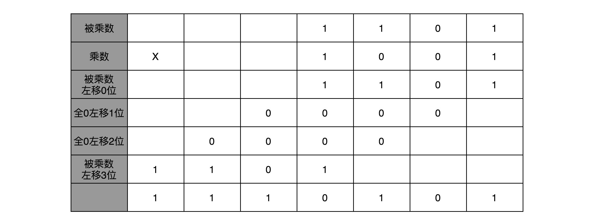
 

在13×9这个例子里面，被乘数13表示成二进制是1101，乘数9在二进制里面是1001。最右边的个位是1，所以个位乘以被乘数，就是把被乘数1101复制下来。因为二位和四位都是0，所以乘以被乘数都是0，那么保留下来的都是0000。乘数的八位是1，我们仍然需要把被乘数1101复制下来。不过这里和个位位置的单纯复制有一点小小的差别，那就是要把复制好的结果向左侧移三位，然后把四位单独进行乘法加位移的结果，再加起来，我们就得到了最终的计算结果。

对应到我们之前讲的数字电路和ALU，你可以看到，最后一步的加法，我们可以用上一讲的加法器来实现。

我们可以用一个开关来决定，下面的输出是完全复制输入，还是将输出全部设置为0

 
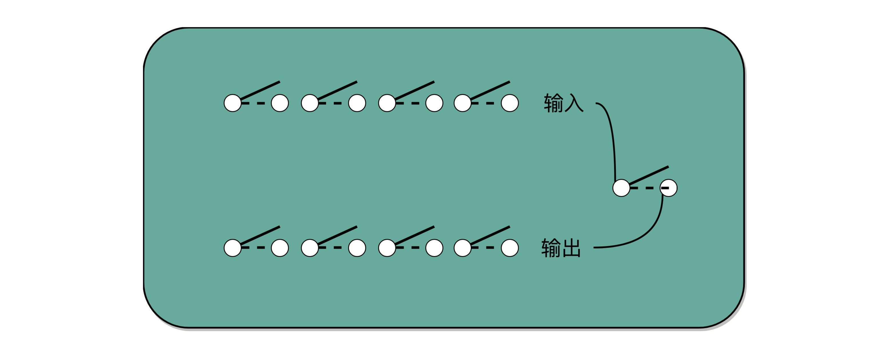
 

至于位移也不麻烦，把对应的线路错位连接，就可以起到位移的作用

 
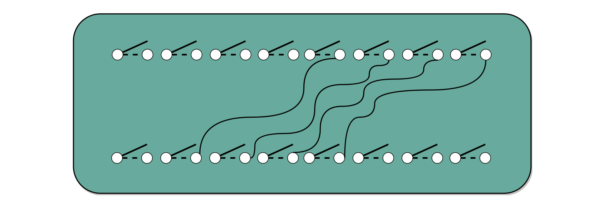
 

你会发现，不需要单独实现一个更复杂的电路，就能够实现乘法。

为了节约一点开关，也就是晶体管的数量。

我们先拿乘数最右侧的个位乘以被乘数，然后把结果写入用来存放计算结果的开关里面，然后，把被乘数左移一位，把乘数右移一位，仍然用乘数去乘以被乘数，然后把结果加到刚才的结果上。反复重复这一步骤，直到不能再左移和右移位置。这样，乘数和被乘数就像两列相向而驶的列车，仅仅需要简单的加法器、一个可以左移一位的电路和一个右移一位的电路，就能完成整个乘法。

以计算13×9，也就是二进制的1101×1001来具体看。

 
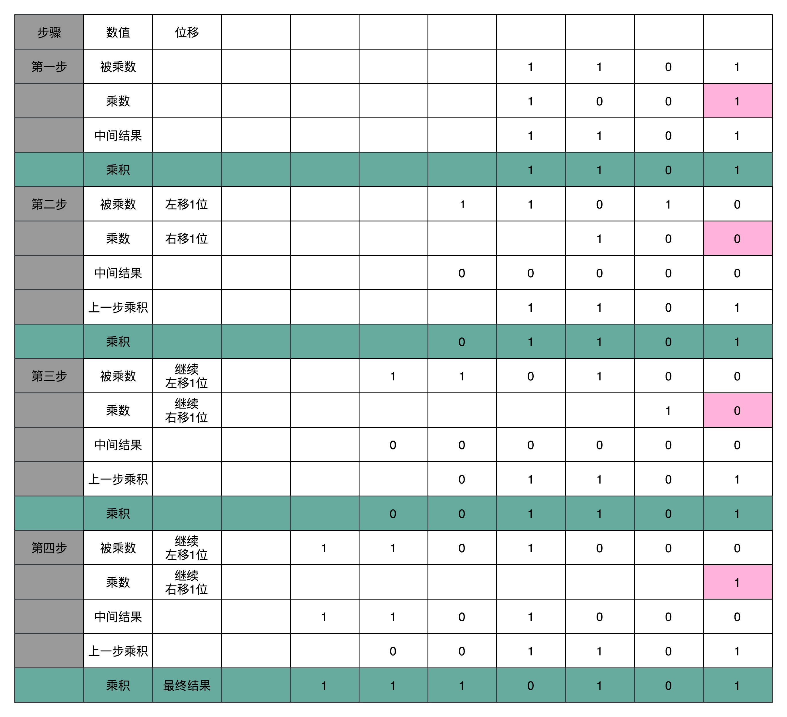
 

这个计算方式虽然节约电路了，但是也有一个很大的缺点，那就是慢。核心原因其实是“顺序”计算，也就是说，要等前面的计算结果完成之后，我们才能得到后面的计算结果。

解题的思路，就是电路并行。

在我们进行加法的时候，如果相加的两个数是确定的，那高位是否会进位其实也是确定的。

怎样才能让高位不需要等待低位的进位结果，而是把低位的所有输入信号都放进来，直接计算出高位的计算结果和进位结果呢？

我们只要把进位部分的电路完全展开就好了。

注：我的理解是，将乘法展开成加法，然后去计算加法。遇到进位，实时汇总到最终结果中。

这里画了一个示意图，展示了一下我们加法器。如果我们完全展开电路，高位的进位和计算结果，可以和低位的计算结果同时获得。这个的核心原因是电路是天然并行的，一个输入信号，可以同时传播到所有接通的线路当中。

 
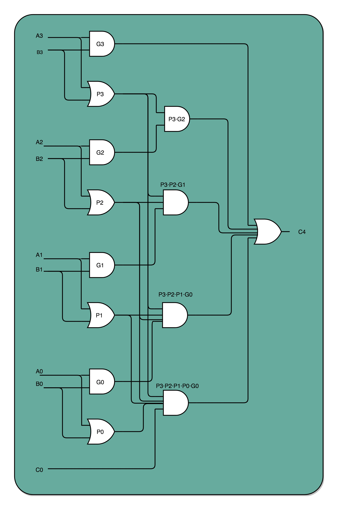
 

这个优化，本质上是利用了电路天然的并行性。电路只要接通，输入的信号自动传播到了所有接通的线路里面，这其实也是硬件和软件最大的不同。

## 浮点数和定点数（上）：怎么用有限的Bit表示尽可能多的信息？

我们现在用的计算机通常用16/32个比特（bit）来表示一个数。32个比特，只能表示2的32次方个不同的数，差不多是40亿个。

40亿个数看似已经很多了，但是比起无限多的实数集合却只是沧海一粟。所以，这个时候，计算机的设计者们，就要面临一个问题了：我到底应该让这40亿个数映射到实数集合上的哪些数，在实际应用中才能最划得来呢？

先说定点数的表示。

有一个很直观的想法，就是我们用4个比特来表示0～9的整数，那么32个比特就可以表示8个这样的整数。然后我们把最右边的2个0～9的整数，当成小数部分；把左边6个0～9的整数，当成整数部分。这样，我们就可以用32个比特，来表示从0到999999.99这样1亿个实数了。

 

 

这种用二进制来表示十进制的编码方式，叫作BCD编码。简单易于理解，但这样的表示方式有点“浪费”，并且没办法同时表示很大的数字和很小的数字。

所以我们引入浮点数的表示。

我们先来想一想。如果我们想在一张便签纸上，用一行来写一个十进制数，能够写下多大范围的数？

因为我们要让人能够看清楚，所以字最小也有一个限制。你会发现一个和上面我们用BCD编码表示数一样的问题，就是纸张的宽度限制了我们能够表示的数的大小。如果宽度只放得下8个数字，那么我们还是只能写下最大到99999999这样的数字。

 

 

其实，这里的纸张宽度，就和我们32个比特一样，是在空间层面的限制。

那么，在现实生活中，我们是怎么表示一个很大的数的呢？答案是科学计数法。

在计算机里，我们也可以用一样的办法，用科学计数法来表示实数。浮点数的科学计数法的表示，有一个IEEE的标准，它定义了两个基本的格式。一个是用32比特表示单精度的浮点数，也就是我们常常说的float或者float32类型。另外一个是用64比特表示双精度的浮点数，也就是我们平时说的double或者float64类型。

双精度类型和单精度类型差不多，这里，我们来看单精度类型，双精度你自然也就明白了。

 

 

单精度的32个比特可以分成三部分。

第一部分是一个符号位，用来表示是正数还是负数。

接下来是一个8个比特组成的指数位。我们一般用e来表示。8个比特能够表示的整数空间，就是0～255。我们在这里用1～254映射到-126～127这254个有正有负的数上。因为我们的浮点数，不仅仅想要表示很大的数，还希望能够表示很小的数，所以指数位也会有负数。

你发现没，我们没有用到0和255。没错，这里的 0（也就是8个比特全部为0） 和 255 （也就是8个比特全部为1）另有它用，我们等一下再讲。

最后，是一个23个比特组成的有效数位。我们用f来表示。综合科学计数法，我们的浮点数就可以表示成下面这样：

`(-1)^s×1.f×2^e`

你会发现，这里的浮点数，没有办法表示0。的确，要表示0和一些特殊的数，我们就要用上在e里面留下的0和255这两个表示，这两个表示其实是两个标记位。在e为0且f为0的时候，我们就把这个浮点数认为是0。至于其它的e是0或者255的特殊情况，你可以看下面这个表格，分别可以表示出无穷大、无穷小、NAN以及一个特殊的不规范数。

 
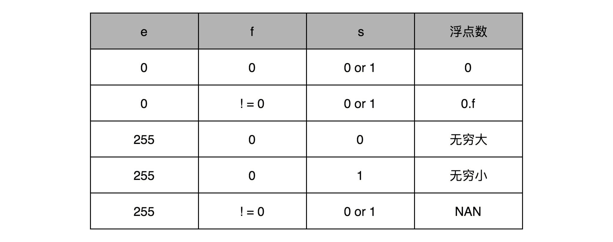
 

我们可以以0.5为例子。0.5的符号为s应该是0，f应该是0，而e应该是-1，也就是

`0.5= (-1)^0×1.0×2^{-1}=0.5`，对应的浮点数表示，就是32个比特。

 
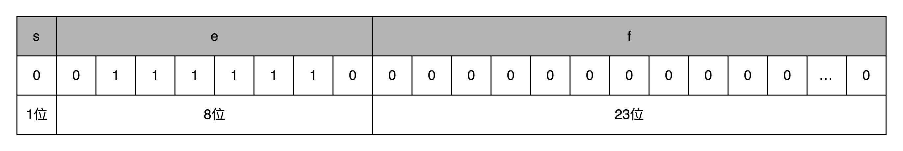
 

`s=0，e = 2^{-1}`，需要注意，e表示从-126到127个，-1是其中的第126个数，这里的e如果用整数表示，就是`2^6+2^5+2^4+2^3+2^2+2^1=126`，`1.f=1.0`。

在这样的浮点数表示下，不考虑符号的话，浮点数能够表示的最小的数和最大的数，差不多是`1.17×10^{-38}`和`3.40×10^{38}`。比前面的BCD编码能够表示的范围大多了。

在这样的表示方式下，浮点数能够表示的数据范围一下子大了很多。正是因为这个数对应的小数点的位置是“浮动”的，它才被称为浮点数。随着指数位e的值的不同，小数点的位置也在变动。对应的，前面的BCD编码的实数，就是小数点固定在某一位的方式，我们也就把它称为定点数。

这里有一个经典问题，为什么我们用0.3 + 0.6不能得到0.9呢？这是因为，浮点数没有办法精确表示0.3、0.6和0.9。事实上，我们拿出0.1～0.9这9个数，其中只有0.5能够被精确地表示成二进制的浮点数，也就是s = 0、e = -1、f = 0这样的情况。

而0.3、0.6乃至我们希望的0.9，都只是一个近似的表达。

## 浮点数和定点数（下）：深入理解浮点数到底有什么用？

任意的十进制浮点数，背后都会对应一个二进制表示。

比方说，我们输入了一个十进制浮点数9.1。

那么按照之前的讲解，在二进制里面，我们应该把它变成一个“符号位s+指数位e+有效位数f”的组合。

**第一步，我们要做的，就是把这个数变成二进制。**

首先，我们把这个数的整数部分，变成一个二进制。这个我们前面讲二进制的时候已经讲过了。这里的9，换算之后就是1001。

接着，我们把对应的小数部分也换算成二进制。

小数怎么换成二进制呢？

我们先来定义一下，小数的二进制表示是怎么回事。我们拿0.1001这样一个二进制小数来举例说明。和上面的整数相反，我们把小数点后的每一位，都表示对应的2的-N次方。那么0.1001，转化成十进制就是：

`1×2^{-1}+0×2^{-2}+0×2^{-3}+1×2^{-4}=0.5625`

和整数的二进制表示采用“除以2，然后看余数”的方式相比，小数部分转换成二进制是用一个相似的反方向操作，就是乘以2，然后看看是否超过1。如果超过1，我们就记下1，并把结果减去1，进一步循环操作。在这里，我们就会看到，0.1其实变成了一个无限循环的二进制小数，0.000110011。这里的“0011”会无限循环下去。

 
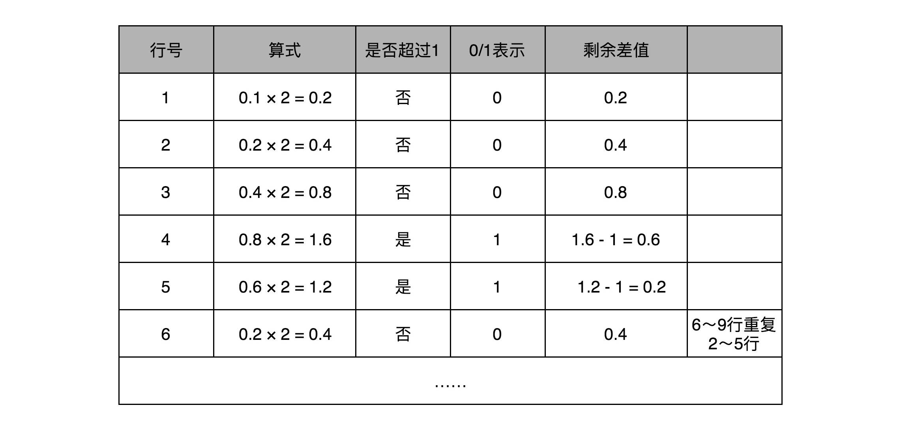
 

然后，我们把整数部分和小数部分拼接在一起，9.1这个十进制数就变成了1001.0**0011**0011…这样一个二进制表示。

上一讲我们讲过，浮点数其实是用二进制的科学计数法来表示的，所以我们可以把小数点左移三位，这个数就变成了：

`1.001000110011… × 2^3`

那这个二进制的科学计数法(`(-1)^s×1.f×2^e`)表示，我们就可以对应到了浮点数的格式里了。这里的符号位s = 0，对应的有效位f=001000110011…。因为f最长只有23位，那这里“0011”无限循环，最多到23位就截止了。于是，f=00100011001100110011 001。最后的一个“0011”循环中的最后一个“1”会被截断掉。对应的指数为e，代表的应该是3。因为指数位有正又有负，所以指数位在127之前代表负数，之后代表正数，那3其实对应的是加上127的偏移量130，转化成二进制，就是130，对应的就是指数位的二进制，表示出来就是10000010。

 
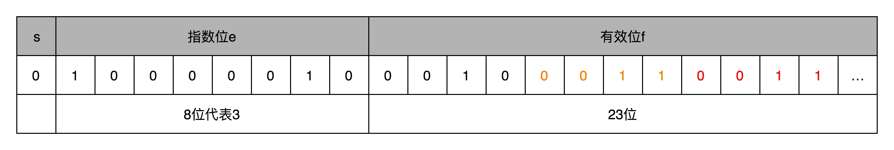
 

然后，我们把“s+e+f”拼在一起，就可以得到浮点数9.1的二进制表示了。最终得到的二进制表示就变成了：

`010000010 0010 0011001100110011 001`

如果我们再把这个浮点数表示换算成十进制， 实际准确的值是9.09999942779541015625。

这也就是为什么，0.3+0.6=0.899999。因为0.3转化成浮点数之后，和这里的9.1一样，并不是精确的0.3了，0.6和0.9也是一样的，最后的计算会出现精度问题。

搞清楚了怎么把一个十进制的数值，转化成IEEE-754标准下的浮点数表示，我们现在来看一看浮点数的加法是怎么进行的。其实原理也很简单，你记住六个字就行了，那就是**先对齐、再计算**。

两个浮点数的指数位可能是不一样的，所以我们要把两个的指数位，变成一样的，然后只去计算有效位的加法就好了。

比如0.5，表示成浮点数(`(-1)^s×1.f×2^e`)，对应的指数位是-1，有效位是00…（后面全是0，记住f前默认有一个1）。0.125表示成浮点数，对应的指数位是-3，有效位也还是00…（后面全是0，记住f前默认有一个1）。

那我们在计算`0.5+0.125`的浮点数运算的时候，首先要把两个的指数位对齐，也就是把指数位都统一成两个其中较大的-1。

所以0.125对应的有效位1.00…要对应右移两位，因为f前面有一个默认的1，所以就会变成0.01。

然后我们计算两者相加的有效位1.f，就变成了有效位1.01，而指数位是-1，这样就得到了我们想要的加法后的结果。

 
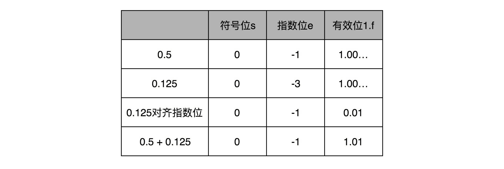
 

这里有一个问题，指数位较小的数，需要在有效位进行右移，在右移的过程中，最右侧的有效位就被丢弃掉了。这会导致对应的指数位较小的数，在加法发生之前，就丢失精度。两个相加数的指数位差的越大，位移的位数越大，可能丢失的精度也就越大。

32位浮点数的有效位长度一共只有23位，如果两个数的指数位差出23位，较小的数右移24位之后，所有的有效位就都丢失了。

在实际计算的时候，只要两个数，差出差不多1600万倍，那这两个数相加之后，结果完全不会变化。这就是“大数吃小数”的情况

具体的解决办法，是Kahan Summation算法，原理其实并不复杂，就是在每次的计算过程中，都用一次减法，把当前加法计算中损失的精度记录下来，然后在后面的循环中，把这个精度损失放在要加的小数上，再做一次运算。

由于存在精度损失，一般情况下，在实践应用中，对于需要精确数值的，比如银行存款、电商交易，我们都会使用定点数或者整数类型。

比方说，你一定在MySQL里用过decimal(12,2)，来表示订单金额。如果我们的银行存款用32位浮点数表示，就会出现，马云的账户里有2千万，我的账户里只剩1块钱。结果银行一汇总总金额，那1块钱在账上就“不翼而飞”了。

而浮点数呢，则更适合我们不需要有一个非常精确的计算结果的情况。因为在真实的物理世界里，很多数值本来就不是精确的，我们只需要有限范围内的精度就好了。比如，从我家到办公室的距离，就不存在一个100%精确的值。我们可以精确到公里、米，甚至厘米，但是既没有必要、也没有可能去精确到微米乃至纳米。

# 原理篇：处理器

## 建立数据通路（上）：指令+运算=CPU

CPU的功能，由两部分组成：指令与计算。

在“指令”部分，我们了解了计算机的“指令”是怎么运行的，也就是我们撰写的代码，是怎么变成一条条的机器能够理解的指令的，以及是按照什么样的顺序运行的。

在“计算”部分，我们了解了计算机的“计算”部分是怎么执行的，数据的二进制表示是怎么样的，我们执行的加法和乘法又是通过什么样的电路来实现的。

光知道这两部分还不能算是真正揭开了CPU的秘密，只有把“指令”和“计算”这两部分功能连通起来，我们才能构成一个真正完整的CPU。

**先说下指令周期。**

计算机每执行一条指令的过程，可以分解成这样几个步骤。

1. Fetch（取得指令），也就是从PC寄存器里找到对应的指令地址，根据指令地址从内存里把具体的指令，加载到指令寄存器中，然后把PC寄存器自增，好在未来执行下一条指令。
2. Decode（指令译码），也就是根据指令寄存器里面的指令，解析成要进行什么样的操作，是R、I、J中的哪一种指令，具体要操作哪些寄存器、数据或者内存地址。
3. Execute（执行指令），也就是实际运行对应的R、I、J这些特定的指令，进行算术逻辑操作、数据传输或者直接的地址跳转。
4. 重复进行1～3的步骤。

这样的步骤，其实就是一个永不停歇的“Fetch - Decode - Execute”的循环，我们把这个循环称之为指令周期

在这个循环过程中，不同部分其实是由计算机中的不同组件完成的。

在取指令的阶段，我们的指令是放在存储器里的，实际上，通过PC寄存器和指令寄存器取出指令的过程，是由控制器（Control Unit）操作的。指令的解码过程，也是由控制器进行的。一旦到了执行指令阶段，无论是进行算术操作、逻辑操作的R型指令，还是进行数据传输、条件分支的I型指令，都是由算术逻辑单元（ALU）操作的，也就是由运算器处理的。不过，如果是一个简单的无条件地址跳转，那么我们可以直接在控制器里面完成，不需要用到运算器。

 
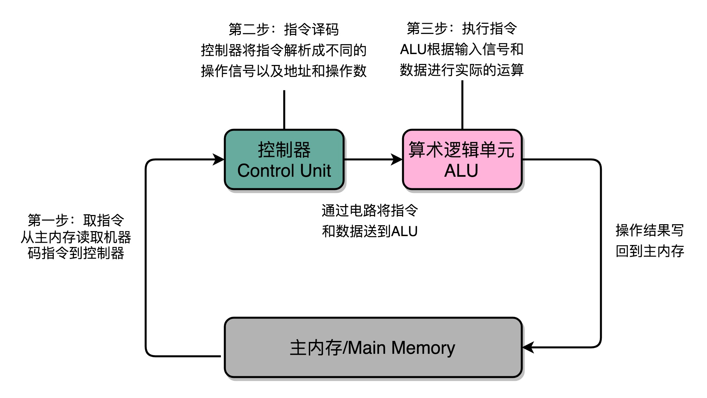
 

除了指令周期，CPU还有两个常见的周期：机器周期/CPU周期、时钟周期。

一个指令周期，包含多个CPU周期，而一个CPU周期包含多个时钟周期。

**再说下建立数据通路**

一般来说，我们可以认为，数据通路就是我们的处理器单元。它通常由两类原件组成。

第一类叫操作元件，也叫组合逻辑元件，其实就是我们的ALU。它们的功能就是在特定的输入下，根据下面的组合电路的逻辑，生成特定的输出。

第二类叫存储元件，也有叫状态元件的。比如我们在计算过程中需要用到的寄存器，无论是通用寄存器还是状态寄存器，其实都是存储元件。

我们通过数据总线的方式，把它们连接起来，就可以完成数据的存储、处理和传输了，这就是所谓的建立数据通路了。

下面我们来说控制器。它的逻辑就没那么复杂了。我们可以把它看成只是机械地重复“Fetch - Decode - Execute“循环中的前两个步骤，然后把最后一个步骤，通过控制器产生的控制信号，交给ALU去处理。

那么，要想搭建出来整个CPU，我们需要在数字电路层面，实现这样一些功能。

首先，自然是我们之前已经讲解过的ALU了，它实际就是一个没有状态的，根据输入计算输出结果的第一个电路。

第二，我们需要有一个能够进行状态读写的电路元件，也就是我们的寄存器。我们需要有一个电路，能够存储到上一次的计算结果。这个计算结果并不一定要立刻拿到电路的下游去使用，但是可以在需要的时候拿出来用。常见的能够进行状态读写的电路，就有锁存器（Latch），以及我们后面要讲的D触发器（Data/Delay Flip-flop）的电路。

第三，我们需要有一个“自动”的电路，按照固定的周期，不停地实现PC寄存器自增，自动地去执行“Fetch - Decode - Execute“的步骤。我们的程序执行，并不是靠人去拨动开关来执行指令的。我们希望有一个“自动”的电路，不停地去一条条执行指令。

我们看似写了各种复杂的高级程序进行各种函数调用、条件跳转。其实只是修改PC寄存器里面的地址。PC寄存器里面的地址一修改，计算机就可以加载一条指令新指令，往下运行。实际上，PC寄存器还有一个名字，就叫作程序计数器。顾名思义，就是随着时间变化，不断去数数。数的数字变大了，就去执行一条新指令。所以，我们需要的就是一个自动数数的电路。

第四，我们需要有一个“译码”的电路。无论是对于指令进行decode，还是对于拿到的内存地址去获取对应的数据或者指令，我们都需要通过一个电路找到对应的数据。这个对应的自然就是“译码器”的电路了。

到这里，我们了解了CPU运转需要的数据通路和控制器，也找出了完成这些功能所需要的4种基本电路。它们分别是，ALU这样的组合逻辑电路、用来存储数据的锁存器和D触发器电路、用来实现PC寄存器的计数器电路，以及用来解码和寻址的译码器电路。

虽然CPU已经是由几十亿个晶体管组成的及其复杂的电路，但是它仍然是由这样一个个基本功能的电路组成的。只要搞清楚这些电路的运作原理，你自然也就弄明白了CPU的工作原理。

## 建立数据通路（中）：指令+运算=CPU

前面我们已经了解了组合逻辑电路，电路输入是确定的，对应的输出自然也就确定了，但每次都要手动更改开关状态

于是，引入第二类的电路，也就是时序逻辑电路

时序逻辑电路可以帮我们解决这样几个问题。

第一个就是自动运行的问题。时序电路接通之后可以不停地开启和关闭开关，进入一个自动运行的状态。这个使得控制器不停地让PC寄存器自增读取下一条指令成为可能。

第二个是存储的问题。通过时序电路实现的触发器，能把计算结果存储在特定的电路里面，而不是像组合逻辑电路那样，一旦输入有任何改变，对应的输出也会改变。

第三个本质上解决了各个功能按照时序协调的问题。无论是程序实现的软件指令，还是到硬件层面，各种指令的操作都有先后的顺序要求。时序电路使得不同的事件按照时间顺序发生。

想要实现时序逻辑电路，第一步我们需要的就是一个时钟。CPU的主频是由一个晶体振荡器来实现的，而这个晶体振荡器生成的电路信号，就是我们的时钟信号。

下面介绍实现这样一个电路。

在下面这张图里你可以看到，我们在原先一般只放一个开关的信号输入端，放上了两个开关。一个开关A，一开始是断开的，由我们手工控制；另外一个开关B，一开始是合上的，磁性线圈对准一开始就合上的开关B。

于是，一旦我们合上开关A，磁性线圈就会通电，产生磁性，开关B就会从合上变成断开。一旦这个开关断开了，电路就中断了，磁性线圈就失去了磁性。于是，开关B又会弹回到合上的状态。这样一来，电路接通，线圈又有了磁性。我们的电路就会来回不断地在开启、关闭这两个状态中切换。

 

 

这个按照固定的周期不断在0和1之间切换的信号，就是我们的时钟信号。这种电路，其实就相当于把电路的输出信号作为输入信号，再回到当前电路。这样的电路构造方式呢，我们叫作反馈电路

有了时钟信号，我们的系统里就有了一个像“自动门”一样的开关。利用这个开关和相同的反馈电路，我们就可以构造出一个有“记忆”功能的电路。这个有记忆功能的电路，可以实现在CPU中用来存储计算结果的寄存器，也可以用来实现计算机五大组成部分之一的存储器。

有了时钟信号和触发器之后，我们还差一个“自动”需求没有实现。我们的计算机还不能做到自动地不停地从内存里面读取指令去执行。这一部分，我们留在下一讲。下一讲里，我们看看怎么让程序自动运转起来。

## 建立数据通路（下）：指令+运算=CPU

通过一个时钟信号，我们可以实现计数器，这个会成为我们的PC寄存器。

然后，我们还需要一个能够帮我们在内存里面寻找指定数据地址的译码器，以及解析读取到的机器指令的译码器。

这样，我们就能把所有学习到的硬件组件串联起来，变成一个CPU，实现我们在计算机指令的执行部分的运行步骤。

先说PC寄存器，它还有个名字叫程序计数器。

有了时钟信号，我们可以提供定时的输入；有了D型触发器，我们可以在时钟信号控制的时间点写入数据。我们把这两个功能组合起来，就可以实现一个自动的计数器了。

这个自动计数器，可以拿来当我们的PC寄存器。事实上，PC寄存器的这个PC，英文就是Program Counter，也就是程序计数器的意思。

再说读写数据所需要的译码器。

我们的数据能够存储在D型触发器里了。如果我们把很多个D型触发器放在一起，就可以形成一块很大的存储空间，甚至可以当成一块内存来用。

像我现在手头这台电脑，有16G内存。那我们怎么才能知道，写入和读取的数据，是在这么大的内存的哪几个比特呢？

于是，我们就需要有一个电路，来完成“寻址”的工作。这个“寻址”电路，就是我们接下来要讲的译码器。

如果把“寻址”这件事情退化到最简单的情况，就是在两个地址中，去选择一个地址。这样的电路，我们叫作2-1选择器。

现代的计算机，如果CPU是64位的，就意味着我们的寻址空间也是`2^{64}`，那么我们就需要一个有64个开关的译码器。

译码器的本质，就是从输入的多个位的信号中，根据一定的开关和电路组合，选择出自己想要的信号。

D触发器、自动计数以及译码器，再加上一个我们之前说过的ALU，我们就凑齐了一个拼装一个CPU必须要的零件了。

到这里，我们可以通过自动计数器的电路，来实现一个PC寄存器，不断生成下一条要执行的计算机指令的内存地址。然后通过译码器，从内存里面读出对应的指令，写入到D触发器实现的指令寄存器中。再通过另外一个译码器，把它解析成我们需要执行的指令和操作数的地址。这些电路，组成了我们计算机五大组成部分里面的控制器。

## 面向流水线的指令设计（上）：一心多用的现代CPU

一条CPU指令的执行，是由“取得指令（Fetch）-指令译码（Decode）-执行指令（Execute） ”这样三个步骤组成的。这个执行过程，至少需要花费一个时钟周期。因为在取指令的时候，我们需要通过时钟周期的信号，来决定计数器的自增。

这就引入一个问题，无论什么指令，都需要等满一个时钟周期，这会带来性能问题。

而其实CPU的指令执行过程，是由各个电路模块组成的。

我们在取指令的时候，需要一个译码器把数据从内存里面取出来，写入到寄存器中；

在指令译码的时候，我们需要另外一个译码器，把指令解析成对应的控制信号、内存地址和数据；

到了指令执行的时候，我们需要的则是一个完成计算工作的ALU。

这些都是一个一个独立的组合逻辑电路，我们可以把它们看作一个团队里面的产品经理、后端工程师和客户端工程师，共同协作来完成任务。

也就是说，指令执行过程，是可以拆分的。

如果我们把一个指令拆分成“取指令-指令译码-执行指令”这样三个部分，那这就是一个三级的流水线。如果我们进一步把“执行指令”拆分成“ALU计算（指令执行）-内存访问-数据写回”，那么它就会变成一个五级的流水线。

五级的流水线，就表示我们在同一个时钟周期里面，同时运行五条指令的不同阶段。

这个时候，虽然执行一条指令的时钟周期变成了5，但是我们可以把CPU的主频提得更高了。我们不需要确保最复杂的那条指令在时钟周期里面执行完成，而只要保障一个最复杂的流水线级的操作，在一个时钟周期内完成就好了。

如果某一个操作步骤的时间太长，我们就可以考虑把这个步骤，拆分成更多的步骤，让所有步骤需要执行的时间尽量都差不多长。这样，也就可以解决我们在单指令周期处理器中遇到的，性能瓶颈来自于最复杂的指令的问题。像我们现代的ARM或者Intel的CPU，流水线级数都已经到了14级。

在外部看来，我们的CPU好像是“一心多用”，在同一时间，同时执行5条不同指令的不同阶段。在CPU内部，其实它就像生产线一样，不同分工的组件不断处理上游传递下来的内容，而不需要等待单件商品生产完成之后，再启动下一件商品的生产过程。

综上，为了能够不浪费CPU的性能，我们通过把指令的执行过程，切分成一个一个流水线级，来提升CPU的吞吐率。而我们本身的CPU的设计，又是由一个个独立的组合逻辑电路串接起来形成的，天然能够适合这样采用流水线“专业分工”的工作方式。

## 面向流水线的指令设计（下）：奔腾4是怎么失败的？

流水线技术和其他技术一样，都讲究一个“折衷”（Trade-Off）。一个合理的流水线深度，会提升我们CPU执行计算机指令的吞吐率。

过深的流水线，不仅不能提升计算机指令的吞吐率，更会加大计算的功耗和散热问题。Intel自己在笔记本电脑市场，也很快放弃了Pentium 4，而是主推了使用Pentium III架构的图拉丁CPU。

而流水线带来的吞吐率提升，只是一个理想情况下的理论值。在实践的应用过程中，还需要解决指令之间的依赖问题。这个使得我们的流水线，特别是超长的流水线的执行效率变得很低。要想解决好冒险的依赖关系问题，我们需要引入乱序执行、分支预测等技术。

## 冒险和预测（一）：hazard是“危”也是“机”

通过流水线设计来提升CPU的吞吐率，需要解决的三大冒险，分别是结构冒险（Structural Hazard）、数据冒险（Data Hazard）以及控制冒险（Control Hazard）。

结构冒险，本质上是一个硬件层面的资源竞争问题，也就是一个硬件电路层面的问题。CPU在同一个时钟周期，同时在运行两条计算机指令的不同阶段。但是这两个不同的阶段，可能会用到同样的硬件电路。

结构冒险是一个硬件层面的问题，我们可以靠增加硬件资源的方式来解决。

数据冒险，其实就是同时在执行的多个指令之间，有数据依赖的情况。

数据冒险可以通过“等待”，也就是插入无效的NOP操作的方式，来解决冒险问题。这就是所谓的流水线停顿。不过，流水线停顿这样的解决方案，是以牺牲CPU性能为代价的。因为，实际上在最差的情况下，我们的流水线架构的CPU，又会退化成单指令周期的CPU了。

下一讲，我们进一步看看，其他更高级的解决数据冒险的方案，以及控制冒险的解决方案。

## 冒险和预测（二）：流水线里的接力赛

上一讲我们了解了结构冒险和数据冒险，解决方案就是花钱加硬件电路“堆资源”，或是纯粹等待之前的任务完成“等排期”，这其实只是避免冲突的无奈之举。

这里介绍了一个更加高级，也更加复杂的解决数据冒险问题方案，就是操作数前推，或者叫操作数旁路。

操作数前推，就是通过在硬件层面制造一条旁路，让一条指令的计算结果，可以直接传输给下一条指令，而不再需要“指令1写回寄存器，指令2再读取寄存器“这样多此一举的操作。这样直接传输带来的好处就是，后面的指令可以减少，甚至消除原本需要通过流水线停顿，才能解决的数据冒险问题。

这个前推的解决方案，不仅可以单独使用，还可以和前面讲解过的流水线冒泡结合在一起使用。因为有些时候，我们的操作数前推并不能减少所有“冒泡”，只能去掉其中的一部分。我们仍然需要通过插入一些“气泡”来解决冒险问题。

通过操作数前推，我们进一步提升了CPU的运行效率。那么，我们是不是还能找到别的办法，进一步地减少浪费呢？毕竟，看到现在，我们仍然少不了要插入很多NOP的“气泡”。那就请你继续坚持学习下去。下一讲，我们来看看，CPU是怎么通过乱序执行，进一步减少“气泡”的。

## 24 | 冒险和预测（三）：CPU里的“线程池”

我们通过增加资源、停顿等待以及主动转发数据的方式，来解决结构冒险和数据冒险问题。对于结构冒险，由于限制来自于同一时钟周期不同的指令，要访问相同的硬件资源，解决方案是增加资源。对于数据冒险，由于限制来自于数据之间的各种依赖，我们可以提前把数据转发到下一个指令。

但是即便综合运用这三种技术，我们仍然会遇到不得不停下整个流水线，等待前面的指令完成的情况，也就是采用流水线停顿的解决方案。

提升性能的思路就是，没有数据依赖的指令，在流水线停顿的时候，先去执行。

这样的解决方案，在计算机组成里面，被称为乱序执行。

在乱序执行的情况下，CPU内部指令的执行层面，可以是“乱序”的。只要我们能在指令的译码阶段正确地分析出指令之间的数据依赖关系，这个“乱序”就只会在互相没有影响的指令之间发生。

我们在最终指令的计算结果写入到寄存器和内存之前，依然会进行一次排序，以确保所有指令在外部看来仍然是有序完成的。

实际上，乱序执行，是在指令执行的阶段通过一个类似线程池的保留站，让系统自己去动态调度先执行哪些指令。这个动态调度巧妙地解决了流水线阻塞的问题。指令执行的先后顺序，不再和它们在程序中的顺序有关。我们只要保证不破坏数据依赖就好了。CPU只要等到在指令结果的最终提交的阶段，再通过重排序的方式，确保指令“实际上”是顺序执行的。

所以，即使内部是“乱序”的，但是在外部看起来，仍然是井井有条地顺序执行。

乱序执行，极大地提高了CPU的运行效率。核心原因是，现代CPU的运行速度比访问主内存的速度要快很多。如果完全采用顺序执行的方式，很多时间都会浪费在前面指令等待获取内存数据的时间里。CPU不得不加入NOP操作进行空转。而现代CPU的流水线级数也已经相对比较深了，到达了14级。这也意味着，同一个时钟周期内并行执行的指令数是很多的。

## 冒险和预测（四）：今天下雨了，明天还会下雨么？

在结构冒险和数据冒险中，你会发现，所有的流水线停顿操作都要从指令执行阶段开始。流水线的前两个阶段，也就是取指令（IF）和指令译码（ID）的阶段，是不需要停顿的。CPU会在流水线里面直接去取下一条指令，然后进行译码。

取指令和指令译码不会需要遇到任何停顿，这是基于一个假设。这个假设就是，所有的指令代码都是顺序加载执行的。

不过这个假设，在执行的代码中，一旦遇到 if…else 这样的条件分支，或者 for/while 循环，就会不成立。

CPU需要等待前面的指令执行完成之后，再去取最新的指令。

这种为了确保能取到正确的指令，而不得不进行等待延迟的情况，就是今天我们要讲的控制冒险（Control Harzard）。这也是流水线设计里最后一种冒险。

解决方案是，分支预测。

其中，静态预测是“假装分支不发生”，这样会有50%的正确率。

相应的，就有动态分支预测。

以下雨为例，如果今天下雨，我们就预测明天下雨。如果今天天晴，就预测明天也不会下雨。这是一个很符合我们日常生活经验的预测。因为一般下雨天，都是连着下几天，不断地间隔地发生“天晴-下雨-天晴-下雨”的情况并不多见。

这种策略，放在分支预测上，我们叫一级分支预测，或者叫1比特饱和计数。这个方法，其实就是用一个比特，去记录当前分支的比较情况，直接用当前分支的比较情况，来预测下一次分支时候的比较情况。

只用一天下雨，就预测第二天下雨，这个方法还是有些“草率”，我们可以用更多的信息，而不只是一次的分支信息来进行预测。于是，我们可以引入一个状态机（State Machine）来做这个事情。

如果连续发生下雨的情况，我们就认为更有可能下雨。之后如果只有一天放晴了，我们仍然认为会下雨。在连续下雨之后，要连续两天放晴，我们才会认为之后会放晴。

这个策略，叫作2比特饱和计数，或者叫双模态预测器。

这个方法虽然简单，但是却非常有效。在 SPEC 89 版本的测试当中，使用这样的饱和计数方法，预测的准确率能够高达93.5%。Intel的CPU，一直到Pentium时代，在还没有使用MMX指令集的时候，用的就是这种分支预测方式。

## Superscalar和VLIW：如何让CPU的吞吐率超过1？

我们知道，程序的CPU执行时间 = 指令数 × CPI × Clock Cycle Time

其中，CPI的倒数，又叫作IPC，也就是一个时钟周期里面能够执行的指令数，代表了CPU的吞吐率。

最佳情况下，IPC也只能到1。因为无论做了哪些流水线层面的优化，即使做到了指令执行层面的乱序执行，CPU仍然只能在一个时钟周期里面，取一条指令。

但是，我们现在用的Intel CPU或者ARM的CPU，一般的IPC都能做到2以上，这是怎么做到的呢？

前面几讲，我们知道指令的执行层面可以并行进行，但取指令和指令译码并不是。

其实只要我们把取指令和指令译码，也一样通过增加硬件的方式，并行进行就好了。我们可以一次性从内存里面取出多条指令，然后分发给多个并行的指令译码器，进行译码，然后对应交给不同的功能单元去处理。这样，我们在一个时钟周期里，能够完成的指令就不只一条了。IPC也就能做到大于1了。

这种CPU设计，我们叫作多发射（Mulitple Issue）和超标量（Superscalar）。

多发射是说，我们同一个时间，可能会同时把多条指令发射（Issue）到不同的译码器或者后续处理的流水线中去。

超标量是说，本来我们在一个时钟周期里面，只能执行一个标量（Scalar）的运算。在多发射的情况下，我们就能够超越这个限制，同时进行多次计算。

在Intel的x86的CPU里，从Pentium时代，第一次开始引入超标量技术，整个CPU的性能上了一个台阶。对应的技术，一直沿用到了现在。超标量技术和你之前看到的其他流水线技术一样，依赖于在硬件层面，能够检测到对应的指令的先后依赖关系，解决“冒险”问题。所以，它也使得CPU的电路变得更复杂了。

因为这些复杂性，惠普和Intel又共同推出了著名的安腾处理器。通过在编译器层面，直接分析出指令的前后依赖关系。于是，硬件在代码编译之后，就可以直接拿到调换好先后顺序的指令。并且这些指令中，可以并行执行的部分，会打包在一起组成一个指令包。安腾处理器在取指令和指令译码的时候，拿到的不再是单个指令，而是这样一个指令包。并且在指令执行阶段，可以并行执行指令包里所有的指令。

虽然看起来，VLIW在技术层面更具有颠覆性，不仅仅只是一个硬件层面的改造，而且利用了软件层面的编译器，来组合解决提升CPU指令吞吐率的问题。然而，最终VLIW却没有得到市场和业界的认可。

惠普和Intel强强联合开发的安腾处理器命运多舛。从1989开始研发，直到2001年才发布了第一代安腾处理器。然而12年的开发过程后，第一代安腾处理器最终只卖出了几千套。而2002年发布的安腾2处理器，也没能拯救自己的命运。最终在2018年，Intel宣布安腾退出市场。自此之后，市面上再没有能够大规模商用的VLIW架构的处理器了。

## SIMD：如何加速矩阵乘法？

超线程，其实是一个“线程级并行”的解决方案。它通过让一个物理CPU核心，“装作”两个逻辑层面的CPU核心，使得CPU可以同时运行两个不同线程的指令。虽然，这样的运行仍然有着种种的限制，很多场景下超线程并不一定能带来CPU的性能提升。但是Intel通过超线程，让使用者有了“占到便宜”的感觉。同样的4核心的CPU，在有些情况下能够发挥出8核心CPU的作用。而超线程在今天，也已经成为Intel CPU的标配了。

而SIMD技术，则是一种“指令级并行”的加速方案，或者我们可以说，它是一种“数据并行”的加速方案。在处理向量计算的情况下，同一个向量的不同维度之间的计算是相互独立的。而我们的CPU里的寄存器，又能放得下多条数据。于是，我们可以一次性取出多条数据，交给CPU并行计算。

正是SIMD技术的出现，使得我们在Pentium时代的个人PC，开始有了多媒体运算的能力。可以说，Intel的MMX、SSE指令集，和微软的Windows 95这样的图形界面操作系统，推动了PC快速进入家庭的历史进程。

## 异常和中断：程序出错了怎么办？

计算机里的“异常”，可以分成中断、陷阱、故障、中止这样四种情况。这四种异常，分别对应着I/O设备的输入、程序主动触发的状态切换、异常情况下的程序出错以及出错之后无可挽回的退出程序。

当CPU遭遇了异常的时候，计算机就需要有相应的应对措施。CPU会通过“查表法”来解决这个问题。在硬件层面和操作系统层面，各自定义了所有CPU可能会遇到的异常代码，并且通过这个异常代码，在异常表里面查询相应的异常处理程序。在捕捉异常的时候，我们的硬件CPU在进行相应的操作，而在处理异常层面，则是由作为软件的异常处理程序进行相应的操作。

而在实际处理异常之前，计算机需要先去做一个“保留现场”的操作。有了这个操作，我们才能在异常处理完成之后，重新回到之前执行的指令序列里面来。这个保留现场的操作，和我们之前讲解指令的函数调用很像。但是，因为“异常”和函数调用有一个很大的不同，那就是它的发生时间。函数调用的压栈操作我们在写程序的时候完全能够知道，而“异常”发生的时间却很不确定。所以，“异常”发生的时候，我们称之为发生了一次“上下文切换”（Context Switch）。这个时候，除了普通需要压栈的数据外，计算机还需要把所有寄存器信息都存储到栈里面去。

## CISC和RISC：为什么手机芯片都是ARM？

RISC的指令是固定长度的，CISC的指令是可变长度的。RISC的指令集里的指令数少，而且单个指令只完成简单的功能，所以被称为“精简”的指令集。CISC里的指令数多，为了节约内存，直接在硬件层面能够完成复杂的功能，所以被称为“复杂”的指令集。RISC的通过减少CPI来提升性能，而CISC通过减少需要的指令数来提升性能。

然后，我们进一步介绍了Intel的x86 CPU的“微指令”的设计思路。“微指令”使得我们在机器码层面保留了CISC风格的x86架构的指令集。但是，通过指令译码器和L0缓存的组合，使得这些指令可以快速翻译成RISC风格的微指令，使得实际执行指令的流水线可以用RISC的架构来搭建。使用“微指令”设计思路的CPU，不能再称之为CISC了，而更像一个RISC和CISC融合的产物。

过去十年里，Intel仍然把持着PC和服务器市场，但是更多的市场上的CPU芯片来自基于ARM架构的智能手机了。而在ARM似乎已经垄断了移动CPU市场的时候，开源的RISC-V出现了，也给了计算机工程师们新的设计属于自己的CPU的机会。

## GPU（上）：为什么玩游戏需要使用GPU？

基于多边形建模的三维图形的渲染过程，需要经过顶点处理、图元处理、栅格化、片段处理以及像素操作这5个步骤。这5个步骤把存储在内存里面的多边形数据变成了渲染在屏幕上的画面。因为里面的很多步骤，都需要渲染整个画面里面的每一个像素，所以其实计算量是很大的。我们的CPU这个时候，就有点跑不动了。

于是，像3dfx和NVidia这样的厂商就推出了3D加速卡，用硬件来完成图元处理开始的渲染流程。这些加速卡和现代的显卡还不太一样，它们是用固定的处理流程来完成整个3D图形渲染的过程。不过，因为不用像CPU那样考虑计算和处理能力的通用性。我们就可以用比起CPU芯片更低的成本，更好地完成3D图形的渲染工作。而3D游戏的时代也是从这个时候开始的。

## GPU（下）：为什么深度学习需要使用GPU？

三维图形在计算机里的渲染过程，分成了顶点处理、图元处理、 栅格化、片段处理，以及最后的像素操作。这一连串的过程，也被称之为图形流水线或者渲染管线。

GPU一开始是没有“可编程”能力的，程序员们只能够通过配置来设计需要用到的图形渲染效果。随着“可编程管线”的出现，程序员们可以在顶点处理和片段处理去实现自己的算法。为了进一步去提升GPU硬件里面的芯片利用率，微软在XBox 360里面，第一次引入了“统一着色器架构”，使得GPU变成了一个有“通用计算”能力的架构。

接着，我们从一个CPU的硬件电路出发，去掉了对GPU没有什么用的分支预测和乱序执行电路，来进行瘦身。之后，基于渲染管线里面顶点处理和片段处理就是天然可以并行的了。我们在GPU里面可以加上很多个核。

又因为我们的渲染管线里面，整个指令流程是相同的，我们又引入了和CPU里的SIMD类似的SIMT架构。这个改动，进一步增加了GPU里面的ALU的数量。最后，为了能够让GPU不要遭遇流水线停顿，我们又在同一个GPU的计算核里面，加上了更多的执行上下文，让GPU始终保持繁忙。

GPU里面的多核、多ALU，加上多Context，使得它的并行能力极强。同样架构的GPU，如果光是做数值计算的话，算力在同样价格的CPU的十倍以上。而这个强大计算能力，以及“统一着色器架构”，使得GPU非常适合进行深度学习的计算模式，也就是海量计算，容易并行，并且没有太多的控制分支逻辑。

使用GPU进行深度学习，往往能够把深度学习算法的训练时间，缩短一个，乃至两个数量级。而GPU现在也越来越多地用在各种科学计算和机器学习上，而不仅仅是用在图形渲染上了。

## FPGA和ASIC：计算机体系结构的黄金时代

FPGA本质上是一个可以通过编程，来控制硬件电路的芯片。我们通过用LUT这样的存储设备，来代替需要的硬连线的电路，有了可编程的逻辑门，然后把很多LUT和寄存器放在一起，变成一个更复杂的逻辑电路，也就是CLB，然后通过控制可编程布线中的很多开关，最终设计出属于我们自己的芯片功能。FPGA，常常被我们用来进行芯片的设计和验证工作，也可以直接拿来当成专用的芯片，替换掉CPU或者GPU，以节约成本。

相比FPGA，ASIC在“专用”上更进一步。它是针对特定的使用场景设计出来的芯片，比如，摄像头、音频、“挖矿”或者深度学习。虽然ASIC的研发成本高昂，但是生产制造成本和能耗都很低。所以，对于有大量需求的专用芯片，用ASIC是很划得来的。而在FPGA和ASIC之间进行取舍，就要看两者的整体拥有成本哪一个更低了。

## 解读TPU：设计和拆解一块ASIC芯片

第一代TPU，是为了做各种深度学习的推断而设计出来的，并且希望能够尽早上线。这样，Google才能节约现有数据中心里面的大量计算资源。

从深度学习的推断角度来考虑，TPU并不需要太灵活的可编程能力，只要能够迭代完成常见的深度学习推断过程中一层的计算过程就好了。所以，TPU的硬件构造里面，把矩阵乘法、累加器和激活函数都做成了对应的专门的电路。

为了满足深度学习推断功能的响应时间短的需求，TPU设置了很大的使用SRAM的Unified Buffer（UB），就好像一个CPU里面的寄存器一样，能够快速响应对于这些数据的反复读取。

为了让TPU尽可能快地部署在数据中心里面，TPU采用了现有的PCI-E接口，可以和GPU一样直接插在主板上，并且采用了作为一个没有取指令功能的协处理器，就像387之于386一样，仅仅用来进行需要的各种运算。

在整个电路设计的细节层面，TPU也尽可能做到了优化。因为机器学习的推断功能，通常做了数值的归一化，所以对于矩阵乘法的计算精度要求有限，整个矩阵乘法的计算模块采用了8 Bits来表示浮点数，而不是像Intel CPU里那样用上了32 Bits。

## 理解虚拟机：你在云上拿到的计算机是什么样的？

虚拟机是模拟一个计算机系统的技术，而其中最简单的办法叫模拟器。我们日常在PC上进行Android开发，其实就是在使用这样的模拟器技术。不过模拟器技术在性能上实在不行，所以我们才有了虚拟化这样的技术。

在宿主机的操作系统上，运行一个虚拟机监视器，然后再在虚拟机监视器上运行客户机的操作系统，这就是现代的虚拟化技术。这里的虚拟化技术可以分成Type-1和Type-2这两种类型。

Type-1类型的虚拟化机，实际的指令不需要再通过宿主机的操作系统，而可以直接通过虚拟机监视器访问硬件，所以性能比Type-2要好。而Type-2类型的虚拟机，所有的指令需要经历客户机操作系统、虚拟机监视器、宿主机操作系统，所以性能上要慢上不少。不过因为经历了宿主机操作系统的一次“翻译”过程，它的硬件兼容性往往会更好一些。

# 原理篇：存储与I/O系统

## 存储器层次结构全景

# 应用篇

## 设计大型DMP系统

